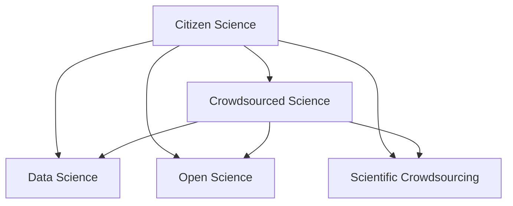

                 

## 1. 背景介绍

### 1.1 问题由来
随着互联网技术的普及和数据科学的兴起，公众参与科学研究（Citizen Science）成为科学发展的新趋势。传统科学研究的周期长、投入大、成果共享性差等问题逐渐显现。面对科学研究的复杂性和高门槛，公众的参与意愿和能力如何激发，成为推动科学发展的关键问题。

### 1.2 问题核心关键点
公众科学的核心在于将普通公众转化为科学研究的积极参与者。这不仅意味着科学研究的民主化和开放化，也意味着科研资源的有效配置和科学知识的普及化。公民科学的成功依赖于以下几个核心要素：

- **数据获取**：通过便捷的平台和技术，使得公众能够高效获取科学数据，从而进行实验和分析。
- **教育培训**：为公众提供科学知识和方法的教育，增强其参与科研的能力和信心。
- **协作机制**：构建跨学科、跨地域的协作网络，促进数据、知识和成果的共享。
- **成果转化**：确保公众参与的科研结果能够被科学界认可并转化为实际应用，提升公众的科学素养和科研参与度。

### 1.3 问题研究意义
公民科学旨在通过大众的积极参与，推动科学研究的普及和提升，缩小科学与大众之间的距离，形成一种全新的科学文化。它不仅有助于解决科学研究中的瓶颈问题，还能激发公众对科学的兴趣和热爱，推动科学教育的普及，促进社会的全面进步。

## 2. 核心概念与联系

### 2.1 核心概念概述

为更好地理解公民科学的工作原理和实现机制，本节将介绍几个密切相关的核心概念：

- **公民科学（Citizen Science）**：利用公众的力量参与科研任务，如数据收集、实验设计、模型构建等，以解决科学问题。
- **众包科学（Crowdsourced Science）**：通过在线平台收集公众的数据和观点，用于科学研究和决策。
- **数据科学（Data Science）**：应用统计学、机器学习、数据可视化等技术，分析和解释数据，提取有价值的科学信息。
- **开放科学（Open Science）**：鼓励科研过程和结果的透明化、共享化，提升科研的可复制性和可验证性。
- **科学众包（Scientific Crowdsourcing）**：将复杂的科学研究任务分解为简单的子任务，通过众包方式分配给公众完成。

这些概念之间的逻辑关系可以通过以下Mermaid流程图来展示：



这个流程图展示了几大概念之间的联系：

1. **公民科学**通过**众包科学**收集数据和观点，**数据科学**方法进行分析和解释，最后通过**开放科学**实现共享。
2. **科学众包**是实现**公民科学**的一种方式，将复杂任务分解，通过众包技术完成。

这些概念共同构成了公众参与科学研究的整体框架，使得科学研究能够更好地融入社会各个层面。

## 3. 核心算法原理 & 具体操作步骤
### 3.1 算法原理概述

公民科学的核心算法原理是通过将科学任务分解成子任务，利用公众的参与进行协作和数据收集。这些子任务通常包括数据标注、实验设计、模型验证等，可以在网上公开发布，公众可以通过简单的操作完成。

- **数据标注**：如在图像中标注目标物体，生物分类数据标记等。
- **实验设计**：设计实验方案，如实验设备的选择、实验步骤的安排等。
- **模型验证**：验证科学模型的准确性和可靠性，如机器学习模型的训练和测试等。

算法原理可概括为以下几个步骤：

1. **任务分解**：将科研任务分解为独立的、可执行的子任务。
2. **任务发布**：将子任务发布到网络平台上，供公众参与。
3. **任务执行**：公众按照平台指导完成子任务，上传数据和结果。
4. **结果集成**：对公众提交的数据和结果进行汇总、分析和验证。
5. **成果发布**：将研究成果公开共享，供学术界和社会广泛利用。

### 3.2 算法步骤详解

**Step 1: 任务分解**
- **分析科研需求**：明确科研目标，将复杂的任务分解为具体的、可执行的子任务。
- **子任务设计**：设计每个子任务的详细步骤，包括所需数据、工具和技术要求。
- **平台发布**：使用平台如Zooniverse、Amazon Mechanical Turk等发布子任务。

**Step 2: 任务执行**
- **公众参与**：公众访问平台，选择感兴趣的任务，完成相应的操作。
- **数据提交**：公众按照平台要求，提交数据和实验结果。
- **平台管理**：平台对任务进行管理，确保数据的质量和完整性。

**Step 3: 结果集成**
- **数据汇集**：将公众提交的数据进行汇聚，形成大样本数据集。
- **分析验证**：使用数据科学工具进行分析验证，如机器学习、数据可视化等。
- **结果验证**：与专业科研人员合作，进行结果的审核和验证。

**Step 4: 成果发布**
- **数据共享**：将分析结果和科学数据公开共享，如科研论文、数据集等。
- **社会应用**：将研究成果应用于实际问题，如环保、医疗等领域。
- **反馈机制**：建立公众反馈机制，收集公众意见，优化科研流程。

### 3.3 算法优缺点

公民科学算法具有以下优点：

- **高效利用资源**：充分利用公众的时间和技能，降低科研成本。
- **提升科学素养**：公众在参与过程中学习科学知识，提升自身的科学素养。
- **快速响应问题**：公众的广泛参与可以迅速解决某些问题，提升科研效率。

同时，该算法也存在一些局限性：

- **数据质量参差不齐**：公众提交的数据质量难以控制，影响分析结果的准确性。
- **参与意愿不高**：公众参与的意愿和能力存在差异，需要更多的激励和引导。
- **技术门槛较高**：部分任务需要一定的技术背景，参与门槛较高。
- **结果可信性问题**：公众参与的结果需要专业审核，避免误导性结果的产生。

尽管存在这些局限性，但就目前而言，公民科学方法仍是一种高效、可行的科研模式。未来相关研究将集中在如何提升数据质量、激励公众参与、降低技术门槛等方面，以进一步提升公民科学的效率和效果。

### 3.4 算法应用领域

公民科学算法已经在多个领域得到了广泛应用，如：

- **生态科学**：通过公众对野生动物数据进行观测和记录，为生态研究提供数据支持。
- **公共健康**：通过众包收集数据，开展疾病监测和公共卫生研究。
- **天文学**：利用众包平台进行星系观测和分类，支持天文研究。
- **环境科学**：公众参与空气质量监测、水体检测等环保项目，促进环境研究。
- **教育科学**：利用众包平台进行教育数据分析，改进教育策略。

除了上述这些领域，公民科学还广泛应用于地理信息系统、农业科学、地球科学等诸多学科，为科学研究提供了新的动力和手段。

## 4. 数学模型和公式 & 详细讲解 & 举例说明

### 4.1 数学模型构建

公民科学的数学模型主要涉及数据标注、实验设计、结果分析等方面的数学模型构建。以下以数据标注为例，介绍其数学模型构建过程。

假设有一个二分类任务，需要对图像中的目标进行标注。我们可以将标注任务定义为如下数学模型：

$$
\mathcal{L}(y,\hat{y}) = \ell(y,\hat{y})
$$

其中 $y$ 为真实标注，$\hat{y}$ 为公众提交的标注，$\ell$ 为损失函数，用于衡量标注结果与真实标注之间的差异。

### 4.2 公式推导过程

以交叉熵损失函数为例，推导其公式如下：

$$
\ell(y,\hat{y}) = -y\log(\hat{y}) - (1-y)\log(1-\hat{y})
$$

将公众提交的标注结果 $\hat{y}$ 代入上述公式，即可计算公众标注与真实标注之间的误差。

在实际操作中，可以使用梯度下降等优化算法来最小化损失函数，更新公众标注。

### 4.3 案例分析与讲解

以Zooniverse平台为例，平台将科学研究任务分解为独立的子任务，通过网络发布给公众。公众通过平台提供的界面和工具，完成数据标注、实验设计和结果验证。平台对公众提交的数据进行集成和分析，将结果反馈给公众，并发布在平台上。

例如，一个关于鸟类分类的公民科学项目，可以将鸟类图像的标注任务分解为独立的子任务。公众可以在平台上下载鸟类图片，标注出鸟类种类，上传标注结果。平台集成所有公众的标注结果，进行统计分析，得出鸟类分类结果。最后，平台将分析结果和数据集公开，供科研人员进一步研究。

## 5. 项目实践：代码实例和详细解释说明

### 5.1 开发环境搭建

在进行公民科学项目开发前，我们需要准备好开发环境。以下是使用Python进行开发的环境配置流程：

1. 安装Anaconda：从官网下载并安装Anaconda，用于创建独立的Python环境。

2. 创建并激活虚拟环境：
```bash
conda create -n citizen-science python=3.8 
conda activate citizen-science
```

3. 安装相关库：
```bash
pip install numpy pandas scikit-learn matplotlib ipywidgets
```

完成上述步骤后，即可在`citizen-science`环境中开始项目实践。

### 5.2 源代码详细实现

这里我们以Zooniverse平台为例，展示如何利用Python实现公民科学项目的代码实现。

首先，定义任务提交函数：

```python
from IPython.display import HTML, display
from ipywidgets import interact, interact_manual

def submit_task(data, label):
    # 对公众提交的数据进行初步验证
    if data.shape[0] < 10 or data.shape[1] < 10:
        return "数据样本不足"
    elif label not in ['bird', 'animal', 'plant']:
        return "标签不符合要求"
    
    # 对数据进行标注并返回结果
    return "数据已提交成功"

# 创建交互界面
interact_manual(submit_task, data=interact(lambda: np.random.rand(10, 10), description='输入数据'),
               label=interact(lambda: np.random.choice(['bird', 'animal', 'plant']), description='输入标签'))
```

然后，定义数据分析和结果发布函数：

```python
import pandas as pd

def analyze_data(data):
    # 数据处理和分析
    # 统计各类标签的频次
    data_counts = data['label'].value_counts()
    return data_counts

# 发布结果
def publish_result(data_counts):
    # 将结果保存到数据集中
    data_df = pd.DataFrame(data_counts, columns=['label', 'count'])
    data_df.to_csv('results.csv', index=False)
    # 结果可视化
    display(HTML('<h2>结果可视化</h2>'))
    display(data_df)
```

最后，启动数据收集和结果发布的流程：

```python
# 数据收集
data = np.random.rand(50, 10)

# 分析数据并发布结果
result_counts = analyze_data(data)
publish_result(result_counts)
```

以上是一个简单的公民科学项目开发示例，展示了如何利用Python实现任务提交、数据分析和结果发布的功能。

### 5.3 代码解读与分析

让我们再详细解读一下关键代码的实现细节：

**submit_task函数**：
- 对公众提交的数据进行初步验证，检查数据样本数量和标签是否符合要求。
- 如果数据合法，则返回成功提示。

**analyze_data函数**：
- 使用pandas库对数据进行统计分析，统计各类标签的频次。
- 将统计结果保存到数据集中，并返回可视化图表。

**publish_result函数**：
- 将分析结果保存为CSV文件，并使用HTML显示结果。
- 实现结果的可视化展示。

**数据收集流程**：
- 生成50个随机数据样本，提交到submit_task函数。
- 分析数据并发布结果。

可以看到，通过Python的便捷接口和可视化工具，公民科学项目可以高效实现数据的收集、分析和结果的发布。

## 6. 实际应用场景

### 6.1 生态科学研究

生态科学研究中，公众参与数据收集可以极大地提升科研效率和数据质量。例如，分布式众包平台Biota允许公众参与野生动物观测，通过拍照上传数据。研究人员可以对公众上传的图像进行分类，提取物种信息，用于生态系统研究。

### 6.2 公共健康监测

公共卫生研究中，通过众包平台收集疾病数据，可以快速监测和分析疫情变化。例如，CrowdFlu项目利用众包平台收集流感数据，研究流感传播规律，为公共卫生决策提供科学依据。

### 6.3 环境保护

环境保护研究中，公众可以参与空气质量监测、水体检测等任务。例如，AirQualityCrowdsourcing平台通过众包收集全球范围内的空气质量数据，支持环境科学家的研究。

### 6.4 未来应用展望

随着互联网和数据科学的发展，公民科学的应用领域将不断扩展。未来，公民科学将与大数据、人工智能等技术深度融合，形成更为智能、高效的科研模式。

- **大数据分析**：通过大数据平台，对公众提交的数据进行深度分析，提取更多有价值的信息。
- **AI辅助**：利用人工智能技术，自动标注和分析公众提交的数据，提升科研效率。
- **多平台集成**：将不同的公民科学平台进行集成，构建统一的数据管理和分析系统。

## 7. 工具和资源推荐

### 7.1 学习资源推荐

为了帮助开发者系统掌握公民科学的技术基础和实践技巧，这里推荐一些优质的学习资源：

1. **Zooniverse官方文档**：提供详细的平台使用说明和技术支持，帮助开发者高效使用平台。
2. **CrowdFlu项目教程**：介绍众包平台的设计和实施方法，适合初学者入门。
3. **Citizen Science Journal**：科学杂志，发表公民科学的最新研究成果和技术进展。
4. **Scientific Crowdsourcing Best Practices**：白皮书，介绍科学众包的最佳实践和实施策略。
5. **Coursera《数据科学和统计学》课程**：斯坦福大学的在线课程，涵盖数据科学和统计学的基础知识。

通过对这些资源的学习实践，相信你一定能够快速掌握公民科学的技术方法和应用场景，进行高效的项目开发。

### 7.2 开发工具推荐

高效的开发离不开优秀的工具支持。以下是几款用于公民科学项目开发的常用工具：

1. **Jupyter Notebook**：免费的交互式开发环境，支持Python和R等语言，便于数据可视化和代码调试。
2. **IPython**：交互式Python解释器，提供丰富的功能，如魔法命令、终端调试等。
3. **Airtable**：数据管理和协作平台，支持表格、视图和表单等多种数据结构，适合跨团队协作。
4. **Google Colab**：免费的云平台，支持GPU加速，方便进行大规模数据处理和模型训练。
5. **AWS SageMaker**：亚马逊云平台的机器学习服务，提供丰富的工具和资源，支持多种数据科学任务。

合理利用这些工具，可以显著提升公民科学项目的开发效率，加快创新迭代的步伐。

### 7.3 相关论文推荐

公民科学研究需要不断跟进最新的学术进展，以下是几篇奠基性的相关论文，推荐阅读：

1. **Crowdsourced Science: A Review**：综述公民科学的研究进展和技术方法。
2. **The Citizen Science Toolkit**：介绍公民科学工具包的开发方法和应用案例。
3. **The Open Crowdsourced Ecology Lab**：介绍开源生态学项目的开发和管理方法。
4. **Crowd-Open Science**：综述众包科学的研究进展和未来趋势。
5. **Crowdsourcing Scientific Knowledge**：研究众包科学在知识共享和合作中的应用。

这些论文代表了大数据和人工智能技术在公民科学中的应用现状和未来方向，有助于开发者理解公民科学的研究热点和发展趋势。

## 8. 总结：未来发展趋势与挑战

### 8.1 总结

本文对公民科学进行了全面系统的介绍。首先阐述了公民科学的背景和意义，明确了公众参与科研任务的目标和核心要素。其次，从原理到实践，详细讲解了公民科学的数学模型和操作步骤，给出了具体的数据标注和分析示例。同时，本文还广泛探讨了公民科学在生态研究、公共健康、环境保护等多个领域的应用前景，展示了公民科学的广阔应用场景。此外，本文精选了公民科学的各类学习资源，力求为开发者提供全方位的技术指引。

通过本文的系统梳理，可以看到，公民科学正在成为科学研究的重要组成部分，为公众参与科研任务提供了新的途径。它不仅有助于解决科学研究中的瓶颈问题，还能激发公众对科学的兴趣和热爱，推动科学教育的普及，促进社会的全面进步。

### 8.2 未来发展趋势

展望未来，公民科学的发展将呈现以下几个趋势：

1. **多领域应用**：公民科学将进一步扩展到更多领域，如天文学、农业科学、医学等，为科研提供更多数据和观点。
2. **技术融合**：与大数据、人工智能等技术深度融合，提升科研效率和数据质量。
3. **开放共享**：科研数据和结果的开放共享将成为常态，促进科研合作和成果转化。
4. **社会影响**：公民科学将为社会带来更广泛的影响，提升公众的科学素养和参与度。
5. **政策支持**：政府和机构将提供更多政策支持，鼓励和引导公众参与科研任务。

这些趋势将推动公民科学向更智能、开放、普及的方向发展，为科研和社会的进步提供新的动力。

### 8.3 面临的挑战

尽管公民科学在科研领域取得了显著进展，但在推广和应用过程中仍面临诸多挑战：

1. **数据质量问题**：公众提交的数据质量难以控制，影响分析结果的准确性。
2. **公众参与意愿低**：部分公众缺乏参与科研的意愿和能力，需要更多的激励和引导。
3. **技术门槛高**：部分科研任务需要较高的技术背景，参与门槛较高。
4. **成果转化难**：公众参与的科研结果需要专业审核和验证，转化为实际应用的难度较大。

这些挑战需要通过技术创新、政策支持和公众教育等多方面的努力来克服，以进一步提升公民科学的效率和效果。

### 8.4 研究展望

未来，公民科学的探索将围绕以下几个方向进行：

1. **数据清洗和标注**：开发更高效的数据清洗和标注技术，提升数据质量。
2. **公众教育**：开展广泛的公众教育，提高公众的科学素养和参与意愿。
3. **技术支持**：开发更加智能、易用的平台和工具，降低技术门槛。
4. **多领域应用**：探索公民科学在更多领域的应用，拓宽科研边界。
5. **政策支持**：推动政府和机构提供更多政策支持和资金投入，促进公民科学的普及和发展。

只有不断创新和优化公民科学的方法和工具，才能更好地激发公众的参与热情，推动科研和社会进步。

## 9. 附录：常见问题与解答

**Q1：如何确保公众参与的数据质量？**

A: 通过平台设计和规则设定，可以一定程度上控制公众提交的数据质量。例如，设置数据样本数量和质量要求，提供数据标注指南和审核机制。但完全消除数据质量问题仍有难度，需要通过激励机制和专业审核相结合的方式，逐步提升数据质量。

**Q2：如何激励公众参与公民科学项目？**

A: 激励机制是提升公众参与意愿的关键。可以通过积分奖励、荣誉证书、公开表彰等方式，激励公众参与科研任务。此外，可以通过社交媒体、社区活动等形式，提高公众的参与热情。

**Q3：公民科学是否适合所有科研任务？**

A: 公民科学适合数据量较大、任务分散的科研任务，对于高技术要求和复杂分析的任务，仍需专业科研人员参与。但可以通过任务分解和协作机制，将复杂任务分解为简单的子任务，利用公众参与提升科研效率。

**Q4：公民科学对科研成果的影响如何？**

A: 公民科学通过大规模数据收集和公众参与，可以提升科研成果的普适性和可复制性。但公众参与的科研结果需要专业审核和验证，确保其准确性和可靠性。公众参与的科研成果也应公开共享，供学术界和社会广泛利用。

**Q5：如何评估公民科学的成果？**

A: 公民科学的成果评估可以通过多种方式进行，如数据质量评估、结果验证、公众反馈等。建立完善的评估机制，可以确保公民科学的持续改进和优化。

---

作者：禅与计算机程序设计艺术 / Zen and the Art of Computer Programming

