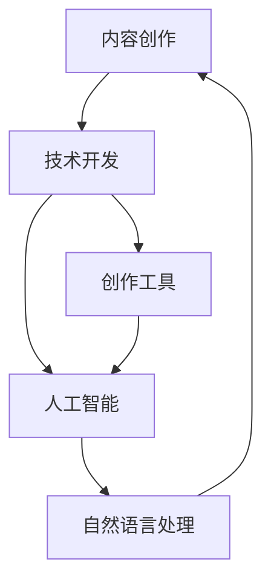

                 

# 内容创作与技术开发的完美结合

> 关键词：内容创作, 技术开发, 创作工具, 智能辅助, 创新方法, 用户中心, 跨界融合

## 1. 背景介绍

### 1.1 问题由来
随着信息时代的到来，内容创作已经成为了各行各业的重要组成部分。无论是传统的媒体出版，还是新兴的互联网行业，内容创作的质量和效率都直接关系到企业的市场竞争力。然而，人工创作面临诸多挑战，包括创作成本高、周期长、主观性等问题。

为了解决这些问题，技术开发人员纷纷尝试引入自动化技术来辅助内容创作，希望通过技术手段提升创作质量和效率。由此，内容创作与技术开发紧密结合，逐渐形成了一个新的交叉学科。

### 1.2 问题核心关键点
内容创作与技术开发结合的关键点包括以下几点：

- **内容创作的本质与技术辅助**：理解内容创作的本质是逻辑、情感和语言的交织，而技术辅助在于提供数据驱动、逻辑推理、自动化排版等支持。
- **创作工具的智能化**：开发高效、易用的创作工具，并引入AI技术，实现内容智能生成、质量自动评估、风格转换等功能。
- **用户需求与技术开发的联动**：围绕用户需求进行技术开发，以用户为中心，实现内容创作的技术支持。
- **跨界融合与创新**：内容创作和人工智能技术的深度结合，开拓新的内容形式和创作方式，促进创作领域的创新发展。

这些核心关键点构成了内容创作与技术开发结合的基础，推动着相关技术的研究和应用不断深入。

## 2. 核心概念与联系

### 2.1 核心概念概述

为更好地理解内容创作与技术开发的结合，本节将介绍几个密切相关的核心概念：

- **内容创作**：指通过文字、图像、视频等媒介，表达思想、传递信息、分享知识的过程。内容创作不仅是艺术创作，更是商业活动的重要组成部分。

- **技术开发**：指通过软件开发、系统集成、算法设计等手段，实现对内容的自动化处理、智能化生成、精准化匹配等功能。技术开发是内容创作的重要支持，也是推动内容创新的关键力量。

- **创作工具**：指辅助内容创作者进行文本编辑、图形设计、视频剪辑等操作的软硬件工具。创作工具的智能化、人性化、易用性直接影响到内容创作的效果和效率。

- **人工智能(AI)**：指利用计算机模拟、延伸和扩展人的智能，实现自动化、智能化的技术体系。在内容创作中，AI技术主要用于内容生成、质量评估、风格转换等环节。

- **自然语言处理(NLP)**：指通过计算机理解和处理自然语言的技术，包括语音识别、语义分析、文本生成等。NLP在内容创作中应用广泛，如智能写作助手、内容推荐、情感分析等。

这些核心概念之间的逻辑关系可以通过以下Mermaid流程图来展示：



这个流程图展示了大语言模型微调的核心概念及其之间的关系：

1. 内容创作通过技术开发获得辅助，创作工具和人工智能技术为其提供支持和创新。
2. 人工智能技术特别是自然语言处理，与内容创作紧密结合，推动了创作工具的智能化发展。
3. 创作工具和人工智能技术的深度结合，使得内容创作更加智能化、高效化、个性化。

## 3. 核心算法原理 & 具体操作步骤
### 3.1 算法原理概述

内容创作与技术开发的结合，本质上是通过技术手段提升内容创作的质量和效率。其核心思想是利用数据驱动和算法设计，自动化地完成内容生成的部分或全部过程。

形式化地，假设内容创作的输入为 $X$（如文字、图片等），输出为 $Y$（如文章、图像等）。内容创作的过程可以表示为 $f: X \rightarrow Y$，其中 $f$ 为一个映射函数。而技术开发的目标是通过算法优化和工具设计，使得 $f$ 尽可能高效、精准地执行。

常用的技术手段包括：

- **自动化排版**：使用算法和工具自动生成文章格式，优化版面设计。
- **内容生成**：通过机器学习模型，自动生成高质量的文章、图像、视频等。
- **内容优化**：利用自然语言处理技术，自动修正语法错误、调整文章风格等。
- **内容推荐**：根据用户兴趣和历史行为，推荐相关内容。

### 3.2 算法步骤详解

内容创作与技术开发的结合一般包括以下几个关键步骤：

**Step 1: 需求分析和需求设计**
- 明确内容创作的需求，如生成速度、内容质量、风格要求等。
- 设计具体的技术方案，选择合适的算法和工具。

**Step 2: 数据准备和模型训练**
- 收集、处理相关数据，构建数据集。
- 训练模型，选择合适的损失函数、优化算法、超参数等。

**Step 3: 工具开发和集成**
- 开发或选择符合需求的技术工具，如文本编辑器、图像处理软件等。
- 集成技术工具，形成自动化内容创作系统。

**Step 4: 内容创作与迭代优化**
- 利用技术工具辅助内容创作，自动化生成、优化内容。
- 根据用户反馈和创作效果，不断迭代优化技术方案。

**Step 5: 用户交互与反馈收集**
- 提供用户交互界面，方便用户操作和内容上传。
- 收集用户反馈，持续改进创作工具和内容生成算法。

### 3.3 算法优缺点

内容创作与技术开发结合的方法具有以下优点：

- **提升效率**：通过自动化技术辅助创作，大幅缩短内容创作时间。
- **降低成本**：减少人工操作，降低人力成本。
- **提升质量**：利用算法优化和自动化检测，提升内容质量和一致性。
- **创新可能性**：实现跨界融合，开拓新的内容形式和创作方式。

同时，该方法也存在一定的局限性：

- **依赖数据**：技术辅助依赖高质量的数据和算法，数据不足或算法不合理会导致创作效果不佳。
- **缺乏灵活性**：自动化生成的内容可能缺乏人情味，难以满足复杂多样的创作需求。
- **技术门槛高**：技术开发需要一定的技术储备，对于一些小型创作团队可能难以实现。
- **依赖人类创造力**：技术辅助只是辅助手段，最终的创意和情感表达仍需依赖人类创作者的灵感和经验。

尽管存在这些局限性，但就目前而言，内容创作与技术开发的结合已成为提升内容创作效率和质量的重要手段。未来相关研究的重点在于如何进一步降低技术辅助对数据的依赖，提高创作过程的灵活性和可控性，同时兼顾内容创作的技术创新和人类创意的自由表达。

### 3.4 算法应用领域

内容创作与技术开发的结合，已经在多个领域得到了广泛应用，例如：

- **新闻编辑**：通过自动排版、语法检查等技术辅助，提高新闻文章的生产效率和质量。
- **内容推荐**：利用用户行为数据和机器学习模型，自动推荐相关内容，提升用户体验。
- **内容生成**：使用自然语言生成模型，自动生成新闻、文章、广告等文本内容。
- **视觉设计**：通过图像生成和风格迁移技术，自动化设计平面广告、网站界面等。
- **视频制作**：利用视频生成和编辑工具，自动化制作短视频、广告片等。

除了上述这些经典应用外，内容创作与技术开发的结合还在不断拓展，如智能写作助手、内容审核、情感分析等，为内容创作带来了全新的突破。

## 4. 数学模型和公式 & 详细讲解 & 举例说明
### 4.1 数学模型构建

本节将使用数学语言对内容创作与技术开发的结合进行更加严格的刻画。

假设内容创作的输入为文本 $X$，输出为文本 $Y$。内容创作的过程可以表示为 $f: X \rightarrow Y$，其中 $f$ 为一个映射函数。我们希望通过技术手段优化 $f$，使得输出 $Y$ 尽可能符合预期。

形式化地，我们希望构建一个模型 $M_{\theta}$，通过最小化损失函数 $\mathcal{L}$，使 $M_{\theta}$ 能够精确地映射输入 $X$ 到输出 $Y$。具体地，我们定义损失函数为：

$$
\mathcal{L}(M_{\theta}) = \frac{1}{N} \sum_{i=1}^N \ell(f(X_i), M_{\theta}(X_i))
$$

其中，$\ell$ 为具体的损失函数（如均方误差、交叉熵等），$N$ 为数据集的大小。目标是最小化损失函数，得到最优参数 $\theta$。

### 4.2 公式推导过程

以下我们以文本生成的为例，推导自动生成文本的数学模型。

假设文本生成模型为 $M_{\theta}$，输入为序列 $x_1,...,x_n$，输出为序列 $y_1,...,y_n$。则文本生成的目标是最小化预测序列和真实序列之间的差距，可以表示为：

$$
\mathcal{L}(M_{\theta}) = -\frac{1}{N} \sum_{i=1}^N \log p(y_1,...,y_n | x_1,...,x_n)
$$

其中 $p(y_1,...,y_n | x_1,...,x_n)$ 为模型在给定输入序列 $x_1,...,x_n$ 下生成序列 $y_1,...,y_n$ 的概率分布。通常使用语言模型作为 $M_{\theta}$，其概率分布可以通过反向传播算法高效计算。

在实际应用中，为了提高文本生成的多样性和创新性，我们通常引入条件生成模型，利用上下文信息 $x_1,...,x_n$ 辅助生成文本。条件生成模型的损失函数可以表示为：

$$
\mathcal{L}(M_{\theta}) = -\frac{1}{N} \sum_{i=1}^N \log p(y_1,...,y_n | x_1,...,x_n)
$$

其中，$p(y_1,...,y_n | x_1,...,x_n)$ 为条件生成模型在给定输入序列 $x_1,...,x_n$ 下生成序列 $y_1,...,y_n$ 的概率分布。

### 4.3 案例分析与讲解

以下我们以新闻自动化生成为例，展示内容创作与技术开发的结合。

新闻自动生成的目标是通过对新闻语料库进行预训练，学习新闻文章的特征，然后利用这些特征自动生成新闻标题和正文。具体步骤如下：

1. **数据准备**：收集新闻语料库，将每篇新闻文章分成标题和正文两个部分，并进行标注。
2. **模型训练**：使用预训练的Transformer模型，对新闻标题和正文进行联合训练，学习文章的结构和内容特征。
3. **自动生成**：给定新闻事件或关键词，利用训练好的模型自动生成新闻标题和正文。
4. **质量评估**：通过人工审核和自动评估指标（如BLEU值、ROUGE值等）评估生成新闻的质量，不断优化模型参数。

通过这种自动化的新闻生成流程，可以在短时间内生成大量高质量的新闻内容，显著提高新闻编辑的工作效率。

## 5. 项目实践：代码实例和详细解释说明
### 5.1 开发环境搭建

在进行内容创作与技术开发的结合实践前，我们需要准备好开发环境。以下是使用Python进行TensorFlow开发的环境配置流程：

1. 安装Anaconda：从官网下载并安装Anaconda，用于创建独立的Python环境。

2. 创建并激活虚拟环境：
```bash
conda create -n tf-env python=3.8 
conda activate tf-env
```

3. 安装TensorFlow：根据CUDA版本，从官网获取对应的安装命令。例如：
```bash
conda install tensorflow -c tf -c conda-forge
```

4. 安装各类工具包：
```bash
pip install numpy pandas scikit-learn matplotlib tqdm jupyter notebook ipython
```

完成上述步骤后，即可在`tf-env`环境中开始内容创作与技术开发的结合实践。

### 5.2 源代码详细实现

下面我们以文本生成为例，给出使用TensorFlow实现的新闻自动生成的PyTorch代码实现。

首先，定义新闻自动生成的模型：

```python
import tensorflow as tf
from tensorflow.keras.layers import Input, Dense, LSTM, Embedding
from tensorflow.keras.models import Model

# 定义模型输入
inputs = Input(shape=(None,))
targets = Input(shape=(None,))

# 定义LSTM层
lstm = LSTM(256, return_sequences=True)(inputs)

# 定义输出层
outputs = Dense(1, activation='sigmoid')(lstm)

# 定义模型
model = Model(inputs=inputs, outputs=outputs)
```

然后，定义训练和评估函数：

```python
from tensorflow.keras.optimizers import Adam
from tensorflow.keras.losses import binary_crossentropy

# 定义优化器和损失函数
optimizer = Adam(lr=0.001)
loss = binary_crossentropy

# 训练函数
def train(model, train_data, batch_size, epochs):
    for epoch in range(epochs):
        for i in range(0, len(train_data), batch_size):
            batch_x, batch_y = train_data[i:i+batch_size]
            loss_value = model.train_on_batch(batch_x, batch_y)
            print('Epoch {}: loss={:.4f}'.format(epoch+1, loss_value))

# 评估函数
def evaluate(model, test_data, batch_size):
    correct = 0
    total = 0
    for i in range(0, len(test_data), batch_size):
        batch_x, batch_y = test_data[i:i+batch_size]
        y_pred = model.predict(batch_x)
        correct += np.sum(y_pred > 0.5)
        total += batch_x.shape[0]
    acc = correct / total
    print('Test acc: {:.4f}'.format(acc))
```

最后，启动训练流程并在测试集上评估：

```python
train_data = ...
test_data = ...

train(model, train_data, batch_size=32, epochs=10)
evaluate(model, test_data, batch_size=32)
```

以上就是使用TensorFlow实现新闻自动生成的完整代码实现。可以看到，得益于TensorFlow的强大封装，我们可以用相对简洁的代码完成新闻自动生成的建模和训练。

### 5.3 代码解读与分析

让我们再详细解读一下关键代码的实现细节：

**Model定义**：
- 通过Input层定义模型的输入和输出，输入为可变长度的序列数据。
- 使用LSTM层对输入序列进行处理，学习序列的长期依赖关系。
- 使用Dense层对LSTM的输出进行映射，生成最终的新闻文本。

**训练和评估函数**：
- 使用Adam优化器和二元交叉熵损失函数进行训练。
- 通过模型.train_on_batch方法在每个批次上进行训练，并计算损失。
- 通过模型.predict方法在每个批次上进行预测，并计算准确率。
- 通过不断迭代，更新模型参数，优化新闻生成质量。

**训练流程**：
- 定义训练数据和测试数据，准备训练和评估数据。
- 在每个epoch内，对训练数据进行迭代训练。
- 在每个epoch结束后，在测试集上评估模型性能。
- 重复上述步骤，直到模型收敛或达到预设的迭代轮数。

可以看到，TensorFlow配合Keras的强大封装，使得新闻自动生成的代码实现变得简洁高效。开发者可以将更多精力放在数据处理、模型改进等高层逻辑上，而不必过多关注底层的实现细节。

当然，工业级的系统实现还需考虑更多因素，如模型的保存和部署、超参数的自动搜索、更灵活的任务适配层等。但核心的技术框架和算法思路基本与此类似。

## 6. 实际应用场景
### 6.1 智能写作助手

智能写作助手是内容创作与技术开发的典型应用场景。传统的内容创作过程往往需要大量的资料查询、信息整合和写作技巧的积累。通过智能写作助手，可以大大提升写作效率，减少重复劳动，增强文章质量。

智能写作助手的核心技术包括：

- **内容推荐**：根据用户的写作主题和风格，推荐相关的参考资料、写作范例等。
- **语法检查**：实时检查文章的语法和拼写错误，并提供修改建议。
- **风格转换**：自动调整文章的语气、风格，适应不同的写作场合和读者群体。
- **内容生成**：通过自然语言生成模型，自动生成文章段落或整篇文章，辅助创作者完成初稿。

通过这些技术，智能写作助手能够有效减轻创作者的工作负担，提升创作质量。

### 6.2 内容智能推荐

内容智能推荐系统利用机器学习算法和自然语言处理技术，根据用户的历史行为和偏好，自动推荐相关内容，提升用户体验。

内容智能推荐系统的核心技术包括：

- **用户画像**：通过分析用户的浏览历史、点击行为等，建立用户画像，理解用户的兴趣和需求。
- **内容标签**：对不同内容进行标签化，建立内容库。
- **推荐算法**：利用协同过滤、基于内容的推荐、深度学习等算法，计算用户和内容的相关度，推荐最相关的文章、视频、新闻等。

通过内容智能推荐系统，用户能够快速获取感兴趣的内容，提升信息获取效率，增强内容消费体验。

### 6.3 智能广告创意

智能广告创意系统通过分析用户行为和市场趋势，自动生成广告文案和素材，提升广告投放的精准度和效果。

智能广告创意系统的核心技术包括：

- **用户行为分析**：通过分析用户的浏览历史、搜索记录等，理解用户的兴趣和需求。
- **广告素材生成**：利用自然语言生成和图像生成技术，自动生成广告文案和素材。
- **广告效果评估**：通过A/B测试等方法，评估广告创意的效果，优化广告素材和投放策略。

通过智能广告创意系统，广告主能够快速生成高质量的广告创意，提升广告投放的精准度和效果，降低广告投放成本。

### 6.4 未来应用展望

随着内容创作与技术开发的结合不断深入，未来将涌现更多的创新应用场景：

- **虚拟内容创作**：通过人工智能生成虚拟形象、虚拟故事等，拓展内容创作的边界。
- **跨模态内容创作**：利用计算机视觉和自然语言处理技术，实现文本、图像、视频的协同创作。
- **智能辅助教学**：利用自然语言理解和生成技术，自动生成教学内容、辅助教学任务，提升教学效果。
- **内容版权保护**：利用区块链和人工智能技术，实现内容版权的自动化管理和保护。

以上趋势凸显了内容创作与技术开发结合的广阔前景。这些方向的探索发展，必将进一步提升内容创作的质量和效率，推动内容产业的创新发展。

## 7. 工具和资源推荐
### 7.1 学习资源推荐

为了帮助开发者系统掌握内容创作与技术开发的结合理论基础和实践技巧，这里推荐一些优质的学习资源：

1. TensorFlow官方文档：TensorFlow是内容创作与技术开发的重要工具，其官方文档提供了详细的教程、示例和API文档，是学习和实践的重要参考。

2. Keras官方文档：Keras是TensorFlow的高层次API，提供了简洁高效的模型构建方式，适合初学者快速上手。

3. PyTorch官方文档：PyTorch是深度学习领域的另一个重要框架，其官方文档也提供了丰富的教程和示例。

4. Udacity深度学习纳米学位：Udacity提供的深度学习课程，涵盖了从基础到进阶的内容，适合不同层次的开发者。

5. Coursera机器学习课程：Coursera由斯坦福大学教授Andrew Ng开设的机器学习课程，是学习机器学习的重要资源。

6. 《Python深度学习》书籍：Francois Chollet编写的这本书，系统介绍了TensorFlow和Keras的用法，适合深入学习和实践。

通过对这些资源的学习实践，相信你一定能够快速掌握内容创作与技术开发的结合精髓，并用于解决实际的内容创作问题。

### 7.2 开发工具推荐

高效的开发离不开优秀的工具支持。以下是几款用于内容创作与技术开发结合的常用工具：

1. Jupyter Notebook：Jupyter Notebook是一个交互式编程环境，支持Python、TensorFlow等多种语言，适合做数据探索和模型实验。

2. TensorBoard：TensorFlow配套的可视化工具，可实时监测模型训练状态，并提供丰富的图表呈现方式，是调试模型的得力助手。

3. Weights & Biases：模型训练的实验跟踪工具，可以记录和可视化模型训练过程中的各项指标，方便对比和调优。

4. GitHub：GitHub是一个版本控制系统，适合协同开发和代码托管，是内容创作与技术开发结合的常用工具。

5. Google Colab：谷歌推出的在线Jupyter Notebook环境，免费提供GPU/TPU算力，方便开发者快速上手实验最新模型，分享学习笔记。

合理利用这些工具，可以显著提升内容创作与技术开发结合的开发效率，加快创新迭代的步伐。

### 7.3 相关论文推荐

内容创作与技术开发的结合源于学界的持续研究。以下是几篇奠基性的相关论文，推荐阅读：

1. Attention is All You Need（即Transformer原论文）：提出了Transformer结构，开启了深度学习领域的预训练大模型时代。

2. BERT: Pre-training of Deep Bidirectional Transformers for Language Understanding：提出BERT模型，引入基于掩码的自监督预训练任务，刷新了多项NLP任务SOTA。

3. TextGAN: Generative Adversarial Text Editing：提出文本生成对抗网络，实现了文本的修改和生成，提升了内容创作的灵活性。

4. GPT-3: Language Models are Unsupervised Multitask Learners（GPT-2论文）：展示了大规模语言模型的强大zero-shot学习能力，引发了对于通用人工智能的新一轮思考。

5. Deep Learning for Content Creation: A Survey：一篇系统综述论文，总结了当前内容创作与技术开发结合的研究成果和技术趋势。

这些论文代表了大语言模型微调技术的发展脉络。通过学习这些前沿成果，可以帮助研究者把握学科前进方向，激发更多的创新灵感。

## 8. 总结：未来发展趋势与挑战

### 8.1 总结

本文对内容创作与技术开发的结合进行了全面系统的介绍。首先阐述了内容创作与技术开发的结合背景和意义，明确了技术辅助在提升创作效率和质量方面的独特价值。其次，从原理到实践，详细讲解了内容创作与技术开发结合的数学原理和关键步骤，给出了内容创作与技术开发的结合完整代码实例。同时，本文还广泛探讨了内容创作与技术开发结合在智能写作助手、内容智能推荐、智能广告创意等多个行业领域的应用前景，展示了内容创作与技术开发结合的巨大潜力。此外，本文精选了内容创作与技术开发结合的学习资源，力求为读者提供全方位的技术指引。

通过本文的系统梳理，可以看到，内容创作与技术开发的结合已经成为了提升内容创作效率和质量的重要手段，极大地拓展了内容创作的可能性。未来，伴随技术手段的不断创新和完善，内容创作与技术开发结合必将在更多领域得到应用，为内容产业带来新的变革性影响。

### 8.2 未来发展趋势

展望未来，内容创作与技术开发的结合将呈现以下几个发展趋势：

1. **智能化创作工具普及**：内容创作工具将越来越智能化，能够自动生成、优化、评估内容，提高创作效率和质量。
2. **跨模态内容创作兴起**：计算机视觉和自然语言处理技术的深度结合，将催生跨模态内容创作，如文本与图像、视频结合的创作。
3. **个性化内容创作发展**：利用用户画像、情感分析等技术，实现内容创作的个性化推荐和适配。
4. **内容版权保护加强**：利用区块链和人工智能技术，实现内容版权的自动化管理和保护，提升内容创作的经济效益。
5. **全球化内容创作兴起**：借助翻译和生成技术，实现多语言内容创作，开拓全球化市场。

以上趋势凸显了内容创作与技术开发结合的广阔前景。这些方向的探索发展，必将进一步提升内容创作的质量和效率，推动内容产业的创新发展。

### 8.3 面临的挑战

尽管内容创作与技术开发的结合已经取得了显著进展，但在迈向更加智能化、普适化应用的过程中，仍面临诸多挑战：

1. **依赖数据**：内容创作与技术开发依赖高质量的数据和算法，数据不足或算法不合理会导致创作效果不佳。
2. **技术门槛高**：内容创作与技术开发需要一定的技术储备，对于一些小型创作团队可能难以实现。
3. **缺乏创意**：自动化生成的内容可能缺乏人情味，难以满足复杂多样的创作需求。
4. **技术风险**：内容创作与技术开发依赖复杂的算法和模型，技术风险较高，可能导致内容质量不稳定。

尽管存在这些挑战，但随着技术手段的不断创新和完善，内容创作与技术开发结合必将在更多领域得到应用，为内容产业带来新的变革性影响。相信随着学界和产业界的共同努力，这些挑战终将一一被克服，内容创作与技术开发结合必将在构建人机协同的智能时代中扮演越来越重要的角色。

### 8.4 研究展望

面向未来，内容创作与技术开发结合的研究需要在以下几个方面寻求新的突破：

1. **多模态内容创作**：将视觉、听觉、文本等多模态信息结合，拓展内容创作的丰富性和多样性。
2. **深度学习与符号逻辑结合**：将深度学习与符号逻辑相结合，实现内容创作中的逻辑推理和知识表达。
3. **跨文化内容创作**：利用翻译和生成技术，实现多语言内容创作，推动内容创作的全球化进程。
4. **情感驱动内容创作**：利用情感分析技术，生成情感驱动的内容，提升内容创作的人性化和感染力。
5. **用户参与内容创作**：利用众包技术，让用户参与内容创作，增强内容的真实性和多样性。

这些研究方向的研究突破，必将引领内容创作与技术开发结合技术的持续进步，为内容产业带来新的变革性影响。

## 9. 附录：常见问题与解答

**Q1：内容创作与技术开发结合是否适用于所有内容形式？**

A: 内容创作与技术开发结合的方法适用于多种内容形式，包括文字、图片、视频、音频等。通过技术手段，可以自动生成、优化、评估各种形式的内容，提升创作效率和质量。

**Q2：内容创作与技术开发结合需要哪些技术储备？**

A: 内容创作与技术开发结合需要掌握自然语言处理、机器学习、计算机视觉等技术，还需要了解数据处理、模型训练、系统集成等方面的知识。可以通过在线课程、官方文档、开源项目等资源进行学习和实践。

**Q3：内容创作与技术开发结合是否有局限性？**

A: 内容创作与技术开发结合虽然提升了创作效率和质量，但仍有一定的局限性。自动化生成的内容可能缺乏人情味，难以满足复杂多样的创作需求。此外，技术手段的复杂性也增加了内容创作的门槛。

**Q4：如何提升内容创作与技术开发结合的效果？**

A: 提升内容创作与技术开发结合的效果需要多方面努力，包括：
1. 收集高质量的数据，训练高效、准确的模型。
2. 选择合适的技术手段，满足不同内容形式的创作需求。
3. 不断优化创作工具，提升用户体验。
4. 鼓励用户参与，增强内容的多样性和真实性。

**Q5：内容创作与技术开发结合的未来发展方向是什么？**

A: 内容创作与技术开发结合的未来发展方向包括：
1. 智能化创作工具普及。内容创作工具将越来越智能化，能够自动生成、优化、评估内容。
2. 跨模态内容创作兴起。计算机视觉和自然语言处理技术的深度结合，将催生跨模态内容创作，如文本与图像、视频结合的创作。
3. 个性化内容创作发展。利用用户画像、情感分析等技术，实现内容创作的个性化推荐和适配。
4. 内容版权保护加强。利用区块链和人工智能技术，实现内容版权的自动化管理和保护，提升内容创作的经济效益。

以上方向将推动内容创作与技术开发结合技术的持续进步，为内容产业带来新的变革性影响。

---

作者：禅与计算机程序设计艺术 / Zen and the Art of Computer Programming

