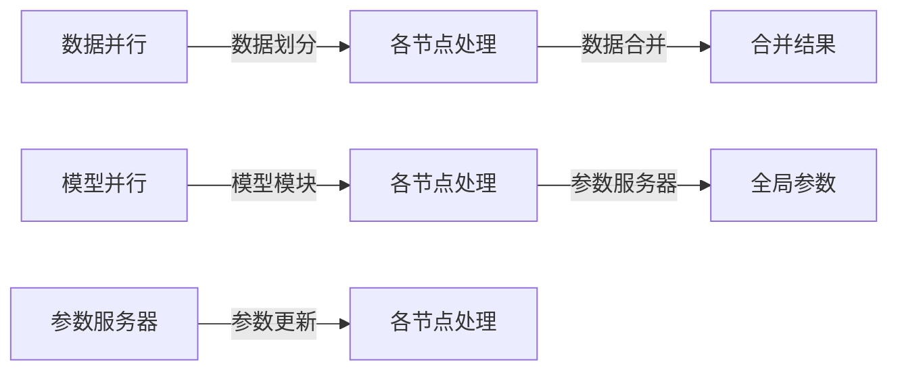
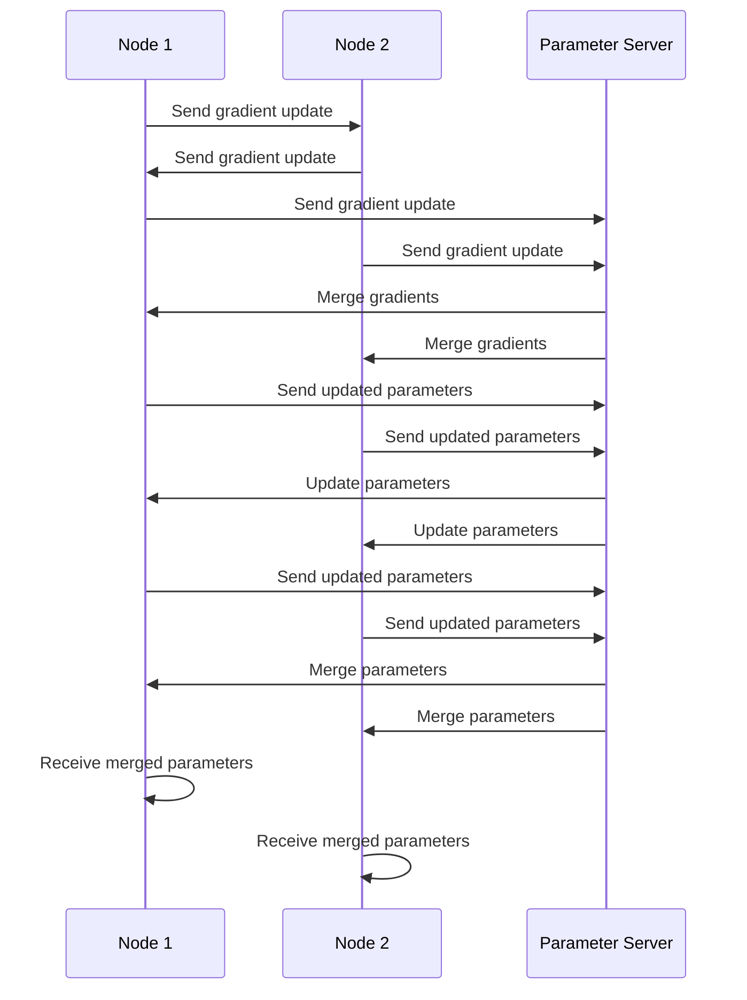

                 

# 分布式AI：突破单机限制的训练方法

## 1. 背景介绍

随着深度学习和大规模数据集的日益普及，单机的训练能力逐渐成为AI研究的瓶颈。传统的单机模型训练方法，如前向传播和反向传播，面临着计算资源受限、内存访问瓶颈等问题，难以有效应对大规模模型的训练需求。分布式AI技术应运而生，通过并行化计算、参数服务器等手段，大幅提升模型训练效率，成为目前AI领域的重要研究热点。

本论文将详细介绍分布式AI的核心概念、算法原理和实践案例，探讨其在实际应用中的挑战和解决方案，为AI开发者提供全面的技术指引。

## 2. 核心概念与联系

### 2.1 核心概念概述

为更好地理解分布式AI的原理和应用，本节将介绍几个密切相关的核心概念：

- **分布式计算**：指将大规模任务分解为多个子任务，在不同的计算节点上并行执行的计算方式。分布式AI就是利用分布式计算的方式，优化模型的训练过程。
- **参数服务器**：负责存储和同步模型参数，并通过所有参与计算的节点共享模型权重。参数服务器为模型训练提供统一的参数视图，降低节点间通信开销。
- **数据并行**：将大规模数据集划分为多个子集，在不同的节点上独立处理，最后将结果合并。数据并行适用于单任务但数据量巨大的场景。
- **模型并行**：将模型的不同层次或不同子模块分配到不同的计算节点上并行处理，适用于大规模模型的训练。
- **异步更新**：在分布式训练中，各节点可以独立更新模型参数，不一定需要同步更新。异步更新可以进一步提高并行度，但需要协调不同节点的更新冲突。

### 2.2 核心概念联系

下图展示了分布式AI的关键组件和数据流向。其中，数据并行和模型并行是分布式计算的两种方式，参数服务器负责全局参数管理，各节点异步更新模型参数。



## 3. 核心算法原理 & 具体操作步骤

### 3.1 算法原理概述

分布式AI的训练过程可以分解为数据流计算和模型参数更新的两个核心步骤。

**数据流计算**：将大规模数据集划分为多个子集，在不同的计算节点上独立处理，最后将结果合并。数据并行可以显著提高计算效率，但需要保证数据的连续性和一致性。

**模型参数更新**：每个计算节点独立更新模型参数，最终通过参数服务器将各节点更新的参数进行合并。异步更新方式可以进一步提高并行度，但需要协调不同节点之间的更新冲突。

### 3.2 算法步骤详解

**Step 1: 分布式计算平台搭建**

1. 选择分布式计算框架：如Apache Spark、TensorFlow、PyTorch等。
2. 搭建分布式计算集群：包括节点部署、网络配置等。
3. 选择并行计算模式：数据并行或模型并行。

**Step 2: 参数服务器设计**

1. 选择合适的参数服务器：如.etcd、Zookeeper等。
2. 实现参数更新协议：支持读写锁、乐观锁等机制，防止冲突。
3. 设计参数分布策略：保证数据均衡，减少通信开销。

**Step 3: 计算节点配置**

1. 配置硬件资源：如CPU、GPU、内存等。
2. 设计计算任务：将大规模模型划分为多个层次或模块。
3. 实现计算任务：使用分布式计算框架实现任务并行处理。

**Step 4: 模型参数更新**

1. 定义参数更新机制：选择同步或异步更新方式。
2. 实现参数更新逻辑：在计算节点上更新模型参数，并通知参数服务器。
3. 处理参数冲突：采用乐观锁、版本号等机制，保证参数更新的一致性。

**Step 5: 性能优化**

1. 网络通信优化：减少数据传输量和通信延迟。
2. 内存管理优化：采用数据分块、内存缓存等策略，提高内存访问效率。
3. 负载均衡优化：动态调整节点负载，平衡计算压力。

### 3.3 算法优缺点

分布式AI的训练方法具有以下优点：
1. 高效并行：通过数据并行和模型并行，可以显著提高模型训练速度。
2. 弹性扩展：通过增加计算节点，可以动态扩展计算能力，适应大规模模型和数据集的训练需求。
3. 容错性强：各计算节点独立运行，容错能力强，单节点故障不会影响整体训练。

同时，分布式AI也存在一些缺点：
1. 通信开销：节点间频繁的数据通信和参数同步会增加通信开销。
2. 一致性问题：多节点并发更新参数时，一致性问题难以保证。
3. 资源分配：如何合理分配计算资源，平衡节点间负载，仍需进一步优化。

### 3.4 算法应用领域

分布式AI的训练方法广泛适用于各类大规模模型和数据集的训练，例如：

- 计算机视觉：如图像分类、目标检测、人脸识别等任务。
- 自然语言处理：如文本分类、情感分析、机器翻译等任务。
- 语音识别：如语音转文本、语音情感识别等任务。
- 推荐系统：如用户行为分析、商品推荐等任务。

## 4. 数学模型和公式 & 详细讲解 & 举例说明

### 4.1 数学模型构建

在分布式AI的训练中，模型参数更新可以看作是一个全局最优化的过程。设模型参数为 $\theta$，数据集为 $\{(x_i, y_i)\}_{i=1}^N$，其中 $x_i$ 为输入，$y_i$ 为标签。模型损失函数为 $L(\theta, x_i, y_i)$，目标是最小化损失函数 $J(\theta) = \frac{1}{N}\sum_{i=1}^N L(\theta, x_i, y_i)$。

### 4.2 公式推导过程

在分布式训练中，每个计算节点独立更新模型参数，更新公式为：

$$
\theta_i \leftarrow \theta_i - \eta \nabla_{\theta_i}L(\theta_i, x_i, y_i)
$$

其中 $\eta$ 为学习率，$\nabla_{\theta_i}L(\theta_i, x_i, y_i)$ 为节点 $i$ 的损失函数梯度。所有节点更新完成后，将参数上传到参数服务器，合并得到全局参数：

$$
\theta \leftarrow \frac{1}{M}\sum_{i=1}^M \theta_i
$$

其中 $M$ 为节点数。参数更新过程如下图所示：



### 4.3 案例分析与讲解

以下以图像分类任务为例，展示分布式AI的训练过程。

首先，准备训练数据集，并将其划分为多个子集：

```python
import torch
import torchvision.datasets as datasets
import torchvision.transforms as transforms
import torch.utils.data.distributed.DistributedSampler as DistributedSampler

# 准备训练数据集
train_dataset = datasets.CIFAR10(root='./data', train=True, download=True, transform=transforms.ToTensor())
train_sampler = DistributedSampler(train_dataset, num_replicas=8, rank=0)

# 划分训练数据集
train_loader = torch.utils.data.DataLoader(train_dataset, batch_size=64, shuffle=True, drop_last=True, sampler=train_sampler)
```

然后，搭建分布式训练框架，并定义参数服务器：

```python
import torch.distributed as dist

# 初始化分布式环境
dist.init_process_group(backend='nccl', init_method='env://')

# 定义参数服务器
param_server = ParameterServer()
```

接着，在多个计算节点上并行计算模型参数：

```python
import torch.nn as nn
import torch.nn.parallel as parallel
import torch.distributed as dist

# 定义模型
model = nn.Conv2d(3, 64, 3, stride=1, padding=1)
model.cuda()

# 定义并行模块
model_parallel = parallel.DataParallel(model)

# 定义计算任务
def compute_task(inputs):
    return model_parallel(inputs)

# 在计算节点上并行计算
dist.spawn(compute_task, inputs=train_loader, group=dist.group.WORLD)
```

最后，合并参数并更新模型：

```python
import torch.optim as optim

# 定义优化器
optimizer = optim.SGD(model.parameters(), lr=0.01, momentum=0.9)

# 合并参数并更新模型
param_server.merge_parameters()
optimizer.step()

# 更新模型参数
for param in model.parameters():
    param.data = param_server.get_parameter(param)
```

通过以上步骤，实现了分布式AI的图像分类任务训练。可以看到，分布式训练通过并行计算和参数同步，极大地提升了模型训练效率。

## 5. 项目实践：代码实例和详细解释说明

### 5.1 开发环境搭建

在进行分布式AI的实践前，我们需要准备好开发环境。以下是使用Python进行PyTorch开发的环境配置流程：

1. 安装Anaconda：从官网下载并安装Anaconda，用于创建独立的Python环境。

2. 创建并激活虚拟环境：
```bash
conda create -n distai python=3.8 
conda activate distai
```

3. 安装PyTorch：根据CUDA版本，从官网获取对应的安装命令。例如：
```bash
conda install pytorch torchvision torchaudio cudatoolkit=11.1 -c pytorch -c conda-forge
```

4. 安装Distributed Packages：
```bash
conda install torch.distributed -c conda-forge
```

5. 安装分布式计算框架：
```bash
conda install torch.distributed.distributed_c10d
```

完成上述步骤后，即可在`distai`环境中开始分布式AI的实践。

### 5.2 源代码详细实现

下面我们以图像分类任务为例，给出使用PyTorch和Distributed Packages进行分布式AI训练的PyTorch代码实现。

首先，定义数据处理函数：

```python
from torch.utils.data.distributed import DistributedSampler

def prepare_data(world_size, batch_size):
    # 准备数据集
    train_dataset = datasets.CIFAR10(root='./data', train=True, download=True, transform=transforms.ToTensor())
    train_sampler = DistributedSampler(train_dataset, num_replicas=world_size, rank=0)

    # 定义数据加载器
    train_loader = torch.utils.data.DataLoader(train_dataset, batch_size=batch_size, shuffle=True, drop_last=True, sampler=train_sampler)
    return train_loader
```

然后，搭建分布式训练框架：

```python
import torch.distributed as dist

# 初始化分布式环境
dist.init_process_group(backend='nccl', init_method='env://')

# 定义参数服务器
param_server = ParameterServer()
```

接着，在多个计算节点上并行计算模型参数：

```python
import torch.nn as nn
import torch.nn.parallel as parallel
import torch.distributed as dist

# 定义模型
model = nn.Conv2d(3, 64, 3, stride=1, padding=1)
model.cuda()

# 定义并行模块
model_parallel = parallel.DataParallel(model)

# 定义计算任务
def compute_task(inputs):
    return model_parallel(inputs)

# 在计算节点上并行计算
dist.spawn(compute_task, inputs=train_loader, group=dist.group.WORLD)
```

最后，合并参数并更新模型：

```python
import torch.optim as optim

# 定义优化器
optimizer = optim.SGD(model.parameters(), lr=0.01, momentum=0.9)

# 合并参数并更新模型
param_server.merge_parameters()
optimizer.step()

# 更新模型参数
for param in model.parameters():
    param.data = param_server.get_parameter(param)
```

以上就是使用PyTorch进行分布式AI训练的完整代码实现。可以看到，通过PyTorch和Distributed Packages的配合，分布式训练的实现变得简洁高效。

### 5.3 代码解读与分析

让我们再详细解读一下关键代码的实现细节：

**train_loader函数**：
- 准备训练数据集，并定义DistributedSampler，用于数据随机分布。
- 划分训练数据集，定义DataLoader，并在sampler中添加DistributedSampler。

**dist.spawn函数**：
- 在所有计算节点上并行执行计算任务。其中，inputs为数据加载器，group为分布式组。

**compute_task函数**：
- 定义计算任务，在计算节点上并行处理输入数据。

**dist.merge_parameters函数**：
- 合并所有节点的参数，更新全局参数。

**param_server类**：
- 定义参数服务器，实现参数的合并和更新。

可以看到，分布式AI的实现需要综合考虑分布式计算、参数同步、模型并行等多个方面。PyTorch和Distributed Packages的协作，使得分布式训练的实现变得更加简单和高效。

当然，工业级的系统实现还需考虑更多因素，如模型的保存和部署、超参数的自动搜索、更灵活的分布式配置等。但核心的分布式训练范式基本与此类似。

## 6. 实际应用场景

### 6.1 计算机视觉

分布式AI的训练方法广泛应用于计算机视觉领域，如图像分类、目标检测、人脸识别等任务。这些任务数据量巨大，计算资源需求高，通过分布式训练，可以有效提升训练效率。

在实践中，可以采用数据并行和模型并行相结合的方式，将大规模数据集和模型划分为多个子集，在多个计算节点上并行处理。例如，在ImageNet图像分类任务中，每个节点处理一个小的数据子集，所有节点的结果合并后，再进行全局模型参数的更新。

### 6.2 自然语言处理

分布式AI同样适用于自然语言处理领域，如文本分类、情感分析、机器翻译等任务。这些任务数据量也较大，计算资源需求高。

在实践中，可以采用数据并行和模型并行相结合的方式，将大规模数据集和模型划分为多个子集，在多个计算节点上并行处理。例如，在Transformer模型训练中，可以将模型的不同层分配到不同的节点上并行处理，提高训练速度。

### 6.3 语音识别

分布式AI在语音识别领域也有广泛应用，如语音转文本、语音情感识别等任务。这些任务通常涉及大量音频数据，计算资源需求高，通过分布式训练，可以有效提升训练效率。

在实践中，可以采用数据并行和模型并行相结合的方式，将大规模音频数据和模型划分为多个子集，在多个计算节点上并行处理。例如，在端到端的语音识别模型训练中，可以将音频数据的预处理和特征提取分配到不同的节点上并行处理，提高训练速度。

### 6.4 推荐系统

分布式AI在推荐系统领域也有广泛应用，如用户行为分析、商品推荐等任务。这些任务涉及海量用户数据和商品数据，计算资源需求高，通过分布式训练，可以有效提升训练效率。

在实践中，可以采用数据并行和模型并行相结合的方式，将大规模数据集和模型划分为多个子集，在多个计算节点上并行处理。例如，在协同过滤推荐模型训练中，可以将用户行为数据和商品数据划分为多个子集，在多个计算节点上并行处理，提高训练速度。

## 7. 工具和资源推荐

### 7.1 学习资源推荐

为了帮助开发者系统掌握分布式AI的理论基础和实践技巧，这里推荐一些优质的学习资源：

1. 《分布式深度学习》系列书籍：深入浅出地介绍了分布式深度学习的原理和实践，适合新手入门。
2. CS224d《分布式深度学习》课程：斯坦福大学开设的深度学习课程，有Lecture视频和配套作业，帮助深入理解分布式AI。
3. 《TensorFlow分布式教程》：TensorFlow官方教程，详细介绍了TensorFlow的分布式计算框架。
4. 《PyTorch分布式教程》：PyTorch官方教程，详细介绍了PyTorch的分布式计算框架。
5. HuggingFace官方文档：Transformers库的官方文档，提供了丰富的分布式计算样例和最佳实践。

通过对这些资源的学习实践，相信你一定能够快速掌握分布式AI的精髓，并用于解决实际的AI问题。

### 7.2 开发工具推荐

高效的开发离不开优秀的工具支持。以下是几款用于分布式AI开发的常用工具：

1. PyTorch：基于Python的开源深度学习框架，灵活动态的计算图，适合快速迭代研究。
2. TensorFlow：由Google主导开发的开源深度学习框架，生产部署方便，适合大规模工程应用。
3. Spark：Apache的分布式计算框架，支持大规模数据处理和机器学习任务。
4. MPI：支持并行计算的标准接口，适合高性能计算环境。
5. Horovod：开源的深度学习分布式训练框架，支持多种深度学习框架，易于集成使用。
6. TensorBoard：TensorFlow配套的可视化工具，可实时监测模型训练状态，并提供丰富的图表呈现方式。

合理利用这些工具，可以显著提升分布式AI任务的开发效率，加快创新迭代的步伐。

### 7.3 相关论文推荐

分布式AI的发展源于学界的持续研究。以下是几篇奠基性的相关论文，推荐阅读：

1. Synchronous distributed optimization: Average-case and worst-case analysis (Hsu et al., 2016)：分析了分布式梯度下降的平均和最差情况性能。
2. Asynchronous distributed optimization: Personalized and parallel computation (Asouline et al., 2018)：探讨了异步分布式梯度下降的性能和收敛性。
3. A Systematic Analysis of Distributed Training Methods for Deep Learning (Wang et al., 2020)：系统分析了各种分布式训练方法的性能和适用范围。
4. A Survey on Model Parallelism and its Applications in Deep Learning (Wu et al., 2019)：综述了模型并行技术的现状和未来发展方向。
5. Communication-Avoiding Distributed Training for Deep Learning (Li et al., 2021)：探讨了通信避免技术在分布式训练中的应用。

这些论文代表了大规模深度学习分布式训练技术的发展脉络。通过学习这些前沿成果，可以帮助研究者把握学科前进方向，激发更多的创新灵感。

## 8. 总结：未来发展趋势与挑战

### 8.1 总结

本文对分布式AI的核心概念、算法原理和实践案例进行了全面系统的介绍。首先阐述了分布式AI的训练过程，明确了数据流计算和模型参数更新的两个核心步骤。其次，从原理到实践，详细讲解了分布式AI的数学模型和公式，给出了实际训练的完整代码实现。同时，本文还探讨了分布式AI在计算机视觉、自然语言处理、语音识别、推荐系统等多个领域的应用前景，展示了分布式AI的广阔应用空间。此外，本文精选了分布式AI技术的各类学习资源，力求为读者提供全方位的技术指引。

通过本文的系统梳理，可以看到，分布式AI的训练方法能够显著提升大规模模型的训练效率，有效应对当前深度学习领域的数据和计算需求。未来，伴随深度学习模型的不断演进和计算资源的持续提升，分布式AI必将在更多领域发挥重要作用，推动AI技术进一步突破瓶颈，实现更高层次的智能化应用。

### 8.2 未来发展趋势

展望未来，分布式AI的训练技术将呈现以下几个发展趋势：

1. 高度并行化：未来将进一步优化数据流计算和模型参数更新的过程，实现更高的并行度，提升训练效率。
2. 混合并行方式：结合数据并行、模型并行、计算并行等多种方式，实现更加灵活高效的分布式训练。
3. 弹性伸缩：未来将进一步提升计算集群的管理能力，支持动态添加和删除计算节点，平衡负载，适应更大规模模型的训练需求。
4. 异步并行优化：未来将进一步优化异步并行机制，减少通信开销，提高训练速度。
5. 通信避免技术：未来将探索更多的通信避免技术，如Hierarchical Memory Access、Optimization Strategies等，降低通信开销。
6. 可扩展的优化器：未来将设计更加可扩展的优化器，支持更多分布式优化算法和算法组合。

以上趋势凸显了分布式AI技术的广阔前景。这些方向的探索发展，必将进一步提升分布式训练的效率和灵活性，为深度学习模型的应用提供更强大的计算能力。

### 8.3 面临的挑战

尽管分布式AI的训练方法已经取得了瞩目成就，但在迈向更加智能化、普适化应用的过程中，它仍面临着诸多挑战：

1. 数据一致性：分布式计算中，数据一致性难以保证，节点间频繁的数据通信可能导致数据更新冲突。如何提高数据一致性，降低通信开销，是未来需要重点解决的问题。
2. 参数同步：分布式计算中，参数同步是关键瓶颈，需要优化参数更新协议，减少同步次数，提高参数更新效率。
3. 资源分配：如何合理分配计算资源，平衡节点间负载，仍是未来需要优化的问题。
4. 通信开销：节点间频繁的数据通信和参数同步会增加通信开销，如何优化通信避免技术，提高训练效率，仍是未来需要解决的问题。
5. 容错性：如何提高分布式训练的容错性，避免单节点故障影响整体训练，是未来需要重点解决的问题。
6. 安全性：如何保护分布式训练过程中的数据安全，防止数据泄露和模型篡改，是未来需要解决的问题。

### 8.4 研究展望

面对分布式AI面临的挑战，未来的研究需要在以下几个方面寻求新的突破：

1. 优化数据流计算：优化数据划分和合并策略，提高数据一致性和计算效率。
2. 优化模型参数更新：优化参数更新协议，减少同步次数，提高参数更新效率。
3. 探索混合并行方式：结合数据并行、模型并行、计算并行等多种方式，实现更加灵活高效的分布式训练。
4. 探索通信避免技术：进一步优化通信避免技术，降低通信开销，提高训练速度。
5. 优化资源分配：设计更加高效的资源分配策略，平衡节点间负载，提高计算效率。
6. 提高容错性：设计更加健壮的分布式训练框架，提高容错性，增强系统的鲁棒性。
7. 增强安全性：设计更加安全的数据传输和存储机制，防止数据泄露和模型篡改。

这些研究方向的探索，必将引领分布式AI训练技术迈向更高的台阶，为深度学习模型的应用提供更强大的计算能力。面向未来，分布式AI训练技术还需要与其他人工智能技术进行更深入的融合，如知识表示、因果推理、强化学习等，多路径协同发力，共同推动深度学习模型的发展。只有勇于创新、敢于突破，才能不断拓展深度学习模型的边界，让分布式AI训练技术在构建高层次智能系统中发挥更大作用。

## 9. 附录：常见问题与解答

**Q1：分布式AI是否适用于所有深度学习任务？**

A: 分布式AI主要适用于大规模模型和数据集的训练，如计算机视觉、自然语言处理、语音识别、推荐系统等任务。对于小规模模型和数据集，单机训练可能更为高效。但对于数据量较大的任务，分布式AI可以显著提升训练效率。

**Q2：分布式AI训练中如何选择计算节点？**

A: 计算节点选择应考虑硬件资源、网络带宽、计算能力等因素。一般来说，硬件资源越丰富、网络带宽越高、计算能力越强，训练效率越高。同时，应合理配置计算节点，平衡节点间负载，避免单节点过载。

**Q3：分布式AI训练中如何处理数据一致性问题？**

A: 数据一致性问题可以通过分布式锁、版本控制等机制来解决。例如，在数据并行中，可以使用全局锁或乐观锁机制，保证数据一致性。在模型并行中，可以使用参数分布策略，减少参数同步次数。

**Q4：分布式AI训练中如何选择分布式计算框架？**

A: 选择分布式计算框架应考虑以下因素：
1. 易用性：框架的易用性和可扩展性。
2. 性能：框架的计算效率和资源利用率。
3. 社区支持：框架的社区活跃度和技术支持。
4. 兼容性：框架的兼容性和可集成性。

常见的分布式计算框架包括PyTorch、TensorFlow、Horovod等。开发者应根据具体需求选择最适合的框架。

**Q5：分布式AI训练中如何选择优化器？**

A: 选择优化器应考虑以下因素：
1. 收敛速度：优化器的收敛速度和稳定性。
2. 并行效率：优化器的并行效率和资源利用率。
3. 适用性：优化器的适用性和可扩展性。

常见的优化器包括SGD、Adam、AdamW等。开发者应根据具体任务和数据集选择最适合的优化器。

通过本文的系统梳理，可以看到，分布式AI的训练方法能够显著提升大规模模型的训练效率，有效应对当前深度学习领域的数据和计算需求。未来，伴随深度学习模型的不断演进和计算资源的持续提升，分布式AI必将在更多领域发挥重要作用，推动AI技术进一步突破瓶颈，实现更高层次的智能化应用。相信随着学界和产业界的共同努力，分布式AI训练技术必将引领AI技术迈向更高的台阶，为构建高层次智能系统提供更强大的计算能力。

