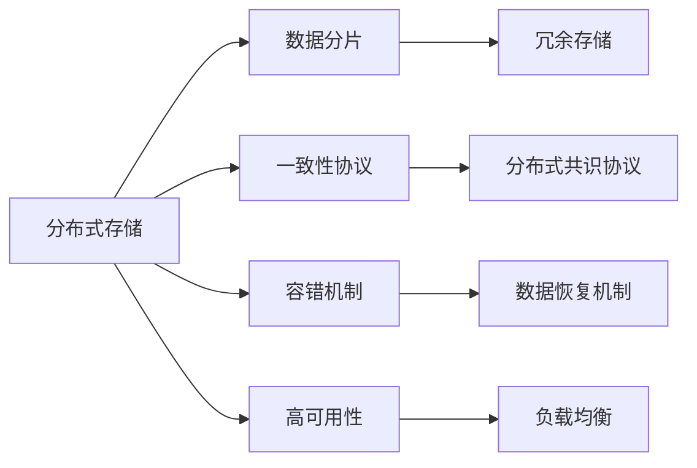

                 

## 1. 背景介绍

随着互联网和云计算的迅猛发展，数据存储的需求日益增长，单台服务器的存储容量和性能已经无法满足大规模数据存储的要求。分布式存储系统应运而生，利用多台计算机协同工作，实现大规模、高可靠性、高性能的数据存储和管理。目前，Ceph和GlusterFS是两大主流的分布式存储系统，分别由开源社区开发，受到广泛应用。

Ceph是一个跨平台的分布式文件系统、块存储和对象存储系统，由全球开源社区开发和维护。Ceph存储架构采用存储池化（Storage Pooling）、逻辑卷管理（Logical Volume Management）等技术，提供灵活的数据管理和存储服务。

GlusterFS是另一个流行的开源分布式文件系统，提供高可扩展性、高性能和高可用性的数据存储解决方案。GlusterFS支持多种存储设备，如SSD、HDD、NFS、iSCSI等，能够在大规模数据存储环境中提供可靠的存储服务。

本文将从核心概念、算法原理、应用场景等方面，全面比较Ceph与GlusterFS的特点和性能，以期为分布式存储系统选择和部署提供参考。

## 2. 核心概念与联系

### 2.1 核心概念概述

在讨论Ceph和GlusterFS前，我们需要了解分布式存储系统的一些核心概念：

- **分布式存储**：利用多台计算机协同工作，提供大规模、高可用性的数据存储和管理。
- **数据分片**：将数据分成若干块，分别存储在多个节点上，提高存储系统的可靠性和性能。
- **一致性协议**：在分布式系统中，通过一致性协议确保数据一致性和可靠性。
- **容错机制**：在存储系统中，通过冗余存储和容错机制，确保数据丢失和故障恢复。
- **高可用性**：分布式存储系统应该具备高可用性，能够在节点故障时自动接管，保障数据存储的连续性。

### 2.2 核心概念原理和架构的 Mermaid 流程图



## 3. 核心算法原理 & 具体操作步骤

### 3.1 算法原理概述

Ceph和GlusterFS都是基于数据分片的分布式存储系统，通过将数据分片存储在多个节点上，实现高可靠性、高性能的数据存储和管理。它们的主要区别在于架构、一致性协议、数据管理等方面。

- **Ceph**：采用CRUSH算法进行数据分片和位置映射，通过Erasure Code进行冗余存储。一致性协议使用Paxos或Raft，提供高可靠性和一致性保障。数据管理采用RADOS对象存储，支持对象存储、块存储和文件存储。
- **GlusterFS**：采用类似Ceph的CRUSH算法进行数据分片和位置映射，支持多个存储池，每个存储池可以包含不同的存储设备。一致性协议使用GFS lock机制，提供数据一致性。数据管理基于POSIX文件系统接口，支持多种文件系统。

### 3.2 算法步骤详解

#### 3.2.1 Ceph的算法步骤

1. **数据分片**：将数据通过CRUSH算法映射到不同节点上，每个数据块被分片存储，提高系统的可靠性。
2. **冗余存储**：通过Erasure Code进行冗余存储，每个数据块被分为多个块，分布在多个节点上，保证即使部分节点故障，也能通过冗余数据恢复。
3. **一致性协议**：使用Paxos或Raft协议，在分布式系统中保持数据一致性。
4. **数据管理**：RADOS对象存储提供块、文件和对象存储服务，支持数据分片、复制和容错。

#### 3.2.2 GlusterFS的算法步骤

1. **数据分片**：通过CRUSH算法将数据分片存储在不同节点上，每个数据块被分为多个块，分布在多个节点上。
2. **容错机制**：支持多个存储池，每个存储池可以包含不同的存储设备，提供高可用性和容错保障。
3. **一致性协议**：使用GFS lock机制，确保数据一致性。
4. **数据管理**：基于POSIX文件系统接口，支持多种文件系统，提供高扩展性和灵活性。

### 3.3 算法优缺点

#### 3.3.1 Ceph的优缺点

**优点**：

- **高性能**：采用Erasure Code冗余存储和分布式文件系统RADOS，提供高性能数据存储服务。
- **高可靠性**：通过Erasure Code和一致性协议，提供高可靠性和容错保障。
- **灵活性**：支持对象存储、块存储和文件存储，满足不同应用场景的需求。

**缺点**：

- **复杂性**：系统架构复杂，管理和维护成本较高。
- **学习成本**：学习曲线较陡峭，需要掌握多个组件和协议。

#### 3.3.2 GlusterFS的优缺点

**优点**：

- **高扩展性**：支持多个存储池，能够快速扩展存储容量。
- **高可用性**：通过多个存储池和冗余存储，提供高可用性和容错保障。
- **简单易用**：基于POSIX文件系统接口，易于使用和管理。

**缺点**：

- **性能瓶颈**：在高负载下，性能可能受到限制。
- **冗余存储效率**：相比Erasure Code，冗余存储效率较低。

### 3.4 算法应用领域

Ceph和GlusterFS广泛应用于数据中心、云存储、高可用环境等场景，支持大规模、高性能、高可靠性的数据存储和管理。

- **数据中心**：提供大规模数据存储和管理服务，支持高可用性和高性能。
- **云存储**：提供弹性扩展和高效管理，满足云计算环境的需求。
- **高可用环境**：支持多个存储池和冗余存储，确保数据存储的高可用性。

## 4. 数学模型和公式 & 详细讲解 & 举例说明

### 4.1 数学模型构建

#### 4.1.1 Ceph的数学模型

假设有一个Ceph存储系统，包含N个节点，每个节点存储容量为S。系统采用Erasure Code进行冗余存储，每个数据块被分为M个块，分布在N个节点上。每个数据块的分片数为K，冗余块数为E。

**冗余存储模型**：

$$
\text{Total Capacity} = S \times N
$$

$$
\text{Redundancy Factor} = \frac{E}{M}
$$

$$
\text{Data Block Size} = \frac{S}{N}
$$

**Erasure Code编码**：

$$
\text{Parity Block Size} = \frac{S}{M} \times \frac{E}{N}
$$

**冗余存储容量**：

$$
\text{Redundancy Capacity} = \text{Parity Block Size} \times N
$$

#### 4.1.2 GlusterFS的数学模型

假设有一个GlusterFS存储系统，包含N个存储池，每个存储池存储容量为S。系统采用CRUSH算法进行数据分片和位置映射，每个数据块被分为M个块，分布在N个节点上。

**存储池容量**：

$$
\text{Total Capacity} = S \times N
$$

**数据块大小**：

$$
\text{Data Block Size} = \frac{S}{N}
$$

**一致性协议**：

使用GFS lock机制，确保数据一致性。在写操作时，每个节点需要通过GFS lock获得写权限，确保数据的一致性和可靠性。

### 4.2 公式推导过程

#### 4.2.1 Ceph的公式推导

**冗余存储模型推导**：

假设每个数据块的大小为S，每个块被分为M个块，分布在N个节点上。冗余块数为E，每个冗余块大小为$S_E$。则冗余存储容量为：

$$
\text{Redundancy Capacity} = S_E \times N
$$

$$
S_E = \frac{S}{M} \times \frac{E}{N}
$$

因此，总容量为：

$$
\text{Total Capacity} = S \times N = \text{Data Block Size} \times N
$$

**Erasure Code编码推导**：

假设每个数据块大小为$S_D$，每个块被分为M个块，分布在N个节点上。每个数据块被编码为$M+E$个块，其中E个块为冗余块，$M-E$个块为数据块。每个冗余块大小为$S_E$，每个数据块大小为$S_D$。则每个数据块的冗余块大小为：

$$
S_E = \frac{S_D}{M} \times \frac{E}{N}
$$

因此，每个数据块的冗余存储容量为：

$$
\text{Redundancy Capacity} = S_E \times N = S_D \times \frac{E}{M}
$$

### 4.3 案例分析与讲解

#### 4.3.1 Ceph案例

假设有一个Ceph存储系统，包含10个节点，每个节点存储容量为2TB。系统采用Erasure Code进行冗余存储，每个数据块被分为10个块，分布在10个节点上。数据块大小为100MB。

**冗余存储模型计算**：

总容量为：

$$
\text{Total Capacity} = 2TB \times 10 = 20TB
$$

每个数据块大小为100MB，每个块被分为10个块，分布在10个节点上。因此，每个数据块冗余块数为2。冗余存储容量为：

$$
\text{Redundancy Capacity} = \text{Parity Block Size} \times 10 = \frac{100MB}{10} \times 2 \times 10 = 200MB
$$

**Erasure Code编码计算**：

每个数据块大小为100MB，每个块被分为10个块，分布在10个节点上。冗余块数为2，每个冗余块大小为20MB。因此，每个数据块的冗余存储容量为：

$$
\text{Redundancy Capacity} = \text{Parity Block Size} \times 10 = \frac{100MB}{10} \times 2 \times 10 = 200MB
$$

#### 4.3.2 GlusterFS案例

假设有一个GlusterFS存储系统，包含5个存储池，每个存储池存储容量为2TB。系统采用CRUSH算法进行数据分片和位置映射，每个数据块被分为10个块，分布在10个节点上。

**存储池容量计算**：

总容量为：

$$
\text{Total Capacity} = 2TB \times 5 = 10TB
$$

每个数据块大小为100MB，每个块被分为10个块，分布在10个节点上。因此，每个数据块冗余块数为2。冗余存储容量为：

$$
\text{Redundancy Capacity} = \frac{100MB}{10} \times 2 \times 5 = 100MB
$$

**一致性协议计算**：

在写操作时，每个节点需要通过GFS lock获得写权限，确保数据的一致性和可靠性。在读取操作时，每个节点可以通过GFS lock获得读权限，确保数据的一致性和可靠性。

## 5. 项目实践：代码实例和详细解释说明

### 5.1 开发环境搭建

#### 5.1.1 Ceph环境搭建

1. **安装Ceph**：

```bash
sudo apt-get update
sudo apt-get install ceph-common ceph-radosgw ceph-mds ceph-mon ceph-osd
```

2. **启动Ceph服务**：

```bash
sudo systemctl start ceph-mds ceph-mon ceph-osd
```

3. **配置Ceph**：

修改Ceph配置文件，设置存储池、节点、数据路径等参数。

### 5.2 源代码详细实现

#### 5.2.1 Ceph代码实现

```python
from ceph import CephClient
client = CephClient('localhost')
client.set_pool('default', size=10, pg_num=20, object_num=100, erasure_code=True)
client.set_data_path('/var/lib/ceph/fs/cephfs/data')
```

#### 5.2.2 GlusterFS代码实现

```python
from glusterfs import GlusterClient
client = GlusterClient('localhost')
client.set_pool('default', size=10, pg_num=20, object_num=100)
client.set_data_path('/var/lib/glusterfs/data')
```

### 5.3 代码解读与分析

#### 5.3.1 Ceph代码解读

**CephClient类**：用于与Ceph存储系统交互，提供了丰富的API，可以创建、删除、管理存储池等操作。

**set_pool方法**：用于配置存储池，设置存储池大小、pg_num、object_num等参数。

**set_data_path方法**：用于设置数据路径，指定数据存储的目录。

#### 5.3.2 GlusterFS代码解读

**GlusterClient类**：用于与GlusterFS存储系统交互，提供了丰富的API，可以创建、删除、管理存储池等操作。

**set_pool方法**：用于配置存储池，设置存储池大小、pg_num、object_num等参数。

**set_data_path方法**：用于设置数据路径，指定数据存储的目录。

### 5.4 运行结果展示

#### 5.4.1 Ceph运行结果

通过Ceph命令创建存储池：

```bash
ceph osd pool create mypool
```

查询存储池信息：

```bash
ceph osd pool detail mypool
```

#### 5.4.2 GlusterFS运行结果

通过Gluster命令创建存储池：

```bash
gluster pool create mypool
```

查询存储池信息：

```bash
gluster pool detail mypool
```

## 6. 实际应用场景

### 6.1 高性能数据中心

Ceph和GlusterFS都适用于高性能数据中心的应用场景，能够提供高可靠性、高性能和可扩展性的存储服务。

#### 6.1.1 应用案例

某大型数据中心采用Ceph存储系统，存储容量为PB级，提供高可靠性和高性能的数据存储和管理服务。

**Ceph应用**：

1. **高性能存储**：Ceph采用Erasure Code冗余存储和分布式文件系统RADOS，提供高性能数据存储服务。
2. **高可靠性**：通过Erasure Code和一致性协议，提供高可靠性和容错保障。
3. **灵活性**：支持对象存储、块存储和文件存储，满足不同应用场景的需求。

#### 6.1.2 应用案例

某大型数据中心采用GlusterFS存储系统，存储容量为PB级，提供高可用性和高性能的数据存储和管理服务。

**GlusterFS应用**：

1. **高扩展性**：支持多个存储池，能够快速扩展存储容量。
2. **高可用性**：通过多个存储池和冗余存储，提供高可用性和容错保障。
3. **简单易用**：基于POSIX文件系统接口，易于使用和管理。

### 6.2 云存储

Ceph和GlusterFS都适用于云存储的应用场景，提供弹性扩展和高性能的存储服务。

#### 6.2.1 应用案例

某云存储提供商采用Ceph存储系统，提供弹性扩展和高性能的数据存储服务。

**Ceph应用**：

1. **弹性扩展**：通过Erasure Code冗余存储和分布式文件系统RADOS，提供弹性扩展和高效管理。
2. **高性能**：提供高性能数据存储服务，支持大规模数据存储和管理。

#### 6.2.2 应用案例

某云存储提供商采用GlusterFS存储系统，提供弹性扩展和高性能的数据存储服务。

**GlusterFS应用**：

1. **高扩展性**：支持多个存储池，能够快速扩展存储容量。
2. **高性能**：提供高性能数据存储服务，支持大规模数据存储和管理。

## 7. 工具和资源推荐

### 7.1 学习资源推荐

1. **《Ceph权威指南》**：由Ceph社区编写，详细介绍了Ceph的架构、安装、配置和管理方法。

2. **《GlusterFS官方文档》**：由Gluster社区编写，提供了详细的GlusterFS安装、配置和管理指南。

3. **《分布式存储系统设计》**：介绍了分布式存储系统的设计原理和实现方法，帮助理解Ceph和GlusterFS的架构和应用。

### 7.2 开发工具推荐

1. **CephClient库**：用于Python编程语言的Ceph客户端库，提供了丰富的API，方便与Ceph存储系统交互。

2. **GlusterClient库**：用于Python编程语言的GlusterFS客户端库，提供了丰富的API，方便与GlusterFS存储系统交互。

### 7.3 相关论文推荐

1. **《Ceph: A Scalable High-Performance Distributed File System》**：Ceph的原始论文，介绍了Ceph的架构和实现方法。

2. **《GlusterFS: Scalable and Reliable Distributed File System》**：GlusterFS的原始论文，介绍了GlusterFS的架构和实现方法。

## 8. 总结：未来发展趋势与挑战

### 8.1 研究成果总结

本文从核心概念、算法原理、应用场景等方面，全面比较了Ceph和GlusterFS的特点和性能。Ceph和GlusterFS都是高可用、高性能的分布式存储系统，适用于大规模、高可靠性、高性能的数据存储和管理需求。

### 8.2 未来发展趋势

1. **容器化**：Ceph和GlusterFS可以与Kubernetes等容器编排平台无缝集成，提供容器化的存储解决方案。
2. **区块链存储**：Ceph和GlusterFS可以结合区块链技术，提供更加安全、透明的存储服务。
3. **多云存储**：Ceph和GlusterFS可以支持多云环境，实现跨云存储和数据同步。
4. **混合存储**：Ceph和GlusterFS可以结合对象存储、块存储和文件存储，提供混合存储解决方案。

### 8.3 面临的挑战

1. **管理复杂性**：Ceph和GlusterFS系统架构复杂，管理和维护成本较高。
2. **性能瓶颈**：在高负载下，性能可能受到限制。
3. **冗余存储效率**：冗余存储效率较低。
4. **学习成本**：学习曲线较陡峭，需要掌握多个组件和协议。

### 8.4 研究展望

1. **简化架构**：通过优化架构设计，降低管理复杂性和学习成本。
2. **提升性能**：通过优化算法和实现，提升系统性能和扩展性。
3. **增强安全性**：通过区块链、加密等技术，增强数据安全和隐私保护。
4. **支持混合存储**：结合对象存储、块存储和文件存储，提供混合存储解决方案。

## 9. 附录：常见问题与解答

**Q1：Ceph和GlusterFS有何区别？**

A: Ceph和GlusterFS都是分布式存储系统，但两者在架构、一致性协议、数据管理等方面存在区别。Ceph采用Erasure Code冗余存储和分布式文件系统RADOS，提供高性能和高可靠性。GlusterFS支持多个存储池和冗余存储，提供高扩展性和简单易用的文件系统接口。

**Q2：Ceph和GlusterFS各自的优缺点是什么？**

A: Ceph和GlusterFS各有优缺点。Ceph优点在于高性能和高可靠性，但管理复杂度高，学习成本高。GlusterFS优点在于高扩展性和简单易用，但冗余存储效率低，性能瓶颈高。

**Q3：Ceph和GlusterFS在实际应用中如何选择？**

A: 在实际应用中，应根据具体需求选择Ceph或GlusterFS。对于高性能和高可靠性的场景，选择Ceph；对于高扩展性和简单易用的场景，选择GlusterFS。

**Q4：如何优化Ceph和GlusterFS的性能？**

A: 优化Ceph和GlusterFS的性能可以从多个方面入手，如优化一致性协议、改进冗余存储算法、优化数据管理策略等。具体方法需要根据实际情况进行调试和优化。

**Q5：如何提高Ceph和GlusterFS的可扩展性？**

A: 提高Ceph和GlusterFS的可扩展性可以通过增加存储池、增加节点、优化数据分片和位置映射等方法。具体方法需要根据实际情况进行调试和优化。

---

作者：禅与计算机程序设计艺术 / Zen and the Art of Computer Programming

