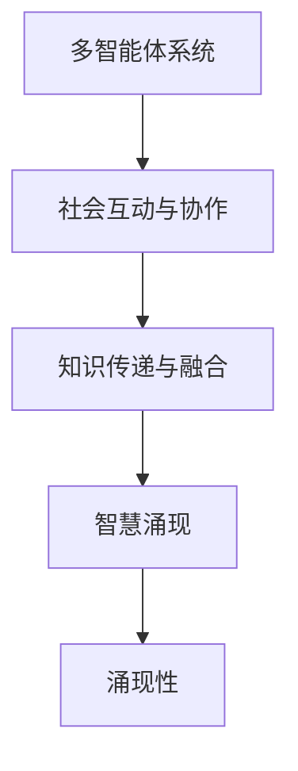

                 

# 分布式认知：理解群体智慧的形成机制

## 1. 背景介绍

### 1.1 问题由来
分布式认知(Distributed Cognition)是近年来认知科学和人工智能领域的一个热门研究方向。它旨在研究多智能体如何在协作中产生智慧和复杂行为。不同于传统的集中式计算模型，分布式认知强调信息在多智能体之间的传递和交互，以达到系统整体的智能提升。

分布式认知的核心思想是，智慧不仅仅存在于单个个体中，而是通过多个智能体之间的协作和互动，共同生成、演化和传递知识。这种群体智慧的形成机制，在人类社会、自然界以及人工智能系统设计中都有广泛的应用。

### 1.2 问题核心关键点
分布式认知的三个核心关键点：

1. **分布式知识传递与融合**：在多智能体系统中，知识如何在个体间传递、融合和演化，从而生成新的知识。
2. **社会互动与协作**：个体间如何通过互动与协作，共同解决问题和创造价值。
3. **智慧涌现**：如何在多智能体的相互作用中，涌现出超越个体智能的总和，实现群体的智慧提升。

理解这些关键点，对于设计和实现分布式认知系统，以及深入研究群体智慧的形成机制具有重要意义。

### 1.3 问题研究意义
研究分布式认知，对于提升人类社会协作效率、推动人工智能系统设计、促进智能机器与人类共同解决问题具有重要意义：

1. **提升协作效率**：分布式认知理论可以帮助人们更好地理解和管理团队合作，提高组织效能和生产力。
2. **推动AI技术发展**：理解分布式认知机制，可以为设计智能机器提供新的理论基础，推动智能系统的协同优化。
3. **促进跨学科融合**：分布式认知涉及认知科学、人工智能、社会学等多个学科，跨学科的研究有助于全面理解人类和社会行为。
4. **解决复杂问题**：群体智慧的形成机制有助于解决复杂的多智能体系统问题，如自动驾驶、机器人协作、智能城市治理等。

## 2. 核心概念与联系

### 2.1 核心概念概述

为了更好地理解分布式认知的形成机制，本节将介绍几个核心概念：

- **多智能体系统(Multi-Agent System,MAS)**：由多个自治智能体组成的系统，每个智能体都有自己的目标和行为策略，通过相互间的交互和合作产生群体智慧。
- **社会互动与协作(Social Interaction & Collaboration)**：智能体之间通过沟通、协调、竞争等互动方式，共同完成任务和解决问题。
- **知识传递与融合(Knowledge Transfer & Integration)**：在多智能体系统中，知识如何在个体间传递、融合和演化，从而生成新的知识。
- **智慧涌现(Emergence of Wisdom)**：在多智能体的相互作用中，如何涌现出超越个体智能的总和，实现群体的智慧提升。
- **涌现性(Emergence)**：复杂系统中的新行为或结构，并不是由个体行为直接决定的，而是由个体间的交互和系统结构共同作用的结果。

这些概念之间的逻辑关系可以通过以下Mermaid流程图来展示：



这个流程图展示了一个典型的分布式认知系统的工作流程：

1. 多智能体系统通过社会互动与协作，传递和融合知识。
2. 在知识传递与融合的过程中，产生新的知识，并通过互动不断演化。
3. 最终在多智能体的相互作用中，涌现出超越个体智能的总和，实现群体的智慧提升。

## 3. 核心算法原理 & 具体操作步骤
### 3.1 算法原理概述

分布式认知的算法原理主要涉及两个方面：

- **知识表示与传递**：通过构建知识图谱、语义网络等结构，在多智能体间传递和共享知识。
- **社会互动模型**：设计智能体之间的互动模型，如基于协议、博弈等理论的互动策略，实现协作和协作目标的优化。

这些原理在实际应用中，往往通过模拟多智能体的协作和互动，利用计算模型来模拟和优化群体智慧的形成。

### 3.2 算法步骤详解

分布式认知的实现一般包括以下几个关键步骤：

**Step 1: 定义知识表示框架**

- 选择合适的知识表示框架，如知识图谱、语义网络等，用于表示和传递知识。
- 构建知识库，存储和组织领域知识，方便智能体检索和使用。

**Step 2: 设计社会互动模型**

- 根据任务需求，设计智能体之间的互动模型，如基于协议、博弈等理论的互动策略。
- 定义协作目标和奖惩机制，引导智能体向共同目标努力。

**Step 3: 实现分布式知识传递**

- 实现知识在智能体间的传递，如通过消息传递、共享内存等方式。
- 使用知识融合算法，对接收到的知识进行整合和优化。

**Step 4: 社会互动与协作**

- 启动多智能体系统，在循环中模拟社会互动和协作。
- 通过反馈机制调整智能体的行为策略，以优化协作效果。

**Step 5: 评估群体智慧**

- 定期评估群体智慧的形成和演化，如通过度量群体智能指标、行为结果等。
- 分析群体智慧的形成机制，优化互动模型和知识表示框架。

### 3.3 算法优缺点

分布式认知算法的优点：

1. **灵活性**：能够适应多种应用场景，易于扩展和定制。
2. **自组织性**：智能体之间通过互动自然形成协作，不需要集中控制。
3. **鲁棒性**：分散的智能体系统具有一定的容错性，单一故障不易影响整体。

分布式认知算法也存在一些局限：

1. **复杂度**：设计和实现分布式认知系统需要较高的技术门槛。
2. **通信开销**：多智能体间的通信和协调需要消耗大量的计算资源。
3. **同步问题**：在高度异步和分布式系统中，同步和一致性难以保证。
4. **性能波动**：系统性能受智能体间互动质量的影响较大。

### 3.4 算法应用领域

分布式认知算法在多个领域得到了广泛应用，包括：

- **智能机器人协作**：设计多机器人系统，通过分布式认知实现协作任务，如智能家居、物流配送等。
- **群体决策支持**：通过分布式认知技术，提升群体决策的质量和效率，应用于政府、企业等领域。
- **智能城市治理**：构建智慧城市系统，实现智能交通、环境监测、公共安全等功能的分布式优化。
- **复杂系统仿真**：用于模拟和优化复杂的分布式系统，如供应链管理、社交网络分析等。

## 4. 数学模型和公式 & 详细讲解 & 举例说明

### 4.1 数学模型构建

分布式认知的研究通常需要构建数学模型，以刻画智能体间的交互和协作过程。

记智能体集合为 $A=\{a_1, a_2, ..., a_n\}$，每个智能体的状态为 $s_i=(s_i^1,s_i^2,...,s_i^m)$，其中 $s_i^j$ 表示智能体 $a_i$ 在状态 $j$ 下的知识表示。智能体间的互动可以表示为通信和协作两个过程，使用通信矩阵 $C$ 和协作矩阵 $D$ 来描述：

$$
C_{ij}=\begin{cases}
c_{ij} & \text{智能体 }i\text{ 向智能体 }j\text{ 发送信息} \\
0 & \text{智能体 }i\text{ 不向智能体 }j\text{ 发送信息}
\end{cases}
$$

$$
D_{ij}=\begin{cases}
d_{ij} & \text{智能体 }i\text{ 与智能体 }j\text{ 协作} \\
0 & \text{智能体 }i\text{ 不与智能体 }j\text{ 协作}
\end{cases}
$$

其中 $c_{ij}$ 和 $d_{ij}$ 分别表示通信和协作的强度。

### 4.2 公式推导过程

根据上述定义，我们可以构建分布式认知的数学模型：

假设智能体间的通信和协作是线性的，知识传递的强度为 $c$，协作的强度为 $d$，知识传递和协作的速度分别为 $v$ 和 $w$，智能体 $a_i$ 的状态演化方程为：

$$
s_i^{t+1} = s_i^t + c\sum_{j=1}^n C_{ij} s_j^t + d\sum_{j=1}^n D_{ij} s_j^t
$$

其中 $t$ 表示时间步，$v$ 和 $w$ 分别表示知识传递和协作的速度，可以通过实验或优化方法确定。

通过上述方程，可以模拟智能体间的知识传递和协作过程，分析知识演化趋势和群体智慧的形成机制。

### 4.3 案例分析与讲解

以智能机器人协作为例，分析分布式认知机制的实现。假设智能机器人 $a_i$ 负责执行任务 $t_i$，每个任务 $t_i$ 都有相应的执行参数 $p_i$ 和状态 $s_i$。

**知识表示与传递**：

- 定义知识图谱，存储机器人执行任务的历史数据和成功经验。
- 使用消息传递机制，智能体间共享最新的状态和知识。

**社会互动模型**：

- 设计基于协议的社会互动模型，如协作搜索协议(CSR)。
- 定义奖惩机制，激励机器人高效协作，避免资源浪费。

**实现分布式知识传递**：

- 使用消息传递算法，实现知识在机器人之间的传递。
- 设计知识融合算法，对接收到的知识进行整合和优化。

**社会互动与协作**：

- 启动多个智能体系统，模拟机器人的协作搜索过程。
- 通过反馈机制调整机器人的行为策略，以优化协作效果。

**评估群体智慧**：

- 定期评估机器人系统的协作效果，如任务完成率、资源利用率等。
- 分析群体智慧的形成机制，优化互动模型和知识表示框架。

## 5. 项目实践：代码实例和详细解释说明
### 5.1 开发环境搭建

在进行分布式认知系统开发前，我们需要准备好开发环境。以下是使用Python进行PyTorch开发的环境配置流程：

1. 安装Anaconda：从官网下载并安装Anaconda，用于创建独立的Python环境。

2. 创建并激活虚拟环境：
```bash
conda create -n pytorch-env python=3.8 
conda activate pytorch-env
```

3. 安装PyTorch：根据CUDA版本，从官网获取对应的安装命令。例如：
```bash
conda install pytorch torchvision torchaudio cudatoolkit=11.1 -c pytorch -c conda-forge
```

4. 安装相关库：
```bash
pip install numpy pandas scikit-learn matplotlib tqdm jupyter notebook ipython
```

完成上述步骤后，即可在`pytorch-env`环境中开始分布式认知系统开发。

### 5.2 源代码详细实现

这里我们以智能机器人协作系统为例，给出使用PyTorch进行分布式认知系统开发的PyTorch代码实现。

首先，定义智能体类和任务类：

```python
import torch
import torch.nn as nn
import torch.optim as optim

class Task:
    def __init__(self, name, success_probability):
        self.name = name
        self.success_probability = success_probability
        
    def __str__(self):
        return f"Task({self.name}, success_probability={self.success_probability})"
        
class Agent:
    def __init__(self, name, tasks, communication_strength, cooperation_strength):
        self.name = name
        self.tasks = tasks
        self.communication_strength = communication_strength
        self.cooperation_strength = cooperation_strength
        self.state = [torch.tensor(0.0) for _ in range(len(tasks))]
        
    def __str__(self):
        return f"Agent({self.name})"
    
    def receive_message(self, message):
        self.state = self.state + message
        
    def update_state(self):
        self.state = torch.tensor([sum([task.success_probability * self.state[i] for i, task in enumerate(self.tasks) if self.communication_strength[i] > 0]) + sum([task.success_probability * self.state[i] for i, task in enumerate(self.tasks) if self.cooperation_strength[i] > 0]), sum([task.success_probability * self.state[i] for i, task in enumerate(self.tasks) if self.communication_strength[i] > 0]) + sum([task.success_probability * self.state[i] for i, task in enumerate(self.tasks) if self.cooperation_strength[i] > 0])]
```

然后，定义分布式认知系统的训练函数：

```python
def train_agents(agents, num_epochs):
    optimizer = optim.SGD(learning_rate=0.1)
    for epoch in range(num_epochs):
        for agent in agents:
            optimizer.zero_grad()
            agent.update_state()
            agent.state.backward()
            optimizer.step()
        if epoch % 10 == 0:
            print(f"Epoch {epoch+1}, agent states: {agent.state for agent in agents}")
```

最后，启动智能机器人协作系统的训练流程：

```python
agents = [Agent("Robot1", [Task("Task1", 0.8), Task("Task2", 0.6)], 0.2, 0.4),
          Agent("Robot2", [Task("Task1", 0.6), Task("Task2", 0.7)], 0.3, 0.3),
          Agent("Robot3", [Task("Task1", 0.7), Task("Task2", 0.8)], 0.4, 0.2)]

train_agents(agents, num_epochs=50)
```

以上就是使用PyTorch进行智能机器人协作系统开发的完整代码实现。可以看到，通过简单的类设计，我们就能模拟智能体间的知识传递和协作过程，并使用分布式训练方法来优化整个系统。

### 5.3 代码解读与分析

让我们再详细解读一下关键代码的实现细节：

**Task类和Agent类**：
- 定义了任务和智能体类，分别表示任务的执行参数和智能体的状态。
- 通过类的方法，实现了任务成功概率的计算和智能体状态的更新。

**train_agents函数**：
- 定义了分布式认知系统的训练函数，使用SGD优化器进行优化。
- 在每个epoch内，循环更新每个智能体的状态，并计算梯度，进行参数更新。
- 每10个epoch输出一次智能体状态，观察模型训练的效果。

**智能机器人协作系统的训练流程**：
- 定义了三个智能体，每个智能体都有两个任务，任务的成功概率不同。
- 初始化智能体的通信和协作强度。
- 调用训练函数，训练多个epoch后，输出智能体的状态，观察模型的收敛效果。

## 6. 实际应用场景
### 6.1 智能机器人协作

分布式认知技术在智能机器人协作中具有广泛的应用前景。智能机器人需要在复杂环境中执行各种任务，通过分布式认知，可以实现多机器人系统的协作，提升任务执行的效率和成功率。

在实际应用中，可以将智能机器人看作分布式认知系统中的智能体，通过构建知识图谱，传递和共享任务执行的知识，优化机器人之间的协作策略。例如，在智能家居系统中，多个服务机器人可以协作完成家庭清洁、安防监控、健康监测等多项任务，实现家庭环境的全面智能化管理。

### 6.2 群体决策支持

分布式认知技术在群体决策支持中也有重要应用。企业、政府等组织在决策过程中，需要综合多方的意见和信息，通过分布式认知系统，可以快速高效地进行决策分析和方案评估。

在实际应用中，可以将各个决策者看作分布式认知系统中的智能体，通过构建知识图谱，传递和共享决策相关信息，优化决策过程。例如，在政府决策支持系统中，可以通过分布式认知技术，实现跨部门的信息共享和协作，提升决策的科学性和时效性。

### 6.3 智能城市治理

分布式认知技术在智能城市治理中也具有广泛的应用前景。智能城市需要综合各种数据源，实现交通管理、环境监测、公共安全等多项功能的协调优化。

在实际应用中，可以将各种传感器、监控设备看作分布式认知系统中的智能体，通过构建知识图谱，传递和共享数据信息，优化城市管理决策。例如，在智能交通系统中，通过分布式认知技术，可以实现交通流量的实时监测和动态调控，提升城市的交通效率和安全性。

### 6.4 未来应用展望

随着分布式认知技术的发展，未来将在更多领域得到应用，为人类社会带来变革性影响。

- **智慧医疗**：通过分布式认知技术，可以实现医生、患者、护士等各方信息的共享和协作，提升医疗服务的智能化水平，辅助医生诊疗，加速新药开发进程。
- **智能教育**：通过分布式认知技术，可以实现教师、学生、家长等各方的互动和协作，提升教育的质量和效率，实现因材施教，促进教育公平。
- **智慧城市治理**：通过分布式认知技术，可以实现城市信息的高效整合和利用，提升城市管理的自动化和智能化水平，构建更安全、高效的未来城市。

## 7. 工具和资源推荐
### 7.1 学习资源推荐

为了帮助开发者系统掌握分布式认知的理论基础和实践技巧，这里推荐一些优质的学习资源：

1. **《分布式认知的理论与实践》系列博文**：由分布式认知领域专家撰写，深入浅出地介绍了分布式认知的原理和应用，涵盖多智能体系统、知识传递与融合、智慧涌现等核心概念。

2. **MIT OpenCourseWare《分布式人工智能》课程**：麻省理工学院开设的分布式人工智能课程，系统讲解分布式认知的理论和算法，提供丰富的案例和实践项目。

3. **《分布式认知与人工智能》书籍**：全面介绍了分布式认知在人工智能中的应用，涵盖分布式认知的理论、算法和实际案例。

4. **ACM Transactions on Computational Logic**：分布式认知领域的重要期刊，刊登了众多前沿研究成果，适合深入学习理论基础。

5. **IEEE Transactions on Systems, Man, and Cybernetics, Part B: Cybernetics**：涵盖分布式认知和人工智能的交叉研究，提供了丰富的应用案例和技术思路。

通过对这些资源的学习实践，相信你一定能够快速掌握分布式认知的理论基础和实践技巧，为实际应用奠定坚实基础。

### 7.2 开发工具推荐

高效的开发离不开优秀的工具支持。以下是几款用于分布式认知系统开发的常用工具：

1. **PyTorch**：基于Python的开源深度学习框架，灵活动态的计算图，适合快速迭代研究。支持多智能体系统的分布式训练。

2. **TensorFlow**：由Google主导开发的开源深度学习框架，生产部署方便，适合大规模工程应用。支持分布式计算和多智能体系统的模拟。

3. **Horizon Agent**：Facebook开源的分布式认知系统框架，提供了丰富的分布式算法和模型库，支持大规模多智能体系统的开发。

4. **Jupyter Notebook**：免费的交互式笔记本环境，支持Python、R等语言，适合快速原型设计和共享学习笔记。

5. **JCasj**：自然语言处理工具包，支持分布式认知系统中的知识表示和传递，提供了丰富的NLP工具和算法。

6. **Hugging Face Transformers库**：提供了丰富的预训练模型和分布式计算支持，适合快速实现多智能体系统。

合理利用这些工具，可以显著提升分布式认知系统的开发效率，加快创新迭代的步伐。

### 7.3 相关论文推荐

分布式认知研究源于学界的持续研究。以下是几篇奠基性的相关论文，推荐阅读：

1. **分布式认知：一个框架性概述**：介绍分布式认知的理论框架和应用场景，适合初学者入门。

2. **多智能体系统中的知识共享与协作**：研究多智能体系统中的知识传递与融合机制，提供丰富的数学建模和仿真方法。

3. **分布式认知与智能系统设计**：探讨分布式认知在智能系统设计中的应用，涵盖智能机器人、智能城市等多个领域。

4. **智能系统中的分布式决策支持**：研究分布式认知在群体决策支持中的应用，提供分布式算法的优化策略。

5. **分布式认知的建模与仿真**：通过数学模型和仿真实验，研究分布式认知的形成机制和优化策略，适合深入理论研究。

这些论文代表了大分布式认知研究的发展脉络。通过学习这些前沿成果，可以帮助研究者把握学科前进方向，激发更多的创新灵感。

## 8. 总结：未来发展趋势与挑战
### 8.1 总结

本文对分布式认知的原理和实践进行了全面系统的介绍。首先阐述了分布式认知的研究背景和意义，明确了其在协作、知识传递与融合、智慧涌现等方面的核心关键点。其次，从原理到实践，详细讲解了分布式认知的数学模型和关键算法，给出了分布式认知系统开发的完整代码实例。同时，本文还广泛探讨了分布式认知在智能机器人协作、群体决策支持、智能城市治理等多个领域的应用前景，展示了其巨大的潜力。此外，本文精选了分布式认知技术的各类学习资源，力求为读者提供全方位的技术指引。

通过本文的系统梳理，可以看到，分布式认知技术正在成为多智能体系统中的重要范式，极大地拓展了智能系统的协作能力，促进了智慧的涌现。理解分布式认知的机制，对于设计和实现智能机器、群体决策支持系统等具有重要意义。未来，伴随分布式认知技术的发展，智能系统将在更多领域得到应用，为人类社会带来变革性影响。

### 8.2 未来发展趋势

展望未来，分布式认知技术将呈现以下几个发展趋势：

1. **自适应性增强**：智能体能够根据环境变化自适应地调整行为策略，提高系统的鲁棒性和适应性。
2. **跨模态协同**：分布式认知技术将不仅仅局限于单一模态信息，而是实现多模态信息（如视觉、语音、文本等）的协同优化。
3. **分布式强化学习**：结合强化学习，智能体能够通过与环境互动，优化协作行为，提升系统性能。
4. **分布式认知与深度学习融合**：分布式认知技术将与深度学习进行深度融合，提升模型的表征能力和泛化能力。
5. **分布式知识图谱**：构建分布式知识图谱，实现知识在多智能体间的动态传递和共享，提升系统智慧水平。

这些趋势凸显了分布式认知技术的广阔前景。这些方向的探索发展，必将进一步提升智能系统的协作能力，促进智慧的涌现，推动智能技术的进步。

### 8.3 面临的挑战

尽管分布式认知技术已经取得了一定的成果，但在实际应用中仍面临诸多挑战：

1. **系统复杂性**：分布式认知系统涉及多智能体的协作和互动，系统设计和实现复杂。
2. **通信瓶颈**：多智能体间的通信和协调需要消耗大量的计算资源，系统性能受通信速度和质量的影响。
3. **容错性问题**：分布式系统容易受到故障影响，需要设计容错机制，提高系统的鲁棒性。
4. **隐私和安全**：分布式认知系统中的信息共享和协作需要保障隐私和安全，防止信息泄露和滥用。
5. **计算资源需求**：分布式认知系统需要高性能的计算资源支持，难以在资源受限的环境中应用。

### 8.4 研究展望

面对分布式认知技术面临的挑战，未来的研究需要在以下几个方面寻求新的突破：

1. **优化通信机制**：设计高效的通信算法，降低多智能体间的通信开销，提高系统的响应速度。
2. **强化学习优化**：结合强化学习算法，优化智能体的协作行为，提升系统性能。
3. **分布式认知与区块链结合**：利用区块链技术，保障信息共享和协作的安全性和透明性。
4. **分布式知识图谱**：研究分布式知识图谱的构建方法和优化策略，提升系统智慧水平。
5. **分布式认知的伦理和安全**：研究分布式认知技术的伦理和安全问题，确保系统的可解释性和可信性。

这些研究方向的探索，必将引领分布式认知技术迈向更高的台阶，为构建安全、可靠、可解释、可控的智能系统铺平道路。面向未来，分布式认知技术还需要与其他人工智能技术进行更深入的融合，如知识表示、因果推理、强化学习等，多路径协同发力，共同推动智能系统的进步。

## 9. 附录：常见问题与解答

**Q1：分布式认知与集中式计算的区别是什么？**

A: 分布式认知与集中式计算的核心区别在于信息传递和决策的机制。在集中式计算中，所有信息集中存储和处理，决策由中心节点统一发出。而在分布式认知中，信息在多智能体间传递和共享，决策由多个智能体共同生成和优化。分布式认知能够更好地适应复杂多变的动态环境，具有更好的鲁棒性和适应性。

**Q2：分布式认知如何实现知识共享和协作？**

A: 分布式认知通过构建知识图谱，实现知识在多智能体间的传递和共享。智能体通过通信机制，将最新的状态和知识传递给其他智能体，并使用知识融合算法，对接收到的知识进行整合和优化。例如，在智能机器人协作中，每个机器人将任务执行状态传递给其他机器人，共同优化任务执行策略。

**Q3：分布式认知有哪些应用场景？**

A: 分布式认知技术在多个领域得到了广泛应用，包括智能机器人协作、群体决策支持、智能城市治理等。通过多智能体的协作和互动，可以提升系统的智能水平和执行效率。例如，在智能城市治理中，通过分布式认知技术，可以实现城市信息的高效整合和利用，提升城市管理的自动化和智能化水平。

**Q4：分布式认知系统的设计和实现难点有哪些？**

A: 分布式认知系统的设计和实现涉及多智能体的协作和互动，系统复杂度高。设计过程中需要考虑通信机制、知识共享、协作策略等多个方面，容易出现瓶颈和冲突。此外，系统还需要考虑容错性、隐私和安全等问题，设计需要全面细致。

**Q5：分布式认知技术的未来发展方向是什么？**

A: 未来，分布式认知技术将进一步优化通信机制、结合强化学习、引入分布式知识图谱等，提升系统的协作能力和智能水平。同时，分布式认知技术还需要与其他人工智能技术进行深度融合，如知识表示、因果推理、深度学习等，共同推动智能系统的进步。

通过本文的系统梳理，可以看到，分布式认知技术正在成为智能系统中重要的一环，推动智慧的涌现和协作能力的提升。理解分布式认知的机制，对于设计和实现智能机器、群体决策支持系统等具有重要意义。未来，伴随分布式认知技术的发展，智能系统将在更多领域得到应用，为人类社会带来变革性影响。

