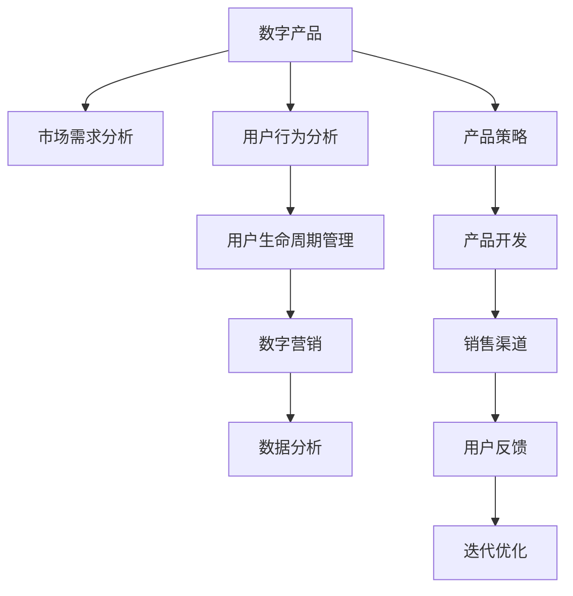

                 

# 创建和销售数字产品的策略

> 关键词：数字产品, 产品策略, 市场需求分析, 用户行为分析, 用户生命周期, 数字营销, 数据分析

## 1. 背景介绍

### 1.1 问题由来

随着数字技术的迅猛发展，数字产品（如软件、移动应用、在线服务等）的创新和普及速度不断加快，为企业提供了巨大的市场机会。然而，数字产品的成功不仅取决于技术的先进性和产品的功能性，更在于市场策略的有效性和执行力度。尤其是在当前竞争激烈的市场环境中，如何在有限资源下制定科学合理的数字产品策略，成为企业亟需解决的问题。

### 1.2 问题核心关键点

数字产品的创建和销售策略涉及多个核心关键点：

- **市场需求分析**：评估目标市场的需求量和潜在增长空间，确定产品的定位和目标用户群体。
- **用户行为分析**：深入理解用户的心理、行为和偏好，指导产品设计、功能实现和营销策略。
- **用户生命周期管理**：构建从吸引、转化、留存到忠诚的用户生命周期模型，指导产品和营销策略的迭代优化。
- **数字营销**：采用创新的数字营销手段，如SEO、社交媒体、电子邮件营销等，扩大产品的市场覆盖和用户基础。
- **数据分析**：利用数据科学和机器学习技术，实时监控和分析用户行为数据，优化产品和服务，提升用户体验。

这些关键点紧密相连，形成一个系统的策略框架，帮助企业在数字产品的创建和销售过程中做出科学决策，实现更高的商业价值。

## 2. 核心概念与联系

### 2.1 核心概念概述

为更好地理解数字产品策略的制定和执行，本节将介绍几个密切相关的核心概念：

- **数字产品**：指通过数字化手段创建并销售的产品或服务，涵盖软件、应用、在线服务等。
- **数字产品策略**：企业为创建和销售数字产品而制定的一系列策略和规划，包括市场分析、产品定位、功能设计、营销推广等。
- **用户生命周期**：指用户从首次接触产品到最终流失或成为忠实用户的过程，包括吸引、转化、留存、推荐和再购买等关键阶段。
- **数字营销**：利用数字技术和平台进行市场推广和品牌建设，包括SEO、SEM、社交媒体营销、电子邮件营销等。
- **数据分析**：使用统计学和数据科学方法，分析和解读数据，指导产品改进和营销策略优化。

这些概念之间的逻辑关系可以通过以下Mermaid流程图来展示：



这个流程图展示了数字产品策略制定的核心步骤：

1. 从市场需求分析开始，确定产品的市场定位和目标用户群体。
2. 进行用户行为分析，深入了解用户需求和行为模式，指导产品设计和功能实现。
3. 构建用户生命周期管理模型，优化用户获取、留存和转化策略。
4. 采用数字营销手段，扩大产品市场覆盖，吸引和转化用户。
5. 利用数据分析技术，实时监控用户行为和市场反馈，指导产品迭代和优化。

## 3. 核心算法原理 & 具体操作步骤
### 3.1 算法原理概述

数字产品策略的制定和执行，本质上是一个系统化的数据驱动决策过程。其核心思想是：

1. **市场导向**：以市场需求为导向，确定产品的市场定位和目标用户群体。
2. **用户中心**：以用户行为和反馈为中心，指导产品功能和用户体验的优化。
3. **数据分析**：利用数据分析技术，实时监控和解读用户行为数据，指导产品迭代和营销策略优化。
4. **闭环反馈**：通过用户反馈和市场数据，形成产品迭代和优化的闭环反馈机制，持续提升产品竞争力。

### 3.2 算法步骤详解

数字产品策略的制定和执行，通常包括以下几个关键步骤：

**Step 1: 市场调研与需求分析**
- 收集目标市场的数据，包括市场规模、增长趋势、用户需求、竞争情况等。
- 使用统计分析和市场预测模型，评估潜在市场机会。

**Step 2: 用户行为分析**
- 利用数据分析工具和用户行为数据，识别用户行为模式和偏好。
- 构建用户画像，了解用户的基本特征、需求和痛点。

**Step 3: 用户生命周期管理**
- 根据用户行为数据和市场调研结果，构建用户生命周期模型。
- 确定各阶段的用户行为特征和转化路径，制定吸引、留存、转化的策略。

**Step 4: 产品设计与功能实现**
- 根据用户需求和行为分析结果，设计产品功能和用户体验。
- 使用敏捷开发方法，快速迭代产品原型和功能，验证用户需求。

**Step 5: 数字营销策略**
- 根据用户画像和市场调研结果，制定数字营销策略，选择适合的营销渠道和推广方式。
- 利用数字营销工具和平台，实施推广计划，提升产品曝光和转化率。

**Step 6: 数据分析与优化**
- 实时监控和分析用户行为数据，评估产品性能和营销效果。
- 根据分析结果，调整产品和营销策略，优化用户体验和转化路径。

### 3.3 算法优缺点

数字产品策略的制定和执行，具有以下优点：

1. **数据驱动**：以市场和用户数据为依据，制定科学合理的策略，减少主观偏差。
2. **用户导向**：以用户为中心，关注用户需求和行为，提升用户体验和满意度。
3. **持续优化**：通过数据驱动的闭环反馈机制，不断优化产品和服务，提升竞争力。

同时，也存在以下局限性：

1. **数据依赖**：策略制定和执行高度依赖高质量的市场和用户数据，数据获取和分析成本较高。
2. **变化快速**：市场和技术环境变化迅速，策略需要快速调整和迭代，执行难度较大。
3. **资源投入**：数字产品策略的制定和执行需要大量资源，包括人力、技术、资金等。

尽管存在这些局限性，但就目前而言，数字产品策略仍然是最主流的市场决策范式。未来相关研究的重点在于如何进一步优化数据获取和分析技术，提高策略制定和执行的效率和效果，同时兼顾用户体验和成本效益。

### 3.4 算法应用领域

数字产品策略的制定和执行，在多个领域得到了广泛应用，例如：

- **软件开发**：包括应用程序、操作系统、工具软件等，涵盖市场需求分析、用户体验设计、数字营销等环节。
- **移动应用**：如社交媒体、游戏、在线教育等，需要从用户行为分析、产品功能优化、市场推广等各个环节进行全方位策划。
- **在线服务**：包括电子商务、云计算、金融服务等，涉及用户行为分析、产品迭代、数字营销等。
- **内容创作**：如在线视频、博客、新闻等，通过数据分析和用户反馈，优化内容策略和推广渠道。

除了上述这些领域外，数字产品策略也被创新性地应用到更多新兴领域中，如智能家居、物联网、健康科技等，为数字经济的快速发展和产业升级提供了新的动力。

## 4. 数学模型和公式 & 详细讲解  
### 4.1 数学模型构建

本节将使用数学语言对数字产品策略的制定和执行过程进行更加严格的刻画。

记市场规模为 $M$，用户增长率为 $r$，市场渗透率为 $p$，初始用户数量为 $U_0$，则潜在市场规模 $M_0$ 和市场饱和度 $p_0$ 可以通过以下公式计算：

$$
M_0 = M \times (1+p)
$$

$$
p_0 = \frac{U}{M}
$$

其中 $U$ 为用户数量，$M$ 为市场规模。

### 4.2 公式推导过程

以下我们以潜在市场规模和市场饱和度为例，推导市场调研与需求分析中的关键公式。

假设初始用户数量为 $U_0$，用户增长率为 $r$，则第 $t$ 期的用户数量为：

$$
U_t = U_0 \times (1+r)^t
$$

假设市场规模为 $M$，市场渗透率为 $p$，则市场饱和度 $p_0$ 为：

$$
p_0 = \frac{U}{M} = \frac{U_t}{M_0} = \frac{U_0 \times (1+r)^t}{M \times (1+p)}
$$

通过这个公式，可以计算出当前市场的饱和度，评估市场渗透率和用户增长的关系。

### 4.3 案例分析与讲解

考虑一个典型的软件产品开发案例，公司计划推出一款新的在线协作工具。通过市场调研，发现目标市场的潜在用户数量为 $U_0=1000$，年增长率 $r=15\%$，市场渗透率 $p=10\%$，市场规模 $M=10000$。根据以上公式，计算得到潜在市场规模 $M_0=11000$，市场饱和度 $p_0=0.1$。

这意味着市场潜力巨大，但目前渗透率较低，公司有较大的市场机会。在制定数字产品策略时，可以考虑以下策略：

- **用户增长策略**：通过市场推广和用户引导，提升用户增长率，加速用户数量增长。
- **市场渗透策略**：采取价格优惠、免费试用、口碑营销等方式，提高市场渗透率，扩大用户基础。
- **产品优化策略**：根据用户反馈和行为数据，优化产品功能和用户体验，提升用户满意度。

## 5. 项目实践：代码实例和详细解释说明
### 5.1 开发环境搭建

在进行数字产品策略的制定和执行时，我们需要准备好开发环境。以下是使用Python进行数据分析和数字营销的工具包的安装步骤：

1. 安装Anaconda：从官网下载并安装Anaconda，用于创建独立的Python环境。

2. 创建并激活虚拟环境：
```bash
conda create -n pydata-env python=3.8 
conda activate pydata-env
```

3. 安装相关工具包：
```bash
conda install pandas numpy matplotlib seaborn scikit-learn
```

4. 安装数字营销工具：
```bash
pip install marketing91
```

5. 安装数据分析工具：
```bash
pip install google-analytics
```

完成上述步骤后，即可在`pydata-env`环境中开始数字产品策略的制定和执行。

### 5.2 源代码详细实现

这里以一个在线教育平台为例，展示如何使用Python和相关工具包进行数字产品策略的制定和执行。

首先，收集目标市场的用户行为数据，包括注册量、课程完成率、转化率等，并导入Pandas进行初步分析：

```python
import pandas as pd

# 读取用户行为数据
user_data = pd.read_csv('user_behavior.csv')

# 统计各课程的注册量和完成率
course_registrations = user_data.groupby('course_id')['registration_count'].sum()
course_completion_rates = user_data.groupby('course_id')['completion_rate'].mean()

# 绘制注册量与完成率的关系图
plt.figure(figsize=(10, 6))
plt.plot(course_registrations.index, course_registrations.values, label='Registration Count')
plt.plot(course_registrations.index, course_completion_rates.values, label='Completion Rate')
plt.xlabel('Course ID')
plt.ylabel('Count')
plt.legend()
plt.show()
```

然后，进行市场调研，收集目标市场的潜在用户数量和市场渗透率，并计算潜在市场规模和市场饱和度：

```python
import numpy as np

# 读取市场调研数据
market_data = pd.read_csv('market_research.csv')

# 计算市场规模和渗透率
market_size = market_data['market_size']
market_percents = market_data['market_percents']

# 计算潜在市场规模和市场饱和度
market_potential = market_size * (1 + market_percents)
market_saturations = market_potential / market_size

# 绘制市场饱和度与用户数量的关系图
plt.figure(figsize=(10, 6))
plt.plot(market_potential.index, market_potential.values, label='Market Potential')
plt.plot(market_potential.index, market_saturations.values, label='Market Saturation')
plt.xlabel('Market Size')
plt.ylabel('Saturations')
plt.legend()
plt.show()
```

接下来，根据用户行为数据分析和市场调研结果，制定数字产品策略。例如，可以根据用户行为数据确定课程的优化方向，根据市场饱和度确定市场推广策略：

```python
# 分析用户行为数据，确定课程优化方向
course_analysis = user_data.groupby('course_id')['completion_rate'].value_counts().sort_index(ascending=False)
print(course_analysis)

# 根据市场饱和度，制定市场推广策略
if market_saturations[0] < 0.5:
    market_strategy = 'Target more aggressive market penetration'
else:
    market_strategy = 'Focus on product feature enhancements'

print(market_strategy)
```

最后，利用数字营销工具进行市场推广和用户转化：

```python
# 利用数字营销工具进行市场推广
market91 = Marketing91()
market91.set_campaign('Course Launch Campaign')
market91.add_channel('Email Marketing')
market91.add_channel('Social Media')
market91.add_channel('Search Engine Marketing')
market91.add_channel('Content Marketing')
market91.set_budget(1000)

# 启动市场推广活动
market91.start_campaign()

# 监测市场推广效果
market91.monitor_results()
```

以上是使用Python和相关工具进行数字产品策略制定和执行的完整代码实现。可以看到，Python的强大数据分析和数字营销工具，使得策略的制定和执行变得相对简单高效。

### 5.3 代码解读与分析

让我们再详细解读一下关键代码的实现细节：

**用户行为数据分析**：
- 使用Pandas对用户行为数据进行初步统计和可视化，帮助理解用户的注册量和完成率关系。
- 通过groupby方法进行分组统计，绘制用户行为数据的关系图，直观展示课程注册量和完成率的变化趋势。

**市场调研数据分析**：
- 使用Numpy对市场调研数据进行计算，得到市场规模和渗透率。
- 计算潜在市场规模和市场饱和度，绘制市场规模与饱和度的关系图，帮助评估市场的渗透率和增长潜力。

**数字产品策略制定**：
- 根据用户行为数据分析结果，确定课程的优化方向，如提高课程完成率等。
- 根据市场调研数据，制定市场推广策略，如市场渗透率低时目标更加激进的市场推广活动。

**数字营销工具使用**：
- 利用数字营销工具Market91进行市场推广活动，设置预算、选择推广渠道等。
- 启动推广活动，并实时监测推广效果，优化市场策略。

## 6. 实际应用场景

### 6.1 智能家居

智能家居产品，如智能音箱、智能灯泡等，近年来得到了广泛应用。数字产品策略在智能家居产品的市场推广和用户体验优化方面，也有着重要应用。例如，通过市场调研和用户行为分析，可以确定智能家居产品的市场定位和目标用户群体，制定吸引用户、提升用户体验的策略。

在市场推广方面，可以采用社交媒体营销、内容营销等方式，吸引用户关注和体验。在用户体验优化方面，可以通过用户反馈数据，不断迭代和优化产品功能，提升用户满意度和忠诚度。

### 6.2 健康科技

健康科技产品，如可穿戴设备、健康应用等，对用户的健康监测和管理起着重要作用。数字产品策略在健康科技产品的市场推广和用户体验优化方面，同样有着重要应用。

通过市场调研和用户行为分析，可以确定健康科技产品的市场定位和目标用户群体，制定提升健康监测准确性和用户粘性的策略。在市场推广方面，可以采用精准广告、内容营销等方式，吸引用户关注和体验。在用户体验优化方面，可以通过用户反馈数据，不断迭代和优化产品功能，提升用户满意度和使用频次。

### 6.3 电子商务

电子商务平台，如淘宝、京东等，已经成为了用户日常购物的重要渠道。数字产品策略在电子商务平台的市场推广和用户体验优化方面，同样有着重要应用。

通过市场调研和用户行为分析，可以确定电子商务平台的产品定位和目标用户群体，制定提升用户购买体验和留存率的策略。在市场推广方面，可以采用搜索引擎营销、社交媒体营销等方式，吸引用户关注和购买。在用户体验优化方面，可以通过用户反馈数据，不断迭代和优化产品功能和页面设计，提升用户满意度和转化率。

## 7. 工具和资源推荐

### 7.1 学习资源推荐

为了帮助开发者系统掌握数字产品策略的理论基础和实践技巧，这里推荐一些优质的学习资源：

1. **《数字产品策略》系列博文**：由数字产品专家撰写，深入浅出地介绍了数字产品策略的理论基础和实践方法。
2. **CS242《数据科学导论》课程**：斯坦福大学开设的统计学和数据科学课程，涵盖数据分析、机器学习等内容，是数字产品策略的基础课程。
3. **《数字营销》书籍**：系统介绍了数字营销的各种工具和策略，包括SEO、SEM、社交媒体营销等。
4. **Google Analytics官方文档**：Google Analytics的详细用户行为分析工具，提供了丰富的数据分析功能。
5. **HubSpot Academy**：提供免费的数字营销课程和认证，涵盖各种数字营销工具和策略。

通过对这些资源的学习实践，相信你一定能够快速掌握数字产品策略的精髓，并用于解决实际的数字产品问题。

### 7.2 开发工具推荐

高效的开发离不开优秀的工具支持。以下是几款用于数字产品策略开发的常用工具：

1. **Python**：开源的编程语言，支持强大的数据分析和数字营销工具。
2. **Pandas**：数据处理和分析工具，支持高效的数据处理和可视化。
3. **Numpy**：数值计算工具，支持高效的数学计算和数据处理。
4. **Matplotlib**：数据可视化工具，支持丰富的图表展示方式。
5. **Google Analytics**：用户行为分析工具，支持实时数据监控和分析。
6. **Marketing91**：数字营销工具，支持多渠道市场推广和效果监测。

合理利用这些工具，可以显著提升数字产品策略的开发效率，加快创新迭代的步伐。

### 7.3 相关论文推荐

数字产品策略的发展源于学界的持续研究。以下是几篇奠基性的相关论文，推荐阅读：

1. **《数字产品的用户行为分析》**：通过用户行为数据，分析数字产品的市场趋势和用户偏好。
2. **《数字营销的个性化推荐》**：利用机器学习技术，进行个性化数字营销，提升用户转化率。
3. **《数字产品策略的优化》**：通过数据分析和模型优化，提升数字产品的市场表现和用户体验。

这些论文代表了大数字产品策略的发展脉络。通过学习这些前沿成果，可以帮助研究者把握学科前进方向，激发更多的创新灵感。

## 8. 总结：未来发展趋势与挑战

### 8.1 总结

本文对数字产品策略的制定和执行进行了全面系统的介绍。首先阐述了数字产品在当前市场环境下的重要性，明确了市场调研、用户行为分析、用户生命周期管理等关键环节的重要性。其次，从原理到实践，详细讲解了数字产品策略的数学模型和关键步骤，给出了数字产品策略制定的完整代码实例。同时，本文还广泛探讨了数字产品策略在智能家居、健康科技、电子商务等多个领域的应用前景，展示了数字产品策略的广阔潜力。

通过本文的系统梳理，可以看到，数字产品策略在数字产品的创建和销售过程中起着关键作用，是实现商业价值和技术突破的重要保障。数字产品策略的科学制定和执行，可以帮助企业在激烈的市场竞争中占据有利地位，实现更高的商业回报。

### 8.2 未来发展趋势

展望未来，数字产品策略将呈现以下几个发展趋势：

1. **数据驱动**：未来数字产品策略将更加依赖于高质量的数据，采用先进的数据分析技术和机器学习算法，实现更精确的市场预测和用户行为分析。
2. **用户中心**：随着用户个性化需求的增加，数字产品策略将更加关注用户中心的设计和优化，通过个性化推荐和用户体验提升，满足用户多样化的需求。
3. **全渠道营销**：数字产品策略将更加注重多渠道的整合营销，通过社交媒体、电子邮件、搜索引擎等综合营销手段，提升用户覆盖和转化率。
4. **实时优化**：未来数字产品策略将更加注重实时监控和优化，通过实时数据分析和用户反馈，不断迭代和优化产品和服务。
5. **跨界融合**：数字产品策略将与其他技术领域，如人工智能、区块链、物联网等进行深度融合，探索新的应用场景和商业机会。

以上趋势凸显了数字产品策略的广阔前景。这些方向的探索发展，必将进一步提升数字产品的市场表现和用户体验，推动数字经济的持续增长。

### 8.3 面临的挑战

尽管数字产品策略已经取得了瞩目成就，但在迈向更加智能化、普适化应用的过程中，它仍面临着诸多挑战：

1. **数据质量**：高质量的市场和用户数据是数字产品策略制定的基础，数据获取和分析成本较高。如何降低数据获取成本，提高数据质量，是一大难题。
2. **用户体验优化**：数字产品策略的制定和执行需要不断优化用户体验，以满足用户多样化的需求。用户体验的优化是一个长期且复杂的过程，需要持续投入资源。
3. **市场变化**：市场和技术环境变化迅速，数字产品策略需要快速调整和迭代，执行难度较大。如何灵活应对市场变化，是策略执行中的一大挑战。
4. **跨部门协作**：数字产品策略的制定和执行需要跨部门的协作，包括市场、产品、技术、运营等团队。如何协调各部门的工作，实现高效的协作，是一大挑战。
5. **资源投入**：数字产品策略的制定和执行需要大量资源，包括人力、技术、资金等。如何在有限的资源下实现最佳效果，是一大挑战。

尽管存在这些挑战，但数字产品策略仍然是数字产品市场决策的重要范式。未来相关研究的重点在于如何进一步优化数据获取和分析技术，提高策略制定和执行的效率和效果，同时兼顾用户体验和成本效益。

### 8.4 研究展望

面对数字产品策略面临的种种挑战，未来的研究需要在以下几个方面寻求新的突破：

1. **多源数据融合**：探索如何高效融合多种数据源，实现更全面和精确的市场和用户分析。
2. **用户行为预测**：利用机器学习和深度学习技术，构建用户行为预测模型，实现更精准的用户行为预测。
3. **个性化推荐系统**：开发更加智能和高效的个性化推荐系统，提升用户转化率和满意度。
4. **实时营销优化**：利用实时数据分析和用户反馈，实现数字营销活动的动态优化。
5. **用户体验设计**：通过用户行为数据和市场调研，设计更加符合用户需求的产品功能和用户体验。

这些研究方向的探索，必将引领数字产品策略迈向更高的台阶，为数字产品的市场推广和用户体验优化提供新的动力。面向未来，数字产品策略还需要与其他技术领域进行更深入的融合，如人工智能、区块链、物联网等，多路径协同发力，共同推动数字产品市场的创新和升级。

## 9. 附录：常见问题与解答

**Q1：数字产品策略是否适用于所有数字产品？**

A: 数字产品策略在大多数数字产品上都能取得不错的效果，特别是对于数据量较大的产品。但对于一些特定领域的产品，如医疗、金融等，仅依靠用户行为数据可能不足以全面评估其市场表现和用户需求。此时需要在特定领域进行更深入的市场调研和用户分析。

**Q2：如何选择合适的市场调研工具？**

A: 选择合适的市场调研工具需要考虑多个因素，包括数据获取难度、分析功能、使用成本等。常用的市场调研工具包括Google Analytics、SurveyMonkey、Qualtrics等。具体选择时需要根据产品类型和需求进行综合评估。

**Q3：用户行为分析如何影响数字产品策略的制定？**

A: 用户行为分析是数字产品策略制定的重要基础，通过深入理解用户需求和行为模式，指导产品功能和用户体验的优化。例如，通过分析用户访问路径、点击行为、购买转化等数据，可以确定产品的优化方向和推广策略。

**Q4：如何提高数字产品的市场渗透率？**

A: 提高数字产品的市场渗透率需要多管齐下，包括市场推广、用户体验优化、定价策略等。例如，可以通过SEO优化提升产品在搜索引擎中的排名，利用社交媒体营销扩大用户基础，通过个性化推荐提升用户转化率。

**Q5：数字产品策略在实际操作中需要注意哪些问题？**

A: 数字产品策略在实际操作中需要注意以下问题：
1. 数据质量：确保获取的数据准确、完整，避免数据偏差和噪音。
2. 用户体验优化：不断迭代和优化产品功能和用户体验，提升用户满意度和忠诚度。
3. 实时监控：实时监控市场和用户数据，及时调整和优化策略。
4. 跨部门协作：确保各部门之间的高效协作，实现资源共享和信息互通。

这些问题的合理解决，是数字产品策略制定和执行成功的关键。

---

作者：禅与计算机程序设计艺术 / Zen and the Art of Computer Programming

