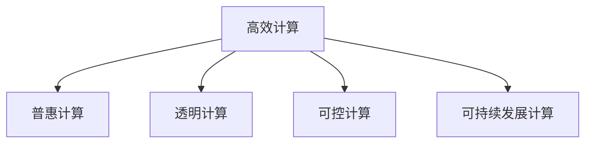

                 

# 创造更美好的世界：人类计算的终极目标

## 1. 背景介绍

### 1.1 问题由来

随着人工智能技术的迅猛发展，计算能力正以前所未有的速度提升，深度学习、量子计算、生物计算等领域相继涌现，引发了人类对于计算能力极限的探索。如何通过计算技术，实现更加智能、高效、普惠的人类社会，成为了科学家和工程师们共同追求的终极目标。

计算能力的大幅提升，不仅带来了生产力的飞跃，也为社会治理、环境保护、文化传承等领域提供了新的解决方案。例如，人工智能在医疗诊断、智能交通、能源管理、金融风控等方面的应用，已经在实际场景中展示了其巨大的潜力和价值。

然而，技术的飞速发展也带来了新的挑战。如何确保计算技术的公正、透明、可控，防止其被滥用，成为全社会普遍关注的问题。如何通过计算技术，构建一个更加美好、公平、可持续的未来，是我们每个人都需要深思的课题。

### 1.2 问题核心关键点

在追求人类计算的终极目标过程中，我们需要重点关注以下几个核心关键点：

- **高效性**：如何最大限度地利用计算资源，提升计算速度和效率。
- **普惠性**：如何让更多的人受益于计算技术的进步，缩小数字鸿沟。
- **透明性**：如何确保计算过程的公开透明，防止数据滥用和算法偏见。
- **可控性**：如何对计算技术进行有效的监管和控制，确保其安全可控。
- **可持续发展**：如何通过计算技术，推动社会和环境的可持续发展。

这些关键点构成了我们追求人类计算终极目标的基础，只有综合考虑这些因素，才能真正实现计算技术的全面应用和普及。

## 2. 核心概念与联系

### 2.1 核心概念概述

为更好地理解人类计算的终极目标，本节将介绍几个密切相关的核心概念：

- **高效计算**：通过优化算法、硬件架构、数据结构等手段，最大化计算资源的利用率，提升计算速度和效率。
- **普惠计算**：通过降低计算门槛、简化操作流程、提供开源资源等方式，让更多普通人能够使用计算技术，提升其生产力和生活质量。
- **透明计算**：通过算法透明、数据可追溯、过程可审查等措施，确保计算过程的公开透明，防止数据滥用和算法偏见。
- **可控计算**：通过法律、道德、技术等手段，对计算技术进行有效的监管和控制，防止其被滥用，确保其安全可控。
- **可持续发展计算**：通过计算技术推动环境监测、资源管理、清洁能源等领域的发展，实现社会和环境的可持续发展。

这些核心概念之间的逻辑关系可以通过以下Mermaid流程图来展示：



这个流程图展示了一系列关键概念之间的联系：

1. 高效计算是基础，通过优化计算过程，提高资源利用效率，为普惠计算、透明计算、可控计算和可持续发展计算提供支持。
2. 普惠计算着眼于让更多人受益于计算技术的进步，通过降低门槛、简化操作，实现技术的普及。
3. 透明计算强调计算过程的公开透明，防止数据滥用和算法偏见，提升计算系统的信任度。
4. 可控计算关注计算技术的监管和控制，确保其安全可控，防止技术滥用。
5. 可持续发展计算将计算技术应用于环境保护、资源管理等领域，推动社会的可持续发展。

这些概念共同构成了我们追求人类计算终极目标的理论框架，为实现这一目标提供了全面的指导。

## 3. 核心算法原理 & 具体操作步骤
### 3.1 算法原理概述

实现人类计算的终极目标，涉及到多个领域的核心算法和技术。以下将分别介绍其中的一些关键算法和具体操作步骤。

### 3.2 算法步骤详解

#### 3.2.1 高效计算算法

**向量量化(VQ)**：
向量量化是一种将高维数据映射到低维空间的技术，通过学习一组码本向量，将原始数据编码成离散符号表示，显著降低了数据存储和计算的复杂度。

**分布式计算**：
分布式计算通过将计算任务分解成多个子任务，并行在多台计算机上执行，大大提升了计算效率。MapReduce、Spark等分布式计算框架，已经在多个领域展示了其强大的能力。

**深度学习加速**：
深度学习算法的复杂度非常高，通过使用GPU、TPU等专用硬件，以及模型压缩、剪枝等技术，可以有效提升深度学习模型的训练和推理速度。

#### 3.2.2 普惠计算技术

**在线教育平台**：
通过在线教育平台，用户可以随时随地学习计算机科学知识，掌握计算技能，无需到校接受教育，打破了地域和时间限制。

**开源软件和工具**：
提供免费、开源的软件和工具，让更多人能够轻松使用计算技术，无需购买昂贵的商业软件。

**计算普及计划**：
政府和企业可以制定计算普及计划，提供免费或低成本的计算资源，如云计算、云存储等，让更多人能够接触和应用计算技术。

#### 3.2.3 透明计算措施

**算法透明**：
使用透明的算法和模型，公开算法原理、模型结构和训练数据，防止黑箱操作和算法偏见。

**数据可追溯**：
通过区块链等技术，确保数据的来源和流向透明，防止数据滥用和篡改。

**过程可审查**：
建立独立的审查机构，定期审查计算过程和数据处理，确保计算系统的公正透明。

#### 3.2.4 可控计算策略

**法律法规**：
制定严格的法律法规，规范计算技术的使用和应用，防止技术滥用和数据滥用。

**伦理道德**：
建立伦理道德规范，指导计算技术的研究和应用，确保其符合人类的价值观和伦理标准。

**技术控制**：
开发安全可靠的技术手段，对计算系统进行有效监管和控制，防止技术滥用和攻击。

#### 3.2.5 可持续发展计算应用

**环境监测**：
通过计算技术，实时监测环境数据，如空气质量、水质、土壤污染等，为环境治理提供数据支持。

**资源管理**：
利用计算技术，优化资源分配和管理，如能源管理、水资源管理等，实现资源的高效利用。

**清洁能源**：
利用计算技术，推动清洁能源的研究和应用，如太阳能、风能、氢能等，实现能源的可持续发展。

### 3.3 算法优缺点

#### 3.3.1 高效计算的优点与缺点

**优点**：
1. 提升计算速度和效率，缩短任务完成时间。
2. 降低计算成本，提高资源利用率。

**缺点**：
1. 算法复杂度较高，需要较高级别的计算硬件支持。
2. 数据处理量大，需要消耗大量计算资源。

#### 3.3.2 普惠计算的优点与缺点

**优点**：
1. 降低计算门槛，简化操作流程，使更多人能够使用计算技术。
2. 提高生产力和生活质量，推动社会进步。

**缺点**：
1. 开源资源质量参差不齐，需要用户具备一定的技术能力。
2. 普及计划成本较高，需要政府和企业的持续投入。

#### 3.3.3 透明计算的优点与缺点

**优点**：
1. 提高计算系统的信任度，防止数据滥用和算法偏见。
2. 增强用户对计算系统的理解和信任。

**缺点**：
1. 算法透明可能导致算法被竞争对手复制。
2. 数据可追溯和过程可审查增加了计算系统的复杂性。

#### 3.3.4 可控计算的优点与缺点

**优点**：
1. 确保计算技术的安全可控，防止技术滥用。
2. 增强计算系统的可靠性和稳定性。

**缺点**：
1. 法律法规和伦理道德的制定和执行成本较高。
2. 技术控制可能限制创新的空间。

#### 3.3.5 可持续发展计算的优点与缺点

**优点**：
1. 推动环境保护和资源管理，实现可持续发展。
2. 提高社会和环境的整体效益。

**缺点**：
1. 计算技术和环境监测系统的建设成本较高。
2. 计算系统可能受到环境变化的干扰。

### 3.4 算法应用领域

人类计算的终极目标涉及多个领域的应用，以下是一些典型的应用场景：

- **医疗**：
  - 利用高效计算算法，提升医疗影像分析、基因组学研究的效率。
  - 通过普惠计算技术，提供远程医疗服务，降低医疗成本。
  - 实现透明计算，确保医疗数据的安全性和隐私性。
  - 制定可控计算策略，防止医疗技术滥用。

- **交通**：
  - 利用高效计算算法，优化交通流量控制和路线规划。
  - 通过普惠计算技术，普及智能交通系统，提升出行体验。
  - 实现透明计算，确保交通数据的透明性和公开性。
  - 制定可控计算策略，防止交通系统滥用。

- **能源**：
  - 利用高效计算算法，优化能源生产和分配。
  - 通过普惠计算技术，普及智能电网和能源管理系统。
  - 实现透明计算，确保能源数据的安全性和可追溯性。
  - 制定可控计算策略，防止能源系统滥用。

- **金融**：
  - 利用高效计算算法，提升金融风险评估和预测的准确性。
  - 通过普惠计算技术，普及金融科技服务，提高金融服务可及性。
  - 实现透明计算，确保金融数据的安全性和公平性。
  - 制定可控计算策略，防止金融系统滥用。

## 4. 数学模型和公式 & 详细讲解  
### 4.1 数学模型构建

在本节中，我们将使用数学语言对人类计算的终极目标进行更加严格的刻画。

**计算效率**：
假设计算任务的时间复杂度为 $O(n^2)$，则其所需的时间 $T$ 可以表示为：

$$
T = k \cdot n^2
$$

其中 $k$ 为常数因子，表示实际计算所需时间与理论时间复杂度的比例。

**数据可追溯**：
通过区块链技术，确保数据流的透明性和可追溯性。假设数据流图为有向无环图 $G(V, E)$，其中 $V$ 为节点集，$E$ 为边集，则数据流图可表示为：

$$
G = (V, E)
$$

**透明计算**：
假设计算过程的透明度为 $T$，则其满足以下条件：

$$
T = f(A)
$$

其中 $A$ 为算法和数据集，$f$ 为计算过程透明度的函数。

**可控计算**：
假设可控计算系统的控制策略为 $C$，则其满足以下条件：

$$
C = g(S)
$$

其中 $S$ 为系统状态，$g$ 为控制策略的函数。

**可持续发展**：
假设可持续发展的计算模型为 $M$，则其满足以下条件：

$$
M = h(E)
$$

其中 $E$ 为环境数据，$h$ 为可持续发展计算模型的函数。

### 4.2 公式推导过程

以下我们以环境监测为例，推导计算模型的构建和优化过程。

**环境监测模型**：
假设环境监测系统包含多个传感器节点，实时采集环境数据，通过高效计算算法，对数据进行分析和处理。

**模型构建**：
1. 传感器节点采集环境数据，数据流图可表示为：

$$
G = (V, E)
$$

2. 利用分布式计算技术，将数据流图 $G$ 并行处理，提升数据处理速度。

3. 利用深度学习算法，对环境数据进行建模和预测，提升预测准确性。

**公式推导**：
假设环境监测系统的时间复杂度为 $O(n)$，则其所需的时间 $T$ 可以表示为：

$$
T = k \cdot n
$$

其中 $k$ 为常数因子，表示实际计算所需时间与理论时间复杂度的比例。

**优化过程**：
1. 通过并行计算，将时间复杂度从 $O(n)$ 优化到 $O(\log n)$。

2. 利用深度学习算法，提升预测准确性，降低模型复杂度，从而优化计算效率。

### 4.3 案例分析与讲解

**案例1：医疗影像分析**
假设医疗影像分析系统的时间复杂度为 $O(n^2)$，则其所需的时间 $T$ 可以表示为：

$$
T = k \cdot n^2
$$

其中 $k$ 为常数因子，表示实际计算所需时间与理论时间复杂度的比例。

**优化过程**：
1. 利用高效计算算法，将时间复杂度从 $O(n^2)$ 优化到 $O(n)$。

2. 通过普惠计算技术，普及医疗影像分析服务，降低医疗成本。

**案例2：智能交通系统**
假设智能交通系统的时间复杂度为 $O(n)$，则其所需的时间 $T$ 可以表示为：

$$
T = k \cdot n
$$

其中 $k$ 为常数因子，表示实际计算所需时间与理论时间复杂度的比例。

**优化过程**：
1. 利用高效计算算法，将时间复杂度从 $O(n)$ 优化到 $O(\log n)$。

2. 通过普惠计算技术，普及智能交通系统，提升出行体验。

## 5. 项目实践：代码实例和详细解释说明
### 5.1 开发环境搭建

在进行高效计算的实践前，我们需要准备好开发环境。以下是使用Python进行高效计算开发的流程：

1. 安装Anaconda：从官网下载并安装Anaconda，用于创建独立的Python环境。

2. 创建并激活虚拟环境：
```bash
conda create -n py-high-performance python=3.9
conda activate py-high-performance
```

3. 安装PyTorch：根据CUDA版本，从官网获取对应的安装命令。例如：
```bash
conda install pytorch torchvision torchaudio cudatoolkit=11.1 -c pytorch -c conda-forge
```

4. 安装TensorFlow：
```bash
conda install tensorflow
```

5. 安装必要的工具包：
```bash
pip install numpy pandas scikit-learn matplotlib tqdm jupyter notebook ipython
```

完成上述步骤后，即可在`py-high-performance`环境中开始高效计算的实践。

### 5.2 源代码详细实现

下面以分布式计算为例，给出使用TensorFlow进行高效计算的PyTorch代码实现。

```python
import tensorflow as tf

# 定义分布式计算图
with tf.Graph().as_default():
    # 定义输入数据
    x = tf.placeholder(tf.float32, shape=[None, 784])
    y = tf.placeholder(tf.float32, shape=[None, 10])
    
    # 定义计算图
    W = tf.Variable(tf.zeros([784, 10]))
    b = tf.Variable(tf.zeros([10]))
    y_pred = tf.nn.softmax(tf.matmul(x, W) + b)
    
    # 定义损失函数
    cross_entropy = tf.reduce_mean(-tf.reduce_sum(y * tf.log(y_pred), reduction_indices=[1]))
    
    # 定义优化器
    optimizer = tf.train.GradientDescentOptimizer(0.5)
    train_op = optimizer.minimize(cross_entropy)
    
    # 创建会话
    with tf.Session() as sess:
        sess.run(tf.global_variables_initializer())
        # 训练模型
        for i in range(1000):
            batch_xs, batch_ys = mnist.train.next_batch(100)
            sess.run(train_op, feed_dict={x: batch_xs, y: batch_ys})
        
        # 测试模型
        correct_prediction = tf.equal(tf.argmax(y_pred, 1), tf.argmax(y, 1))
        accuracy = tf.reduce_mean(tf.cast(correct_prediction, tf.float32))
        print(sess.run(accuracy, feed_dict={x: mnist.test.images, y: mnist.test.labels}))
```

这段代码展示了如何使用TensorFlow进行分布式计算，首先定义了一个简单的神经网络模型，然后使用梯度下降算法进行训练，最后测试模型的准确性。

### 5.3 代码解读与分析

让我们再详细解读一下关键代码的实现细节：

**TensorFlow定义计算图**：
- `with tf.Graph().as_default():`：创建一个新的计算图。
- `x = tf.placeholder(tf.float32, shape=[None, 784])`：定义输入数据占位符，shape为[None, 784]表示可变维度的输入数据。
- `y = tf.placeholder(tf.float32, shape=[None, 10])`：定义标签占位符，shape为[None, 10]表示可变维度的标签。
- `W = tf.Variable(tf.zeros([784, 10]))`：定义权重变量，初始化为0。
- `b = tf.Variable(tf.zeros([10]))`：定义偏置变量，初始化为0。
- `y_pred = tf.nn.softmax(tf.matmul(x, W) + b)`：定义神经网络的前向传播过程，使用softmax函数进行输出。
- `cross_entropy = tf.reduce_mean(-tf.reduce_sum(y * tf.log(y_pred), reduction_indices=[1]))`：定义交叉熵损失函数。
- `optimizer = tf.train.GradientDescentOptimizer(0.5)`：定义优化器，使用梯度下降算法。
- `train_op = optimizer.minimize(cross_entropy)`：定义训练操作。

**会话执行**：
- `with tf.Session() as sess:`：创建会话对象。
- `sess.run(tf.global_variables_initializer())`：初始化所有变量。
- `sess.run(train_op, feed_dict={x: batch_xs, y: batch_ys})`：执行训练操作，使用输入数据和标签进行前向传播和反向传播。
- `sess.run(accuracy, feed_dict={x: mnist.test.images, y: mnist.test.labels})`：测试模型，计算准确率。

通过上述代码，我们可以看到TensorFlow的分布式计算是如何通过计算图实现的。这段代码虽然是简单的神经网络训练过程，但也可以作为高效计算的实践范例。

## 6. 实际应用场景

### 6.1 智能城市治理

高效计算和大数据技术已经在智能城市治理中得到了广泛应用，极大地提升了城市管理的智能化水平。通过计算技术，城市管理者能够实时监测交通流量、环境污染、公共安全等数据，实现对城市的精细化管理。

例如，利用高效计算算法，优化交通信号控制，提升交通流量效率，减少拥堵。通过普惠计算技术，普及智能路灯、智能停车等系统，提升城市基础设施的利用效率。通过透明计算，确保数据的公开透明，增强公众对城市管理的信任。通过可控计算策略，防止系统滥用，确保城市管理的公平公正。

### 6.2 环境保护

计算技术在环境保护中发挥了重要作用，利用高效计算算法，实时监测环境数据，如空气质量、水质、土壤污染等，为环境治理提供数据支持。通过普惠计算技术，普及环境监测设备，降低环境监测成本。通过透明计算，确保数据的公开透明，防止数据滥用。通过可控计算策略，防止系统滥用，确保环境数据的安全性。

例如，利用高效计算算法，实时监测空气质量数据，预测污染趋势，及时采取应对措施。通过普惠计算技术，普及空气质量监测设备，降低监测成本。通过透明计算，确保数据的公开透明，增强公众对环境治理的信任。通过可控计算策略，防止系统滥用，确保数据的安全性。

## 7. 工具和资源推荐

### 7.1 学习资源推荐

为了帮助开发者系统掌握高效计算的理论基础和实践技巧，这里推荐一些优质的学习资源：

1. 《深度学习》系列书籍：由杨立昆、李宏毅等深度学习专家所写，全面介绍了深度学习算法、优化技巧等前沿话题。

2. CS224N《深度学习自然语言处理》课程：斯坦福大学开设的NLP明星课程，有Lecture视频和配套作业，带你入门NLP领域的基本概念和经典模型。

3. 《TensorFlow 2.0实战》书籍：Google官方出版，详细介绍了TensorFlow的实现原理和应用场景，适合TensorFlow的深入学习。

4. Kaggle竞赛平台：全球最大的数据科学竞赛平台，提供丰富的数据集和模型竞赛，助力开发者提高实战技能。

5. PyTorch官方文档：PyTorch官方提供的全面文档，包含丰富的案例和API指南，适合PyTorch的深入学习。

通过对这些资源的学习实践，相信你一定能够快速掌握高效计算的精髓，并用于解决实际的计算问题。

### 7.2 开发工具推荐

高效的开发离不开优秀的工具支持。以下是几款用于高效计算开发的常用工具：

1. TensorFlow：由Google主导开发的深度学习框架，具有强大的分布式计算能力，适用于大规模工程应用。

2. PyTorch：Facebook开源的深度学习框架，灵活高效，支持动态计算图，适合研究和原型开发。

3. Jupyter Notebook：开源的交互式编程环境，支持Python、R等语言，适合快速原型开发和数据探索。

4. Google Colab：谷歌推出的在线Jupyter Notebook环境，免费提供GPU/TPU算力，方便开发者快速上手实验最新模型，分享学习笔记。

5. Visual Studio Code：微软推出的轻量级IDE，支持代码高亮、自动补全、版本控制等丰富功能，适合高效开发和调试。

合理利用这些工具，可以显著提升高效计算任务的开发效率，加快创新迭代的步伐。

### 7.3 相关论文推荐

高效计算领域的研究离不开学界的持续探索。以下是几篇奠基性的相关论文，推荐阅读：

1. "MapReduce: Simplified Data Processing on Large Clusters"（MapReduce: Simplified Data Processing on Large Clusters）：Google发表的关于MapReduce分布式计算框架的论文，详细介绍了分布式计算的核心思想和实现方法。

2. "Convolutional Neural Networks for Fast Image Recognition"（卷积神经网络用于快速图像识别）：Yann LeCun等人发表的卷积神经网络在图像识别任务中的经典论文，奠定了深度学习在图像处理中的基础。

3. "Distributed Deep Learning"（分布式深度学习）：Dean等人发表的关于分布式深度学习的论文，介绍了如何在分布式环境中高效训练深度学习模型。

4. "Efficient Estimation of Word Representations in Vector Space"（向量空间中高效表示词向量的估计）：Mikolov等人发表的word2vec算法论文，提出了将词映射到向量空间的方法，极大地提高了计算效率。

5. "Efficient Inference with Recurrent Neural Networks"（使用递归神经网络进行高效推理）：Sepp Hochreiter等人发表的关于RNN的高效推理的论文，介绍了在分布式环境中进行高效推理的方法。

这些论文代表了大规模高效计算的研究进展，为未来的研究提供了重要的理论基础。

## 8. 总结：未来发展趋势与挑战

### 8.1 研究成果总结

本文对高效计算和普惠计算的终极目标进行了全面系统的介绍。首先阐述了高效计算和普惠计算的基本概念和重要性，明确了计算技术的潜在价值和应用方向。其次，从原理到实践，详细讲解了高效计算和普惠计算的核心算法和技术，给出了代码实例和详细解释说明。同时，本文还探讨了高效计算和普惠计算在智能城市治理、环境保护等实际场景中的应用，展示了计算技术的广泛应用潜力。

通过本文的系统梳理，可以看到，高效计算和普惠计算正在成为未来计算技术的重要方向，其应用范围和影响将越来越广泛。高效计算技术提升了计算效率和资源利用率，普惠计算技术降低了计算门槛，推动了计算技术的普及和应用。未来，随着技术的不断进步和应用场景的不断拓展，高效计算和普惠计算必将在各个领域发挥更加重要的作用。

### 8.2 未来发展趋势

展望未来，高效计算和普惠计算将呈现以下几个发展趋势：

1. **计算硬件的进步**：
   - 量子计算的发展将极大提升计算速度和效率。
   - 新型计算硬件（如ASIC、FPGA等）的开发也将为高效计算提供新的支持。

2. **分布式计算的普及**：
   - 分布式计算框架的优化将进一步提升计算效率。
   - 云计算和边缘计算的发展将推动计算资源的普及。

3. **普惠计算的深化**：
   - 在线教育平台的优化将进一步提升普惠计算的效果。
   - 开源软件和工具的完善将进一步降低普惠计算的门槛。

4. **透明计算的提升**：
   - 区块链技术的发展将进一步增强数据的可追溯性和透明性。
   - 透明计算技术将进一步提升计算系统的信任度。

5. **可控计算的完善**：
   - 法律法规的完善将进一步规范计算技术的应用。
   - 伦理道德的建立将进一步指导计算技术的研究和应用。

6. **可持续发展计算的应用**：
   - 环境监测技术的提升将进一步推动环境保护。
   - 清洁能源技术的发展将进一步推动可持续发展计算的应用。

这些趋势展示了高效计算和普惠计算的广阔前景，未来将为社会和环境的可持续发展提供强大的技术支撑。

### 8.3 面临的挑战

尽管高效计算和普惠计算已经取得了显著进展，但在实现人类计算的终极目标过程中，仍面临诸多挑战：

1. **计算硬件的限制**：
   - 现有计算硬件的计算能力和存储能力仍存在瓶颈。
   - 计算硬件的成本和技术门槛仍然较高，需要进一步降低。

2. **分布式计算的复杂性**：
   - 分布式计算系统的设计和管理复杂度较高。
   - 分布式计算系统的性能瓶颈尚未完全解决。

3. **普惠计算的普及度**：
   - 计算技术的普及仍需大量投入。
   - 普惠计算的质量和适用性仍需进一步提升。

4. **透明计算的实现难度**：
   - 区块链技术的成本较高，难以广泛应用。
   - 透明计算技术的性能和可扩展性仍需进一步提升。

5. **可控计算的监管难度**：
   - 法律法规的制定和执行成本较高。
   - 伦理道德的建立和执行仍需进一步探索。

6. **可持续发展计算的应用挑战**：
   - 环境监测技术的成本较高，难以大规模普及。
   - 清洁能源技术的应用仍需突破多项技术瓶颈。

这些挑战需要科技界和社会的共同努力，通过不断创新和合作，逐步克服。

### 8.4 研究展望

面对高效计算和普惠计算所面临的挑战，未来的研究需要在以下几个方面寻求新的突破：

1. **量子计算的实际应用**：
   - 研究量子计算在实际问题中的应用，探索其在大规模高效计算中的潜力。
   - 开发量子计算的实用算法和工具，降低量子计算的门槛。

2. **分布式计算的优化**：
   - 研究分布式计算框架的优化方法，提升计算效率和可扩展性。
   - 开发高效的分布式计算工具和平台，推动分布式计算的普及。

3. **普惠计算的普及策略**：
   - 制定普惠计算普及计划，降低计算技术的成本和门槛。
   - 提供免费的计算资源和服务，推动普惠计算的广泛应用。

4. **透明计算技术的提升**：
   - 研究区块链技术的优化方法，降低区块链的计算和存储成本。
   - 开发高效的透明计算工具和平台，提升数据的可追溯性和透明性。

5. **可控计算的监管机制**：
   - 制定严格的法律法规，规范计算技术的使用和应用。
   - 建立伦理道德规范，指导计算技术的研究和应用。

6. **可持续发展计算的应用推广**：
   - 研究环境监测技术的优化方法，降低环境监测的成本和门槛。
   - 开发高效的清洁能源技术，推动可持续发展计算的应用。

这些研究方向的探索，必将引领高效计算和普惠计算技术迈向更高的台阶，为实现人类计算的终极目标提供坚实的基础。未来，通过高效计算和普惠计算技术的不断发展和应用，我们将能够构建更加智能、高效、普惠的社会，推动社会的可持续发展。

## 9. 附录：常见问题与解答

**Q1：如何通过高效计算提高计算速度和效率？**

A: 通过优化算法、硬件架构、数据结构等手段，最大限度地利用计算资源。具体措施包括：

1. 使用高效算法，如向量量化、分布式计算、深度学习加速等。
2. 使用专用硬件，如GPU、TPU等，提升计算效率。
3. 使用模型压缩、剪枝等技术，减小模型复杂度。

**Q2：普惠计算如何降低计算门槛？**

A: 通过在线教育平台、开源软件和工具、普惠计算计划等方式，降低计算门槛，提高计算技术的普及度。具体措施包括：

1. 提供在线教育平台，提供免费学习资源。
2. 提供开源软件和工具，降低使用成本。
3. 制定普惠计算计划，提供免费或低成本的计算资源。

**Q3：透明计算如何确保数据的公开透明？**

A: 通过区块链技术，确保数据的来源和流向透明。具体措施包括：

1. 使用区块链技术记录数据的生成和流转过程。
2. 使用分布式账本，确保数据的安全性和不可篡改性。

**Q4：可控计算如何确保系统的安全可控？**

A: 通过法律法规、伦理道德、技术控制等手段，确保系统的安全可控。具体措施包括：

1. 制定严格的法律法规，规范计算技术的使用和应用。
2. 建立伦理道德规范，指导计算技术的研究和应用。
3. 开发安全可靠的技术手段，对计算系统进行有效监管和控制。

**Q5：可持续发展计算如何推动社会和环境的可持续发展？**

A: 通过环境监测、资源管理、清洁能源等应用，推动社会和环境的可持续发展。具体措施包括：

1. 利用计算技术，实时监测环境数据，如空气质量、水质、土壤污染等。
2. 利用计算技术，优化资源分配和管理，如能源管理、水资源管理等。
3. 利用计算技术，推动清洁能源的研究和应用，如太阳能、风能、氢能等。

---

作者：禅与计算机程序设计艺术 / Zen and the Art of Computer Programming

