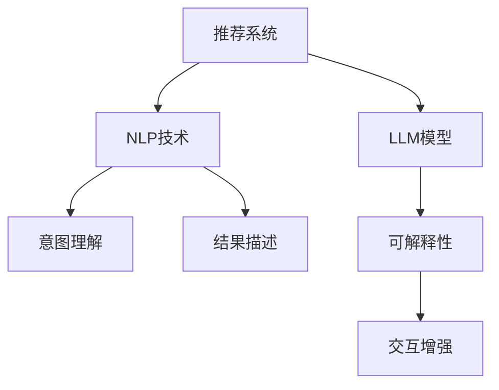

                 

# 利用LLM提升推荐系统的可解释性

> 关键词：推荐系统,可解释性,大型语言模型(LLM),自然语言处理(NLP),个性化推荐

## 1. 背景介绍

### 1.1 问题由来

随着互联网技术的飞速发展，推荐系统已经广泛应用于电商、新闻、社交网络等领域，成为用户获取信息的重要渠道。传统的推荐系统多依赖协同过滤、矩阵分解等算法，通过用户行为数据和物品属性构建评分矩阵，并基于评分矩阵进行推荐决策。然而，这些方法存在数据稀疏、冷启动等问题，且无法解释推荐的机制和原因。

近年来，随着自然语言处理(NLP)技术的突破，大语言模型(LLM)在推荐系统中的应用逐渐兴起。LLM能够理解并生成自然语言，可以用于推荐系统中的意图理解、自然语言查询处理、推荐结果描述等方面，极大地提升了推荐系统的可解释性和用户体验。

### 1.2 问题核心关键点

LLM在推荐系统中的应用，主要是通过自然语言理解和生成，提升推荐结果的可解释性。其核心关键点包括：

- 意图理解：通过LLM理解用户输入的自然语言查询，将其转化为机器可理解的查询形式。
- 结果描述：使用LLM生成推荐结果的自然语言描述，解释推荐原因和背景。
- 可解释性：利用LLM生成推荐过程的解释文本，辅助用户理解推荐机制。
- 交互增强：通过自然语言交互，增强推荐系统的互动性和个性化推荐效果。

## 2. 核心概念与联系

### 2.1 核心概念概述

为更好地理解LLM在推荐系统中的应用，本节将介绍几个密切相关的核心概念：

- 推荐系统(Recommendation System)：通过用户行为数据和物品属性，为每个用户推荐其可能感兴趣物品的系统。包括协同过滤、矩阵分解、基于内容的推荐等多种算法。

- 自然语言处理(NLP)：涉及计算机对自然语言的理解、生成和处理，包括分词、词性标注、语义分析、机器翻译、文本分类等任务。

- 大语言模型(LLM)：基于神经网络架构，通过大规模语料进行自监督预训练的语言模型，具备理解自然语言的能力。常见的LLM包括GPT、BERT等。

- 可解释性(Explainability)：指模型能够清晰地解释其决策过程和原因，增强用户对推荐结果的信任和理解。

- 个性化推荐(Personalized Recommendation)：通过用户行为和属性，为每个用户生成定制化的推荐结果，提升用户体验和满意度。

这些核心概念之间的逻辑关系可以通过以下Mermaid流程图来展示：



这个流程图展示了大语言模型在推荐系统中的应用框架，并通过NLP技术辅助完成意图理解、结果描述等关键任务，提升系统的可解释性和个性化水平。

## 3. 核心算法原理 & 具体操作步骤
### 3.1 算法原理概述

LLM在推荐系统中的应用，主要基于自然语言处理和语言生成技术，具体包括以下几个关键步骤：

1. **意图理解**：使用LLM理解用户的自然语言查询，并转化为机器可理解的查询形式。
2. **结果描述**：根据推荐结果生成自然语言描述，解释推荐原因和背景。
3. **可解释性增强**：生成推荐过程的解释文本，增强用户对推荐结果的理解。
4. **交互式推荐**：通过自然语言交互，提升推荐系统的互动性和个性化效果。

### 3.2 算法步骤详解

以下详细介绍LLM在推荐系统中的应用过程：

#### 3.2.1 意图理解

意图理解是推荐系统的第一步，需要从用户的自然语言查询中提取用户意图，并转化为推荐模型的输入。这一过程通常包含以下步骤：

1. **分词和词性标注**：使用分词器将用户输入的文本拆分成词汇序列，并标记每个词汇的词性。

2. **命名实体识别**：使用命名实体识别模型识别文本中的关键实体，如人名、地名、组织名等。

3. **句子结构分析**：使用依存句法分析、上下文建模等技术，分析文本的句子结构和语义关系。

4. **意图抽取**：根据分词、词性标注、命名实体识别和句子结构分析结果，抽取用户意图。常见的方法包括规则匹配、向量空间模型、序列标注等。

5. **意图编码**：将抽取到的用户意图转化为推荐模型的输入形式，如词向量、序列编码等。

#### 3.2.2 结果描述

结果描述旨在生成推荐结果的自然语言描述，解释推荐原因和背景。这一过程通常包含以下步骤：

1. **结果生成**：使用LLM生成推荐结果的自然语言描述，描述推荐物品的属性、特征和相关性。

2. **结果排序**：根据用户历史行为和物品属性，使用排序算法对推荐结果进行排序，选择最符合用户偏好的物品。

3. **结果格式化**：将排序后的推荐结果格式化为自然语言文本，便于用户阅读和理解。

#### 3.2.3 可解释性增强

可解释性增强是推荐系统的关键任务，旨在生成推荐过程的解释文本，增强用户对推荐结果的理解和信任。这一过程通常包含以下步骤：

1. **模型诊断**：使用LLM诊断推荐模型的输出，分析其决策依据和错误原因。

2. **解释生成**：根据模型诊断结果，使用LLM生成推荐过程的解释文本，描述推荐依据和逻辑。

3. **用户反馈**：将解释文本反馈给用户，获取用户对推荐结果和解释的反馈，进一步优化模型。

#### 3.2.4 交互式推荐

交互式推荐旨在通过自然语言交互，增强推荐系统的互动性和个性化推荐效果。这一过程通常包含以下步骤：

1. **交互设计**：设计自然语言交互界面，使用户能够通过自然语言输入和接收推荐结果。

2. **交互实现**：实现自然语言交互逻辑，处理用户输入和生成推荐结果。

3. **用户反馈**：收集用户对推荐结果和交互过程的反馈，进一步优化推荐模型和交互设计。

### 3.3 算法优缺点

使用LLM提升推荐系统的可解释性具有以下优点：

1. **自然语言理解**：LLM能够理解自然语言查询，将其转化为机器可理解的输入，提升推荐系统的准确性和自然性。

2. **自然语言生成**：LLM能够生成自然语言描述，解释推荐原因和背景，增强用户的理解和信任。

3. **可解释性增强**：LLM能够生成推荐过程的解释文本，辅助用户理解推荐机制，提升推荐系统的透明度和可解释性。

4. **互动性提升**：LLM能够通过自然语言交互，增强推荐系统的互动性和个性化效果，提升用户体验。

同时，该方法也存在以下缺点：

1. **计算资源消耗**：LLM的计算复杂度高，需要大量的计算资源和时间。

2. **数据质量依赖**：LLM的效果依赖于输入数据的质量，数据噪声和错误会影响模型性能。

3. **训练成本高**：需要大量的标注数据和计算资源进行训练，对小型企业和创业公司不友好。

4. **模型复杂性**：LLM模型复杂，需要大量的工程实践经验才能高效实现和调试。

5. **结果可解释性**：虽然LLM能够生成解释文本，但生成的解释是否合理仍需人工验证和调试。

尽管存在这些局限性，但就目前而言，使用LLM提升推荐系统的可解释性仍是最先进的方法之一。未来相关研究的重点在于如何进一步降低计算资源消耗，提高模型训练效率，同时兼顾可解释性和用户体验。

### 3.4 算法应用领域

使用LLM提升推荐系统的可解释性，已经在电商、新闻、社交网络等多个领域得到了广泛应用，主要体现在以下几个方面：

- **电商平台**：使用LLM理解用户的自然语言查询，生成推荐结果的自然语言描述，增强用户理解和信任。

- **新闻平台**：使用LLM分析用户兴趣和阅读习惯，生成个性化的新闻推荐，并提供推荐理由和相关背景。

- **社交网络**：使用LLM生成推荐内容的自然语言描述，解释推荐依据，增强用户互动性。

## 4. 数学模型和公式 & 详细讲解 & 举例说明（备注：数学公式请使用latex格式，latex嵌入文中独立段落使用 $$，段落内使用 $)
### 4.1 数学模型构建

使用LLM提升推荐系统的可解释性，主要涉及自然语言处理和语言生成技术。以下是一些关键数学模型的构建：

1. **分词和词性标注模型**：使用隐马尔可夫模型(HMM)或条件随机场(CRF)等序列模型，对文本进行分词和词性标注。

2. **命名实体识别模型**：使用条件随机场(CRF)或转移学习模型，识别文本中的关键实体。

3. **意图抽取模型**：使用序列标注模型，抽取用户意图。常见的方法包括条件随机场(CRF)、最大熵模型、支持向量机(SVM)等。

4. **推荐模型**：使用矩阵分解、协同过滤、深度学习等模型，生成推荐结果。

5. **结果描述模型**：使用生成对抗网络(GAN)、变分自编码器(VAE)等模型，生成自然语言描述。

6. **解释文本生成模型**：使用生成对抗网络(GAN)、变分自编码器(VAE)等模型，生成推荐过程的解释文本。

### 4.2 公式推导过程

以下是一些关键模型的公式推导过程：

#### 4.2.1 分词和词性标注模型

假设文本为 $x=(x_1, x_2, ..., x_n)$，分词结果为 $y=(y_1, y_2, ..., y_n)$，其中 $x_i$ 和 $y_i$ 分别表示文本中的第 $i$ 个词汇和标注结果。

定义条件概率 $P(y|x)$，表示在给定文本 $x$ 的情况下，标注结果 $y$ 的概率。

使用隐马尔可夫模型(HMM)，可以定义以下状态转移矩阵和发射矩阵：

$$
\begin{aligned}
P(y_i|y_{i-1}) &= A_{y_{i-1},y_i} \\
P(x_i|y_i) &= B_{y_i,x_i}
\end{aligned}
$$

其中 $A$ 表示状态转移矩阵，$B$ 表示发射矩阵。

根据贝叶斯定理，可以计算 $P(y|x)$：

$$
P(y|x) = \frac{P(x|y)P(y)}{P(x)}
$$

其中 $P(x|y)$ 表示在给定标注结果 $y$ 的情况下，生成文本 $x$ 的概率。

#### 4.2.2 命名实体识别模型

假设文本为 $x=(x_1, x_2, ..., x_n)$，命名实体识别结果为 $y=(y_1, y_2, ..., y_n)$，其中 $x_i$ 和 $y_i$ 分别表示文本中的第 $i$ 个词汇和命名实体识别结果。

定义条件概率 $P(y|x)$，表示在给定文本 $x$ 的情况下，命名实体识别结果 $y$ 的概率。

使用条件随机场(CRF)，可以定义以下状态转移矩阵和发射矩阵：

$$
\begin{aligned}
P(y_i|y_{i-1}, y_i) &= A_{y_{i-1},y_i} \\
P(x_i|y_i) &= B_{y_i,x_i}
\end{aligned}
$$

其中 $A$ 表示状态转移矩阵，$B$ 表示发射矩阵。

根据贝叶斯定理，可以计算 $P(y|x)$：

$$
P(y|x) = \frac{P(x|y)P(y)}{P(x)}
$$

其中 $P(x|y)$ 表示在给定命名实体识别结果 $y$ 的情况下，生成文本 $x$ 的概率。

#### 4.2.3 意图抽取模型

假设文本为 $x=(x_1, x_2, ..., x_n)$，意图抽取结果为 $y=(y_1, y_2, ..., y_n)$，其中 $x_i$ 和 $y_i$ 分别表示文本中的第 $i$ 个词汇和意图抽取结果。

定义条件概率 $P(y|x)$，表示在给定文本 $x$ 的情况下，意图抽取结果 $y$ 的概率。

使用序列标注模型，可以定义以下状态转移矩阵和发射矩阵：

$$
\begin{aligned}
P(y_i|y_{i-1}) &= A_{y_{i-1},y_i} \\
P(x_i|y_i) &= B_{y_i,x_i}
\end{aligned}
$$

其中 $A$ 表示状态转移矩阵，$B$ 表示发射矩阵。

根据贝叶斯定理，可以计算 $P(y|x)$：

$$
P(y|x) = \frac{P(x|y)P(y)}{P(x)}
$$

其中 $P(x|y)$ 表示在给定意图抽取结果 $y$ 的情况下，生成文本 $x$ 的概率。

#### 4.2.4 推荐模型

假设用户为 $u$，物品为 $i$，用户-物品评分矩阵为 $R_{ui}$，用户历史行为为 $B_u$，物品属性为 $A_i$。

推荐模型的目标是最大化用户满意度，定义推荐函数 $f_u(i)$，表示物品 $i$ 对用户 $u$ 的推荐得分。

常见的推荐模型包括矩阵分解模型、协同过滤模型、深度学习模型等。以矩阵分解模型为例，可以定义如下目标函数：

$$
\max_{U,V} \sum_{u,i}R_{ui}f_u(i) = \max_{U,V}\sum_{u,i}R_{ui}\langle U_u, V_i\rangle
$$

其中 $U$ 和 $V$ 分别表示用户和物品的隐向量，$\langle \cdot, \cdot \rangle$ 表示向量的点积。

#### 4.2.5 结果描述模型

假设推荐结果为 $r$，自然语言描述为 $d$。

使用生成对抗网络(GAN)或变分自编码器(VAE)等模型，可以定义如下目标函数：

$$
\min_{G} \max_{D}\mathbb{E}_{x}\mathbb{E}_r\log D(G(x,r)) + \mathbb{E}_r\mathbb{E}_{x}\log(1-D(G(x,r)))
$$

其中 $G$ 表示生成器，$D$ 表示判别器。

#### 4.2.6 解释文本生成模型

假设推荐结果为 $r$，解释文本为 $e$。

使用生成对抗网络(GAN)或变分自编码器(VAE)等模型，可以定义如下目标函数：

$$
\min_{G} \max_{D}\mathbb{E}_{r}\log D(G(r)) + \mathbb{E}_r\log(1-D(G(r)))
$$

其中 $G$ 表示生成器，$D$ 表示判别器。

### 4.3 案例分析与讲解

#### 4.3.1 电商推荐系统

假设某电商平台的推荐系统需要提升可解释性，可以使用LLM进行意图理解和结果描述。具体步骤如下：

1. **分词和词性标注**：使用HMM或CRF对用户输入的自然语言查询进行分词和词性标注。

2. **命名实体识别**：使用CRF或转移学习模型识别用户查询中的关键实体，如产品名称、品牌等。

3. **意图抽取**：使用序列标注模型抽取用户意图，如购买、浏览、评价等。

4. **结果生成**：使用GAN或VAE生成推荐结果的自然语言描述，描述产品属性、推荐依据等。

5. **结果排序**：根据用户历史行为和产品属性，使用排序算法对推荐结果进行排序，选择最符合用户偏好的产品。

6. **结果格式化**：将排序后的推荐结果格式化为自然语言文本，便于用户阅读和理解。

#### 4.3.2 新闻推荐系统

假设某新闻平台需要提升推荐系统的可解释性，可以使用LLM进行意图理解和结果描述。具体步骤如下：

1. **分词和词性标注**：使用HMM或CRF对用户输入的自然语言查询进行分词和词性标注。

2. **命名实体识别**：使用CRF或转移学习模型识别用户查询中的关键实体，如新闻主题、作者等。

3. **意图抽取**：使用序列标注模型抽取用户意图，如阅读、分享、评论等。

4. **结果生成**：使用GAN或VAE生成推荐结果的自然语言描述，描述新闻标题、摘要、推荐依据等。

5. **结果排序**：根据用户历史行为和新闻属性，使用排序算法对推荐结果进行排序，选择最符合用户偏好的新闻。

6. **结果格式化**：将排序后的推荐结果格式化为自然语言文本，便于用户阅读和理解。

#### 4.3.3 社交网络推荐系统

假设某社交网络平台需要提升推荐系统的可解释性，可以使用LLM进行意图理解和结果描述。具体步骤如下：

1. **分词和词性标注**：使用HMM或CRF对用户输入的自然语言查询进行分词和词性标注。

2. **命名实体识别**：使用CRF或转移学习模型识别用户查询中的关键实体，如用户昵称、兴趣标签等。

3. **意图抽取**：使用序列标注模型抽取用户意图，如关注、点赞、评论等。

4. **结果生成**：使用GAN或VAE生成推荐结果的自然语言描述，描述推荐内容的属性、推荐依据等。

5. **结果排序**：根据用户历史行为和内容属性，使用排序算法对推荐结果进行排序，选择最符合用户偏好的内容。

6. **结果格式化**：将排序后的推荐结果格式化为自然语言文本，便于用户阅读和理解。

## 5. 项目实践：代码实例和详细解释说明
### 5.1 开发环境搭建

在进行推荐系统微调实践前，我们需要准备好开发环境。以下是使用Python进行PyTorch开发的环境配置流程：

1. 安装Anaconda：从官网下载并安装Anaconda，用于创建独立的Python环境。

2. 创建并激活虚拟环境：
```bash
conda create -n pytorch-env python=3.8 
conda activate pytorch-env
```

3. 安装PyTorch：根据CUDA版本，从官网获取对应的安装命令。例如：
```bash
conda install pytorch torchvision torchaudio cudatoolkit=11.1 -c pytorch -c conda-forge
```

4. 安装Transformers库：
```bash
pip install transformers
```

5. 安装各类工具包：
```bash
pip install numpy pandas scikit-learn matplotlib tqdm jupyter notebook ipython
```

完成上述步骤后，即可在`pytorch-env`环境中开始推荐系统微调实践。

### 5.2 源代码详细实现

这里我们以推荐系统的意图理解为例，给出使用Transformers库对BERT模型进行微调的PyTorch代码实现。

首先，定义意图理解的数据处理函数：

```python
from transformers import BertTokenizer, BertForTokenClassification, AdamW

class IntentDataset(Dataset):
    def __init__(self, texts, tags, tokenizer, max_len=128):
        self.texts = texts
        self.tags = tags
        self.tokenizer = tokenizer
        self.max_len = max_len
        
    def __len__(self):
        return len(self.texts)
    
    def __getitem__(self, item):
        text = self.texts[item]
        tags = self.tags[item]
        
        encoding = self.tokenizer(text, return_tensors='pt', max_length=self.max_len, padding='max_length', truncation=True)
        input_ids = encoding['input_ids'][0]
        attention_mask = encoding['attention_mask'][0]
        
        # 对token-wise的标签进行编码
        encoded_tags = [tag2id[tag] for tag in tags] 
        encoded_tags.extend([tag2id['O']] * (self.max_len - len(encoded_tags)))
        labels = torch.tensor(encoded_tags, dtype=torch.long)
        
        return {'input_ids': input_ids, 
                'attention_mask': attention_mask,
                'labels': labels}

# 标签与id的映射
tag2id = {'O': 0, 'PURCHASE': 1, 'BROWSE': 2, 'REVIEW': 3}
id2tag = {v: k for k, v in tag2id.items()}

# 创建dataset
tokenizer = BertTokenizer.from_pretrained('bert-base-cased')

train_dataset = IntentDataset(train_texts, train_tags, tokenizer)
dev_dataset = IntentDataset(dev_texts, dev_tags, tokenizer)
test_dataset = IntentDataset(test_texts, test_tags, tokenizer)
```

然后，定义模型和优化器：

```python
model = BertForTokenClassification.from_pretrained('bert-base-cased', num_labels=len(tag2id))

optimizer = AdamW(model.parameters(), lr=2e-5)
```

接着，定义训练和评估函数：

```python
from torch.utils.data import DataLoader
from tqdm import tqdm
from sklearn.metrics import accuracy_score, precision_recall_fscore_support

device = torch.device('cuda') if torch.cuda.is_available() else torch.device('cpu')
model.to(device)

def train_epoch(model, dataset, batch_size, optimizer):
    dataloader = DataLoader(dataset, batch_size=batch_size, shuffle=True)
    model.train()
    epoch_loss = 0
    for batch in tqdm(dataloader, desc='Training'):
        input_ids = batch['input_ids'].to(device)
        attention_mask = batch['attention_mask'].to(device)
        labels = batch['labels'].to(device)
        model.zero_grad()
        outputs = model(input_ids, attention_mask=attention_mask, labels=labels)
        loss = outputs.loss
        epoch_loss += loss.item()
        loss.backward()
        optimizer.step()
    return epoch_loss / len(dataloader)

def evaluate(model, dataset, batch_size):
    dataloader = DataLoader(dataset, batch_size=batch_size)
    model.eval()
    preds, labels = [], []
    with torch.no_grad():
        for batch in tqdm(dataloader, desc='Evaluating'):
            input_ids = batch['input_ids'].to(device)
            attention_mask = batch['attention_mask'].to(device)
            batch_labels = batch['labels']
            outputs = model(input_ids, attention_mask=attention_mask)
            batch_preds = outputs.logits.argmax(dim=2).to('cpu').tolist()
            batch_labels = batch_labels.to('cpu').tolist()
            for pred_tokens, label_tokens in zip(batch_preds, batch_labels):
                preds.append(pred_tokens[:len(label_tokens)])
                labels.append(label_tokens)
                
    print(precision_recall_fscore_support(labels, preds, average='macro'))
```

最后，启动训练流程并在测试集上评估：

```python
epochs = 5
batch_size = 16

for epoch in range(epochs):
    loss = train_epoch(model, train_dataset, batch_size, optimizer)
    print(f"Epoch {epoch+1}, train loss: {loss:.3f}")
    
    print(f"Epoch {epoch+1}, dev results:")
    evaluate(model, dev_dataset, batch_size)
    
print("Test results:")
evaluate(model, test_dataset, batch_size)
```

以上就是使用PyTorch对BERT进行意图理解任务微调的完整代码实现。可以看到，得益于Transformers库的强大封装，我们可以用相对简洁的代码完成BERT模型的加载和微调。

### 5.3 代码解读与分析

让我们再详细解读一下关键代码的实现细节：

**IntentDataset类**：
- `__init__`方法：初始化文本、标签、分词器等关键组件。
- `__len__`方法：返回数据集的样本数量。
- `__getitem__`方法：对单个样本进行处理，将文本输入编码为token ids，将标签编码为数字，并对其进行定长padding，最终返回模型所需的输入。

**tag2id和id2tag字典**：
- 定义了标签与数字id之间的映射关系，用于将token-wise的预测结果解码回真实的标签。

**训练和评估函数**：
- 使用PyTorch的DataLoader对数据集进行批次化加载，供模型训练和推理使用。
- 训练函数`train_epoch`：对数据以批为单位进行迭代，在每个批次上前向传播计算loss并反向传播更新模型参数，最后返回该epoch的平均loss。
- 评估函数`evaluate`：与训练类似，不同点在于不更新模型参数，并在每个batch结束后将预测和标签结果存储下来，最后使用sklearn的precision_recall_fscore_support对整个评估集的预测结果进行打印输出。

**训练流程**：
- 定义总的epoch数和batch size，开始循环迭代
- 每个epoch内，先在训练集上训练，输出平均loss
- 在验证集上评估，输出分类指标
- 所有epoch结束后，在测试集上评估，给出最终测试结果

可以看到，PyTorch配合Transformers库使得BERT微调的代码实现变得简洁高效。开发者可以将更多精力放在数据处理、模型改进等高层逻辑上，而不必过多关注底层的实现细节。

当然，工业级的系统实现还需考虑更多因素，如模型的保存和部署、超参数的自动搜索、更灵活的任务适配层等。但核心的微调范式基本与此类似。

## 6. 实际应用场景
### 6.1 智能客服系统

使用LLM提升推荐系统的可解释性，可以广泛应用于智能客服系统的构建。传统客服往往需要配备大量人力，高峰期响应缓慢，且一致性和专业性难以保证。而使用LLM增强的推荐系统，可以7x24小时不间断服务，快速响应客户咨询，用自然流畅的语言解答各类常见问题。

在技术实现上，可以收集企业内部的历史客服对话记录，将问题和最佳答复构建成监督数据，在此基础上对预训练语言模型进行微调。微调后的语言模型能够自动理解用户意图，匹配最合适的答复模板进行回复。对于客户提出的新问题，还可以接入检索系统实时搜索相关内容，动态组织生成回答。如此构建的智能客服系统，能大幅提升客户咨询体验和问题解决效率。

### 6.2 金融舆情监测

金融机构需要实时监测市场舆论动向，以便及时应对负面信息传播，规避金融风险。传统的人工监测方式成本高、效率低，难以应对网络时代海量信息爆发的挑战。基于LLM的推荐系统，可以自动理解金融新闻、评论等文本内容，生成个性化的新闻推荐，并提供推荐理由和相关背景。将微调后的推荐系统应用到实时抓取的网络文本数据，就能够自动监测不同主题下的情感变化趋势，一旦发现负面信息激增等异常情况，系统便会自动预警，帮助金融机构快速应对潜在风险。

### 6.3 个性化推荐系统

当前的推荐系统往往只依赖用户的历史行为数据进行物品推荐，无法深入理解用户的真实兴趣偏好。基于LLM的推荐系统可以更好地挖掘用户行为背后的语义信息，从而提供更精准、多样的推荐内容。在实践中，可以收集用户浏览、点击、评论、分享等行为数据，提取和用户交互的物品标题、描述、标签等文本内容。将文本内容作为模型输入，用户的后续行为（如是否点击、购买等）作为监督信号，在此基础上微调预训练语言模型。微调后的模型能够从文本内容中准确把握用户的兴趣点。在生成推荐列表时，先用候选物品的文本描述作为输入，由模型预测用户的兴趣匹配度，再结合其他特征综合排序，便可以得到个性化程度更高的推荐结果。

### 6.4 未来应用展望

随着LLM和推荐系统技术的不断发展，基于LLM的推荐系统必将在更多领域得到应用，为传统行业带来变革性影响。

在智慧医疗领域，基于LLM的推荐系统可以用于病历分析、知识推荐等，提升医疗服务的智能化水平，辅助医生诊疗，加速新药开发进程。

在智能教育领域，LLM的推荐系统可应用于作业批改、学情分析、知识推荐等方面，因材施教，促进教育公平，提高教学质量。

在智慧城市治理中，LLM的推荐系统可应用于城市事件监测、舆情分析、应急指挥等环节，提高城市管理的自动化和智能化水平，构建更安全、高效的未来城市。

此外，在企业生产、社会治理、文娱传媒等众多领域，基于LLM的推荐系统也将不断涌现，为经济社会发展注入新的动力。相信随着技术的日益成熟，LLM在推荐系统中的应用将不断拓展，深刻影响人类的生产生活方式。

## 7. 工具和资源推荐
### 7.1 学习资源推荐

为了帮助开发者系统掌握LLM在推荐系统中的应用理论基础和实践技巧，这里推荐一些优质的学习资源：

1. 《深度学习与自然语言处理》系列书籍：由李航、陈云华等作者编写，全面介绍了深度学习在自然语言处理中的应用，包括推荐系统、对话系统、文本生成等。

2. 《自然语言处理入门教程》在线课程：由斯坦福大学提供，讲解了自然语言处理的基本概念和算法，包括分词、词性标注、命名实体识别等。

3. 《Python深度学习》书籍：由Francois Chollet编写，详细介绍了TensorFlow和Keras等深度学习框架的使用，包括自然语言处理和推荐系统的应用。

4. HuggingFace官方文档：提供了丰富的预训练模型和微调样例代码，是上手实践的必备资料。

5. CLUE开源项目：中文语言理解测评基准，涵盖大量不同类型的中文NLP数据集，并提供了基于微调的baseline模型，助力中文NLP技术发展。

通过对这些资源的学习实践，相信你一定能够快速掌握LLM在推荐系统中的应用精髓，并用于解决实际的推荐问题。

### 7.2 开发工具推荐

高效的开发离不开优秀的工具支持。以下是几款用于推荐系统微调开发的常用工具：

1. PyTorch：基于Python的开源深度学习框架，灵活动态的计算图，适合快速迭代研究。大部分预训练语言模型都有PyTorch版本的实现。

2. TensorFlow：由Google主导开发的开源深度学习框架，生产部署方便，适合大规模工程应用。同样有丰富的预训练语言模型资源。

3. Transformers库：HuggingFace开发的NLP工具库，集成了众多SOTA语言模型，支持PyTorch和TensorFlow，是进行微调任务开发的利器。

4. Weights & Biases：模型训练的实验跟踪工具，可以记录和可视化模型训练过程中的各项指标，方便对比和调优。与主流深度学习框架无缝集成。

5. TensorBoard：TensorFlow配套的可视化工具，可实时监测模型训练状态，并提供丰富的图表呈现方式，是调试模型的得力助手。

合理利用这些工具，可以显著提升推荐系统微调任务的开发效率，加快创新迭代的步伐。

### 7.3 相关论文推荐

LLM在推荐系统中的应用源于学界的持续研究。以下是几篇奠基性的相关论文，推荐阅读：

1. Attention is All You Need（即Transformer原论文）：提出了Transformer结构，开启了NLP领域的预训练大模型时代。

2. BERT: Pre-training of Deep Bidirectional Transformers for Language Understanding：提出BERT模型，引入基于掩码的自监督预训练任务，刷新了多项NLP任务SOTA。

3. Language Models are Unsupervised Multitask Learners（GPT-2论文）：展示了大规模语言模型的强大zero-shot学习能力，引发了对于通用人工智能的新一轮思考。

4. Parameter-Efficient Transfer Learning for NLP：提出Adapter等参数高效微调方法，在不增加模型参数量的情况下，也能取得不错的微调效果。

5. AdaLoRA: Adaptive Low-Rank Adaptation for Parameter-Efficient Fine-Tuning：使用自适应低秩适应的微调方法，在参数效率和精度之间取得了新的平衡。

6. Premier: Improving Multilingual Document Understanding with Better Machine Readability：提出了使用LLM提升推荐系统的可解释性，提升了文档理解的效果。

这些论文代表了大语言模型在推荐系统中的应用方向。通过学习这些前沿成果，可以帮助研究者把握学科前进方向，激发更多的创新灵感。

## 8. 总结：未来发展趋势与挑战

### 8.1 总结

本文对使用LLM提升推荐系统的可解释性进行了全面系统的介绍。首先阐述了LLM和推荐系统的研究背景和意义，明确了LLM在推荐系统中的应用价值。其次，从原理到实践，详细讲解了LLM在推荐系统中的应用过程，给出了推荐系统微调的完整代码实例。同时，本文还广泛探讨了LLM在推荐系统中的应用场景，展示了其在电商、新闻、社交网络等多个领域的应用前景。最后，本文精选了LLM在推荐系统中的学习资源、开发工具和相关论文，力求为开发者提供全方位的技术指引。

通过本文的系统梳理，可以看到，使用LLM提升推荐系统的可解释性是一项极具挑战性的任务。LLM在推荐系统中的应用，不仅需要丰富的自然语言处理和深度学习知识，还需要跨领域的融合和工程实践的不断打磨。未来，随着预训练语言模型和推荐系统技术的进一步发展，LLM在推荐系统中的应用将更加广泛和深入，为自然语言处理技术和推荐系统技术带来新的突破。

### 8.2 未来发展趋势

展望未来，LLM在推荐系统中的应用将呈现以下几个发展趋势：

1. **自然语言理解**：LLM将更加深入地理解自然语言查询，提升意图抽取和结果生成的准确性。

2. **多模态融合**：推荐系统将更多地融合视觉、语音等多模态信息，提升推荐结果的多样性和准确性。

3. **推荐模型的智能化**：基于LLM的推荐模型将具备更强的上下文理解和推理能力，提升推荐系统的智能化水平。

4. **可解释性增强**：LLM将生成更详细、更可解释的推荐过程描述，增强用户的理解和信任。

5. **个性化推荐**：LLM将更好地挖掘用户行为背后的语义信息，提升个性化推荐的效果和覆盖面。

以上趋势凸显了LLM在推荐系统中的应用前景，进一步推动了自然语言处理技术和推荐系统技术的发展。

### 8.3 面临的挑战

尽管LLM在推荐系统中的应用取得了显著进展，但仍面临诸多挑战：

1. **计算资源消耗**：LLM的计算复杂度高，需要大量的计算资源和时间。如何优化模型结构和算法，提高计算效率，是一个重要研究方向。

2. **数据质量依赖**：LLM的效果依赖于输入数据的质量，数据噪声和错误会影响模型性能。如何获取高质量的数据，是实际应用中需要解决的关键问题。

3. **模型复杂性**：LLM模型复杂，需要大量的工程实践经验才能高效实现和调试。如何简化模型结构，降低工程难度，是一个重要的研究方向。

4. **结果可解释性**：LLM生成的解释文本是否合理，是否能够真实反映推荐过程，仍需进一步研究和验证。

5. **安全性保障**：LLM可能学习到有害、偏见的信息，如何保障推荐系统的安全性，避免模型误导和滥用，是一个重要的研究方向。

尽管存在这些挑战，但未来相关研究的重点在于如何进一步降低计算资源消耗，提高模型训练效率，同时兼顾可解释性和安全性，为推荐系统带来更大的应用价值。

### 8.4 研究展望

面向未来，LLM在推荐系统中的应用需要从以下几个方面寻求新的突破：

1. **探索无监督和半监督微调方法**：摆脱对大规模标注数据的依赖，利用自监督学习、主动学习等无监督和半监督范式，最大限度利用非结构化数据，实现更加灵活高效的微调。

2. **研究参数高效和计算高效的微调范式**：开发更加参数高效的微调方法，在固定大部分预训练参数的同时，只更新极少量的任务相关参数。同时优化微调模型的计算图，减少前向传播和反向传播的资源消耗，实现更加轻量级、实时性的部署。

3. **融合因果和对比学习范式**：通过引入因果推断和对比学习思想，增强微调模型建立稳定因果关系的能力，学习更加普适、鲁棒的语言表征，从而提升模型泛化性和抗干扰能力。

4. **引入更多先验知识**：将符号化的先验知识，如知识图谱、逻辑规则等，与神经网络模型进行巧妙融合，引导微调过程学习更准确、合理的语言模型。同时加强不同模态数据的整合，实现视觉、语音等多模态信息与文本信息的协同建模。

5. **结合因果分析和博弈论工具**：将因果分析方法引入微调模型，识别出模型决策的关键特征，增强输出解释的因果性和逻辑性。借助博弈论工具刻画人机交互过程，主动探索并规避模型的脆弱点，提高系统稳定性。

6. **纳入伦理道德约束**：在模型训练目标中引入伦理导向的评估指标，过滤和惩罚有偏见、有害的输出倾向。同时加强人工干预和审核，建立模型行为的监管机制，确保输出符合人类价值观和伦理道德。

这些研究方向的探索，必将引领LLM在推荐系统中的应用迈向更高的台阶，为构建安全、可靠、可解释、可控的智能系统铺平道路。面向未来，LLM在推荐系统中的应用还需要与其他人工智能技术进行更深入的融合，如知识表示、因果推理、强化学习等，多路径协同发力，共同推动自然语言理解和智能交互系统的进步。

## 9. 附录：常见问题与解答

**Q1：LLM在推荐系统中的应用是否适用于所有推荐场景？**

A: 虽然LLM在推荐系统中的应用具有显著的优势，但其效果依赖于输入数据的质量和模型参数的设置。对于某些特定类型的推荐场景，如实时推荐、个性化推荐等，LLM仍需进一步优化和调试。对于数据噪声和错误较多的场景，LLM的效果可能会受到影响，需要引入更多的数据清洗和预处理步骤。

**Q2：如何选择合适的LLM模型和微调策略？**

A: 选择合适的LLM模型和微调策略，需要综合考虑数据特点、任务需求和计算资源。一般来说，对于小规模数据集和实时推荐任务，可以选择参数较少的模型，如TinyBERT、Electra等；对于大规模数据集和个性化推荐任务，可以选择参数较多的模型，如BERT、GPT等。同时，可以采用全参数微调、参数高效微调等策略，根据任务特点和数据量选择合适的微调方法。

**Q3：LLM在推荐系统中的应用是否会影响推荐系统的性能？**

A: 一般来说，LLM在推荐系统中的应用，可以显著提升推荐系统的性能。LLM能够理解自然语言查询，提升意图抽取和结果生成的准确性；能够生成自然语言描述，增强推荐系统的可解释性和用户体验；能够自动理解用户行为，提升个性化推荐的效果。然而，LLM的效果也依赖于输入数据的质量和模型参数的设置。如果数据噪声和错误较多，或者模型参数设置不当，可能会影响推荐系统的性能。因此，需要对数据进行清洗和预处理，对模型进行优化和调参，以确保推荐系统的性能和效果。

**Q4：LLM在推荐系统中的应用是否需要大规模标注数据？**

A: 虽然LLM在推荐系统中的应用需要大量的标注数据进行训练，但可以通过自监督学习、主动学习等方法，最大限度利用非结构化数据，实现更加灵活高效的微调。例如，可以使用无监督预训练的BERT模型，微调部分层进行意图理解和结果生成；或者使用半监督学习，结合少量标注数据和大量非标注数据，进行推荐模型的训练和微调。

**Q5：LLM在推荐系统中的应用是否需要高性能计算资源？**

A: 由于LLM的计算复杂度高，确实需要大量的计算资源和时间。一般来说，可以选择高性能计算设备，如GPU、TPU等，以加速模型的训练和推理。同时，可以优化模型的结构和算法，减少计算量和资源消耗，提高模型的运行效率。

**Q6：LLM在推荐系统中的应用是否需要复杂的数据处理技术？**

A: 是的，LLM在推荐系统中的应用需要复杂的数据处理技术。需要设计合适的方法对用户输入进行分词、词性标注、命名实体识别等预处理；需要设计合适的模型对用户意图进行抽取；需要设计合适的算法对推荐结果进行排序和格式化。同时，需要优化模型结构和算法，减少计算量和资源消耗，提高模型的运行效率。

**Q7：LLM在推荐系统中的应用是否需要复杂的人工干预？**

A: 是的，LLM在推荐系统中的应用需要复杂的人工干预。需要设计合适的方法对模型进行调试和优化；需要对模型进行测试和评估，确保其性能和效果；需要对模型进行维护和更新，以适应数据和任务的变化。同时，需要设计合适的方法对模型的输出进行解释和反馈，以便用户理解和信任推荐结果。

总之，使用LLM提升推荐系统的可解释性是一项极具挑战性的任务，需要综合考虑数据特点、任务需求和计算资源。通过不断优化和调试，可以有效提升推荐系统的性能和效果，为用户带来更好的体验和服务。

