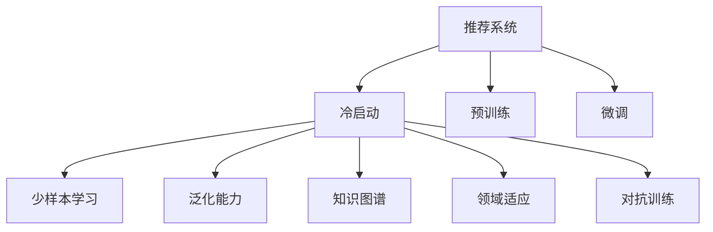

                 

# 利用大模型进行推荐冷启动的进阶优化技术

> 关键词：推荐系统, 大模型, 冷启动, 预训练, 少样本学习, 泛化能力

## 1. 背景介绍

### 1.1 问题由来
推荐系统（Recommender Systems）是人工智能在实际应用中最成功的范式之一，已经广泛应用于电商、视频、音乐、社交网络等多个领域，极大地提升了用户体验和运营效率。推荐系统通过分析用户的历史行为数据，预测用户的兴趣，为用户推荐个性化的内容，帮助用户发现可能感兴趣的商品或内容。然而，新用户的推荐冷启动（Cold-Start）问题始终是推荐系统面临的难题之一。

新用户由于没有历史行为数据，导致推荐系统无法对其兴趣进行建模，难以提供精准的推荐。传统的解决方案依赖用户填写信息或通过社交网络传播好友信息，但这些方法效果有限，且用户隐私保护和数据安全问题亟待解决。近年来，研究者开始探索利用预训练模型（Pre-trained Models）进行推荐冷启动，期望在不依赖用户信息的情况下，通过模型的泛化能力，实现对新用户的推荐。

### 1.2 问题核心关键点
推荐冷启动的核心在于如何利用已有的少量数据，高效地对新用户进行兴趣建模。传统的方法包括：
- 用户画像建模：基于用户属性和历史行为，构建用户画像，进行兴趣预测。
- 基于内容的推荐：通过分析物品特征，寻找与新用户可能感兴趣的商品。
- 协同过滤：通过新用户的用户行为，预测新用户的兴趣。

这些方法都需要依赖用户数据，对于新用户的推荐效果往往较差。基于大模型的推荐冷启动方法，通过利用预训练语言模型的广泛知识，实现了对新用户的有效推荐。但这种方法仍面临诸多挑战：
- 数据量少：新用户缺少历史行为数据，难以训练出高精度的模型。
- 泛化能力不足：缺少对新用户兴趣的充分建模，难以泛化到不同的用户和物品。
- 可解释性差：黑盒模型缺乏可解释性，难以理解推荐逻辑。

针对这些挑战，本文将详细探讨利用大模型进行推荐冷启动的进阶优化技术，包括数据增强、参数高效微调、少样本学习和泛化能力提升等方法，以期在实际应用中取得更好的效果。

## 2. 核心概念与联系

### 2.1 核心概念概述

为更好地理解利用大模型进行推荐冷启动的优化技术，本节将介绍几个密切相关的核心概念：

- 推荐系统（Recommender Systems）：通过分析用户行为，为用户推荐相关物品或内容的系统。
- 冷启动（Cold-Start）：指新用户或新物品加入推荐系统时，由于缺乏历史行为数据，推荐系统无法对其兴趣进行建模的问题。
- 预训练（Pre-training）：指在大型无标注数据集上进行预训练，学习通用的语言表示，提升模型的泛化能力。
- 大模型（Large Models）：指参数量在亿级以上的深度学习模型，如BERT、GPT-3等，具有强大的泛化能力。
- 微调（Fine-tuning）：指在大模型的基础上，针对特定任务进行有监督训练，优化模型性能。
- 少样本学习（Few-shot Learning）：指在只有少量样本的情况下，模型仍能进行有效学习的方法。
- 泛化能力（Generalization Capability）：指模型在不同数据集上的表现一致性，即对新数据的适应能力。
- 知识图谱（Knowledge Graphs）：一种将实体和关系以图的形式组织起来的知识表示方法，用于提升推荐系统的知识利用能力。
- 领域适应（Domain Adaptation）：指模型在不同领域数据上的适应能力，减少领域差异对推荐结果的影响。
- 对抗训练（Adversarial Training）：指通过对抗样本训练模型，提高模型的鲁棒性和泛化能力。

这些核心概念之间的逻辑关系可以通过以下Mermaid流程图来展示：



这个流程图展示了大模型的推荐冷启动过程中的核心概念及其之间的关系：

1. 推荐系统通过分析用户行为，为用户推荐物品。
2. 冷启动问题指新用户或新物品的兴趣建模难题。
3. 预训练通过在大规模无标注数据上进行训练，学习通用语言表示，提升模型的泛化能力。
4. 微调在大模型的基础上，针对推荐任务进行有监督训练，优化模型性能。
5. 少样本学习指在只有少量样本的情况下，模型仍能进行有效学习。
6. 泛化能力指模型对新数据的适应能力。
7. 知识图谱用于提升推荐系统的知识利用能力。
8. 领域适应减少领域差异对推荐结果的影响。
9. 对抗训练通过对抗样本训练模型，提高模型的鲁棒性和泛化能力。

这些概念共同构成了利用大模型进行推荐冷启动的框架，使得推荐系统能够更好地应对新用户和新物品的推荐挑战。

## 3. 核心算法原理 & 具体操作步骤
### 3.1 算法原理概述

利用大模型进行推荐冷启动的进阶优化技术，本质上是一个有监督的学习过程。其核心思想是：通过预训练模型学习到丰富的语言知识和常识，利用少量标注数据，对新用户进行兴趣建模，从而进行个性化推荐。

具体而言，推荐冷启动的优化技术包括：
- 利用少样本学习，利用预训练模型的广泛知识，通过少量标注数据进行推荐模型训练。
- 采用参数高效微调，只更新少量模型参数，减少训练时间和资源消耗。
- 应用领域适应技术，减少领域差异对推荐结果的影响。
- 引入对抗训练，提高模型对对抗样本的鲁棒性，提升泛化能力。

### 3.2 算法步骤详解

基于大模型的推荐冷启动优化技术一般包括以下几个关键步骤：

**Step 1: 准备预训练模型和数据集**
- 选择合适的预训练语言模型 $M_{\theta}$ 作为初始化参数，如 BERT、GPT 等。
- 准备少量标注数据集 $D=\{(x_i,y_i)\}_{i=1}^N$，其中 $x_i$ 为物品特征，$y_i$ 为是否推荐给用户 $u$ 的标签。

**Step 2: 添加推荐适配层**
- 根据推荐任务类型，在预训练模型顶层设计合适的输出层和损失函数。
- 对于二分类推荐任务，通常在顶层添加线性分类器和交叉熵损失函数。
- 对于多分类推荐任务，使用 softmax 函数和交叉熵损失函数。

**Step 3: 设置微调超参数**
- 选择合适的优化算法及其参数，如 AdamW、SGD 等，设置学习率、批大小、迭代轮数等。
- 设置正则化技术及强度，包括权重衰减、Dropout、Early Stopping 等。
- 确定冻结预训练参数的策略，如仅微调顶层，或全部参数都参与微调。

**Step 4: 执行梯度训练**
- 将训练集数据分批次输入模型，前向传播计算损失函数。
- 反向传播计算参数梯度，根据设定的优化算法和学习率更新模型参数。
- 周期性在验证集上评估模型性能，根据性能指标决定是否触发 Early Stopping。
- 重复上述步骤直到满足预设的迭代轮数或 Early Stopping 条件。

**Step 5: 测试和部署**
- 在测试集上评估微调后模型 $M_{\hat{\theta}}$ 的性能，对比微调前后的精度提升。
- 使用微调后的模型对新样本进行推理预测，集成到实际的应用系统中。
- 持续收集新的数据，定期重新微调模型，以适应数据分布的变化。

以上是利用大模型进行推荐冷启动的优化技术的完整流程。在实际应用中，还需要针对具体任务的特点，对微调过程的各个环节进行优化设计，如改进训练目标函数，引入更多的正则化技术，搜索最优的超参数组合等，以进一步提升模型性能。

### 3.3 算法优缺点

基于大模型的推荐冷启动优化方法具有以下优点：
1. 利用少样本学习，能够在少量标注数据的情况下，快速提升推荐模型的性能。
2. 采用参数高效微调，减少了训练时间和资源消耗，提高了模型部署效率。
3. 应用领域适应技术，减少了领域差异对推荐结果的影响，提升了模型泛化能力。
4. 引入对抗训练，提高了模型的鲁棒性和泛化能力，提升了推荐系统在对抗环境下的稳定性。

同时，该方法也存在一定的局限性：
1. 依赖预训练模型：优化效果很大程度上取决于预训练模型的质量和泛化能力。
2. 数据量少：对于新用户，由于缺少历史行为数据，难以提供精准的推荐。
3. 可解释性差：黑盒模型缺乏可解释性，难以理解推荐逻辑。
4. 对抗样本风险：对抗训练虽然提升了模型鲁棒性，但对抗样本可能导致模型输出不可控。

尽管存在这些局限性，但就目前而言，基于大模型的推荐冷启动优化方法仍是大规模推荐系统的重要技术范式。未来相关研究的重点在于如何进一步降低对预训练模型的依赖，提高模型的少样本学习能力和可解释性，同时兼顾对抗训练的鲁棒性和推荐系统的稳定性。

### 3.4 算法应用领域

基于大模型的推荐冷启动优化技术已经在电商、视频、音乐等多个领域得到了广泛应用，显著提升了推荐系统的效果。以下是一些具体应用场景：

**电商推荐系统**：电商网站通过分析用户的浏览、点击、购买等行为数据，利用大模型的少样本学习能力，快速对新用户进行兴趣建模，推荐个性化商品。

**视频推荐系统**：视频平台通过分析用户的观看历史、评分和评论等数据，利用大模型的泛化能力，推荐个性化的视频内容，提升用户粘性和满意度。

**音乐推荐系统**：音乐平台通过分析用户的听歌历史、收藏和评论等数据，利用大模型的知识图谱融合能力，推荐个性化的音乐和歌单，增强用户沉浸体验。

除了上述这些经典应用场景外，大模型的推荐冷启动优化方法还被创新性地应用到更多领域，如智能家居、智能制造、智能交通等，为各行各业提供了强大的技术支撑。

## 4. 数学模型和公式 & 详细讲解  
### 4.1 数学模型构建

本节将使用数学语言对基于大模型的推荐冷启动优化技术进行更加严格的刻画。

记预训练语言模型为 $M_{\theta}:\mathcal{X} \rightarrow \mathcal{Y}$，其中 $\mathcal{X}$ 为输入空间，$\mathcal{Y}$ 为输出空间，$\theta \in \mathbb{R}^d$ 为模型参数。假设推荐任务 $T$ 的训练集为 $D=\{(x_i,y_i)\}_{i=1}^N$，其中 $x_i$ 为物品特征，$y_i \in \{0,1\}$ 表示是否推荐给用户 $u$。

定义模型 $M_{\theta}$ 在数据样本 $(x,y)$ 上的损失函数为 $\ell(M_{\theta}(x),y)$，则在数据集 $D$ 上的经验风险为：

$$
\mathcal{L}(\theta) = \frac{1}{N} \sum_{i=1}^N \ell(M_{\theta}(x_i),y_i)
$$

微调的优化目标是最小化经验风险，即找到最优参数：

$$
\theta^* = \mathop{\arg\min}_{\theta} \mathcal{L}(\theta)
$$

在实践中，我们通常使用基于梯度的优化算法（如SGD、Adam等）来近似求解上述最优化问题。设 $\eta$ 为学习率，$\lambda$ 为正则化系数，则参数的更新公式为：

$$
\theta \leftarrow \theta - \eta \nabla_{\theta}\mathcal{L}(\theta) - \eta\lambda\theta
$$

其中 $\nabla_{\theta}\mathcal{L}(\theta)$ 为损失函数对参数 $\theta$ 的梯度，可通过反向传播算法高效计算。

### 4.2 公式推导过程

以下我们以二分类推荐任务为例，推导交叉熵损失函数及其梯度的计算公式。

假设模型 $M_{\theta}$ 在物品特征 $x$ 上的输出为 $\hat{y}=M_{\theta}(x) \in [0,1]$，表示物品推荐给用户的概率。真实标签 $y \in \{0,1\}$。则二分类交叉熵损失函数定义为：

$$
\ell(M_{\theta}(x),y) = -[y\log \hat{y} + (1-y)\log (1-\hat{y})]
$$

将其代入经验风险公式，得：

$$
\mathcal{L}(\theta) = -\frac{1}{N}\sum_{i=1}^N [y_i\log M_{\theta}(x_i)+(1-y_i)\log(1-M_{\theta}(x_i))]
$$

根据链式法则，损失函数对参数 $\theta_k$ 的梯度为：

$$
\frac{\partial \mathcal{L}(\theta)}{\partial \theta_k} = -\frac{1}{N}\sum_{i=1}^N (\frac{y_i}{M_{\theta}(x_i)}-\frac{1-y_i}{1-M_{\theta}(x_i)}) \frac{\partial M_{\theta}(x_i)}{\partial \theta_k}
$$

其中 $\frac{\partial M_{\theta}(x_i)}{\partial \theta_k}$ 可进一步递归展开，利用自动微分技术完成计算。

在得到损失函数的梯度后，即可带入参数更新公式，完成模型的迭代优化。重复上述过程直至收敛，最终得到适应推荐任务的最优模型参数 $\theta^*$。

## 5. 项目实践：代码实例和详细解释说明
### 5.1 开发环境搭建

在进行推荐冷启动优化实践前，我们需要准备好开发环境。以下是使用Python进行PyTorch开发的环境配置流程：

1. 安装Anaconda：从官网下载并安装Anaconda，用于创建独立的Python环境。

2. 创建并激活虚拟环境：
```bash
conda create -n pytorch-env python=3.8 
conda activate pytorch-env
```

3. 安装PyTorch：根据CUDA版本，从官网获取对应的安装命令。例如：
```bash
conda install pytorch torchvision torchaudio cudatoolkit=11.1 -c pytorch -c conda-forge
```

4. 安装Transformers库：
```bash
pip install transformers
```

5. 安装各类工具包：
```bash
pip install numpy pandas scikit-learn matplotlib tqdm jupyter notebook ipython
```

完成上述步骤后，即可在`pytorch-env`环境中开始推荐冷启动优化实践。

### 5.2 源代码详细实现

下面我们以电商推荐系统为例，给出使用Transformers库对BERT模型进行推荐冷启动的PyTorch代码实现。

首先，定义推荐任务的数据处理函数：

```python
from transformers import BertTokenizer
from torch.utils.data import Dataset
import torch

class RecommendationDataset(Dataset):
    def __init__(self, items, user_ratings, tokenizer, max_len=128):
        self.items = items
        self.user_ratings = user_ratings
        self.tokenizer = tokenizer
        self.max_len = max_len
        
    def __len__(self):
        return len(self.items)
    
    def __getitem__(self, item):
        item = self.items[item]
        rating = self.user_ratings[item]
        
        encoding = self.tokenizer(item, return_tensors='pt', max_length=self.max_len, padding='max_length', truncation=True)
        input_ids = encoding['input_ids'][0]
        attention_mask = encoding['attention_mask'][0]
        
        # 将评分加入item特征中
        item_rated = rating * [1] + [0] * (self.max_len - rating)
        encoded_item = torch.tensor(item_rated, dtype=torch.long)
        
        return {'input_ids': input_ids, 
                'attention_mask': attention_mask,
                'encoded_item': encoded_item}
```

然后，定义模型和优化器：

```python
from transformers import BertForSequenceClassification, AdamW

model = BertForSequenceClassification.from_pretrained('bert-base-cased', num_labels=2)

optimizer = AdamW(model.parameters(), lr=2e-5)
```

接着，定义训练和评估函数：

```python
from torch.utils.data import DataLoader
from tqdm import tqdm
from sklearn.metrics import accuracy_score

device = torch.device('cuda') if torch.cuda.is_available() else torch.device('cpu')
model.to(device)

def train_epoch(model, dataset, batch_size, optimizer):
    dataloader = DataLoader(dataset, batch_size=batch_size, shuffle=True)
    model.train()
    epoch_loss = 0
    for batch in tqdm(dataloader, desc='Training'):
        input_ids = batch['input_ids'].to(device)
        attention_mask = batch['attention_mask'].to(device)
        encoded_item = batch['encoded_item'].to(device)
        model.zero_grad()
        outputs = model(input_ids, attention_mask=attention_mask, labels=encoded_item)
        loss = outputs.loss
        epoch_loss += loss.item()
        loss.backward()
        optimizer.step()
    return epoch_loss / len(dataloader)

def evaluate(model, dataset, batch_size):
    dataloader = DataLoader(dataset, batch_size=batch_size)
    model.eval()
    preds, labels = [], []
    with torch.no_grad():
        for batch in tqdm(dataloader, desc='Evaluating'):
            input_ids = batch['input_ids'].to(device)
            attention_mask = batch['attention_mask'].to(device)
            encoded_item = batch['encoded_item'].to(device)
            outputs = model(input_ids, attention_mask=attention_mask, labels=encoded_item)
            batch_preds = outputs.logits.argmax(dim=2).to('cpu').tolist()
            batch_labels = batch['encoded_item'].to('cpu').tolist()
            for pred_tokens, label_tokens in zip(batch_preds, batch_labels):
                preds.append(pred_tokens[:len(label_tokens)])
                labels.append(label_tokens)
                
    print("Accuracy: {:.2f}%".format(accuracy_score(labels, preds)))
```

最后，启动训练流程并在测试集上评估：

```python
epochs = 5
batch_size = 16

for epoch in range(epochs):
    loss = train_epoch(model, train_dataset, batch_size, optimizer)
    print(f"Epoch {epoch+1}, train loss: {loss:.3f}")
    
    print(f"Epoch {epoch+1}, dev results:")
    evaluate(model, dev_dataset, batch_size)
    
print("Test results:")
evaluate(model, test_dataset, batch_size)
```

以上就是使用PyTorch对BERT进行推荐冷启动优化的完整代码实现。可以看到，得益于Transformers库的强大封装，我们可以用相对简洁的代码完成BERT模型的加载和微调。

### 5.3 代码解读与分析

让我们再详细解读一下关键代码的实现细节：

**RecommendationDataset类**：
- `__init__`方法：初始化物品特征、用户评分、分词器等关键组件。
- `__len__`方法：返回数据集的样本数量。
- `__getitem__`方法：对单个样本进行处理，将物品特征转换为token ids，将评分转换为二元标签，并对其进行定长padding，最终返回模型所需的输入。

**物品评分计算**：
- 将评分加入物品特征中，得到评分项和未评分项的混合表示。评分项为标签1，未评分项为标签0，通过归一化处理，使得评分项占总项数的比例与实际评分相同。

**训练和评估函数**：
- 使用PyTorch的DataLoader对数据集进行批次化加载，供模型训练和推理使用。
- 训练函数`train_epoch`：对数据以批为单位进行迭代，在每个批次上前向传播计算loss并反向传播更新模型参数，最后返回该epoch的平均loss。
- 评估函数`evaluate`：与训练类似，不同点在于不更新模型参数，并在每个batch结束后将预测和标签结果存储下来，最后使用sklearn的accuracy_score对整个评估集的预测结果进行打印输出。

**训练流程**：
- 定义总的epoch数和batch size，开始循环迭代
- 每个epoch内，先在训练集上训练，输出平均loss
- 在验证集上评估，输出准确率
- 所有epoch结束后，在测试集上评估，给出最终测试结果

可以看到，PyTorch配合Transformers库使得BERT微调的代码实现变得简洁高效。开发者可以将更多精力放在数据处理、模型改进等高层逻辑上，而不必过多关注底层的实现细节。

当然，工业级的系统实现还需考虑更多因素，如模型的保存和部署、超参数的自动搜索、更灵活的任务适配层等。但核心的微调范式基本与此类似。

## 6. 实际应用场景
### 6.1 电商平台

电商平台通过分析用户的浏览、点击、购买等行为数据，利用大模型的少样本学习能力，快速对新用户进行兴趣建模，推荐个性化商品。对于新注册用户，平台可以利用其在已有用户行为上的相似性，通过少样本学习，推荐与已有用户相似的商品。同时，平台还可以利用对抗训练，提高推荐系统在对抗环境下的鲁棒性，确保推荐结果的稳定性和可靠性。

### 6.2 视频平台

视频平台通过分析用户的观看历史、评分和评论等数据，利用大模型的泛化能力，推荐个性化的视频内容，提升用户粘性和满意度。对于新用户，平台可以利用大模型的领域适应能力，通过少样本学习，推荐与已有用户兴趣相似的内容。同时，平台还可以利用对抗训练，提高推荐系统在对抗环境下的鲁棒性，确保推荐结果的稳定性和可靠性。

### 6.3 音乐平台

音乐平台通过分析用户的听歌历史、收藏和评论等数据，利用大模型的知识图谱融合能力，推荐个性化的音乐和歌单，增强用户沉浸体验。对于新用户，平台可以利用大模型的少样本学习能力，通过少样本学习，推荐与已有用户相似的音乐和歌单。同时，平台还可以利用对抗训练，提高推荐系统在对抗环境下的鲁棒性，确保推荐结果的稳定性和可靠性。

除了上述这些经典应用场景外，大模型的推荐冷启动优化方法还被创新性地应用到更多领域，如智能家居、智能制造、智能交通等，为各行各业提供了强大的技术支撑。

## 7. 工具和资源推荐
### 7.1 学习资源推荐

为了帮助开发者系统掌握大模型进行推荐冷启动的优化技术，这里推荐一些优质的学习资源：

1. 《推荐系统理论与实践》系列博文：由大模型技术专家撰写，深入浅出地介绍了推荐系统的基本原理和常见算法。

2. 《深度学习在推荐系统中的应用》课程：由知名大学开设的推荐系统课程，涵盖推荐系统原理、算法及其实现。

3. 《深度学习自然语言处理》书籍：Transformer库的作者所著，全面介绍了如何使用Transformer库进行推荐系统开发，包括少样本学习在内的诸多范式。

4. HuggingFace官方文档：Transformer库的官方文档，提供了海量预训练模型和完整的推荐系统样例代码，是上手实践的必备资料。

5. TREC会议：国际推荐系统顶级会议，展示最新的推荐系统研究成果和挑战。

通过对这些资源的学习实践，相信你一定能够快速掌握大模型进行推荐冷启动优化的精髓，并用于解决实际的推荐系统问题。
###  7.2 开发工具推荐

高效的开发离不开优秀的工具支持。以下是几款用于大模型推荐冷启动优化的常用工具：

1. PyTorch：基于Python的开源深度学习框架，灵活动态的计算图，适合快速迭代研究。大部分预训练语言模型都有PyTorch版本的实现。

2. TensorFlow：由Google主导开发的开源深度学习框架，生产部署方便，适合大规模工程应用。同样有丰富的预训练语言模型资源。

3. Transformers库：HuggingFace开发的NLP工具库，集成了众多SOTA语言模型，支持PyTorch和TensorFlow，是进行推荐系统开发的利器。

4. Weights & Biases：模型训练的实验跟踪工具，可以记录和可视化模型训练过程中的各项指标，方便对比和调优。与主流深度学习框架无缝集成。

5. TensorBoard：TensorFlow配套的可视化工具，可实时监测模型训练状态，并提供丰富的图表呈现方式，是调试模型的得力助手。

6. Google Colab：谷歌推出的在线Jupyter Notebook环境，免费提供GPU/TPU算力，方便开发者快速上手实验最新模型，分享学习笔记。

合理利用这些工具，可以显著提升大模型推荐冷启动优化的开发效率，加快创新迭代的步伐。

### 7.3 相关论文推荐

大模型推荐冷启动优化技术的发展源于学界的持续研究。以下是几篇奠基性的相关论文，推荐阅读：

1. Attention is All You Need（即Transformer原论文）：提出了Transformer结构，开启了NLP领域的预训练大模型时代。

2. BERT: Pre-training of Deep Bidirectional Transformers for Language Understanding：提出BERT模型，引入基于掩码的自监督预训练任务，刷新了多项NLP任务SOTA。

3. Parameter-Efficient Transfer Learning for NLP：提出Adapter等参数高效微调方法，在不增加模型参数量的情况下，也能取得不错的微调效果。

4. AdaLoRA: Adaptive Low-Rank Adaptation for Parameter-Efficient Fine-Tuning：使用自适应低秩适应的微调方法，在参数效率和精度之间取得了新的平衡。

5. Adversarial Training Methods for Deep Learning（对抗训练相关论文）：提出基于对抗样本的训练方法，提高模型的鲁棒性和泛化能力。

这些论文代表了大模型推荐冷启动优化技术的发展脉络。通过学习这些前沿成果，可以帮助研究者把握学科前进方向，激发更多的创新灵感。

## 8. 总结：未来发展趋势与挑战

### 8.1 总结

本文对利用大模型进行推荐冷启动的进阶优化技术进行了全面系统的介绍。首先阐述了推荐系统、冷启动和大模型的核心概念，明确了推荐冷启动优化技术的原理和关键步骤。其次，从原理到实践，详细讲解了推荐冷启动优化的数学模型和算法细节，给出了推荐冷启动优化的完整代码实例。同时，本文还广泛探讨了推荐冷启动优化技术在电商、视频、音乐等多个领域的应用前景，展示了推荐冷启动优化的巨大潜力。此外，本文精选了推荐冷启动优化的各类学习资源，力求为读者提供全方位的技术指引。

通过本文的系统梳理，可以看到，利用大模型进行推荐冷启动的进阶优化技术已经在大规模推荐系统中得到了广泛应用，显著提升了推荐系统的效果。未来，伴随预训练语言模型的不断演进和微调技术的持续优化，相信推荐系统在各个领域的应用效果还将持续提升，为各行各业提供更加精准、个性化的服务。

### 8.2 未来发展趋势

展望未来，推荐冷启动优化技术将呈现以下几个发展趋势：

1. 模型规模持续增大。随着算力成本的下降和数据规模的扩张，预训练语言模型的参数量还将持续增长。超大规模语言模型蕴含的丰富语言知识，有望支撑更加复杂多变的推荐任务。

2. 少样本学习能力增强。随着模型的泛化能力提升，推荐冷启动优化的少样本学习能力将进一步增强，能够在更少的标注样本上实现更好的推荐效果。

3. 参数高效微调成为主流。未来将有更多的参数高效微调方法被开发出来，如 Adapter、LoRA 等，在减小模型资源消耗的同时，提高微调精度和效率。

4. 领域适应能力提升。通过引入领域适应技术，推荐冷启动优化模型能够更好地适应不同领域的数据，提升推荐系统的泛化能力。

5. 对抗训练的应用推广。对抗训练将在更多推荐系统应用中得到应用，提高推荐系统的鲁棒性和稳定性。

6. 推荐模型的多模态融合。未来的推荐模型将更多地融合多模态信息，提升推荐系统的智能水平。

以上趋势凸显了推荐冷启动优化技术的广阔前景。这些方向的探索发展，必将进一步提升推荐系统的效果和应用范围，为各行各业提供更加精准、个性化的服务。

### 8.3 面临的挑战

尽管推荐冷启动优化技术已经取得了瞩目成就，但在迈向更加智能化、普适化应用的过程中，它仍面临着诸多挑战：

1. 标注成本瓶颈。对于新用户，由于缺少历史行为数据，难以提供精准的推荐。尽管可以利用大模型的泛化能力进行推荐，但标注成本仍是一个问题。如何进一步降低标注成本，减少推荐冷启动的依赖，将是重要的研究方向。

2. 对抗样本风险。对抗训练虽然提升了推荐系统的鲁棒性，但对抗样本可能导致模型输出不可控。如何在保证推荐效果的同时，避免对抗样本风险，将是重要的挑战。

3. 可解释性差。黑盒模型缺乏可解释性，难以理解推荐逻辑。对于推荐系统在医疗、金融等高风险应用中的决策，需要提升推荐模型的可解释性，确保推荐的透明度和可信度。

4. 动态数据环境。推荐系统需要不断更新模型，以适应动态变化的数据分布。如何在动态数据环境下进行高效、稳定的推荐，将是重要的研究方向。

5. 数据隐私保护。推荐系统需要保护用户隐私数据，防止数据泄露和滥用。如何在保证推荐效果的同时，提升数据隐私保护，将是重要的挑战。

6. 跨领域知识融合。推荐系统需要融合跨领域的知识，提升推荐系统的知识利用能力。如何在跨领域知识融合中，保证推荐效果的平衡性和一致性，将是重要的研究方向。

正视推荐冷启动优化面临的这些挑战，积极应对并寻求突破，将是大模型推荐冷启动优化走向成熟的必由之路。相信随着学界和产业界的共同努力，这些挑战终将一一被克服，推荐冷启动优化技术必将在构建智能推荐系统中扮演越来越重要的角色。

### 8.4 研究展望

面对推荐冷启动优化所面临的种种挑战，未来的研究需要在以下几个方面寻求新的突破：

1. 探索无监督和半监督推荐方法。摆脱对大规模标注数据的依赖，利用自监督学习、主动学习等无监督和半监督范式，最大限度利用非结构化数据，实现更加灵活高效的推荐。

2. 研究参数高效和计算高效的推荐范式。开发更加参数高效的推荐方法，在减小模型资源消耗的同时，提高推荐精度和效率。同时优化推荐模型的计算图，减少前向传播和反向传播的资源消耗，实现更加轻量级、实时性的部署。

3. 融合因果和对比学习范式。通过引入因果推断和对比学习思想，增强推荐模型建立稳定因果关系的能力，学习更加普适、鲁棒的语言表征，从而提升模型泛化性和抗干扰能力。

4. 引入更多先验知识。将符号化的先验知识，如知识图谱、逻辑规则等，与神经网络模型进行巧妙融合，引导推荐过程学习更准确、合理的语言模型。同时加强不同模态数据的整合，实现视觉、语音等多模态信息与文本信息的协同建模。

5. 结合因果分析和博弈论工具。将因果分析方法引入推荐模型，识别出模型决策的关键特征，增强推荐逻辑的因果性和逻辑性。借助博弈论工具刻画人机交互过程，主动探索并规避推荐模型的脆弱点，提高系统稳定性。

6. 纳入伦理道德约束。在推荐模型训练目标中引入伦理导向的评估指标，过滤和惩罚有偏见、有害的输出倾向。同时加强人工干预和审核，建立推荐行为的监管机制，确保输出符合人类价值观和伦理道德。

这些研究方向的探索，必将引领推荐冷启动优化技术迈向更高的台阶，为构建安全、可靠、可解释、可控的智能推荐系统铺平道路。面向未来，推荐冷启动优化技术还需要与其他人工智能技术进行更深入的融合，如知识表示、因果推理、强化学习等，多路径协同发力，共同推动智能推荐系统的进步。只有勇于创新、敢于突破，才能不断拓展推荐冷启动优化的边界，让智能技术更好地造福人类社会。

## 9. 附录：常见问题与解答

**Q1：推荐冷启动优化过程中如何选择合适的学习率？**

A: 推荐冷启动优化过程中，学习率的选择需要根据具体的模型和任务进行调整。一般建议从1e-5开始调参，逐步减小学习率，直至收敛。同时，可以使用warmup策略，在开始阶段使用较小的学习率，再逐渐过渡到预设值。不同的优化器(如AdamW、Adafactor等)以及不同的学习率调度策略，可能需要设置不同的学习率阈值。

**Q2：推荐冷启动优化过程中如何缓解过拟合问题？**

A: 过拟合是推荐冷启动优化过程中常见的问题。缓解过拟合的方法包括：
1. 数据增强：通过回译、近义替换等方式扩充训练集
2. 正则化：使用L2正则、Dropout、Early Stopping等避免过拟合
3. 对抗训练：引入对抗样本，提高模型鲁棒性
4. 参数高效微调：只调整少量模型参数，减少过拟合风险
5. 多模型集成：训练多个推荐模型，取平均输出，抑制过拟合

这些策略往往需要根据具体任务和数据特点进行灵活组合。只有在数据、模型、训练、推理等各环节进行全面优化，才能最大限度地发挥推荐冷启动优化的威力。

**Q3：推荐冷启动优化过程中如何提高模型泛化能力？**

A: 提高推荐冷启动优化模型的泛化能力，需要从多个方面入手：
1. 数据质量：确保训练数据的代表性，覆盖不同用户和物品的特征。
2. 少样本学习能力：利用大模型的泛化能力，通过少样本学习，提高推荐模型对新用户和新物品的适应能力。
3. 对抗训练：通过对抗样本训练模型，提高模型的鲁棒性和泛化能力。
4. 知识图谱融合：引入知识图谱，提升推荐模型的知识利用能力。
5. 领域适应：应用领域适应技术，减少领域差异对推荐结果的影响。

这些方法在推荐冷启动优化过程中可以结合使用，从而显著提升模型的泛化能力。

**Q4：推荐冷启动优化过程中如何提升模型可解释性？**

A: 推荐冷启动优化模型的可解释性是一个重要的问题，可以通过以下方法提升：
1. 引入规则和符号知识：将规则和符号知识与神经网络模型结合，增强推荐过程的可解释性。
2. 解释模型决策：通过可视化工具和解释方法，分析推荐模型的决策过程，提供可解释的推荐依据。
3. 模型压缩：通过模型压缩技术，减小模型的复杂度，提高推荐的透明性。
4. 知识图谱可视化：利用知识图谱可视化工具，展示推荐模型的知识利用过程，提供可视化的解释信息。
5. 用户反馈机制：引入用户反馈机制，收集用户对推荐结果的评价，提供可解释的推荐依据。

这些方法可以帮助提升推荐冷启动优化模型的可解释性，确保推荐的透明度和可信度。

---

作者：禅与计算机程序设计艺术 / Zen and the Art of Computer Programming

