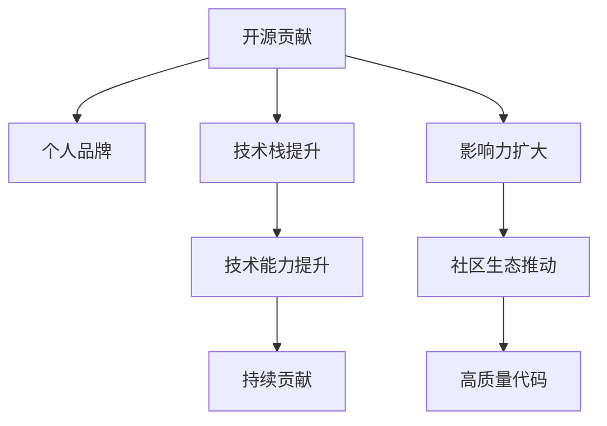

                 

# 利用开源贡献建立个人品牌和影响力

> 关键词：开源贡献, 个人品牌, 影响力, 技术栈, GitHub, 社区参与, 开源项目, 代码质量, 持续贡献

## 1. 背景介绍

### 1.1 问题由来
在技术日益发展的今天，开源社区成为了创新和协作的重要平台。开源项目不仅推动了技术的快速迭代和普及，还为技术人员提供了展示和锻炼自我的广阔舞台。如何有效地利用开源贡献来建立个人品牌和影响力，成为了众多开发者关注的焦点。

本文旨在深入探讨如何通过开源贡献，提升技术能力和专业影响力，构建个人品牌，并为开源社区的持续发展贡献力量。

### 1.2 问题核心关键点
本节将明确几个核心问题，以及开源贡献对个人和社区的意义：

- **技术能力的提升**：开源贡献有助于开发者深入理解新技术和架构，提升编码能力和问题解决能力。
- **专业影响力的扩大**：高质量的开源代码和文档能够提高个人在技术社区中的声誉。
- **个人品牌的建立**：通过频繁和有深度的参与，成为开源项目的关键贡献者，逐步树立技术权威。
- **社区生态的推动**：开源贡献能够推动社区内技术和知识的传播，构建健康的技术生态。

## 2. 核心概念与联系

### 2.1 核心概念概述

为了更好地理解开源贡献及其在建立个人品牌中的作用，我们需要了解一些核心概念：

- **开源贡献**：指开发者将代码、文档、设计等作品共享到开源社区，供他人使用、修改和扩展的过程。
- **个人品牌**：指开发者通过技术能力和影响力在专业领域内树立的独特形象和身份。
- **影响力**：指开发者通过开源贡献、技术分享、社区活动等方式，影响和推动技术社区发展的能力。
- **技术栈**：指开发者掌握的技术集合，包括编程语言、框架、工具等。
- **GitHub**：全球最大的开源代码托管平台，提供丰富的代码仓库、问题跟踪和协作工具。
- **社区参与**：指开发者积极参与开源项目的讨论、代码审核、问题解决等，与社区成员建立良好的互动关系。
- **代码质量**：指开源代码的规范性、可读性和可维护性，是衡量贡献者技术水平的重要指标。
- **持续贡献**：指开发者长期坚持参与开源项目，定期发布更新和改进，逐步成为项目的关键推动者。

这些概念通过一个Mermaid流程图进行关联，展示了开源贡献对个人品牌和影响力构建的核心过程：

这个流程图展示了开源贡献如何通过提升技术能力、扩大影响力、建立个人品牌，最终推动社区生态的发展。

## 3. 核心算法原理 & 具体操作步骤

### 3.1 算法原理概述

开源贡献的建立是一个复杂的过程，涉及技术能力、社区参与、持续更新等多方面因素。其核心算法原理包括以下几个方面：

1. **技术栈的深化**：通过参与开源项目，学习新框架、语言和工具，不断提升自身技术能力。
2. **影响力的扩展**：通过高质量的代码和文档，提高个人在技术社区中的知名度。
3. **个人品牌的塑造**：通过持续的贡献和高质量的工作，逐步树立技术权威。
4. **社区的推动**：通过积极参与和贡献，推动社区的健康发展。

### 3.2 算法步骤详解

以下是开源贡献建立个人品牌和影响力的详细步骤：

1. **选择合适的项目**：
   - 根据自己的技术兴趣和目标，选择适合的开源项目。
   - 选择有活跃社区、活跃贡献者、稳定维护的项目。

2. **创建账号和仓库**：
   - 在GitHub等平台上注册账号。
   - 创建自己的代码仓库，并确保仓库的命名规范、描述清晰。

3. **贡献代码**：
   - 仔细阅读项目文档和贡献指南。
   - 编写代码前，确保对项目需求和规范有充分理解。
   - 遵循代码风格指南，保持代码规范和可读性。
   - 提交代码前，确保代码质量，通过单元测试和代码审查。

4. **参与社区讨论**：
   - 积极参与项目讨论区，回答问题和提供反馈。
   - 参与代码审核和问题解决，与项目维护者和其他贡献者建立良好关系。

5. **持续贡献**：
   - 定期更新和改进代码，参与新功能的开发和优化。
   - 在项目文档中贡献有用的信息和技术文章。
   - 参与项目的扩展和维护，推动项目向前发展。

### 3.3 算法优缺点

开源贡献在提升个人品牌和影响力方面具有以下优点：

1. **技术能力的提升**：通过参与开源项目，开发者能够学习新技术、新框架，提升编码和问题解决能力。
2. **社区认可**：高质量的贡献和积极参与能够获得社区成员的认可和尊敬。
3. **技术传播**：通过代码和文档的共享，促进技术知识的传播和应用。
4. **职业发展**：开源贡献能够提高个人在技术界的知名度，增加职业机会。

同时，开源贡献也存在一些缺点：

1. **时间和精力的投入**：高质量的贡献需要投入大量时间和精力。
2. **社区文化和规范**：需要适应项目的文化和规范，学习项目特定的代码风格和问题跟踪工具。
3. **代码质量的不确定性**：初学者可能因代码质量不高而受挫。

### 3.4 算法应用领域

开源贡献不仅可以应用于技术开发，还可以拓展到技术文档、设计、教学等多个领域，推动开源社区的全面发展。

1. **技术开发**：编写高质量的代码，参与新功能的开发和优化。
2. **技术文档**：编写清晰、易懂的文档，解释代码功能和使用方法。
3. **代码评审**：参与代码评审，确保代码质量和一致性。
4. **教学和培训**：创建教学资源和培训材料，帮助新手快速上手项目。

## 4. 数学模型和公式 & 详细讲解 & 举例说明

### 4.1 数学模型构建

为了更好地理解开源贡献的影响，我们可以构建一个数学模型，假设社区中有$N$个贡献者，每个贡献者的贡献能力为$c_i$，社区的贡献总和为$C$。

数学模型可以表示为：

$$
C = \sum_{i=1}^N c_i
$$

其中，$c_i$表示第$i$个贡献者的贡献能力，可以通过代码提交量、问题解决数量等指标来衡量。

### 4.2 公式推导过程

我们可以通过以下推导过程，来分析开源贡献对个人品牌和影响力的影响：

1. **贡献能力的计算**：
   - 设第$i$个贡献者每月提交的代码数量为$n_i$，解决的问题数量为$p_i$，则$c_i = k(n_i + p_i)$，其中$k$为经验系数。
   - 贡献能力$c_i$反映了个人在技术社区中的活跃度和影响力。

2. **社区贡献总和的计算**：
   - 社区的总贡献$C$为所有贡献者的贡献能力之和，即$C = \sum_{i=1}^N c_i$。
   - 社区总贡献反映了开源项目的整体活跃度和技术水平。

3. **个人品牌影响力的计算**：
   - 设第$i$个贡献者对社区的贡献度为$d_i$，其品牌影响力$I_i$可以表示为$d_i \times c_i$。
   - 品牌影响力反映了贡献者对开源社区的实际贡献和影响力。

### 4.3 案例分析与讲解

以GitHub上的TensorFlow项目为例，分析开源贡献对个人品牌和影响力的影响。

1. **TensorFlow项目贡献者**：
   - 贡献者数量众多，每月代码提交量和问题解决数量较大。
   - 项目维护者对高质量的贡献给予认可和奖励，如认可徽章和贡献者排名。

2. **代码质量的影响**：
   - 代码质量高的贡献者，更容易获得社区认可，如参与代码审核、设计讨论等。
   - 通过持续的高质量贡献，逐步成为项目的关键贡献者，对社区影响力显著。

3. **社区互动的影响**：
   - 积极参与社区讨论和问题解决的贡献者，更容易建立良好的关系。
   - 长期活跃在社区中，逐步成为技术权威，建立个人品牌。

## 5. 项目实践：代码实例和详细解释说明

### 5.1 开发环境搭建

在开始开源贡献之前，需要准备开发环境，以下是具体的步骤：

1. **安装GitHub Desktop**：
   - 从官网下载GitHub Desktop，安装完成后登录GitHub账号。

2. **创建仓库**：
   - 选择适合的开源项目，使用GitHub Desktop创建仓库。
   - 确保仓库名称清晰明了，描述详细准确。

3. **配置环境变量**：
   - 在代码编辑器或IDE中配置GitHub的认证信息。
   - 确保本地Git仓库与GitHub仓库同步，避免不必要的麻烦。

### 5.2 源代码详细实现

以编写和提交TensorFlow项目代码为例，具体步骤如下：

1. **克隆项目代码**：
   - 使用Git命令克隆TensorFlow项目代码：`git clone https://github.com/tensorflow/tensorflow.git`
   - 进入项目目录，执行`git pull`更新代码。

2. **阅读文档和贡献指南**：
   - 在TensorFlow项目的README文件中找到贡献指南和文档。
   - 了解项目的代码风格、问题跟踪工具、代码评审流程等。

3. **编写代码**：
   - 根据贡献指南，编写新的功能或修复已知问题。
   - 编写代码时，遵循项目的代码风格和注释规范。

4. **提交代码**：
   - 在本地代码编辑器中，执行`git add .`将修改内容提交到本地仓库。
   - 执行`git commit -m "Add new feature"`，添加提交信息。
   - 执行`git push`将代码推送到GitHub远程仓库。

### 5.3 代码解读与分析

在完成代码编写和提交后，需要对代码进行解读和分析，确保其高质量和可维护性：

1. **代码审查**：
   - 提交代码后，等待社区成员进行代码审查，确保代码符合项目规范。
   - 根据审查反馈，修改代码，确保代码质量和一致性。

2. **代码质量评估**：
   - 使用代码质量评估工具，如Pylint、SonarQube等，评估代码质量。
   - 根据评估结果，改进代码结构和可读性，提升代码质量。

3. **代码维护**：
   - 定期更新和改进代码，参与项目的扩展和维护，确保代码的长期可用性。
   - 在问题跟踪工具中记录和解决已知问题，推动项目的持续发展。

### 5.4 运行结果展示

通过上述步骤，即可在开源社区中展示和分享自己的贡献，具体展示方式如下：

1. **贡献展示**：
   - 在GitHub仓库中查看自己的提交记录，展示贡献的代码数量和修改历史。
   - 使用GitHub的贡献徽章，展示自己的贡献情况。

2. **社区互动**：
   - 在项目讨论区发表评论和问题，积极参与社区讨论。
   - 回答其他社区成员的问题，提供技术支持和帮助。

3. **技术分享**：
   - 在GitHub上创建技术博客，分享自己的技术经验和心得。
   - 参与开源社区的技术会议和讨论，展示自己的技术成果。

## 6. 实际应用场景

### 6.1 软件开发

开源贡献在软件开发中具有广泛应用，通过参与开源项目，开发者能够不断提升自己的技术能力和影响力：

1. **技术学习**：
   - 参与TensorFlow等知名开源项目，学习前沿技术和架构。
   - 通过贡献代码，提升编程能力和问题解决能力。

2. **社区认可**：
   - 高质量的代码和文档能够获得社区成员的认可和尊敬。
   - 成为项目的活跃贡献者，逐步树立技术权威。

3. **职业发展**：
   - 开源贡献能够提高个人在技术界的知名度，增加职业机会。
   - 通过贡献获得社区认可，获取更多的职业机会和发展空间。

### 6.2 教育与培训

开源贡献在教育与培训中也有广泛应用，通过创建教学资源和培训材料，帮助新手快速上手项目：

1. **教学资源**：
   - 创建GitHub仓库，提供技术教程和代码示例，帮助新手学习项目。
   - 在GitHub上发布博客和视频，分享技术经验和心得。

2. **培训材料**：
   - 开发开源课程和培训材料，推广项目的最佳实践和技术应用。
   - 在社区中分享培训材料，提高项目的知名度和影响力。

### 6.3 企业应用

开源贡献在企业应用中也有重要应用，通过推动开源项目的发展，提升企业的技术能力和影响力：

1. **技术创新**：
   - 参与TensorFlow等开源项目，推动技术创新和前沿研究。
   - 通过贡献代码，提升企业的技术实力和市场竞争力。

2. **社区互动**：
   - 积极参与开源社区的讨论和贡献，建立良好的社区关系。
   - 通过社区互动，获取技术支持和合作机会。

3. **品牌推广**：
   - 在开源社区中展示企业的技术成果和贡献，提升企业品牌影响力。
   - 通过开源项目的成功案例，推广企业技术和产品。

## 7. 工具和资源推荐

### 7.1 学习资源推荐

为了帮助开发者系统掌握开源贡献的理论基础和实践技巧，这里推荐一些优质的学习资源：

1. **GitHub官方文档**：提供Git和GitHub的详细指南，帮助开发者快速上手开源贡献。
2. **TensorFlow官方文档**：详细解释TensorFlow项目的技术细节和贡献指南，帮助开发者高效贡献。
3. **Google Code Review最佳实践**：介绍Google在代码评审方面的最佳实践，提升代码质量和社区互动。
4. **Docker入门教程**：通过Docker容器技术，提升开源贡献的部署和维护效率。
5. **Kubernetes入门教程**：通过Kubernetes容器编排，提升开源贡献的持续集成和部署效率。

通过对这些资源的学习实践，相信你一定能够快速掌握开源贡献的精髓，并用于解决实际的开发问题。

### 7.2 开发工具推荐

高效的开发离不开优秀的工具支持。以下是几款用于开源贡献开发的常用工具：

1. **GitHub Desktop**：提供图形化的Git客户端，支持Windows、macOS和Linux，方便开发者轻松管理代码仓库。
2. **VS Code**：轻量级的代码编辑器，支持丰富的插件和扩展，支持Python、Java等多种语言。
3. **Jupyter Notebook**：支持IPython内核，支持Markdown和代码混合编写，方便开发者快速开发和调试。
4. **Git LFS**：Git Large File Storage，支持管理大文件，提升Git仓库的存储效率。
5. **GitHub Actions**：基于GitHub的持续集成和持续部署服务，方便开发者自动化测试和部署。

合理利用这些工具，可以显著提升开源贡献的开发效率，加快创新迭代的步伐。

### 7.3 相关论文推荐

开源贡献的研究涉及多个方面，以下是几篇奠基性的相关论文，推荐阅读：

1. **Google Code Review最佳实践**：介绍Google在代码评审方面的最佳实践，提升代码质量和社区互动。
2. **Docker入门教程**：通过Docker容器技术，提升开源贡献的部署和维护效率。
3. **Kubernetes入门教程**：通过Kubernetes容器编排，提升开源贡献的持续集成和部署效率。
4. **TensorFlow的贡献指南**：详细介绍TensorFlow项目的贡献指南，帮助开发者高效贡献。
5. **GitHub最佳实践**：介绍GitHub的使用最佳实践，提升开源贡献的效率和质量。

这些论文代表了大语言模型微调技术的发展脉络。通过学习这些前沿成果，可以帮助研究者把握学科前进方向，激发更多的创新灵感。

## 8. 总结：未来发展趋势与挑战

### 8.1 总结

本文对开源贡献及其在建立个人品牌中的作用进行了全面系统的介绍。首先阐述了开源贡献对技术能力和影响力的提升，明确了开源贡献对个人和社区的意义。其次，从原理到实践，详细讲解了开源贡献的数学模型和详细步骤，给出了开源贡献任务开发的完整代码实例。同时，本文还广泛探讨了开源贡献在软件开发、教育与培训、企业应用等多个领域的应用前景，展示了开源贡献范式的广泛应用价值。

通过对这些资源的学习实践，相信你一定能够快速掌握开源贡献的精髓，并用于解决实际的开发问题。

### 8.2 未来发展趋势

展望未来，开源贡献将呈现以下几个发展趋势：

1. **社区生态的多样化**：开源社区将不断扩展，涵盖更多技术领域和应用场景，提供更丰富的资源和支持。
2. **技术交流的便捷化**：通过社区工具和平台，技术交流将更加便捷高效，促进技术创新和知识传播。
3. **开源贡献的自动化**：自动化工具将帮助开发者更高效地进行代码管理和贡献，提升开源贡献的效率。
4. **开源项目的商业化**：开源项目将更加注重商业应用，通过开源社区获取商业价值和市场竞争力。
5. **开源贡献的国际化**：开源社区将更加全球化，跨越地域和语言的限制，促进全球技术交流和合作。

以上趋势凸显了开源贡献的广阔前景。这些方向的探索发展，必将进一步提升开源社区的活力和影响力，为开发者提供更加丰富和高效的技术支持。

### 8.3 面临的挑战

尽管开源贡献在技术创新和社区发展方面具有重要价值，但在实践中也面临诸多挑战：

1. **时间和精力的投入**：高质量的贡献需要投入大量时间和精力。
2. **社区文化和规范**：需要适应项目的文化和规范，学习项目特定的代码风格和问题跟踪工具。
3. **代码质量的不确定性**：初学者可能因代码质量不高而受挫。
4. **社区互动的不均衡**：贡献者和项目维护者之间可能存在互动不均衡的问题。

### 8.4 研究展望

面对开源贡献面临的挑战，未来的研究需要在以下几个方面寻求新的突破：

1. **贡献工具的优化**：开发更多自动化工具，帮助开发者更高效地进行代码管理和贡献。
2. **社区互动的增强**：通过社区工具和平台，促进贡献者和项目维护者之间的互动。
3. **代码质量的提升**：提供更多的代码质量评估工具和最佳实践，提升代码质量和一致性。
4. **开源项目的商业化**：推动开源项目的商业应用，通过开源社区获取商业价值和市场竞争力。
5. **开源贡献的国际化**：推动开源社区的全球化发展，促进全球技术交流和合作。

这些研究方向的探索，必将引领开源贡献技术迈向更高的台阶，为构建健康、活跃、多元的开源社区提供技术支持。总之，开源贡献需要开发者根据具体项目，不断迭代和优化贡献工具、流程和策略，方能得到理想的效果。

## 9. 附录：常见问题与解答

**Q1：开源贡献是否适合所有开发者？**

A: 开源贡献适合具有技术能力和社区精神的所有开发者。然而，对于一些初学者和忙碌的开发者，需要考虑时间和精力的投入，以及代码质量的不确定性。

**Q2：如何选择适合自己的开源项目？**

A: 选择适合自己的开源项目需要考虑以下因素：
1. 技术兴趣和目标：选择感兴趣的项目，并评估项目是否符合自己的技术目标。
2. 项目活跃度：选择活跃的社区和项目，避免选择那些没有维护者或社区不活跃的项目。
3. 项目贡献指南：仔细阅读项目的贡献指南，了解项目的代码风格、问题跟踪工具和贡献流程。

**Q3：如何平衡开源贡献和个人职业发展？**

A: 平衡开源贡献和个人职业发展需要：
1. 合理分配时间：根据工作和生活安排，合理分配开源贡献的时间。
2. 提升技术能力：通过开源贡献，提升技术能力和专业影响力，增强职业竞争力。
3. 获取职业机会：通过开源贡献，获取更多的职业机会和发展空间。

**Q4：如何提高开源代码的质量？**

A: 提高开源代码的质量需要：
1. 遵循代码风格指南：编写规范、可读性强的代码。
2. 进行代码审查：提交代码后，等待社区成员进行代码审查，确保代码符合项目规范。
3. 使用代码质量评估工具：使用Pylint、SonarQube等工具评估代码质量，并根据反馈改进代码。

**Q5：如何获取开源社区的认可？**

A: 获取开源社区的认可需要：
1. 提交高质量的代码：编写高质量的代码，并确保代码质量和一致性。
2. 积极参与社区讨论：在项目讨论区发表评论和问题，积极参与社区讨论。
3. 解决问题和提供帮助：积极参与代码审核和问题解决，提供技术支持和帮助。

---

作者：禅与计算机程序设计艺术 / Zen and the Art of Computer Programming

