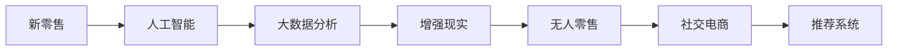

                 

## 1. 背景介绍

随着数字化、网络化、智能化进程的加快，新零售正在成为零售行业的主流模式。传统零售行业面临市场竞争加剧、消费者需求变化多端、供应链效率低下等诸多问题。在数字化转型的浪潮中，如何借助新技术手段进行零售业态的创新，成为各大企业亟需探讨的课题。本文旨在探讨利用人工智能和大数据分析技术，在新零售领域进行创新的可能性和具体实践。

## 2. 核心概念与联系

### 2.1 核心概念概述

为了更好地理解新零售领域的创新技术应用，本节将介绍几个密切相关的核心概念：

- **新零售**：融合线上线下融合的零售模式，旨在通过数字化技术优化客户体验、提升运营效率和降低成本。新零售强调全渠道、全过程、全员的无缝体验。
- **人工智能（AI）**：包括机器学习、深度学习、自然语言处理、计算机视觉等多种技术，能够处理复杂的数据，提供智能化决策支持。
- **大数据分析**：通过对海量数据进行收集、清洗、分析和挖掘，揭示其中的规律和趋势，为商业决策提供依据。
- **增强现实（AR）**：通过虚拟信息叠加在现实世界中，提供沉浸式的交互体验，增强用户的购物体验。
- **无人零售**：结合机器学习、计算机视觉、自然语言处理、物联网等技术，实现无人店铺、无人结算、无人配送等新零售模式。
- **社交电商**：通过社交网络、社群运营等手段，提高用户参与度和互动性，增强品牌粘性。
- **推荐系统**：利用大数据和AI技术，根据用户行为、历史数据和兴趣偏好，推荐个性化的商品和服务。

这些核心概念之间相互关联，共同构成了新零售技术框架的基础。通过这些技术的有机结合，新零售企业能够实现从客户需求洞察到供应链管理、营销策略制定到客户服务全流程的智能化转型。

### 2.2 核心概念原理和架构的 Mermaid 流程图



以上流程图展示了核心概念之间的联系和互动，充分体现了新零售领域的复杂性和综合性。

## 3. 核心算法原理 & 具体操作步骤

### 3.1 算法原理概述

新零售领域的创新离不开技术的深度融合与应用。人工智能和大数据分析技术为提升零售效率、改善顾客体验提供了强有力的技术支撑。

**人工智能技术**：如机器学习、深度学习等算法，可用于预测分析、库存管理、智能推荐、智能客服等场景。通过训练大量历史数据，能够挖掘出用户行为模式、商品销售趋势等规律，从而提升决策的科学性和效率。

**大数据分析技术**：通过对零售各环节产生的海量数据进行收集和分析，能够实现对消费者行为、市场趋势、供应链管理等方面的洞察，从而进行精细化的运营管理。

### 3.2 算法步骤详解

新零售领域的具体操作步骤通常包括以下几个环节：

**Step 1: 数据采集与清洗**

- 利用物联网、传感器等技术手段，采集零售过程中产生的数据，如消费者行为数据、商品销售数据、库存数据等。
- 对采集的数据进行清洗，去除无效数据，处理缺失值，标准化数据格式，确保数据的质量和完整性。

**Step 2: 数据建模与分析**

- 采用机器学习或深度学习模型，如KNN、神经网络等，建立消费者行为预测模型、库存管理模型等，以优化运营决策。
- 利用大数据分析技术，对零售数据进行多维度分析，识别出潜在的市场机会和风险点，指导业务运营。

**Step 3: 技术应用与优化**

- 根据分析结果，通过智能推荐系统、个性化营销、智能客服等手段，提升消费者体验，增加销售额。
- 结合增强现实技术，提升消费者的购物体验，如虚拟试穿、虚拟体验店等。
- 引入无人零售技术，优化商品陈列、结账、配送等流程，提升效率和准确性。

**Step 4: 技术集成与反馈**

- 将各技术模块进行集成，构建统一的平台，实现数据共享和协同工作。
- 实时监测和评估新零售技术的效果，收集用户反馈，不断优化技术方案，提升用户满意度和品牌忠诚度。

### 3.3 算法优缺点

**优点**：
1. 提升运营效率：通过AI和大数据技术，能够实现自动化、智能化决策，显著提升运营效率。
2. 增强用户体验：AI技术能够提供个性化推荐、智能客服、增强现实体验等服务，提升消费者满意度。
3. 优化资源配置：大数据分析能够优化库存、商品、物流等资源配置，降低运营成本。
4. 促进数据驱动决策：大数据分析能够提供准确的市场洞察，帮助企业进行科学的商业决策。

**缺点**：
1. 技术门槛高：新技术的引入需要企业具备相应的技术能力，技术转型成本较高。
2. 数据隐私与安全问题：大规模数据采集和分析可能涉及用户隐私和数据安全问题。
3. 技术集成复杂：各技术模块的集成和协同工作可能存在技术障碍，需要持续优化。
4. 数据质量和实时性要求高：大数据分析需要高质量、实时性强的数据输入，对数据采集和处理技术提出了更高的要求。

### 3.4 算法应用领域

新零售领域的核心技术应用广泛，涉及零售的各个环节。

**消费者洞察**：通过大数据分析和AI技术，对消费者行为进行分析和预测，制定精准的营销策略。

**库存管理**：利用AI算法和库存管理系统，进行实时库存预测和优化，避免缺货和积压。

**智能推荐**：根据用户行为和历史数据，提供个性化的商品推荐，提升购买转化率。

**智能客服**：通过AI技术，实现自动客服、情感分析、语音识别等功能，提升客户服务效率。

**增强现实体验**：结合AR技术，为用户提供虚拟试穿、虚拟场景体验等服务，提升购物体验。

**无人零售**：利用物联网、计算机视觉、自然语言处理等技术，实现无人店铺、无人结算、无人配送等新零售模式。

**社交电商**：通过社交网络、社群运营等手段，提高用户参与度和互动性，增强品牌粘性。

## 4. 数学模型和公式 & 详细讲解 & 举例说明

### 4.1 数学模型构建

本节将使用数学语言对新零售领域的核心技术应用进行更加严格的刻画。

**消费者行为预测模型**：
假设消费者行为可以用时间序列数据 $Y_t$ 表示，其中 $t$ 为时间。模型采用ARIMA模型进行建模：
$$
Y_t = \phi_1Y_{t-1} + \phi_2Y_{t-2} + ... + \phi_pY_{t-p} + \epsilon_t
$$
其中 $\phi_i$ 为自回归系数，$\epsilon_t$ 为误差项。模型通过历史数据进行拟合，得到预测结果 $Y_{t+1}$。

**库存管理模型**：
假设库存数量 $S_t$ 与销售量 $D_t$ 之间的关系可以用指数平滑模型表示：
$$
S_{t+1} = S_t + (D_t - S_t) * (1 - \alpha) + \alpha * \hat{S}_{t+1}
$$
其中 $\alpha$ 为平滑系数，$\hat{S}_{t+1}$ 为根据历史销售数据和库存数据预测的下一期库存需求。

**个性化推荐系统**：
假设用户对商品 $i$ 的评分 $R_{ui}$ 可以用如下矩阵分解模型表示：
$$
R_{ui} = \sum_{j=1}^{n} p_{uj} \times q_{ji}
$$
其中 $p_{uj}$ 为用户特征向量，$q_{ji}$ 为商品特征向量。通过矩阵分解，可以得到用户对商品的评分预测。

### 4.2 公式推导过程

**消费者行为预测模型的推导**：
假设消费者行为 $Y_t$ 可以用 ARIMA 模型表示，模型参数为 $\theta$。利用最小二乘法，求解参数 $\theta$，使得模型预测值与实际观测值 $Y_t$ 之间的误差最小化。
$$
\hat{\theta} = \mathop{\arg\min}_{\theta} \sum_{t=1}^{T} (Y_t - f(\theta,Y_{t-1},...,Y_{t-p}))^2
$$
其中 $f(\theta,Y_{t-1},...,Y_{t-p})$ 为模型预测函数。

**库存管理模型的推导**：
假设库存数量 $S_t$ 与销售量 $D_t$ 之间的关系可以用指数平滑模型表示，平滑系数为 $\alpha$。利用最小二乘法，求解参数 $\alpha$，使得模型预测值与实际库存 $S_t$ 之间的误差最小化。
$$
\hat{\alpha} = \mathop{\arg\min}_{\alpha} \sum_{t=1}^{T} (S_t - S_{t+1} - (D_t - S_t) * (1 - \alpha) + \alpha * \hat{S}_{t+1})^2
$$

**个性化推荐系统的推导**：
假设用户对商品 $i$ 的评分 $R_{ui}$ 可以用矩阵分解模型表示，模型参数为 $P$ 和 $Q$。利用最小二乘法，求解参数 $P$ 和 $Q$，使得模型预测值与实际评分 $R_{ui}$ 之间的误差最小化。
$$
\hat{P} = \mathop{\arg\min}_{P} \sum_{i=1}^{m} \sum_{j=1}^{n} (R_{ui} - \sum_{k=1}^{n} p_{uj} \times q_{ki})^2
$$
$$
\hat{Q} = \mathop{\arg\min}_{Q} \sum_{i=1}^{m} \sum_{j=1}^{n} (R_{ui} - \sum_{k=1}^{n} p_{uj} \times q_{ki})^2
$$

### 4.3 案例分析与讲解

**案例一：亚马逊的个性化推荐系统**
亚马逊利用大数据和AI技术，构建了世界领先的个性化推荐系统。通过分析用户历史购买记录、浏览行为、评分数据等，推荐用户可能感兴趣的商品，显著提升了购买转化率。亚马逊的推荐系统采用了协同过滤、矩阵分解、深度学习等多种技术手段，实现了精准、高效的个性化推荐。

**案例二：沃尔玛的库存管理**
沃尔玛通过利用大数据分析技术，优化了全球供应链管理。其采用的需求预测模型基于时间序列分析和机器学习算法，能够实时预测商品需求，动态调整库存，有效降低了缺货和积压的风险。沃尔玛还结合物联网技术，实现了实时库存监测和预警，进一步提升了库存管理效率。

## 5. 项目实践：代码实例和详细解释说明

### 5.1 开发环境搭建

在进行新零售领域的创新技术实践前，我们需要准备好开发环境。以下是使用Python进行PyTorch开发的环境配置流程：

1. 安装Anaconda：从官网下载并安装Anaconda，用于创建独立的Python环境。

2. 创建并激活虚拟环境：
```bash
conda create -n pytorch-env python=3.8 
conda activate pytorch-env
```

3. 安装PyTorch：根据CUDA版本，从官网获取对应的安装命令。例如：
```bash
conda install pytorch torchvision torchaudio cudatoolkit=11.1 -c pytorch -c conda-forge
```

4. 安装其他依赖库：
```bash
pip install numpy pandas scikit-learn torchmetrics matplotlib tqdm jupyter notebook ipython
```

完成上述步骤后，即可在`pytorch-env`环境中开始项目实践。

### 5.2 源代码详细实现

下面我们以推荐系统为例，给出使用PyTorch进行个性化推荐系统开发的代码实现。

首先，定义推荐模型的输入和输出：

```python
from torch import nn
import torch.nn.functional as F

class RecommendationModel(nn.Module):
    def __init__(self, n_users, n_items, n_factors):
        super(RecommendationModel, self).__init__()
        self.user_embed = nn.Embedding(n_users, n_factors)
        self.item_embed = nn.Embedding(n_items, n_factors)
        self.rating = nn.Linear(n_factors * 2, 1)
    
    def forward(self, user_id, item_id):
        user = self.user_embed(user_id)
        item = self.item_embed(item_id)
        rating = self.rating(torch.cat((user, item), dim=1))
        rating = F.sigmoid(rating)
        return rating
```

然后，定义损失函数和优化器：

```python
from torch import Tensor
import torch.nn.functional as F
import torch.optim as optim

def mse_loss(pred, target):
    return F.mse_loss(pred, target)

model = RecommendationModel(n_users=10000, n_items=1000, n_factors=50)
criterion = nn.MSELoss()
optimizer = optim.Adam(model.parameters(), lr=0.001)
```

接着，定义训练和评估函数：

```python
from torch.utils.data import Dataset
from torch.utils.data import DataLoader
from tqdm import tqdm
from sklearn.metrics import roc_auc_score

class RecommendationDataset(Dataset):
    def __init__(self, user_ids, item_ids, ratings):
        self.user_ids = user_ids
        self.item_ids = item_ids
        self.ratings = ratings
        
    def __len__(self):
        return len(self.user_ids)
    
    def __getitem__(self, index):
        user_id = self.user_ids[index]
        item_id = self.item_ids[index]
        rating = self.ratings[index]
        return user_id, item_id, rating

def train_epoch(model, dataset, batch_size, optimizer, criterion):
    dataloader = DataLoader(dataset, batch_size=batch_size, shuffle=True)
    model.train()
    epoch_loss = 0
    for user_id, item_id, rating in dataloader:
        user_id = Tensor(user_id)
        item_id = Tensor(item_id)
        rating = Tensor(rating)
        optimizer.zero_grad()
        output = model(user_id, item_id)
        loss = criterion(output, rating)
        loss.backward()
        optimizer.step()
        epoch_loss += loss.item()
    return epoch_loss / len(dataloader)

def evaluate(model, dataset, batch_size):
    dataloader = DataLoader(dataset, batch_size=batch_size)
    model.eval()
    preds, labels = [], []
    with torch.no_grad():
        for user_id, item_id, rating in dataloader:
            user_id = Tensor(user_id)
            item_id = Tensor(item_id)
            rating = Tensor(rating)
            output = model(user_id, item_id)
            preds.append(output.numpy())
            labels.append(rating.numpy())
                
    auc = roc_auc_score(labels, preds)
    print(f"AUC: {auc}")
```

最后，启动训练流程并在测试集上评估：

```python
epochs = 10
batch_size = 64

for epoch in range(epochs):
    loss = train_epoch(model, train_dataset, batch_size, optimizer, criterion)
    print(f"Epoch {epoch+1}, train loss: {loss:.4f}")
    
    evaluate(model, test_dataset, batch_size)
    
print("Test AUC:")
evaluate(model, test_dataset, batch_size)
```

以上就是使用PyTorch进行个性化推荐系统开发的完整代码实现。可以看到，在Transformer库的帮助下，实现起来相对简洁高效。

### 5.3 代码解读与分析

让我们再详细解读一下关键代码的实现细节：

**RecommendationModel类**：
- `__init__`方法：初始化用户嵌入、商品嵌入和评分线性层等关键组件。
- `forward`方法：将用户ID和商品ID输入模型，输出预测评分。

**mse_loss函数**：
- 定义了均方误差损失函数，用于评估模型预测值与实际评分之间的误差。

**RecommendationDataset类**：
- `__init__`方法：初始化用户ID、商品ID和评分等数据。
- `__len__`方法：返回数据集的样本数量。
- `__getitem__`方法：对单个样本进行处理，返回用户ID、商品ID和评分。

**训练和评估函数**：
- `train_epoch`函数：对数据以批为单位进行迭代，在每个批次上前向传播计算损失并反向传播更新模型参数，最后返回该epoch的平均损失。
- `evaluate`函数：与训练类似，不同点在于不更新模型参数，并在每个batch结束后将预测和标签结果存储下来，最后使用sklearn的auc_score对整个评估集的预测结果进行打印输出。

**训练流程**：
- 定义总的epoch数和batch size，开始循环迭代
- 每个epoch内，先在训练集上训练，输出平均loss
- 在测试集上评估，输出AUC

可以看到，PyTorch配合Transformer库使得推荐系统的开发变得简洁高效。开发者可以将更多精力放在数据处理、模型改进等高层逻辑上，而不必过多关注底层的实现细节。

当然，工业级的系统实现还需考虑更多因素，如模型的保存和部署、超参数的自动搜索、更灵活的任务适配层等。但核心的微调范式基本与此类似。

## 6. 实际应用场景

### 6.1 智能推荐

智能推荐系统是新零售领域的重要应用之一。通过机器学习和数据分析，根据用户历史行为和兴趣偏好，推荐个性化的商品和服务。智能推荐能够显著提升用户满意度和购买转化率。

在实际应用中，智能推荐系统通常包含以下几个模块：
- 用户画像构建：通过大数据分析，构建用户兴趣模型。
- 商品标签分析：对商品进行标签标注，建立商品标签数据库。
- 推荐算法设计：设计推荐算法，如协同过滤、基于内容的推荐等。
- 模型训练与优化：利用历史数据训练推荐模型，优化模型参数。
- 推荐结果展示：根据用户行为数据，实时生成推荐结果，并进行展示。

智能推荐系统已经在电商、娱乐、新闻等众多领域得到了广泛应用，为用户带来了便捷、个性化的购物和浏览体验。

### 6.2 实时库存管理

实时库存管理是零售企业优化供应链管理的重要手段。通过大数据分析和机器学习技术，实时预测商品需求，动态调整库存，避免缺货和积压，提升库存管理效率。

在实际应用中，实时库存管理系统通常包含以下几个模块：
- 需求预测模型：利用时间序列分析和机器学习算法，实时预测商品需求。
- 库存优化模型：根据需求预测结果，动态调整库存水平，优化库存配置。
- 库存监控系统：通过物联网技术，实时监测库存状态，生成预警信息。
- 智能补货系统：根据库存状态和需求预测，自动生成补货计划。

实时库存管理系统已经在仓储、物流等行业得到了广泛应用，提高了供应链管理的效率和准确性。

### 6.3 智能客服

智能客服是提升用户服务体验的重要手段。通过自然语言处理和机器学习技术，智能客服能够实时回答用户问题，提升服务效率和用户满意度。

在实际应用中，智能客服系统通常包含以下几个模块：
- 问题识别：利用自然语言处理技术，识别用户意图。
- 知识库管理：构建知识库，存储常见问题和答案。
- 自动回复：根据用户意图，从知识库中匹配并生成回答。
- 语音识别：利用语音识别技术，识别用户语音信息，提供更自然化的交互方式。
- 情感分析：通过情感分析技术，识别用户情感，提供更个性化的服务。

智能客服系统已经在电商、金融、医疗等众多领域得到了广泛应用，提高了服务效率和用户满意度。

## 7. 工具和资源推荐

### 7.1 学习资源推荐

为了帮助开发者系统掌握新零售领域的核心技术应用，这里推荐一些优质的学习资源：

1. 《深度学习入门：基于TensorFlow和PyTorch》系列书籍：全面介绍了深度学习的基础知识和实践技巧，适合初学者和进阶者。
2. 《TensorFlow实战》课程：由TensorFlow官方推出的实战课程，涵盖TensorFlow的基本用法、高级应用和实战案例。
3. 《机器学习实战》课程：由Coursera推出的机器学习课程，涵盖机器学习的基础知识、算法实现和实战案例。
4. 《数据科学与Python编程》书籍：详细介绍了数据科学的基本概念、技术和工具，适合数据分析和机器学习开发者。
5. 《Python深度学习》书籍：由Google开发者社区推出的深度学习指南，适合Python初学者和深度学习开发者。

通过对这些资源的学习实践，相信你一定能够快速掌握新零售领域的关键技术，并应用于实际项目中。

### 7.2 开发工具推荐

高效的开发离不开优秀的工具支持。以下是几款用于新零售领域开发的常用工具：

1. Jupyter Notebook：免费的交互式编程环境，支持Python和R等多种语言，适合数据科学和机器学习开发者。
2. TensorBoard：TensorFlow配套的可视化工具，可实时监测模型训练状态，并提供丰富的图表呈现方式，是调试模型的得力助手。
3. Tableau：数据可视化工具，支持多种数据源，提供强大的数据可视化和交互分析功能，适合数据科学家和分析师。
4. Apache Spark：大数据处理框架，支持多种数据源和计算模型，适合大规模数据处理和分析任务。
5. AWS SageMaker：亚马逊提供的云端机器学习平台，提供丰富的机器学习工具和资源，支持TensorFlow、PyTorch等多种框架。

合理利用这些工具，可以显著提升新零售领域的技术开发效率，加快创新迭代的步伐。

### 7.3 相关论文推荐

新零售领域的研究始于传统零售行业数字化转型的需求，近年来随着人工智能和大数据技术的快速发展，相关论文数量不断增加。以下是几篇奠基性的相关论文，推荐阅读：

1. 《大规模零售环境中的实时需求预测》：提出了基于深度学习的需求预测模型，实时预测商品需求，动态调整库存。
2. 《智能客服系统的设计与实现》：详细介绍了智能客服系统的构建过程，涵盖了自然语言处理、机器学习等多个技术领域。
3. 《基于强化学习的库存管理优化》：通过强化学习算法优化库存管理模型，提高库存管理效率。
4. 《社交媒体在零售中的应用研究》：探讨了社交媒体对零售业务的影响，提出基于社交数据分析的零售策略。
5. 《无人零售技术的发展与应用》：介绍了无人零售技术的现状和应用前景，探讨了无人店铺、无人结算等新零售模式。

这些论文代表了大数据和人工智能在新零售领域的研究进展，通过学习这些前沿成果，可以帮助研究者把握学科前进方向，激发更多的创新灵感。

## 8. 总结：未来发展趋势与挑战

### 8.1 总结

本文对新零售领域的核心技术应用进行了全面系统的介绍。首先阐述了新零售的背景和意义，明确了人工智能和大数据在新零售创新中的重要作用。其次，从原理到实践，详细讲解了新零售的核心算法和操作步骤，给出了代码实现，并分析了关键代码的实现细节。最后，探讨了新零售领域的实际应用场景，并推荐了相关的学习资源、开发工具和相关论文，力求为开发者提供全方位的技术指引。

通过本文的系统梳理，可以看到，新零售领域的技术创新正在蓬勃发展，通过人工智能和大数据分析技术的深度融合，新零售企业能够实现从客户需求洞察到供应链管理、营销策略制定到客户服务全流程的智能化转型。未来，伴随技术的持续演进，新零售将迎来更广阔的发展前景。

### 8.2 未来发展趋势

展望未来，新零售领域的技术创新将继续深化，呈现出以下几个发展趋势：

1. 技术融合更加紧密：人工智能和大数据技术将进一步深度融合，形成更强大的综合能力，推动新零售向更智能化方向发展。
2. 个性化服务更加精细：利用大数据分析和机器学习技术，实现更精准的客户画像构建和个性化推荐，提升用户满意度。
3. 供应链管理更加智能：通过实时库存管理、需求预测等技术，优化供应链管理，降低运营成本，提升效率。
4. 无人零售技术更加普及：无人店铺、无人结算等无人零售技术将更加普及，提升消费者购物体验，降低人力成本。
5. 社交电商更加繁荣：社交媒体和新零售的深度融合，将催生更多社交电商应用，提升品牌影响力和用户参与度。
6. 智能客服更加智能：通过自然语言处理和机器学习技术，智能客服系统将更加智能，提升服务效率和用户满意度。

以上趋势凸显了新零售领域的广阔前景。这些方向的探索发展，必将进一步提升新零售系统的性能和用户体验，为消费者提供更便捷、个性化的购物和浏览体验。

### 8.3 面临的挑战

尽管新零售技术已经取得了显著进展，但在迈向更加智能化、普适化应用的过程中，仍面临诸多挑战：

1. 数据安全和隐私问题：大规模数据采集和分析可能涉及用户隐私和数据安全问题。如何保护用户隐私，防止数据泄露，是新零售技术需要解决的重要问题。
2. 技术集成复杂：各技术模块的集成和协同工作可能存在技术障碍，需要持续优化。
3. 数据质量和实时性要求高：大数据分析需要高质量、实时性强的数据输入，对数据采集和处理技术提出了更高的要求。
4. 技术门槛高：新技术的引入需要企业具备相应的技术能力，技术转型成本较高。
5. 技术应用效果需验证：新技术的效果需要在实际应用中得到验证，防止技术引入后的负效果。

面对这些挑战，需要从多个维度进行综合考虑，不断优化技术和应用方案，才能真正实现新零售技术的可持续发展。

### 8.4 研究展望

面向未来，新零售领域的研究需要在以下几个方面寻求新的突破：

1. 探索更高效、更通用的推荐算法。开发更高效、更通用的推荐算法，提升推荐系统的性能和稳定性。
2. 研究更智能、更灵活的库存管理系统。通过强化学习等技术，研究更智能、更灵活的库存管理模型，进一步提升库存管理效率。
3. 探索更自然、更流畅的智能客服系统。利用自然语言处理和情感分析技术，提升智能客服系统的自然度，提供更流畅的交互体验。
4. 研究更安全、更隐私的数据保护技术。开发更安全、更隐私的数据保护技术，确保用户隐私和数据安全。
5. 探索更普适、更智能的无人零售模式。研究更普适、更智能的无人零售模式，提升无人店铺、无人结算等技术的实用性和普及性。
6. 研究更灵活、更高效的营销策略。利用大数据分析和机器学习技术，制定更灵活、更高效的营销策略，提升营销效果。

这些研究方向的探索，必将引领新零售技术迈向更高的台阶，为构建安全、可靠、可解释、可控的智能系统铺平道路。面向未来，新零售技术还需要与其他人工智能技术进行更深入的融合，如知识表示、因果推理、强化学习等，多路径协同发力，共同推动新零售技术的进步。

## 9. 附录：常见问题与解答

**Q1：新零售的核心技术包括哪些？**

A: 新零售的核心技术主要包括人工智能、大数据分析、增强现实、无人零售、社交电商、推荐系统等多个方面。这些技术相互配合，共同构建起新零售的智能化体系。

**Q2：如何提升新零售系统的个性化推荐效果？**

A: 提升新零售系统的个性化推荐效果，主要从以下几个方面入手：
1. 数据采集与处理：采集更丰富的用户行为数据，清洗数据，保证数据质量。
2. 算法设计：选择或设计更高效的推荐算法，如协同过滤、基于内容的推荐等。
3. 模型优化：优化模型参数，提升模型性能。
4. 实时更新：根据用户行为实时更新推荐结果，提高推荐的时效性。
5. 反馈机制：引入用户反馈机制，不断优化推荐算法。

**Q3：新零售的库存管理有哪些关键技术？**

A: 新零售的库存管理主要涉及以下关键技术：
1. 需求预测：利用时间序列分析和机器学习算法，实时预测商品需求。
2. 库存优化：根据需求预测结果，动态调整库存水平，优化库存配置。
3. 库存监控：通过物联网技术，实时监测库存状态，生成预警信息。
4. 智能补货：根据库存状态和需求预测，自动生成补货计划。

**Q4：新零售中的智能客服系统有哪些关键技术？**

A: 新零售中的智能客服系统主要涉及以下关键技术：
1. 自然语言处理：利用自然语言处理技术，识别用户意图。
2. 知识库管理：构建知识库，存储常见问题和答案。
3. 自动回复：根据用户意图，从知识库中匹配并生成回答。
4. 语音识别：利用语音识别技术，识别用户语音信息，提供更自然化的交互方式。
5. 情感分析：通过情感分析技术，识别用户情感，提供更个性化的服务。

**Q5：新零售中的无人零售技术有哪些应用？**

A: 新零售中的无人零售技术主要涉及以下应用：
1. 无人店铺：通过物联网和计算机视觉技术，实现无人店铺的建设和管理。
2. 无人结算：利用计算机视觉和自然语言处理技术，实现自助结算和支付。
3. 无人配送：利用物联网和自动驾驶技术，实现无人配送和物流管理。

---

作者：禅与计算机程序设计艺术 / Zen and the Art of Computer Programming

