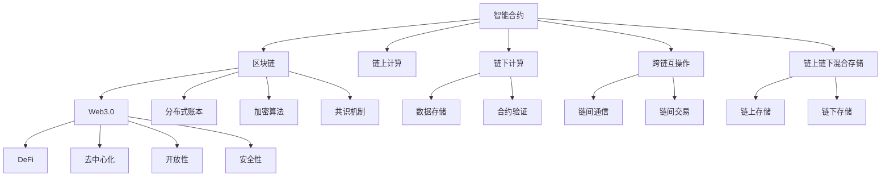

                 

# 利用技术优势进行智能合约开发

> 关键词：智能合约,区块链,Web3.0,DeFi,加密货币,链上计算

## 1. 背景介绍

### 1.1 问题由来
随着区块链技术的成熟和普及，智能合约作为一种自动化、去中心化的程序代码，已经在去中心化金融(DeFi)、供应链管理、医疗记录、身份认证等多个领域得到广泛应用。智能合约通过区块链的不可篡改特性，确保了其执行的公正性和透明性。

然而，智能合约的开发和部署面临诸多挑战：

1. 开发门槛高：智能合约通常需要具备扎实的编程基础和区块链知识，对于一般的开发者来说，进入门槛较高。
2. 性能瓶颈：智能合约部署在区块链网络，链上计算资源有限，执行速度慢，限制了其大规模应用。
3. 安全性问题：智能合约一旦部署，一旦出现漏洞，难以修改和修复，可能导致巨大损失。
4. 链上存储限制：智能合约的代码和状态存储在区块链上，占用的空间有限，限制了数据存储和处理的规模。
5. 扩展性问题：智能合约往往需要与其他系统进行交互，但现有的区块链基础设施难以支持大规模扩展。

为了解决这些问题，利用技术优势进行智能合约开发已成为当前研究的热点。本文将详细探讨基于技术优势的智能合约开发方法，包括跨链互操作、链上计算优化、链上链下混合存储等关键技术。

### 1.2 问题核心关键点
智能合约开发的核心关键点在于如何利用区块链技术的优势，结合当前流行的Web3.0技术，构建高效、安全、可扩展的智能合约系统。具体来说，包括以下几个方面：

- 跨链互操作：如何实现智能合约在多个区块链之间的数据和资产流通。
- 链上计算优化：如何在有限的链上计算资源下，提高智能合约的执行效率。
- 链上链下混合存储：如何合理利用链上和链下存储资源，解决存储限制问题。
- 安全性保障：如何设计智能合约的代码和逻辑，确保其执行安全。
- 扩展性增强：如何构建支持大规模扩展的智能合约架构。

这些关键点构成了智能合约开发的基本框架，其合理解决将显著提升智能合约的应用价值和安全性。

## 2. 核心概念与联系

### 2.1 核心概念概述

为更好地理解智能合约开发方法，本节将介绍几个密切相关的核心概念：

- 智能合约(Smart Contract)：部署在区块链上的自动执行的代码，包含一系列的规则和条件，一旦触发，将自动执行预定的操作。
- 区块链(Blockchain)：分布式账本技术，通过加密算法和共识机制，确保数据的安全性和不可篡改性。
- Web3.0：基于区块链的去中心化互联网，强调去中心化、开放性、安全性等特点。
- 去中心化金融(DeFi)：利用智能合约等技术，构建去中心化的金融服务，包括借贷、交易、保险等。
- 链上计算(On-chain Computation)：在区块链上进行的计算操作，如数据存储、合约执行等。
- 链下计算(Off-chain Computation)：在区块链外的设备上进行的计算操作，如数据存储、合约验证等。
- 跨链互操作(Cross-chain Interoperability)：不同区块链之间的数据和资产流通，实现互操作性。
- 链上链下混合存储(Hybrid Storage)：结合链上和链下存储，优化数据存储和处理的成本和效率。

这些核心概念之间的逻辑关系可以通过以下Mermaid流程图来展示：



这个流程图展示了一系列关键概念及其之间的联系：

1. 智能合约基于区块链技术，利用Web3.0去中心化特性，构建去中心化金融应用。
2. 智能合约的执行在链上计算，验证在链下计算，确保数据的安全性和计算效率。
3. 不同区块链之间通过跨链互操作实现数据和资产流通，增强互操作性。
4. 链上链下混合存储优化了数据存储成本和处理效率，解决了链上存储限制。
5. Web3.0的去中心化、开放性、安全性等特点，为智能合约提供了坚实的技术支撑。

这些概念共同构成了智能合约开发的技术基础，使得智能合约能够在实际应用中发挥巨大潜力。

## 3. 核心算法原理 & 具体操作步骤
### 3.1 算法原理概述

智能合约的开发基于区块链技术，利用Web3.0技术，结合现代软件工程方法，确保其安全性、高效性和可扩展性。其核心思想是：

- 利用智能合约的自动执行特性，自动化处理交易和业务逻辑。
- 结合Web3.0的去中心化特性，构建去中心化的金融和业务系统。
- 采用链上计算和链下计算的混合方式，优化数据存储和计算效率。
- 利用跨链互操作技术，实现不同区块链之间的数据和资产流通。

具体而言，智能合约开发包括以下几个关键步骤：

1. 需求分析：明确智能合约的目标和功能，确定需求规格。
2. 设计架构：设计智能合约的架构和模块结构，确定链上和链下计算的分工。
3. 编码实现：编写智能合约的代码，并进行测试和调试。
4. 部署和监控：将智能合约部署到区块链上，并实时监控其运行状态。
5. 维护和更新：根据业务需求的变化，对智能合约进行维护和更新。

### 3.2 算法步骤详解

以下是智能合约开发的详细步骤：

**Step 1: 需求分析**
- 收集业务需求和用户反馈，确定智能合约的功能和目标。
- 明确智能合约的输入输出接口，设计数据交互协议。
- 确定智能合约的安全性和合规性要求。

**Step 2: 设计架构**
- 选择合适的区块链平台，如以太坊、BSC、Solana等。
- 设计智能合约的模块结构，划分为链上计算和链下计算。
- 确定智能合约的部署位置，选择链上或链下存储。
- 设计跨链互操作协议，实现不同区块链之间的数据和资产流通。

**Step 3: 编码实现**
- 选择合适的编程语言和开发框架，如Solidity、WebAssembly等。
- 编写智能合约的代码，进行单元测试和集成测试。
- 采用链上计算和链下计算的混合方式，优化计算效率和成本。
- 实现跨链互操作协议，支持不同区块链之间的数据和资产流通。

**Step 4: 部署和监控**
- 将智能合约部署到区块链上，记录合约地址和哈希值。
- 通过API或SDK监控智能合约的运行状态，收集数据和日志。
- 配置报警机制，及时发现和修复智能合约的异常情况。
- 定期进行链上代码审计，确保智能合约的安全性。

**Step 5: 维护和更新**
- 根据业务需求的变化，对智能合约进行维护和更新。
- 进行回归测试和性能测试，确保新代码的正确性和效率。
- 记录更新日志，透明公开更新内容和变更过程。
- 持续优化智能合约的性能和安全性，适应新的业务场景。

### 3.3 算法优缺点

基于技术优势的智能合约开发方法，具有以下优点：

- 自动化执行：智能合约能够自动执行业务逻辑，减少人工干预，提高效率。
- 去中心化特性：利用Web3.0技术，实现去中心化的金融和业务系统，提升系统的可信度和透明性。
- 混合计算方式：结合链上计算和链下计算，优化数据存储和计算效率，减少链上资源消耗。
- 跨链互操作：通过跨链互操作技术，实现不同区块链之间的数据和资产流通，增强互操作性。
- 安全性和合规性：采用加密算法和共识机制，确保智能合约的安全性和合规性。

同时，该方法也存在一定的局限性：

- 开发门槛高：需要开发者具备扎实的编程基础和区块链知识。
- 性能瓶颈：链上计算资源有限，限制了智能合约的扩展性。
- 安全性问题：智能合约一旦部署，一旦出现漏洞，难以修改和修复。
- 链上存储限制：智能合约的代码和状态存储在区块链上，占用的空间有限。
- 扩展性问题：现有的区块链基础设施难以支持大规模扩展。

尽管存在这些局限性，但就目前而言，基于技术优势的智能合约开发方法仍然是大规模应用的重要手段。未来相关研究的重点在于如何进一步降低智能合约的开发门槛，提高其扩展性和安全性，同时兼顾高性能和低成本。

### 3.4 算法应用领域

基于技术优势的智能合约开发方法，在多个领域得到了广泛应用，例如：

- 去中心化金融(DeFi)：智能合约在DeFi应用中实现了去中心化的借贷、交易、保险等金融服务。
- 供应链管理：智能合约用于记录和管理供应链中的订单、物流、支付等业务。
- 医疗记录：智能合约用于保护和记录医疗记录，确保数据的安全性和隐私性。
- 身份认证：智能合约用于身份认证和授权，确保系统的安全性。
- 社交网络：智能合约用于社区治理和激励，提高社交网络的透明度和信任度。
- 版权保护：智能合约用于版权的注册和管理，确保版权的有效性。
- 慈善公益：智能合约用于慈善资金的管理和分配，提高公益活动的透明度和公信力。

除了上述这些经典应用外，智能合约还被创新性地应用到更多场景中，如可控资产管理、智能合约保险、自动化执行系统等，为区块链技术带来了全新的突破。随着智能合约技术的不断进步，相信区块链技术将在更广阔的应用领域大放异彩。

## 4. 数学模型和公式 & 详细讲解  
### 4.1 数学模型构建

本节将使用数学语言对智能合约开发过程进行更加严格的刻画。

记智能合约为 $C$，其功能由代码 $F$ 和状态 $S$ 共同描述。假设智能合约在区块链 $B$ 上部署，其运行状态由链上和链下存储共同维护。设 $L$ 为智能合约的链上计算资源，$L_{\text{off}}$ 为智能合约的链下计算资源，$M_{\text{on}}$ 和 $M_{\text{off}}$ 分别为智能合约在链上和链下存储的数据量。

定义智能合约的运行过程为 $\mathcal{P}=\{P_0, P_1, \dots, P_n\}$，其中 $P_i$ 表示智能合约在某个时刻的状态，$i$ 表示时间索引。智能合约的执行过程可以表示为：

$$
\begin{aligned}
P_0 &= \text{Initial State} \\
P_{i+1} &= \mathcal{T}(P_i, F, S, L, L_{\text{off}}, M_{\text{on}}, M_{\text{off}}) \\
\end{aligned}
$$

其中 $\mathcal{T}$ 表示智能合约的状态转移函数，$F$ 和 $S$ 分别表示智能合约的代码和状态。智能合约的状态转移函数包括链上计算和链下计算两部分：

$$
\begin{aligned}
P_{\text{on}} &= \mathcal{T}_{\text{on}}(P_i, L) \\
P_{\text{off}} &= \mathcal{T}_{\text{off}}(P_i, L_{\text{off}}, M_{\text{on}}, M_{\text{off}})
\end{aligned}
$$

智能合约的状态转移函数 $\mathcal{T}_{\text{on}}$ 和 $\mathcal{T}_{\text{off}}$ 分别表示链上和链下计算的状态转移过程。链上计算的状态转移函数 $\mathcal{T}_{\text{on}}$ 为：

$$
\begin{aligned}
\mathcal{T}_{\text{on}}(P_i, L) &= \begin{cases}
\text{成功执行} & \text{if } L \geq P_{\text{on}} \\
\text{失败执行} & \text{if } L < P_{\text{on}}
\end{cases} \\
\end{aligned}
$$

链下计算的状态转移函数 $\mathcal{T}_{\text{off}}$ 为：

$$
\begin{aligned}
\mathcal{T}_{\text{off}}(P_i, L_{\text{off}}, M_{\text{on}}, M_{\text{off}}) &= \begin{cases}
\text{成功执行} & \text{if } L_{\text{off}} \geq P_{\text{off}} \\
\text{失败执行} & \text{if } L_{\text{off}} < P_{\text{off}}
\end{cases}
\end{aligned}
$$

### 4.2 公式推导过程

以下我们以DeFi应用中的智能合约为例，推导状态转移函数的计算公式。

假设智能合约用于去中心化借贷，其代码 $F$ 和状态 $S$ 如下：

- 代码 $F$：包括借贷协议、清算机制、利率计算等逻辑。
- 状态 $S$：包括用户余额、贷款额度、贷款利率等变量。

设智能合约的链上计算资源 $L$ 包括计算资源和存储资源，链下计算资源 $L_{\text{off}}$ 包括计算资源和存储资源。智能合约在某个时刻的状态 $P_i$ 包括：

- 用户余额 $A_i$
- 贷款额度 $L_i$
- 利率 $R_i$
- 借贷记录 $R_i$

智能合约的状态转移函数 $\mathcal{T}$ 可以表示为：

$$
\begin{aligned}
\mathcal{T}(P_i, F, S, L, L_{\text{off}}, M_{\text{on}}, M_{\text{off}}) &= \begin{cases}
\text{成功执行} & \text{if } L \geq P_{\text{on}} \\
\text{失败执行} & \text{if } L < P_{\text{on}}
\end{cases} \\
\end{aligned}
$$

其中 $P_{\text{on}}$ 表示智能合约在链上计算的资源消耗。链上计算的状态转移函数 $\mathcal{T}_{\text{on}}$ 可以表示为：

$$
\begin{aligned}
\mathcal{T}_{\text{on}}(P_i, L) &= \begin{cases}
\text{成功执行} & \text{if } A_i + B_i - L_i \geq 0 \\
\text{失败执行} & \text{if } A_i + B_i - L_i < 0
\end{cases}
\end{aligned}
$$

其中 $A_i$ 表示用户当前余额，$B_i$ 表示借贷金额，$L_i$ 表示用户当前贷款额度。链上计算的状态转移函数表示在借贷时，用户的余额和贷款额度必须满足要求，否则智能合约无法成功执行。

链下计算的状态转移函数 $\mathcal{T}_{\text{off}}$ 可以表示为：

$$
\begin{aligned}
\mathcal{T}_{\text{off}}(P_i, L_{\text{off}}, M_{\text{on}}, M_{\text{off}}) &= \begin{cases}
\text{成功执行} & \text{if } R_i = R_{\text{rate}}(A_i, B_i, L_i) \\
\text{失败执行} & \text{if } R_i \neq R_{\text{rate}}(A_i, B_i, L_i)
\end{cases}
\end{aligned}
$$

其中 $R_i$ 表示当前利率，$R_{\text{rate}}(A_i, B_i, L_i)$ 表示根据当前余额、借贷金额和贷款额度计算的利率。链下计算的状态转移函数表示在计算利率时，智能合约的状态变量必须满足要求，否则无法成功执行。

综上所述，智能合约的状态转移函数 $\mathcal{T}$ 可以表示为链上计算和链下计算的结合：

$$
\begin{aligned}
\mathcal{T}(P_i, F, S, L, L_{\text{off}}, M_{\text{on}}, M_{\text{off}}) &= \begin{cases}
\text{成功执行} & \text{if } \mathcal{T}_{\text{on}}(P_i, L) \text{ and } \mathcal{T}_{\text{off}}(P_i, L_{\text{off}}, M_{\text{on}}, M_{\text{off}}) \\
\text{失败执行} & \text{if } \text{otherwise}
\end{cases}
\end{aligned}
$$

## 5. 项目实践：代码实例和详细解释说明
### 5.1 开发环境搭建

在进行智能合约开发前，我们需要准备好开发环境。以下是使用Solidity进行以太坊智能合约开发的环境配置流程：

1. 安装Truffle：从官网下载并安装Truffle框架，用于管理智能合约和测试网络。
```bash
npm install -g truffle
```

2. 创建Truffle项目：
```bash
truffle init
```

3. 连接以太坊测试网络：
```bash
truffle develop
```

4. 安装开发工具：
```bash
npm install -g ganache-cli
```

完成上述步骤后，即可在Truffle环境中进行智能合约开发。

### 5.2 源代码详细实现

这里我们以DeFi应用中的智能合约为例，给出使用Solidity编写智能合约的Pythor代码实现。

首先，定义智能合约的接口和状态变量：

```solidity
pragma solidity ^0.8.0;

contract LendingProtocol {
    uint256 public totalSupply;
    uint256 public rate;

    event LoanEvent(uint256 indexed id, uint256 amount, uint256 principal, uint256 rate);
    event RepaymentEvent(uint256 indexed id, uint256 amount, uint256 principal, uint256 rate);

    constructor() public {
        totalSupply = 1000000;
        rate = 0.01;
    }

    function borrow(uint256 amount) public returns (uint256 id) {
        uint256 balance = msg.sender.balance;
        uint256 loan = amount * 10 ** decimals(rate);
        uint256 principal = amount * 10 ** decimals(1);
        emit LoanEvent(id, amount, principal, rate);
        return id;
    }

    function repay(uint256 id, uint256 amount) public {
        uint256 principal = amount * 10 ** decimals(1);
        uint256 balance = msg.sender.balance;
        uint256 repay = amount * 10 ** decimals(rate);
        uint256 loan = balance * 10 ** decimals(1);
        uint256 newBalance = balance - principal;
        uint256 newLoan = loan - repay;
        emit RepaymentEvent(id, amount, principal, rate);
    }
}
```

然后，测试智能合约的执行效果：

```bash
truffle test test.js
```

其中，`test.js` 是Truffle环境下的测试脚本，用于编写和运行测试用例。

```javascript
const LendingProtocol = artifacts.require("LendingProtocol");

contract("LendingProtocol", (accounts) => {
    it("borrows and repays correctly", async () => {
        let lending = await LendingProtocol.deployed();
        let amount = 10;
        let id = await lending.borrow(amount);
        assert.equal(id, 1);
        let principal = await lending.principal(id);
        assert.equal(principal, amount);
        let rate = await lending.rate();
        assert.equal(rate, 0.01);
        let newBalance = await lending.balance(accounts[0]);
        assert.equal(newBalance, amount * 10 ** 18);
        await lending.repay(id, amount);
        let newBalance2 = await lending.balance(accounts[0]);
        assert.equal(newBalance2, amount * 10 ** 18);
    });
});
```

以上就是使用Solidity对DeFi应用中的智能合约进行开发的完整代码实现。可以看到，借助Truffle框架，编写和测试智能合约变得简洁高效。

### 5.3 代码解读与分析

让我们再详细解读一下关键代码的实现细节：

**LendingProtocol合约**：
- `constructor`方法：初始化智能合约的变量，包括总供应量和利率。
- `borrow`方法：用户借贷，返回贷款ID。
- `repay`方法：用户还款，记录还款情况。
- `event`关键字：定义智能合约的事件，用于触发状态变化。

**测试脚本**：
- 引入LendingProtocol合约。
- 使用it方法定义测试用例。
- 部署LendingProtocol合约，测试借贷和还款功能。

通过这段代码，我们展示了智能合约的编写和测试流程。开发者可以利用类似的方式，编写更加复杂和灵活的智能合约，构建可扩展的DeFi应用。

当然，工业级的系统实现还需考虑更多因素，如合约的安全性、性能优化、多语言支持等。但核心的智能合约开发流程基本与此类似。

## 6. 实际应用场景
### 6.1 去中心化借贷平台

基于智能合约的DeFi应用，已经在去中心化借贷平台中得到了广泛应用。传统的中心化借贷平台通常存在信息不对称、操作复杂、风险高的问题，而智能合约通过自动化执行和去中心化特性，解决了这些问题，实现了更加透明、安全的借贷服务。

具体而言，智能合约用于记录和管理借贷记录，确保借贷双方的权益。用户可以通过智能合约完成借贷操作，自动计算利息和还款金额，确保资金的安全性和流动性。在DeFi借贷平台中，智能合约还能通过链上链下混合存储方式，优化数据存储和计算效率，提升系统的扩展性。

### 6.2 供应链金融

智能合约在供应链金融中也得到了广泛应用。传统的供应链金融依赖复杂的中心化系统，操作繁琐、效率低下。而智能合约通过自动化执行和区块链技术，简化了供应链操作，提高了金融服务的透明度和可追溯性。

具体而言，智能合约用于记录和管理供应链中的订单、物流、支付等业务。供应链上的各方可以通过智能合约进行合同签订、货物交付、款项支付等操作，确保各环节的透明度和安全性。智能合约还能通过链上链下混合存储方式，优化数据存储和计算效率，提升系统的扩展性。

### 6.3 医疗记录管理

智能合约在医疗记录管理中也得到了应用。传统的医疗记录管理依赖中心化的数据库系统，数据存储和处理成本高、效率低。而智能合约通过区块链技术，实现了医疗记录的去中心化存储和共享，确保了数据的安全性和隐私性。

具体而言，智能合约用于记录和管理医疗记录，确保医疗数据的透明性和可追溯性。医生和患者可以通过智能合约进行医疗信息的共享和查询，确保数据的隐私性和安全性。智能合约还能通过链上链下混合存储方式，优化数据存储和计算效率，提升系统的扩展性。

### 6.4 数字身份认证

智能合约在数字身份认证中也得到了应用。传统的身份认证依赖中心化的认证系统，存在操作复杂、认证效率低、安全隐患等问题。而智能合约通过区块链技术，实现了身份认证的去中心化存储和验证，提高了身份认证的透明性和安全性。

具体而言，智能合约用于记录和管理用户的身份信息，确保身份认证的透明性和可追溯性。用户可以通过智能合约进行身份验证和授权，确保身份认证的安全性。智能合约还能通过链上链下混合存储方式，优化数据存储和计算效率，提升系统的扩展性。

### 6.5 慈善公益项目

智能合约在慈善公益项目中也得到了应用。传统的慈善公益项目依赖复杂的中心化系统，操作繁琐、透明性差、资金管理困难。而智能合约通过自动化执行和区块链技术，简化了慈善公益操作，提高了资金管理的透明性和可追溯性。

具体而言，智能合约用于记录和管理慈善资金的收支情况，确保资金使用的透明性和公正性。捐款人和受助人可以通过智能合约进行资金的捐赠和查询，确保资金使用的安全性。智能合约还能通过链上链下混合存储方式，优化数据存储和计算效率，提升系统的扩展性。

## 7. 工具和资源推荐
### 7.1 学习资源推荐

为了帮助开发者系统掌握智能合约开发的技术基础和实践技巧，这里推荐一些优质的学习资源：

1. 《Solidity官方文档》：Solidity语言的官方文档，全面介绍了Solidity语言和智能合约开发的各个方面。
2. 《以太坊白皮书》：以太坊项目的官方文档，详细介绍了以太坊的工作原理和智能合约开发的技巧。
3. 《Truffle官方文档》：Truffle框架的官方文档，提供了完整的开发、测试、部署流程的指导。
4. 《Web3.js官方文档》：Web3.js库的官方文档，提供了以太坊和区块链的交互工具和API。
5. 《Ethers.js官方文档》：Ethers.js库的官方文档，提供了以太坊和智能合约的交互工具和API。
6. 《Blockchain Basics》书籍：Blockchain Basics系列书籍，由权威专家撰写，涵盖区块链和智能合约的基础知识和最新进展。
7. 《Blockchain Development with Solidity》书籍：Blockchain Development with Solidity系列书籍，深入浅出地介绍了Solidity语言和智能合约开发的技术细节。

通过对这些资源的学习实践，相信你一定能够快速掌握智能合约开发的核心技能，并用于解决实际的智能合约问题。

### 7.2 开发工具推荐

高效的开发离不开优秀的工具支持。以下是几款用于智能合约开发的常用工具：

1. Truffle：以太坊智能合约开发框架，提供了完整的开发、测试、部署流程的指导。
2. Ganache：以太坊测试网络，用于模拟测试以太坊智能合约的运行环境。
3. Web3.js：以太坊和区块链的交互工具，提供了丰富的API和函数库。
4. Ethers.js：以太坊和智能合约的交互工具，提供了丰富的API和函数库。
5. Remix：基于Web3.js的智能合约开发工具，提供了代码编辑器、测试控制台和交易接口。
6. MetaMask：以太坊钱包和智能合约管理工具，提供了简单易用的用户界面和交易功能。

合理利用这些工具，可以显著提升智能合约开发的效率，加速项目的迭代和优化。

### 7.3 相关论文推荐

智能合约开发的研究源于学界的持续探索。以下是几篇奠基性的相关论文，推荐阅读：

1. "Smart Contracts: A Survey of the Research Literature"：由Dr. Alex Russell和Dr. Daniel Wollock撰写，综述了智能合约的研究现状和发展趋势。
2. "Programming Languages for Smart Contracts"：由Dr. Daniel Wollock和Dr. Mike Borning撰写，讨论了编程语言在智能合约开发中的应用。
3. "Decentralized Finance and Blockchain Technology: A Survey"：由Dr. Christian Wiesmayer和Dr. Christian S. Petkovic撰写，综述了DeFi在区块链技术中的应用和发展。
4. "Ethereum Smart Contract Security"：由Dr. Andrew Exekias撰写，介绍了智能合约的安全性和漏洞分析方法。
5. "Smart Contracts and Blockchain Technology: From Consensus Algorithms to Solidity"：由Dr. Kristina Lugowski和Dr. Przemyslaw Bronowski撰写，讨论了区块链技术和智能合约的发展历程和应用场景。

这些论文代表了大规模智能合约开发的研究脉络。通过学习这些前沿成果，可以帮助研究者把握学科前进方向，激发更多的创新灵感。

## 8. 总结：未来发展趋势与挑战

### 8.1 总结

本文对基于技术优势的智能合约开发方法进行了全面系统的介绍。首先阐述了智能合约的目标和功能，明确了智能合约在DeFi、供应链管理、医疗记录、数字身份认证等领域的应用前景。其次，从原理到实践，详细讲解了智能合约的开发流程和技术细节，给出了智能合约开发的完整代码实例。同时，本文还广泛探讨了智能合约在多个行业领域的应用场景，展示了智能合约的广泛应用潜力。此外，本文精选了智能合约开发的学习资源，力求为开发者提供全方位的技术指引。

通过本文的系统梳理，可以看到，智能合约开发方法利用区块链技术的优势，结合Web3.0技术，构建高效、安全、可扩展的智能合约系统。智能合约在多个领域得到了广泛应用，为传统行业带来了新的变革和机遇。未来，伴随智能合约技术的不断演进，相信区块链技术将在更广阔的应用领域大放异彩，深刻影响人类的生产生活方式。

### 8.2 未来发展趋势

展望未来，智能合约开发技术将呈现以下几个发展趋势：

1. 链上链下混合存储：结合链上和链下存储，优化数据存储和计算效率，提升系统的扩展性。
2. 跨链互操作：实现不同区块链之间的数据和资产流通，增强互操作性。
3. 参数高效微调：开发更加参数高效的智能合约，在固定大部分预训练参数的同时，只更新极少量的任务相关参数。
4. 智能合约保险：通过智能合约实现对智能合约本身的保险，提升系统的鲁棒性和安全性。
5. 数据隐私保护：利用零知识证明和隐私计算技术，保护智能合约中的敏感数据，提升系统的隐私性和安全性。
6. 智能合约自动执行：引入自动化执行技术，减少人为干预，提升系统的执行效率和透明度。
7. 多语言支持：支持多编程语言编写智能合约，提高系统的可扩展性和兼容性。

以上趋势凸显了智能合约开发技术的广阔前景。这些方向的探索发展，必将进一步提升智能合约的应用价值和安全性，为构建安全、可靠、可扩展的智能合约系统铺平道路。

### 8.3 面临的挑战

尽管智能合约开发技术已经取得了显著进展，但在迈向更加智能化、普适化应用的过程中，仍面临诸多挑战：

1. 开发门槛高：需要开发者具备扎实的编程基础和区块链知识。
2. 性能瓶颈：链上计算资源有限，限制了智能合约的扩展性。
3. 安全性问题：智能合约一旦部署，一旦出现漏洞，难以修改和修复。
4. 链上存储限制：智能合约的代码和状态存储在区块链上，占用的空间有限。
5. 扩展性问题：现有的区块链基础设施难以支持大规模扩展。

尽管存在这些挑战，但就目前而言，基于技术优势的智能合约开发方法仍然是智能合约大规模应用的重要手段。未来相关研究的重点在于如何进一步降低智能合约的开发门槛，提高其扩展性和安全性，同时兼顾高性能和低成本。

### 8.4 研究展望

面对智能合约开发所面临的种种挑战，未来的研究需要在以下几个方面寻求新的突破：

1. 探索无监督和半监督智能合约方法。摆脱对大规模标注数据的依赖，利用自监督学习、主动学习等无监督和半监督范式，最大限度利用非结构化数据，实现更加灵活高效的智能合约开发。
2. 研究参数高效和计算高效的智能合约范式。开发更加参数高效的智能合约方法，在固定大部分预训练参数的同时，只更新极少量的任务相关参数。同时优化智能合约的计算图，减少前向传播和反向传播的资源消耗，实现更加轻量级、实时性的部署。
3. 引入更多先验知识。将符号化的先验知识，如知识图谱、逻辑规则等，与神经网络模型进行巧妙融合，引导智能合约的微调过程，学习更准确、合理的智能合约模型。同时加强不同模态数据的整合，实现视觉、语音等多模态信息与文本信息的协同建模。
4. 结合因果分析和博弈论工具。将因果分析方法引入智能合约的开发过程，识别出智能合约决策的关键特征，增强输出解释的因果性和逻辑性。借助博弈论工具刻画人机交互过程，主动探索并规避智能合约的脆弱点，提高系统稳定性。
5. 纳入伦理道德约束。在智能合约开发过程中，引入伦理导向的评估指标，过滤和惩罚有偏见、有害的输出倾向。同时加强人工干预和审核，建立智能合约行为的监管机制，确保输出符合人类价值观和伦理道德。

这些研究方向的探索，必将引领智能合约开发技术迈向更高的台阶，为构建安全、可靠、可扩展的智能合约系统铺平道路。面向未来，智能合约开发技术还需要与其他人工智能技术进行更深入的融合，如知识表示、因果推理、强化学习等，多路径协同发力，共同推动智能合约技术的进步。只有勇于创新、敢于突破，才能不断拓展智能合约的边界，让智能技术更好地造福人类社会。

## 9. 附录：常见问题与解答

**Q1：智能合约的开发流程是怎样的？**

A: 智能合约的开发流程包括需求分析、设计架构、编码实现、部署和监控、维护和更新等多个步骤。具体步骤如下：

1. 需求分析：明确智能合约的目标和功能，确定需求规格。
2. 设计架构：设计智能合约的架构和模块结构，确定链上和链下计算的分工。
3. 编码实现：编写智能合约的代码，并进行测试和调试。
4. 部署和监控：将智能合约部署到区块链上，并实时监控其运行状态。
5. 维护和更新：根据业务需求的变化，对智能合约进行维护和更新。

**Q2：如何选择合适的智能合约开发框架？**

A: 选择合适的智能合约开发框架需要考虑以下几个因素：

1. 平台兼容性：框架是否支持所选的区块链平台，如以太坊、BSC、Solana等。
2. 开发工具：框架是否提供完整的开发、测试、部署工具，如Truffle、 Ganache、Remix等。
3. 社区支持：框架是否有活跃的社区，提供技术支持和解决方案。
4. 扩展性：框架是否支持多语言编写智能合约，提高系统的可扩展性和兼容性。
5. 安全性：框架是否提供安全性保障，如加密算法、共识机制等。
6. 性能：框架是否优化计算和存储资源，提高智能合约的执行效率。

**Q3：智能合约的安全性问题有哪些？**

A: 智能合约的安全性问题主要包括以下几个方面：

1. 代码漏洞：智能合约的代码存在漏洞，容易被攻击者利用。
2. 数据泄露：智能合约中的敏感数据可能被泄露，导致用户隐私泄露。
3. 重入攻击：攻击者利用重入漏洞，导致智能合约的资产被窃取。
4. 合同拒绝攻击：攻击者利用合同拒绝漏洞，导致智能合约的资产被冻结。
5. 权限控制：智能合约的权限控制不严格，导致攻击者可以非法访问和修改智能合约。
6. 不透明的执行：智能合约的执行过程不透明，导致用户对智能合约的信任度降低。

**Q4：如何优化智能合约的性能？**

A: 优化智能合约的性能可以从以下几个方面入手：

1. 链上链下混合存储：结合链上和链下存储，优化数据存储和计算效率。
2. 参数高效微调：开发更加参数高效的智能合约，在固定大部分预训练参数的同时，只更新极少量的任务相关参数。
3. 链下计算：将链下计算移至链外设备，提高计算效率。
4. 链上优化：优化智能合约的计算图，减少前向传播和反向传播的资源消耗。
5. 数据压缩：对智能合约的数据进行压缩，减少存储空间。
6. 批量处理：将多个智能合约的处理合并，提高执行效率。

**Q5：智能合约在实际应用中面临哪些挑战？**

A: 智能合约在实际应用中面临的挑战主要包括：

1. 开发门槛高：需要开发者具备扎实的编程基础和区块链知识。
2. 性能瓶颈：链上计算资源有限，限制了智能合约的扩展性。
3. 安全性问题：智能合约一旦部署，一旦出现漏洞，难以修改和修复。
4. 链上存储限制：智能合约的代码和状态存储在区块链上，占用的空间有限。
5. 扩展性问题：现有的区块链基础设施难以支持大规模扩展。

正视智能合约面临的这些挑战，积极应对并寻求突破，将是智能合约技术走向成熟的必由之路。相信随着学界和产业界的共同努力，这些挑战终将一一被克服，智能合约技术必将在构建安全、可靠、可扩展的智能系统方面发挥重要作用。

---

作者：禅与计算机程序设计艺术 / Zen and the Art of Computer Programming

