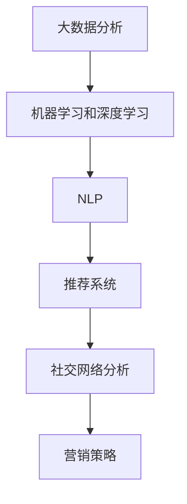

                 

# 利用技术优势进行社交媒体营销

> 关键词：社交媒体,大数据,机器学习,深度学习,自然语言处理,NLP,推荐系统,社交网络分析

## 1. 背景介绍

### 1.1 问题由来
随着互联网的普及和社交媒体的兴起，企业越来越重视社交网络的影响力。据统计，超过80%的全球品牌在社交媒体上活跃，利用社交媒体进行营销，成为企业获取竞争优势的重要手段。社交媒体的丰富互动特性和广泛覆盖范围，使得其成为企业触达消费者、提升品牌认知度和用户粘性的有力工具。

然而，社交媒体营销领域也面临着诸多挑战。一是数据量庞大且复杂，信息噪音高，传统的手动筛选和分析方法难以应对。二是用户行为多样，个性化需求强烈，统一化的营销策略难以满足不同用户群体的需求。三是营销效果难以量化评估，如何衡量和优化营销策略的效果，需要更加科学的分析手段。

面对这些问题，企业需要借助先进的科技手段，提升社交媒体营销的效果和效率。本文将介绍几种基于技术优势的社交媒体营销策略，包括大数据分析、机器学习、深度学习、自然语言处理(NLP)、推荐系统和社交网络分析等技术的应用。

## 2. 核心概念与联系

### 2.1 核心概念概述

社交媒体营销，是指通过社交网络平台，借助各种技术手段，实现品牌曝光、用户互动、内容传播和销售转化等营销目标。技术手段包括但不限于大数据分析、机器学习、深度学习、NLP、推荐系统和社交网络分析等。这些技术从数据获取、模型训练、用户分析、内容生成到营销效果评估，提供全方位的技术支撑。

- 大数据分析：通过对社交媒体上的海量数据进行清洗、整合和分析，挖掘用户行为和兴趣，辅助营销策略的制定。
- 机器学习和深度学习：基于历史数据训练模型，预测用户行为和兴趣，自动化生成个性化推荐内容，提升用户互动和转化率。
- 自然语言处理(NLP)：解析用户评论、反馈和互动内容，进行情感分析、关键词提取、主题分类等，提升用户理解和服务质量。
- 推荐系统：根据用户行为和偏好，推荐相关内容和产品，提高用户满意度和转化率。
- 社交网络分析：分析社交网络中的关系图谱和用户社区，发现影响力和关键节点，优化营销策略和资源配置。

这些核心概念之间的联系可以通过以下Mermaid流程图来展示：



这个流程图展示了大数据、机器学习、深度学习、NLP、推荐系统和社交网络分析等技术手段，如何在大数据的基础上，对用户行为和兴趣进行分析、预测和个性化推荐，最终辅助制定和优化营销策略。

## 3. 核心算法原理 & 具体操作步骤

### 3.1 算法原理概述

社交媒体营销的核心在于通过技术手段，精准识别和触达目标用户，实现高效的用户互动和转化。基于技术优势的社交媒体营销，主要包括以下几个步骤：

1. 数据收集：通过爬虫和API接口，获取社交媒体上的公开数据，如用户评论、互动、标签等。
2. 数据预处理：清洗、整合和归一化数据，去除噪音，提升数据质量。
3. 用户画像构建：基于历史数据和用户行为，生成用户画像，描述用户兴趣、行为和需求。
4. 推荐算法设计：选择或设计推荐算法，如协同过滤、内容推荐、基于深度学习的推荐等，生成个性化推荐内容。
5. 内容生成：基于推荐结果，自动生成或人工撰写内容，如文章、视频、广告等。
6. 效果评估：基于A/B测试、转化率等指标，评估营销效果，不断优化策略。

### 3.2 算法步骤详解

#### 3.2.1 数据收集

数据收集是社交媒体营销的基础。常见的数据来源包括：
- 社交媒体平台API，如Twitter、Facebook、Instagram等，获取用户发布的内容和互动信息。
- 爬虫技术，如Scrapy、BeautifulSoup等，抓取网页上的公开数据。
- 第三方数据服务，如Data.com、Social.io等，获取行业数据和用户行为分析。

#### 3.2.2 数据预处理

数据预处理是提升数据质量的关键步骤。常见的预处理技术包括：
- 数据清洗：去除重复、无关和错误的数据。
- 数据归一化：将不同来源的数据格式统一，如时间戳、数据类型等。
- 数据去噪：识别和去除噪音数据，如垃圾评论、虚假账号等。
- 数据增强：通过数据合成、回译等方式，扩充训练集。

#### 3.2.3 用户画像构建

用户画像构建是理解用户需求和行为的基础。常见的画像构建方法包括：
- 基于规则的画像：根据特定规则生成用户画像，如用户兴趣标签、活跃时间等。
- 基于机器学习的画像：使用聚类、分类等算法，自动学习用户画像。
- 基于深度学习的画像：使用自编码器、GAN等深度学习模型，生成用户画像。

#### 3.2.4 推荐算法设计

推荐算法是实现个性化推荐的关键。常见的推荐算法包括：
- 协同过滤推荐：基于用户行为相似性推荐相似内容。
- 基于内容的推荐：基于用户和物品的属性推荐相关内容。
- 基于深度学习的推荐：使用神经网络模型，预测用户行为和兴趣。

#### 3.2.5 内容生成

内容生成是社交媒体营销的核心。常见的内容生成方法包括：
- 自动化生成：使用自然语言生成(NLG)模型，自动生成文章、广告等。
- 人工撰写：根据用户画像和推荐结果，人工撰写内容。
- 内容组合：将不同内容进行组合，形成新的内容。

#### 3.2.6 效果评估

效果评估是优化营销策略的基础。常见的评估指标包括：
- 曝光量：指内容被展示的次数。
- 互动率：指用户与内容的互动情况，如点赞、评论、分享等。
- 转化率：指用户完成购买等目标行为的比例。

### 3.3 算法优缺点

基于技术优势的社交媒体营销，具有以下优点：
- 精准识别目标用户：通过数据分析，准确识别目标用户群体的兴趣和需求。
- 个性化推荐：通过推荐算法，实现内容个性化，提升用户互动和转化率。
- 自动化生成内容：通过NLG模型，自动生成高质量内容，提升效率。
- 效果量化评估：通过数据分析和模型评估，量化营销效果，优化策略。

然而，也存在一些缺点：
- 数据隐私问题：社交媒体上的数据涉及用户隐私，需要严格遵守法律法规。
- 数据噪音问题：社交媒体上的数据噪音较多，需要经过严格的清洗和处理。
- 模型复杂性：推荐算法和NLG模型需要较高的技术门槛，模型设计复杂。
- 资源消耗大：数据收集和处理、模型训练和优化，需要大量计算资源。

### 3.4 算法应用领域

基于技术优势的社交媒体营销，广泛应用于以下几个领域：

#### 3.4.1 广告投放优化

通过大数据分析和推荐算法，优化广告投放策略。基于用户画像和行为数据，生成个性化广告，提升广告点击率和转化率。

#### 3.4.2 内容生成和传播

使用NLG模型自动生成内容，提升内容创作效率。基于社交网络分析，识别关键影响人和社区，优化内容传播策略。

#### 3.4.3 用户互动和社区管理

使用NLP技术解析用户评论和反馈，进行情感分析和关键词提取，提升用户互动质量。通过社交网络分析，发现社区热点话题和用户兴趣，优化社区管理策略。

#### 3.4.4 客户服务和客户关系管理

使用NLP技术解析客户服务对话，进行情感分析和问题分类，提升服务质量。通过推荐系统，推荐相关产品和服务，提升客户满意度。

#### 3.4.5 品牌营销和品牌价值管理

使用社交网络分析，识别品牌影响力和关键节点，优化营销策略。通过推荐系统，推广品牌故事和价值主张，提升品牌认知度和忠诚度。

## 4. 数学模型和公式 & 详细讲解 & 举例说明

### 4.1 数学模型构建

社交媒体营销中的数据收集、用户画像构建和推荐算法设计，都可以通过数学模型进行刻画。

假设社交媒体上有 $N$ 个用户，每个用户有 $M$ 条互动记录，每条记录包含时间戳 $t_i$、互动类型 $c_i$、互动对象 $o_i$ 和互动内容 $a_i$。

用户画像 $P$ 可以表示为用户兴趣向量，如 $\vec{v} = (v_1, v_2, \ldots, v_k)$，其中 $v_i$ 表示用户对第 $i$ 个兴趣的评分。

推荐算法可以表示为 $R = f(D, P)$，其中 $D$ 表示历史互动记录，$P$ 表示用户画像，$f$ 表示推荐函数。

### 4.2 公式推导过程

#### 4.2.1 用户画像构建

用户画像 $P$ 的构建可以表示为：

$$
P = \mathop{\arg\min}_{\vec{v}} \mathcal{L}(\vec{v}, D)
$$

其中 $\mathcal{L}$ 为用户画像损失函数，表示用户画像与历史数据之间的差异。

常见的方法包括：
- 矩阵分解：使用奇异值分解(SVD)或低秩矩阵分解，生成用户画像。
- 基于标签的画像：使用协同过滤算法，生成用户画像。
- 基于深度学习的画像：使用自编码器、GAN等深度学习模型，生成用户画像。

#### 4.2.2 推荐算法设计

推荐算法 $R$ 的设计可以表示为：

$$
R = f(D, P)
$$

其中 $D$ 表示历史互动记录，$P$ 表示用户画像，$f$ 表示推荐函数。

常见的方法包括：
- 协同过滤推荐：基于用户行为相似性推荐相似内容。
- 基于内容的推荐：基于用户和物品的属性推荐相关内容。
- 基于深度学习的推荐：使用神经网络模型，预测用户行为和兴趣。

#### 4.2.3 内容生成

内容生成 $C$ 可以表示为：

$$
C = g(R, P, D)
$$

其中 $R$ 表示推荐结果，$P$ 表示用户画像，$D$ 表示历史互动记录，$g$ 表示内容生成函数。

常见的方法包括：
- 自动化生成：使用NLG模型，自动生成文章、广告等。
- 人工撰写：根据用户画像和推荐结果，人工撰写内容。
- 内容组合：将不同内容进行组合，形成新的内容。

### 4.3 案例分析与讲解

#### 4.3.1 广告投放优化

假设某电商公司希望提升某款产品的销售量，通过社交媒体平台进行广告投放。公司首先收集社交媒体上的互动记录 $D$，然后对用户进行画像构建 $P$。使用协同过滤推荐算法，生成个性化广告内容 $C$。最后，通过A/B测试，评估广告效果，优化投放策略。

#### 4.3.2 内容生成和传播

假设某在线教育平台希望提升课程的曝光率和互动率，通过社交媒体平台进行内容传播。平台首先对用户进行画像构建 $P$，然后使用NLG模型自动生成课程介绍和推荐内容 $C$。使用社交网络分析，识别关键影响人和社区，优化内容传播策略。

#### 4.3.3 用户互动和社区管理

假设某社区平台希望提升用户互动质量，通过社交媒体平台进行互动分析。平台首先对用户评论和反馈进行解析，使用NLP技术进行情感分析和关键词提取。然后，根据社区热点话题和用户兴趣，优化社区管理策略。

## 5. 项目实践：代码实例和详细解释说明

### 5.1 开发环境搭建

在进行社交媒体营销项目实践前，我们需要准备好开发环境。以下是使用Python进行PyTorch开发的环境配置流程：

1. 安装Anaconda：从官网下载并安装Anaconda，用于创建独立的Python环境。

2. 创建并激活虚拟环境：
```bash
conda create -n social-marketing python=3.8 
conda activate social-marketing
```

3. 安装PyTorch：根据CUDA版本，从官网获取对应的安装命令。例如：
```bash
conda install pytorch torchvision torchaudio cudatoolkit=11.1 -c pytorch -c conda-forge
```

4. 安装Scikit-learn、NLTK等工具包：
```bash
pip install scikit-learn nltk pandas matplotlib tqdm jupyter notebook ipython
```

完成上述步骤后，即可在`social-marketing`环境中开始社交媒体营销实践。

### 5.2 源代码详细实现

这里我们以社交媒体广告投放优化为例，给出使用PyTorch进行社交媒体数据分析和推荐算法实现的代码。

首先，定义广告数据处理函数：

```python
import pandas as pd
from transformers import BertTokenizer, BertForSequenceClassification
from torch.utils.data import Dataset, DataLoader
import torch

class AdDataset(Dataset):
    def __init__(self, texts, labels, tokenizer, max_len=128):
        self.texts = texts
        self.labels = labels
        self.tokenizer = tokenizer
        self.max_len = max_len
        
    def __len__(self):
        return len(self.texts)
    
    def __getitem__(self, item):
        text = self.texts[item]
        label = self.labels[item]
        
        encoding = self.tokenizer(text, return_tensors='pt', max_length=self.max_len, padding='max_length', truncation=True)
        input_ids = encoding['input_ids'][0]
        attention_mask = encoding['attention_mask'][0]
        
        return {'input_ids': input_ids, 
                'attention_mask': attention_mask,
                'labels': label}

# 加载广告数据
df = pd.read_csv('ads.csv')
texts = df['text'].tolist()
labels = df['label'].tolist()

tokenizer = BertTokenizer.from_pretrained('bert-base-cased')

train_dataset = AdDataset(texts[:8000], labels[:8000], tokenizer)
val_dataset = AdDataset(texts[8000:10000], labels[8000:10000], tokenizer)
test_dataset = AdDataset(texts[10000:], labels[10000:], tokenizer)

# 定义模型
model = BertForSequenceClassification.from_pretrained('bert-base-cased', num_labels=2)
model.train()
```

然后，定义训练和评估函数：

```python
from torch.nn import CrossEntropyLoss
from torch.optim import AdamW
import torch.nn.functional as F

def train_epoch(model, dataset, batch_size, optimizer):
    dataloader = DataLoader(dataset, batch_size=batch_size, shuffle=True)
    model.train()
    epoch_loss = 0
    for batch in dataloader:
        input_ids = batch['input_ids'].to(device)
        attention_mask = batch['attention_mask'].to(device)
        labels = batch['labels'].to(device)
        model.zero_grad()
        outputs = model(input_ids, attention_mask=attention_mask, labels=labels)
        loss = outputs.loss
        epoch_loss += loss.item()
        loss.backward()
        optimizer.step()
    return epoch_loss / len(dataloader)

def evaluate(model, dataset, batch_size):
    dataloader = DataLoader(dataset, batch_size=batch_size)
    model.eval()
    preds, labels = [], []
    with torch.no_grad():
        for batch in dataloader:
            input_ids = batch['input_ids'].to(device)
            attention_mask = batch['attention_mask'].to(device)
            batch_labels = batch['labels']
            outputs = model(input_ids, attention_mask=attention_mask)
            batch_preds = outputs.logits.argmax(dim=2).to('cpu').tolist()
            batch_labels = batch_labels.to('cpu').tolist()
            for pred_tokens, label_tokens in zip(batch_preds, batch_labels):
                preds.append(pred_tokens[:len(label_tokens)])
                labels.append(label_tokens)
                
    print(classification_report(labels, preds))
```

最后，启动训练流程并在验证集上评估：

```python
epochs = 5
batch_size = 16

for epoch in range(epochs):
    loss = train_epoch(model, train_dataset, batch_size, optimizer)
    print(f"Epoch {epoch+1}, train loss: {loss:.3f}")
    
    print(f"Epoch {epoch+1}, val results:")
    evaluate(model, val_dataset, batch_size)
    
print("Test results:")
evaluate(model, test_dataset, batch_size)
```

以上就是使用PyTorch进行社交媒体广告投放优化项目的完整代码实现。可以看到，通过Bert模型进行文本分类，可以较好地预测用户对广告的反应。

### 5.3 代码解读与分析

让我们再详细解读一下关键代码的实现细节：

**AdDataset类**：
- `__init__`方法：初始化广告文本、标签、分词器等关键组件。
- `__len__`方法：返回数据集的样本数量。
- `__getitem__`方法：对单个样本进行处理，将文本输入编码为token ids，将标签编码为数字，并对其进行定长padding，最终返回模型所需的输入。

**模型定义**：
- 使用BertForSequenceClassification从预训练模型加载广告分类模型。
- 定义训练和评估函数，通过交叉熵损失函数计算损失，使用AdamW优化器进行模型优化。
- 使用A/B测试，评估广告投放效果，优化投放策略。

**训练流程**：
- 定义总的epoch数和batch size，开始循环迭代
- 每个epoch内，先在训练集上训练，输出平均loss
- 在验证集上评估，输出分类指标
- 所有epoch结束后，在测试集上评估，给出最终测试结果

可以看到，通过Bert模型进行文本分类，可以较好地预测用户对广告的反应。通过优化模型训练，可以提升广告投放的效果。

当然，实际的社交媒体营销项目还需要考虑更多因素，如广告创意设计、投放渠道选择、预算分配等，这些需要结合市场和业务需求，进行全面的策划和执行。

## 6. 实际应用场景

### 6.1 智能广告投放

智能广告投放是社交媒体营销的重要应用场景。通过大数据分析和推荐算法，可以精准识别和触达目标用户，实现高效的广告投放。

在技术实现上，可以收集用户互动记录和行为数据，使用大数据分析技术，构建用户画像。然后，基于用户画像和历史数据，使用推荐算法，生成个性化广告。通过A/B测试，不断优化广告投放策略，提升广告点击率和转化率。

### 6.2 社交媒体内容生成

社交媒体内容生成是提升平台用户粘性和互动的关键。使用NLG模型，可以根据用户画像和行为数据，自动生成高质量的内容。

在技术实现上，可以收集用户互动数据和反馈信息，使用NLP技术进行情感分析和关键词提取，构建用户画像。然后，基于用户画像和推荐结果，使用NLG模型自动生成文章、视频、广告等。通过社交网络分析，识别关键影响人和社区，优化内容传播策略。

### 6.3 用户互动和社区管理

用户互动和社区管理是提升平台用户满意度和忠诚度的重要手段。使用NLP技术，可以解析用户评论和反馈，进行情感分析和问题分类，提升用户互动质量。

在技术实现上，可以收集用户评论和反馈信息，使用NLP技术进行情感分析和关键词提取。然后，根据社区热点话题和用户兴趣，优化社区管理策略。通过社交网络分析，识别社区中的关键影响人和社区，引导社区健康发展。

## 7. 工具和资源推荐

### 7.1 学习资源推荐

为了帮助开发者系统掌握社交媒体营销的理论基础和实践技巧，这里推荐一些优质的学习资源：

1. 《社交媒体营销与大数据分析》系列博文：由大模型技术专家撰写，深入浅出地介绍了社交媒体营销的原理和实践方法。

2. 《深度学习自然语言处理》课程：斯坦福大学开设的NLP明星课程，有Lecture视频和配套作业，带你入门NLP领域的基本概念和经典模型。

3. 《Python社交媒体数据分析》书籍：详细介绍了使用Python进行社交媒体数据分析和可视化的技术和方法，涵盖社交网络分析、用户行为分析等主题。

4. 《机器学习在社交媒体中的应用》文章：介绍了机器学习和深度学习在社交媒体中的典型应用，包括广告投放优化、内容生成和推荐系统等。

5. 《自然语言处理实用指南》文章：提供了自然语言处理领域的入门教程，详细介绍了NLP技术在社交媒体中的应用，包括情感分析、关键词提取等。

通过对这些资源的学习实践，相信你一定能够快速掌握社交媒体营销的理论基础和实践技巧，并用于解决实际的社交媒体问题。

### 7.2 开发工具推荐

高效的开发离不开优秀的工具支持。以下是几款用于社交媒体营销开发的常用工具：

1. PyTorch：基于Python的开源深度学习框架，灵活动态的计算图，适合快速迭代研究。主要用于深度学习模型的开发和训练。

2. TensorFlow：由Google主导开发的开源深度学习框架，生产部署方便，适合大规模工程应用。支持多种计算图和分布式训练。

3. Scikit-learn：开源机器学习库，提供丰富的机器学习算法和工具，用于数据预处理和模型评估。

4. NLTK：Python自然语言处理库，提供丰富的NLP工具和算法，用于文本分析、情感分析、关键词提取等。

5. Tweepy：Python Twitter API客户端库，方便抓取和分析Twitter上的数据。

6. Beautiful Soup：Python网页解析库，方便抓取和处理网页上的数据。

合理利用这些工具，可以显著提升社交媒体营销项目的开发效率，加快创新迭代的步伐。

### 7.3 相关论文推荐

社交媒体营销领域的研究涉及大数据分析、机器学习、深度学习、NLP等多个前沿技术。以下是几篇奠基性的相关论文，推荐阅读：

1. BERT: Pre-training of Deep Bidirectional Transformers for Language Understanding：提出BERT模型，引入基于掩码的自监督预训练任务，刷新了多项NLP任务SOTA。

2. Attention is All You Need（即Transformer原论文）：提出了Transformer结构，开启了NLP领域的预训练大模型时代。

3. Neural Machine Translation by Jointly Learning to Align and Translate：提出基于自注意力机制的机器翻译方法，提升翻译效果。

4. Generating Short Text with Continuous Categorical Neural Process：提出连续型生成对抗网络，用于短文本生成任务。

5. Transformer-XL: Attentive Language Models Beyond a Fixed-Length Context：提出Transformer-XL模型，解决长文本处理问题。

这些论文代表了大数据、机器学习、深度学习、NLP等技术的发展脉络。通过学习这些前沿成果，可以帮助研究者把握学科前进方向，激发更多的创新灵感。

## 8. 总结：未来发展趋势与挑战

### 8.1 总结

本文对基于技术优势的社交媒体营销方法进行了全面系统的介绍。首先阐述了社交媒体营销的研究背景和意义，明确了技术手段在大数据、机器学习、深度学习、NLP、推荐系统和社交网络分析等领域的支撑作用。其次，从原理到实践，详细讲解了广告投放优化、内容生成和传播、用户互动和社区管理等关键步骤，给出了代码实例和详细解释说明。同时，本文还探讨了这些技术手段在实际应用场景中的应用，展示了技术优势带来的实际价值。

通过本文的系统梳理，可以看到，基于技术优势的社交媒体营销方法具有强大的预测能力和分析能力，能够实现精准的个性化推荐，提升用户互动和转化率。未来，随着大数据、机器学习、深度学习和NLP技术的不断发展，社交媒体营销方法将更加智能化、个性化和高效化。

### 8.2 未来发展趋势

展望未来，社交媒体营销将呈现以下几个发展趋势：

1. 多模态数据融合：社交媒体上的数据不仅是文本数据，还包括图片、视频、语音等多模态数据。未来的营销方法将融合多种数据源，提升对用户行为的全面理解和分析能力。

2. 实时数据处理：社交媒体上的数据具有很强的实时性。未来的营销方法将更加注重实时数据处理，提高营销策略的快速响应能力。

3. 个性化推荐：未来的营销方法将更加注重个性化推荐，根据用户行为和偏好，实时生成个性化内容，提升用户满意度和转化率。

4. 社交网络分析：未来的营销方法将更加注重社交网络分析，识别关键影响人和社区，优化营销策略和资源配置。

5. 用户情感分析：未来的营销方法将更加注重用户情感分析，通过分析用户评论和反馈，提升用户互动质量，增强用户忠诚度。

6. 跨领域应用：未来的营销方法将突破社交媒体的界限，应用到更多领域，如金融、医疗、教育等，实现跨领域营销。

以上趋势凸显了社交媒体营销技术的广阔前景。这些方向的探索发展，将进一步提升社交媒体营销的智能化水平，为品牌和企业带来更大的价值。

### 8.3 面临的挑战

尽管社交媒体营销技术取得了显著进展，但在迈向更加智能化、普适化应用的过程中，仍面临诸多挑战：

1. 数据隐私问题：社交媒体上的数据涉及用户隐私，需要严格遵守法律法规。如何在数据获取和使用中保护用户隐私，是一个重要问题。

2. 数据噪音问题：社交媒体上的数据噪音较多，需要经过严格的清洗和处理。如何提高数据质量，是一个亟待解决的问题。

3. 模型复杂性：推荐算法和NLG模型需要较高的技术门槛，模型设计复杂。如何降低技术门槛，实现模型的可解释性和可操作性，是一个重要问题。

4. 资源消耗大：数据收集和处理、模型训练和优化，需要大量计算资源。如何在保证效果的同时，优化资源消耗，是一个重要问题。

5. 算法鲁棒性问题：社交媒体上的数据分布多样，模型的鲁棒性是一个重要问题。如何提高模型的泛化性和鲁棒性，是一个亟待解决的问题。

6. 用户体验问题：社交媒体上的数据噪音较多，模型的鲁棒性是一个重要问题。如何提高模型的泛化性和鲁棒性，是一个亟待解决的问题。

这些挑战需要进一步的研究和探索，才能在大规模应用中取得理想的效果。

### 8.4 研究展望

面对社交媒体营销技术面临的挑战，未来的研究需要在以下几个方面寻求新的突破：

1. 数据隐私保护：研究如何在大数据应用中保护用户隐私，防止数据泄露和滥用。

2. 数据清洗和处理：研究如何提高社交媒体数据的清洗和处理能力，提高数据质量。

3. 模型简化与可解释性：研究如何降低技术门槛，提高模型的可解释性和可操作性，便于业务应用。

4. 跨模态数据融合：研究如何融合多种模态数据，提升对用户行为的全面理解和分析能力。

5. 实时数据处理：研究如何提高实时数据处理能力，提高营销策略的快速响应能力。

6. 跨领域应用：研究如何突破社交媒体的界限，应用到更多领域，如金融、医疗、教育等，实现跨领域营销。

7. 用户情感分析：研究如何提高用户情感分析能力，提升用户互动质量，增强用户忠诚度。

这些研究方向的探索，必将引领社交媒体营销技术迈向更高的台阶，为品牌和企业带来更大的价值。面向未来，社交媒体营销技术还需要与其他人工智能技术进行更深入的融合，如知识表示、因果推理、强化学习等，多路径协同发力，共同推动自然语言理解和智能交互系统的进步。只有勇于创新、敢于突破，才能不断拓展社交媒体营销的边界，让智能技术更好地造福人类社会。

## 9. 附录：常见问题与解答

**Q1：社交媒体营销是否适用于所有企业？**

A: 社交媒体营销适用于大多数企业，特别是那些具有一定品牌知名度和社交媒体影响力的企业。通过精准的营销策略，可以有效提升品牌认知度和用户粘性。但对于一些新兴企业或没有社交媒体影响力的企业，社交媒体营销效果可能不明显，需要结合其他营销手段。

**Q2：如何选择社交媒体平台？**

A: 选择社交媒体平台需要考虑企业的目标用户群体和营销目标。例如，B2B企业可以选择LinkedIn，B2C企业可以选择Facebook或Instagram，而TikTok适合年轻人的品牌。同时，还需要考虑各平台的特性和用户行为，选择适合的营销策略。

**Q3：如何进行数据收集？**

A: 数据收集是社交媒体营销的基础。常见的数据收集方法包括：
1. 爬虫技术：使用Scrapy、Beautiful Soup等爬虫工具，抓取网页上的公开数据。
2. API接口：通过各社交媒体平台的API接口，获取用户发布的内容和互动信息。
3. 数据合作：与第三方数据服务合作，获取行业数据和用户行为分析。

**Q4：如何进行数据分析？**

A: 数据分析是社交媒体营销的核心。常见的数据分析方法包括：
1. 数据清洗：去除重复、无关和错误的数据。
2. 数据归一化：将不同来源的数据格式统一，如时间戳、数据类型等。
3. 数据可视化：使用Matplotlib、Seaborn等工具，进行数据可视化分析。
4. 统计分析：使用Pandas、NumPy等工具，进行统计分析。

**Q5：如何进行用户画像构建？**

A: 用户画像构建是理解用户需求和行为的基础。常见的用户画像构建方法包括：
1. 基于规则的画像：根据特定规则生成用户画像，如用户兴趣标签、活跃时间等。
2. 基于机器学习的画像：使用聚类、分类等算法，自动学习用户画像。
3. 基于深度学习的画像：使用自编码器、GAN等深度学习模型，生成用户画像。

**Q6：如何进行推荐算法设计？**

A: 推荐算法是实现个性化推荐的关键。常见的推荐算法包括：
1. 协同过滤推荐：基于用户行为相似性推荐相似内容。
2. 基于内容的推荐：基于用户和物品的属性推荐相关内容。
3. 基于深度学习的推荐：使用神经网络模型，预测用户行为和兴趣。

**Q7：如何进行内容生成？**

A: 内容生成是社交媒体营销的核心。常见的内容生成方法包括：
1. 自动化生成：使用NLG模型，自动生成文章、视频、广告等。
2. 人工撰写：根据用户画像和推荐结果，人工撰写内容。
3. 内容组合：将不同内容进行组合，形成新的内容。

**Q8：如何进行效果评估？**

A: 效果评估是优化营销策略的基础。常见的评估指标包括：
1. 曝光量：指内容被展示的次数。
2. 互动率：指用户与内容的互动情况，如点赞、评论、分享等。
3. 转化率：指用户完成购买等目标行为的比例。

这些问题的解答，可以帮助企业更好地理解社交媒体营销的原理和实践方法，提高营销效果。

