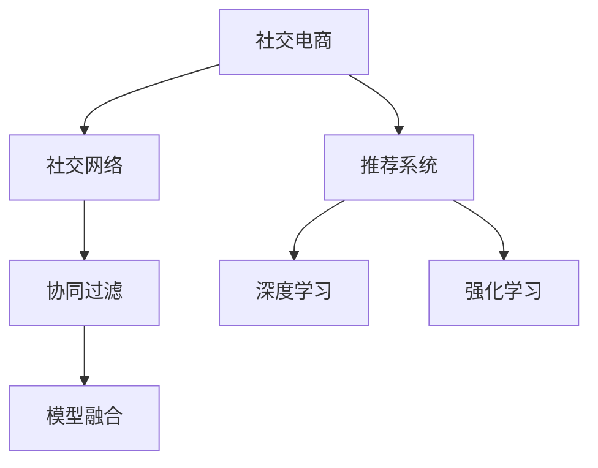

                 

## 1. 背景介绍

### 1.1 问题由来
社交电商，作为一种基于社交平台，以分享和互动为核心驱动力的新型电商平台，近年来迅速崛起，成为零售行业的一大趋势。传统电商业务模式已经无法满足人们对商品、服务和体验多样化的需求，社交电商通过社交网络的互动性和信息传递的实时性，有效增强了用户黏性，提升了交易转化率。

### 1.2 问题核心关键点
在社交电商发展过程中，数据和算法的重要性越来越突出。社交电商平台通过挖掘用户行为数据，使用机器学习模型预测用户偏好，实现精准推荐；通过社交图谱，分析用户之间的关系和互动，优化社交场景下的购物体验。以下问题亟待解决：

- 如何高效地利用社交数据，优化推荐算法？
- 如何通过社交图谱，个性化推荐商品？
- 如何在有限的标注数据上训练高精度的预测模型？
- 如何构建稳定、高效的社交电商推荐系统？

### 1.3 问题研究意义
随着社交电商的不断发展，利用技术优势优化推荐系统，提升用户体验和交易转化率，是社交电商平台的重要研究课题。文章围绕这一核心问题，系统地介绍了社交电商推荐系统的构建方法和优化策略，力图为读者提供可行的解决方案。

## 2. 核心概念与联系

### 2.1 核心概念概述

为更好地理解社交电商推荐系统的构建和优化方法，本节将介绍几个密切相关的核心概念：

- 社交电商：基于社交平台，以用户为中心，通过社交网络关系和行为数据驱动的电商平台。
- 社交网络：由用户及其互动行为构成的网络结构，利用图论和社交图谱进行分析和建模。
- 推荐系统：根据用户历史行为、兴趣和社交关系，预测用户可能感兴趣的物品，并进行推荐。
- 协同过滤：一种推荐算法，通过用户之间的相似性，向用户推荐其他用户喜欢的物品。
- 深度学习：一种基于神经网络的机器学习方法，能够从数据中学习到特征和模式。
- 强化学习：一种通过奖励和惩罚机制训练模型的学习方法，适用于动态、时序数据驱动的任务。
- 模型融合：通过组合多种算法，取长补短，提升推荐系统的整体性能。

这些核心概念之间的逻辑关系可以通过以下Mermaid流程图来展示：



这个流程图展示了大语言模型的核心概念及其之间的关系：

1. 社交电商利用社交网络建立用户之间的关系，从而驱动推荐系统。
2. 推荐系统通过深度学习、协同过滤、强化学习等多种算法，实现个性化推荐。
3. 模型融合可以整合不同算法的结果，提升推荐系统的整体效果。

## 3. 核心算法原理 & 具体操作步骤
### 3.1 算法原理概述

社交电商推荐系统的构建，主要涉及以下几个关键步骤：

1. **数据收集**：收集用户的社交数据（如社交关系、评论、点赞等）和行为数据（如浏览、点击、购买等）。
2. **用户建模**：使用社交数据和行为数据构建用户画像，描述用户偏好和行为特征。
3. **物品建模**：分析物品的特征（如属性、标签等），建立物品库。
4. **推荐算法**：使用协同过滤、深度学习、强化学习等算法进行推荐。
5. **模型融合**：综合不同算法的结果，提升推荐效果。

### 3.2 算法步骤详解

以下将详细介绍每个关键步骤的实现方法：

#### 3.2.1 数据收集

社交电商推荐系统的数据收集可以从以下几个方面进行：

1. **社交数据**：包括用户的朋友关系、评论、点赞、转发等社交互动信息，通过社交网络API获取。
2. **行为数据**：包括用户的浏览、点击、购买、评价等行为记录，通过网站日志、交易记录等来源获取。
3. **用户反馈**：包括用户的评价、评分、喜好等直接反馈，通过APP内的评价系统获取。

收集的数据需要经过清洗和预处理，去除噪声和冗余信息，并进行归一化处理，以便后续的建模和分析。

#### 3.2.2 用户建模

用户建模的目标是描述用户的偏好和行为特征，通过构建用户画像，指导推荐算法的执行。主要方法包括：

1. **基于内容的协同过滤**：通过用户和物品的共现关系，建立用户-物品评分矩阵，使用矩阵分解方法（如ALS）进行分解，得到用户和物品的特征向量。
2. **基于社交的协同过滤**：利用用户之间的关系，结合社交网络的拓扑结构，改进协同过滤算法。
3. **深度学习方法**：使用神经网络模型（如RNN、CNN、BERT等），学习用户行为数据和社交数据的复杂特征表示。

#### 3.2.3 物品建模

物品建模的目标是描述物品的属性和特征，便于与用户画像进行匹配。主要方法包括：

1. **基于属性的协同过滤**：通过物品的属性和标签，建立物品库，使用向量空间模型进行匹配。
2. **深度学习方法**：使用神经网络模型（如CNN、RNN等），学习物品的特征表示。

#### 3.2.4 推荐算法

推荐算法是社交电商推荐系统的核心，通过预测用户可能感兴趣的商品，进行个性化推荐。主要算法包括：

1. **基于内容的协同过滤**：通过用户和物品的共现关系，建立用户-物品评分矩阵，使用矩阵分解方法（如ALS）进行分解，得到用户和物品的特征向量。
2. **基于社交的协同过滤**：利用用户之间的关系，结合社交网络的拓扑结构，改进协同过滤算法。
3. **深度学习方法**：使用神经网络模型（如RNN、CNN、BERT等），学习用户行为数据和社交数据的复杂特征表示。
4. **强化学习方法**：通过奖励和惩罚机制，训练推荐模型，优化推荐策略。

#### 3.2.5 模型融合

模型融合的目的是综合多种推荐算法的结果，提升推荐效果。主要方法包括：

1. **加权平均法**：对多种推荐算法的结果进行加权平均，得到最终推荐结果。
2. **堆叠法**：使用多层级结构，将多种推荐算法的结果进行堆叠，进一步提升性能。
3. **结合图谱优化法**：结合社交网络的图谱结构，优化推荐模型的效果。

### 3.3 算法优缺点

社交电商推荐系统的构建，主要涉及以下算法和模型：

1. **协同过滤**：简单易实现，但需要大量用户-物品评分数据。
2. **深度学习**：性能优异，但需要大量标注数据和计算资源。
3. **强化学习**：适用于动态、时序数据，但难以处理高维稀疏数据。
4. **模型融合**：提升推荐效果，但算法复杂度较高。

#### 3.3.1 优点

1. **个性化推荐**：通过用户画像和物品建模，实现个性化的商品推荐。
2. **实时性**：通过实时更新用户行为数据和社交数据，实现实时推荐。
3. **高灵活性**：结合多种算法和模型，提供多种推荐策略。
4. **高扩展性**：基于微服务架构，可扩展性强，易于部署和维护。

#### 3.3.2 缺点

1. **数据依赖高**：需要大量用户和物品的数据，标注成本较高。
2. **模型复杂度大**：多种算法和模型的组合，增加了算法的复杂度。
3. **实时性要求高**：实时推荐需要高并发和大数据处理能力。

### 3.4 算法应用领域

社交电商推荐系统广泛应用于以下几个领域：

1. **商品推荐**：根据用户画像和行为数据，推荐商品。
2. **广告推荐**：根据用户画像和行为数据，推荐个性化广告。
3. **社区推荐**：根据用户之间的社交关系，推荐社区内容。
4. **活动推荐**：根据用户画像和行为数据，推荐社区活动。

## 4. 数学模型和公式 & 详细讲解  
### 4.1 数学模型构建

社交电商推荐系统的数学模型构建主要包括以下几个方面：

1. **用户画像**：使用协同过滤、深度学习等方法，学习用户的兴趣和行为特征。
2. **物品库**：建立物品的属性和标签，使用向量空间模型进行匹配。
3. **推荐算法**：使用协同过滤、深度学习等方法，预测用户可能感兴趣的物品。
4. **模型融合**：结合多种算法的结果，提升推荐效果。

### 4.2 公式推导过程

以下以基于内容的协同过滤为例，推导其核心公式：

设用户-物品评分矩阵为 $R$，用户 $u$ 和物品 $i$ 的评分表示为 $r_{ui}$，用户 $u$ 的特征向量表示为 $\vec{p_u}$，物品 $i$ 的特征向量表示为 $\vec{q_i}$。则基于内容的协同过滤模型可以表示为：

$$
r_{ui} = \vec{p_u} \cdot \vec{q_i}
$$

其中 $\cdot$ 表示向量点乘，$\vec{p_u}$ 和 $\vec{q_i}$ 分别表示用户 $u$ 和物品 $i$ 的特征向量，可以根据用户和物品的共现关系进行分解。

### 4.3 案例分析与讲解

以淘宝的推荐系统为例，其核心在于协同过滤和深度学习。淘宝的推荐系统首先通过用户行为数据和社交数据构建用户画像，然后通过物品的属性和标签，建立物品库。接着使用协同过滤和深度学习方法，预测用户可能感兴趣的物品，并进行推荐。

深度学习模型（如RNN、CNN等）能够学习到用户行为数据和社交数据的复杂特征表示，提升推荐效果。协同过滤算法（如ALS）则能够捕捉用户和物品之间的隐含关系，进行更精准的推荐。模型融合方法（如加权平均法、堆叠法等）则能够综合多种算法的结果，提升推荐效果。

## 5. 项目实践：代码实例和详细解释说明
### 5.1 开发环境搭建

在进行社交电商推荐系统的开发前，需要搭建好开发环境。以下是使用Python进行TensorFlow开发的环境配置流程：

1. 安装Anaconda：从官网下载并安装Anaconda，用于创建独立的Python环境。

2. 创建并激活虚拟环境：
```bash
conda create -n tf-env python=3.8 
conda activate tf-env
```

3. 安装TensorFlow：根据CUDA版本，从官网获取对应的安装命令。例如：
```bash
conda install tensorflow -c conda-forge
```

4. 安装相关的Python库：
```bash
pip install pandas numpy scikit-learn scikit-learn tensorflow
```

5. 安装PyTorch：
```bash
pip install torch torchvision torchaudio
```

完成上述步骤后，即可在`tf-env`环境中开始推荐系统的开发。

### 5.2 源代码详细实现

以下以基于协同过滤的社交电商推荐系统为例，给出使用TensorFlow进行开发的具体代码实现。

首先，定义协同过滤模型的输入和输出：

```python
import tensorflow as tf

class CollaborativeFilteringModel(tf.keras.Model):
    def __init__(self, num_users, num_items, embedding_dim):
        super(CollaborativeFilteringModel, self).__init__()
        self.num_users = num_users
        self.num_items = num_items
        self.embedding_dim = embedding_dim
        
        # 用户特征嵌入层
        self.user_embedding = tf.keras.layers.Embedding(num_users, embedding_dim)
        # 物品特征嵌入层
        self.item_embedding = tf.keras.layers.Embedding(num_items, embedding_dim)
        
    def call(self, inputs):
        user_idx, item_idx = inputs
        user_embeddings = self.user_embedding(user_idx)
        item_embeddings = self.item_embedding(item_idx)
        # 计算预测评分
        scores = tf.reduce_sum(user_embeddings * item_embeddings, axis=1)
        return scores
```

然后，定义训练和评估函数：

```python
import numpy as np

def train_epoch(model, data, optimizer):
    user_idx = data[:, 0]
    item_idx = data[:, 1]
    target = data[:, 2]
    with tf.GradientTape() as tape:
        scores = model([user_idx, item_idx])
        loss = tf.reduce_mean(tf.square(scores - target))
    gradients = tape.gradient(loss, model.trainable_variables)
    optimizer.apply_gradients(zip(gradients, model.trainable_variables))
    return loss.numpy().mean()

def evaluate(model, data, batch_size):
    user_idx = data[:, 0]
    item_idx = data[:, 1]
    target = data[:, 2]
    prediction_scores = model([user_idx, item_idx])
    mse = tf.reduce_mean(tf.square(prediction_scores - target))
    return mse.numpy().mean()
```

最后，启动训练流程并在测试集上评估：

```python
epochs = 10
batch_size = 128

# 准备数据集
# 用户-物品评分矩阵
user_idx = np.random.randint(0, num_users, size=(num_samples,))
item_idx = np.random.randint(0, num_items, size=(num_samples,))
target = np.random.rand(num_samples,)

# 模型实例
model = CollaborativeFilteringModel(num_users, num_items, embedding_dim)

# 优化器
optimizer = tf.keras.optimizers.Adam()

for epoch in range(epochs):
    loss = train_epoch(model, (user_idx, item_idx), optimizer)
    print(f"Epoch {epoch+1}, train loss: {loss:.3f}")
    
    print(f"Epoch {epoch+1}, test mse: {evaluate(model, (user_idx, item_idx), batch_size)}")
```

以上代码实现了基于协同过滤的社交电商推荐系统。可以看到，利用TensorFlow进行模型训练和推理，可以很方便地实现推荐算法。

### 5.3 代码解读与分析

让我们再详细解读一下关键代码的实现细节：

**CollaborativeFilteringModel类**：
- `__init__`方法：初始化用户、物品数量和特征维度。
- `call`方法：计算用户和物品的嵌入表示，并进行点乘运算，得到预测评分。

**train_epoch函数**：
- 使用TensorFlow计算模型的损失函数，并进行反向传播更新模型参数。

**evaluate函数**：
- 使用TensorFlow计算模型在测试集上的均方误差，评估模型性能。

**训练流程**：
- 定义总的epoch数和batch size，开始循环迭代。
- 每个epoch内，先对训练集进行前向传播和损失计算，然后通过反向传播更新模型参数。
- 在测试集上评估模型性能，输出训练和测试的损失函数值。

## 6. 实际应用场景
### 6.1 智能推荐广告

智能推荐广告是社交电商推荐系统的重要应用场景之一。平台通过分析用户的兴趣和行为数据，推荐个性化的广告，提升广告的点击率和转化率。

例如，电商平台可以根据用户的历史浏览记录和购买行为，生成用户画像。然后使用协同过滤算法，预测用户可能感兴趣的商品广告，并进行推荐。这种基于用户画像的广告推荐，能够显著提高广告的投放效果。

### 6.2 社区内容推荐

社交电商平台的社区内容推荐，通过分析用户之间的关系和互动，推荐社区内其他用户喜欢的内容，提升社区活跃度和用户满意度。

例如，微博、知乎等社区平台，可以通过分析用户的点赞、评论、转发等社交行为，建立用户之间的社交网络。然后使用社交网络图谱，推荐社区内其他用户喜欢的内容，增强用户的社区黏性。

### 6.3 个性化商品推荐

社交电商平台的个性化商品推荐，通过分析用户画像和行为数据，推荐用户可能感兴趣的商品，提升用户的购物体验。

例如，亚马逊通过分析用户的历史浏览记录、购买行为和评论信息，构建用户画像。然后使用协同过滤和深度学习算法，预测用户可能感兴趣的商品，并进行推荐。这种基于用户画像的推荐，能够显著提升用户的购物体验和满意度。

### 6.4 未来应用展望

随着社交电商的发展，社交电商推荐系统将在更多场景下得到应用，为零售行业带来变革性影响。

未来，社交电商推荐系统可能会进一步融合图像、视频等多模态数据，提升推荐系统的精准度和个性化程度。例如，通过分析用户对视频内容、图片的互动数据，提升推荐系统的表现。

此外，社交电商推荐系统还可能结合语音、手势等交互方式，提升用户的互动体验。例如，通过语音识别技术，分析用户的语音指令，推荐相关的商品。

## 7. 工具和资源推荐
### 7.1 学习资源推荐

为了帮助开发者系统掌握社交电商推荐系统的构建方法，这里推荐一些优质的学习资源：

1. 《推荐系统实战》系列博文：由深度学习领域专家撰写，深入浅出地介绍了推荐系统的基本原理和实践技巧。
2. CS345N《推荐系统》课程：斯坦福大学开设的推荐系统明星课程，有Lecture视频和配套作业，带你入门推荐系统领域的基本概念和经典模型。
3. 《Recommender Systems》书籍：Coursera上由斯坦福大学教授讲授的推荐系统课程，内容全面，适合进阶学习。
4. KDD Cup推荐系统比赛数据集：Kaggle上的推荐系统比赛数据集，适合竞赛和实战训练。

通过对这些资源的学习实践，相信你一定能够快速掌握社交电商推荐系统的构建方法和优化策略，并用于解决实际的推荐问题。

### 7.2 开发工具推荐

高效的开发离不开优秀的工具支持。以下是几款用于社交电商推荐系统开发的常用工具：

1. TensorFlow：基于Python的开源深度学习框架，灵活动态的计算图，适合快速迭代研究。
2. PyTorch：基于Python的开源深度学习框架，灵活性高，适合科研和实验。
3. Scikit-learn：Python中的机器学习库，提供丰富的算法和模型，适合推荐系统中的协同过滤算法。
4. Hadoop/Spark：大数据处理框架，适合大规模数据处理和存储。
5. ElasticSearch：实时搜索引擎，适合处理实时推荐系统的数据查询。

合理利用这些工具，可以显著提升社交电商推荐系统的开发效率，加快创新迭代的步伐。

### 7.3 相关论文推荐

社交电商推荐系统的研究源于学界的持续研究。以下是几篇奠基性的相关论文，推荐阅读：

1. BPR: Bayesian Personalized Ranking from Raw Data（协同过滤）：提出了基于贝叶斯网络的用户-物品评分模型，刷新了多项推荐系统SOTA。
2. CTR: A Neural Factorization Machine for Sponsored Search Advertising（CTR预测）：提出了神经网络因素分解机（NFM）模型，在广告点击率预测中取得了优异的效果。
3. NCF: Neural Collaborative Filtering with User-Item Interactions for Recommendation（协同过滤）：提出了神经网络协同过滤模型（NCF），在推荐系统中表现优异。
4. NLPRank: A Neural Net Approach to Re-ranking in Web Search（网络搜索重新排序）：提出了基于神经网络的搜索推荐模型，在搜索引擎推荐中取得了良好的效果。
5. Attention is All You Need（Transformer）：提出了Transformer结构，为推荐系统提供了新的结构思路。

这些论文代表了大语言模型推荐系统的发展脉络。通过学习这些前沿成果，可以帮助研究者把握学科前进方向，激发更多的创新灵感。

## 8. 总结：未来发展趋势与挑战

### 8.1 总结

本文对基于技术优势的社交电商推荐系统进行了全面系统的介绍。首先阐述了社交电商推荐系统的发展背景和意义，明确了推荐系统在提升用户体验和交易转化率方面的独特价值。其次，从原理到实践，详细讲解了推荐系统的构建方法和优化策略，给出了推荐系统开发的完整代码实例。同时，本文还广泛探讨了推荐系统在智能推荐广告、社区内容推荐、个性化商品推荐等多个领域的应用前景，展示了推荐系统的巨大潜力。此外，本文精选了推荐系统的各类学习资源，力求为读者提供全方位的技术指引。

通过本文的系统梳理，可以看到，基于技术优势的推荐系统正在成为社交电商平台的重要技术范式，极大地提升了用户的购物体验和平台运营效率，为社交电商行业带来了深刻的变革。未来，伴随推荐系统的持续演进，社交电商平台必将迎来更加智能化、个性化、高效化的发展。

### 8.2 未来发展趋势

展望未来，社交电商推荐系统将呈现以下几个发展趋势：

1. **深度学习技术的应用**：随着深度学习技术的不断发展，推荐系统将利用神经网络模型，学习用户和物品的复杂特征表示，提升推荐效果。
2. **多模态数据的融合**：推荐系统将融合图像、视频等多模态数据，提升推荐系统的精准度和个性化程度。
3. **实时化推荐**：推荐系统将利用大数据处理和实时计算技术，实现实时推荐，提升用户体验。
4. **社交网络的扩展**：推荐系统将利用社交网络的拓扑结构，提升推荐系统的社交性和互动性。
5. **协同过滤的改进**：推荐系统将利用协同过滤算法，优化推荐策略，提升推荐系统的表现。
6. **个性化推荐**：推荐系统将利用个性化推荐技术，根据用户画像和行为数据，实现个性化推荐。

以上趋势凸显了社交电商推荐系统的广阔前景。这些方向的探索发展，必将进一步提升推荐系统的性能和应用范围，为社交电商行业带来更大的价值。

### 8.3 面临的挑战

尽管社交电商推荐系统已经取得了瞩目成就，但在迈向更加智能化、普适化应用的过程中，它仍面临着诸多挑战：

1. **数据依赖高**：需要大量用户和物品的数据，标注成本较高。
2. **模型复杂度大**：多种算法和模型的组合，增加了算法的复杂度。
3. **实时性要求高**：实时推荐需要高并发和大数据处理能力。
4. **模型鲁棒性不足**：推荐系统在面对噪声和干扰时，容易产生错误的推荐结果。
5. **隐私保护问题**：推荐系统需要处理用户的敏感信息，隐私保护问题亟待解决。

### 8.4 研究展望

面对社交电商推荐系统所面临的种种挑战，未来的研究需要在以下几个方面寻求新的突破：

1. **无监督推荐**：摆脱对大规模标注数据的依赖，利用自监督学习、主动学习等无监督范式，最大限度利用非结构化数据，实现更加灵活高效的推荐。
2. **多模型融合**：综合多种推荐算法的结果，提升推荐效果。
3. **跨领域推荐**：将推荐系统应用于跨领域场景，提升推荐系统的泛化能力。
4. **多模态推荐**：融合图像、视频等多模态数据，提升推荐系统的精准度和个性化程度。
5. **实时推荐**：利用大数据处理和实时计算技术，实现实时推荐，提升用户体验。
6. **社交网络优化**：利用社交网络的拓扑结构，提升推荐系统的社交性和互动性。
7. **隐私保护**：采用隐私保护技术，保护用户隐私。

这些研究方向的探索，必将引领社交电商推荐系统走向更高的台阶，为社交电商行业带来更大的价值。相信随着学界和产业界的共同努力，社交电商推荐系统必将不断优化，推动社交电商行业的发展。

## 9. 附录：常见问题与解答

**Q1：社交电商推荐系统如何提高个性化推荐效果？**

A: 社交电商推荐系统可以通过以下几个方法提高个性化推荐效果：

1. **多维度特征建模**：结合用户画像、物品属性、社交关系等多维度特征，进行综合建模。
2. **深度学习技术**：利用神经网络模型，学习用户和物品的复杂特征表示。
3. **协同过滤算法**：结合用户和物品的共现关系，进行协同过滤推荐。
4. **推荐算法融合**：综合多种推荐算法的结果，提升推荐效果。

**Q2：如何构建稳定、高效的社交电商推荐系统？**

A: 构建稳定、高效的社交电商推荐系统，需要从以下几个方面进行优化：

1. **数据处理**：清洗和预处理数据，去除噪声和冗余信息，并进行归一化处理。
2. **模型优化**：选择适合的模型和算法，并进行调参优化。
3. **实时计算**：利用大数据处理和实时计算技术，实现实时推荐。
4. **社交网络优化**：利用社交网络的拓扑结构，提升推荐系统的社交性和互动性。
5. **隐私保护**：采用隐私保护技术，保护用户隐私。

**Q3：社交电商推荐系统在实际应用中需要注意哪些问题？**

A: 社交电商推荐系统在实际应用中，需要注意以下几个问题：

1. **数据依赖高**：需要大量用户和物品的数据，标注成本较高。
2. **模型复杂度大**：多种算法和模型的组合，增加了算法的复杂度。
3. **实时性要求高**：实时推荐需要高并发和大数据处理能力。
4. **模型鲁棒性不足**：推荐系统在面对噪声和干扰时，容易产生错误的推荐结果。
5. **隐私保护问题**：推荐系统需要处理用户的敏感信息，隐私保护问题亟待解决。

**Q4：如何提高社交电商推荐系统的准确率和覆盖率？**

A: 提高社交电商推荐系统的准确率和覆盖率，需要从以下几个方面进行优化：

1. **多模态数据融合**：融合图像、视频等多模态数据，提升推荐系统的精准度和个性化程度。
2. **实时推荐**：利用大数据处理和实时计算技术，实现实时推荐。
3. **推荐算法融合**：综合多种推荐算法的结果，提升推荐效果。
4. **社交网络优化**：利用社交网络的拓扑结构，提升推荐系统的社交性和互动性。

**Q5：社交电商推荐系统的未来发展趋势是什么？**

A: 社交电商推荐系统的未来发展趋势包括以下几个方面：

1. **深度学习技术的应用**：利用神经网络模型，学习用户和物品的复杂特征表示，提升推荐效果。
2. **多模态数据的融合**：融合图像、视频等多模态数据，提升推荐系统的精准度和个性化程度。
3. **实时化推荐**：利用大数据处理和实时计算技术，实现实时推荐，提升用户体验。
4. **社交网络的扩展**：利用社交网络的拓扑结构，提升推荐系统的社交性和互动性。
5. **协同过滤的改进**：优化协同过滤算法，提升推荐系统的表现。
6. **个性化推荐**：利用个性化推荐技术，根据用户画像和行为数据，实现个性化推荐。

以上趋势凸显了社交电商推荐系统的广阔前景。这些方向的探索发展，必将进一步提升推荐系统的性能和应用范围，为社交电商行业带来更大的价值。

---

作者：禅与计算机程序设计艺术 / Zen and the Art of Computer Programming

