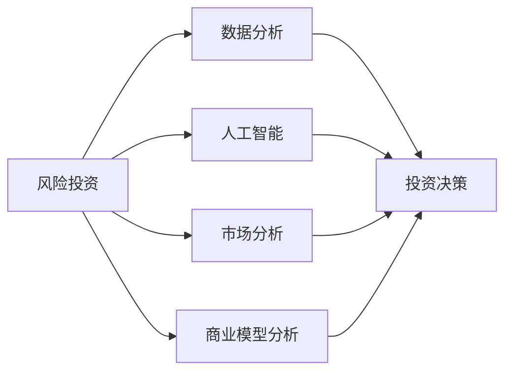

                 

# 利用技术洞察力进行风险投资

> 关键词：风险投资, 技术洞察力, 数据分析, 人工智能, 投资决策, 金融科技, 大数据, 市场分析

## 1. 背景介绍

在当今高速发展的数字化时代，技术洞察力已成为驱动创新和增长的核心驱动力之一。特别是对于风险投资(Venture Capital, VC)领域而言，如何利用技术洞察力做出明智的投资决策，直接关系到投资的成败与否。风险投资的本质是识别和投资于具有高增长潜力的初创企业，但传统上依赖个人经验和直觉的方法已经逐渐显得不足，难以应对复杂多变的市场环境。

风险投资的关键在于评估企业的商业模型、产品创新性和市场潜力，但这些评估需要大量的数据和分析工作，传统手工方式难以胜任。技术洞察力的引入，即通过先进的数据分析和人工智能(AI)技术，对企业数据进行深入挖掘和分析，可以显著提升风险投资的专业化水平和决策准确性。

本文章将详细探讨如何利用技术洞察力进行风险投资，从核心概念、算法原理、具体步骤、应用领域等多个维度进行深入解析，并结合实际案例进行讲解。通过这篇文章，读者将能够理解技术洞察力在风险投资中的重要性，学习如何使用数据分析、机器学习等技术进行投资决策。

## 2. 核心概念与联系

### 2.1 核心概念概述

本节将介绍几个在风险投资中涉及到的核心概念，帮助读者理解技术洞察力的具体应用。

- **风险投资 (Venture Capital, VC)**：通过提供初创企业资金支持，以换取企业股权的一种投资方式。风险投资侧重于高增长潜力企业的早期投资。
- **技术洞察力 (Technological Insight)**：利用先进的数据分析、人工智能等技术手段，对企业数据进行深度挖掘和分析，获得对企业价值和增长潜力的深入理解。
- **数据分析 (Data Analysis)**：通过对企业运营数据、市场数据、财务数据等进行分析，提取有价值的信息，支持投资决策。
- **人工智能 (Artificial Intelligence, AI)**：使用机器学习、深度学习等技术，对大量数据进行自动化分析和预测，提升决策效率和准确性。
- **市场分析 (Market Analysis)**：分析市场趋势、竞争环境、消费者行为等，评估企业市场潜力和竞争优势。
- **商业模型分析 (Business Model Analysis)**：通过分析企业的商业模式、收入模式、客户群体等，评估其可行性和增长潜力。

这些核心概念相互联系，共同构成了风险投资技术洞察力的基础。通过合理运用数据分析和AI技术，风险投资者可以更好地评估企业的价值和潜力，做出更加科学的投资决策。

### 2.2 核心概念原理和架构的 Mermaid 流程图(Mermaid 流程节点中不要有括号、逗号等特殊字符)



通过以上流程，可以清晰地看到技术洞察力在风险投资中的应用路径：风险投资通过数据分析、人工智能、市场分析和商业模型分析等技术手段，获得对企业的深入理解，进而做出科学合理的投资决策。

## 3. 核心算法原理 & 具体操作步骤

### 3.1 算法原理概述

基于技术洞察力的风险投资，核心算法原理主要基于数据分析和人工智能技术，通过多维度数据挖掘和分析，提取企业关键特征和增长潜力，评估投资价值。

核心算法包括但不限于：

- **回归分析 (Regression Analysis)**：通过回归模型分析企业的财务数据和业务指标，预测未来增长趋势。
- **分类算法 (Classification Algorithms)**：利用分类模型，识别企业所处的市场阶段和竞争环境，评估其市场潜力。
- **聚类算法 (Clustering Algorithms)**：对企业运营数据进行聚类分析，发现潜在增长点。
- **预测模型 (Prediction Models)**：利用时间序列分析和深度学习模型，预测企业未来的收入和市场份额。

这些算法结合使用，可以全面、深入地分析企业数据，提取有价值的洞察信息，支持投资决策。

### 3.2 算法步骤详解

基于技术洞察力的风险投资算法步骤主要包括以下几个关键环节：

**Step 1: 数据收集与清洗**
- 收集企业运营数据、市场数据、财务数据等，确保数据的多样性和全面性。
- 对数据进行清洗和预处理，去除噪音和异常值，确保数据质量。

**Step 2: 特征提取**
- 对收集到的数据进行特征提取，选择合适的指标和特征变量，如财务指标、市场份额、用户增长率等。
- 利用统计分析和机器学习算法，自动提取和筛选关键特征。

**Step 3: 模型训练与评估**
- 使用回归、分类、聚类、预测等算法对数据进行建模。
- 在训练集上训练模型，并进行交叉验证，评估模型性能。
- 利用测试集验证模型泛化能力，调整参数和模型结构。

**Step 4: 投资决策**
- 根据模型预测结果，结合专家知识和市场分析，评估企业的投资价值。
- 识别高增长潜力企业，制定投资策略和计划。
- 动态监控企业运营数据，调整投资策略。

### 3.3 算法优缺点

利用技术洞察力的风险投资算法具有以下优点：

- **数据驱动决策**：通过数据和模型进行决策，避免了传统主观判断带来的误差。
- **多维度分析**：综合考虑财务、市场、运营等多维度数据，全面评估企业价值。
- **高效性**：利用自动化分析工具，快速处理大量数据，提升投资决策效率。

同时，该算法也存在一定的局限性：

- **数据获取难度**：获取高质量、全面性的企业数据可能面临挑战。
- **模型复杂性**：模型构建和调整需要专业知识，对数据科学家和投资专家有较高要求。
- **解释性不足**：复杂模型和算法结果可能缺乏可解释性，难以向非技术背景的管理层解释。
- **市场变化风险**：市场环境快速变化，模型预测可能面临一定的滞后性。

### 3.4 算法应用领域

基于技术洞察力的风险投资算法广泛应用于以下领域：

- **早期投资**：帮助投资者识别具有高增长潜力的初创企业。
- **并购投资**：评估目标企业的价值和风险，支持并购决策。
- **退出策略**：分析企业的发展趋势和市场前景，制定合理的退出时机。
- **风险管理**：识别潜在风险和不确定性，制定风险应对策略。

这些应用领域展示了技术洞察力在风险投资中的广泛适用性，有助于投资者在复杂多变的环境中做出更加明智的投资决策。

## 4. 数学模型和公式 & 详细讲解 & 举例说明（备注：数学公式请使用latex格式，latex嵌入文中独立段落使用 $$，段落内使用 $)

### 4.1 数学模型构建

基于技术洞察力的风险投资模型主要基于以下数学模型：

- **线性回归模型 (Linear Regression Model)**：
$$
y = \beta_0 + \beta_1 x_1 + \beta_2 x_2 + ... + \beta_n x_n + \epsilon
$$
其中 $y$ 表示预测值，$x_1, x_2, ..., x_n$ 表示输入特征，$\beta_0, \beta_1, ..., \beta_n$ 表示模型参数，$\epsilon$ 表示随机误差。

- **逻辑回归模型 (Logistic Regression Model)**：
$$
\text{logit}(p) = \beta_0 + \beta_1 x_1 + \beta_2 x_2 + ... + \beta_n x_n
$$
$$
p = \frac{1}{1 + e^{-\text{logit}(p)}}
$$
其中 $p$ 表示类别概率，$\text{logit}(p)$ 表示线性预测值，$\beta_0, \beta_1, ..., \beta_n$ 表示模型参数。

- **聚类算法 (Clustering Algorithm)**：
$$
C_k = \{ x_i | x_i \in D, x_i \in \{ C_j \}, \text{dist}(x_i, x_j) < \delta \}
$$
其中 $C_k$ 表示第 $k$ 个聚类，$x_i, x_j$ 表示数据点，$\delta$ 表示聚类半径。

### 4.2 公式推导过程

以线性回归模型为例，推导其基本公式和参数求解方法。

根据最小二乘法，线性回归模型的目标是最小化预测误差平方和：
$$
\min_{\beta_0, \beta_1, ..., \beta_n} \sum_{i=1}^N (y_i - (\beta_0 + \beta_1 x_{1i} + ... + \beta_n x_{ni}))^2
$$
求导并令导数为0，得到参数估计公式：
$$
\beta_j = \frac{\sum_{i=1}^N (x_{ji} - \bar{x}_{ji})(y_i - \bar{y})}{\sum_{i=1}^N (x_{ji} - \bar{x}_{ji})^2}
$$
其中 $\bar{x}_{ji} = \frac{1}{N} \sum_{i=1}^N x_{ji}$ 和 $\bar{y} = \frac{1}{N} \sum_{i=1}^N y_i$。

### 4.3 案例分析与讲解

假设我们有一家初创企业，需要评估其未来的收入增长潜力。收集了该企业过去5年的收入数据和市场份额数据，构建线性回归模型进行预测：

$$
\hat{y} = 2000 + 0.1x_1 + 0.2x_2 + \epsilon
$$
其中 $x_1$ 表示市场份额，$x_2$ 表示广告支出，$y$ 表示年收入。根据模型预测，下一年该企业的年收入将达到2000万美元。

利用逻辑回归模型，对企业是否成功进行二分类预测：

$$
\text{logit}(p) = \beta_0 + \beta_1 x_1 + \beta_2 x_2 + \epsilon
$$
$$
p = \frac{1}{1 + e^{-\text{logit}(p)}}
$$
其中 $x_1$ 表示市场份额，$x_2$ 表示研发投入，$y$ 表示二分类标签。

## 5. 项目实践：代码实例和详细解释说明

### 5.1 开发环境搭建

在进行技术洞察力在风险投资中的应用实践前，需要准备好开发环境。以下是使用Python进行数据分析和机器学习开发的环境配置流程：

1. 安装Anaconda：从官网下载并安装Anaconda，用于创建独立的Python环境。

2. 创建并激活虚拟环境：
```bash
conda create -n finance-env python=3.8 
conda activate finance-env
```

3. 安装必要的库：
```bash
conda install pandas numpy matplotlib scikit-learn seaborn statsmodels
```

4. 安装机器学习库：
```bash
pip install scikit-learn
```

5. 安装可视化库：
```bash
pip install matplotlib seaborn
```

完成上述步骤后，即可在`finance-env`环境中开始数据分析和机器学习实践。

### 5.2 源代码详细实现

下面我们以评估一家初创企业的未来收入增长潜力为例，给出使用Python和Scikit-learn库构建线性回归模型的代码实现。

```python
import pandas as pd
import numpy as np
from sklearn.linear_model import LinearRegression
from sklearn.metrics import mean_squared_error, r2_score

# 加载数据
data = pd.read_csv('income_data.csv')
X = data[['market_share', 'ad_spending']]
y = data['income']

# 构建模型
model = LinearRegression()
model.fit(X, y)

# 预测未来收入
future_spending = np.array([[0.5, 200000]])
future_income = model.predict(future_spending)
print(f"预测未来收入为：{future_income}")

# 计算模型性能
y_pred = model.predict(X)
mse = mean_squared_error(y, y_pred)
r2 = r2_score(y, y_pred)
print(f"均方误差为：{mse}, R^2为：{r2}")
```

### 5.3 代码解读与分析

让我们再详细解读一下关键代码的实现细节：

**数据加载与预处理**：
- 使用Pandas库读取CSV格式的数据集，并将其转换为NumPy数组。

**模型构建与训练**：
- 使用Scikit-learn库中的`LinearRegression`类构建线性回归模型。
- 使用`fit`方法对模型进行训练，传入特征矩阵`X`和目标向量`y`。

**预测与评估**：
- 使用`predict`方法对未来市场份额和广告支出的组合进行预测。
- 使用`mean_squared_error`和`r2_score`方法评估模型的预测误差和拟合程度。

通过上述代码，读者可以看到利用Python进行数据分析和机器学习的简单流程，无需编写复杂的算法逻辑，便可快速获得预测结果和模型性能评估。

## 6. 实际应用场景

### 6.1 早期投资

早期投资是风险投资中的重要环节，通过技术洞察力可以更准确地评估初创企业的潜力。例如，某家初创企业正在研发一种新型电池技术，风险投资者可以通过分析历史数据，构建预测模型，评估其市场前景和收入潜力，从而决定是否投资。

**实际案例**：某初创企业开发了一种新型的太阳能电池技术，风险投资者通过收集其研发进度、市场份额、竞争对手数据等，构建逻辑回归模型，预测其成功概率和市场份额，支持投资决策。

### 6.2 并购投资

并购投资是风险投资的另一重要领域，通过技术洞察力可以评估目标企业的价值和风险。例如，某家风险投资公司在考虑并购一家智能家居企业，可以通过技术洞察力评估其市场地位、客户群体、财务状况等，制定合理的并购策略。

**实际案例**：某风险投资公司考虑并购一家智能家居企业，通过收集其市场份额、客户满意度、财务报表等数据，构建聚类算法，分析其细分市场和客户群体，制定并购价格和整合策略。

### 6.3 退出策略

退出策略是风险投资的最终环节，通过技术洞察力可以评估企业的退出时机和退出方式。例如，某家初创企业已经进入快速发展期，风险投资者可以通过技术洞察力评估其市场份额和收入增长趋势，制定合理的退出策略。

**实际案例**：某初创企业已经进入快速发展期，风险投资者通过收集其收入数据、市场份额数据等，构建时间序列预测模型，评估其未来的收入增长趋势，制定退出时机和方式。

### 6.4 风险管理

风险管理是风险投资中的重要环节，通过技术洞察力可以识别潜在风险和不确定性。例如，某家初创企业正在开发一种新药，风险投资者可以通过技术洞察力评估其研发进度、市场竞争、临床试验结果等，识别潜在风险，制定风险应对策略。

**实际案例**：某家初创企业正在开发一种新药，风险投资者通过收集其研发进度、市场竞争、临床试验数据等，构建回归分析模型，预测其研发进度和市场前景，识别潜在风险，制定风险应对策略。

## 7. 工具和资源推荐

### 7.1 学习资源推荐

为了帮助开发者系统掌握技术洞察力在风险投资中的应用，这里推荐一些优质的学习资源：

1. **《Python数据分析与可视化》**：全面介绍Python在数据分析和可视化中的应用，涵盖数据清洗、特征工程、模型训练等。

2. **《机器学习实战》**：通过实战项目介绍机器学习算法的实现和应用，包括回归分析、分类算法、聚类算法等。

3. **《风险投资实战指南》**：介绍风险投资的各个环节，涵盖投资决策、市场分析、风险管理等，结合技术洞察力的应用。

4. **Kaggle竞赛**：参加Kaggle数据科学竞赛，通过实际项目练习技术洞察力的应用。

5. **Coursera课程**：提供大量数据科学和机器学习的在线课程，帮助开发者提升技术能力。

通过学习这些资源，相信你一定能够系统掌握技术洞察力在风险投资中的应用，并用于解决实际的投资问题。

### 7.2 开发工具推荐

高效的开发离不开优秀的工具支持。以下是几款用于技术洞察力在风险投资中应用的常用工具：

1. **Jupyter Notebook**：Python的交互式笔记本环境，支持代码编写、数据可视化、模型训练等，方便开发者进行快速迭代和实验。

2. **Python 3.8**：Python的最新版本，包含丰富的数据科学和机器学习库，支持高效的数值计算和数据处理。

3. **Scikit-learn**：Python中最流行的机器学习库，包含多种算法实现和评估工具，方便开发者快速搭建和评估模型。

4. **NumPy**：Python的数值计算库，提供高效的数组操作和矩阵运算，支持大规模数据处理。

5. **Pandas**：Python的数据分析库，支持数据清洗、预处理、可视化等，方便开发者进行数据处理和分析。

合理利用这些工具，可以显著提升技术洞察力在风险投资中的应用效率，加快创新迭代的步伐。

### 7.3 相关论文推荐

技术洞察力在风险投资中的应用源于学界的持续研究。以下是几篇奠基性的相关论文，推荐阅读：

1. **《机器学习在金融中的应用》**：介绍机器学习在金融领域的应用，包括风险评估、信用评分、市场预测等。

2. **《基于数据驱动的风险投资决策模型》**：研究如何利用数据驱动的方法，进行风险投资决策和投资评估。

3. **《深度学习在创业投资中的应用》**：探讨深度学习在创业投资中的各种应用，包括市场分析、客户细分、风险预测等。

4. **《利用大数据进行风险投资》**：介绍大数据技术在风险投资中的应用，涵盖数据采集、数据清洗、模型训练等。

这些论文代表了大语言模型微调技术的发展脉络。通过学习这些前沿成果，可以帮助研究者把握学科前进方向，激发更多的创新灵感。

## 8. 总结：未来发展趋势与挑战

### 8.1 总结

本文对利用技术洞察力进行风险投资的方法进行了全面系统的介绍。首先阐述了技术洞察力在风险投资中的重要性，明确了数据分析和人工智能技术在投资决策中的关键作用。其次，从原理到实践，详细讲解了技术洞察力的数学模型和操作步骤，给出了代码实现实例。同时，本文还广泛探讨了技术洞察力在早期投资、并购投资、退出策略、风险管理等多个领域的应用前景，展示了技术洞察力在风险投资中的广阔前景。

通过本文的系统梳理，可以看到，技术洞察力在风险投资中的应用正成为风险投资中的重要范式，极大地提升了投资决策的科学性和准确性。未来，伴随数据分析和AI技术的持续演进，技术洞察力必将在风险投资中发挥更加重要的作用。

### 8.2 未来发展趋势

展望未来，技术洞察力在风险投资中的应用将呈现以下几个发展趋势：

1. **深度学习普及**：深度学习技术的发展，将带来更强大的预测能力和解释性，帮助投资者更好地理解企业数据。

2. **大数据融合**：结合大数据技术，实时监测和分析市场动态，提升投资决策的时效性。

3. **跨领域应用**：将技术洞察力应用于更多行业和领域，如医疗、环保、能源等，拓宽风险投资的应用范围。

4. **自动化决策**：引入自动化决策系统，提升投资决策的效率和准确性。

5. **多维度分析**：综合考虑财务、市场、运营、社会等多维度数据，进行全面评估。

以上趋势凸显了技术洞察力在风险投资中的广阔前景。这些方向的探索发展，必将进一步提升风险投资的专业化水平和决策准确性，为投资者带来更多的投资机会。

### 8.3 面临的挑战

尽管技术洞察力在风险投资中的应用已经取得了显著成效，但在迈向更加智能化、普适化应用的过程中，仍面临以下挑战：

1. **数据获取难度**：获取高质量、全面性的企业数据可能面临挑战，数据质量和完整性难以保证。

2. **模型复杂性**：复杂模型和算法结果可能缺乏可解释性，难以向非技术背景的管理层解释。

3. **市场变化风险**：市场环境快速变化，模型预测可能面临一定的滞后性。

4. **技术依赖性**：依赖技术手段进行投资决策，可能降低投资者的直觉和经验。

5. **伦理与安全**：数据隐私和安全问题可能对投资决策产生影响，需要严格的隐私保护措施。

这些挑战需要通过技术进步和跨领域合作，不断克服和优化。相信随着技术洞察力的不断发展和成熟，风险投资必将迎来更加智能化、高效化的新时代。

### 8.4 研究展望

面对技术洞察力在风险投资中面临的挑战，未来的研究需要在以下几个方面寻求新的突破：

1. **数据增强技术**：通过数据增强技术，提高数据质量和完整性，减少数据获取难度。

2. **模型可解释性**：研究可解释性更强的模型和算法，提升投资决策的可解释性。

3. **实时数据监测**：结合大数据技术，实时监测和分析市场动态，提升投资决策的时效性。

4. **自动化决策系统**：开发自动化决策系统，提升投资决策的效率和准确性。

5. **跨领域合作**：推动跨领域合作，将技术洞察力应用于更多行业和领域，拓展风险投资的应用范围。

6. **伦理与安全研究**：研究数据隐私和安全问题，制定严格的隐私保护措施。

这些研究方向将引领技术洞察力在风险投资中的应用不断深入，为投资者提供更加科学、高效的投资决策支持。面向未来，技术洞察力必将为风险投资带来更加智能化、普适化的新发展。

## 9. 附录：常见问题与解答

**Q1：技术洞察力是否适用于所有类型的风险投资？**

A: 技术洞察力适用于大部分类型的风险投资，特别是数据驱动和决策科学性强的领域。但对于一些高度依赖经验和直觉的投资环节，技术洞察力可能难以完全替代。因此，在实际应用中需要结合多种方法和工具，综合评估企业价值。

**Q2：如何选择合适的机器学习模型？**

A: 选择合适的机器学习模型需要考虑多个因素，如数据类型、问题类型、模型复杂度等。通常，线性回归、逻辑回归、决策树、随机森林、支持向量机等是常见的选择。建议先在小规模数据上验证模型效果，再进行大规模数据训练和验证。

**Q3：如何处理数据质量和缺失值？**

A: 数据质量和缺失值是数据处理中常见的问题。建议先进行数据清洗和预处理，去除噪音和异常值，补全缺失值。对于缺失值，可以使用均值填补、插值法、模型预测等方法进行处理。

**Q4：技术洞察力在风险投资中如何应用？**

A: 技术洞察力在风险投资中的应用包括数据收集与清洗、特征提取、模型训练与评估、投资决策等环节。通过数据驱动的方法，帮助投资者更准确地评估企业价值和增长潜力，做出科学合理的投资决策。

**Q5：技术洞察力是否会降低投资者的主观判断？**

A: 技术洞察力可以提供科学合理的投资建议，但投资者的主观判断和经验仍不可忽视。技术洞察力应作为投资决策的重要参考，而非完全替代。综合考虑多方面因素，才能做出更全面的投资决策。

通过以上问答，读者可以更深入地理解技术洞察力在风险投资中的应用，并在实际工作中灵活应用。相信随着技术的发展和应用，风险投资必将迎来更加智能化、高效化的新时代。

---

作者：禅与计算机程序设计艺术 / Zen and the Art of Computer Programming

