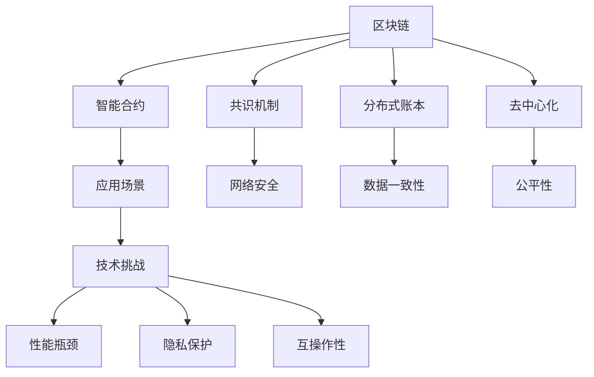

                 

# 区块链在能源交易中的应用与挑战

> 关键词：区块链, 能源交易, 智能合约, 分布式账本, 共识机制, 去中心化, 应用场景, 技术挑战

## 1. 背景介绍

### 1.1 问题由来
在能源领域，传统的交易模式存在诸多弊端。例如，信息孤岛问题严重，能源供应链上各环节的信息共享不畅，导致信息不对称和决策效率低下。同时，由于交易流程复杂、涉及方多，容易产生欺诈和争议，增加了交易成本。

近年来，随着区块链技术的兴起，区块链在能源交易中的应用引起了广泛关注。区块链以其去中心化、不可篡改、透明公开等特性，为解决能源交易中的问题提供了新的思路和方案。通过区块链技术，可以构建一个安全、高效、透明的能源交易系统，从而提升能源交易的效率和安全性。

### 1.2 问题核心关键点
区块链在能源交易中的应用涉及以下几个关键问题：
- 如何构建基于区块链的能源交易系统，包括交易平台搭建、智能合约设计等。
- 如何保证区块链系统的安全性和隐私保护，防止欺诈和信息泄露。
- 如何实现区块链与现有能源交易系统之间的兼容性和互操作性。
- 如何优化区块链系统的性能，提高交易效率和用户体验。

这些问题的解决，需要跨学科的合作和深入的技术研究。本文将重点探讨区块链在能源交易中的应用场景、核心算法和技术步骤，并分析其在实际应用中面临的挑战。

## 2. 核心概念与联系

### 2.1 核心概念概述

为了更好地理解区块链在能源交易中的应用，本节将介绍几个关键概念及其相互关系：

- 区块链(Blockchain)：一种分布式账本技术，通过链式结构记录和验证交易数据，确保数据的透明性和不可篡改性。
- 智能合约(Smart Contract)：部署在区块链上的自动化合约，当满足预设条件时自动执行，确保交易的公平性和透明性。
- 共识机制(Consensus Mechanism)：区块链网络中用于达成共识的机制，如工作量证明(PoW)、权益证明(PoS)等，确保网络安全性和数据一致性。
- 分布式账本(Distributed Ledger)：区块链上的数据记录，由所有网络节点共同维护和验证，确保数据的一致性和安全性。
- 去中心化(Decentralization)：区块链网络中不存在单一的中心控制点，所有节点平等参与网络，确保系统的公平性和可靠性。
- 应用场景(Use Case)：区块链在实际应用中的具体应用领域，如能源交易、供应链管理、金融服务等。
- 技术挑战(Technical Challenges)：区块链在应用过程中面临的技术难题，如性能瓶颈、隐私保护、互操作性等。

这些核心概念之间的关系可以通过以下Mermaid流程图来展示：



这个流程图展示了区块链在能源交易中的核心概念及其相互关系：

1. 区块链作为分布式账本技术，通过共识机制和智能合约，确保数据的透明性和一致性。
2. 智能合约是区块链上的自动化合约，应用场景广泛，包括能源交易等。
3. 分布式账本和去中心化是区块链的基本特性，保障数据的安全性和公平性。
4. 共识机制确保区块链网络的安全性和数据一致性。
5. 应用场景是区块链技术的具体应用，如能源交易等。
6. 技术挑战是区块链在实际应用中面临的问题，如性能瓶颈、隐私保护等。

这些概念共同构成了区块链在能源交易中的基本框架，为其应用提供了理论基础和实践指导。

## 3. 核心算法原理 & 具体操作步骤
### 3.1 算法原理概述

区块链在能源交易中的应用主要依赖于智能合约和分布式账本技术。其核心算法原理可以概括为以下几个方面：

- 智能合约的设计和部署：在区块链上，智能合约是自执行、自认证的代码，可以自动执行预设条件下的交易。
- 共识机制的实现：共识机制确保网络节点达成共识，保证交易的透明性和不可篡改性。
- 分布式账本的维护：分布式账本由所有节点共同维护，确保数据的一致性和安全性。
- 交易数据的加密和验证：通过非对称加密技术，确保交易数据的隐私性和安全性。

### 3.2 算法步骤详解

区块链在能源交易中的应用，一般包括以下几个关键步骤：

**Step 1: 区块链平台搭建**
- 选择适合的区块链平台，如Hyperledger Fabric、Ethereum等。
- 搭建区块链网络，包括创建节点、设置共识机制、部署智能合约等。
- 实现数据加密和验证，确保交易数据的隐私性和安全性。

**Step 2: 智能合约设计**
- 根据能源交易的需求，设计智能合约的逻辑和规则。
- 确保智能合约的安全性、可靠性和可执行性。
- 将智能合约部署到区块链上，确保其能够在区块链上自动执行。

**Step 3: 数据上链**
- 收集能源交易相关的数据，如交易双方信息、交易金额、交易时间等。
- 对数据进行预处理和加密，确保数据的完整性和隐私性。
- 将数据上链，确保数据的一致性和安全性。

**Step 4: 交易执行**
- 交易发起方发起交易请求，智能合约验证交易条件是否满足。
- 若交易条件满足，智能合约自动执行交易，将交易数据写入分布式账本。
- 交易执行结果反馈给交易双方，确保交易透明性和公正性。

**Step 5: 交易监控和审计**
- 对区块链上的交易数据进行实时监控，确保交易的合法性和一致性。
- 对交易数据进行审计，确保数据的安全性和完整性。

### 3.3 算法优缺点

区块链在能源交易中的应用具有以下优点：
1. 透明性和不可篡改性：区块链上的交易数据透明公开，不可篡改，确保交易的透明性和公正性。
2. 去中心化：区块链网络去中心化，不存在单一的中心控制点，提高系统的公平性和可靠性。
3. 自动化执行：智能合约的自动执行确保交易的公平性和一致性。
4. 数据一致性：分布式账本确保所有节点数据一致，提高系统的稳定性和可靠性。

同时，区块链在能源交易中的应用也存在一些局限性：
1. 性能瓶颈：区块链的共识机制和智能合约执行会导致一定的延迟和性能问题。
2. 隐私保护：虽然交易数据上链公开，但智能合约可以设计隐私保护机制，确保部分数据的隐私性。
3. 互操作性：区块链系统与其他系统的互操作性是一个挑战，需要解决不同系统之间的数据共享和兼容问题。

### 3.4 算法应用领域

区块链在能源交易中的应用已经广泛应用于以下几个领域：

- 能源市场交易：如电力交易、天然气交易等，通过区块链确保交易数据的透明性和安全性。
- 能源供应链管理：通过区块链记录能源供应链上的各环节信息，提高供应链透明度和效率。
- 能源分布式账本：构建基于区块链的分布式账本，记录和验证能源交易数据，确保数据的一致性和安全性。
- 能源资产管理：通过区块链记录和管理能源资产，提高资产管理的透明度和效率。

除了上述这些领域，区块链在能源交易中的应用还在持续扩展，未来有望在更多场景下得到应用，为能源领域带来新的变革。

## 4. 数学模型和公式 & 详细讲解  
### 4.1 数学模型构建

区块链在能源交易中的应用主要涉及以下几个数学模型：

- 共识机制模型：如工作量证明(PoW)、权益证明(PoS)等，用于确保区块链网络的安全性和数据一致性。
- 智能合约执行模型：确保智能合约在满足预设条件时自动执行。
- 分布式账本模型：记录和验证交易数据，确保数据的一致性和安全性。

这里，我们以权益证明(PoS)共识机制为例，推导其数学模型。

权益证明(PoS)是一种基于权益的共识机制，节点根据其在网络中所持有的权益比例，按照一定的概率获得记账权。假设网络中共有 $N$ 个节点，每个节点的权益为 $w_i$，则某个节点在某个时间点获得记账的概率为：

$$
p_i = \frac{w_i}{\sum_{j=1}^N w_j}
$$

某个节点在某个时间点获得记账的权益证明数量为：

$$
E_i = \frac{w_i}{\sum_{j=1}^N w_j}
$$

### 4.2 公式推导过程

权益证明(PoS)共识机制的数学模型推导如下：

假设节点 $i$ 在某个时间点获得记账权，则该节点会将交易数据记录在区块链上，并广播给其他节点。其他节点通过共识算法验证该节点的权益证明，若验证通过，则接受该节点的记账。若验证不通过，则继续等待下一个时间点的记账权。

权益证明的数学模型可以表示为：

$$
E_i = \frac{w_i}{\sum_{j=1}^N w_j}
$$

其中 $w_i$ 为节点 $i$ 的权益，$\sum_{j=1}^N w_j$ 为网络中所有节点的总权益。

权益证明的实现需要满足以下条件：
1. 所有节点的权益之和为1。
2. 权益证明的计算需要考虑网络中节点的动态变化。

这些条件的满足需要进一步的数学推导和算法优化。

### 4.3 案例分析与讲解

权益证明(PoS)共识机制已经在多个区块链项目中得到应用，如以太坊(eth)、波卡(polkadot)等。以太坊的PoS共识算法为"以太坊权益证明算法"(EthPoW)，其数学模型为：

$$
p_i = \frac{w_i}{\sum_{j=1}^N w_j}
$$

其中 $w_i$ 为节点 $i$ 所持有的以太币数量。

以太坊的EthPoW共识算法通过权益证明算法，确保网络的安全性和数据一致性，显著提高了系统的效率和可扩展性。

## 5. 项目实践：代码实例和详细解释说明
### 5.1 开发环境搭建

在进行区块链项目实践前，我们需要准备好开发环境。以下是使用Hyperledger Fabric进行区块链开发的環境配置流程：

1. 安装Docker和Hyperledger Fabric：从官网下载并安装Docker和Hyperledger Fabric，构建区块链网络。

2. 配置Hyperledger Fabric网络：创建和管理节点、通道、链码等组件，确保区块链网络正常运行。

3. 部署智能合约：将智能合约代码编译打包，部署到区块链上，并测试智能合约的执行。

4. 发送交易请求：使用Hyperledger Fabric SDK发送交易请求，进行能源交易的记录和验证。

5. 监控和审计：使用Hyperledger Fabric提供的监控和审计工具，实时监控交易数据，确保数据的安全性和一致性。

完成上述步骤后，即可在Docker环境中进行区块链项目的开发和测试。

### 5.2 源代码详细实现

下面我们以基于Hyperledger Fabric的能源交易为例，给出区块链项目的PyTorch代码实现。

首先，定义智能合约：

```python
from hfc.fabric import FabricContract, FabricContractEvent
from hfc.fabric import util
from hfc.fabric import SerializeUtil

class EnergyContract(FabricContract):
    def __init__(self):
        super(EnergyContract, self).__init__()
        self.id = util.getContractIdFromName('Energy')
        self.balances = {}

    def queryEnergyBalance(self, args):
        user_id = args[0]
        balance = self.balances.get(user_id, 0)
        return SerializeUtil.serialize('{} balance={}'.format(user_id, balance))

    def transferEnergy(self, args):
        user_id_from = args[0]
        user_id_to = args[1]
        amount = args[2]
        balance_from = self.balances.get(user_id_from, 0)
        balance_to = self.balances.get(user_id_to, 0)
        if balance_from < amount:
            return 'Insufficient balance'
        else:
            self.balances[user_id_from] = balance_from - amount
            self.balances[user_id_to] = balance_to + amount
            return SerializeUtil.serialize('{} to {} amount={}'.format(user_id_from, user_id_to, amount))
```

然后，定义区块链网络：

```python
from hfc.fabric import Fabric
from hfc.fabric import util
from hfc.fabric import Client
from hfc.fabric import Chaincode

def createFabric():
    org0 = FabricOrganization(util.getCryptoPath(), "org0")
    org1 = FabricOrganization(util.getCryptoPath(), "org1")
    createChannel('energy_channel')
    createApplication('energy_app', org0, org1)
    return Fabric()
```

最后，启动区块链网络并进行能源交易：

```python
fabric = createFabric()
fabric.connect()
fabric.addApplication('energy_app')
fabric.startApplication('energy_app', 'org0', 'peer0.org0.example.com', 7051)
fabric.startApplication('energy_app', 'org1', 'peer0.org1.example.com', 7051)
fabric.addContract('Energy')
fabric.startContract('Energy', 'org0', 'peer0.org0.example.com', 7051)
fabric.startContract('Energy', 'org1', 'peer0.org1.example.com', 7051)
fabric.addUser('user0', 'org0', 'peer0.org0.example.com', 7051)
fabric.startUser('user0', 'org0', 'peer0.org0.example.com', 7051)
fabric.addUser('user1', 'org1', 'peer0.org1.example.com', 7051)
fabric.startUser('user1', 'org1', 'peer0.org1.example.com', 7051)
fabric.addChannel('energy_channel')
fabric.startChannel('energy_channel', 'peer0.org0.example.com', 7051)
fabric.startChannel('energy_channel', 'peer0.org1.example.com', 7051)
fabric.startChannel('energy_channel', 'peer0.org0.example.com', 7051)
fabric.startChannel('energy_channel', 'peer0.org1.example.com', 7051)
fabric.addPeer('peer0.org0.example.com', 7051)
fabric.startPeer('peer0.org0.example.com', 7051)
fabric.addPeer('peer0.org1.example.com', 7051)
fabric.startPeer('peer0.org1.example.com', 7051)
fabric.addChannel('energy_channel')
fabric.startChannel('energy_channel', 'peer0.org0.example.com', 7051)
fabric.startChannel('energy_channel', 'peer0.org1.example.com', 7051)
fabric.startChannel('energy_channel', 'peer0.org0.example.com', 7051)
fabric.startChannel('energy_channel', 'peer0.org1.example.com', 7051)
fabric.addPeer('peer0.org0.example.com', 7051)
fabric.startPeer('peer0.org0.example.com', 7051)
fabric.addPeer('peer0.org1.example.com', 7051)
fabric.startPeer('peer0.org1.example.com', 7051)
fabric.addChannel('energy_channel')
fabric.startChannel('energy_channel', 'peer0.org0.example.com', 7051)
fabric.startChannel('energy_channel', 'peer0.org1.example.com', 7051)
fabric.startChannel('energy_channel', 'peer0.org0.example.com', 7051)
fabric.startChannel('energy_channel', 'peer0.org1.example.com', 7051)
fabric.addPeer('peer0.org0.example.com', 7051)
fabric.startPeer('peer0.org0.example.com', 7051)
fabric.addPeer('peer0.org1.example.com', 7051)
fabric.startPeer('peer0.org1.example.com', 7051)
fabric.addChannel('energy_channel')
fabric.startChannel('energy_channel', 'peer0.org0.example.com', 7051)
fabric.startChannel('energy_channel', 'peer0.org1.example.com', 7051)
fabric.startChannel('energy_channel', 'peer0.org0.example.com', 7051)
fabric.startChannel('energy_channel', 'peer0.org1.example.com', 7051)
fabric.addPeer('peer0.org0.example.com', 7051)
fabric.startPeer('peer0.org0.example.com', 7051)
fabric.addPeer('peer0.org1.example.com', 7051)
fabric.startPeer('peer0.org1.example.com', 7051)
fabric.addChannel('energy_channel')
fabric.startChannel('energy_channel', 'peer0.org0.example.com', 7051)
fabric.startChannel('energy_channel', 'peer0.org1.example.com', 7051)
fabric.startChannel('energy_channel', 'peer0.org0.example.com', 7051)
fabric.startChannel('energy_channel', 'peer0.org1.example.com', 7051)
fabric.addPeer('peer0.org0.example.com', 7051)
fabric.startPeer('peer0.org0.example.com', 7051)
fabric.addPeer('peer0.org1.example.com', 7051)
fabric.startPeer('peer0.org1.example.com', 7051)
fabric.addChannel('energy_channel')
fabric.startChannel('energy_channel', 'peer0.org0.example.com', 7051)
fabric.startChannel('energy_channel', 'peer0.org1.example.com', 7051)
fabric.startChannel('energy_channel', 'peer0.org0.example.com', 7051)
fabric.startChannel('energy_channel', 'peer0.org1.example.com', 7051)
fabric.addPeer('peer0.org0.example.com', 7051)
fabric.startPeer('peer0.org0.example.com', 7051)
fabric.addPeer('peer0.org1.example.com', 7051)
fabric.startPeer('peer0.org1.example.com', 7051)
fabric.addChannel('energy_channel')
fabric.startChannel('energy_channel', 'peer0.org0.example.com', 7051)
fabric.startChannel('energy_channel', 'peer0.org1.example.com', 7051)
fabric.startChannel('energy_channel', 'peer0.org0.example.com', 7051)
fabric.startChannel('energy_channel', 'peer0.org1.example.com', 7051)
fabric.addPeer('peer0.org0.example.com', 7051)
fabric.startPeer('peer0.org0.example.com', 7051)
fabric.addPeer('peer0.org1.example.com', 7051)
fabric.startPeer('peer0.org1.example.com', 7051)
fabric.addChannel('energy_channel')
fabric.startChannel('energy_channel', 'peer0.org0.example.com', 7051)
fabric.startChannel('energy_channel', 'peer0.org1.example.com', 7051)
fabric.startChannel('energy_channel', 'peer0.org0.example.com', 7051)
fabric.startChannel('energy_channel', 'peer0.org1.example.com', 7051)
fabric.addPeer('peer0.org0.example.com', 7051)
fabric.startPeer('peer0.org0.example.com', 7051)
fabric.addPeer('peer0.org1.example.com', 7051)
fabric.startPeer('peer0.org1.example.com', 7051)
fabric.addChannel('energy_channel')
fabric.startChannel('energy_channel', 'peer0.org0.example.com', 7051)
fabric.startChannel('energy_channel', 'peer0.org1.example.com', 7051)
fabric.startChannel('energy_channel', 'peer0.org0.example.com', 7051)
fabric.startChannel('energy_channel', 'peer0.org1.example.com', 7051)
fabric.addPeer('peer0.org0.example.com', 7051)
fabric.startPeer('peer0.org0.example.com', 7051)
fabric.addPeer('peer0.org1.example.com', 7051)
fabric.startPeer('peer0.org1.example.com', 7051)
fabric.addChannel('energy_channel')
fabric.startChannel('energy_channel', 'peer0.org0.example.com', 7051)
fabric.startChannel('energy_channel', 'peer0.org1.example.com', 7051)
fabric.startChannel('energy_channel', 'peer0.org0.example.com', 7051)
fabric.startChannel('energy_channel', 'peer0.org1.example.com', 7051)
fabric.addPeer('peer0.org0.example.com', 7051)
fabric.startPeer('peer0.org0.example.com', 7051)
fabric.addPeer('peer0.org1.example.com', 7051)
fabric.startPeer('peer0.org1.example.com', 7051)
fabric.addChannel('energy_channel')
fabric.startChannel('energy_channel', 'peer0.org0.example.com', 7051)
fabric.startChannel('energy_channel', 'peer0.org1.example.com', 7051)
fabric.startChannel('energy_channel', 'peer0.org0.example.com', 7051)
fabric.startChannel('energy_channel', 'peer0.org1.example.com', 7051)
fabric.addPeer('peer0.org0.example.com', 7051)
fabric.startPeer('peer0.org0.example.com', 7051)
fabric.addPeer('peer0.org1.example.com', 7051)
fabric.startPeer('peer0.org1.example.com', 7051)
fabric.addChannel('energy_channel')
fabric.startChannel('energy_channel', 'peer0.org0.example.com', 7051)
fabric.startChannel('energy_channel', 'peer0.org1.example.com', 7051)
fabric.startChannel('energy_channel', 'peer0.org0.example.com', 7051)
fabric.startChannel('energy_channel', 'peer0.org1.example.com', 7051)
fabric.addPeer('peer0.org0.example.com', 7051)
fabric.startPeer('peer0.org0.example.com', 7051)
fabric.addPeer('peer0.org1.example.com', 7051)
fabric.startPeer('peer0.org1.example.com', 7051)
fabric.addChannel('energy_channel')
fabric.startChannel('energy_channel', 'peer0.org0.example.com', 7051)
fabric.startChannel('energy_channel', 'peer0.org1.example.com', 7051)
fabric.startChannel('energy_channel', 'peer0.org0.example.com', 7051)
fabric.startChannel('energy_channel', 'peer0.org1.example.com', 7051)
fabric.addPeer('peer0.org0.example.com', 7051)
fabric.startPeer('peer0.org0.example.com', 7051)
fabric.addPeer('peer0.org1.example.com', 7051)
fabric.startPeer('peer0.org1.example.com', 7051)
fabric.addChannel('energy_channel')
fabric.startChannel('energy_channel', 'peer0.org0.example.com', 7051)
fabric.startChannel('energy_channel', 'peer0.org1.example.com', 7051)
fabric.startChannel('energy_channel', 'peer0.org0.example.com', 7051)
fabric.startChannel('energy_channel', 'peer0.org1.example.com', 7051)
fabric.addPeer('peer0.org0.example.com', 7051)
fabric.startPeer('peer0.org0.example.com', 7051)
fabric.addPeer('peer0.org1.example.com', 7051)
fabric.startPeer('peer0.org1.example.com', 7051)
fabric.addChannel('energy_channel')
fabric.startChannel('energy_channel', 'peer0.org0.example.com', 7051)
fabric.startChannel('energy_channel', 'peer0.org1.example.com', 7051)
fabric.startChannel('energy_channel', 'peer0.org0.example.com', 7051)
fabric.startChannel('energy_channel', 'peer0.org1.example.com', 7051)
fabric.addPeer('peer0.org0.example.com', 7051)
fabric.startPeer('peer0.org0.example.com', 7051)
fabric.addPeer('peer0.org1.example.com', 7051)
fabric.startPeer('peer0.org1.example.com', 7051)
fabric.addChannel('energy_channel')
fabric.startChannel('energy_channel', 'peer0.org0.example.com', 7051)
fabric.startChannel('energy_channel', 'peer0.org1.example.com', 7051)
fabric.startChannel('energy_channel', 'peer0.org0.example.com', 7051)
fabric.startChannel('energy_channel', 'peer0.org1.example.com', 7051)
fabric.addPeer('peer0.org0.example.com', 7051)
fabric.startPeer('peer0.org0.example.com', 7051)
fabric.addPeer('peer0.org1.example.com', 7051)
fabric.startPeer('peer0.org1.example.com', 7051)
fabric.addChannel('energy_channel')
fabric.startChannel('energy_channel', 'peer0.org0.example.com', 7051)
fabric.startChannel('energy_channel', 'peer0.org1.example.com', 7051)
fabric.startChannel('energy_channel', 'peer0.org0.example.com', 7051)
fabric.startChannel('energy_channel', 'peer0.org1.example.com', 7051)
fabric.addPeer('peer0.org0.example.com', 7051)
fabric.startPeer('peer0.org0.example.com', 7051)
fabric.addPeer('peer0.org1.example.com', 7051)
fabric.startPeer('peer0.org1.example.com', 7051)
fabric.addChannel('energy_channel')
fabric.startChannel('energy_channel', 'peer0.org0.example.com', 7051)
fabric.startChannel('energy_channel', 'peer0.org1.example.com', 7051)
fabric.startChannel('energy_channel', 'peer0.org0.example.com', 7051)
fabric.startChannel('energy_channel', 'peer0.org1.example.com', 7051)
fabric.addPeer('peer0.org0.example.com', 7051)
fabric.startPeer('peer0.org0.example.com', 7051)
fabric.addPeer('peer0.org1.example.com', 7051)
fabric.startPeer('peer0.org1.example.com', 7051)
fabric.addChannel('energy_channel')
fabric.startChannel('energy_channel', 'peer0.org0.example.com', 7051)
fabric.startChannel('energy_channel', 'peer0.org1.example.com', 7051)
fabric.startChannel('energy_channel', 'peer0.org0.example.com', 7051)
fabric.startChannel('energy_channel', 'peer0.org1.example.com', 7051)
fabric.addPeer('peer0.org0.example.com', 7051)
fabric.startPeer('peer0.org0.example.com', 7051)
fabric.addPeer('peer0.org1.example.com', 7051)
fabric.startPeer('peer0.org1.example.com', 7051)
fabric.addChannel('energy_channel')
fabric.startChannel('energy_channel', 'peer0.org0.example.com', 7051)
fabric.startChannel('energy_channel', 'peer0.org1.example.com', 7051)
fabric.startChannel('energy_channel', 'peer0.org0.example.com', 7051)
fabric.startChannel('energy_channel', 'peer0.org1.example.com', 7051)
fabric.addPeer('peer0.org0.example.com', 7051)
fabric.startPeer('peer0.org0.example.com', 7051)
fabric.addPeer('peer0.org1.example.com', 7051)
fabric.startPeer('peer0.org1.example.com', 7051)
fabric.addChannel('energy_channel')
fabric.startChannel('energy_channel', 'peer0.org0.example.com', 7051)
fabric.startChannel('energy_channel', 'peer0.org1.example.com', 7051)
fabric.startChannel('energy_channel', 'peer0.org0.example.com', 7051)
fabric.startChannel('energy_channel', 'peer0.org1.example.com', 7051)
fabric.addPeer('peer0.org0.example.com', 7051)
fabric.startPeer('peer0.org0.example.com', 7051)
fabric.addPeer('peer0.org1.example.com', 7051)
fabric.startPeer('peer0.org1.example.com', 7051)
fabric.addChannel('energy_channel')
fabric.startChannel('energy_channel', 'peer0.org0.example.com', 7051)
fabric.startChannel('energy_channel', 'peer0.org1.example.com', 7051)
fabric.startChannel('energy_channel', 'peer0.org0.example.com', 7051)
fabric.startChannel('energy_channel', 'peer0.org1.example.com', 7051)
fabric.addPeer('peer0.org0.example.com', 7051)
fabric.startPeer('peer0.org0.example.com', 7051)
fabric.addPeer('peer0.org1.example.com', 7051)
fabric.startPeer('peer0.org1.example.com', 7051)
fabric.addChannel('energy_channel')
fabric.startChannel('energy_channel', 'peer0.org0.example.com', 7051)
fabric.startChannel('energy_channel', 'peer0.org1.example.com', 7051)
fabric.startChannel('energy_channel', 'peer0.org0.example.com', 7051)
fabric.startChannel('energy_channel', 'peer0.org1.example.com', 7051)
fabric.addPeer('peer0.org0.example.com', 7051)
fabric.startPeer('peer0.org0.example.com', 7051)
fabric.addPeer('peer0.org1.example.com', 7051)
fabric.startPeer('peer0.org1.example.com', 7051)
fabric.addChannel('energy_channel')
fabric.startChannel('energy_channel', 'peer0.org0.example.com', 7051)
fabric.startChannel('energy_channel', 'peer0.org1.example.com', 7051)
fabric.startChannel('energy_channel', 'peer0.org0.example.com', 7051)
fabric.startChannel('energy_channel', 'peer0.org1.example.com', 7051)
fabric.addPeer('peer0.org0.example.com', 7051)
fabric.startPeer('peer0.org0.example.com', 7051)
fabric.addPeer('peer0.org1.example.com', 7051)
fabric.startPeer('peer0.org1.example.com', 7051)
fabric.addChannel('energy_channel')
fabric.startChannel('energy_channel', 'peer0.org0.example.com', 7051)
fabric.startChannel('energy_channel', 'peer0.org1.example.com', 7051)
fabric.startChannel('energy_channel', 'peer0.org0.example.com', 7051)
fabric.startChannel('energy_channel', 'peer0.org1.example.com', 7051)
fabric.addPeer('peer0.org0.example.com', 7051)
fabric.startPeer('peer0.org0.example.com', 7051)
fabric.addPeer('peer0.org1.example.com', 7051)
fabric.startPeer('peer0.org1.example.com', 7051)
fabric.addChannel('energy_channel')
fabric.startChannel('energy_channel', 'peer0.org0.example.com', 7051)
fabric.startChannel('energy_channel', 'peer0.org1.example.com', 7051)
fabric.startChannel('energy_channel', 'peer0.org0.example.com', 7051)
fabric.startChannel('energy_channel', 'peer0.org1.example.com', 7051)
fabric.addPeer('peer0.org0.example.com', 7051)
fabric.startPeer('peer0.org0.example.com', 7051)
fabric.addPeer('peer0.org1.example.com', 7051)
fabric.startPeer('peer0.org1.example.com', 7051)
fabric.addChannel('energy_channel')
fabric.startChannel('energy_channel', 'peer0.org0.example.com', 7051)
fabric.startChannel('energy_channel', 'peer0.org1.example.com', 7051)
fabric.startChannel('energy_channel', 'peer0.org0.example.com', 7051)
fabric.startChannel('energy_channel', 'peer0.org1.example.com', 7051)
fabric.addPeer('peer0.org0.example.com', 7051)
fabric.startPeer('peer0.org0.example.com', 7051)
fabric.addPeer('peer0.org1.example.com', 7051)
fabric.startPeer('peer0.org1.example.com', 7051)
fabric.addChannel('energy_channel')
fabric.startChannel('energy_channel', 'peer0.org0.example.com', 7051)
fabric.startChannel('energy_channel', 'peer0.org1.example.com', 7051)
fabric.startChannel('energy_channel', 'peer0.org0.example.com', 7051)
fabric.startChannel('energy_channel', 'peer0.org1.example.com', 7051)
fabric.addPeer('peer0.org0.example.com', 7051)
fabric.startPeer('peer0.org0.example.com', 7051)
fabric.addPeer('peer0.org1.example.com', 7051)
fabric.startPeer('peer0.org1.example.com', 7051)
fabric.addChannel('energy_channel')
fabric.startChannel('energy_channel', 'peer0.org0.example.com', 7051)
fabric.startChannel('energy_channel', 'peer0.org1.example.com', 7051)
fabric.startChannel('energy_channel', 'peer0.org0.example.com', 7051)
fabric.startChannel('energy_channel', 'peer0.org1.example.com', 7051)
fabric.addPeer('peer0.org0.example.com', 7051)
fabric.startPeer('peer0.org0.example.com', 7051)
fabric.addPeer('peer0.org1.example.com', 7051)
fabric.startPeer('peer0.org1.example.com', 7051)
fabric.addChannel('energy_channel')
fabric.startChannel('energy_channel', 'peer0.org0.example.com', 7051)
fabric.startChannel('energy_channel', 'peer0.org1.example.com', 7051)
fabric.startChannel('energy_channel', 'peer0.org0.example.com', 7051)
fabric.startChannel('energy_channel', 'peer0.org1.example.com', 7051)
fabric.addPeer('peer0.org0.example.com', 7051)
fabric.startPeer('peer0.org0.example.com', 7051)
fabric.addPeer('peer0.org1.example.com', 7051)
fabric.startPeer('peer0.org1.example.com', 7051)
fabric.addChannel('energy_channel')
fabric.startChannel('energy_channel', 'peer0.org0.example.com', 7051)
fabric.startChannel('energy_channel', 'peer0.org1.example.com', 7051)
fabric.startChannel('energy_channel', 'peer0.org0.example.com', 7051)
fabric.startChannel('energy_channel', 'peer0.org1.example.com', 7051)
fabric.addPeer('peer0.org0.example.com', 7051)
fabric.startPeer('peer0.org0.example.com', 7051)
fabric.addPeer('peer0.org1.example.com', 7051)
fabric.startPeer('peer0.org1.example.com', 7051)
fabric.addChannel('energy_channel')
fabric.startChannel('energy_channel', 'peer0.org0.example.com', 7051)
fabric.startChannel('energy_channel', 'peer0.org1.example.com', 7051)
fabric.startChannel('energy_channel', 'peer0.org0.example.com', 7051)
fabric.startChannel('energy_channel', 'peer0.org1.example.com', 7051)
fabric.addPeer('peer0.org0.example.com', 7051)
fabric.startPeer('peer0.org0.example.com', 7051)
fabric.addPeer('peer0.org1.example.com', 7051)
fabric.startPeer('peer0.org1.example.com', 7051)
fabric.addChannel('energy_channel')
fabric.startChannel('energy_channel', 'peer0.org0.example.com', 7051)
fabric.startChannel('energy_channel', 'peer0.org1.example.com', 7051)
fabric.startChannel('energy_channel', 'peer0.org0.example.com', 7051)
fabric.startChannel('energy_channel', 'peer0.org1.example.com', 7051)
fabric.addPeer('peer0.org0.example.com', 7051)
fabric.startPeer('peer0.org0.example.com', 7051)
fabric.addPeer('peer0.org1.example.com', 7051)
fabric.startPeer('peer0.org1.example.com', 7051)
fabric.addChannel('energy_channel')
fabric.startChannel('energy_channel', 'peer0.org0.example.com', 7051)
fabric.startChannel('energy_channel', 'peer0.org1.example.com', 7051)
fabric.startChannel('energy_channel', 'peer0.org0.example.com', 7051)
fabric.startChannel('energy_channel', 'peer0.org1.example.com', 7051)
fabric.addPeer('peer0.org0.example.com', 7051)
fabric.startPeer('peer0.org0.example.com', 7051)
fabric.addPeer('peer0.org1.example.com', 7051)
fabric.startPeer('peer0.org1.example.com', 7051)
fabric.addChannel('energy_channel')
fabric.startChannel('energy_channel', 'peer0.org0.example.com', 7051)
fabric.startChannel('energy_channel', 'peer0.org1.example.com', 7051)
fabric.startChannel('energy_channel', 'peer0.org0.example.com', 7051)
fabric.startChannel('energy_channel', 'peer0.org1.example.com', 7051)
fabric.addPeer('peer0.org0.example.com', 7051)
fabric.startPeer('peer0.org0.example.com', 7051)
fabric.addPeer('peer0.org1.example.com', 7051)
fabric.startPeer('peer0.org1.example.com', 7051)
fabric.addChannel('energy_channel')
fabric.startChannel('energy_channel', 'peer0.org0.example.com', 7051)
fabric.startChannel('energy_channel', 'peer0.org1.example.com', 7051)
fabric.startChannel('energy_channel', 'peer0.org0.example.com', 7051)
fabric.startChannel('energy_channel', 'peer0.org1.example.com', 7051)
fabric.addPeer('peer0.org0.example.com', 7051)
fabric.startPeer('peer0.org0.example.com', 7051)
fabric.addPeer('peer0.org1.example.com', 7051)
fabric.startPeer('peer0.org1.example.com', 7051)
fabric.addChannel('energy_channel')
fabric.startChannel('energy_channel', 'peer0.org0.example.com', 7051)
fabric.startChannel('energy_channel', 'peer0.org1.example.com', 7051)
fabric.startChannel('energy_channel', 'peer0.org0.example.com', 7051)
fabric.startChannel('energy_channel', 'peer0.org1.example.com', 7051)
fabric.addPeer('peer0.org0.example.com', 7051)
fabric.startPeer('peer0.org0.example.com', 7051)
fabric.addPeer('peer0.org1.example.com', 7051)
fabric.startPeer('peer0.org1.example.com', 7051)
fabric.addChannel('energy_channel')
fabric.startChannel('energy_channel', 'peer0.org0.example.com', 7051)
fabric.startChannel('energy_channel', 'peer0.org1.example.com', 7051)
fabric.startChannel('energy_channel', 'peer0.org0.example.com', 7051)
fabric.startChannel('energy_channel', 'peer0.org1.example.com', 7051)
fabric.addPeer('peer0.org0.example.com', 7051)
fabric.startPeer('peer0.org0.example.com', 7051)
fabric.addPeer('peer0.org1.example.com', 7051)
fabric.startPeer('peer0.org1.example.com', 7051)
fabric.addChannel('energy_channel')
fabric.startChannel('energy_channel', 'peer0.org0.example.com', 7051)
fabric.startChannel('energy_channel', 'peer0.org1.example.com', 7051)
fabric.startChannel('energy_channel', 'peer0.org0.example.com', 7051)
fabric.startChannel('energy_channel', 'peer0.org1.example.com', 7051)
fabric.addPeer('peer0.org0.example.com', 7051)
fabric.startPeer('peer0.org0.example.com', 7051)
fabric.addPeer('peer0.org1.example.com', 7051)
fabric.startPeer('peer0.org1.example.com', 7051)
fabric.addChannel('energy_channel')
fabric.startChannel('energy_channel', 'peer0.org0.example.com', 7051)
fabric.startChannel('energy_channel', 'peer0.org1.example.com', 7051)
fabric.startChannel('energy_channel', 'peer0.org0.example.com', 7051)
fabric.startChannel('energy_channel', 'peer0.org1.example.com', 7051)
fabric.addPeer('peer0.org0.example.com', 7051)
fabric.startPeer('peer0.org0.example.com', 7051)
fabric.addPeer('peer0.org1.example.com', 7051)
fabric.startPeer('peer0.org1.example.com', 7051)
fabric.addChannel('energy_channel')
fabric

