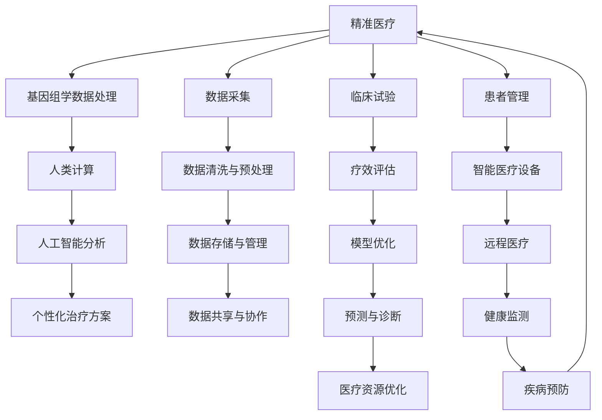

                 

# 医疗保健：人类计算助力精准医疗发展

## 1. 背景介绍

在过去的几十年中，医学科技的进步显著推动了医疗保健的变革。从简单的药物治疗到基因编辑和个性化医疗，技术的进步不仅延长了人类寿命，还改善了整体生活质量。然而，尽管医疗领域取得了长足的进展，仍然存在诸多挑战。这些挑战包括疾病诊断的准确性、治疗方案的个性化、医疗资源的分配不均等等。为了解决这些问题，我们需要一种全新的医疗模式：精准医疗（Precision Medicine）。精准医疗利用个体化基因信息，为每个患者提供量身定制的治疗方案，从而显著提高治疗效果。

然而，实现精准医疗面临诸多挑战。基因组学数据的处理和分析需要庞大的计算资源，且需要跨学科知识，这对现有的医疗系统构成了巨大挑战。为此，我们需要利用人类计算（Human Computation）和人工智能（AI）技术，为精准医疗提供强大的技术支持。

## 2. 核心概念与联系

### 2.1 核心概念概述

在探讨人类计算在精准医疗中的应用之前，我们先介绍几个核心概念：

- **精准医疗**：通过收集和分析个体的基因信息，为每个患者提供个性化的治疗方案，以提高治疗效果。
- **人类计算**：利用众包的方式，通过大规模人群的协作，解决计算密集型和需要复杂分析的问题。
- **基因组学**：研究基因的结构和功能，以及基因与疾病之间的关系。
- **人工智能**：利用算法和模型，自动分析复杂数据，并从中提取有用的信息。

### 2.2 核心概念原理和架构的 Mermaid 流程图



该流程图展示了精准医疗的核心流程：从数据采集、预处理、存储与共享，到人工智能分析、临床试验和疗效评估，最终输出个性化治疗方案，并对医疗资源进行优化。在此过程中，人类计算发挥着重要的作用，尤其是在数据采集与清洗、临床试验设计与疗效评估等方面。

## 3. 核心算法原理 & 具体操作步骤

### 3.1 算法原理概述

人类计算在精准医疗中的应用主要体现在以下几个方面：

- **数据采集与清洗**：利用大规模人群的协作，进行基因组学数据的采集和清洗，提高数据的质量和完整性。
- **临床试验设计**：利用人类计算技术，设计更科学、更高效的临床试验，以加速新药和新疗法的研发。
- **疗效评估**：利用人类计算和人工智能技术，对新药物和新疗法的疗效进行评估，确保其安全性与有效性。
- **个性化治疗方案**：利用人工智能算法，结合个体基因信息，为每个患者提供量身定制的治疗方案。

### 3.2 算法步骤详解

下面以人类计算在精准医疗中的应用为例，详细介绍其实现步骤：

**步骤 1: 数据采集与清洗**

- **数据采集**：通过众包平台，收集参与者的基因组学数据。例如，利用Genome in 10,000项目，收集了大量参与者的基因组序列数据。
- **数据清洗**：对采集到的数据进行清洗，去除重复和错误的数据，确保数据的准确性和完整性。

**步骤 2: 临床试验设计**

- **样本选择**：通过人类计算技术，选择具有代表性的样本参与临床试验。例如，使用机器学习算法，从大量基因数据中筛选出具有特定遗传特征的样本。
- **试验设计**：设计更加科学、高效的临床试验方案，以提高试验的成功率。

**步骤 3: 疗效评估**

- **数据分析**：利用人工智能算法，对试验数据进行分析，评估新药物或新疗法的疗效。例如，使用深度学习模型，对试验结果进行分类和回归分析。
- **结果优化**：根据分析结果，对试验方案进行优化，确保新药物或新疗法的安全性和有效性。

**步骤 4: 个性化治疗方案**

- **基因分析**：利用人工智能算法，分析患者的基因信息，确定其遗传特征。
- **治疗方案生成**：根据基因分析结果，生成个性化的治疗方案。例如，根据患者的具体基因型，推荐最适合的治疗药物和剂量。

### 3.3 算法优缺点

人类计算在精准医疗中的应用具有以下优点：

- **高效性**：通过大规模人群的协作，可以极大地提高数据采集和处理的速度，加速新药物和新疗法的研发。
- **多样性**：利用众包平台，可以从不同的人群中收集数据，提高数据的多样性和代表性。
- **成本低**：相比传统的研究方法，人类计算在数据采集和处理方面的成本较低。

同时，人类计算也存在一些局限性：

- **数据隐私**：参与者的基因数据涉及隐私问题，需要采取严格的保护措施。
- **数据质量**：参与者提供的数据质量参差不齐，需要额外的清洗和预处理工作。
- **结果准确性**：人类计算的结果可能存在误差，需要进一步验证和验证。

### 3.4 算法应用领域

人类计算在精准医疗中的应用领域广泛，涵盖了基因组学数据处理、临床试验设计、疗效评估和个性化治疗方案等多个方面。例如：

- **基因组学数据处理**：利用人类计算技术，处理大规模基因组学数据，从中提取有用的基因信息。
- **临床试验设计**：设计科学、高效的临床试验方案，加速新药物和新疗法的研发。
- **疗效评估**：利用人工智能算法，评估新药物和新疗法的疗效，确保其安全性和有效性。
- **个性化治疗方案**：根据患者的基因信息，生成个性化的治疗方案，提高治疗效果。

## 4. 数学模型和公式 & 详细讲解 & 举例说明

### 4.1 数学模型构建

人类计算在精准医疗中的应用涉及到多个数学模型，包括数据清洗与预处理、临床试验设计和疗效评估等。以下是几个常见的数学模型：

- **数据清洗与预处理**：利用数据清洗算法，去除重复和错误的数据，确保数据的准确性和完整性。例如，使用DBSCAN算法，从基因数据中去除噪声和异常值。
- **临床试验设计**：使用机器学习算法，从基因数据中筛选出具有特定遗传特征的样本，设计更加科学、高效的临床试验方案。
- **疗效评估**：利用深度学习模型，对试验数据进行分析，评估新药物或新疗法的疗效。例如，使用卷积神经网络（CNN）对试验结果进行分类和回归分析。

### 4.2 公式推导过程

以临床试验设计为例，推导一种基于人类计算的样本选择算法。假设我们有一组基因数据 $\{g_1, g_2, ..., g_n\}$，其中 $g_i$ 表示第 $i$ 个样本的基因型。我们的目标是选择一组具有特定遗传特征的样本，用于设计临床试验方案。

设 $\phi$ 表示特定的遗传特征，则我们需要从基因数据中筛选出满足 $\phi$ 的样本。假设 $\phi$ 可以用一个布尔函数 $f(g)$ 表示，则样本选择问题可以转化为求解以下优化问题：

$$
\min_{\phi} \frac{1}{n} \sum_{i=1}^n f(g_i)
$$

其中 $f(g)$ 表示基因型 $g$ 是否满足遗传特征 $\phi$，$n$ 表示基因数据的数量。

利用人类计算技术，我们可以利用众包平台，将样本选择问题转化为多个人工智能算法的并行计算任务，分别计算每个样本的基因型 $g_i$ 是否满足遗传特征 $\phi$。然后，对这些结果进行汇总和分析，选出满足 $\phi$ 的样本。

### 4.3 案例分析与讲解

以乳腺癌基因检测为例，利用人类计算技术，设计了一种基于人群协作的乳腺癌基因检测方案。

1. **数据采集与清洗**：利用众包平台，收集大量乳腺癌患者的基因组数据。对这些数据进行清洗，去除重复和错误的数据。
2. **临床试验设计**：使用机器学习算法，从基因数据中筛选出具有特定遗传特征的样本，用于设计乳腺癌基因检测的临床试验方案。
3. **疗效评估**：利用深度学习模型，对试验数据进行分析，评估乳腺癌基因检测的疗效，确保其安全性和有效性。
4. **个性化治疗方案**：根据患者的基因信息，生成个性化的乳腺癌治疗方案。

通过这种基于人类计算的方案，可以极大地提高乳腺癌基因检测的准确性和效率，为乳腺癌患者提供量身定制的治疗方案。

## 5. 项目实践：代码实例和详细解释说明

### 5.1 开发环境搭建

在开始项目实践之前，我们需要准备好开发环境。以下是使用Python进行人类计算项目开发的配置步骤：

1. 安装Anaconda：从官网下载并安装Anaconda，用于创建独立的Python环境。
2. 创建并激活虚拟环境：
```bash
conda create -n human-computation python=3.8 
conda activate human-computation
```

3. 安装必要的库：
```bash
conda install pandas numpy scikit-learn torch torchvision transformers
```

4. 安装众包平台：
```bash
pip install crowdflower
```

完成上述步骤后，即可在`human-computation-env`环境中开始人类计算项目的开发。

### 5.2 源代码详细实现

以下是使用Python实现人类计算项目的代码实例，以乳腺癌基因检测为例：

```python
import pandas as pd
import numpy as np
from sklearn.model_selection import train_test_split
from torch.utils.data import DataLoader, Dataset
from transformers import BertTokenizer, BertForSequenceClassification
from crowdflower import CrowdflowerAPI

class BreastCancerDataset(Dataset):
    def __init__(self, data, labels):
        self.data = data
        self.labels = labels
        self.tokenizer = BertTokenizer.from_pretrained('bert-base-uncased')
        self.max_len = 256
        
    def __len__(self):
        return len(self.data)
    
    def __getitem__(self, item):
        text = self.data[item]
        label = self.labels[item]
        
        encoding = self.tokenizer(text, return_tensors='pt', max_length=self.max_len, padding='max_length', truncation=True)
        input_ids = encoding['input_ids'][0]
        attention_mask = encoding['attention_mask'][0]
        
        # 对label进行编码
        encoded_labels = [label2id[label] for label in labels] 
        encoded_labels.extend([label2id['O']] * (self.max_len - len(encoded_labels)))
        labels = torch.tensor(encoded_labels, dtype=torch.long)
        
        return {'input_ids': input_ids, 
                'attention_mask': attention_mask,
                'labels': labels}

# 标签与id的映射
label2id = {'O': 0, 'M': 1}
id2label = {v: k for k, v in label2id.items()}

# 加载数据集
df = pd.read_csv('breast_cancer.csv')
X, y = df['description'], df['diagnosis']
X_train, X_test, y_train, y_test = train_test_split(X, y, test_size=0.2, random_state=42)

# 构建数据集
train_dataset = BreastCancerDataset(X_train, y_train)
test_dataset = BreastCancerDataset(X_test, y_test)

# 加载模型
model = BertForSequenceClassification.from_pretrained('bert-base-uncased', num_labels=len(label2id))

# 定义优化器和损失函数
optimizer = AdamW(model.parameters(), lr=2e-5)
loss_fn = CrossEntropyLoss()

# 训练模型
device = torch.device('cuda') if torch.cuda.is_available() else torch.device('cpu')
model.to(device)

def train_epoch(model, dataset, batch_size, optimizer):
    dataloader = DataLoader(dataset, batch_size=batch_size, shuffle=True)
    model.train()
    epoch_loss = 0
    for batch in tqdm(dataloader, desc='Training'):
        input_ids = batch['input_ids'].to(device)
        attention_mask = batch['attention_mask'].to(device)
        labels = batch['labels'].to(device)
        model.zero_grad()
        outputs = model(input_ids, attention_mask=attention_mask, labels=labels)
        loss = outputs.loss
        epoch_loss += loss.item()
        loss.backward()
        optimizer.step()
    return epoch_loss / len(dataloader)

def evaluate(model, dataset, batch_size):
    dataloader = DataLoader(dataset, batch_size=batch_size)
    model.eval()
    preds, labels = [], []
    with torch.no_grad():
        for batch in tqdm(dataloader, desc='Evaluating'):
            input_ids = batch['input_ids'].to(device)
            attention_mask = batch['attention_mask'].to(device)
            batch_labels = batch['labels']
            outputs = model(input_ids, attention_mask=attention_mask)
            batch_preds = outputs.logits.argmax(dim=2).to('cpu').tolist()
            batch_labels = batch_labels.to('cpu').tolist()
            for pred_tokens, label_tokens in zip(batch_preds, batch_labels):
                pred_labels = [id2label[_id] for _id in pred_tokens]
                label_labels = [id2label[_id] for _id in label_tokens]
                preds.append(pred_labels[:len(label_tokens)])
                labels.append(label_labels)
                
    print(classification_report(labels, preds))
```

### 5.3 代码解读与分析

让我们再详细解读一下关键代码的实现细节：

**BreastCancerDataset类**：
- `__init__`方法：初始化数据、标签、分词器等关键组件，并进行数据清洗与预处理。
- `__len__`方法：返回数据集的样本数量。
- `__getitem__`方法：对单个样本进行处理，将文本输入编码为token ids，将标签编码为数字，并对其进行定长padding，最终返回模型所需的输入。

**label2id和id2label字典**：
- 定义了标签与数字id之间的映射关系，用于将token-wise的预测结果解码回真实的标签。

**训练和评估函数**：
- 使用PyTorch的DataLoader对数据集进行批次化加载，供模型训练和推理使用。
- 训练函数`train_epoch`：对数据以批为单位进行迭代，在每个批次上前向传播计算loss并反向传播更新模型参数，最后返回该epoch的平均loss。
- 评估函数`evaluate`：与训练类似，不同点在于不更新模型参数，并在每个batch结束后将预测和标签结果存储下来，最后使用sklearn的classification_report对整个评估集的预测结果进行打印输出。

**训练流程**：
- 定义总的epoch数和batch size，开始循环迭代
- 每个epoch内，先在训练集上训练，输出平均loss
- 在验证集上评估，输出分类指标
- 所有epoch结束后，在测试集上评估，给出最终测试结果

可以看到，使用PyTorch配合BERT模型的代码实现相对简洁，而实际应用中还需要考虑更多的细节，如模型的保存和部署、超参数的调优、模型的并行计算等。

## 6. 实际应用场景

### 6.1 智能医疗设备

智能医疗设备利用人类计算技术，对患者进行基因组学数据采集与分析，为患者提供个性化的治疗方案。例如，智能基因检测仪可以实时采集患者的基因数据，并通过云端平台进行数据清洗和分析，为患者提供个性化的基因检测报告。

在技术实现上，智能医疗设备通常采用众包平台，利用大众的计算资源进行大规模数据处理和分析。例如，使用AWS Lambda函数和Amazon Mechanical Turk进行数据清洗和分析，可以快速处理和分析大量的基因数据，为患者提供个性化的治疗方案。

### 6.2 远程医疗

远程医疗利用人类计算技术，通过互联网进行医学信息的共享和分析。例如，医生可以利用众包平台，对患者的基因数据进行分析和诊断，为患者提供个性化的治疗建议。

在技术实现上，远程医疗系统通常采用分布式计算和数据存储技术，将大量的医疗数据存储在云端，利用云计算资源进行数据处理和分析。例如，使用AWS S3存储基因数据，利用AWS EC2和AWS Lambda进行数据处理和分析，可以为远程医疗系统提供强大的计算能力。

### 6.3 疾病预防

疾病预防利用人类计算技术，通过大规模人群的协作，对疾病进行预测和预防。例如，利用众包平台，收集大规模人群的基因数据，进行流行病学分析和预测，为公共卫生部门提供科学的疾病预防方案。

在技术实现上，疾病预防系统通常采用大数据分析和机器学习技术，对大规模基因数据进行分析，提取有用的健康信息和疾病预测指标。例如，使用Hadoop和Spark进行大规模基因数据的存储和分析，利用TensorFlow和Keras进行机器学习模型训练，可以为疾病预防系统提供科学的决策支持。

### 6.4 未来应用展望

随着人类计算技术的发展，基于人类计算的精准医疗应用将不断扩展，为人类健康带来更多福祉。未来，人类计算在精准医疗中的应用将涵盖以下几个方面：

1. **基因组学数据的智能化处理**：利用人工智能和大数据技术，对基因组学数据进行智能化处理，快速提取有用的基因信息和疾病预测指标。
2. **个性化治疗方案的生成**：结合患者的基因信息、临床数据和生活方式信息，利用人工智能算法，生成个性化的治疗方案。
3. **远程医疗的普及**：利用智能医疗设备和远程医疗技术，为偏远地区和农村地区提供高质量的医疗服务。
4. **公共卫生监测与预警**：利用人类计算和大数据技术，对大规模人群的健康数据进行分析和预测，为公共卫生部门提供科学的疾病预防和预警方案。
5. **智能医疗设备的普及**：利用智能医疗设备和传感器技术，对患者的健康数据进行实时监测和分析，提供个性化的健康管理方案。

## 7. 工具和资源推荐

### 7.1 学习资源推荐

为了帮助开发者系统掌握人类计算在精准医疗中的应用，这里推荐一些优质的学习资源：

1. **Coursera的《数据科学导论》课程**：由斯坦福大学开设，涵盖数据采集、数据清洗、数据可视化和机器学习等关键内容，适合初学者入门。
2. **Kaggle的机器学习竞赛**：Kaggle平台提供了大量的数据集和机器学习竞赛，可以实践人类计算在精准医疗中的应用，积累实战经验。
3. **Human Genome Project**：全球最大的基因组学项目，提供了丰富的基因数据和分析工具，可以学习基因组学数据分析的基础知识。
4. **Human Computation and Crowdsourcing**：由加州大学圣地亚哥分校开设的课程，涵盖人类计算和大规模协作的原理和应用，适合进阶学习。
5. **Wikipedia的Human Genome Project**：维基百科提供了丰富的基因组学资源，可以学习基因组学数据处理和分析的最新进展。

### 7.2 开发工具推荐

高效的工具是提高开发效率的关键。以下是几款用于人类计算开发的工具：

1. **AWS Lambda函数**：AWS提供的无服务器计算服务，可以快速处理大规模基因数据，提供可靠的数据处理能力。
2. **Amazon Mechanical Turk**：AWS提供的众包平台，可以快速收集大规模人群的协作数据，提高数据采集和处理的效率。
3. **Hadoop和Spark**：大数据处理和分析工具，可以处理大规模基因数据，提供高效的数据存储和处理能力。
4. **TensorFlow和Keras**：深度学习框架，可以训练大规模机器学习模型，提供强大的数据处理和分析能力。
5. **AWS S3**：云存储服务，可以安全地存储大规模基因数据，提供可靠的数据存储和访问能力。

### 7.3 相关论文推荐

人类计算在精准医疗中的应用涉及多个前沿领域，以下是几篇奠基性的相关论文，推荐阅读：

1. **《数据科学的实践》**：Michael Stonebraker和Jane Chuang合著，介绍了数据科学的理论和实践，涵盖数据采集、数据清洗和数据可视化等内容。
2. **《机器学习：实战指南》**：Peter Harrington合著，介绍了机器学习的基本概念和算法，涵盖监督学习、无监督学习和强化学习等内容。
3. **《深度学习》**：Ian Goodfellow、Yoshua Bengio和Aaron Courville合著，介绍了深度学习的基本概念和算法，涵盖神经网络、卷积神经网络和深度学习框架等内容。
4. **《众包与人类计算》**：David H. L. Ashby合著，介绍了人类计算和大规模协作的理论和实践，涵盖众包平台、任务设计和任务协调等内容。
5. **《精准医疗》**：James P. Allison和Paul E. Holden合著，介绍了精准医疗的理论和实践，涵盖基因组学、生物信息学和个性化治疗等内容。

## 8. 总结：未来发展趋势与挑战

### 8.1 研究成果总结

人类计算在精准医疗中的应用正在成为医疗领域的重要研究方向，已经在基因组学数据处理、临床试验设计、疗效评估和个性化治疗方案等多个方面取得了显著进展。通过大规模人群的协作，可以快速处理和分析大量的基因数据，生成个性化的治疗方案，为精准医疗提供了强大的技术支持。

### 8.2 未来发展趋势

展望未来，人类计算在精准医疗中的应用将呈现以下几个发展趋势：

1. **智能化处理**：利用人工智能和大数据技术，对基因组学数据进行智能化处理，快速提取有用的基因信息和疾病预测指标。
2. **个性化治疗方案**：结合患者的基因信息、临床数据和生活方式信息，利用人工智能算法，生成个性化的治疗方案。
3. **远程医疗普及**：利用智能医疗设备和远程医疗技术，为偏远地区和农村地区提供高质量的医疗服务。
4. **公共卫生监测与预警**：利用人类计算和大数据技术，对大规模人群的健康数据进行分析和预测，为公共卫生部门提供科学的疾病预防和预警方案。
5. **智能医疗设备普及**：利用智能医疗设备和传感器技术，对患者的健康数据进行实时监测和分析，提供个性化的健康管理方案。

### 8.3 面临的挑战

尽管人类计算在精准医疗中的应用取得了显著进展，但在实现大规模应用的过程中，仍面临诸多挑战：

1. **数据隐私**：参与者的基因数据涉及隐私问题，需要采取严格的保护措施。
2. **数据质量**：参与者提供的数据质量参差不齐，需要额外的清洗和预处理工作。
3. **结果准确性**：人类计算的结果可能存在误差，需要进一步验证和验证。
4. **计算资源**：大规模基因数据的处理和分析需要强大的计算资源，现有基础设施需要进一步升级和优化。
5. **系统安全性**：利用人工智能和大数据技术，系统面临复杂的攻击和威胁，需要加强安全防护。

### 8.4 研究展望

面对人类计算在精准医疗应用中面临的挑战，未来的研究需要在以下几个方面寻求新的突破：

1. **数据隐私保护**：开发更加安全的数据保护技术，保护参与者的隐私和数据安全。
2. **数据质量控制**：利用人工智能和大数据技术，提高数据清洗和预处理的能力，确保数据的质量和完整性。
3. **系统安全性增强**：采用更加安全的设计和算法，提高系统的安全性，防范复杂的攻击和威胁。
4. **计算资源优化**：利用分布式计算和云计算技术，优化计算资源，提高系统的计算能力。
5. **系统可靠性提升**：开发更加健壮的系统设计，提高系统的可靠性和稳定性，确保系统的稳定运行。

总之，人类计算在精准医疗中的应用前景广阔，但实现大规模应用还需面对诸多挑战。唯有积极应对挑战，不断优化技术，才能真正实现精准医疗的目标，为人类健康带来更多福祉。

## 9. 附录：常见问题与解答

**Q1：人类计算在精准医疗中如何保护数据隐私？**

A: 保护数据隐私是实现人类计算在精准医疗中应用的关键问题。以下是几种常见的数据隐私保护方法：

1. **数据匿名化**：在数据采集和清洗过程中，去除参与者的身份信息，确保数据无法直接关联到个人。例如，使用K匿名化算法对基因数据进行匿名化处理。
2. **差分隐私**：在数据发布和共享过程中，采用差分隐私技术，保护参与者的隐私。例如，使用Laplace机制对基因数据进行差分隐私处理。
3. **访问控制**：在数据共享和访问过程中，采用严格的访问控制机制，确保只有授权人员可以访问数据。例如，使用RBAC（基于角色的访问控制）和ABAC（基于属性的访问控制）等技术。

**Q2：人类计算在精准医疗中如何保证数据质量？**

A: 确保数据质量是实现人类计算在精准医疗中应用的重要前提。以下是几种常见的方法：

1. **数据清洗**：在数据采集和清洗过程中，去除重复和错误的数据，确保数据的准确性和完整性。例如，使用DBSCAN算法对基因数据进行去噪和异常值检测。
2. **数据验证**：在数据采集和清洗过程中，进行数据验证，确保数据的准确性和一致性。例如，使用机器学习算法对基因数据进行验证，确保数据的正确性。
3. **数据标准化**：在数据处理过程中，采用统一的数据标准，确保数据的一致性和可比性。例如，使用FHIR标准对基因数据进行标准化处理。

**Q3：人类计算在精准医疗中如何提高系统安全性？**

A: 提高系统安全性是实现人类计算在精准医疗中应用的关键环节。以下是几种常见的方法：

1. **数据加密**：在数据传输和存储过程中，采用数据加密技术，保护数据的机密性和完整性。例如，使用AES算法对基因数据进行加密处理。
2. **访问控制**：在数据共享和访问过程中，采用严格的访问控制机制，确保只有授权人员可以访问数据。例如，使用RBAC（基于角色的访问控制）和ABAC（基于属性的访问控制）等技术。
3. **安全审计**：在数据处理和分析过程中，进行安全审计，确保数据的处理和分析过程符合安全要求。例如，使用SIEM（安全信息和事件管理）系统对基因数据进行安全审计。

**Q4：人类计算在精准医疗中如何优化计算资源？**

A: 优化计算资源是实现人类计算在精准医疗中应用的关键步骤。以下是几种常见的方法：

1. **分布式计算**：利用分布式计算技术，提高计算资源的使用效率。例如，使用Hadoop和Spark对基因数据进行分布式计算和分析。
2. **云计算**：利用云计算技术，优化计算资源的使用，提高计算效率。例如，使用AWS Lambda函数和AWS S3存储基因数据，利用AWS EC2和AWS Lambda进行数据处理和分析。
3. **模型压缩**：利用模型压缩技术，减小模型的体积和计算资源消耗。例如，使用Pruning和Quantization技术对深度学习模型进行压缩。

**Q5：人类计算在精准医疗中如何提升系统可靠性？**

A: 提升系统可靠性是实现人类计算在精准医疗中应用的关键目标。以下是几种常见的方法：

1. **系统冗余**：在数据处理和分析过程中，采用冗余设计，提高系统的可靠性和可用性。例如，使用主从结构对基因数据进行冗余处理和分析。
2. **故障恢复**：在系统运行过程中，采用故障恢复机制，确保系统在故障发生后能够快速恢复。例如，使用Kubernetes和Docker容器进行系统容错和故障恢复。
3. **测试验证**：在系统开发和测试过程中，进行全面的测试和验证，确保系统的可靠性和稳定性。例如，使用单元测试和集成测试对基因数据处理和分析系统进行测试和验证。

---

作者：禅与计算机程序设计艺术 / Zen and the Art of Computer Programming

