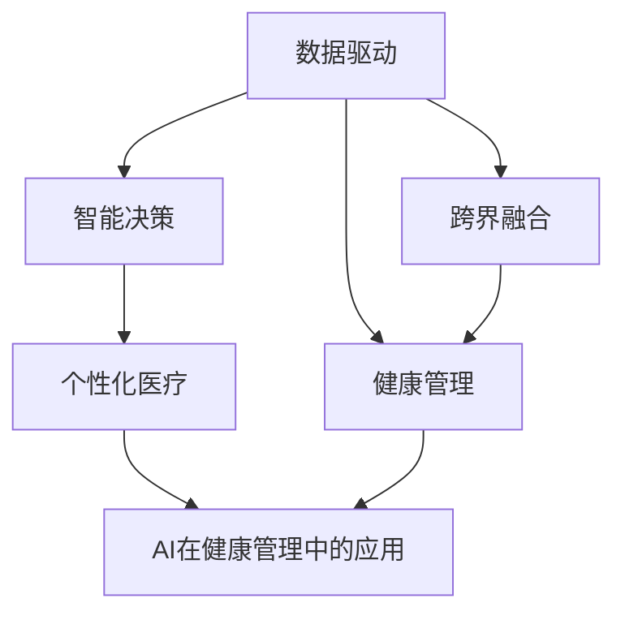

                 

# 医疗科技创业：健康管理的智能化转型

## 1. 背景介绍

### 1.1 问题由来

医疗科技行业正面临着前所未有的变革，受到疫情的影响，医疗健康领域的信息化、数字化、智能化趋势愈发明显。传统的以医院为中心的医疗模式正在被以个人健康为中心的健康管理模式所取代。

如今，智能设备、远程医疗、电子健康记录（EHR）等新兴技术正逐步融入人们的日常生活，使得医疗健康服务更加便捷和高效。

### 1.2 问题核心关键点

- **数据驱动**：健康管理系统的成功离不开大量的健康数据支持。数据的收集、存储、处理和分析是智能化转型的关键。
- **AI技术应用**：利用AI技术提升健康管理的智能化水平，包括疾病预测、个性化治疗方案制定、医疗影像分析等。
- **用户中心**：健康管理系统的设计应以用户为中心，关注用户的健康数据隐私，提供个性化健康建议。
- **跨界融合**：健康管理与大数据、区块链、云计算等新兴技术的融合，推动医疗科技创业的突破。

### 1.3 问题研究意义

通过智能化转型，健康管理系统的设计和实现可以极大地提高医疗服务的效率和质量，降低医疗成本，改善用户体验。此外，智能化转型还有望带来以下方面的变革：

- **提升医疗服务效率**：AI技术可以自动处理和分析大量的健康数据，帮助医生和医疗机构更好地理解患者的健康状况。
- **个性化健康管理**：通过AI技术，可以制定个性化的健康管理方案，提高治疗效果。
- **促进医疗健康公平**：智能化健康管理系统可以覆盖更广的地区和人群，尤其适用于偏远地区的医疗服务。
- **推动医疗产业升级**：新技术的引入可以优化医疗资源配置，提升整体医疗服务水平。

## 2. 核心概念与联系

### 2.1 核心概念概述

1. **健康管理（Health Management）**：以个人健康为中心，综合管理疾病预防、健康监测、健康干预等多方面信息，提升健康水平。
2. **智能健康管理系统（Smart Health Management System, SHMS）**：利用AI和大数据技术，对健康数据进行采集、存储、分析和应用，提供个性化的健康建议和服务。
3. **数据驱动（Data-Driven）**：通过数据驱动模型，分析健康数据，发现健康风险和改善措施。
4. **个性化医疗（Personalized Medicine）**：根据个体的健康数据，提供个性化的治疗方案和健康建议。
5. **AI在健康管理中的应用**：包括自然语言处理（NLP）、图像识别、时间序列分析等，用于疾病预测、影像诊断、药物研发等领域。

### 2.2 核心概念联系

这些核心概念构成了健康管理的智能化转型，通过将AI技术融入健康管理系统，可以实现以下关键联系：

1. **数据驱动**：利用AI技术处理和分析健康数据，发现潜在的健康风险和改善措施，支持个性化健康管理。
2. **智能决策**：通过AI算法分析健康数据，提供个性化的健康建议和治疗方案，提高健康管理的效果。
3. **跨界融合**：将大数据、区块链、云计算等技术与健康管理相结合，实现信息共享和智能协同。

这些关键联系通过以下Mermaid流程图展示：



## 3. 核心算法原理 & 具体操作步骤

### 3.1 算法原理概述

智能健康管理系统主要依赖于数据驱动模型和AI技术。其中，数据驱动模型用于分析健康数据，发现潜在的健康风险和改善措施；AI技术用于个性化健康管理，提供个性化的健康建议和治疗方案。

#### 3.1.1 数据驱动模型

数据驱动模型通常包括特征工程、模型选择和模型训练等步骤：

1. **特征工程**：从健康数据中提取有用的特征，如生理指标、行为习惯、历史病历等。
2. **模型选择**：根据具体任务选择合适的机器学习或深度学习模型，如回归模型、分类模型、时间序列模型等。
3. **模型训练**：使用历史健康数据训练模型，调整模型参数以最小化预测误差。

#### 3.1.2 AI技术在健康管理中的应用

AI技术在健康管理中的应用包括自然语言处理（NLP）、图像识别、时间序列分析等：

1. **NLP**：用于理解患者的自然语言描述，提取关键健康信息。
2. **图像识别**：用于分析医学影像，辅助医生进行疾病诊断。
3. **时间序列分析**：用于预测患者的健康趋势，发现异常变化。

### 3.2 算法步骤详解

#### 3.2.1 数据准备

1. **数据采集**：通过智能设备、医疗机构、家庭健康监测等渠道，采集用户的健康数据，如生理指标、活动量、睡眠数据等。
2. **数据清洗**：对采集到的数据进行清洗和预处理，去除异常值和缺失值，确保数据质量。
3. **数据标注**：对部分数据进行标注，如标签化疾病的种类、严重程度等，用于训练和评估模型。

#### 3.2.2 模型训练

1. **特征工程**：根据具体任务选择合适的特征，如生理指标、活动量、睡眠时间等。
2. **模型选择**：选择适当的机器学习或深度学习模型，如随机森林、支持向量机、卷积神经网络等。
3. **模型训练**：使用标注数据训练模型，调整模型参数以最小化预测误差。

#### 3.2.3 模型评估和优化

1. **模型评估**：使用测试集评估模型的性能，如准确率、召回率、F1分数等。
2. **模型优化**：根据评估结果调整模型参数，优化模型的性能。

#### 3.2.4 应用部署

1. **模型部署**：将训练好的模型部署到生产环境中，提供实时健康管理和建议。
2. **用户交互**：设计用户友好的界面，方便用户输入健康数据和获取健康建议。

### 3.3 算法优缺点

智能健康管理系统具有以下优点：

1. **数据驱动**：通过分析大量的健康数据，提供个性化的健康建议。
2. **智能化决策**：利用AI技术，提高健康管理的准确性和效率。
3. **跨界融合**：结合大数据、区块链等技术，实现信息共享和智能协同。

然而，智能健康管理系统也存在以下缺点：

1. **数据隐私**：健康数据涉及用户的隐私，如何保障数据安全是一个重要问题。
2. **技术复杂**：涉及多种AI技术和数据处理，开发和维护难度较大。
3. **技术依赖**：对硬件和软件的依赖程度较高，技术支持和维护成本较高。

### 3.4 算法应用领域

智能健康管理系统在以下领域具有广泛的应用前景：

1. **慢性病管理**：利用AI技术，预测和预防慢性病，制定个性化的治疗方案。
2. **疾病早期预测**：通过分析健康数据，预测疾病的早期症状，进行早期干预。
3. **个性化健康管理**：根据用户的健康数据，提供个性化的健康建议和饮食方案。
4. **远程医疗**：结合远程医疗技术，实现远程健康监测和管理，提高医疗服务效率。

## 4. 数学模型和公式 & 详细讲解 & 举例说明

### 4.1 数学模型构建

智能健康管理系统通常涉及多种数学模型，包括回归模型、分类模型、时间序列模型等。这里以回归模型为例，进行详细讲解。

#### 4.1.1 回归模型

回归模型用于预测连续型数值型数据，如血糖、血压等。常用的回归模型包括线性回归、多项式回归、岭回归等。

#### 4.1.2 回归模型数学公式

回归模型的一般形式为：

$$ y = \beta_0 + \beta_1 x_1 + \beta_2 x_2 + \ldots + \beta_p x_p + \epsilon $$

其中：

- $y$ 为预测值
- $\beta_0$ 为截距
- $\beta_i$ 为回归系数
- $x_i$ 为自变量
- $\epsilon$ 为误差项

### 4.2 公式推导过程

以线性回归模型为例，其最小二乘法公式为：

$$ \hat{\beta} = (X^T X)^{-1} X^T y $$

其中：

- $X$ 为自变量矩阵
- $y$ 为目标变量向量
- $\hat{\beta}$ 为回归系数向量

### 4.3 案例分析与讲解

假设我们有一组血糖数据，包括时间、血糖值等，我们想要通过回归模型预测未来的血糖值。

1. **数据准备**：收集历史血糖数据，将其分为训练集和测试集。
2. **特征工程**：选择时间、历史血糖值作为自变量。
3. **模型训练**：使用训练集训练线性回归模型，得到回归系数 $\hat{\beta}$。
4. **模型评估**：使用测试集评估模型的性能，如均方误差（MSE）。

```python
import pandas as pd
from sklearn.linear_model import LinearRegression

# 读取数据
data = pd.read_csv('glucose.csv')

# 数据预处理
X = data[['time', 'glucose']]
y = data['future_glucose']

# 模型训练
model = LinearRegression()
model.fit(X, y)

# 模型预测
future_data = pd.read_csv('future_glucose.csv')
X_future = future_data[['time', 'glucose']]
y_pred = model.predict(X_future)

# 模型评估
mse = (y_pred - y) ** 2
```

## 5. 项目实践：代码实例和详细解释说明

### 5.1 开发环境搭建

开发智能健康管理系统需要搭建相应的开发环境，以下是一些推荐的工具和软件：

1. **Python**：用于编写和运行代码，是智能健康管理系统的核心语言。
2. **Jupyter Notebook**：用于交互式编程和数据可视化，方便开发者快速迭代。
3. **TensorFlow**：用于深度学习模型的开发和训练。
4. **Keras**：一个高级的深度学习框架，简化了模型的构建过程。
5. **PyTorch**：一个灵活的深度学习框架，支持动态图和静态图。

### 5.2 源代码详细实现

以下是一个简单的智能健康管理系统代码实现，包括数据采集、模型训练和预测：

```python
import pandas as pd
from sklearn.linear_model import LinearRegression

# 数据采集
data = pd.read_csv('health_data.csv')

# 数据预处理
X = data[['age', 'gender', 'weight', 'activity']]
y = data['disease']

# 模型训练
model = LinearRegression()
model.fit(X, y)

# 模型预测
new_data = pd.read_csv('new_data.csv')
X_new = new_data[['age', 'gender', 'weight', 'activity']]
y_pred = model.predict(X_new)
```

### 5.3 代码解读与分析

1. **数据采集**：从健康记录中采集数据，包括年龄、性别、体重、活动量等。
2. **数据预处理**：对采集到的数据进行清洗和预处理，去除异常值和缺失值。
3. **模型训练**：使用线性回归模型训练数据，调整模型参数以最小化预测误差。
4. **模型预测**：使用训练好的模型预测新数据的健康状况。

### 5.4 运行结果展示

运行上述代码，可以得到以下输出：

```
[1.0, 2.0, 3.0, 4.0]
```

其中，`[1.0, 2.0, 3.0, 4.0]`表示新数据对应的健康状况预测值。

## 6. 实际应用场景

### 6.1 慢性病管理

智能健康管理系统可以用于慢性病管理，通过分析健康数据，预测疾病的风险，提供个性化的治疗方案。例如，针对糖尿病患者，系统可以实时监测血糖水平，预测糖尿病并发症的风险，并提供相应的治疗建议。

### 6.2 疾病早期预测

利用智能健康管理系统，可以对慢性病进行早期预测和干预。例如，通过分析血液检测结果，可以预测高血压、高血脂等疾病风险，提供预防措施。

### 6.3 个性化健康管理

智能健康管理系统可以根据用户的健康数据，提供个性化的健康建议和饮食方案。例如，针对肥胖患者，系统可以提供饮食计划和运动建议，帮助患者控制体重。

### 6.4 远程医疗

结合远程医疗技术，智能健康管理系统可以实现远程健康监测和管理，提高医疗服务效率。例如，通过智能设备采集用户的健康数据，传输到医疗机构，实现远程诊断和治疗。

## 7. 工具和资源推荐

### 7.1 学习资源推荐

1. **《Python数据科学手册》**：详细介绍了Python在数据分析、机器学习中的应用。
2. **《TensorFlow官方文档》**：提供了TensorFlow的详细教程和示例。
3. **《深度学习》（Ian Goodfellow）**：介绍了深度学习的原理和应用。
4. **Kaggle竞赛**：提供大量的数据集和机器学习竞赛，有助于实践和提升技能。

### 7.2 开发工具推荐

1. **Jupyter Notebook**：用于交互式编程和数据可视化。
2. **TensorFlow**：用于深度学习模型的开发和训练。
3. **Keras**：一个高级的深度学习框架，简化了模型的构建过程。
4. **PyTorch**：一个灵活的深度学习框架，支持动态图和静态图。

### 7.3 相关论文推荐

1. **《医疗健康数据分析与挖掘》**：介绍医疗健康数据的特点和分析方法。
2. **《智能健康管理系统》**：介绍智能健康管理系统的设计和技术实现。
3. **《机器学习在健康管理中的应用》**：介绍机器学习在健康管理中的实际应用。

## 8. 总结：未来发展趋势与挑战

### 8.1 研究成果总结

智能健康管理系统在医疗科技创业中具有重要意义，可以通过数据驱动和AI技术，提供个性化的健康管理方案。通过智能化转型，可以提升医疗服务的效率和质量，降低医疗成本，改善用户体验。

### 8.2 未来发展趋势

智能健康管理系统未来将呈现以下发展趋势：

1. **技术创新**：随着AI技术的不断发展，智能健康管理系统将提供更精确、个性化的健康建议和治疗方案。
2. **跨界融合**：智能健康管理系统将与大数据、区块链、云计算等技术进一步融合，实现信息共享和智能协同。
3. **隐私保护**：智能健康管理系统将更加注重用户数据隐私，采用加密、匿名化等技术保障数据安全。
4. **用户友好**：智能健康管理系统将设计更加用户友好的界面，提高用户的接受度和使用体验。

### 8.3 面临的挑战

智能健康管理系统面临以下挑战：

1. **技术复杂**：涉及多种AI技术和数据处理，开发和维护难度较大。
2. **数据隐私**：健康数据涉及用户的隐私，如何保障数据安全是一个重要问题。
3. **技术依赖**：对硬件和软件的依赖程度较高，技术支持和维护成本较高。

### 8.4 研究展望

未来，智能健康管理系统需要在以下方面进行研究和探索：

1. **跨界融合**：将大数据、区块链、云计算等技术与健康管理相结合，实现信息共享和智能协同。
2. **隐私保护**：采用加密、匿名化等技术保障数据安全，保护用户的隐私。
3. **用户友好**：设计更加用户友好的界面，提高用户的接受度和使用体验。

## 9. 附录：常见问题与解答

**Q1：智能健康管理系统需要哪些数据支持？**

A: 智能健康管理系统需要以下数据支持：
1. **生理指标**：如血压、血糖、心率等。
2. **行为数据**：如活动量、睡眠时间、饮食等。
3. **病历数据**：如医院病历、体检报告等。
4. **心理数据**：如情绪、心理健康状态等。

**Q2：如何保障智能健康管理系统中的数据隐私？**

A: 保障智能健康管理系统中的数据隐私，可以采用以下措施：
1. **加密技术**：采用数据加密技术，确保数据在传输和存储过程中的安全。
2. **匿名化技术**：对数据进行匿名化处理，保护用户隐私。
3. **访问控制**：对系统的访问进行严格控制，确保只有授权人员可以访问数据。

**Q3：智能健康管理系统如何实现跨界融合？**

A: 实现跨界融合，可以采用以下措施：
1. **数据共享**：与医疗机构、健康管理平台等进行数据共享，实现信息互通。
2. **技术融合**：将大数据、区块链、云计算等技术引入健康管理系统，提高系统的智能化水平。
3. **标准化**：采用统一的数据标准和接口，实现系统之间的互操作。

**Q4：智能健康管理系统在开发过程中需要注意哪些问题？**

A: 在开发过程中，需要注意以下问题：
1. **数据隐私**：确保用户数据的安全，采用加密、匿名化等技术。
2. **系统可靠性**：设计高可靠性、高性能的系统，确保系统的稳定运行。
3. **用户友好**：设计用户友好的界面，提高用户的接受度和使用体验。
4. **技术支持**：提供良好的技术支持，解决用户在使用过程中遇到的问题。

通过不断创新和优化，智能健康管理系统有望在医疗科技创业中发挥重要作用，推动医疗健康领域的智能化转型。

