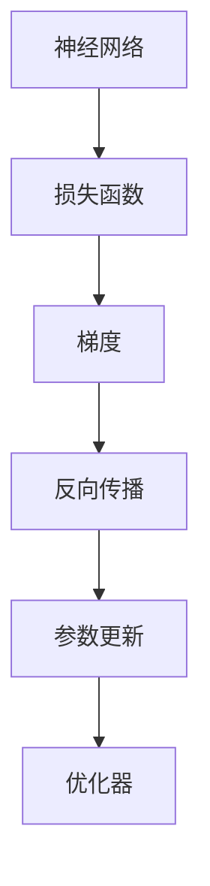

                 

# 反向传播详解：梯度和权重更新

> 关键词：反向传播,梯度,权重更新,神经网络,深度学习

## 1. 背景介绍

深度学习(DL)和神经网络(NN)的发展已经引领了人工智能(AI)领域的飞速进步。而在深度学习中，反向传播(Backpropagation)技术是其中一个核心组成部分，它负责计算梯度，指导神经网络模型的训练过程。本文将深入探讨反向传播算法，详细讲解其原理、步骤、优缺点以及应用场景。

### 1.1 问题由来

深度学习中的神经网络由大量的参数组成，如权重和偏置。训练神经网络的目的就是通过调整这些参数，使得模型的预测输出尽可能接近真实值。在训练过程中，如何高效、准确地计算每个参数的梯度是至关重要的。传统的基于梯度的优化算法如随机梯度下降(SGD)、动量(Momentum)、Adagrad等，都需要计算损失函数对每个参数的梯度。反向传播算法则提供了一种有效计算梯度的方法，使得深度学习模型能够高效地进行训练。

### 1.2 问题核心关键点

本节将介绍几个关键问题点：

- 神经网络的结构和组成
- 反向传播算法的原理和步骤
- 反向传播的计算过程和梯度更新规则
- 反向传播的优缺点和适用场景

这些关键点共同构成了反向传播算法的核心内容，有助于理解其工作原理和实际应用。

## 2. 核心概念与联系

### 2.1 核心概念概述

为更好地理解反向传播算法，本节将介绍几个密切相关的核心概念：

- 神经网络：一种计算模型，由大量的人工神经元组成，通过权重和偏置实现输入到输出的映射。
- 损失函数：用于衡量模型预测值与真实值之间的差异，如均方误差(MSE)、交叉熵(Cross-Entropy)等。
- 梯度：损失函数对模型参数的偏导数，指导模型参数更新方向。
- 反向传播：通过链式法则计算梯度，反向传播从输出到输入计算每个参数的梯度。
- 优化器：用于调整模型参数的算法，如SGD、Adam等。
- 损失函数对模型参数的导数：用于计算梯度，指导模型参数的更新。

这些核心概念之间的逻辑关系可以通过以下Mermaid流程图来展示：



这个流程图展示了几何概念之间的逻辑关系：

1. 神经网络将输入映射到输出，损失函数衡量预测与真实之间的差异。
2. 通过反向传播算法计算梯度。
3. 梯度指导优化器更新模型参数。

## 3. 核心算法原理 & 具体操作步骤

### 3.1 算法原理概述

反向传播算法是一种基于梯度下降的优化算法，主要用于神经网络模型的参数优化。其核心思想是利用链式法则计算损失函数对每个参数的梯度，从而指导模型参数的更新。反向传播算法的基本步骤为：

1. 前向传播：输入数据通过网络得到输出。
2. 计算损失函数：计算预测值与真实值之间的差异。
3. 反向传播：从输出到输入，计算每个参数的梯度。
4. 参数更新：根据梯度更新模型参数。

### 3.2 算法步骤详解

反向传播算法的详细步骤可以归纳为以下几步：

**Step 1: 前向传播**

1. 输入数据 $x$ 通过神经网络得到输出 $y$，即：

$$
y=f(w_1, w_2, \cdots, w_n; x)
$$

其中 $w_i$ 表示第 $i$ 层网络的权重，$f$ 表示激活函数。

2. 计算输出与真实标签之间的损失函数 $L$，如：

$$
L=Loss(y, \hat{y})
$$

其中 $Loss$ 表示损失函数，$\hat{y}$ 表示真实标签。

**Step 2: 反向传播**

1. 从输出层开始，利用链式法则计算每个参数的梯度，即：

$$
\frac{\partial L}{\partial w_i}=\frac{\partial L}{\partial y}\frac{\partial y}{\partial w_i}
$$

其中 $\frac{\partial L}{\partial y}$ 表示损失函数对输出 $y$ 的偏导数，$\frac{\partial y}{\partial w_i}$ 表示输出 $y$ 对权重 $w_i$ 的偏导数。

2. 继续反向传播，直到计算出所有参数的梯度。

**Step 3: 梯度更新**

1. 根据梯度更新模型参数：

$$
w_i \leftarrow w_i-\eta \frac{\partial L}{\partial w_i}
$$

其中 $\eta$ 为学习率，$\frac{\partial L}{\partial w_i}$ 为梯度。

2. 重复上述步骤，直到损失函数收敛或达到预设的迭代次数。

### 3.3 算法优缺点

反向传播算法具有以下优点：

1. 高效：通过链式法则，可以高效地计算梯度，指导模型参数的更新。
2. 简单：原理简单，易于理解和实现。
3. 可扩展：适用于任意深度的神经网络，可以轻松扩展到大型模型。

同时，反向传播算法也存在一些缺点：

1. 计算复杂：反向传播需要计算大量的梯度，计算复杂度较高。
2. 梯度消失和爆炸：当神经网络层数较多时，梯度可能会消失或爆炸，影响模型训练。
3. 局部最优：反向传播算法存在陷入局部最优的风险。

### 3.4 算法应用领域

反向传播算法在深度学习中得到了广泛的应用，特别是在图像识别、自然语言处理、语音识别等领域。以下是几个典型的应用场景：

- 图像分类：通过反向传播训练卷积神经网络(CNN)模型，实现图像分类。
- 机器翻译：通过反向传播训练序列到序列模型，实现机器翻译。
- 语音识别：通过反向传播训练循环神经网络(RNN)模型，实现语音识别。
- 自然语言处理：通过反向传播训练递归神经网络(RNN)或Transformer模型，实现文本分类、语言建模等任务。

## 4. 数学模型和公式 & 详细讲解 & 举例说明

### 4.1 数学模型构建

基于反向传播算法的数学模型构建，一般需要以下步骤：

1. 定义神经网络模型：$y=f(w_1, w_2, \cdots, w_n; x)$。
2. 定义损失函数：$L=Loss(y, \hat{y})$。
3. 定义梯度：$\frac{\partial L}{\partial w_i}$。
4. 定义参数更新规则：$w_i \leftarrow w_i-\eta \frac{\partial L}{\partial w_i}$。

### 4.2 公式推导过程

下面以一个简单的线性回归模型为例，推导反向传播算法的梯度计算公式。

假设模型的输入为 $x$，输出为 $y$，损失函数为均方误差(MSE)，即：

$$
L=\frac{1}{2}\sum_{i=1}^{N}(y_i-\hat{y}_i)^2
$$

其中 $N$ 表示样本数，$y_i$ 表示第 $i$ 个样本的真实值，$\hat{y}_i$ 表示模型的预测值。

定义神经网络的激活函数为 $f(w_1, w_2; x)=w_1x+w_2$。

通过前向传播计算输出：

$$
y=f(w_1, w_2; x)=w_1x+w_2
$$

计算损失函数：

$$
L=\frac{1}{2}\sum_{i=1}^{N}(y_i-w_1x_i-w_2)^2
$$

其中 $x_i$ 表示第 $i$ 个样本的输入。

**Step 2: 反向传播**

计算梯度 $\frac{\partial L}{\partial w_1}$ 和 $\frac{\partial L}{\partial w_2}$。

先计算 $\frac{\partial L}{\partial y}$：

$$
\frac{\partial L}{\partial y}=-\sum_{i=1}^{N}(y_i-w_1x_i-w_2)
$$

再计算 $\frac{\partial y}{\partial w_1}$：

$$
\frac{\partial y}{\partial w_1}=x
$$

根据链式法则，计算梯度 $\frac{\partial L}{\partial w_1}$：

$$
\frac{\partial L}{\partial w_1}=\frac{\partial L}{\partial y}\frac{\partial y}{\partial w_1}=-\sum_{i=1}^{N}(y_i-w_1x_i-w_2)x_i
$$

同理，计算梯度 $\frac{\partial L}{\partial w_2}$：

$$
\frac{\partial L}{\partial w_2}=-\sum_{i=1}^{N}(y_i-w_1x_i-w_2)
$$

**Step 3: 梯度更新**

根据梯度更新模型参数：

$$
w_1 \leftarrow w_1-\eta \frac{\partial L}{\partial w_1}
$$

$$
w_2 \leftarrow w_2-\eta \frac{\partial L}{\partial w_2}
$$

其中 $\eta$ 为学习率。

### 4.3 案例分析与讲解

以下是一个简单的案例，展示如何使用反向传播算法训练一个线性回归模型。

假设我们有 $N=10$ 个样本，每个样本 $(x_i, y_i)$ 如下：

| x | y |
|---|---|
| 1 | 2 |
| 2 | 4 |
| 3 | 6 |
| 4 | 8 |
| 5 | 10 |
| 6 | 12 |
| 7 | 14 |
| 8 | 16 |
| 9 | 18 |
| 10 | 20 |

定义神经网络的激活函数为 $f(w_1, w_2; x)=w_1x+w_2$。

假设初始权重 $w_1=1$，$w_2=0$。

**Step 1: 前向传播**

计算每个样本的输出 $y_i$：

| x | y | y |
|---|---|---|
| 1 | 1 | 2 |
| 2 | 2 | 4 |
| 3 | 3 | 6 |
| 4 | 4 | 8 |
| 5 | 5 | 10 |
| 6 | 6 | 12 |
| 7 | 7 | 14 |
| 8 | 8 | 16 |
| 9 | 9 | 18 |
| 10 | 10 | 20 |

**Step 2: 反向传播**

计算梯度 $\frac{\partial L}{\partial w_1}$ 和 $\frac{\partial L}{\partial w_2}$：

$$
\frac{\partial L}{\partial w_1}=-\sum_{i=1}^{N}(y_i-w_1x_i-w_2)x_i=-\sum_{i=1}^{N}(y_i-w_1x_i-w_2)x_i
$$

$$
\frac{\partial L}{\partial w_2}=-\sum_{i=1}^{N}(y_i-w_1x_i-w_2)=-\sum_{i=1}^{N}(y_i-w_1x_i-w_2)
$$

**Step 3: 梯度更新**

更新权重 $w_1$ 和 $w_2$：

$$
w_1 \leftarrow w_1-\eta \frac{\partial L}{\partial w_1}
$$

$$
w_2 \leftarrow w_2-\eta \frac{\partial L}{\partial w_2}
$$

其中 $\eta=0.1$。

经过多次迭代后，可以收敛到最优权重，使得模型的预测输出尽可能接近真实值。

## 5. 项目实践：代码实例和详细解释说明

### 5.1 开发环境搭建

在进行反向传播算法实践前，我们需要准备好开发环境。以下是使用Python进行PyTorch开发的环境配置流程：

1. 安装Anaconda：从官网下载并安装Anaconda，用于创建独立的Python环境。

2. 创建并激活虚拟环境：
```bash
conda create -n pytorch-env python=3.8 
conda activate pytorch-env
```

3. 安装PyTorch：根据CUDA版本，从官网获取对应的安装命令。例如：
```bash
conda install pytorch torchvision torchaudio cudatoolkit=11.1 -c pytorch -c conda-forge
```

4. 安装TensorBoard：
```bash
pip install tensorboard
```

5. 安装PyTorch Lightning：
```bash
pip install pytorch-lightning
```

完成上述步骤后，即可在`pytorch-env`环境中开始反向传播算法的实践。

### 5.2 源代码详细实现

下面是使用PyTorch实现反向传播算法的代码实现。

```python
import torch
import torch.nn as nn
import torch.optim as optim
from torch.utils.data import TensorDataset, DataLoader
from torch.autograd import Variable

# 定义神经网络模型
class LinearModel(nn.Module):
    def __init__(self):
        super(LinearModel, self).__init__()
        self.linear = nn.Linear(1, 1)

    def forward(self, x):
        return self.linear(x)

# 定义损失函数
def mse_loss(y_true, y_pred):
    return torch.mean((y_true - y_pred) ** 2)

# 定义反向传播算法
def backpropagation(model, loss_func, optimizer, x_train, y_train, x_test, y_test):
    # 前向传播
    y_pred = model(x_train)
    loss = loss_func(y_pred, y_train)

    # 反向传播
    grads = torch.autograd.grad(loss, model.parameters(), create_graph=True)

    # 参数更新
    optimizer.zero_grad()
    optimizer.step()

    # 测试
    y_pred = model(x_test)
    y_true = y_test
    loss = loss_func(y_pred, y_true)

    return loss.item(), y_pred

# 数据准备
x_train = torch.tensor([[1], [2], [3], [4], [5], [6], [7], [8], [9], [10]])
y_train = torch.tensor([[2], [4], [6], [8], [10], [12], [14], [16], [18], [20]])
x_test = torch.tensor([[1], [2], [3], [4], [5], [6], [7], [8], [9], [10]])
y_test = torch.tensor([[2], [4], [6], [8], [10], [12], [14], [16], [18], [20]])

# 模型构建
model = LinearModel()

# 损失函数和优化器
loss_func = nn.MSELoss()
optimizer = optim.SGD(model.parameters(), lr=0.1)

# 训练
for epoch in range(100):
    loss, y_pred = backpropagation(model, loss_func, optimizer, x_train, y_train, x_test, y_test)

    if (epoch + 1) % 10 == 0:
        print('Epoch %d, Loss: %.4f' % (epoch + 1, loss))

# 测试
print('Test Loss:', loss_func(y_pred, y_test).item())
```

### 5.3 代码解读与分析

让我们再详细解读一下关键代码的实现细节：

**LinearModel类**：
- `__init__`方法：定义神经网络模型，包含一个线性层。
- `forward`方法：前向传播计算模型输出。

**mse_loss函数**：
- 定义均方误差损失函数。

**backpropagation函数**：
- 进行前向传播和反向传播，计算梯度并更新模型参数。
- 输出损失值和模型预测值。

**数据准备**：
- 定义训练集和测试集的输入和输出。

**模型构建**：
- 定义线性模型，并初始化权重和偏置。

**损失函数和优化器**：
- 定义均方误差损失函数和随机梯度下降优化器。

**训练和测试**：
- 进行多次迭代，更新模型参数，并输出训练和测试结果。

可以看出，反向传播算法的代码实现相对简单，主要涉及模型的前向传播和反向传播，以及损失函数和优化器的定义。通过这一小段代码，可以直观理解反向传播算法的核心步骤。

## 6. 实际应用场景

### 6.1 智能推荐系统

智能推荐系统利用反向传播算法训练模型，通过分析用户行为和历史记录，预测用户可能感兴趣的内容。例如，电商网站可以根据用户的购买记录，反向传播算法训练用户画像模型，预测用户对不同商品的兴趣度，从而实现精准推荐。

在技术实现上，可以使用反向传播算法训练深度神经网络，如卷积神经网络(CNN)或循环神经网络(RNN)，处理大量的用户行为数据。通过反向传播算法优化模型参数，使得推荐系统能够更好地理解用户偏好，提高推荐的准确性和个性化程度。

### 6.2 语音识别

语音识别技术通过反向传播算法训练神经网络模型，将语音信号转换成文本。例如，智能音箱可以通过反向传播算法训练语音识别模型，识别用户的语音指令，并执行相应的操作。

在技术实现上，可以使用反向传播算法训练序列到序列模型，如循环神经网络(RNN)或长短期记忆网络(LSTM)，处理语音信号和文本的映射关系。通过反向传播算法优化模型参数，使得语音识别系统能够准确识别不同的语音命令，实现自然语言交互。

### 6.3 图像识别

图像识别技术通过反向传播算法训练神经网络模型，将图像转换成分类结果。例如，自动驾驶系统可以通过反向传播算法训练图像分类模型，识别交通标志、行人、车辆等目标，辅助驾驶员进行安全驾驶。

在技术实现上，可以使用反向传播算法训练卷积神经网络(CNN)模型，处理图像像素和分类的映射关系。通过反向传播算法优化模型参数，使得图像识别系统能够准确识别不同的图像对象，提高驾驶安全性。

## 7. 工具和资源推荐

### 7.1 学习资源推荐

为了帮助开发者系统掌握反向传播算法的理论基础和实践技巧，这里推荐一些优质的学习资源：

1. 《深度学习》系列书籍：Ian Goodfellow、Yoshua Bengio和Aaron Courville所著，系统介绍了深度学习的基本原理和算法，包括反向传播算法。

2. CS231n《卷积神经网络》课程：斯坦福大学开设的深度学习课程，讲解了卷积神经网络的结构和反向传播算法。

3. PyTorch官方文档：PyTorch的官方文档，提供了详细的反向传播算法实现和优化技巧。

4. TensorFlow官方文档：TensorFlow的官方文档，讲解了反向传播算法的实现和优化。

5. Deep Learning Specialization：由Andrew Ng教授主讲的深度学习课程，系统介绍了反向传播算法和神经网络模型。

通过这些资源的学习实践，相信你一定能够快速掌握反向传播算法的精髓，并用于解决实际的深度学习问题。

### 7.2 开发工具推荐

高效的开发离不开优秀的工具支持。以下是几款用于反向传播算法开发的常用工具：

1. PyTorch：基于Python的开源深度学习框架，灵活动态的计算图，适合快速迭代研究。

2. TensorFlow：由Google主导开发的开源深度学习框架，生产部署方便，适合大规模工程应用。

3. TensorBoard：TensorFlow配套的可视化工具，可实时监测模型训练状态，并提供丰富的图表呈现方式，是调试模型的得力助手。

4. PyTorch Lightning：PyTorch的扩展库，提供了一站式深度学习框架，简化了模型训练的实现。

5. Keras：高层次深度学习框架，易于上手，适合快速原型开发和模型实验。

合理利用这些工具，可以显著提升反向传播算法的开发效率，加快创新迭代的步伐。

### 7.3 相关论文推荐

反向传播算法是深度学习中的重要组成部分，其发展历程和应用场景需要结合最新的研究成果。以下是几篇代表性的相关论文，推荐阅读：

1. "Backpropagation: Application of the chain rule to minimize a common loss function for artificial neural networks"：Yoshua Bengio、Geoffrey Hinton和Ronald J. Williams发表在Neural Computation上的论文，系统介绍了反向传播算法的原理和实现。

2. "Deep Learning"：Ian Goodfellow、Yoshua Bengio和Aaron Courville所著，详细讲解了反向传播算法和深度神经网络模型的构建。

3. "A Taxonomy of Deep Learning Algorithms"：Chandra Sekhar Sripada等人发表在IEEE交易上的论文，总结了深度学习中的各种算法和架构，包括反向传播算法。

4. "Training Recurrent Neural Networks for Image Processing"：Geoffrey Hinton等人发表在The IEEE Transactions on Neural Networks上的论文，探讨了反向传播算法在图像处理中的应用。

5. "A Tutorial on Deep Learning with Python: A Deep Dive into Keras and TensorFlow"：Francesca De Freitas等人发表在IEEE交易上的论文，系统介绍了使用Keras和TensorFlow进行深度学习模型的构建和训练。

这些论文代表了大语言模型微调技术的发展脉络。通过学习这些前沿成果，可以帮助研究者把握学科前进方向，激发更多的创新灵感。

## 8. 总结：未来发展趋势与挑战

### 8.1 总结

本文对反向传播算法进行了全面系统的介绍。首先阐述了反向传播算法的背景和意义，明确了其在深度学习模型训练中的核心作用。其次，从原理到实践，详细讲解了反向传播算法的数学模型和实现过程，给出了反向传播算法的代码实例。同时，本文还广泛探讨了反向传播算法在智能推荐、语音识别、图像识别等领域的实际应用，展示了其广阔的应用前景。此外，本文精选了反向传播算法的各类学习资源，力求为读者提供全方位的技术指引。

通过本文的系统梳理，可以看到，反向传播算法在深度学习中的重要地位，以及其在优化模型参数、提高模型性能方面的重要作用。未来，伴随深度学习模型的不断发展，反向传播算法也将持续演进，为深度学习应用带来更多的创新和突破。

### 8.2 未来发展趋势

展望未来，反向传播算法将呈现以下几个发展趋势：

1. 深度神经网络结构的不断演进。随着深度学习模型的不断发展，反向传播算法需要支持更加复杂的神经网络结构，如Transformer、卷积神经网络等，以适应大规模数据和复杂任务。

2. 高效反向传播算法的出现。为了提高训练速度和资源利用率，反向传播算法将不断优化，如引入量化加速、混合精度训练等，使得深度学习模型能够在大规模数据上高效训练。

3. 反向传播算法的泛化能力提升。反向传播算法将结合更多的先验知识，如因果推理、注意力机制等，增强模型的泛化能力，使其能够更好地适应不同任务和数据分布。

4. 反向传播算法的多样化应用。反向传播算法将不仅仅应用于神经网络模型训练，还将应用于模型优化、异常检测、强化学习等更多领域，拓展其应用范围。

5. 反向传播算法的可解释性增强。为了满足实际应用中对可解释性的需求，反向传播算法将引入更多的可视化工具和方法，增强其可解释性和透明性。

以上趋势凸显了反向传播算法的广阔前景。这些方向的探索发展，必将进一步提升深度学习模型的性能和应用范围，为深度学习技术在各个领域的应用提供更多可能性。

### 8.3 面临的挑战

尽管反向传播算法已经取得了瞩目成就，但在迈向更加智能化、普适化应用的过程中，它仍面临着诸多挑战：

1. 计算复杂度高。反向传播算法需要计算大量的梯度，计算复杂度较高，难以在大规模数据上高效训练。

2. 模型鲁棒性不足。反向传播算法训练的模型对噪声和异常数据较为敏感，难以处理复杂多变的数据分布。

3. 训练过程易陷入局部最优。反向传播算法存在陷入局部最优的风险，难以保证模型的全局最优性。

4. 模型参数量大。反向传播算法训练的模型参数量大，难以在资源有限的设备上进行高效训练。

5. 可解释性不足。反向传播算法训练的模型往往是"黑盒"系统，难以解释其内部工作机制和决策逻辑。

6. 安全性有待保障。反向传播算法训练的模型可能学习到有害信息，存在安全隐患。

正视反向传播算法面临的这些挑战，积极应对并寻求突破，将是大语言模型微调走向成熟的必由之路。相信随着学界和产业界的共同努力，这些挑战终将一一被克服，反向传播算法必将在构建安全、可靠、可解释、可控的智能系统铺平道路。

### 8.4 研究展望

面对反向传播算法所面临的种种挑战，未来的研究需要在以下几个方面寻求新的突破：

1. 探索更高效、更可扩展的反向传播算法。开发更加高效、灵活、可扩展的反向传播算法，支持更大规模的数据和更复杂的神经网络结构。

2. 引入更多先验知识。将符号化的先验知识，如知识图谱、逻辑规则等，与神经网络模型进行巧妙融合，增强模型的泛化能力和鲁棒性。

3. 结合因果分析和博弈论工具。将因果分析方法引入反向传播算法，识别出模型决策的关键特征，增强输出解释的因果性和逻辑性。

4. 纳入伦理道德约束。在模型训练目标中引入伦理导向的评估指标，过滤和惩罚有害的输出倾向，确保模型输出的安全性和公正性。

这些研究方向的探索，必将引领反向传播算法技术迈向更高的台阶，为深度学习技术在各个领域的应用提供更多可能性。面向未来，反向传播算法需要与其他人工智能技术进行更深入的融合，如知识表示、因果推理、强化学习等，多路径协同发力，共同推动深度学习技术的进步。

## 9. 附录：常见问题与解答

**Q1：什么是反向传播算法？**

A: 反向传播算法是一种基于梯度下降的优化算法，主要用于神经网络模型的参数优化。其核心思想是利用链式法则计算损失函数对每个参数的梯度，从而指导模型参数的更新。

**Q2：反向传播算法的计算复杂度是多少？**

A: 反向传播算法需要计算大量的梯度，计算复杂度较高。一般而言，反向传播算法的计算复杂度与网络深度和宽度相关，计算复杂度为 $O(n^3)$，其中 $n$ 表示神经网络中的参数数。

**Q3：反向传播算法中的梯度消失和爆炸问题如何解决？**

A: 梯度消失和爆炸是反向传播算法中的常见问题，主要出现在神经网络层数较多时。为了解决梯度消失问题，可以采用ReLU等激活函数，引入Batch Normalization等技术。为解决梯度爆炸问题，可以采用梯度裁剪、权重衰减等技术。

**Q4：反向传播算法中的学习率如何设置？**

A: 学习率的设置是反向传播算法中的关键因素。一般而言，学习率越大，收敛速度越快，但容易过拟合；学习率越小，收敛速度越慢，但可能收敛到局部最优。通常建议采用学习率衰减策略，逐步减小学习率。

**Q5：反向传播算法中的正则化技术有哪些？**

A: 正则化技术可以避免模型过拟合，常用的正则化技术包括L1正则化、L2正则化、Dropout等。这些正则化技术可以结合反向传播算法，在训练过程中控制模型参数的大小，增强模型的泛化能力。

通过这些资源的学习实践，相信你一定能够快速掌握反向传播算法的精髓，并用于解决实际的深度学习问题。

---

作者：禅与计算机程序设计艺术 / Zen and the Art of Computer Programming

