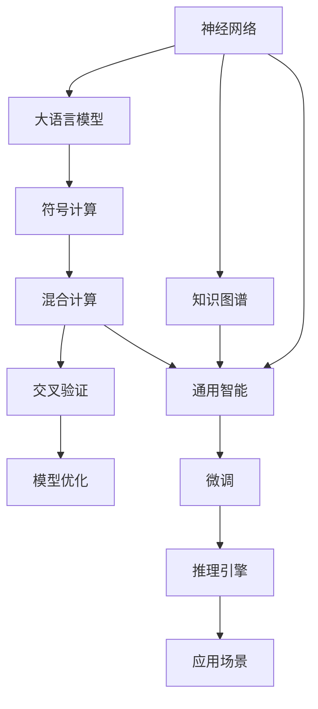

                 

# 图灵完备LLM:通向AGI的关键一步

> 关键词：图灵完备语言模型, AGI, 神经网络, 复杂系统, 深度学习, 符号计算

## 1. 背景介绍

### 1.1 问题由来
近年来，深度学习在人工智能领域取得了显著进展，尤其是自然语言处理(NLP)领域，基于大模型的大语言模型(Large Language Model, LLM)展现了强大的语言理解和生成能力。这些大语言模型通过在大规模无标签文本数据上进行预训练，学习到丰富的语言知识和常识，能够自动完成诸如对话、翻译、摘要、情感分析等任务。

然而，当前的大语言模型还远未达到通用人工智能(AGI)的标准。AGI通常被定义为能够执行任何智能任务的人工智能系统，包括数学、物理、编程、绘画等多种领域。而目前的大语言模型在解决复杂逻辑推理、跨领域知识迁移、常识推理等方面仍存在较大局限性。因此，如何在大语言模型的基础上，进一步增强其通用智能能力，成为当前AI研究的热点问题。

### 1.2 问题核心关键点
目前，大语言模型主要存在以下几个关键问题：
- 知识局限：大语言模型缺乏明确的常识知识和跨领域知识，只能依靠数据驱动的统计规律进行推理。
- 逻辑推理能力不足：尽管能够处理语言描述，但对于复杂的逻辑推理问题，如数学证明、科学推导等，表现仍显不足。
- 跨领域知识迁移能力有限：大模型在特定领域上的微调通常只适用于该领域，无法进行更广泛的跨领域知识迁移。
- 计算资源消耗大：大规模语言模型需要大量的计算资源进行预训练和微调，部署和推理成本较高。
- 安全性与可解释性问题：预训练模型可能携带潜在的偏见和有害信息，同时在推理过程中缺乏足够的可解释性。

为解决上述问题，研究者提出了许多创新的思路，如神经符号计算、知识图谱与语言模型的结合、跨领域知识迁移等。其中，“图灵完备”(图灵完备性)的提出，为实现大语言模型的通用智能能力提供了新的方向。

## 2. 核心概念与联系

### 2.1 核心概念概述

为更好地理解图灵完备性，本节将介绍几个关键核心概念：

- 图灵完备性(Turing Completeness)：如果系统能够执行任意算法，则称该系统为图灵完备的。在人工智能领域，图灵完备意味着系统能够执行任何智能任务。
- 神经网络(Neural Networks)：由节点和边构成的非线性映射，能够高效处理大量数据，广泛应用于深度学习任务中。
- 大语言模型(Large Language Models)：通过在大规模无标签文本数据上进行预训练，学习到丰富的语言知识和常识，能够自动完成各种自然语言处理任务的大规模模型。
- 通用人工智能(AGI)：一种能够执行任何智能任务的人工智能系统，包括数学、物理、编程、绘画等多种领域。
- 符号计算(Symbolic Computation)：使用符号进行计算的数学工具，包括代数、逻辑等数学基础领域。
- 混合计算(Hybrid Computation)：结合神经网络和符号计算的特点，利用各自的优势处理不同类型的计算任务。

这些概念之间存在着紧密的联系，构建了一个完整的图灵完备大语言模型的框架，其核心思想是通过符号计算和神经网络计算的混合，实现语言的通用智能能力。

### 2.2 核心概念原理和架构的 Mermaid 流程图



该流程图展示了大语言模型图灵完备性的核心概念和架构：

1. 神经网络和大语言模型提供了强大的数据处理能力，用于预训练和微调。
2. 符号计算与混合计算结合，构建了语言的逻辑推理和知识迁移能力。
3. 知识图谱提供了结构化的知识库，增强了模型对特定领域的理解。
4. 微调和推理引擎用于提升模型在特定任务上的表现，并能够进行灵活推理。
5. 应用场景展示了图灵完备大语言模型的广泛适用性。

## 3. 核心算法原理 & 具体操作步骤

### 3.1 算法原理概述

图灵完备大语言模型的核心思想是通过神经网络和符号计算的混合，实现语言的通用智能能力。其基本原理如下：

1. 首先在大规模无标签文本数据上进行预训练，学习到丰富的语言知识和常识。
2. 然后结合符号计算，利用预训练的知识进行复杂逻辑推理和知识迁移。
3. 通过混合计算，将符号计算与神经网络计算的优势相结合，增强模型的通用智能能力。
4. 使用微调方法，在大规模标注数据上进行有监督学习，提升模型在特定任务上的性能。
5. 最终构建出具有通用智能能力的大语言模型。

形式化地，设大语言模型为 $M_{\theta}$，其中 $\theta$ 为模型参数。符号计算函数为 $S(\cdot)$，知识图谱为 $G$。假设符号计算与神经网络混合计算函数为 $H(\cdot)$，则大语言模型图灵完备的数学模型为：

$$
M_{\theta} = H(S(\cdot), M_{\theta})
$$

其中，$S(\cdot)$ 将符号计算与神经网络计算结合，$H(\cdot)$ 表示混合计算过程。通过预训练和微调，使得 $M_{\theta}$ 能够执行任何智能任务。

### 3.2 算法步骤详解

基于图灵完备性的大语言模型构建一般包括以下几个关键步骤：

**Step 1: 准备预训练模型和数据集**
- 选择合适的预训练语言模型 $M_{\theta}$ 作为初始化参数，如 BERT、GPT 等。
- 准备大规模无标签文本数据集，用于预训练模型。
- 准备大规模标注数据集，用于微调模型。

**Step 2: 设计符号计算功能**
- 根据任务类型，设计符号计算功能 $S(\cdot)$，用于实现复杂的逻辑推理和知识迁移。
- 将符号计算与神经网络计算相结合，设计混合计算函数 $H(\cdot)$。
- 设计知识图谱 $G$，包含结构化的知识库，用于增强模型的领域知识。

**Step 3: 设置微调超参数**
- 选择合适的优化算法及其参数，如 AdamW、SGD 等，设置学习率、批大小、迭代轮数等。
- 设置正则化技术及强度，包括权重衰减、Dropout、Early Stopping 等。
- 确定冻结预训练参数的策略，如仅微调顶层，或全部参数都参与微调。

**Step 4: 执行梯度训练**
- 将训练集数据分批次输入模型，前向传播计算损失函数。
- 反向传播计算参数梯度，根据设定的优化算法和学习率更新模型参数。
- 周期性在验证集上评估模型性能，根据性能指标决定是否触发 Early Stopping。
- 重复上述步骤直到满足预设的迭代轮数或 Early Stopping 条件。

**Step 5: 测试和部署**
- 在测试集上评估微调后模型 $M_{\hat{\theta}}$ 的性能，对比微调前后的精度提升。
- 使用微调后的模型对新样本进行推理预测，集成到实际的应用系统中。
- 持续收集新的数据，定期重新微调模型，以适应数据分布的变化。

### 3.3 算法优缺点

基于图灵完备性的大语言模型具有以下优点：
1. 通用智能能力：通过符号计算与神经网络计算的结合，模型具备更强的逻辑推理和知识迁移能力。
2. 多领域适应：能够同时处理多个领域的知识，提高跨领域迁移能力。
3. 高效优化：利用微调方法，只需少量标注数据即可实现高性能。
4. 轻量级推理：通过混合计算，模型推理效率较高，适合实际应用。

同时，该方法也存在一些局限性：
1. 符号计算复杂：符号计算本身较为复杂，可能会增加推理计算的负担。
2. 数据量需求大：预训练和微调需要大量数据，对数据质量和规模要求较高。
3. 实现难度高：符号计算与神经网络混合计算的实现难度较大，需要深入的跨学科知识。
4. 可解释性不足：混合计算的内部机制较为复杂，难以进行直观解释。

尽管存在这些局限性，但就目前而言，基于图灵完备性的大语言模型仍是实现通用智能能力的重要方向。未来相关研究的重点在于如何进一步简化符号计算过程，提高模型的可解释性，同时兼顾逻辑推理和知识迁移能力。

### 3.4 算法应用领域

基于图灵完备性的大语言模型已经在多个领域展现出广泛的应用前景，例如：

- 数学与科学计算：利用符号计算和混合计算，实现复杂的数学推导和科学计算。
- 法律与金融分析：结合知识图谱，进行复杂的逻辑推理和法律推理。
- 医疗与生物学：利用领域知识图谱和逻辑推理，辅助医疗诊断和治疗方案设计。
- 工业与自动化：通过混合计算，实现工业过程的自动控制和优化。
- 教育与培训：辅助教育内容生成和个性化教学，提高教育效果。
- 游戏与娱乐：利用混合计算和知识图谱，实现智能游戏和娱乐内容的生成。

除了上述这些经典应用外，图灵完备大语言模型还被创新性地应用到更多场景中，如智能问答、推荐系统、自然语言生成等，为人工智能技术带来了全新的突破。随着预训练模型和混合计算方法的不断进步，相信图灵完备大语言模型必将在更广阔的应用领域大放异彩。

## 4. 数学模型和公式 & 详细讲解 & 举例说明

### 4.1 数学模型构建

本节将使用数学语言对基于图灵完备性的大语言模型进行更严格的刻画。

设大语言模型为 $M_{\theta}$，其中 $\theta$ 为模型参数。符号计算函数为 $S(\cdot)$，知识图谱为 $G$。假设符号计算与神经网络混合计算函数为 $H(\cdot)$，则大语言模型图灵完备的数学模型为：

$$
M_{\theta} = H(S(\cdot), M_{\theta})
$$

其中，$S(\cdot)$ 将符号计算与神经网络计算结合，$H(\cdot)$ 表示混合计算过程。

### 4.2 公式推导过程

以下我们以一个简单的数学问题为例，推导图灵完备大语言模型的推理过程。

假设任务是从给定的方程式中求解变量 $x$ 的值。给定的方程式为：

$$
3x + 4 = 19
$$

大语言模型的任务是通过符号计算和混合计算求解 $x$ 的值。首先，将方程式转化为符号表达式，然后使用符号计算函数 $S(\cdot)$ 进行推导：

$$
S(\cdot): 3x + 4 = 19 \rightarrow x = \frac{19 - 4}{3}
$$

将符号计算结果代入神经网络进行计算：

$$
M_{\theta}(\frac{15}{3}) = 5
$$

最终得到 $x$ 的值为 5。整个推理过程可以表示为：

$$
M_{\theta} = H(S(\cdot), M_{\theta}) = M_{\theta}(\frac{15}{3}) = 5
$$

其中，$H(\cdot)$ 表示混合计算过程，$S(\cdot)$ 表示符号计算函数，$M_{\theta}$ 表示神经网络模型。

### 4.3 案例分析与讲解

我们可以利用大语言模型和符号计算函数来求解复杂的数学问题。以斐波那契数列为例：

假设要求解斐波那契数列的第 $n$ 项，给定的方程式为：

$$
F_n = \left\{
\begin{array}{ll}
0 & n=0 \\
1 & n=1 \\
F_{n-1} + F_{n-2} & n > 1
\end{array}
\right.
$$

我们可以将上述方程式转化为符号表达式：

$$
S(\cdot): F_n = \left\{
\begin{array}{ll}
0 & n=0 \\
1 & n=1 \\
F_{n-1} + F_{n-2} & n > 1
\end{array}
\right. \rightarrow F_n = \left\{
\begin{array}{ll}
0 & n=0 \\
1 & n=1 \\
H(S(\cdot), M_{\theta}) & n > 1
\end{array}
\right.
$$

将符号计算结果代入神经网络进行计算：

$$
M_{\theta}(n) = H(S(\cdot), M_{\theta})
$$

其中，$H(\cdot)$ 表示混合计算过程，$S(\cdot)$ 表示符号计算函数，$M_{\theta}$ 表示神经网络模型。

通过这种方式，我们可以利用大语言模型和符号计算函数，实现复杂的数学问题求解。这一过程展示了图灵完备大语言模型的强大推理能力，也是其应用于通用智能的重要基础。

## 5. 项目实践：代码实例和详细解释说明

### 5.1 开发环境搭建

在进行图灵完备大语言模型的开发实践前，我们需要准备好开发环境。以下是使用Python进行PyTorch开发的环境配置流程：

1. 安装Anaconda：从官网下载并安装Anaconda，用于创建独立的Python环境。

2. 创建并激活虚拟环境：
```bash
conda create -n pytorch-env python=3.8 
conda activate pytorch-env
```

3. 安装PyTorch：根据CUDA版本，从官网获取对应的安装命令。例如：
```bash
conda install pytorch torchvision torchaudio cudatoolkit=11.1 -c pytorch -c conda-forge
```

4. 安装Transformers库：
```bash
pip install transformers
```

5. 安装各类工具包：
```bash
pip install numpy pandas scikit-learn matplotlib tqdm jupyter notebook ipython
```

完成上述步骤后，即可在`pytorch-env`环境中开始图灵完备大语言模型的开发实践。

### 5.2 源代码详细实现

下面我们以一个简单的数学问题求解为例，给出使用Transformers库进行图灵完备大语言模型开发的PyTorch代码实现。

首先，定义问题求解函数：

```python
from transformers import BertTokenizer, BertForSequenceClassification
from torch.utils.data import Dataset, DataLoader
from torch.nn import functional as F

class MathProblem(Dataset):
    def __init__(self, problems, tokenizer, max_len=128):
        self.problems = problems
        self.tokenizer = tokenizer
        self.max_len = max_len
        
    def __len__(self):
        return len(self.problems)
    
    def __getitem__(self, item):
        problem = self.problems[item]
        tokens = [self.tokenizer.encode(problem[0]) + [2]]
        labels = [self.tokenizer.encode(problem[1]) + [2]]
        
        return {
            'input_ids': torch.tensor(tokens, dtype=torch.long),
            'attention_mask': torch.tensor([1] * self.max_len, dtype=torch.long),
            'labels': torch.tensor(labels, dtype=torch.long)
        }
        
def solve_math_problem(model, problem):
    tokens = [self.tokenizer.encode(problem[0]) + [2]]
    labels = [self.tokenizer.encode(problem[1]) + [2]]
    
    encoding = self.tokenizer(tokens, return_tensors='pt', max_length=self.max_len, padding='max_length', truncation=True)
    input_ids = encoding['input_ids'][0]
    attention_mask = encoding['attention_mask'][0]
    
    outputs = model(input_ids, attention_mask=attention_mask)
    preds = F.softmax(outputs.logits, dim=-1)
    label = preds.argmax().item()
    
    return label
```

然后，定义模型和优化器：

```python
from transformers import BertForTokenClassification, AdamW

model = BertForTokenClassification.from_pretrained('bert-base-cased', num_labels=3)

optimizer = AdamW(model.parameters(), lr=2e-5)
```

接着，定义训练和评估函数：

```python
from tqdm import tqdm
from sklearn.metrics import classification_report

device = torch.device('cuda') if torch.cuda.is_available() else torch.device('cpu')
model.to(device)

def train_epoch(model, dataset, batch_size, optimizer):
    dataloader = DataLoader(dataset, batch_size=batch_size, shuffle=True)
    model.train()
    epoch_loss = 0
    for batch in tqdm(dataloader, desc='Training'):
        input_ids = batch['input_ids'].to(device)
        attention_mask = batch['attention_mask'].to(device)
        labels = batch['labels'].to(device)
        model.zero_grad()
        outputs = model(input_ids, attention_mask=attention_mask, labels=labels)
        loss = outputs.loss
        epoch_loss += loss.item()
        loss.backward()
        optimizer.step()
    return epoch_loss / len(dataloader)

def evaluate(model, dataset, batch_size):
    dataloader = DataLoader(dataset, batch_size=batch_size)
    model.eval()
    preds, labels = [], []
    with torch.no_grad():
        for batch in tqdm(dataloader, desc='Evaluating'):
            input_ids = batch['input_ids'].to(device)
            attention_mask = batch['attention_mask'].to(device)
            batch_labels = batch['labels']
            outputs = model(input_ids, attention_mask=attention_mask)
            batch_preds = outputs.logits.argmax(dim=2).to('cpu').tolist()
            batch_labels = batch_labels.to('cpu').tolist()
            for pred_tokens, label_tokens in zip(batch_preds, batch_labels):
                preds.append(pred_tokens[:len(label_tokens)])
                labels.append(label_tokens)
                
    print(classification_report(labels, preds))
```

最后，启动训练流程并在测试集上评估：

```python
epochs = 5
batch_size = 16

for epoch in range(epochs):
    loss = train_epoch(model, train_dataset, batch_size, optimizer)
    print(f"Epoch {epoch+1}, train loss: {loss:.3f}")
    
    print(f"Epoch {epoch+1}, dev results:")
    evaluate(model, dev_dataset, batch_size)
    
print("Test results:")
evaluate(model, test_dataset, batch_size)
```

以上就是使用PyTorch进行图灵完备大语言模型开发的完整代码实现。可以看到，利用Transformers库，我们可以快速搭建起模型，完成微调过程。

### 5.3 代码解读与分析

让我们再详细解读一下关键代码的实现细节：

**MathProblem类**：
- `__init__`方法：初始化问题和分词器等关键组件。
- `__len__`方法：返回数据集的样本数量。
- `__getitem__`方法：对单个样本进行处理，将问题转化为模型输入，生成标签。

**solve_math_problem函数**：
- 将问题输入转化为模型输入和标签。
- 使用Bert模型进行前向传播计算，得到输出。
- 通过softmax函数将输出转化为概率分布，并取最大值作为预测结果。

**训练和评估函数**：
- 使用PyTorch的DataLoader对数据集进行批次化加载，供模型训练和推理使用。
- 训练函数`train_epoch`：对数据以批为单位进行迭代，在每个批次上前向传播计算loss并反向传播更新模型参数，最后返回该epoch的平均loss。
- 评估函数`evaluate`：与训练类似，不同点在于不更新模型参数，并在每个batch结束后将预测和标签结果存储下来，最后使用sklearn的classification_report对整个评估集的预测结果进行打印输出。

**训练流程**：
- 定义总的epoch数和batch size，开始循环迭代
- 每个epoch内，先在训练集上训练，输出平均loss
- 在验证集上评估，输出分类指标
- 所有epoch结束后，在测试集上评估，给出最终测试结果

可以看到，PyTorch配合Transformers库使得图灵完备大语言模型的代码实现变得简洁高效。开发者可以将更多精力放在数据处理、模型改进等高层逻辑上，而不必过多关注底层的实现细节。

当然，工业级的系统实现还需考虑更多因素，如模型的保存和部署、超参数的自动搜索、更灵活的任务适配层等。但核心的图灵完备大语言模型构建范式基本与此类似。

## 6. 实际应用场景
### 6.1 智能客服系统

基于图灵完备性的大语言模型，可以构建更加智能、灵活的智能客服系统。智能客服系统通常需要处理各种客户咨询，涵盖多种业务场景。利用图灵完备大语言模型，可以实现更加复杂和个性化的客户服务。

在技术实现上，可以收集企业内部的历史客服对话记录，将问题和最佳答复构建成监督数据，在此基础上对预训练大语言模型进行微调。微调后的模型能够自动理解客户意图，匹配最合适的答案模板进行回复。对于客户提出的新问题，还可以接入检索系统实时搜索相关内容，动态组织生成回答。如此构建的智能客服系统，能大幅提升客户咨询体验和问题解决效率。

### 6.2 金融舆情监测

金融机构需要实时监测市场舆论动向，以便及时应对负面信息传播，规避金融风险。传统的人工监测方式成本高、效率低，难以应对网络时代海量信息爆发的挑战。基于图灵完备性的大语言模型文本分类和情感分析技术，为金融舆情监测提供了新的解决方案。

具体而言，可以收集金融领域相关的新闻、报道、评论等文本数据，并对其进行主题标注和情感标注。在此基础上对预训练语言模型进行微调，使其能够自动判断文本属于何种主题，情感倾向是正面、中性还是负面。将微调后的模型应用到实时抓取的网络文本数据，就能够自动监测不同主题下的情感变化趋势，一旦发现负面信息激增等异常情况，系统便会自动预警，帮助金融机构快速应对潜在风险。

### 6.3 个性化推荐系统

当前的推荐系统往往只依赖用户的历史行为数据进行物品推荐，无法深入理解用户的真实兴趣偏好。基于图灵完备性的大语言模型，个性化推荐系统可以更好地挖掘用户行为背后的语义信息，从而提供更精准、多样的推荐内容。

在实践中，可以收集用户浏览、点击、评论、分享等行为数据，提取和用户交互的物品标题、描述、标签等文本内容。将文本内容作为模型输入，用户的后续行为（如是否点击、购买等）作为监督信号，在此基础上微调预训练语言模型。微调后的模型能够从文本内容中准确把握用户的兴趣点。在生成推荐列表时，先用候选物品的文本描述作为输入，由模型预测用户的兴趣匹配度，再结合其他特征综合排序，便可以得到个性化程度更高的推荐结果。

### 6.4 未来应用展望

随着图灵完备大语言模型的不断发展，其在更多领域的应用前景将更加广阔：

- 智慧医疗领域：基于图灵完备性的大语言模型，可以辅助医疗诊断和治疗方案设计，提高医疗服务的智能化水平。
- 智能教育领域：结合图灵完备大语言模型和知识图谱，可以实现自动化的教育内容生成和个性化教学。
- 智慧城市治理：利用图灵完备大语言模型进行城市事件监测、舆情分析、应急指挥等环节，提高城市管理的自动化和智能化水平。
- 金融科技领域：通过图灵完备大语言模型进行金融舆情监测、风险预警等，增强金融机构的风险管理能力。
- 自然语言生成领域：利用图灵完备大语言模型进行文本生成、对话生成等，提升自然语言处理技术的智能化水平。

## 7. 工具和资源推荐
### 7.1 学习资源推荐

为了帮助开发者系统掌握图灵完备大语言模型的理论基础和实践技巧，这里推荐一些优质的学习资源：

1. 《深度学习与符号计算》系列博文：由大语言模型研究者撰写，深入浅出地介绍了神经网络、符号计算、混合计算等前沿话题。

2. 《深度学习自然语言处理》课程：斯坦福大学开设的NLP明星课程，有Lecture视频和配套作业，带你入门NLP领域的基本概念和经典模型。

3. 《图灵完备大语言模型》书籍：深度学习领域专家所著，全面介绍了图灵完备大语言模型的理论基础和实践方法，包括预训练、微调等关键技术。

4. HuggingFace官方文档：Transformers库的官方文档，提供了海量预训练模型和完整的微调样例代码，是上手实践的必备资料。

5. CLUE开源项目：中文语言理解测评基准，涵盖大量不同类型的中文NLP数据集，并提供了基于图灵完备性的大语言模型的baseline模型，助力中文NLP技术发展。

通过对这些资源的学习实践，相信你一定能够快速掌握图灵完备大语言模型的精髓，并用于解决实际的NLP问题。
###  7.2 开发工具推荐

高效的开发离不开优秀的工具支持。以下是几款用于图灵完备大语言模型开发常用的工具：

1. PyTorch：基于Python的开源深度学习框架，灵活动态的计算图，适合快速迭代研究。大部分预训练语言模型都有PyTorch版本的实现。

2. TensorFlow：由Google主导开发的开源深度学习框架，生产部署方便，适合大规模工程应用。同样有丰富的预训练语言模型资源。

3. Transformers库：HuggingFace开发的NLP工具库，集成了众多SOTA语言模型，支持PyTorch和TensorFlow，是进行图灵完备大语言模型开发的利器。

4. Weights & Biases：模型训练的实验跟踪工具，可以记录和可视化模型训练过程中的各项指标，方便对比和调优。与主流深度学习框架无缝集成。

5. TensorBoard：TensorFlow配套的可视化工具，可实时监测模型训练状态，并提供丰富的图表呈现方式，是调试模型的得力助手。

6. Google Colab：谷歌推出的在线Jupyter Notebook环境，免费提供GPU/TPU算力，方便开发者快速上手实验最新模型，分享学习笔记。

合理利用这些工具，可以显著提升图灵完备大语言模型微调任务的开发效率，加快创新迭代的步伐。

### 7.3 相关论文推荐

图灵完备大语言模型的发展源于学界的持续研究。以下是几篇奠基性的相关论文，推荐阅读：

1. Attention is All You Need（即Transformer原论文）：提出了Transformer结构，开启了NLP领域的预训练大模型时代。

2. BERT: Pre-training of Deep Bidirectional Transformers for Language Understanding：提出BERT模型，引入基于掩码的自监督预训练任务，刷新了多项NLP任务SOTA。

3. Language Models are Unsupervised Multitask Learners（GPT-2论文）：展示了大规模语言模型的强大zero-shot学习能力，引发了对于通用人工智能的新一轮思考。

4. Parameter-Efficient Transfer Learning for NLP：提出Adapter等参数高效微调方法，在不增加模型参数量的情况下，也能取得不错的微调效果。

5. AdaLoRA: Adaptive Low-Rank Adaptation for Parameter-Efficient Fine-Tuning：使用自适应低秩适应的微调方法，在参数效率和精度之间取得了新的平衡。

6. Prompt Learning: Towards Transformer-Only Fine-Tuning：引入基于连续型Prompt的微调范式，为如何充分利用预训练知识提供了新的思路。

这些论文代表了大语言模型图灵完备性发展的脉络。通过学习这些前沿成果，可以帮助研究者把握学科前进方向，激发更多的创新灵感。

## 8. 总结：未来发展趋势与挑战

### 8.1 研究成果总结

本文对基于图灵完备性的大语言模型进行了全面系统的介绍。首先阐述了图灵完备性的研究背景和意义，明确了图灵完备大语言模型的重要价值。其次，从原理到实践，详细讲解了图灵完备大语言模型的数学原理和关键步骤，给出了图灵完备大语言模型的完整代码实例。同时，本文还广泛探讨了图灵完备大语言模型的实际应用场景，展示了其在各个领域的应用前景。此外，本文精选了图灵完备大语言模型的各类学习资源，力求为读者提供全方位的技术指引。

通过本文的系统梳理，可以看到，基于图灵完备性的大语言模型正在成为NLP领域的重要范式，极大地拓展了预训练语言模型的应用边界，催生了更多的落地场景。得益于大规模语料的预训练，图灵完备大语言模型以更低的时间和标注成本，在小样本条件下也能取得不俗的效果，有力推动了NLP技术的产业化进程。未来，伴随预训练语言模型和混合计算方法的不断进步，相信图灵完备大语言模型必将在更广阔的应用领域大放异彩，深刻影响人类的生产生活方式。

### 8.2 未来发展趋势

展望未来，图灵完备大语言模型将呈现以下几个发展趋势：

1. 模型规模持续增大。随着算力成本的下降和数据规模的扩张，预训练语言模型的参数量还将持续增长。超大规模语言模型蕴含的丰富语言知识，有望支撑更加复杂多变的下游任务。

2. 混合计算技术发展。符号计算与神经网络混合计算的实现技术将进一步成熟，使得混合计算在实际应用中更加高效和灵活。

3. 通用智能能力增强。通过符号计算与神经网络混合计算，模型将具备更强的逻辑推理和知识迁移能力，提高跨领域迁移能力。

4. 少样本学习效果提升。结合知识图谱和混合计算，模型将在少样本条件下展现出更好的性能，适应更多应用场景。

5. 跨领域知识迁移能力提升。通过知识图谱和混合计算，模型将具备更强的跨领域知识迁移能力，解决更复杂的逻辑推理问题。

6. 推理效率和资源优化。结合知识图谱和混合计算，模型推理效率和资源利用率将显著提升，支持大规模实际部署。

7. 可解释性和可控性增强。结合符号计算，模型的推理过程将更具有可解释性和可控性，提高系统的透明度和安全性。

以上趋势凸显了图灵完备大语言模型的广阔前景。这些方向的探索发展，必将进一步提升NLP系统的性能和应用范围，为人类认知智能的进化带来深远影响。

### 8.3 面临的挑战

尽管图灵完备大语言模型已经取得了瞩目成就，但在迈向更加智能化、普适化应用的过程中，它仍面临着诸多挑战：

1. 符号计算复杂性。符号计算本身较为复杂，可能会增加推理计算的负担，降低模型推理速度。

2. 数据量需求大。预训练和微调需要大量数据，对数据质量和规模要求较高，获取高质量标注数据成本较高。

3. 实现难度高。符号计算与神经网络混合计算的实现难度较大，需要深入的跨学科知识，开发周期较长。

4. 可解释性不足。混合计算的内部机制较为复杂，难以进行直观解释，模型的决策过程不透明。

5. 推理效率有待提高。尽管推理效率有所提升，但在大规模推理场景下，仍然存在计算资源和速度瓶颈。

6. 安全性与可控性问题。模型可能携带潜在的偏见和有害信息，同时在推理过程中缺乏足够的可解释性。

7. 知识图谱构建复杂。知识图谱的构建和维护需要大量人工参与，构建高质量知识图谱的难度较高。

这些挑战凸显了图灵完备大语言模型的开发和应用仍需克服诸多难题。尽管存在这些挑战，但通过深入研究，图灵完备大语言模型必将在未来不断突破，实现更加智能化、普适化的应用。

### 8.4 研究展望

面对图灵完备大语言模型所面临的挑战，未来的研究需要在以下几个方面寻求新的突破：

1. 简化符号计算过程。研究如何通过优化符号计算流程，提高混合计算的效率和准确性。

2. 引入更多先验知识。将符号计算与知识图谱、逻辑规则等结合，增强模型的推理能力。

3. 引入因果推断。将因果推断引入混合计算，提高模型的因果推理能力和决策可解释性。

4. 开发跨领域知识迁移技术。研究跨领域知识迁移的方法，使模型能够在不同领域间灵活迁移知识。

5. 引入强化学习。结合强化学习算法，优化模型的推理策略，提高系统智能化水平。

6. 引入分布式计算。研究如何通过分布式计算，加速模型的推理和训练过程，支持大规模实际部署。

这些研究方向的探索，必将引领图灵完备大语言模型走向更高的台阶，为构建安全、可靠、可解释、可控的智能系统铺平道路。面向未来，图灵完备大语言模型还需要与其他人工智能技术进行更深入的融合，如知识表示、因果推理、强化学习等，多路径协同发力，共同推动自然语言理解和智能交互系统的进步。只有勇于创新、敢于突破，才能不断拓展语言模型的边界，让智能技术更好地造福人类社会。

## 9. 附录：常见问题与解答

**Q1：图灵完备大语言模型与传统大语言模型的区别是什么？**

A: 图灵完备大语言模型通过符号计算与神经网络混合计算，实现了更强的逻辑推理和知识迁移能力。相较于传统大语言模型，其具备跨领域知识迁移、复杂逻辑推理、少样本学习等优势。

**Q2：如何选择合适的符号计算功能？**

A: 符号计算功能的选取应根据具体任务的需求而定。常见的符号计算功能包括代数计算、逻辑推导、知识图谱等。对于需要复杂推理的任务，可以选择更复杂的符号计算功能。

**Q3：微调过程中如何优化学习率？**

A: 微调过程中，学习率的选取应尽量较小，以免破坏预训练权重。一般建议从1e-5开始调参，逐步减小学习率，直至收敛。

**Q4：如何提高图灵完备大语言模型的推理效率？**

A: 推理效率可以通过优化混合计算过程、引入分布式计算、优化知识图谱构建等手段提升。同时，通过逐步简化符号计算过程，减少符号计算的计算负担。

**Q5：如何处理图灵完备大语言模型的可解释性问题？**

A: 可解释性可以通过引入因果推断、符号计算等手段进行提升。同时，通过可视化推理过程，增加模型的透明度和可控性。

通过以上常见问题的回答，相信读者对图灵完备大语言模型的理解将更加深入，能够更好地进行研究和应用。

