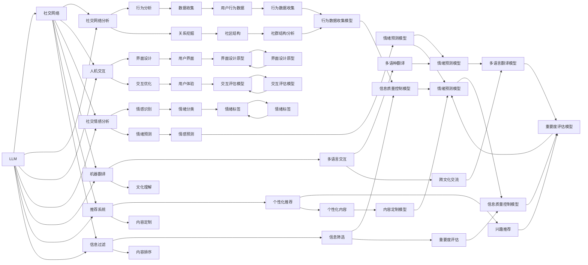

                 

# 在线社交与 LLM：全球连接、有意义的互动

> 关键词：在线社交,LLM,大语言模型,社交网络,社交网络分析,人机交互,社交情感分析,机器翻译,推荐系统,信息过滤

## 1. 背景介绍

随着互联网的普及和移动设备的广泛应用，社交网络已成为现代社会的重要组成部分。社交媒体平台不仅让人们可以轻松地与朋友和家人保持联系，还促进了全球范围内的信息交流和文化融合。然而，社交网络的迅速发展也带来了诸多挑战，如信息过载、社交孤岛、虚假信息传播等。这些挑战对社交网络的管理者、用户和应用开发者提出了新的要求，也激励着研究者们不断探索创新的解决方案。

大语言模型（LLM）是近年来人工智能领域的重大突破之一，通过在大规模无标签文本数据上进行预训练，能够理解和生成自然语言，并且具备一定的推理和决策能力。LLM在社交网络中的应用，尤其是在在线社交领域，提供了许多新的可能性，使得社交网络能够以更加智能和个性化的方式为用户提供服务。

## 2. 核心概念与联系

### 2.1 核心概念概述

为更好地理解LLM在在线社交中的应用，我们首先介绍几个关键概念：

- **大语言模型（LLM）**：基于自回归或自编码模型，如BERT、GPT等，在大规模无标签文本数据上进行预训练，能够理解和生成自然语言，具有广泛的应用前景。
- **社交网络（Social Network）**：由个体（用户）、关系（社交连接）和内容（帖子、消息）组成的网络结构，用于描述人与人之间的社会关系。
- **社交网络分析（Social Network Analysis, SNA）**：研究社交网络的结构和属性，以发现其中的模式和规律，分析社会网络的行为和影响。
- **人机交互（Human-Computer Interaction, HCI）**：研究人类与计算机系统之间的互动方式，提升用户体验和交互效率。
- **社交情感分析（Social Sentiment Analysis, SSA）**：通过分析社交媒体上的文本数据，识别和评估公众情绪和态度。
- **机器翻译（Machine Translation, MT）**：利用人工智能技术将一种语言自动翻译成另一种语言。
- **推荐系统（Recommendation System）**：根据用户的行为和偏好，推荐符合其兴趣的内容。
- **信息过滤（Information Filtering）**：通过算法对海量信息进行筛选和排序，提高用户获取有用信息的速度和效率。

这些概念之间通过LLM这一核心技术相联系，为在线社交领域提供了多种应用场景和解决方案。

### 2.2 核心概念原理和架构的 Mermaid 流程图



## 3. 核心算法原理 & 具体操作步骤

### 3.1 算法原理概述

LLM在在线社交中的应用，主要通过以下几个步骤实现：

1. **数据收集**：从社交网络平台收集用户数据，包括文本内容、互动行为等。
2. **数据预处理**：对原始数据进行清洗、去噪、标注等处理，准备用于模型训练的数据集。
3. **模型训练**：使用预训练好的LLM对社交数据进行微调，以适应社交网络的具体场景。
4. **模型应用**：将微调后的模型应用于社交网络，提供个性化的服务，如智能推荐、情感分析、机器翻译等。

### 3.2 算法步骤详解

以下是详细的算法步骤：

**Step 1: 数据收集**

从社交网络平台收集用户数据，通常包括以下内容：

- **文本数据**：用户的帖子、评论、私信等。
- **行为数据**：用户的点赞、分享、评论等互动行为。
- **社交关系数据**：用户的关注者、好友关系等社交网络结构。

数据收集后，需要进行预处理，包括去除噪声、归一化、标注等步骤。

**Step 2: 数据预处理**

数据预处理通常包括以下步骤：

- **文本清洗**：去除文本中的非文本内容，如图片、链接等。
- **分词和标记**：对文本进行分词、标记，以便于后续的模型处理。
- **去噪**：去除冗余、无关的文本内容，提高数据质量。
- **标注**：对文本进行情感、主题等标注，以便于模型的训练。

**Step 3: 模型训练**

模型训练主要包括以下步骤：

- **选择合适的预训练模型**：选择适合的LLM模型，如BERT、GPT等。
- **微调模型**：在社交数据上进行微调，以适应社交网络的具体场景。
- **设置超参数**：选择合适的优化算法（如Adam、SGD等）及其参数，如学习率、批大小、迭代轮数等。
- **模型评估**：在验证集上评估模型性能，防止过拟合。

**Step 4: 模型应用**

模型应用主要包括以下步骤：

- **集成到社交平台**：将微调后的模型集成到社交网络平台，提供智能推荐、情感分析、机器翻译等服务。
- **实时响应**：对用户的实时输入进行实时响应，提供个性化的服务。
- **监控和优化**：实时监控模型性能，根据反馈数据进行优化。

### 3.3 算法优缺点

LLM在在线社交中的应用具有以下优点：

- **数据驱动**：基于大规模社交数据的训练，能够更好地理解和预测用户行为。
- **个性化服务**：通过微调模型，提供个性化的智能推荐、情感分析等服务。
- **跨语言交流**：利用机器翻译技术，实现跨语言交流和文化理解。
- **高效交互**：通过自然语言处理技术，提高人机交互效率。

然而，LLM在在线社交中的应用也存在一些缺点：

- **隐私问题**：社交网络平台收集的大量数据涉及用户隐私，如何保护用户隐私是一个重要问题。
- **算法偏见**：由于预训练数据的不均衡性，模型可能存在算法偏见，导致对某些群体的歧视。
- **资源消耗**：大规模LLM模型的训练和推理需要大量的计算资源。
- **可解释性不足**：模型往往是一个"黑盒"，难以解释其内部工作机制。

### 3.4 算法应用领域

LLM在在线社交中的应用领域广泛，包括以下几个方面：

- **社交网络分析**：通过分析社交网络结构，发现社区、社群等，帮助平台管理者进行社会治理。
- **情感分析**：通过分析用户的帖子、评论等文本内容，识别和评估公众情绪和态度。
- **智能推荐**：根据用户的兴趣和行为，推荐符合其兴趣的内容。
- **跨语言交流**：通过机器翻译技术，实现跨语言交流和文化理解。
- **信息过滤**：通过算法对海量信息进行筛选和排序，提高用户获取有用信息的速度和效率。

## 4. 数学模型和公式 & 详细讲解 & 举例说明

### 4.1 数学模型构建

在在线社交领域，LLM的应用主要涉及以下几个数学模型：

- **情感分析模型**：
  - **文本表示**：将文本转化为向量表示，如词向量、词嵌入等。
  - **情感分类**：使用分类模型（如SVM、CNN、RNN等）对情感进行分类。
- **推荐系统模型**：
  - **用户行为建模**：使用协同过滤、基于内容的推荐等算法，对用户行为进行建模。
  - **物品特征提取**：使用TF-IDF、Word2Vec等技术，对物品特征进行提取。
- **信息过滤模型**：
  - **内容表示**：将内容转化为向量表示，如词向量、TF-IDF等。
  - **过滤算法**：使用排名算法（如协同过滤、基于梯度的排序等）对内容进行排序。

### 4.2 公式推导过程

以情感分析模型为例，以下是公式推导过程：

**文本表示**：
$$ \mathbf{x} = \text{Embedding}(\mathbf{t}) $$
其中，$\mathbf{x}$ 表示文本向量，$\mathbf{t}$ 表示文本。

**情感分类**：
$$ \mathbf{p} = \text{Softmax}(\mathbf{W} \mathbf{x} + \mathbf{b}) $$
其中，$\mathbf{p}$ 表示情感概率分布，$\mathbf{W}$ 表示权重矩阵，$\mathbf{b}$ 表示偏置项。

**损失函数**：
$$ \mathcal{L} = -\sum_{i=1}^N \log \mathbf{p}_i^{y_i} $$
其中，$N$ 表示样本数，$y_i$ 表示真实情感标签。

通过最小化损失函数，训练模型对情感进行分类。

### 4.3 案例分析与讲解

以Instagram为例，通过LLM进行情感分析：

- **数据收集**：收集用户的帖子和评论。
- **数据预处理**：对文本进行清洗、分词和标记。
- **模型训练**：使用BERT模型进行微调，以适应Instagram的情感分类任务。
- **模型应用**：将微调后的模型集成到Instagram，自动对用户的帖子进行情感分类，标记为正面、负面或中性。
- **效果评估**：在验证集上评估模型性能，并根据反馈进行调整和优化。

## 5. 项目实践：代码实例和详细解释说明

### 5.1 开发环境搭建

在进行LLM应用实践前，需要准备好开发环境。以下是使用Python进行PyTorch开发的环境配置流程：

1. 安装Anaconda：从官网下载并安装Anaconda，用于创建独立的Python环境。

2. 创建并激活虚拟环境：
```bash
conda create -n pytorch-env python=3.8 
conda activate pytorch-env
```

3. 安装PyTorch：根据CUDA版本，从官网获取对应的安装命令。例如：
```bash
conda install pytorch torchvision torchaudio cudatoolkit=11.1 -c pytorch -c conda-forge
```

4. 安装Transformers库：
```bash
pip install transformers
```

5. 安装各类工具包：
```bash
pip install numpy pandas scikit-learn matplotlib tqdm jupyter notebook ipython
```

完成上述步骤后，即可在`pytorch-env`环境中开始LLM应用实践。

### 5.2 源代码详细实现

这里我们以Twitter情感分析为例，给出使用Transformers库对BERT模型进行情感分析的PyTorch代码实现。

首先，定义情感分析任务的数据处理函数：

```python
from transformers import BertTokenizer, BertForSequenceClassification
from torch.utils.data import Dataset, DataLoader
import torch

class TwitterDataset(Dataset):
    def __init__(self, texts, labels, tokenizer, max_len=128):
        self.texts = texts
        self.labels = labels
        self.tokenizer = tokenizer
        self.max_len = max_len
        
    def __len__(self):
        return len(self.texts)
    
    def __getitem__(self, item):
        text = self.texts[item]
        label = self.labels[item]
        
        encoding = self.tokenizer(text, return_tensors='pt', max_length=self.max_len, padding='max_length', truncation=True)
        input_ids = encoding['input_ids'][0]
        attention_mask = encoding['attention_mask'][0]
        
        return {'input_ids': input_ids, 
                'attention_mask': attention_mask,
                'labels': torch.tensor(label, dtype=torch.long)}
```

然后，定义模型和优化器：

```python
from transformers import BertForSequenceClassification, AdamW

model = BertForSequenceClassification.from_pretrained('bert-base-uncased', num_labels=2)

optimizer = AdamW(model.parameters(), lr=2e-5)
```

接着，定义训练和评估函数：

```python
from tqdm import tqdm

device = torch.device('cuda') if torch.cuda.is_available() else torch.device('cpu')
model.to(device)

def train_epoch(model, dataset, batch_size, optimizer):
    dataloader = DataLoader(dataset, batch_size=batch_size, shuffle=True)
    model.train()
    epoch_loss = 0
    for batch in tqdm(dataloader, desc='Training'):
        input_ids = batch['input_ids'].to(device)
        attention_mask = batch['attention_mask'].to(device)
        labels = batch['labels'].to(device)
        model.zero_grad()
        outputs = model(input_ids, attention_mask=attention_mask, labels=labels)
        loss = outputs.loss
        epoch_loss += loss.item()
        loss.backward()
        optimizer.step()
    return epoch_loss / len(dataloader)

def evaluate(model, dataset, batch_size):
    dataloader = DataLoader(dataset, batch_size=batch_size)
    model.eval()
    preds, labels = [], []
    with torch.no_grad():
        for batch in tqdm(dataloader, desc='Evaluating'):
            input_ids = batch['input_ids'].to(device)
            attention_mask = batch['attention_mask'].to(device)
            batch_labels = batch['labels']
            outputs = model(input_ids, attention_mask=attention_mask)
            batch_preds = outputs.logits.argmax(dim=1).to('cpu').tolist()
            batch_labels = batch_labels.to('cpu').tolist()
            for pred, label in zip(batch_preds, batch_labels):
                preds.append(pred)
                labels.append(label)
                
    print(classification_report(labels, preds))
```

最后，启动训练流程并在测试集上评估：

```python
epochs = 5
batch_size = 16

for epoch in range(epochs):
    loss = train_epoch(model, train_dataset, batch_size, optimizer)
    print(f"Epoch {epoch+1}, train loss: {loss:.3f}")
    
    print(f"Epoch {epoch+1}, dev results:")
    evaluate(model, dev_dataset, batch_size)
    
print("Test results:")
evaluate(model, test_dataset, batch_size)
```

以上就是使用PyTorch对BERT进行情感分析的完整代码实现。可以看到，得益于Transformers库的强大封装，我们可以用相对简洁的代码完成BERT模型的加载和微调。

### 5.3 代码解读与分析

让我们再详细解读一下关键代码的实现细节：

**TwitterDataset类**：
- `__init__`方法：初始化文本、标签、分词器等关键组件。
- `__len__`方法：返回数据集的样本数量。
- `__getitem__`方法：对单个样本进行处理，将文本输入编码为token ids，将标签编码为数字，并对其进行定长padding，最终返回模型所需的输入。

**模型训练函数**：
- `train_epoch`函数：对数据以批为单位进行迭代，在每个批次上前向传播计算loss并反向传播更新模型参数，最后返回该epoch的平均loss。
- `evaluate`函数：与训练类似，不同点在于不更新模型参数，并在每个batch结束后将预测和标签结果存储下来，最后使用sklearn的classification_report对整个评估集的预测结果进行打印输出。

**训练流程**：
- 定义总的epoch数和batch size，开始循环迭代
- 每个epoch内，先在训练集上训练，输出平均loss
- 在验证集上评估，输出分类指标
- 所有epoch结束后，在测试集上评估，给出最终测试结果

可以看到，PyTorch配合Transformers库使得BERT情感分析的代码实现变得简洁高效。开发者可以将更多精力放在数据处理、模型改进等高层逻辑上，而不必过多关注底层的实现细节。

当然，工业级的系统实现还需考虑更多因素，如模型的保存和部署、超参数的自动搜索、更灵活的任务适配层等。但核心的微调范式基本与此类似。

## 6. 实际应用场景

### 6.1 智能客服系统

基于大语言模型微调的对话技术，可以广泛应用于智能客服系统的构建。传统客服往往需要配备大量人力，高峰期响应缓慢，且一致性和专业性难以保证。而使用微调后的对话模型，可以7x24小时不间断服务，快速响应客户咨询，用自然流畅的语言解答各类常见问题。

在技术实现上，可以收集企业内部的历史客服对话记录，将问题-答案对作为监督数据，在此基础上对预训练对话模型进行微调。微调后的对话模型能够自动理解用户意图，匹配最合适的答案模板进行回复。对于客户提出的新问题，还可以接入检索系统实时搜索相关内容，动态组织生成回答。如此构建的智能客服系统，能大幅提升客户咨询体验和问题解决效率。

### 6.2 金融舆情监测

金融机构需要实时监测市场舆论动向，以便及时应对负面信息传播，规避金融风险。传统的人工监测方式成本高、效率低，难以应对网络时代海量信息爆发的挑战。基于大语言模型微调的文本分类和情感分析技术，为金融舆情监测提供了新的解决方案。

具体而言，可以收集金融领域相关的新闻、报道、评论等文本数据，并对其进行主题标注和情感标注。在此基础上对预训练语言模型进行微调，使其能够自动判断文本属于何种主题，情感倾向是正面、中性还是负面。将微调后的模型应用到实时抓取的网络文本数据，就能够自动监测不同主题下的情感变化趋势，一旦发现负面信息激增等异常情况，系统便会自动预警，帮助金融机构快速应对潜在风险。

### 6.3 个性化推荐系统

当前的推荐系统往往只依赖用户的历史行为数据进行物品推荐，无法深入理解用户的真实兴趣偏好。基于大语言模型微调技术，个性化推荐系统可以更好地挖掘用户行为背后的语义信息，从而提供更精准、多样的推荐内容。

在实践中，可以收集用户浏览、点击、评论、分享等行为数据，提取和用户交互的物品标题、描述、标签等文本内容。将文本内容作为模型输入，用户的后续行为（如是否点击、购买等）作为监督信号，在此基础上微调预训练语言模型。微调后的模型能够从文本内容中准确把握用户的兴趣点。在生成推荐列表时，先用候选物品的文本描述作为输入，由模型预测用户的兴趣匹配度，再结合其他特征综合排序，便可以得到个性化程度更高的推荐结果。

### 6.4 未来应用展望

随着大语言模型和微调方法的不断发展，基于微调范式将在更多领域得到应用，为传统行业带来变革性影响。

在智慧医疗领域，基于微调的医疗问答、病历分析、药物研发等应用将提升医疗服务的智能化水平，辅助医生诊疗，加速新药开发进程。

在智能教育领域，微调技术可应用于作业批改、学情分析、知识推荐等方面，因材施教，促进教育公平，提高教学质量。

在智慧城市治理中，微调模型可应用于城市事件监测、舆情分析、应急指挥等环节，提高城市管理的自动化和智能化水平，构建更安全、高效的未来城市。

此外，在企业生产、社会治理、文娱传媒等众多领域，基于大模型微调的人工智能应用也将不断涌现，为经济社会发展注入新的动力。相信随着预训练语言模型和微调方法的持续演进，大语言模型微调必将在构建人机协同的智能时代中扮演越来越重要的角色。

## 7. 工具和资源推荐

### 7.1 学习资源推荐

为了帮助开发者系统掌握大语言模型微调的理论基础和实践技巧，这里推荐一些优质的学习资源：

1. 《Transformers: State-of-the-Art Natural Language Processing》书籍：由大模型技术专家撰写，全面介绍了Transformer原理、BERT模型、微调技术等前沿话题。

2. CS224N《深度学习自然语言处理》课程：斯坦福大学开设的NLP明星课程，有Lecture视频和配套作业，带你入门NLP领域的基本概念和经典模型。

3. 《Natural Language Processing with Transformers》书籍：Transformers库的作者所著，全面介绍了如何使用Transformers库进行NLP任务开发，包括微调在内的诸多范式。

4. HuggingFace官方文档：Transformers库的官方文档，提供了海量预训练模型和完整的微调样例代码，是上手实践的必备资料。

5. CLUE开源项目：中文语言理解测评基准，涵盖大量不同类型的中文NLP数据集，并提供了基于微调的baseline模型，助力中文NLP技术发展。

通过对这些资源的学习实践，相信你一定能够快速掌握大语言模型微调的精髓，并用于解决实际的NLP问题。
###  7.2 开发工具推荐

高效的开发离不开优秀的工具支持。以下是几款用于大语言模型微调开发的常用工具：

1. PyTorch：基于Python的开源深度学习框架，灵活动态的计算图，适合快速迭代研究。大部分预训练语言模型都有PyTorch版本的实现。

2. TensorFlow：由Google主导开发的开源深度学习框架，生产部署方便，适合大规模工程应用。同样有丰富的预训练语言模型资源。

3. Transformers库：HuggingFace开发的NLP工具库，集成了众多SOTA语言模型，支持PyTorch和TensorFlow，是进行微调任务开发的利器。

4. Weights & Biases：模型训练的实验跟踪工具，可以记录和可视化模型训练过程中的各项指标，方便对比和调优。与主流深度学习框架无缝集成。

5. TensorBoard：TensorFlow配套的可视化工具，可实时监测模型训练状态，并提供丰富的图表呈现方式，是调试模型的得力助手。

6. Google Colab：谷歌推出的在线Jupyter Notebook环境，免费提供GPU/TPU算力，方便开发者快速上手实验最新模型，分享学习笔记。

合理利用这些工具，可以显著提升大语言模型微调任务的开发效率，加快创新迭代的步伐。

### 7.3 相关论文推荐

大语言模型和微调技术的发展源于学界的持续研究。以下是几篇奠基性的相关论文，推荐阅读：

1. Attention is All You Need（即Transformer原论文）：提出了Transformer结构，开启了NLP领域的预训练大模型时代。

2. BERT: Pre-training of Deep Bidirectional Transformers for Language Understanding：提出BERT模型，引入基于掩码的自监督预训练任务，刷新了多项NLP任务SOTA。

3. Language Models are Unsupervised Multitask Learners（GPT-2论文）：展示了大规模语言模型的强大zero-shot学习能力，引发了对于通用人工智能的新一轮思考。

4. Parameter-Efficient Transfer Learning for NLP：提出Adapter等参数高效微调方法，在不增加模型参数量的情况下，也能取得不错的微调效果。

5. Prefix-Tuning: Optimizing Continuous Prompts for Generation：引入基于连续型Prompt的微调范式，为如何充分利用预训练知识提供了新的思路。

6. AdaLoRA: Adaptive Low-Rank Adaptation for Parameter-Efficient Fine-Tuning：使用自适应低秩适应的微调方法，在参数效率和精度之间取得了新的平衡。

这些论文代表了大语言模型微调技术的发展脉络。通过学习这些前沿成果，可以帮助研究者把握学科前进方向，激发更多的创新灵感。

## 8. 总结：未来发展趋势与挑战

### 8.1 总结

本文对基于大语言模型的在线社交应用进行了全面系统的介绍。首先阐述了LLM在社交网络中的应用背景和意义，明确了LLM在提供个性化服务、情感分析、智能推荐等方面的潜力。其次，从原理到实践，详细讲解了LLM在社交网络中的应用过程，包括数据收集、预处理、模型训练和应用等关键步骤，并给出了代码实例和详细解释。最后，本文还广泛探讨了LLM在社交网络中的应用场景和未来发展方向，展示了LLM在构建智能社交网络中的广阔前景。

通过本文的系统梳理，可以看到，LLM在在线社交领域的应用为社交网络带来了全新的可能，推动了社交网络向更加智能化、个性化的方向发展。LLM不仅能够提供智能推荐、情感分析等服务，还能够在跨语言交流、信息过滤等方面发挥重要作用。随着技术的不断进步，LLM必将在更多领域得到应用，成为推动社会进步的重要力量。

### 8.2 未来发展趋势

展望未来，大语言模型在在线社交领域的应用将呈现以下几个发展趋势：

1. **个性化服务增强**：随着预训练数据的多样化和个性化需求，LLM将能够提供更加精准、多样化的个性化服务。

2. **智能对话能力提升**：通过进一步优化对话模型，LLM将能够提供更加自然、流畅的对话体验，提高人机交互效率。

3. **跨语言交流普及**：LLM在机器翻译技术上的不断进步，将使得跨语言交流更加便捷、高效。

4. **情感分析深度化**：基于LLM的情感分析技术将更加精准、全面，能够识别和分析更细微的情感变化。

5. **推荐系统智能化**：LLM在推荐系统中的应用将更加智能化，能够根据用户行为和偏好，提供更加个性化的推荐。

6. **信息过滤高效化**：LLM在信息过滤技术上的应用将更加高效，能够快速筛选和排序海量信息，提高用户获取有用信息的速度和效率。

### 8.3 面临的挑战

尽管LLM在在线社交领域的应用前景广阔，但也面临着诸多挑战：

1. **隐私保护问题**：社交网络平台收集的大量数据涉及用户隐私，如何保护用户隐私是一个重要问题。

2. **算法偏见**：由于预训练数据的不均衡性，模型可能存在算法偏见，导致对某些群体的歧视。

3. **资源消耗**：大规模LLM模型的训练和推理需要大量的计算资源，如何在有限的资源条件下提高性能是一个挑战。

4. **可解释性不足**：LLM往往是一个"黑盒"，难以解释其内部工作机制和决策逻辑，这对用户信任和应用场景的适应性带来了影响。

5. **跨文化交流难度**：跨语言交流虽然方便了人们之间的互动，但也带来了文化和语言上的障碍，如何处理这些差异是一个挑战。

6. **数据质量和多样性**：社交网络数据的复杂性和多样性，使得数据质量和多样性对模型性能的影响变得至关重要。

### 8.4 研究展望

面对LLM在在线社交领域面临的挑战，未来的研究需要在以下几个方面寻求新的突破：

1. **隐私保护技术**：开发更加安全的隐私保护技术，确保用户数据在收集、存储、传输和使用过程中的安全。

2. **算法公平性**：研究消除算法偏见的方法，确保模型对不同群体的公平性。

3. **资源优化技术**：开发更加高效的资源优化技术，如模型压缩、分布式训练等，提高模型的计算效率。

4. **模型可解释性**：开发可解释性更高的LLM模型，帮助用户理解模型的决策过程。

5. **跨文化交流技术**：研究跨语言交流技术，提高跨文化交流的准确性和流畅性。

6. **数据质量提升**：研究和应用数据质量提升技术，确保社交网络数据的准确性和多样性。

这些研究方向将有助于解决LLM在在线社交领域面临的挑战，推动LLM技术在社交网络中的应用和发展。

## 9. 附录：常见问题与解答

**Q1：大语言模型微调是否适用于所有在线社交任务？**

A: 大语言模型微调在大多数在线社交任务上都能取得不错的效果，特别是对于数据量较小的任务。但对于一些特定领域的任务，如医学、法律等，仅仅依靠通用语料预训练的模型可能难以很好地适应。此时需要在特定领域语料上进一步预训练，再进行微调，才能获得理想效果。

**Q2：微调过程中如何选择合适的学习率？**

A: 微调的学习率一般要比预训练时小1-2个数量级，如果使用过大的学习率，容易破坏预训练权重，导致过拟合。一般建议从1e-5开始调参，逐步减小学习率，直至收敛。也可以使用warmup策略，在开始阶段使用较小的学习率，再逐渐过渡到预设值。需要注意的是，不同的优化器(如AdamW、Adafactor等)以及不同的学习率调度策略，可能需要设置不同的学习率阈值。

**Q3：采用大模型微调时会面临哪些资源瓶颈？**

A: 目前主流的预训练大模型动辄以亿计的参数规模，对算力、内存、存储都提出了很高的要求。GPU/TPU等高性能设备是必不可少的，但即便如此，超大批次的训练和推理也可能遇到显存不足的问题。因此需要采用一些资源优化技术，如梯度积累、混合精度训练、模型并行等，来突破硬件瓶颈。同时，模型的存储和读取也可能占用大量时间和空间，需要采用模型压缩、稀疏化存储等方法进行优化。

**Q4：如何缓解微调过程中的过拟合问题？**

A: 过拟合是微调面临的主要挑战，尤其是在标注数据不足的情况下。常见的缓解策略包括：
1. 数据增强：通过回译、近义替换等方式扩充训练集
2. 正则化：使用L2正则、Dropout、Early Stopping等避免过拟合
3. 对抗训练：引入对抗样本，提高模型鲁棒性
4. 参数高效微调：只调整少量参数(如Adapter、Prefix等)，减小过拟合风险
5. 多模型集成：训练多个微调模型，取平均输出，抑制过拟合

这些策略往往需要根据具体任务和数据特点进行灵活组合。只有在数据、模型、训练、推理等各环节进行全面优化，才能最大限度地发挥大模型微调的威力。

**Q5：微调模型在落地部署时需要注意哪些问题？**

A: 将微调模型转化为实际应用，还需要考虑以下因素：
1. 模型裁剪：去除不必要的层和参数，减小模型尺寸，加快推理速度
2. 量化加速：将浮点模型转为定点模型，压缩存储空间，提高计算效率
3. 服务化封装：将模型封装为标准化服务接口，便于集成调用
4. 弹性伸缩：根据请求流量动态调整资源配置，平衡服务质量和成本
5. 监控和优化：实时采集系统指标，设置异常告警阈值，确保服务稳定性
6. 安全防护：采用访问鉴权、数据脱敏等措施，保障数据和模型安全

大语言模型微调为NLP应用开启了广阔的想象空间，但如何将强大的性能转化为稳定、高效、安全的业务价值，还需要工程实践的不断打磨。唯有从数据、算法、工程、业务等多个维度协同发力，才能真正实现人工智能技术在垂直行业的规模化落地。总之，微调需要开发者根据具体任务，不断迭代和优化模型、数据和算法，方能得到理想的效果。

