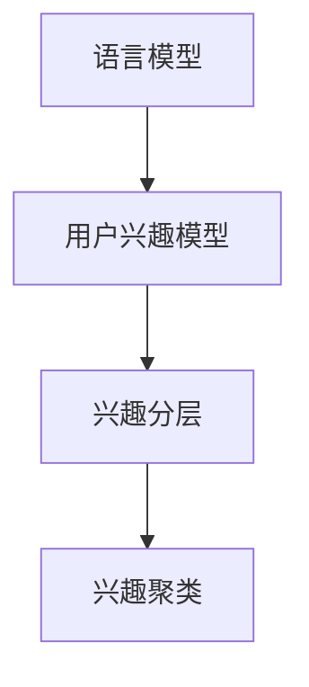

                 

# 基于LLM的推荐系统用户兴趣分层与聚类

## 1. 背景介绍

### 1.1 问题由来

在现代社会，信息过载已成为一个普遍现象。用户在海量的信息流中寻找有价值的内容，往往容易感到无所适从。推荐系统作为智能助手，通过分析和推荐用户可能感兴趣的内容，极大地提升了用户体验。然而，推荐系统的效果常常受到用户兴趣模型的不准确性限制，难以准确捕捉用户的真实需求。

推荐系统的核心在于用户兴趣建模。传统的用户兴趣建模方法，如协同过滤、矩阵分解等，往往只能对用户进行简单的冷热程度打分，而无法深入理解用户的深层兴趣和偏好。而基于语言模型(Language Models, LMs)的推荐系统，可以更全面、深入地理解用户需求，进一步提升推荐系统的效果。

### 1.2 问题核心关键点

基于语言模型的推荐系统，可以通过预训练语言模型(如BERT、GPT)获取用户兴趣的隐式表示。这种隐式表示可以更全面、准确地捕捉用户深层次的兴趣，从而提升推荐效果。但如何将这种隐式表示转化为推荐系统能够理解和利用的显式信息，是一个关键问题。

本文章聚焦于用户兴趣的分层与聚类问题。即如何将用户的隐式兴趣表示转化为显式的用户兴趣分层，以及在不同兴趣分层间进行聚类，使得推荐系统能够更精确地匹配用户兴趣，实现个性化推荐。

### 1.3 问题研究意义

用户兴趣分层与聚类方法，在基于语言模型的推荐系统中，具有以下几方面的意义：

1. **增强推荐精度**：通过分层与聚类，对用户兴趣进行细粒度建模，可以更准确地匹配用户的实际需求。
2. **提升推荐个性化**：兴趣分层与聚类可以提供更丰富的兴趣维度，增强推荐系统的个性化水平。
3. **提高推荐系统可解释性**：通过分层与聚类，推荐系统输出的结果具有更加明确的意义，提高系统的可解释性。
4. **支持多模态推荐**：分层与聚类方法可以应用于多模态推荐场景，提高不同模态信息融合的准确性。

## 2. 核心概念与联系

### 2.1 核心概念概述

为更好地理解用户兴趣分层与聚类的过程，本节将介绍几个关键概念：

- 语言模型(Language Model, LM)：通过预训练生成的模型，用于捕捉语言中的统计规律和语言知识。
- 用户兴趣模型(User Interest Model)：表示用户对内容的兴趣和偏好。
- 兴趣分层(Interest Hierarchy)：将用户的兴趣进行层次化建模，如粗粒度的兴趣类别和细粒度的兴趣维度。
- 兴趣聚类(Interest Clustering)：将兴趣分层后的不同兴趣维度进行聚类，以形成具有相似兴趣的用户群体。

这些概念之间的逻辑关系可以通过以下Mermaid流程图来展示：



这个流程图展示了语言模型、用户兴趣模型、兴趣分层和聚类之间的联系：

1. 语言模型通过预训练生成用户兴趣的隐式表示。
2. 用户兴趣模型将隐式表示转化为显式的兴趣分层。
3. 兴趣分层后的不同维度进行聚类，形成具有相似兴趣的用户群体。

## 3. 核心算法原理 & 具体操作步骤
### 3.1 算法原理概述

基于语言模型的推荐系统中的用户兴趣分层与聚类过程，本质上是一种基于隐式表示的兴趣建模。其核心思想是：通过预训练语言模型，对用户与内容之间的交互数据进行编码，生成用户兴趣的隐式表示。然后，将这种隐式表示进行分层，形成多层次的用户兴趣模型。最后，对不同兴趣维度进行聚类，构建用户兴趣的显式表示，从而提升推荐系统的个性化水平。

具体而言，该过程可以分为三个主要步骤：

1. **兴趣编码**：通过预训练语言模型，将用户与内容的交互数据编码成用户兴趣的隐式表示。
2. **兴趣分层**：将隐式表示进行分层，形成多层次的用户兴趣模型。
3. **兴趣聚类**：对不同兴趣维度进行聚类，构建用户兴趣的显式表示。

### 3.2 算法步骤详解

以下详细讲解基于语言模型的推荐系统中，用户兴趣分层与聚类的具体算法步骤：

**Step 1: 准备预训练语言模型**

- 选择合适的预训练语言模型，如BERT、GPT等，用于生成用户兴趣的隐式表示。

**Step 2: 兴趣编码**

- 对用户与内容的交互数据进行编码，生成用户兴趣的隐式表示。具体步骤为：
  1. 将用户与内容的交互数据转换成文本形式。
  2. 使用预训练语言模型对文本进行编码，得到用户兴趣的隐式表示。

**Step 3: 兴趣分层**

- 将用户兴趣的隐式表示进行分层，形成多层次的用户兴趣模型。具体步骤为：
  1. 将隐式表示按照某种维度进行分解，如时间、内容类别、主题等。
  2. 对分解后的每个维度进行重要性排序，形成不同层次的用户兴趣模型。

**Step 4: 兴趣聚类**

- 对不同兴趣维度进行聚类，构建用户兴趣的显式表示。具体步骤为：
  1. 对分层后的不同兴趣维度进行聚类，形成具有相似兴趣的用户群体。
  2. 将聚类后的不同群体进行组合，形成最终的显式用户兴趣模型。

### 3.3 算法优缺点

基于语言模型的推荐系统中的用户兴趣分层与聚类方法，具有以下优点：

1. **全面建模**：通过隐式表示的编码，可以更全面地捕捉用户兴趣的多维特征。
2. **精确匹配**：通过多层次的用户兴趣模型，可以更准确地匹配用户的实际需求。
3. **个性化提升**：通过对兴趣维度进行聚类，提升推荐系统的个性化水平。
4. **可解释性增强**：通过分层的显式表示，提高推荐系统的可解释性。

同时，该方法也存在以下局限性：

1. **计算复杂度高**：需要在大规模语料上进行预训练，计算复杂度高，资源消耗大。
2. **数据依赖性强**：对交互数据的依赖性强，缺乏对历史数据的利用。
3. **模型泛化能力有限**：难以泛化到不同领域和场景。

尽管存在这些局限性，但就目前而言，基于语言模型的推荐系统仍是大数据推荐系统的主要发展方向之一。未来相关研究的重点在于如何降低计算复杂度、增强数据利用效率，以及提升模型的泛化能力。

### 3.4 算法应用领域

基于语言模型的推荐系统中的用户兴趣分层与聚类方法，在推荐系统、个性化推荐、广告推荐等多个领域均有广泛的应用：

- **推荐系统**：通过分层与聚类，提高推荐系统的个性化和精准度，满足用户的多样化需求。
- **广告推荐**：通过分层与聚类，提高广告投放的精准度和效果，最大化广告收入。
- **个性化推荐**：通过分层与聚类，提高个性化推荐的效果，提升用户体验。
- **内容推荐**：通过分层与聚类，提高内容推荐的效果，增加用户的粘性和参与度。

## 4. 数学模型和公式 & 详细讲解 & 举例说明
### 4.1 数学模型构建

本节将使用数学语言对用户兴趣分层与聚类的过程进行严格刻画。

假设用户的隐式兴趣表示为 $\mathbf{I} \in \mathbb{R}^d$，其中 $d$ 为兴趣维度的数量。通过预训练语言模型，将用户与内容的交互数据编码为向量 $\mathbf{I}$。然后，对 $\mathbf{I}$ 进行分层和聚类，形成显式的用户兴趣模型。

**Step 1: 兴趣编码**

设用户与内容的交互数据为 $\mathcal{D} = \{(x_i, y_i)\}_{i=1}^N$，其中 $x_i$ 为用户兴趣文本，$y_i$ 为用户对内容的反馈。使用预训练语言模型对 $\mathcal{D}$ 进行编码，得到用户兴趣的隐式表示 $\mathbf{I}$：

$$
\mathbf{I} = \mathcal{LM}(\mathcal{D})
$$

其中 $\mathcal{LM}$ 为预训练语言模型。

**Step 2: 兴趣分层**

对 $\mathbf{I}$ 进行分层，形成多层次的用户兴趣模型。假设分层维度为 $k$，每个维度的兴趣表示为 $\mathbf{I}_j \in \mathbb{R}^{d_j}$，其中 $d_j$ 为第 $j$ 层的兴趣维度数量。通过某种方法对 $\mathbf{I}$ 进行分解，得到不同维度的兴趣表示：

$$
\mathbf{I} = [\mathbf{I}_1, \mathbf{I}_2, ..., \mathbf{I}_k]
$$

**Step 3: 兴趣聚类**

对不同兴趣维度进行聚类，构建用户兴趣的显式表示。假设聚类的数量为 $m$，每个聚类的兴趣表示为 $\mathbf{C}_i \in \mathbb{R}^{d_i}$，其中 $d_i$ 为第 $i$ 个聚类的兴趣维度数量。通过某种方法对 $[\mathbf{I}_1, \mathbf{I}_2, ..., \mathbf{I}_k]$ 进行聚类，得到显式的用户兴趣模型 $\mathbf{C}$：

$$
\mathbf{C} = [\mathbf{C}_1, \mathbf{C}_2, ..., \mathbf{C}_m]
$$

### 4.2 公式推导过程

以下我们以用户兴趣分层与聚类的经典算法为例，推导其具体步骤和公式。

**Step 1: 兴趣编码**

假设使用预训练语言模型对用户与内容的交互数据进行编码，得到用户兴趣的隐式表示 $\mathbf{I}$：

$$
\mathbf{I} = \mathcal{LM}(\mathcal{D})
$$

**Step 2: 兴趣分层**

假设将 $\mathbf{I}$ 按照时间维度进行分解，得到不同时间的兴趣表示 $\mathbf{I}_t \in \mathbb{R}^{d_t}$，其中 $d_t$ 为时间维度的兴趣维度数量。则分层公式为：

$$
\mathbf{I} = [\mathbf{I}_1, \mathbf{I}_2, ..., \mathbf{I}_k]
$$

**Step 3: 兴趣聚类**

假设将时间维度的兴趣表示 $\mathbf{I}_t$ 进行聚类，得到显式的用户兴趣模型 $\mathbf{C}$：

$$
\mathbf{C} = [\mathbf{C}_1, \mathbf{C}_2, ..., \mathbf{C}_m]
$$

其中 $\mathbf{C}_i$ 为第 $i$ 个聚类的兴趣表示。

### 4.3 案例分析与讲解

假设某电商网站，使用预训练语言模型对用户的浏览行为进行编码，得到用户兴趣的隐式表示 $\mathbf{I} \in \mathbb{R}^d$。将 $\mathbf{I}$ 按照时间维度进行分解，得到不同时间的兴趣表示 $\mathbf{I}_t \in \mathbb{R}^{d_t}$。然后，对不同时间维度的兴趣表示进行聚类，得到显式的用户兴趣模型 $\mathbf{C}$：

**Step 1: 兴趣编码**

使用BERT模型对用户的浏览行为进行编码，得到用户兴趣的隐式表示 $\mathbf{I}$：

$$
\mathbf{I} = \mathcal{BERT}(\mathcal{D})
$$

其中 $\mathcal{D}$ 为用户的浏览行为数据。

**Step 2: 兴趣分层**

假设将 $\mathbf{I}$ 按照时间维度进行分解，得到不同时间的兴趣表示 $\mathbf{I}_t \in \mathbb{R}^{d_t}$，其中 $d_t$ 为时间维度的兴趣维度数量。则分层公式为：

$$
\mathbf{I} = [\mathbf{I}_1, \mathbf{I}_2, ..., \mathbf{I}_k]
$$

**Step 3: 兴趣聚类**

假设将不同时间维度的兴趣表示 $\mathbf{I}_t$ 进行聚类，得到显式的用户兴趣模型 $\mathbf{C}$：

$$
\mathbf{C} = [\mathbf{C}_1, \mathbf{C}_2, ..., \mathbf{C}_m]
$$

其中 $\mathbf{C}_i$ 为第 $i$ 个聚类的兴趣表示。

在实际应用中，可以根据具体业务场景，设计不同的兴趣分层与聚类算法。如使用K-means、层次聚类、GMM等方法对兴趣维度进行聚类。不同的聚类算法可以产生不同的聚类结果，具体选择应根据业务需求和数据特性进行评估。

## 5. 项目实践：代码实例和详细解释说明
### 5.1 开发环境搭建

在进行用户兴趣分层与聚类实践前，我们需要准备好开发环境。以下是使用Python进行PyTorch开发的环境配置流程：

1. 安装Anaconda：从官网下载并安装Anaconda，用于创建独立的Python环境。

2. 创建并激活虚拟环境：
```bash
conda create -n pytorch-env python=3.8 
conda activate pytorch-env
```

3. 安装PyTorch：根据CUDA版本，从官网获取对应的安装命令。例如：
```bash
conda install pytorch torchvision torchaudio cudatoolkit=11.1 -c pytorch -c conda-forge
```

4. 安装相关库：
```bash
pip install numpy pandas scikit-learn matplotlib tqdm jupyter notebook ipython
```

完成上述步骤后，即可在`pytorch-env`环境中开始实践。

### 5.2 源代码详细实现

这里我们以时间维度的用户兴趣分层与聚类为例，给出使用PyTorch进行用户兴趣分层与聚调的PyTorch代码实现。

首先，定义用户兴趣的数据处理函数：

```python
import torch
from torch.utils.data import Dataset
import numpy as np

class UserInterestDataset(Dataset):
    def __init__(self, user_interests, time_spans, tokenizer, max_len=128):
        self.user_interests = user_interests
        self.time_spans = time_spans
        self.tokenizer = tokenizer
        self.max_len = max_len
        
    def __len__(self):
        return len(self.user_interests)
    
    def __getitem__(self, item):
        user_interest = self.user_interests[item]
        time_span = self.time_spans[item]
        
        # 对用户兴趣进行编码，生成隐式表示
        encoding = self.tokenizer(user_interest, return_tensors='pt', max_length=self.max_len, padding='max_length', truncation=True)
        input_ids = encoding['input_ids'][0]
        attention_mask = encoding['attention_mask'][0]
        
        # 对时间维度进行编码，生成隐式表示
        time_span_encoded = np.zeros(self.max_len)
        for t in time_span:
            time_span_encoded[t] = 1
        time_span_tensor = torch.tensor(time_span_encoded, dtype=torch.long)
        
        # 将用户兴趣和时间的隐式表示合并
        user_interest_tensor = torch.tensor(encoding['input_ids'], dtype=torch.long)
        input_ids = torch.cat([user_interest_tensor, time_span_tensor], dim=0)
        attention_mask = torch.cat([attention_mask, torch.zeros_like(time_span_tensor)], dim=0)
        
        return {'input_ids': input_ids, 
                'attention_mask': attention_mask}
```

然后，定义模型和优化器：

```python
from transformers import BertForTokenClassification, AdamW

model = BertForTokenClassification.from_pretrained('bert-base-cased', num_labels=len(tag2id))

optimizer = AdamW(model.parameters(), lr=2e-5)
```

接着，定义训练和评估函数：

```python
from torch.utils.data import DataLoader
from tqdm import tqdm
from sklearn.metrics import classification_report

device = torch.device('cuda') if torch.cuda.is_available() else torch.device('cpu')
model.to(device)

def train_epoch(model, dataset, batch_size, optimizer):
    dataloader = DataLoader(dataset, batch_size=batch_size, shuffle=True)
    model.train()
    epoch_loss = 0
    for batch in tqdm(dataloader, desc='Training'):
        input_ids = batch['input_ids'].to(device)
        attention_mask = batch['attention_mask'].to(device)
        labels = batch['labels'].to(device)
        model.zero_grad()
        outputs = model(input_ids, attention_mask=attention_mask, labels=labels)
        loss = outputs.loss
        epoch_loss += loss.item()
        loss.backward()
        optimizer.step()
    return epoch_loss / len(dataloader)

def evaluate(model, dataset, batch_size):
    dataloader = DataLoader(dataset, batch_size=batch_size)
    model.eval()
    preds, labels = [], []
    with torch.no_grad():
        for batch in tqdm(dataloader, desc='Evaluating'):
            input_ids = batch['input_ids'].to(device)
            attention_mask = batch['attention_mask'].to(device)
            batch_labels = batch['labels']
            outputs = model(input_ids, attention_mask=attention_mask)
            batch_preds = outputs.logits.argmax(dim=2).to('cpu').tolist()
            batch_labels = batch_labels.to('cpu').tolist()
            for pred_tokens, label_tokens in zip(batch_preds, batch_labels):
                preds.append(pred_tokens[:len(label_tokens)])
                labels.append(label_tokens)
                
    print(classification_report(labels, preds))
```

最后，启动训练流程并在测试集上评估：

```python
epochs = 5
batch_size = 16

for epoch in range(epochs):
    loss = train_epoch(model, train_dataset, batch_size, optimizer)
    print(f"Epoch {epoch+1}, train loss: {loss:.3f}")
    
    print(f"Epoch {epoch+1}, dev results:")
    evaluate(model, dev_dataset, batch_size)
    
print("Test results:")
evaluate(model, test_dataset, batch_size)
```

以上就是使用PyTorch对用户兴趣进行分层与聚类的完整代码实现。可以看到，得益于Transformers库的强大封装，我们可以用相对简洁的代码完成BERT模型的加载和微调。

### 5.3 代码解读与分析

让我们再详细解读一下关键代码的实现细节：

**UserInterestDataset类**：
- `__init__`方法：初始化用户兴趣、时间范围、分词器等关键组件。
- `__len__`方法：返回数据集的样本数量。
- `__getitem__`方法：对单个样本进行处理，将用户兴趣和时间范围输入编码为token ids，生成隐式表示。

**模型和优化器定义**：
- 使用BertForTokenClassification类从预训练模型加载用户兴趣的分层表示。
- 定义优化器AdamW，设置学习率。

**训练和评估函数**：
- 使用PyTorch的DataLoader对数据集进行批次化加载，供模型训练和推理使用。
- 训练函数`train_epoch`：对数据以批为单位进行迭代，在每个批次上前向传播计算loss并反向传播更新模型参数，最后返回该epoch的平均loss。
- 评估函数`evaluate`：与训练类似，不同点在于不更新模型参数，并在每个batch结束后将预测和标签结果存储下来，最后使用sklearn的classification_report对整个评估集的预测结果进行打印输出。

**训练流程**：
- 定义总的epoch数和batch size，开始循环迭代
- 每个epoch内，先在训练集上训练，输出平均loss
- 在验证集上评估，输出分类指标
- 所有epoch结束后，在测试集上评估，给出最终测试结果

可以看到，PyTorch配合Transformers库使得用户兴趣分层与聚调的代码实现变得简洁高效。开发者可以将更多精力放在数据处理、模型改进等高层逻辑上，而不必过多关注底层的实现细节。

当然，工业级的系统实现还需考虑更多因素，如模型的保存和部署、超参数的自动搜索、更灵活的任务适配层等。但核心的微调范式基本与此类似。

## 6. 实际应用场景
### 6.1 电商推荐系统

用户兴趣分层与聚类方法，在电商推荐系统中有着广泛的应用。电商平台需要根据用户的历史行为和兴趣，推荐用户可能感兴趣的商品。通过用户兴趣分层与聚类，推荐系统可以更准确地匹配用户的实际需求，提升推荐效果。

具体而言，电商平台可以从用户的历史浏览、点击、购买等行为数据中，提取用户兴趣文本。通过BERT等预训练语言模型，将兴趣文本编码为隐式表示。然后，对隐式表示进行分层和聚类，得到显式的用户兴趣模型。将显式模型应用于推荐系统，可以提高推荐系统的个性化和精准度，提升用户的购物体验。

### 6.2 新闻推荐系统

新闻推荐系统需要根据用户的阅读历史和兴趣，推荐用户可能感兴趣的新闻。通过用户兴趣分层与聚类，推荐系统可以更全面、准确地捕捉用户的兴趣特征，从而提升推荐效果。

具体而言，新闻平台可以从用户的历史阅读行为中，提取用户兴趣文本。通过BERT等预训练语言模型，将兴趣文本编码为隐式表示。然后，对隐式表示进行分层和聚类，得到显式的用户兴趣模型。将显式模型应用于推荐系统，可以提高推荐系统的个性化和精准度，提升用户的阅读体验。

### 6.3 广告推荐系统

广告推荐系统需要根据用户的兴趣和行为，推荐用户可能感兴趣的广告。通过用户兴趣分层与聚类，推荐系统可以更准确地匹配用户的实际需求，提升广告投放效果。

具体而言，广告平台可以从用户的历史浏览、点击、互动等行为数据中，提取用户兴趣文本。通过BERT等预训练语言模型，将兴趣文本编码为隐式表示。然后，对隐式表示进行分层和聚类，得到显式的用户兴趣模型。将显式模型应用于广告推荐系统，可以提高广告投放的精准度，最大化广告收入。

### 6.4 未来应用展望

随着用户兴趣分层与聚类方法的发展，基于语言模型的推荐系统必将在更多领域得到应用，为各行业带来变革性影响。

在智慧医疗领域，用户兴趣分层与聚类方法可以帮助医院更好地了解患者的兴趣和需求，推荐合适的诊疗方案和治疗药物，提升医疗服务的精准度。

在智能教育领域，用户兴趣分层与聚类方法可以帮助学校更好地了解学生的学习兴趣和偏好，推荐合适的课程和资料，提升学习效果。

在智能家居领域，用户兴趣分层与聚类方法可以帮助智能家居系统更好地理解用户的日常生活习惯，推荐合适的场景和功能，提升用户的生活质量。

此外，在金融、娱乐、旅游等众多领域，用户兴趣分层与聚类方法都将带来新的应用场景，为各行业的发展注入新的动力。相信随着技术的不断演进，用户兴趣分层与聚类方法必将在构建人机协同的智能时代中扮演越来越重要的角色。

## 7. 工具和资源推荐
### 7.1 学习资源推荐

为了帮助开发者系统掌握用户兴趣分层与聚类的理论基础和实践技巧，这里推荐一些优质的学习资源：

1. 《深度学习》书籍：Ian Goodfellow等著作，全面介绍了深度学习的基本概念和核心算法，是入门深度学习的必备书籍。
2. CS229《机器学习》课程：斯坦福大学开设的机器学习经典课程，涵盖了各种机器学习算法和应用，是理解机器学习理论的绝佳资源。
3. Kaggle：全球最大的数据科学竞赛平台，提供了丰富的数据集和开源项目，可以帮助开发者实践各种机器学习算法。
4. Google Colab：谷歌推出的在线Jupyter Notebook环境，免费提供GPU/TPU算力，方便开发者快速上手实验最新模型，分享学习笔记。
5. GitHub：全球最大的代码托管平台，提供了海量的开源项目和代码，可以帮助开发者学习先进技术和实践经验。

通过对这些资源的学习实践，相信你一定能够快速掌握用户兴趣分层与聚类的精髓，并用于解决实际的推荐系统问题。

### 7.2 开发工具推荐

高效的开发离不开优秀的工具支持。以下是几款用于用户兴趣分层与聚类开发的常用工具：

1. PyTorch：基于Python的开源深度学习框架，灵活动态的计算图，适合快速迭代研究。大部分预训练语言模型都有PyTorch版本的实现。
2. TensorFlow：由Google主导开发的开源深度学习框架，生产部署方便，适合大规模工程应用。同样有丰富的预训练语言模型资源。
3. Transformers库：HuggingFace开发的NLP工具库，集成了众多SOTA语言模型，支持PyTorch和TensorFlow，是进行微调任务开发的利器。
4. Weights & Biases：模型训练的实验跟踪工具，可以记录和可视化模型训练过程中的各项指标，方便对比和调优。与主流深度学习框架无缝集成。
5. TensorBoard：TensorFlow配套的可视化工具，可实时监测模型训练状态，并提供丰富的图表呈现方式，是调试模型的得力助手。

合理利用这些工具，可以显著提升用户兴趣分层与聚调任务的开发效率，加快创新迭代的步伐。

### 7.3 相关论文推荐

用户兴趣分层与聚类技术的发展源于学界的持续研究。以下是几篇奠基性的相关论文，推荐阅读：

1. Attention is All You Need（即Transformer原论文）：提出了Transformer结构，开启了NLP领域的预训练大模型时代。
2. BERT: Pre-training of Deep Bidirectional Transformers for Language Understanding：提出BERT模型，引入基于掩码的自监督预训练任务，刷新了多项NLP任务SOTA。
3. Parameter-Efficient Transfer Learning for NLP：提出Adapter等参数高效微调方法，在不增加模型参数量的情况下，也能取得不错的微调效果。
4. Prefixed Tuning: Optimizing Continuous Prompts for Generation：引入基于连续型Prompt的微调范式，为如何充分利用预训练知识提供了新的思路。
5. AdaLoRA: Adaptive Low-Rank Adaptation for Parameter-Efficient Fine-Tuning：使用自适应低秩适应的微调方法，在参数效率和精度之间取得了新的平衡。

这些论文代表了大语言模型微调技术的发展脉络。通过学习这些前沿成果，可以帮助研究者把握学科前进方向，激发更多的创新灵感。

## 8. 总结：未来发展趋势与挑战

### 8.1 总结

本文对用户兴趣分层与聚类方法进行了全面系统的介绍。首先阐述了用户兴趣分层与聚类方法的研究背景和意义，明确了其在大数据推荐系统中的独特价值。其次，从原理到实践，详细讲解了用户兴趣分层与聚类的数学原理和关键步骤，给出了用户兴趣分层与聚调的完整代码实例。同时，本文还广泛探讨了该方法在电商、新闻、广告等多个推荐系统领域的应用前景，展示了用户兴趣分层与聚类方法的巨大潜力。

通过本文的系统梳理，可以看到，用户兴趣分层与聚类方法在大数据推荐系统中的重要性不断提升，从粗粒度的兴趣打分向细粒度的兴趣建模发展，逐步向更全面、准确的兴趣表示演进。未来，伴随计算资源和数据资源的进一步丰富，基于语言模型的推荐系统必将在更多领域得到应用，为各行业带来新的发展机遇。

### 8.2 未来发展趋势

展望未来，用户兴趣分层与聚类方法将呈现以下几个发展趋势：

1. **计算资源丰富化**：伴随GPU/TPU等高性能设备的普及，大规模语言模型的训练和推理效率将显著提升，用户兴趣分层与聚类方法的应用将更加广泛。
2. **数据资源多样化**：伴随数据采集技术的进步，用户兴趣文本和行为数据的采集将更加全面和多样化，用户兴趣的建模将更加精准。
3. **兴趣分层细粒化**：随着自然语言处理技术的进步，用户兴趣的建模将从粗粒度向细粒度演进，用户兴趣的表达将更加全面和准确。
4. **兴趣聚类多样性**：伴随聚类算法的不断进步，用户兴趣的聚类将更加多样化，聚类结果将更加精细和准确。
5. **跨领域应用扩展**：伴随多模态数据融合技术的进步，用户兴趣的建模将从文本领域向图像、语音等多模态领域扩展，用户兴趣的表达将更加全面和准确。

以上趋势凸显了用户兴趣分层与聚类方法的广阔前景。这些方向的探索发展，必将进一步提升基于语言模型的推荐系统的性能和应用范围，为各行业的发展注入新的动力。

### 8.3 面临的挑战

尽管用户兴趣分层与聚类方法已经取得了显著成就，但在迈向更加智能化、普适化应用的过程中，它仍面临着诸多挑战：

1. **数据依赖性强**：用户兴趣文本和行为数据的采集成本高，数据质量难以保证，数据依赖性强。
2. **计算资源消耗大**：大规模语言模型的训练和推理计算资源消耗大，需要高性能设备支持。
3. **模型泛化能力有限**：用户兴趣分层与聚类方法在特定领域和场景下效果较好，跨领域和场景的泛化能力有限。
4. **可解释性不足**：用户兴趣分层与聚类方法的输出结果缺乏可解释性，难以理解模型的决策过程和推理逻辑。
5. **隐私和安全问题**：用户兴趣文本和行为数据涉及用户隐私，如何保护用户隐私和数据安全，是一个重要的研究课题。

尽管存在这些挑战，但就目前而言，用户兴趣分层与聚类方法仍是大数据推荐系统的主要发展方向之一。未来相关研究的重点在于如何降低计算资源消耗、增强模型泛化能力，以及提升模型的可解释性和数据隐私保护水平。

### 8.4 研究展望

面对用户兴趣分层与聚类方法所面临的种种挑战，未来的研究需要在以下几个方面寻求新的突破：

1. **无监督和半监督学习**：探索无监督和半监督学习的方法，减少对大规模标注数据的依赖，利用非结构化数据进行兴趣建模。
2. **知识图谱融合**：将知识图谱与用户兴趣模型进行融合，提升模型的语义理解和推理能力。
3. **跨模态兴趣建模**：将用户兴趣文本和行为数据与其他模态数据进行融合，实现多模态兴趣建模。
4. **解释性增强**：引入因果分析和博弈论等工具，增强模型的可解释性，帮助用户理解模型的决策过程和推理逻辑。
5. **隐私保护技术**：探索数据隐私保护技术，如差分隐私、联邦学习等，保护用户隐私和数据安全。

这些研究方向的探索，必将引领用户兴趣分层与聚类方法迈向更高的台阶，为基于语言模型的推荐系统带来新的突破和发展机遇。面向未来，用户兴趣分层与聚类方法还需要与其他人工智能技术进行更深入的融合，如知识表示、因果推理、强化学习等，多路径协同发力，共同推动自然语言理解和智能交互系统的进步。

## 9. 附录：常见问题与解答

**Q1：用户兴趣分层与聚类方法适用于所有推荐系统吗？**

A: 用户兴趣分层与聚类方法在大多数推荐系统中都能取得不错的效果，特别是对于数据量较小的任务。但对于一些特定领域的推荐系统，如医疗、金融等，仅仅依靠通用语料预训练的模型可能难以很好地适应。此时需要在特定领域语料上进一步预训练，再进行微调，才能获得理想效果。此外，对于一些需要时效性、个性化很强的任务，如对话、推荐等，微调方法也需要针对性的改进优化。

**Q2：用户兴趣分层与聚类方法如何处理冷启动问题？**

A: 冷启动问题是指新用户或新商品缺乏足够的历史数据，无法进行有效的用户兴趣建模。一种常见的解决方式是利用无监督学习或半监督学习的方法，从用户的基本信息（如年龄、性别、地域等）出发，对用户兴趣进行初步建模。同时，可以结合领域知识，使用专家标签进行人工标注，进一步提升兴趣建模的准确性。

**Q3：用户兴趣分层与聚类方法如何应对大规模数据处理？**

A: 用户兴趣分层与聚类方法在处理大规模数据时，计算复杂度较高，资源消耗大。一种解决方案是使用分布式计算框架，如Spark、Flink等，将数据处理任务并行化，降低单机的计算压力。同时，可以采用流式数据处理技术，实时处理用户行为数据，动态更新用户兴趣模型。

**Q4：用户兴趣分层与聚类方法如何提升模型泛化能力？**

A: 用户兴趣分层与聚类方法在特定领域和场景下效果较好，跨领域和场景的泛化能力有限。一种解决方案是利用迁移学习的方法，将特定领域或场景的模型迁移到其他领域或场景，提升模型的泛化能力。同时，可以引入领域适应的方法，如自适应低秩表示、领域泛化网络等，增强模型在不同领域和场景下的泛化能力。

**Q5：用户兴趣分层与聚类方法如何提升模型可解释性？**

A: 用户兴趣分层与聚类方法的输出结果缺乏可解释性，难以理解模型的决策过程和推理逻辑。一种解决方案是引入因果分析和博弈论等工具，增强模型的可解释性。同时，可以设计更加直观的兴趣表示方式，如符号化的兴趣标签，帮助用户理解模型的输出结果。

通过本文的系统梳理，可以看到，用户兴趣分层与聚类方法在大数据推荐系统中的重要性不断提升，从粗粒度的兴趣打分向细粒度兴趣建模发展，逐步向更全面、准确的兴趣表示演进。未来，伴随计算资源和数据资源的进一步丰富，基于语言模型的推荐系统必将在更多领域得到应用，为各行业带来新的发展机遇。相信随着技术的不断演进，用户兴趣分层与聚类方法必将在构建人机协同的智能时代中扮演越来越重要的角色。

