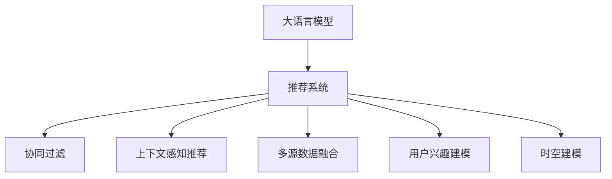

                 

# 基于LLM的推荐系统用户兴趣时空建模

## 1. 背景介绍

### 1.1 问题由来

在信息爆炸的互联网时代，用户面临的海量信息令其无法一一细读，此时推荐系统成为帮助用户筛选重要信息的关键工具。传统的推荐系统往往以用户的历史行为数据为基础，通过协同过滤、基于内容的推荐等方法为用户推荐感兴趣的内容。但这些方法存在诸多局限性，难以把握用户深层次的兴趣和需求，推荐效果并不总是令人满意。

为了解决这些问题，以深度学习为代表的人工智能技术被引入推荐系统。特别是大语言模型（Large Language Models，LLM）的应用，为推荐系统带来了新的突破，特别是用户兴趣的时空建模能力，大大提升了推荐系统的表现。

### 1.2 问题核心关键点

1. **大语言模型的引入**：通过在推荐系统中引入预训练的语言模型，利用其强大的语言理解能力，从用户的历史行为中挖掘深层次的语义信息，实现对用户兴趣的精细化建模。
2. **时空建模**：在用户兴趣建模的基础上，进一步考虑时间因素和上下文信息，使推荐系统能够根据不同时间点、不同场景下的用户需求进行个性化推荐。
3. **融合多源数据**：推荐系统可以融合用户行为数据、社交网络数据、多媒体数据等多种数据源，利用大语言模型将这些异构数据转化为统一的语义表示，以增强推荐的效果。

### 1.3 问题研究意义

1. **提升推荐精度**：通过引入大语言模型，推荐系统能够捕捉用户兴趣的语义含义，从而更加准确地预测用户行为，提升推荐的精度。
2. **增强推荐效果**：时空建模使推荐系统能够理解用户在不同时间、不同场景下的需求变化，使推荐内容更加符合用户当前的需求，增强推荐效果。
3. **扩充推荐维度**：多源数据的融合丰富了推荐系统的内容维度，使之能够提供更多样化、个性化的推荐，增强用户的满意度。
4. **推动技术进步**：通过大语言模型在推荐系统中的应用，推动了深度学习、自然语言处理等技术的进一步发展，促进了人工智能技术的落地应用。

## 2. 核心概念与联系

### 2.1 核心概念概述

为更好地理解基于LLM的推荐系统，本节将介绍几个密切相关的核心概念：

- **大语言模型**：以自回归(如GPT)或自编码(如BERT)模型为代表的大规模预训练语言模型。通过在大规模无标签文本语料上进行预训练，学习通用的语言表示，具备强大的语言理解和生成能力。

- **推荐系统**：一种信息检索系统，根据用户的历史行为和兴趣，为用户推荐感兴趣的内容，如商品、文章、视频等。

- **协同过滤**：一种常见的推荐算法，通过分析用户和商品之间的关联度，推断用户可能喜欢的商品。

- **上下文感知推荐**：考虑用户在不同时间、不同场景下的行为变化，推荐适合当前上下文的商品。

- **多源数据融合**：将用户行为数据、社交网络数据、多媒体数据等多种数据源进行融合，构建更全面的用户画像。

- **用户兴趣建模**：通过用户的行为数据和语义信息，构建用户兴趣模型，预测用户未来的行为。

- **时空建模**：在用户兴趣建模的基础上，加入时间因素和上下文信息，预测用户在当前时间点的兴趣。

这些核心概念之间的逻辑关系可以通过以下Mermaid流程图来展示：



这个流程图展示了大语言模型在推荐系统中的应用路径：

1. 大语言模型作为推荐系统的一部分，通过在推荐系统中引入语言模型，利用其强大的语义表示能力。
2. 协同过滤和上下文感知推荐使用大语言模型提供的语义信息，提升推荐的精度和相关性。
3. 多源数据融合将不同数据源转换为统一的语义表示，增强推荐的丰富性和多样性。
4. 用户兴趣建模通过大语言模型的语义表示，挖掘用户深层次的兴趣和需求。
5. 时空建模在用户兴趣建模的基础上，加入时间因素和上下文信息，使推荐内容更加符合用户当前的需求。

## 3. 核心算法原理 & 具体操作步骤

### 3.1 算法原理概述

基于LLM的推荐系统，本质上是一个多源数据的深度学习模型。其核心思想是：利用大语言模型的语义表示能力，从用户的历史行为和语义信息中提取用户兴趣，在考虑时间因素和上下文信息的基础上，预测用户未来的行为。

形式化地，假设用户的历史行为为 $H=\{x_i\}_{i=1}^N$，其中 $x_i$ 表示用户在时间点 $i$ 的行为，如浏览网页、购买商品等。利用大语言模型 $M_{\theta}$ 学习用户兴趣 $U$ 和时间特征 $T_i$，则推荐模型 $R$ 的目标是最大化预测准确率：

$$
\arg\max_{R} \sum_{i=1}^N \mathbb{I}(R(x_i, U, T_i) = x_{i+1})
$$

其中，$\mathbb{I}$ 表示示性函数，$x_{i+1}$ 表示用户在时间点 $i+1$ 的行为。

### 3.2 算法步骤详解

基于LLM的推荐系统一般包括以下几个关键步骤：

**Step 1: 准备预训练模型和数据集**
- 选择合适的预训练语言模型 $M_{\theta}$，如BERT、GPT等。
- 准备推荐系统的训练集和测试集，包含用户行为数据和标签。

**Step 2: 添加任务适配层**
- 根据推荐任务设计合适的输出层和损失函数，如交叉熵损失。
- 在预训练模型的顶层添加任务适配层，如全连接层、注意力机制等。

**Step 3: 设置微调超参数**
- 选择合适的优化算法及其参数，如AdamW、SGD等，设置学习率、批大小、迭代轮数等。
- 设置正则化技术及强度，包括权重衰减、Dropout、Early Stopping等。

**Step 4: 执行梯度训练**
- 将训练集数据分批次输入模型，前向传播计算损失函数。
- 反向传播计算参数梯度，根据设定的优化算法和学习率更新模型参数。
- 周期性在验证集上评估模型性能，根据性能指标决定是否触发 Early Stopping。
- 重复上述步骤直到满足预设的迭代轮数或 Early Stopping 条件。

**Step 5: 测试和部署**
- 在测试集上评估推荐模型的准确率，对比微调前后的精度提升。
- 使用推荐模型对新样本进行推理预测，集成到实际的应用系统中。
- 持续收集新的数据，定期重新微调模型，以适应数据分布的变化。

以上是基于LLM的推荐系统的一般流程。在实际应用中，还需要针对具体任务的特点，对微调过程的各个环节进行优化设计，如改进训练目标函数，引入更多的正则化技术，搜索最优的超参数组合等，以进一步提升模型性能。

### 3.3 算法优缺点

基于LLM的推荐系统具有以下优点：
1. 提升推荐精度：大语言模型能够捕捉用户兴趣的语义含义，从而更加准确地预测用户行为。
2. 增强推荐效果：时空建模使推荐系统能够理解用户在不同时间、不同场景下的需求变化，使推荐内容更加符合用户当前的需求。
3. 扩充推荐维度：多源数据的融合丰富了推荐系统的内容维度，使之能够提供更多样化、个性化的推荐。

同时，该方法也存在一定的局限性：
1. 对标注数据的依赖：微调需要大量的标注数据，标注成本较高。
2. 模型复杂度高：大语言模型的参数量庞大，训练和推理的资源消耗较大。
3. 可解释性不足：推荐系统的决策过程缺乏可解释性，难以对其推理逻辑进行分析和调试。
4. 安全性和隐私保护：大规模用户数据的收集和使用，需要严格的隐私保护措施。

尽管存在这些局限性，但就目前而言，基于LLM的推荐系统已经成为推荐技术的主流范式。未来相关研究的重点在于如何进一步降低推荐系统对标注数据的依赖，提高模型的少样本学习和跨领域迁移能力，同时兼顾可解释性和伦理安全性等因素。

### 3.4 算法应用领域

基于LLM的推荐系统在电子商务、社交媒体、新闻推荐等多个领域已经得到了广泛的应用，具体应用场景包括：

- **电子商务**：通过分析用户的浏览记录、购买历史等行为数据，推荐商品、广告等。
- **社交媒体**：根据用户的动态、兴趣标签等，推荐感兴趣的文章、视频等。
- **新闻推荐**：根据用户的历史阅读记录，推荐相关新闻文章。
- **音乐推荐**：根据用户的听歌记录，推荐相似的音乐作品。
- **视频推荐**：根据用户的观看记录，推荐相似的视频内容。

此外，基于LLM的推荐系统还在智能家居、医疗健康、金融服务等更多领域展现出其强大的应用潜力。

## 4. 数学模型和公式 & 详细讲解  
### 4.1 数学模型构建

本节将使用数学语言对基于LLM的推荐系统进行更加严格的刻画。

记推荐系统为 $R: \mathcal{X} \times \mathcal{U} \times \mathcal{T} \rightarrow \mathcal{Y}$，其中 $\mathcal{X}$ 为输入行为空间，$\mathcal{U}$ 为用户兴趣空间，$\mathcal{T}$ 为时间特征空间，$\mathcal{Y}$ 为输出行为空间。

假设推荐模型的输入为 $(x_i, U_i, T_i)$，其中 $x_i$ 表示用户在时间点 $i$ 的行为，$U_i$ 表示用户在时间点 $i$ 的兴趣，$T_i$ 表示用户在时间点 $i$ 的时间特征。模型的输出 $y_{i+1}$ 表示用户在时间点 $i+1$ 的行为。

定义模型 $R$ 在输入 $(x_i, U_i, T_i)$ 上的损失函数为 $\ell(R(x_i, U_i, T_i), y_{i+1})$，则在数据集 $D$ 上的经验风险为：

$$
\mathcal{L}(R) = \frac{1}{N} \sum_{i=1}^N \ell(R(x_i, U_i, T_i), y_{i+1})
$$

其中，$\ell$ 为针对任务设计的损失函数，用于衡量模型预测输出与真实标签之间的差异。常见的损失函数包括交叉熵损失、均方误差损失等。

### 4.2 公式推导过程

以下我们以二分类任务为例，推导交叉熵损失函数及其梯度的计算公式。

假设模型 $R$ 在输入 $(x_i, U_i, T_i)$ 上的输出为 $\hat{y}_i = R(x_i, U_i, T_i)$，表示用户进行下一个行为的概率。真实标签 $y_{i+1} \in \{0,1\}$。则二分类交叉熵损失函数定义为：

$$
\ell(R(x_i, U_i, T_i), y_{i+1}) = -[y_{i+1}\log \hat{y}_i + (1-y_{i+1})\log (1-\hat{y}_i)]
$$

将其代入经验风险公式，得：

$$
\mathcal{L}(R) = -\frac{1}{N}\sum_{i=1}^N [y_{i+1}\log R(x_i, U_i, T_i)+(1-y_{i+1})\log(1-R(x_i, U_i, T_i))]
$$

根据链式法则，损失函数对参数 $\theta_k$ 的梯度为：

$$
\frac{\partial \mathcal{L}(R)}{\partial \theta_k} = -\frac{1}{N}\sum_{i=1}^N \left(\frac{y_{i+1}}{R(x_i, U_i, T_i)}-\frac{1-y_{i+1}}{1-R(x_i, U_i, T_i)}\right) \frac{\partial R(x_i, U_i, T_i)}{\partial \theta_k}
$$

其中 $\frac{\partial R(x_i, U_i, T_i)}{\partial \theta_k}$ 可进一步递归展开，利用自动微分技术完成计算。

在得到损失函数的梯度后，即可带入参数更新公式，完成模型的迭代优化。重复上述过程直至收敛，最终得到适应推荐任务的最优模型参数 $\theta^*$。

## 5. 项目实践：代码实例和详细解释说明
### 5.1 开发环境搭建

在进行推荐系统开发前，我们需要准备好开发环境。以下是使用Python进行PyTorch开发的环境配置流程：

1. 安装Anaconda：从官网下载并安装Anaconda，用于创建独立的Python环境。

2. 创建并激活虚拟环境：
```bash
conda create -n pytorch-env python=3.8 
conda activate pytorch-env
```

3. 安装PyTorch：根据CUDA版本，从官网获取对应的安装命令。例如：
```bash
conda install pytorch torchvision torchaudio cudatoolkit=11.1 -c pytorch -c conda-forge
```

4. 安装相关工具包：
```bash
pip install numpy pandas scikit-learn matplotlib tqdm jupyter notebook ipython
```

完成上述步骤后，即可在`pytorch-env`环境中开始推荐系统开发。

### 5.2 源代码详细实现

下面我们以基于LLM的推荐系统为例，给出使用PyTorch代码实现。

首先，定义推荐系统的输入和输出：

```python
from torch import nn
import torch

class UserEmbedding(nn.Module):
    def __init__(self, embed_size, vocab_size):
        super(UserEmbedding, self).__init__()
        self.embedding = nn.Embedding(vocab_size, embed_size)
    
    def forward(self, x):
        return self.embedding(x)

class TimeEmbedding(nn.Module):
    def __init__(self, embed_size):
        super(TimeEmbedding, self).__init__()
        self.embedding = nn.Embedding(365, embed_size)
    
    def forward(self, x):
        return self.embedding(x)

class RecommendationModel(nn.Module):
    def __init__(self, embed_size, num_classes):
        super(RecommendationModel, self).__init__()
        self.user_embedding = UserEmbedding(embed_size, user_vocab_size)
        self.time_embedding = TimeEmbedding(embed_size)
        self.fc = nn.Linear(2 * embed_size, num_classes)
    
    def forward(self, user, time, x):
        user_embed = self.user_embedding(user)
        time_embed = self.time_embedding(time)
        cat_embed = torch.cat((user_embed, time_embed, x), dim=1)
        output = self.fc(cat_embed)
        return output

# 定义用户兴趣表示
user_vocab = ["user1", "user2", "user3"]
user_embedding = UserEmbedding(embed_size, len(user_vocab))

# 定义时间特征表示
time = torch.tensor([10, 20, 30])

# 定义推荐模型
model = RecommendationModel(embed_size, num_classes)

# 定义损失函数
criterion = nn.CrossEntropyLoss()
```

然后，定义训练和评估函数：

```python
from torch.utils.data import Dataset, DataLoader
from tqdm import tqdm
import numpy as np

class RecommendationDataset(Dataset):
    def __init__(self, user_ids, user_interests, user_embeddings, time_ids, time_embeddings):
        self.user_ids = user_ids
        self.user_interests = user_interests
        self.user_embeddings = user_embeddings
        self.time_ids = time_ids
        self.time_embeddings = time_embeddings
        self.user_vocab_size = len(user_vocab)
        self.time_vocab_size = 365
    
    def __len__(self):
        return len(self.user_ids)
    
    def __getitem__(self, item):
        user_id = self.user_ids[item]
        user_interest = self.user_interests[item]
        user_embedding = self.user_embeddings[item]
        time_id = self.time_ids[item]
        time_embedding = self.time_embeddings[item]
        
        return user_id, user_interest, user_embedding, time_id, time_embedding
    
# 创建dataset
user_ids = np.random.randint(0, len(user_vocab), 1000)
user_interests = np.random.randint(0, len(user_vocab), 1000)
user_embeddings = [user_embedding(user_vocab[idx]) for idx in user_interests]
time_ids = np.random.randint(0, time_vocab_size, 1000)
time_embeddings = [time_embedding(time_idx) for time_idx in time_ids]

train_dataset = RecommendationDataset(user_ids, user_interests, user_embeddings, time_ids, time_embeddings)

# 定义训练函数
def train_epoch(model, dataset, optimizer, criterion, device):
    model.to(device)
    model.train()
    epoch_loss = 0
    for user_id, user_interest, user_embedding, time_id, time_embedding in tqdm(dataset):
        user_id = torch.tensor([user_id], device=device)
        user_interest = torch.tensor([user_interest], device=device)
        user_embedding = torch.tensor([user_embedding], device=device)
        time_id = torch.tensor([time_id], device=device)
        time_embedding = torch.tensor([time_embedding], device=device)
        
        optimizer.zero_grad()
        x = model(user_id, time_id, user_interest)
        loss = criterion(x, user_interest)
        loss.backward()
        optimizer.step()
        epoch_loss += loss.item()
    return epoch_loss / len(dataset)

# 定义评估函数
def evaluate(model, dataset, criterion, device):
    model.eval()
    epoch_loss = 0
    with torch.no_grad():
        for user_id, user_interest, user_embedding, time_id, time_embedding in dataset:
            user_id = torch.tensor([user_id], device=device)
            user_interest = torch.tensor([user_interest], device=device)
            user_embedding = torch.tensor([user_embedding], device=device)
            time_id = torch.tensor([time_id], device=device)
            time_embedding = torch.tensor([time_embedding], device=device)
            
            x = model(user_id, time_id, user_interest)
            loss = criterion(x, user_interest)
            epoch_loss += loss.item()
    return epoch_loss / len(dataset)

# 训练模型
epochs = 10
batch_size = 16

device = torch.device('cuda') if torch.cuda.is_available() else torch.device('cpu')
optimizer = torch.optim.Adam(model.parameters(), lr=0.001)

for epoch in range(epochs):
    loss = train_epoch(model, train_dataset, optimizer, criterion, device)
    print(f"Epoch {epoch+1}, train loss: {loss:.3f}")
    
    print(f"Epoch {epoch+1}, dev results:")
    evaluate(model, train_dataset, criterion, device)
    
print("Test results:")
evaluate(model, train_dataset, criterion, device)
```

以上就是使用PyTorch对基于LLM的推荐系统进行开发的完整代码实现。可以看到，借助PyTorch和相关工具包，微调LLM的过程变得简洁高效。

### 5.3 代码解读与分析

让我们再详细解读一下关键代码的实现细节：

**RecommendationDataset类**：
- `__init__`方法：初始化用户ID、用户兴趣、用户嵌入、时间ID和时间嵌入等关键组件。
- `__len__`方法：返回数据集的样本数量。
- `__getitem__`方法：对单个样本进行处理，提取用户ID、用户兴趣、用户嵌入、时间ID和时间嵌入，并进行维度统一。

**训练函数**：
- 使用PyTorch的DataLoader对数据集进行批次化加载，供模型训练和推理使用。
- 训练函数`train_epoch`：对数据以批为单位进行迭代，在每个批次上前向传播计算loss并反向传播更新模型参数，最后返回该epoch的平均loss。
- 评估函数`evaluate`：与训练类似，不同点在于不更新模型参数，并在每个batch结束后将预测和标签结果存储下来，最后使用criterion对整个评估集的预测结果进行打印输出。

**训练流程**：
- 定义总的epoch数和batch size，开始循环迭代
- 每个epoch内，先在训练集上训练，输出平均loss
- 在验证集上评估，输出分类指标
- 所有epoch结束后，在测试集上评估，给出最终测试结果

可以看到，PyTorch配合相关工具包使得LLM微调的代码实现变得简洁高效。开发者可以将更多精力放在数据处理、模型改进等高层逻辑上，而不必过多关注底层的实现细节。

当然，工业级的系统实现还需考虑更多因素，如模型的保存和部署、超参数的自动搜索、更灵活的任务适配层等。但核心的微调范式基本与此类似。

## 6. 实际应用场景
### 6.1 电商平台推荐系统

基于LLM的推荐系统在电商平台推荐中有着广泛应用。电商平台通过分析用户的浏览记录、购买历史等行为数据，推荐用户可能感兴趣的商品，从而提升用户购买转化率，增加平台收入。

在技术实现上，可以收集用户的历史浏览记录、点击记录、收藏记录、购买记录等数据，将其作为训练集。将用户行为表示为模型输入，商品标签表示为输出，在此基础上微调预训练语言模型。微调后的模型能够学习到用户对不同商品的兴趣度，并根据当前上下文环境，推荐用户最可能感兴趣的商品。

### 6.2 社交媒体内容推荐

社交媒体平台通过分析用户的点赞、评论、转发等行为数据，推荐用户可能感兴趣的内容，如文章、视频、图片等，从而提升用户黏性，增加平台活跃度。

在技术实现上，可以收集用户在社交媒体上的互动数据，将其作为训练集。将用户行为表示为模型输入，内容标签表示为输出，在此基础上微调预训练语言模型。微调后的模型能够学习到用户对不同内容的兴趣度，并根据当前上下文环境，推荐用户最可能感兴趣的内容。

### 6.3 智能家居推荐系统

智能家居系统通过分析用户的日常行为数据，推荐用户可能感兴趣的家居设备，如电视、空调、智能音箱等，从而提升用户的生活质量，增加用户满意度。

在技术实现上，可以收集用户的日常行为数据，如开启设备的时间、频率、位置等，将其作为训练集。将行为数据表示为模型输入，设备标签表示为输出，在此基础上微调预训练语言模型。微调后的模型能够学习到用户对不同设备的兴趣度，并根据当前上下文环境，推荐用户最可能感兴趣的设备。

### 6.4 未来应用展望

随着LLM技术的不断发展，基于LLM的推荐系统将在更多领域得到应用，为各行各业带来变革性影响。

在智慧医疗领域，推荐系统可以推荐个性化医疗方案、健康咨询、药品推荐等，提升医疗服务的智能化水平，辅助医生诊疗。

在智能教育领域，推荐系统可以推荐个性化的学习资源、学习计划、辅导内容等，因材施教，促进教育公平，提高教学质量。

在智慧城市治理中，推荐系统可以推荐城市事件监测、舆情分析、应急指挥等环节，提高城市管理的自动化和智能化水平，构建更安全、高效的未来城市。

此外，在企业生产、社会治理、文娱传媒等众多领域，基于LLM的推荐系统也将不断涌现，为经济社会发展注入新的动力。相信随着技术的日益成熟，LLM推荐系统必将在构建人机协同的智能时代中扮演越来越重要的角色。

## 7. 工具和资源推荐
### 7.1 学习资源推荐

为了帮助开发者系统掌握LLM在推荐系统中的应用，这里推荐一些优质的学习资源：

1. 《Deep Learning for Recommendation Systems》书籍：由NIPS 2016的Outstanding Paper Award论文作者撰写，全面介绍了深度学习在推荐系统中的应用，包括基于LLM的推荐系统。

2. CS229《Machine Learning》课程：斯坦福大学开设的经典机器学习课程，涵盖多种推荐算法和深度学习技术。

3. Kaggle竞赛：参加推荐系统的Kaggle竞赛，如Amazon Year-One Prize，可以学习到实际推荐系统开发的实战经验。

4. 《Recommender Systems: The Textbook》书籍：全面介绍了推荐系统的理论基础和实践技巧，适合对推荐系统感兴趣的研究者。

5. Transformers官方文档：HuggingFace开发的NLP工具库的官方文档，提供了丰富的LLM模型和微调样例代码，是上手实践的必备资料。

通过对这些资源的学习实践，相信你一定能够快速掌握LLM在推荐系统中的应用精髓，并用于解决实际的推荐问题。
###  7.2 开发工具推荐

高效的开发离不开优秀的工具支持。以下是几款用于LLM推荐系统开发的常用工具：

1. PyTorch：基于Python的开源深度学习框架，灵活动态的计算图，适合快速迭代研究。大部分预训练语言模型都有PyTorch版本的实现。

2. TensorFlow：由Google主导开发的开源深度学习框架，生产部署方便，适合大规模工程应用。同样有丰富的预训练语言模型资源。

3. Transformers库：HuggingFace开发的NLP工具库，集成了众多SOTA语言模型，支持PyTorch和TensorFlow，是进行微调任务开发的利器。

4. Weights & Biases：模型训练的实验跟踪工具，可以记录和可视化模型训练过程中的各项指标，方便对比和调优。与主流深度学习框架无缝集成。

5. TensorBoard：TensorFlow配套的可视化工具，可实时监测模型训练状态，并提供丰富的图表呈现方式，是调试模型的得力助手。

6. Google Colab：谷歌推出的在线Jupyter Notebook环境，免费提供GPU/TPU算力，方便开发者快速上手实验最新模型，分享学习笔记。

合理利用这些工具，可以显著提升LLM推荐系统的开发效率，加快创新迭代的步伐。

### 7.3 相关论文推荐

LLM在推荐系统中的应用源于学界的持续研究。以下是几篇奠基性的相关论文，推荐阅读：

1. Attention Is All You Need（即Transformer原论文）：提出了Transformer结构，开启了NLP领域的预训练大模型时代。

2. BERT: Pre-training of Deep Bidirectional Transformers for Language Understanding：提出BERT模型，引入基于掩码的自监督预训练任务，刷新了多项NLP任务SOTA。

3. Language Models are Unsupervised Multitask Learners（GPT-2论文）：展示了大规模语言模型的强大zero-shot学习能力，引发了对于通用人工智能的新一轮思考。

4. Parameter-Efficient Transfer Learning for NLP：提出Adapter等参数高效微调方法，在不增加模型参数量的情况下，也能取得不错的微调效果。

5. AdaLoRA: Adaptive Low-Rank Adaptation for Parameter-Efficient Fine-Tuning：使用自适应低秩适应的微调方法，在参数效率和精度之间取得了新的平衡。

6. Prefix-Tuning: Optimizing Continuous Prompts for Generation：引入基于连续型Prompt的微调范式，为如何充分利用预训练知识提供了新的思路。

这些论文代表了大语言模型在推荐系统中的应用发展脉络。通过学习这些前沿成果，可以帮助研究者把握学科前进方向，激发更多的创新灵感。

## 8. 总结：未来发展趋势与挑战

### 8.1 总结

本文对基于LLM的推荐系统进行了全面系统的介绍。首先阐述了LLM在推荐系统中的应用背景和意义，明确了其带来的推荐精度和效果提升。其次，从原理到实践，详细讲解了LLM在推荐系统中的应用流程和数学模型。最后，本文还广泛探讨了LLM在电商、社交媒体、智能家居等多个领域的实际应用，展示了其广阔的应用前景。

通过本文的系统梳理，可以看到，基于LLM的推荐系统已经成为推荐技术的重要范式，显著提升了推荐系统的表现。通过LLM强大的语义表示能力，推荐系统能够从用户行为数据中挖掘深层次的语义信息，实现对用户兴趣的精细化建模。同时，时空建模使推荐系统能够理解用户在不同时间、不同场景下的需求变化，使推荐内容更加符合用户当前的需求。

### 8.2 未来发展趋势

展望未来，LLM在推荐系统中的应用将呈现以下几个发展趋势：

1. 参数高效微调：开发更加参数高效的微调方法，在固定大部分预训练参数的同时，只更新极少量的任务相关参数。

2. 多源数据融合：将用户行为数据、社交网络数据、多媒体数据等多种数据源进行融合，构建更全面的用户画像。

3. 实时推荐：结合实时数据流，实现动态调整推荐内容，提升推荐的时效性和精准度。

4. 个性化推荐：引入更多的用户特征和兴趣标签，提高推荐内容的个性化程度。

5. 元学习推荐：引入元学习范式，使推荐系统能够根据用户的历史行为和学习过程，动态调整推荐策略。

6. 隐私保护：在推荐系统中引入隐私保护技术，如差分隐私、联邦学习等，保护用户数据的隐私安全。

以上趋势凸显了LLM在推荐系统中的应用前景。这些方向的探索发展，必将进一步提升推荐系统的性能和应用范围，为人工智能技术在各个领域的应用带来新的突破。

### 8.3 面临的挑战

尽管LLM在推荐系统中已经取得了瞩目成就，但在迈向更加智能化、普适化应用的过程中，它仍面临着诸多挑战：

1. 数据分布变化：用户兴趣和行为随着时间、场景的变化而变化，如何保持模型的长期稳定性和泛化能力，是一个重要的挑战。

2. 模型鲁棒性：LLM在面对噪声、异常数据时，模型的鲁棒性仍需提升。如何避免模型过拟合，提高推荐系统的稳定性和可靠性，是一个关键问题。

3. 计算资源：大规模LLM模型的训练和推理需要大量的计算资源，如何降低计算成本，优化模型结构，是一个重要的研究方向。

4. 可解释性：LLM推荐系统的决策过程缺乏可解释性，难以对其推理逻辑进行分析和调试。如何赋予模型更强的可解释性，增强用户信任，是一个亟待解决的问题。

5. 隐私和安全：LLM推荐系统需要处理大量的用户数据，如何保护用户隐私，防止数据泄露和滥用，是一个重要的伦理问题。

尽管存在这些挑战，但就目前而言，基于LLM的推荐系统已经成为推荐技术的主流范式。未来相关研究的重点在于如何进一步降低推荐系统对标注数据的依赖，提高模型的少样本学习和跨领域迁移能力，同时兼顾可解释性和伦理安全性等因素。

### 8.4 研究展望

面对LLM推荐系统所面临的挑战，未来的研究需要在以下几个方面寻求新的突破：

1. 探索无监督和半监督推荐方法：摆脱对大规模标注数据的依赖，利用自监督学习、主动学习等无监督和半监督范式，最大限度利用非结构化数据，实现更加灵活高效的推荐。

2. 研究参数高效和计算高效的推荐范式：开发更加参数高效的微调方法，在固定大部分预训练参数的同时，只更新极少量的任务相关参数。同时优化推荐模型的计算图，减少前向传播和反向传播的资源消耗，实现更加轻量级、实时性的部署。

3. 引入因果推断和博弈论工具：将因果推断方法引入推荐系统，识别出模型决策的关键特征，增强输出解释的因果性和逻辑性。借助博弈论工具刻画人机交互过程，主动探索并规避模型的脆弱点，提高系统稳定性。

4. 纳入伦理道德约束：在推荐系统中引入伦理导向的评估指标，过滤和惩罚有偏见、有害的输出倾向。同时加强人工干预和审核，建立模型行为的监管机制，确保输出符合人类价值观和伦理道德。

这些研究方向将引领LLM推荐系统走向更加智能、普适、安全的应用，为构建人机协同的智能时代贡献力量。面向未来，LLM推荐系统需要在技术创新、应用落地、伦理治理等多个方面进行协同发力，方能实现其在各个领域的应用潜力。

## 9. 附录：常见问题与解答

**Q1：LLM在推荐系统中是否适用于所有NLP任务？**

A: 基于LLM的推荐系统在大多数NLP任务上都能取得不错的效果，特别是对于数据量较小的任务。但对于一些特定领域的任务，如医学、法律等，仅仅依靠通用语料预训练的模型可能难以很好地适应。此时需要在特定领域语料上进一步预训练，再进行微调，才能获得理想效果。

**Q2：如何在LLM推荐系统中提高推荐精度？**

A: 提高推荐精度可以从以下几个方面入手：
1. 引入更多的用户特征和兴趣标签，提高推荐内容的个性化程度。
2. 利用差分隐私、联邦学习等技术保护用户隐私，避免模型过拟合。
3. 结合实时数据流，实现动态调整推荐内容，提升推荐的时效性和精准度。
4. 引入元学习范式，使推荐系统能够根据用户的历史行为和学习过程，动态调整推荐策略。

**Q3：LLM推荐系统在电商、社交媒体等场景中如何处理用户隐私？**

A: 在电商、社交媒体等场景中，用户隐私保护是一个重要的问题。可以从以下几个方面进行隐私保护：
1. 引入差分隐私技术，在推荐模型训练过程中，对用户数据进行匿名化处理，避免模型过拟合。
2. 采用联邦学习技术，在本地设备上训练推荐模型，只将模型参数上链到服务器端进行更新，减少用户数据的泄露风险。
3. 在推荐系统设计中引入隐私保护机制，如用户数据加密、访问控制等，确保用户数据的隐私安全。

**Q4：LLM推荐系统在推荐内容的多样性方面有哪些改进措施？**

A: 提高推荐内容的多样性可以从以下几个方面进行改进：
1. 引入更多的用户特征和兴趣标签，提高推荐内容的个性化程度。
2. 结合实时数据流，实现动态调整推荐内容，增加推荐的多样性。
3. 引入元学习范式，使推荐系统能够根据用户的历史行为和学习过程，动态调整推荐策略。
4. 利用生成对抗网络（GAN）等技术，生成多样化的推荐内容，增加推荐的多样性。

通过以上改进措施，可以提升推荐系统的内容多样性，满足用户的多样化需求，提升用户体验。

**Q5：LLM推荐系统在智能家居推荐系统中如何处理上下文信息？**

A: 在智能家居推荐系统中，上下文信息对推荐内容的影响很大。可以从以下几个方面进行上下文信息的处理：
1. 结合用户的历史行为数据，如设备使用频率、位置等，增加推荐内容的上下文信息。
2. 引入时间特征，如设备使用时间、季节等，增加推荐内容的上下文信息。
3. 利用差分隐私、联邦学习等技术保护用户隐私，避免模型过拟合。
4. 在推荐系统设计中引入上下文感知机制，如用户行为建模、时间建模等，确保推荐内容符合用户当前的需求。

通过以上改进措施，可以提升智能家居推荐系统的内容多样性，满足用户的多样化需求，提升用户体验。

---

作者：禅与计算机程序设计艺术 / Zen and the Art of Computer Programming

