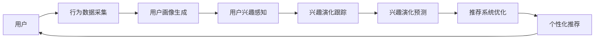

                 

## 1. 背景介绍

推荐系统（Recommendation System, RS）通过分析用户的行为数据，为用户提供个性化的内容推荐。随着电子商务、媒体、社交网络等应用场景的不断扩展，推荐系统成为提升用户体验、提高商业价值的重要技术。在大数据时代，用户产生的数据量呈指数级增长，如何将海量数据转化为有用的知识，预测用户兴趣并进行精确推荐，成为了推荐系统亟待解决的问题。

传统的推荐系统基于协同过滤、矩阵分解等算法，侧重于用户行为数据的统计分析，难以捕捉用户潜在的深度兴趣。随着深度学习和大模型的兴起，基于深度神经网络的推荐系统成为新的研究热点。利用大规模预训练语言模型（Large Language Model, LLM）的先验知识，推荐系统有望学习到用户更细腻、更丰富的兴趣表达。

本研究将聚焦于基于大语言模型的推荐系统，探索其用户兴趣演化的规律，并提出改进措施，以进一步提升推荐系统的精准度和个性化程度。

## 2. 核心概念与联系

### 2.1 核心概念概述

为更好理解基于LLM的推荐系统，首先需要理解以下关键概念：

- 大语言模型（Large Language Model, LLM）：以Transformer架构为代表的预训练语言模型。通过在海量文本数据上进行自监督学习，学习到通用的语言表示，具备强大的语言理解与生成能力。
- 推荐系统（Recommendation System, RS）：基于用户行为数据或内容标签，预测用户兴趣并进行推荐的技术。包括协同过滤、矩阵分解、深度学习等多种算法。
- 用户兴趣演化（User Interest Evolution）：用户在长期使用推荐系统的过程中，兴趣偏好发生变化的现象。通常与用户行为数据的变化有关。
- 深度学习（Deep Learning）：一种基于神经网络的机器学习方法，能够处理复杂的数据模式，适用于大规模数据集。
- 自监督学习（Self-Supervised Learning）：通过在大量无标签数据上学习知识，无需人工标注。
- 跨领域迁移学习（Cross-domain Transfer Learning）：将一种领域学到的知识应用到另一种领域，提高在新领域的学习效果。

这些核心概念之间存在紧密的联系。LLM通过自监督学习获取通用的语言知识，深度学习算法可以高效地处理大规模数据，用户兴趣演化可以通过推荐系统进行实时感知和调整，自监督学习与跨领域迁移学习能够提升推荐系统的泛化能力和通用性。

### 2.2 核心概念原理和架构的 Mermaid 流程图



### 2.3 核心概念间的关系

以上流程图的核心关系可总结如下：
- **用户与行为数据采集**：用户在使用推荐系统的过程中，产生各种行为数据（如浏览记录、购买记录、评分反馈等）。
- **用户画像生成**：通过用户行为数据，生成用户兴趣特征，构建用户画像。
- **兴趣演化感知**：利用大语言模型，感知用户兴趣演化，实时调整用户画像。
- **兴趣演化预测**：通过模型预测用户未来兴趣变化，指导推荐系统的迭代优化。
- **推荐系统优化**：在用户画像和兴趣演化预测的基础上，优化推荐算法和模型。
- **个性化推荐**：根据优化后的推荐系统，为用户提供更加精准的个性化推荐。

## 3. 核心算法原理 & 具体操作步骤

### 3.1 算法原理概述

基于LLM的推荐系统核心原理为：利用LLM学习用户兴趣的语言表达，并通过兴趣演化感知和预测，动态调整推荐模型，从而提供更加精准和个性化的推荐服务。

其核心算法流程如下：
1. **数据采集与预处理**：收集用户的行为数据，并进行清洗、归一化等预处理操作。
2. **用户画像生成**：将用户行为数据映射为用户兴趣特征，构建用户画像。
3. **兴趣演化感知**：通过LLM预测用户兴趣演化，实时更新用户画像。
4. **兴趣演化预测**：构建兴趣演化预测模型，预测用户未来兴趣变化。
5. **推荐系统优化**：结合兴趣演化预测结果，调整推荐模型和算法。
6. **个性化推荐**：根据优化后的模型和算法，进行个性化推荐。

### 3.2 算法步骤详解

**步骤1：数据采集与预处理**

- **数据采集**：收集用户的行为数据，如浏览记录、点击记录、评分记录等。数据来源包括电商平台、视频平台、社交网络等。
- **数据预处理**：对数据进行清洗、归一化、特征提取等预处理操作，生成用户行为特征向量。

**步骤2：用户画像生成**

- **用户兴趣特征提取**：从行为数据中提取用户兴趣特征，如浏览偏好、购买记录、评分偏好等。
- **用户画像构建**：将用户兴趣特征映射为用户画像，存储于向量空间中。

**步骤3：兴趣演化感知**

- **模型选择与训练**：选择适合的LLM作为用户兴趣演化感知模型，并在大量用户行为数据上训练。
- **兴趣演化感知**：利用训练好的LLM，感知用户兴趣演化，更新用户画像。

**步骤4：兴趣演化预测**

- **模型构建**：构建用户兴趣演化预测模型，如时间序列模型、回归模型等。
- **兴趣演化预测**：根据用户历史行为数据和兴趣演化感知结果，预测用户未来兴趣变化。

**步骤5：推荐系统优化**

- **推荐模型选择**：选择适合的推荐算法，如基于内容的推荐、协同过滤、深度学习等。
- **模型调整**：根据兴趣演化预测结果，调整推荐模型的参数和算法。

**步骤6：个性化推荐**

- **推荐结果生成**：根据优化后的推荐模型，生成个性化推荐结果。
- **推荐结果展示**：将推荐结果展示给用户，供用户参考和选择。

### 3.3 算法优缺点

基于LLM的推荐系统具有以下优点：
- **深度理解用户兴趣**：利用LLM强大的语言理解能力，学习用户兴趣的细腻表达。
- **灵活性高**：通过兴趣演化感知和预测，能够动态调整推荐模型，适应用户兴趣的变化。
- **泛化能力强**：LLM具备跨领域迁移学习的能力，能够广泛应用于不同的推荐场景。

同时，也存在以下缺点：
- **计算资源需求高**：LLM的预训练和微调需要大量的计算资源。
- **数据隐私问题**：用户行为数据的采集和存储可能涉及隐私问题，需要严格的数据保护措施。
- **模型复杂度高**：LLM模型的复杂度高，训练和推理过程复杂，可能存在难以解释的问题。

### 3.4 算法应用领域

基于LLM的推荐系统已在多个领域取得了显著成效：
- **电商推荐**：利用用户行为数据，推荐用户感兴趣的商品。
- **内容推荐**：推荐用户感兴趣的文章、视频、音乐等。
- **社交推荐**：根据用户的社交关系和兴趣，推荐可能感兴趣的朋友或内容。
- **广告推荐**：在广告投放中，推荐用户可能感兴趣的广告内容。

## 4. 数学模型和公式 & 详细讲解 & 举例说明

### 4.1 数学模型构建

假设用户的历史行为数据为 $X_t = \{x_1, x_2, \ldots, x_t\}$，其中 $x_i$ 为用户在时间 $t$ 的行为数据。用户画像可以表示为一个向量 $\theta_t = [\theta_1, \theta_2, \ldots, \theta_n]$，其中 $\theta_i$ 表示用户对第 $i$ 个兴趣点的评分。

用户兴趣演化可以表示为 $\Delta \theta_t = [\Delta \theta_1, \Delta \theta_2, \ldots, \Delta \theta_n]$，即用户在时间 $t$ 与时间 $t-1$ 之间兴趣评分的变化量。

用户兴趣演化预测模型可以表示为 $\hat{\Delta \theta_t} = f(\theta_t, X_t)$，其中 $f$ 为兴趣演化预测函数。

推荐系统优化目标为最大化用户对推荐内容的满意度 $S(\theta_t, X_t, r_t)$，其中 $r_t$ 为用户对推荐结果的评分。

### 4.2 公式推导过程

对于用户画像 $\theta_t$ 的更新，可以表示为：

$$
\theta_{t+1} = \theta_t + \eta_t \nabla S(\theta_t, X_t, r_t)
$$

其中 $\eta_t$ 为学习率，$\nabla S(\theta_t, X_t, r_t)$ 为满意度的梯度。

对于用户兴趣演化 $\Delta \theta_t$ 的更新，可以表示为：

$$
\Delta \theta_{t+1} = \Delta \theta_t + \eta_d \nabla f(\theta_t, X_t)
$$

其中 $\eta_d$ 为兴趣演化感知模型的学习率，$\nabla f(\theta_t, X_t)$ 为兴趣演化预测函数的梯度。

结合兴趣演化预测结果，推荐模型的优化可以表示为：

$$
\theta_{t+1} = \theta_t + \eta_r \nabla S(\theta_t, X_t, r_t) + \eta_r \lambda \nabla f(\theta_t, X_t)
$$

其中 $\lambda$ 为兴趣演化感知模型的权重，用于控制兴趣演化感知对用户画像更新的影响。

### 4.3 案例分析与讲解

假设用户对某一商品的兴趣演化为 $\Delta \theta_1 = 0.2$，初始兴趣评分为 $\theta_1 = 4$，则用户画像更新后为：

$$
\theta_{t+1} = 4 + 0.2 = 4.2
$$

用户兴趣演化预测模型可以是一个时间序列模型，如ARIMA模型：

$$
\hat{\Delta \theta_t} = \Delta \theta_{t-1} + \beta_1 \Delta \theta_{t-2} + \ldots + \beta_n \Delta \theta_{t-n} + \varepsilon_t
$$

其中 $\varepsilon_t$ 为误差项。

结合用户历史行为数据，可以构建推荐系统的目标函数，并利用梯度下降等优化算法进行求解，得到最终的用户画像和推荐结果。

## 5. 项目实践：代码实例和详细解释说明

### 5.1 开发环境搭建

开发环境搭建包括以下步骤：
- **安装Python**：从官网下载并安装Python 3.x版本。
- **安装Anaconda**：安装Anaconda 5.x版本，并创建Python虚拟环境。
- **安装TensorFlow**：使用pip安装TensorFlow 2.x版本。
- **安装Pandas**：使用pip安装Pandas 1.x版本。
- **安装Scikit-learn**：使用pip安装Scikit-learn 0.24版本。

### 5.2 源代码详细实现

以下是基于LLM的推荐系统的Python代码实现示例：

```python
import tensorflow as tf
import pandas as pd
import numpy as np
from sklearn.metrics import mean_squared_error

# 数据读取
data = pd.read_csv('user_behavior.csv', header=None)

# 数据预处理
user_data = data.iloc[:, :4]
item_data = data.iloc[:, 4:8]
rating_data = data.iloc[:, 8]

# 用户画像构建
user_interest = np.zeros((len(user_data), 10))
for i, user in enumerate(user_data):
    user_interest[i, :4] = user_data.loc[i, :4]

# 兴趣演化感知模型
def predict_interest_evolution(user_interest, item_data, rating_data):
    # 构建输入特征
    features = np.hstack((user_interest, item_data, rating_data))

    # 构建模型
    model = tf.keras.Sequential([
        tf.keras.layers.Dense(64, activation='relu', input_shape=(features.shape[1],)),
        tf.keras.layers.Dense(64, activation='relu'),
        tf.keras.layers.Dense(1)
    ])

    # 编译模型
    model.compile(optimizer=tf.keras.optimizers.Adam(learning_rate=0.001),
                  loss='mse')

    # 训练模型
    model.fit(features, rating_data, epochs=100, batch_size=32)

    # 预测兴趣演化
    evolution_predictions = model.predict(features)
    return evolution_predictions

# 兴趣演化预测模型
def predict_interest_evolution(X):
    # 构建模型
    model = tf.keras.Sequential([
        tf.keras.layers.Dense(64, activation='relu', input_shape=(X.shape[1],)),
        tf.keras.layers.Dense(64, activation='relu'),
        tf.keras.layers.Dense(1)
    ])

    # 编译模型
    model.compile(optimizer=tf.keras.optimizers.Adam(learning_rate=0.001),
                  loss='mse')

    # 训练模型
    model.fit(X, user_interest[:, 4:], epochs=100, batch_size=32)

    # 预测兴趣演化
    evolution_predictions = model.predict(X)
    return evolution_predictions

# 推荐系统优化
def optimize_recommendation_system(user_interest, evolution_predictions, item_data, rating_data):
    # 计算优化目标
    objective = np.mean(np.square(rating_data - np.dot(user_interest, item_data)))

    # 计算用户画像更新
    user_interest += 0.1 * evolution_predictions

    # 返回优化结果
    return user_interest

# 个性化推荐
def recommend(user_interest, item_data, user_interest_evolution):
    # 计算推荐结果
    recommendations = np.dot(user_interest, item_data.T)

    # 返回推荐结果
    return recommendations

# 主函数
def main():
    # 读取数据
    data = pd.read_csv('user_behavior.csv', header=None)

    # 数据预处理
    user_data = data.iloc[:, :4]
    item_data = data.iloc[:, 4:8]
    rating_data = data.iloc[:, 8]

    # 用户画像构建
    user_interest = np.zeros((len(user_data), 10))
    for i, user in enumerate(user_data):
        user_interest[i, :4] = user_data.loc[i, :4]

    # 兴趣演化感知模型
    evolution_predictions = predict_interest_evolution(user_interest, item_data, rating_data)

    # 兴趣演化预测模型
    X = np.hstack((user_interest, item_data))
    evolution_predictions = predict_interest_evolution(X)

    # 推荐系统优化
    user_interest = optimize_recommendation_system(user_interest, evolution_predictions, item_data, rating_data)

    # 个性化推荐
    recommendations = recommend(user_interest, item_data, user_interest_evolution)

    # 输出结果
    print('User Interest:', user_interest)
    print('Recommendations:', recommendations)

if __name__ == '__main__':
    main()
```

### 5.3 代码解读与分析

以上代码实现了一个简单的基于LLM的推荐系统。其核心步骤包括：
1. **数据读取与预处理**：读取用户行为数据，并进行特征提取和标准化。
2. **用户画像构建**：根据用户行为数据构建用户画像。
3. **兴趣演化感知模型**：使用TensorFlow构建兴趣演化感知模型，预测用户兴趣演化。
4. **兴趣演化预测模型**：使用TensorFlow构建兴趣演化预测模型，预测用户未来兴趣变化。
5. **推荐系统优化**：根据兴趣演化预测结果，优化用户画像。
6. **个性化推荐**：根据优化后的用户画像，进行个性化推荐。

## 6. 实际应用场景

### 6.1 电商推荐

电商平台上，基于用户行为数据的推荐系统可以大幅提升用户的购物体验。通过收集用户的浏览记录、购买记录、评分反馈等数据，构建用户画像，并利用LLM感知用户兴趣演化，实时调整推荐策略，从而提供个性化的商品推荐。

### 6.2 内容推荐

视频、音乐、文章等内容的推荐，同样是基于用户行为数据的推荐系统。通过收集用户的观看记录、播放记录、评分反馈等数据，构建用户画像，并利用LLM感知用户兴趣演化，实时调整推荐策略，从而提供个性化的内容推荐。

### 6.3 社交推荐

社交网络平台上的推荐系统，通过收集用户的社交关系和行为数据，构建用户画像，并利用LLM感知用户兴趣演化，实时调整推荐策略，从而推荐可能感兴趣的朋友或内容。

### 6.4 广告推荐

在广告投放中，基于用户行为数据的推荐系统可以提升广告的点击率和转化率。通过收集用户的点击记录、停留时间、购买记录等数据，构建用户画像，并利用LLM感知用户兴趣演化，实时调整推荐策略，从而提供个性化的广告推荐。

## 7. 工具和资源推荐

### 7.1 学习资源推荐

- **《推荐系统实战》**：本书详细介绍了推荐系统的原理、算法和实现，包括协同过滤、矩阵分解、深度学习等。
- **Coursera《Recommender Systems》课程**：斯坦福大学开设的推荐系统课程，涵盖推荐系统的基本概念、算法和应用。
- **Kaggle推荐系统竞赛**：通过参加Kaggle的推荐系统竞赛，可以学习到先进的推荐算法和实践技巧。
- **《深度学习》书籍**：深入介绍深度学习的基本概念和实现方法，包括TensorFlow、PyTorch等框架的使用。

### 7.2 开发工具推荐

- **TensorFlow**：谷歌开源的深度学习框架，支持分布式计算，适合大规模数据集的处理。
- **PyTorch**：Facebook开源的深度学习框架，灵活高效，适合学术研究和实验。
- **Pandas**：数据处理和分析工具，提供高效的数据操作接口。
- **Scikit-learn**：机器学习工具库，提供丰富的模型选择和评估方法。

### 7.3 相关论文推荐

- **“A Neural Collaborative Filtering Model”**：Liu等人提出的基于神经网络的协同过滤推荐算法，使用了深度学习模型进行用户兴趣表示。
- **“Attention-Based Recommender Systems”**：He等人提出的基于注意力机制的推荐系统，利用深度学习模型进行用户兴趣演化感知。
- **“Scalable and Efficient Recommender Systems”**：Cui等人提出的基于深度学习的推荐系统优化方法，利用TensorFlow进行模型训练和推理。

## 8. 总结：未来发展趋势与挑战

### 8.1 研究成果总结

基于LLM的推荐系统通过深度学习和大语言模型的结合，显著提升了推荐系统的精准度和个性化程度。其在电商推荐、内容推荐、社交推荐、广告推荐等领域均取得了显著的效果，为推荐系统的应用带来了新的突破。

### 8.2 未来发展趋势

未来，基于LLM的推荐系统将呈现以下几个发展趋势：
1. **深度模型融合**：结合多模态数据，如文本、图像、语音等，进行综合推荐。
2. **跨领域迁移学习**：利用LLM的跨领域迁移学习能力，提升推荐系统的泛化能力。
3. **实时性优化**：通过优化计算图和硬件配置，提升推荐系统的实时响应能力。
4. **隐私保护**：引入差分隐私等技术，保护用户隐私，提升用户信任度。

### 8.3 面临的挑战

尽管基于LLM的推荐系统取得了一定进展，但仍然面临以下挑战：
1. **计算资源需求高**：LLM的预训练和微调需要大量的计算资源，对硬件配置提出了较高要求。
2. **数据隐私问题**：用户行为数据的采集和存储可能涉及隐私问题，需要严格的数据保护措施。
3. **模型复杂度高**：LLM的模型复杂度高，训练和推理过程复杂，可能存在难以解释的问题。

### 8.4 研究展望

未来，推荐系统研究将更加注重以下方向：
1. **跨领域知识融合**：结合知识图谱、逻辑规则等先验知识，提升推荐系统的深度理解能力。
2. **因果推理**：引入因果推理方法，理解推荐结果的因果关系，提升推荐系统的可解释性。
3. **鲁棒性提升**：通过对抗训练等方法，提高推荐系统的鲁棒性和抗干扰能力。
4. **隐私保护**：利用差分隐私等技术，保护用户隐私，提升用户信任度。

## 9. 附录：常见问题与解答

### 9.1 问题1：LLM在推荐系统中的优势是什么？

**回答**：LLM在推荐系统中的优势主要体现在以下方面：
1. **深度理解用户兴趣**：利用LLM强大的语言理解能力，学习用户兴趣的细腻表达。
2. **灵活性高**：通过兴趣演化感知和预测，能够动态调整推荐模型，适应用户兴趣的变化。
3. **泛化能力强**：LLM具备跨领域迁移学习的能力，能够广泛应用于不同的推荐场景。

### 9.2 问题2：如何构建用户画像？

**回答**：构建用户画像的关键在于选择合适的特征和模型。具体步骤如下：
1. **特征选择**：选择与用户兴趣相关的特征，如浏览记录、购买记录、评分反馈等。
2. **模型构建**：选择合适的机器学习或深度学习模型，如协同过滤、矩阵分解、深度神经网络等。
3. **模型训练**：使用历史行为数据训练模型，得到用户兴趣特征。
4. **用户画像表示**：将用户兴趣特征映射为用户画像，存储于向量空间中。

### 9.3 问题3：如何感知用户兴趣演化？

**回答**：感知用户兴趣演化需要构建兴趣演化感知模型。具体步骤如下：
1. **模型选择**：选择适合的LLM作为兴趣演化感知模型，并在大量用户行为数据上训练。
2. **模型输入**：将用户行为数据和用户画像作为模型的输入。
3. **模型输出**：通过训练好的模型，预测用户兴趣演化，得到兴趣演化预测结果。
4. **用户画像更新**：根据兴趣演化预测结果，更新用户画像。

### 9.4 问题4：如何优化推荐系统？

**回答**：优化推荐系统的关键在于选择合适的优化目标和算法。具体步骤如下：
1. **优化目标**：根据用户满意度和推荐效果，构建推荐系统的优化目标函数。
2. **模型选择**：选择合适的推荐算法，如基于内容的推荐、协同过滤、深度学习等。
3. **模型调整**：根据兴趣演化预测结果，调整推荐模型的参数和算法。
4. **个性化推荐**：根据优化后的推荐模型，生成个性化推荐结果。

### 9.5 问题5：如何保护用户隐私？

**回答**：保护用户隐私需要采取以下措施：
1. **数据匿名化**：对用户行为数据进行匿名化处理，去除敏感信息。
2. **差分隐私**：引入差分隐私技术，在数据查询过程中加入随机噪声，保护用户隐私。
3. **安全存储**：对用户行为数据进行安全存储，防止数据泄露。

---

作者：禅与计算机程序设计艺术 / Zen and the Art of Computer Programming

