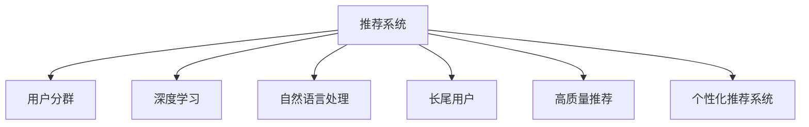

                 

# 基于LLM的推荐系统用户分群

> 关键词：推荐系统,用户分群,深度学习,自然语言处理,长尾用户,高质量推荐,个性化推荐系统

## 1. 背景介绍

### 1.1 问题由来

随着电商、视频、音乐、新闻等平台的发展，推荐系统在用户体验和业务收益上发挥着越来越重要的作用。好的推荐系统能够显著提升用户粘性和业务收入。但是，推荐系统不仅要推荐热门商品，还要能够挖掘出长尾商品的潜在用户，这带来了新的挑战。

### 1.2 问题核心关键点

通过分析用户的点击、浏览、评分等行为，推荐系统需要识别哪些用户对长尾商品感兴趣。传统的推荐算法只能处理部分高频数据，但难以从长尾数据中挖掘用户需求。如何通过深度学习，尤其是基于大语言模型的方法，进行用户分群，是当前研究的热点。

### 1.3 问题研究意义

基于大语言模型的方法可以更好地处理文本类数据，从而识别出用户的长尾需求。通过用户分群，推荐系统能够更精准地推荐长尾商品，提升用户满意度，同时也能为平台带来更多元化的收入。

## 2. 核心概念与联系

### 2.1 核心概念概述

为更好地理解基于大语言模型的方法进行用户分群，本节将介绍几个密切相关的核心概念：

- 推荐系统(Recommendation System)：根据用户的历史行为和偏好，推荐可能感兴趣的商品、内容等。
- 用户分群(User Segmentation)：将用户群体划分为不同的类别，以更好地理解和推荐用户。
- 深度学习(Deep Learning)：使用多层神经网络进行学习和决策，提升推荐精度和泛化能力。
- 自然语言处理(Natural Language Processing, NLP)：处理和分析人类语言数据的技术，尤其是文本分类、情感分析等任务。
- 长尾用户(Long-Tail User)：指那些对热门商品不感兴趣，但对小众商品或个性化需求感兴趣的少数用户。
- 高质量推荐(High-Quality Recommendation)：精准推荐用户感兴趣的商品，提升用户满意度和平台收益。
- 个性化推荐系统(Personalized Recommendation System)：根据用户个性化需求进行推荐，提升推荐效果。

这些核心概念之间的逻辑关系可以通过以下Mermaid流程图来展示：



这个流程图展示了大语言模型在推荐系统中的应用框架：

1. 推荐系统通过用户行为数据进行学习，识别用户的兴趣。
2. 深度学习帮助推荐系统提升学习能力和泛化能力。
3. 自然语言处理用于处理文本数据，识别用户需求。
4. 用户分群通过聚类算法，将用户划分为不同的群体。
5. 长尾用户关注那些较少用户点击的、个性化的小众商品。
6. 高质量推荐追求精准度，为用户推荐最相关的商品。
7. 个性化推荐系统通过深度学习和用户分群，实现个性化推荐。

## 3. 核心算法原理 & 具体操作步骤
### 3.1 算法原理概述

基于大语言模型的方法进行用户分群，本质上是一个有监督的聚类问题。其核心思想是：使用大语言模型对用户行为数据进行处理，提取用户特征，并使用聚类算法将这些用户特征相似的用户划分为一组，形成用户分群。

形式化地，假设用户的历史行为数据为 $X=\{x_1,x_2,\ldots,x_n\}$，其中 $x_i$ 为第 $i$ 个用户的浏览、点击等行为数据。目标是找到一个聚类算法 $C$，将 $X$ 划分为 $K$ 个用户群 $G=\{G_1,G_2,\ldots,G_K\}$，使得每个群体内的用户特征相似度最大化。

假设大语言模型 $M_{\theta}$ 的输入为 $X$，输出为 $Y=\{y_1,y_2,\ldots,y_n\}$，其中 $y_i$ 为第 $i$ 个用户的特征向量。设聚类算法 $C$ 的输出为聚类结果 $G=\{G_1,G_2,\ldots,G_K\}$，则优化目标为：

$$
\min_{\theta} \sum_{i=1}^n \sum_{j=1}^K \mathbb{I}_{y_i \in G_j} \cdot \ell(y_i, C(G))
$$

其中 $\ell(y_i, C(G))$ 为特征 $y_i$ 与聚类中心 $C(G)$ 的相似度，$\mathbb{I}_{y_i \in G_j}$ 为 $y_i$ 是否属于第 $j$ 个群体。

### 3.2 算法步骤详解

基于大语言模型的方法进行用户分群一般包括以下几个关键步骤：

**Step 1: 准备用户数据和模型**

- 收集用户的历史行为数据，包括浏览、点击、评分等行为数据。
- 选择合适的预训练语言模型 $M_{\theta}$ 作为特征提取器，如BERT、GPT等。
- 定义特征提取器 $M_{\theta}$ 的输入格式，通常是文本数据，也可能是图形数据、时间序列数据等。

**Step 2: 预训练大语言模型**

- 对预训练语言模型 $M_{\theta}$ 进行微调，使其能够处理目标领域的文本数据。
- 使用目标领域的数据集对模型进行微调，通常需要较少的标注数据。
- 保存微调后的模型参数 $\theta^*$。

**Step 3: 特征提取与聚类**

- 使用微调后的模型 $M_{\theta^*}$ 对用户数据 $X$ 进行特征提取，得到每个用户的特征向量 $Y=\{y_1,y_2,\ldots,y_n\}$。
- 使用聚类算法 $C$ 对特征向量 $Y$ 进行聚类，形成 $K$ 个用户群 $G=\{G_1,G_2,\ldots,G_K\}$。
- 将每个用户分配到最相似的聚类中心，得到用户分群结果。

**Step 4: 评估与优化**

- 对聚类结果进行评估，使用诸如轮廓系数、调差系数等指标，衡量聚类的效果。
- 根据评估结果，调整聚类算法的参数，如聚类数 $K$、特征提取器 $M_{\theta^*}$ 的超参数等。
- 重复上述步骤，直至得到满意的聚类结果。

### 3.3 算法优缺点

基于大语言模型的方法进行用户分群，具有以下优点：

1. 能够处理文本数据，识别长尾需求。大语言模型在文本处理上表现优异，可以识别那些难以通过传统推荐算法发现的需求。
2. 参数灵活，易于优化。大语言模型可以通过微调等方式，优化参数以适应不同的任务和数据。
3. 可解释性强。用户分群的决策过程可以通过语言模型来解释，帮助理解聚类效果。

同时，该方法也存在以下局限性：

1. 依赖标注数据。特征提取和聚类需要标注数据，获取高质量标注数据成本较高。
2. 对数据质量敏感。标注数据的质量和多样性会影响聚类效果。
3. 计算复杂度高。大语言模型通常具有较多的参数，训练和推理计算复杂度较高。
4. 可解释性差。聚类结果可能难以直接解释，难以理解聚类的逻辑。

尽管存在这些局限性，但就目前而言，基于大语言模型的方法在用户分群上仍具有重要的研究价值和应用前景。

### 3.4 算法应用领域

基于大语言模型的方法在推荐系统中有着广泛的应用，主要涉及以下几个方面：

- 电商推荐：通过用户分群，对长尾商品进行精准推荐，提升用户购买率。
- 视频推荐：识别不同用户群体的偏好，推荐适合的影视作品。
- 音乐推荐：从用户听歌行为中提取特征，形成用户分群，推荐冷门歌曲。
- 新闻推荐：根据用户阅读习惯，进行聚类和推荐，提升用户粘性。
- 广告推荐：识别不同用户群体的兴趣，精准投放广告，提高广告点击率。

## 4. 数学模型和公式 & 详细讲解  
### 4.1 数学模型构建

本节将使用数学语言对基于大语言模型的方法进行用户分群过程进行更加严格的刻画。

假设用户的历史行为数据为 $X=\{x_1,x_2,\ldots,x_n\}$，其中 $x_i$ 为第 $i$ 个用户的浏览、点击等行为数据。设预训练语言模型 $M_{\theta}$ 的输入为 $x_i$，输出为 $y_i$，其中 $y_i$ 为第 $i$ 个用户的特征向量。聚类算法 $C$ 的输出为聚类结果 $G=\{G_1,G_2,\ldots,G_K\}$，其中 $G_j=\{x_{j_1},x_{j_2},\ldots,x_{j_m}\}$ 表示第 $j$ 个用户群中的用户。

定义聚类算法 $C$ 的损失函数为：

$$
\mathcal{L}(G) = \sum_{i=1}^n \sum_{j=1}^K \mathbb{I}_{y_i \in G_j} \cdot \ell(y_i, C(G))
$$

其中 $\ell(y_i, C(G))$ 为特征 $y_i$ 与聚类中心 $C(G)$ 的相似度，$\mathbb{I}_{y_i \in G_j}$ 为 $y_i$ 是否属于第 $j$ 个群体。

### 4.2 公式推导过程

以下我们以二分类任务为例，推导聚类算法的损失函数及其梯度的计算公式。

假设用户的历史行为数据为 $X=\{x_1,x_2,\ldots,x_n\}$，其中 $x_i$ 为第 $i$ 个用户的浏览、点击等行为数据。设预训练语言模型 $M_{\theta}$ 的输入为 $x_i$，输出为 $y_i$，其中 $y_i$ 为第 $i$ 个用户的特征向量。聚类算法 $C$ 的输出为聚类结果 $G=\{G_1,G_2,\ldots,G_K\}$，其中 $G_j=\{x_{j_1},x_{j_2},\ldots,x_{j_m}\}$ 表示第 $j$ 个用户群中的用户。

定义聚类算法 $C$ 的损失函数为：

$$
\mathcal{L}(G) = \sum_{i=1}^n \sum_{j=1}^K \mathbb{I}_{y_i \in G_j} \cdot \ell(y_i, C(G))
$$

其中 $\ell(y_i, C(G))$ 为特征 $y_i$ 与聚类中心 $C(G)$ 的相似度，$\mathbb{I}_{y_i \in G_j}$ 为 $y_i$ 是否属于第 $j$ 个群体。

在得到损失函数 $\mathcal{L}(G)$ 后，可以通过梯度下降等优化算法，最小化损失函数，得到最优的聚类结果 $G^*$。

在实际应用中，我们通常使用聚类算法如K-means、层次聚类、GMM等对用户进行聚类。这些算法虽然简单高效，但在处理大规模数据时，计算复杂度较高。可以考虑采用分布式聚类算法或GPU加速技术，提升聚类效率。

## 5. 项目实践：代码实例和详细解释说明
### 5.1 开发环境搭建

在进行用户分群实践前，我们需要准备好开发环境。以下是使用Python进行PyTorch开发的环境配置流程：

1. 安装Anaconda：从官网下载并安装Anaconda，用于创建独立的Python环境。

2. 创建并激活虚拟环境：
```bash
conda create -n pytorch-env python=3.8 
conda activate pytorch-env
```

3. 安装PyTorch：根据CUDA版本，从官网获取对应的安装命令。例如：
```bash
conda install pytorch torchvision torchaudio cudatoolkit=11.1 -c pytorch -c conda-forge
```

4. 安装相关库：
```bash
pip install numpy pandas scikit-learn transformers sklearn
```

5. 安装深度学习框架：
```bash
pip install torch torchvision torchtext
```

6. 安装TensorBoard：用于可视化训练过程中的各项指标。
```bash
pip install tensorboard
```

完成上述步骤后，即可在`pytorch-env`环境中开始用户分群的实践。

### 5.2 源代码详细实现

下面我们以基于BERT模型的用户分群为例，给出使用PyTorch代码实现。

首先，定义用户数据和模型：

```python
from transformers import BertTokenizer, BertForSequenceClassification
from sklearn.cluster import KMeans
import pandas as pd

# 定义数据路径和标签
data_path = 'data/user_behavior.csv'
label_path = 'data/user_labels.csv'

# 加载数据和标签
data = pd.read_csv(data_path)
labels = pd.read_csv(label_path)

# 加载BERT预训练模型和分词器
model_name = 'bert-base-uncased'
tokenizer = BertTokenizer.from_pretrained(model_name)
model = BertForSequenceClassification.from_pretrained(model_name, num_labels=2)

# 定义特征提取函数
def get_features(text):
    inputs = tokenizer.encode(text, add_special_tokens=True, return_tensors='pt')
    inputs = inputs.to(device)
    outputs = model(inputs)
    return outputs.pooler_output.tolist()[0]
```

然后，进行特征提取和聚类：

```python
# 定义特征提取器
def extract_features(data):
    features = []
    for text in data['text']:
        features.append(get_features(text))
    return features

# 特征提取
features = extract_features(data['text'])

# 聚类
kmeans = KMeans(n_clusters=3, random_state=42)
kmeans.fit(features)
```

最后，保存聚类结果：

```python
# 保存聚类结果
with open('user_clusters.txt', 'w') as f:
    for i, cluster in enumerate(kmeans.labels_):
        f.write(f"{i} {cluster}\n")
```

以上就是使用PyTorch对BERT模型进行用户分群的完整代码实现。可以看到，通过简单的特征提取和聚类，即可得到用户分群结果。

### 5.3 代码解读与分析

让我们再详细解读一下关键代码的实现细节：

**特征提取函数**：
- `get_features`方法：利用BERT模型对输入文本进行特征提取，返回每个用户的行为特征向量。

**特征提取器**：
- `extract_features`方法：遍历数据集中的所有文本，使用特征提取函数 `get_features` 对每个文本进行特征提取，返回一个包含所有用户特征向量的列表。

**聚类算法**：
- `KMeans`类：使用sklearn库的KMeans算法对特征向量进行聚类，得到用户分群结果。
- `n_clusters`参数：设置聚类数，通常需要通过多次实验选择最优值。
- `random_state`参数：设置随机种子，确保聚类结果的可复现性。

**保存聚类结果**：
- `user_clusters.txt`文件：保存用户分群结果，便于后续分析和使用。

可以看到，使用大语言模型的方法进行用户分群，代码实现相对简单，而且利用已有库可以方便地进行特征提取和聚类。

## 6. 实际应用场景

### 6.1 电商推荐

在电商推荐中，用户分群可以帮助识别出对长尾商品感兴趣的用户，从而进行精准推荐。具体而言，可以通过用户浏览、点击、评分等行为数据，提取用户的特征，并进行聚类，形成不同用户群。然后根据每个用户群的特点，进行推荐，提升用户购买率。

例如，电商平台可以对用户的浏览记录进行聚类，识别出对运动鞋、户外用品等长尾商品感兴趣的用户，并针对性地进行推荐。这不仅能够提升用户的购物体验，也能够增加平台的多元化收入。

### 6.2 视频推荐

视频推荐系统需要对用户的观看行为进行聚类，识别出不同的用户群。例如，通过对用户观看电影、电视剧等行为的聚类，可以发现对科幻、奇幻等题材感兴趣的少数用户。然后根据这些用户群的特点，进行相应的推荐，提升用户的观看时长和满意度。

### 6.3 音乐推荐

音乐推荐系统需要处理大量的文本数据，通过聚类算法，可以识别出不同的用户群。例如，通过对用户听歌行为的聚类，可以发现对古典音乐、电子音乐等不同流派感兴趣的少数用户。然后根据这些用户群的特点，进行相应的推荐，提升用户的听歌体验和平台的收益。

### 6.4 新闻推荐

新闻推荐系统需要处理大量的文本数据，通过聚类算法，可以识别出不同的用户群。例如，通过对用户阅读新闻的行为进行聚类，可以发现对体育、科技等不同话题感兴趣的少数用户。然后根据这些用户群的特点，进行相应的推荐，提升用户的阅读粘性和平台的收益。

## 7. 工具和资源推荐
### 7.1 学习资源推荐

为了帮助开发者系统掌握大语言模型的方法进行用户分群，这里推荐一些优质的学习资源：

1. 《深度学习入门：基于TensorFlow的理论与实现》系列博文：由TensorFlow官方团队撰写，介绍了深度学习的基础理论和实践方法，包括文本处理、聚类等技术。

2. 《自然语言处理综论》课程：斯坦福大学开设的NLP课程，讲解了NLP领域的基础知识和最新技术，包括用户分群等应用。

3. 《推荐系统实战》书籍：详细介绍了推荐系统的理论基础和实践方法，包括用户分群、协同过滤等技术。

4. 《User Segmentation with Deep Learning》论文：介绍了大语言模型在用户分群中的应用，详细介绍了特征提取、聚类算法等技术。

5. 《Text Clustering and Classification with TensorFlow》代码：提供了基于TensorFlow的文本聚类示例代码，帮助开发者实践聚类算法。

通过对这些资源的学习实践，相信你一定能够快速掌握大语言模型的方法进行用户分群的精髓，并用于解决实际的推荐系统问题。

### 7.2 开发工具推荐

高效的开发离不开优秀的工具支持。以下是几款用于用户分群开发的常用工具：

1. PyTorch：基于Python的开源深度学习框架，灵活的动态图设计，适合快速迭代研究。

2. TensorFlow：由Google主导开发的开源深度学习框架，生产部署方便，适合大规模工程应用。

3. Transformers库：HuggingFace开发的NLP工具库，集成了众多SOTA语言模型，支持PyTorch和TensorFlow，是进行用户分群开发的利器。

4. Weights & Biases：模型训练的实验跟踪工具，可以记录和可视化模型训练过程中的各项指标，方便对比和调优。

5. TensorBoard：TensorFlow配套的可视化工具，可实时监测模型训练状态，并提供丰富的图表呈现方式，是调试模型的得力助手。

合理利用这些工具，可以显著提升用户分群的开发效率，加快创新迭代的步伐。

### 7.3 相关论文推荐

大语言模型和用户分群技术的发展源于学界的持续研究。以下是几篇奠基性的相关论文，推荐阅读：

1. Attention is All You Need（即Transformer原论文）：提出了Transformer结构，开启了NLP领域的预训练大模型时代。

2. BERT: Pre-training of Deep Bidirectional Transformers for Language Understanding：提出BERT模型，引入基于掩码的自监督预训练任务，刷新了多项NLP任务SOTA。

3. Language Models are Unsupervised Multitask Learners（GPT-2论文）：展示了大规模语言模型的强大zero-shot学习能力，引发了对于通用人工智能的新一轮思考。

4. Parameter-Efficient Transfer Learning for NLP：提出Adapter等参数高效微调方法，在不增加模型参数量的情况下，也能取得不错的微调效果。

5. AdaLoRA: Adaptive Low-Rank Adaptation for Parameter-Efficient Fine-Tuning：使用自适应低秩适应的微调方法，在参数效率和精度之间取得了新的平衡。

这些论文代表了大语言模型用户分群技术的发展脉络。通过学习这些前沿成果，可以帮助研究者把握学科前进方向，激发更多的创新灵感。

## 8. 总结：未来发展趋势与挑战

### 8.1 总结

本文对基于大语言模型的方法进行用户分群方法进行了全面系统的介绍。首先阐述了大语言模型和用户分群的研究背景和意义，明确了用户分群在推荐系统中的重要作用。其次，从原理到实践，详细讲解了用户分群的技术流程，包括数据准备、模型微调、特征提取、聚类算法等。最后，探讨了用户分群在电商、视频、音乐、新闻等领域的应用前景，展示了用户分群技术的巨大潜力。

通过本文的系统梳理，可以看到，基于大语言模型的方法进行用户分群，是推荐系统中的重要一环，能够提升推荐精度和用户满意度，为平台带来更多的业务价值。

### 8.2 未来发展趋势

展望未来，基于大语言模型的方法进行用户分群技术将呈现以下几个发展趋势：

1. 算法多样化。随着深度学习算法的发展，用户分群算法也将更加多样化，从传统的K-means等，发展到层次聚类、谱聚类、密度聚类等。

2. 跨领域应用广泛。用户分群技术不仅可以应用于电商、视频、音乐等场景，还将在金融、医疗、教育等更多领域得到应用，提升这些行业的智能水平。

3. 实时性要求提升。用户分群需要实时进行，以便快速响应用户需求。未来将更多采用分布式计算、GPU加速等技术，提升聚类效率。

4. 多模态融合加强。用户分群不仅仅局限于文本数据，将更多结合图像、视频、语音等多模态数据，提升聚类效果。

5. 数据隐私保护。用户分群需要处理大量的用户数据，数据隐私保护成为重要课题。未来将更多采用联邦学习、差分隐私等技术，保护用户数据安全。

以上趋势凸显了基于大语言模型的方法进行用户分群技术的广阔前景。这些方向的探索发展，必将进一步提升推荐系统的性能和应用范围，为人类认知智能的进化带来深远影响。

### 8.3 面临的挑战

尽管基于大语言模型的方法进行用户分群技术已经取得了瞩目成就，但在迈向更加智能化、普适化应用的过程中，它仍面临着诸多挑战：

1. 数据获取困难。用户行为数据的获取往往需要高成本，且数据质量不稳定。如何获取更多高质量的用户行为数据，仍是一个重要挑战。

2. 特征提取复杂。用户行为数据往往具有复杂的特征，如何提取有效的特征向量，仍是技术难点。

3. 聚类效果不稳定。不同的聚类算法和参数设置，对聚类结果的影响较大，如何稳定聚类效果，仍是技术难点。

4. 计算复杂度高。大语言模型通常具有较多的参数，训练和推理计算复杂度较高，如何优化算法，提升聚类效率，仍是技术难点。

5. 数据隐私保护。用户分群需要处理大量的用户数据，数据隐私保护成为重要课题。如何平衡用户隐私保护和推荐效果，仍是技术难点。

正视用户分群面临的这些挑战，积极应对并寻求突破，将是大语言模型用户分群技术走向成熟的必由之路。相信随着学界和产业界的共同努力，这些挑战终将一一被克服，大语言模型用户分群技术必将在构建人机协同的智能时代中扮演越来越重要的角色。

### 8.4 研究展望

面对基于大语言模型的方法进行用户分群所面临的种种挑战，未来的研究需要在以下几个方面寻求新的突破：

1. 探索无监督和半监督聚类方法。摆脱对大量标注数据的依赖，利用自监督学习、主动学习等无监督和半监督范式，最大限度利用非结构化数据，实现更加灵活高效的聚类。

2. 研究参数高效和计算高效的聚类范式。开发更加参数高效的聚类方法，在固定大部分预训练参数的同时，只更新极少量的聚类参数。同时优化聚类算法的计算图，减少前向传播和反向传播的资源消耗，实现更加轻量级、实时性的部署。

3. 融合因果和对比学习范式。通过引入因果推断和对比学习思想，增强聚类模型的建立稳定因果关系的能力，学习更加普适、鲁棒的用户特征表示，从而提升聚类效果。

4. 引入更多先验知识。将符号化的先验知识，如知识图谱、逻辑规则等，与神经网络模型进行巧妙融合，引导聚类过程学习更准确、合理的用户特征。同时加强不同模态数据的整合，实现视觉、语音等多模态信息与文本信息的协同建模。

5. 结合因果分析和博弈论工具。将因果分析方法引入聚类模型，识别出聚类决策的关键特征，增强输出解释的因果性和逻辑性。借助博弈论工具刻画人机交互过程，主动探索并规避聚类模型的脆弱点，提高系统稳定性。

这些研究方向的探索，必将引领基于大语言模型的方法进行用户分群技术迈向更高的台阶，为构建安全、可靠、可解释、可控的智能系统铺平道路。面向未来，基于大语言模型的方法进行用户分群技术还需要与其他人工智能技术进行更深入的融合，如知识表示、因果推理、强化学习等，多路径协同发力，共同推动自然语言理解和智能交互系统的进步。只有勇于创新、敢于突破，才能不断拓展语言模型的边界，让智能技术更好地造福人类社会。

## 9. 附录：常见问题与解答

**Q1：用户分群需要多少标注数据？**

A: 用户分群通常需要较少的标注数据，一般在几百到几千条左右。但标注数据的质量和多样性会影响聚类效果，需要确保标注数据的代表性。

**Q2：用户分群的目标是什么？**

A: 用户分群的目标是通过聚类算法，将用户划分为不同的群体，每个群体内的用户特征相似度最大化。聚类的目标是找到最优的群体划分，提升聚类效果。

**Q3：聚类算法的参数如何设置？**

A: 聚类算法的参数设置需要根据具体任务进行调整。常见的参数包括聚类数、特征提取器的超参数、相似度阈值等。可以使用交叉验证等方法，选择最优参数组合。

**Q4：用户分群在推荐系统中的作用是什么？**

A: 用户分群在推荐系统中的作用是识别出对长尾商品感兴趣的用户，进行精准推荐。用户分群可以帮助识别出少数用户群，提升长尾商品的推荐效果，从而提升推荐系统的整体性能。

**Q5：聚类算法的计算复杂度如何？**

A: 聚类算法的计算复杂度与聚类数、特征维度和数据规模有关。一般而言，K-means算法的时间复杂度为 $O(knN)$，其中 $k$ 为聚类数，$n$ 为数据样本数，$N$ 为特征维度。

这些解答提供了关于用户分群的核心问题的解释和实践建议，帮助读者更好地理解和使用基于大语言模型的方法进行用户分群。

