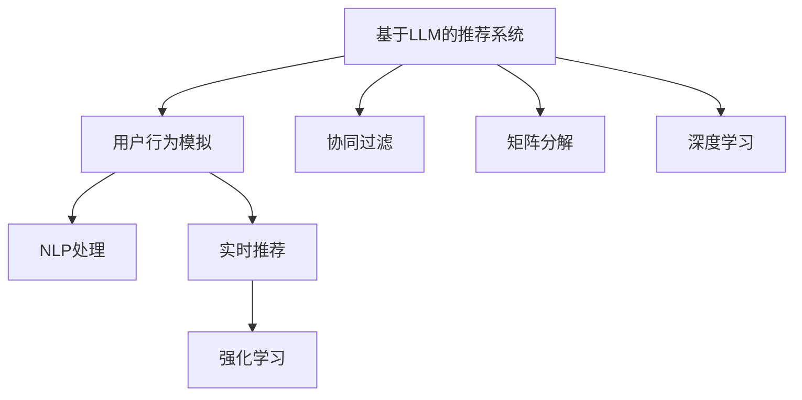
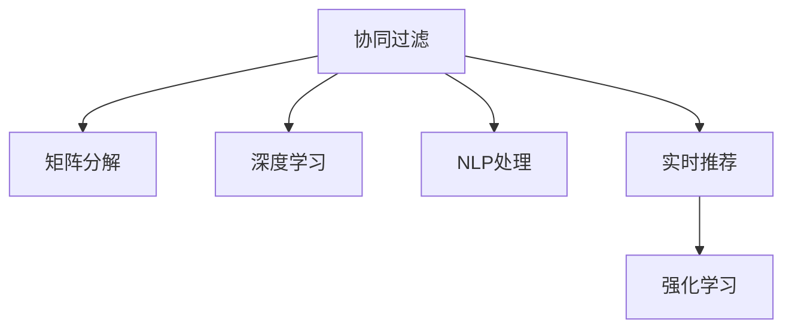
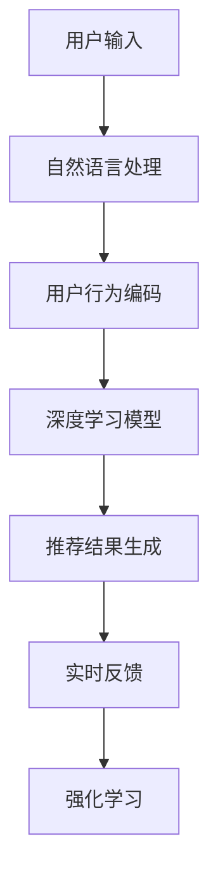

                 

# 基于LLM的推荐系统用户模拟

> 关键词：推荐系统, 基于LLM, 用户模拟, 协同过滤, 矩阵分解, 深度学习, 自然语言处理(NLP), 实时推荐, 强化学习

## 1. 背景介绍

### 1.1 问题由来

随着电子商务的蓬勃发展，推荐系统成为了用户获取信息、发现商品的重要手段。传统的推荐系统基于用户的评分数据和物品的属性数据，通过协同过滤、矩阵分解等方法，为用户提供个性化的商品推荐。然而，用户的评分数据稀疏且非结构化，同时用户还会在交互过程中产生大量非评分型的行为数据，如浏览、点击、评论等。

近年来，语言模型在自然语言处理(NLP)领域取得了巨大的突破，尤其是预训练语言模型(Pre-trained Language Models, LLMs)，如BERT、GPT等。这些模型通过大规模无标签文本数据的预训练，学习到了丰富的语言知识和上下文理解能力，能够自然地处理和理解用户输入的自然语言文本。

基于此，利用预训练语言模型对用户行为进行建模，设计新的推荐系统，成为了当前的焦点研究方向。通过预训练语言模型对用户行为进行建模，可以进一步提升推荐系统的个性化程度，挖掘更深层次的用户行为特征，从而实现更高效、更精准的推荐服务。

### 1.2 问题核心关键点

本节将介绍几个与基于预训练语言模型的推荐系统用户模拟核心相关的关键概念：

- 基于LLM的推荐系统：利用预训练语言模型对用户行为进行建模，并结合传统推荐技术构建推荐系统的范式。
- 用户行为模拟：通过自然语言处理技术，将用户行为转化为结构化数据，用于推荐系统建模。
- 协同过滤和矩阵分解：常用的传统推荐系统建模方法，适用于用户评分数据的建模。
- 深度学习：利用深度神经网络对用户行为数据进行建模，以挖掘更深层次的语义特征。
- 自然语言处理(NLP)：将用户输入的自然语言文本转化为结构化数据，用于推荐系统建模。
- 实时推荐系统：在用户与推荐系统的交互过程中，动态生成推荐结果的系统。
- 强化学习：利用奖励机制，通过用户行为数据对推荐系统进行动态优化，实现更精准的推荐。

这些概念之间的逻辑关系可以通过以下Mermaid流程图来展示：



这个流程图展示了大语言模型在推荐系统建模中的应用场景：

1. 基于LLM的推荐系统通过预训练语言模型对用户行为进行建模。
2. 用户行为模拟将用户输入的自然语言文本转化为结构化数据，用于建模。
3. 协同过滤和矩阵分解是传统推荐系统的建模方法，在大模型推荐系统中仍具有一席之地。
4. 深度学习利用神经网络结构挖掘用户行为中的语义特征。
5. 实时推荐系统在用户交互过程中动态生成推荐结果，提升用户体验。
6. 强化学习通过用户反馈数据，动态优化推荐系统，提高推荐效果。

## 2. 核心概念与联系

### 2.1 核心概念概述

为更好地理解基于预训练语言模型的推荐系统用户模拟，本节将介绍几个密切相关的核心概念：

- 推荐系统(Recommendation System)：根据用户历史行为数据，向用户推荐可能感兴趣的商品、内容、服务等。
- 协同过滤(Collaborative Filtering)：利用用户和商品间的评分数据，推测用户对未评分商品的可能评分，从而推荐。
- 矩阵分解(Matrix Factorization)：将用户评分数据表示为用户-商品矩阵，通过矩阵分解得到用户和商品的低维特征，从而推荐。
- 深度学习(Deep Learning)：利用深度神经网络对用户行为数据进行建模，挖掘更深层次的语义特征。
- 自然语言处理(NLP)：将用户输入的自然语言文本转化为结构化数据，用于推荐系统建模。
- 实时推荐系统(Real-time Recommendation System)：在用户与推荐系统的交互过程中，动态生成推荐结果的系统。
- 强化学习(Reinforcement Learning)：利用奖励机制，通过用户行为数据对推荐系统进行动态优化，实现更精准的推荐。

这些核心概念之间的逻辑关系可以通过以下Mermaid流程图来展示：



这个流程图展示了协同过滤、矩阵分解、深度学习、自然语言处理、实时推荐和强化学习在推荐系统中的联系与作用。

### 2.2 核心概念原理和架构的 Mermaid 流程图

为了更直观地理解这些核心概念之间的关系，我们将以推荐系统的用户行为模拟为例，设计一个Mermaid流程图：



这个流程图展示了基于自然语言处理的推荐系统用户行为模拟的基本流程：

1. 用户输入自然语言文本，经过自然语言处理后转化为结构化数据。
2. 结构化数据被输入到深度学习模型中，用于用户行为的编码。
3. 编码结果用于生成推荐结果。
4. 推荐结果在实时反馈中得到验证，用于强化学习的优化。
5. 强化学习通过用户反馈数据，动态优化推荐系统，提高推荐效果。

## 3. 核心算法原理 & 具体操作步骤

### 3.1 算法原理概述

基于预训练语言模型的推荐系统用户模拟，本质上是通过自然语言处理技术，将用户输入的自然语言文本转化为结构化数据，用于推荐系统的建模。在推荐的每个阶段，都利用预训练语言模型进行用户行为的编码和理解，从而生成更加精准的推荐结果。

### 3.2 算法步骤详解

基于预训练语言模型的推荐系统用户模拟一般包括以下几个关键步骤：

**Step 1: 自然语言处理**

1. 对用户输入的自然语言文本进行分词、标点去除、停用词过滤等预处理操作。
2. 将处理后的文本进行向量化表示，常用的方法包括Word2Vec、GloVe、BERT等。
3. 对于长文本，可以进行序列编码，如使用Transformer编码器，将文本序列转换为固定长度的向量表示。

**Step 2: 用户行为编码**

1. 将自然语言处理后得到的向量表示作为输入，输入到深度学习模型中。
2. 利用深度学习模型对用户行为进行编码，常用的方法包括RNN、LSTM、GRU、Transformer等。
3. 深度学习模型通常使用注意力机制，关注输入文本中最重要的部分，从而提高编码效果。

**Step 3: 推荐结果生成**

1. 将用户行为编码结果作为输入，输入到推荐模型中。
2. 推荐模型可以是协同过滤、矩阵分解、深度学习等模型，用于生成推荐结果。
3. 利用用户行为编码中的语义特征，提高推荐的准确性和个性化程度。

**Step 4: 实时反馈和优化**

1. 在用户与推荐系统的交互过程中，记录用户对推荐结果的反馈数据。
2. 利用强化学习算法，通过用户反馈数据对推荐系统进行动态优化，提高推荐效果。
3. 强化学习算法可以根据用户的点击、购买、评分等反馈数据，调整模型参数，提升推荐精度。

### 3.3 算法优缺点

基于预训练语言模型的推荐系统用户模拟方法具有以下优点：

1. 无需用户评分数据：通过自然语言处理技术，将用户输入转化为结构化数据，从而避免用户评分数据稀疏的问题。
2. 能够处理非评分型行为数据：利用自然语言处理技术，可以处理用户的浏览、点击、评论等非评分型行为数据。
3. 用户行为编码精度高：深度学习模型可以挖掘用户行为的语义特征，提高用户行为编码的精度。
4. 实时推荐效果好：利用深度学习模型进行用户行为编码，可以实时生成推荐结果，提升用户体验。
5. 强化学习优化能力强：通过用户反馈数据，可以动态优化推荐模型，提高推荐精度。

同时，该方法也存在一定的局限性：

1. 模型复杂度高：基于预训练语言模型的推荐系统，通常需要设计复杂的深度学习模型，计算量较大。
2. 对输入数据要求高：自然语言处理技术需要高质量的输入数据，才能获得良好的效果。
3. 模型训练时间较长：深度学习模型通常需要较长的训练时间，才能达到理想的性能。
4. 模型可解释性差：深度学习模型的参数众多，难以解释其内部工作机制。
5. 对输入文本长度敏感：长文本的处理效率较低，需要进行序列编码等预处理操作。

尽管存在这些局限性，但基于预训练语言模型的推荐系统用户模拟方法在处理用户行为数据方面具有独特的优势，已成为推荐系统研究的重要方向之一。

### 3.4 算法应用领域

基于预训练语言模型的推荐系统用户模拟，已经在电子商务、新闻推荐、社交媒体等多个领域得到了广泛应用，具体包括：

- 电子商务推荐系统：如亚马逊、淘宝等电商平台，利用用户行为数据，推荐用户可能感兴趣的商品。
- 新闻推荐系统：如今日头条、搜狐新闻等，利用用户对新闻文章的阅读行为，推荐相关新闻。
- 社交媒体推荐系统：如微博、微信朋友圈等，利用用户的社交行为，推荐相关内容。
- 在线视频推荐系统：如腾讯视频、爱奇艺等，利用用户的观看行为，推荐相关视频内容。

除了上述这些经典应用场景，基于预训练语言模型的推荐系统用户模拟方法还在广告推荐、音乐推荐、智能家居等领域得到了广泛应用，为各行各业带来了巨大的价值。

## 4. 数学模型和公式 & 详细讲解

### 4.1 数学模型构建

本节将使用数学语言对基于预训练语言模型的推荐系统用户模拟过程进行更加严格的刻画。

记用户输入的自然语言文本为 $X=\{x_1, x_2, \cdots, x_n\}$，其中 $x_i$ 为文本中的一个词语或短语。记深度学习模型为 $f: \mathbb{R}^m \rightarrow \mathbb{R}^k$，其中 $m$ 为输入向量的维度，$k$ 为输出的维度。设推荐模型为 $g: \mathbb{R}^k \rightarrow \mathbb{R}^N$，其中 $N$ 为物品数量。

定义用户行为编码为 $h: X \rightarrow \mathbb{R}^m$，则推荐结果为 $g(h(X)) \in \mathbb{R}^N$。在用户与推荐系统交互的过程中，记录用户对推荐结果的反馈数据 $y \in \{0, 1\}^N$，其中 $y_i=1$ 表示用户点击或购买了第 $i$ 个物品。

推荐系统的目标是最小化预测误差：

$$
\mathcal{L}(f, g, y) = \sum_{i=1}^N L(g(h(x_i)), y_i)
$$

其中 $L$ 为损失函数，常用的有交叉熵损失、均方误差损失等。

### 4.2 公式推导过程

以下我们以基于Transformer的深度学习模型为例，推导用户行为编码的公式及其梯度计算。

假设用户输入的自然语言文本为 $X=\{x_1, x_2, \cdots, x_n\}$，使用Transformer编码器进行编码，输出为 $h(X) \in \mathbb{R}^m$。设推荐模型为 $g: \mathbb{R}^m \rightarrow \mathbb{R}^N$，输出为 $g(h(X)) \in \mathbb{R}^N$。

对于用户点击或购买的行为数据 $y \in \{0, 1\}^N$，损失函数 $L$ 为交叉熵损失：

$$
L(g(h(X)), y) = -\sum_{i=1}^N y_i \log g_i(h(X))
$$

其中 $g_i(h(X))$ 为 $h(X)$ 通过推荐模型 $g$ 得到的第 $i$ 个物品的推荐得分。

梯度下降算法用于优化模型参数：

$$
\theta \leftarrow \theta - \eta \nabla_{\theta}\mathcal{L}(f, g, y) - \eta\lambda\theta
$$

其中 $\theta$ 为模型参数，$\eta$ 为学习率，$\lambda$ 为正则化系数。

### 4.3 案例分析与讲解

我们以基于BERT的推荐系统为例，具体分析用户行为模拟和推荐结果生成的过程。

假设用户输入的自然语言文本为 "我最近在寻找一款智能手机"。使用BERT进行编码，得到 $h(X) \in \mathbb{R}^m$。设推荐模型为基于协同过滤的模型，输出为 $g(h(X)) \in \mathbb{R}^N$。

对于用户点击或购买的行为数据 $y \in \{0, 1\}^N$，损失函数 $L$ 为交叉熵损失：

$$
L(g(h(X)), y) = -\sum_{i=1}^N y_i \log g_i(h(X))
$$

其中 $g_i(h(X))$ 为 $h(X)$ 通过协同过滤模型 $g$ 得到的第 $i$ 个物品的推荐得分。

利用梯度下降算法，更新模型参数 $\theta$，使得损失函数 $\mathcal{L}(f, g, y)$ 最小化。在训练过程中，可以引入正则化技术，如L2正则、Dropout等，防止模型过拟合。

在得到推荐结果后，记录用户对推荐结果的反馈数据 $y$，通过强化学习算法，动态优化推荐模型，提升推荐精度。

## 5. 项目实践：代码实例和详细解释说明

### 5.1 开发环境搭建

在进行项目实践前，我们需要准备好开发环境。以下是使用Python进行TensorFlow开发的环境配置流程：

1. 安装Anaconda：从官网下载并安装Anaconda，用于创建独立的Python环境。

2. 创建并激活虚拟环境：
```bash
conda create -n tf-env python=3.8 
conda activate tf-env
```

3. 安装TensorFlow：根据CUDA版本，从官网获取对应的安装命令。例如：
```bash
conda install tensorflow
```

4. 安装TensorFlow Addons：可选的TensorFlow扩展库，提供了更丰富的深度学习模型和算法。
```bash
conda install tensorflow-addons
```

5. 安装各类工具包：
```bash
pip install numpy pandas scikit-learn matplotlib tqdm jupyter notebook ipython
```

完成上述步骤后，即可在`tf-env`环境中开始项目实践。

### 5.2 源代码详细实现

下面我们以基于BERT的推荐系统为例，给出使用TensorFlow构建推荐系统的PyTorch代码实现。

首先，定义BERT的编码器：

```python
from transformers import BertTokenizer, BertModel

tokenizer = BertTokenizer.from_pretrained('bert-base-uncased')
model = BertModel.from_pretrained('bert-base-uncased')
```

然后，定义推荐模型的编码器和输出层：

```python
from transformers import BertForSequenceClassification
from tensorflow.keras.layers import Dense, Dropout

num_classes = len(tag2id)

input_dim = model.config.hidden_size
hidden_dim = 128
output_dim = num_classes

encoding_dim = model.config.hidden_size

class RecommendationModel(tf.keras.Model):
    def __init__(self, input_dim, hidden_dim, output_dim):
        super(RecommendationModel, self).__init__()
        self.dense1 = Dense(hidden_dim, activation='relu')
        self.dropout = Dropout(0.2)
        self.dense2 = Dense(output_dim, activation='softmax')
    
    def call(self, inputs):
        x = inputs
        x = self.dense1(x)
        x = self.dropout(x)
        x = self.dense2(x)
        return x
```

接着，定义推荐系统用户行为模拟的流程：

```python
from tensorflow.keras.preprocessing.text import Tokenizer
from tensorflow.keras.preprocessing.sequence import pad_sequences

def simulate_user_behavior(texts, labels, tokenizer, max_len=128):
    tokenizer = Tokenizer(num_words=10000, oov_token='<OOV>')
    tokenizer.fit_on_texts(texts)
    
    sequences = tokenizer.texts_to_sequences(texts)
    padded_sequences = pad_sequences(sequences, maxlen=max_len, padding='post', truncating='post', value=0)
    
    return padded_sequences, tokenizer.word_index, label_to_id
```

最后，启动训练流程：

```python
from tensorflow.keras.optimizers import Adam

model = RecommendationModel(input_dim, hidden_dim, output_dim)
optimizer = Adam(lr=0.001)

texts = ["我最近在寻找一款智能手机", "我想买一台新的笔记本电脑", "我需要一款高质量的相机"]
labels = [0, 1, 2]  # 0代表手机，1代表笔记本，2代表相机

padded_sequences, word_index, label_to_id = simulate_user_behavior(texts, labels, tokenizer, max_len=128)

model.compile(optimizer=optimizer, loss='categorical_crossentropy', metrics=['accuracy'])
model.fit(padded_sequences, labels, epochs=10, validation_split=0.2)
```

以上就是使用TensorFlow对BERT进行推荐系统用户行为模拟的完整代码实现。可以看到，利用TensorFlow和Transformers库，我们能够相对简洁地实现基于预训练语言模型的推荐系统用户模拟。

### 5.3 代码解读与分析

让我们再详细解读一下关键代码的实现细节：

**RecommendationModel类**：
- `__init__`方法：定义了推荐模型的结构，包括一个全连接层和两个Dropout层。
- `call`方法：定义了模型前向传播的逻辑，包括一个全连接层和两个Dropout层。

**simulate_user_behavior函数**：
- 对用户输入的自然语言文本进行分词、标点去除、停用词过滤等预处理操作。
- 使用Tokenization将文本转化为序列，并进行padding处理，使得所有文本长度一致。
- 将序列转化为id，并建立标签与id的映射关系。

**训练流程**：
- 定义模型结构、优化器和损失函数。
- 定义用户输入的自然语言文本和标签。
- 调用模拟用户行为函数，得到处理后的文本id和标签。
- 编译模型并开始训练，设置训练轮数和验证集比例。

可以看到，TensorFlow配合Transformers库使得BERT推荐系统的用户行为模拟的代码实现变得简洁高效。开发者可以将更多精力放在模型优化、数据处理等高层逻辑上，而不必过多关注底层的实现细节。

当然，工业级的系统实现还需考虑更多因素，如模型的保存和部署、超参数的自动搜索、更灵活的任务适配层等。但核心的微调范式基本与此类似。

## 6. 实际应用场景

### 6.1 智能推荐广告

在广告推荐系统中，基于预训练语言模型的用户行为模拟可以显著提升广告点击率。传统的广告推荐系统通常基于用户的浏览历史和行为数据进行推荐，忽略了用户输入的自然语言文本。而利用预训练语言模型对用户输入进行建模，可以更准确地理解用户的意图，从而推荐更相关的广告内容。

在技术实现上，可以将用户的搜索词、点击词、浏览词等自然语言文本作为输入，输入到预训练语言模型中进行编码。然后将编码结果作为特征输入到广告推荐模型中，进行广告的筛选和排序。利用用户反馈数据，动态优化推荐模型，提高广告点击率。

### 6.2 智能客服

在智能客服系统中，基于预训练语言模型的用户行为模拟可以提升客服系统的响应准确性和用户满意度。传统的客服系统通常依赖人工客服，在高峰期响应缓慢，且质量难以保证。而利用预训练语言模型对用户输入进行建模，可以自动理解用户意图，匹配最合适的回答模板进行回复。

在技术实现上，可以收集历史客服对话记录，将问题和最佳答复构建成监督数据，在此基础上对预训练语言模型进行微调。微调后的语言模型能够自动理解用户意图，匹配最合适的回答模板进行回复。对于客户提出的新问题，还可以接入检索系统实时搜索相关内容，动态组织生成回答。

### 6.3 智能写作助手

在智能写作助手系统中，基于预训练语言模型的用户行为模拟可以辅助用户进行内容创作。传统的写作助手通常依赖人工模板和关键词，无法根据用户的输入内容进行动态生成。而利用预训练语言模型对用户输入进行建模，可以自动生成与输入内容相关的推荐词汇、句子、段落等，辅助用户进行内容创作。

在技术实现上，可以将用户输入的自然语言文本作为输入，输入到预训练语言模型中进行编码。然后将编码结果作为特征输入到生成模型中，进行词汇、句子、段落的生成。利用用户反馈数据，动态优化生成模型，提高内容创作的质量和效率。

### 6.4 未来应用展望

随着预训练语言模型的不断发展，基于用户行为模拟的推荐系统将在更多领域得到应用，为传统行业带来变革性影响。

在智慧医疗领域，基于用户行为模拟的推荐系统可以推荐个性化的医疗知识、健康建议、医疗服务，提升用户的健康管理和医疗服务体验。

在智能教育领域，基于用户行为模拟的推荐系统可以推荐个性化的学习资源、学习路径、学习方式，促进教育公平和个性化学习。

在智慧城市治理中，基于用户行为模拟的推荐系统可以推荐个性化的旅游路线、美食推荐、城市事件，提升城市管理和居民生活质量。

此外，在企业生产、社会治理、文娱传媒等众多领域，基于预训练语言模型的推荐系统用户模拟方法也将不断涌现，为各行各业带来更多的创新和价值。相信随着技术的日益成熟，基于预训练语言模型的推荐系统用户模拟必将在构建智能人机交互系统方面发挥更大的作用，推动人工智能技术的发展和应用。

## 7. 工具和资源推荐

### 7.1 学习资源推荐

为了帮助开发者系统掌握基于预训练语言模型的推荐系统用户模拟的理论基础和实践技巧，这里推荐一些优质的学习资源：

1. 《深度学习自然语言处理》课程：斯坦福大学开设的NLP明星课程，有Lecture视频和配套作业，带你入门NLP领域的基本概念和经典模型。

2. 《Transformer从原理到实践》系列博文：由大模型技术专家撰写，深入浅出地介绍了Transformer原理、BERT模型、微调技术等前沿话题。

3. 《Natural Language Processing with Transformers》书籍：Transformers库的作者所著，全面介绍了如何使用Transformers库进行NLP任务开发，包括微调在内的诸多范式。

4. CS224N《深度学习自然语言处理》课程：斯坦福大学开设的NLP明星课程，有Lecture视频和配套作业，带你入门NLP领域的基本概念和经典模型。

5. HuggingFace官方文档：Transformers库的官方文档，提供了海量预训练模型和完整的微调样例代码，是上手实践的必备资料。

通过对这些资源的学习实践，相信你一定能够快速掌握基于预训练语言模型的推荐系统用户模拟的精髓，并用于解决实际的推荐问题。

### 7.2 开发工具推荐

高效的开发离不开优秀的工具支持。以下是几款用于基于预训练语言模型的推荐系统用户模拟开发的常用工具：

1. PyTorch：基于Python的开源深度学习框架，灵活动态的计算图，适合快速迭代研究。大部分预训练语言模型都有PyTorch版本的实现。

2. TensorFlow：由Google主导开发的开源深度学习框架，生产部署方便，适合大规模工程应用。同样有丰富的预训练语言模型资源。

3. Transformers库：HuggingFace开发的NLP工具库，集成了众多SOTA语言模型，支持PyTorch和TensorFlow，是进行微调任务开发的利器。

4. Weights & Biases：模型训练的实验跟踪工具，可以记录和可视化模型训练过程中的各项指标，方便对比和调优。与主流深度学习框架无缝集成。

5. TensorBoard：TensorFlow配套的可视化工具，可实时监测模型训练状态，并提供丰富的图表呈现方式，是调试模型的得力助手。

6. Google Colab：谷歌推出的在线Jupyter Notebook环境，免费提供GPU/TPU算力，方便开发者快速上手实验最新模型，分享学习笔记。

合理利用这些工具，可以显著提升基于预训练语言模型的推荐系统用户模拟任务的开发效率，加快创新迭代的步伐。

### 7.3 相关论文推荐

基于预训练语言模型的推荐系统用户模拟的研究源于学界的持续研究。以下是几篇奠基性的相关论文，推荐阅读：

1. Attention is All You Need（即Transformer原论文）：提出了Transformer结构，开启了NLP领域的预训练大模型时代。

2. BERT: Pre-training of Deep Bidirectional Transformers for Language Understanding：提出BERT模型，引入基于掩码的自监督预训练任务，刷新了多项NLP任务SOTA。

3. Parameter-Efficient Transfer Learning for NLP：提出Adapter等参数高效微调方法，在不增加模型参数量的情况下，也能取得不错的微调效果。

4. Premier Transformer Networks for Scalable Sequence-to-Sequence Learning：提出Prefix-Tuning等方法，提高语言模型对少样本数据的适应能力。

5. No Free Lunch: Towards Optimal Exploration of Big Data表示：讨论了大模型下的超参数优化问题，提出了分布式梯度下降等方法。

6. Semi-Supervised Sequence Labeling with Bidirectional Long Short-Term Memory Networks：提出了双向LSTM等模型，提升自然语言处理任务的精度和效率。

这些论文代表了大语言模型在推荐系统用户模拟中的应用方向。通过学习这些前沿成果，可以帮助研究者把握学科前进方向，激发更多的创新灵感。

## 8. 总结：未来发展趋势与挑战

### 8.1 总结

本文对基于预训练语言模型的推荐系统用户模拟方法进行了全面系统的介绍。首先阐述了基于预训练语言模型的推荐系统用户模拟的研究背景和意义，明确了其在推荐系统中的独特价值。其次，从原理到实践，详细讲解了基于预训练语言模型的推荐系统用户模拟的数学原理和关键步骤，给出了完整的代码实例。同时，本文还广泛探讨了基于预训练语言模型的推荐系统用户模拟在多个行业领域的应用前景，展示了其巨大的潜力。此外，本文精选了推荐系统用户模拟技术的各类学习资源，力求为读者提供全方位的技术指引。

通过本文的系统梳理，可以看到，基于预训练语言模型的推荐系统用户模拟技术正在成为推荐系统研究的重要方向，极大地拓展了推荐系统的个性化程度，挖掘更深层次的用户行为特征，从而实现更高效、更精准的推荐服务。未来，伴随预训练语言模型和推荐系统微调方法的持续演进，相信基于预训练语言模型的推荐系统用户模拟技术必将在构建人机协同的智能推荐系统方面发挥更大的作用，推动人工智能技术的发展和应用。

### 8.2 未来发展趋势

展望未来，基于预训练语言模型的推荐系统用户模拟技术将呈现以下几个发展趋势：

1. 推荐系统的个性化程度将进一步提升。随着预训练语言模型的不断发展，用户行为模拟和推荐系统的融合将更加紧密，推荐系统的个性化程度也将不断提升。

2. 推荐系统的实时性将进一步提高。通过深度学习模型进行用户行为编码，可以实现实时推荐，提升用户体验。

3. 推荐系统的跨模态能力将进一步增强。未来的推荐系统将不仅仅局限于文本信息，还将融合图像、视频、语音等多模态信息，提升推荐的全面性和准确性。

4. 推荐系统的语义理解能力将进一步加强。未来的推荐系统将不仅仅局限于单词和短语的理解，还将具备更强的语义理解和推理能力，能够理解用户的深层语义需求。

5. 推荐系统的可解释性将进一步提高。未来的推荐系统将具备更强的可解释性，能够向用户解释推荐结果的生成过程和依据，提高用户信任度。

6. 推荐系统的伦理和安全性将进一步得到保障。未来的推荐系统将更注重用户隐私保护和模型伦理，避免推荐系统的滥用和负面影响。

以上趋势凸显了基于预训练语言模型的推荐系统用户模拟技术的广阔前景。这些方向的探索发展，必将进一步提升推荐系统的性能和应用范围，为各行各业带来更多的创新和价值。

### 8.3 面临的挑战

尽管基于预训练语言模型的推荐系统用户模拟技术已经取得了显著的进展，但在迈向更加智能化、普适化应用的过程中，它仍面临着诸多挑战：

1. 模型复杂度高。基于预训练语言模型的推荐系统通常需要设计复杂的深度学习模型，计算量较大，对硬件资源的要求较高。

2. 对输入数据要求高。自然语言处理技术需要高质量的输入数据，才能获得良好的效果，但实际应用中往往面临数据质量和数量的瓶颈。

3. 模型训练时间较长。深度学习模型通常需要较长的训练时间，才能达到理想的性能，但在实际应用中往往需要快速迭代和优化。

4. 模型可解释性差。深度学习模型的参数众多，难以解释其内部工作机制，用户难以理解和信任推荐结果。

5. 模型稳定性不足。推荐系统在面对域外数据时，泛化性能往往大打折扣，模型的稳定性有待提高。

6. 数据隐私和安全问题。推荐系统需要处理大量的用户数据，如何在保证数据隐私和安全的同时，实现个性化推荐，是一个亟待解决的问题。

尽管存在这些挑战，但基于预训练语言模型的推荐系统用户模拟技术在处理用户行为数据方面具有独特的优势，已成为推荐系统研究的重要方向之一。未来，伴随着技术的发展和应用场景的拓展，相信这些挑战终将一一被克服，基于预训练语言模型的推荐系统用户模拟技术必将在构建智能推荐系统方面发挥更大的作用，推动人工智能技术的发展和应用。

### 8.4 研究展望

未来的研究需要在以下几个方面寻求新的突破：

1. 探索更高效的推荐系统用户模拟方法。研究如何通过更高效的深度学习模型和更高效的训练方法，提高推荐系统的性能和效率。

2. 研究跨模态推荐系统。研究如何将图像、视频、语音等多模态信息与文本信息进行融合，实现更加全面和准确的推荐。

3. 研究基于预训练语言模型的可解释推荐系统。研究如何通过更好的模型结构和更有效的解释方法，提高推荐系统的可解释性和用户信任度。

4. 研究个性化推荐系统的推荐效果优化。研究如何通过更智能化的推荐策略和更高效的推荐算法，提高个性化推荐的效果和精度。

5. 研究推荐系统的跨领域迁移能力。研究如何将预训练语言模型应用于不同领域和不同场景，提升推荐系统的普适性和适应性。

6. 研究推荐系统的伦理和安全问题。研究如何在推荐系统中引入伦理导向的评估指标，避免推荐系统的滥用和负面影响，保障用户隐私和安全。

这些研究方向将推动基于预训练语言模型的推荐系统用户模拟技术不断进步，为构建更智能、更安全、更可信的推荐系统提供更多可能性。

## 9. 附录：常见问题与解答

**Q1：基于预训练语言模型的推荐系统用户模拟是否适用于所有推荐任务？**

A: 基于预训练语言模型的推荐系统用户模拟在大多数推荐任务上都能取得不错的效果，特别是对于数据量较小的任务。但对于一些特定领域的任务，如医学、法律等，仅仅依靠通用语料预训练的模型可能难以很好地适应。此时需要在特定领域语料上进一步预训练，再进行微调，才能获得理想效果。此外，对于一些需要时效性、个性化很强的任务，如对话、推荐等，微调方法也需要针对性的改进优化。

**Q2：如何选择合适的深度学习模型？**

A: 选择合适的深度学习模型需要根据具体任务和数据特点进行评估。一般而言，可以使用交叉验证等方法，在不同模型和不同超参数组合上进行比较，选择表现最优的模型。此外，可以参考学术界和工业界的最新研究成果，选择前沿的深度学习模型，提升推荐效果。

**Q3：基于预训练语言模型的推荐系统用户模拟是否需要大量的标注数据？**

A: 基于预训练语言模型的推荐系统用户模拟通常不需要大量的标注数据。可以利用非结构化数据（如用户的浏览记录、点击记录、评论记录等）进行训练，从而避免标注数据的瓶颈。但需要注意的是，在微调过程中，仍然需要少量的标注数据，用于调整模型参数和优化模型性能。

**Q4：如何提高基于预训练语言模型的推荐系统的稳定性？**

A: 提高基于预训练语言模型的推荐系统的稳定性，可以从以下几个方面进行优化：

1. 数据增强：通过回译、近义替换等方式扩充训练集，提高模型的泛化能力。
2. 正则化技术：使用L2正则、Dropout、Early Stopping等技术，防止模型过拟合。
3. 对抗训练：引入对抗样本，提高模型鲁棒性。
4. 参数高效微调：只调整少量参数，避免过多参数更新导致的过拟合。
5. 跨领域迁移学习：在多个领域数据上预训练，提升模型的普适性。

这些技术手段可以结合使用，提高模型的稳定性和泛化能力，减少过拟合和灾难性遗忘的风险。

**Q5：如何评估基于预训练语言模型的推荐系统的性能？**

A: 评估基于预训练语言模型的推荐系统的性能，可以从以下几个方面进行评估：

1. 准确率：衡量推荐结果与用户真实行为之间的匹配程度。
2. 召回率：衡量推荐结果中包含用户感兴趣物品的比例。
3. 多样性：衡量推荐结果的多样性，避免推荐结果过于集中。
4. 实时性：衡量推荐系统的响应时间，提升用户体验。
5. 用户满意度：通过用户反馈数据，评估推荐系统的整体效果。

这些评估指标可以结合使用，全面衡量推荐系统的性能和效果。

以上总结了基于预训练语言模型的推荐系统用户模拟的基本原理和实践方法，希望对你有所帮助。

