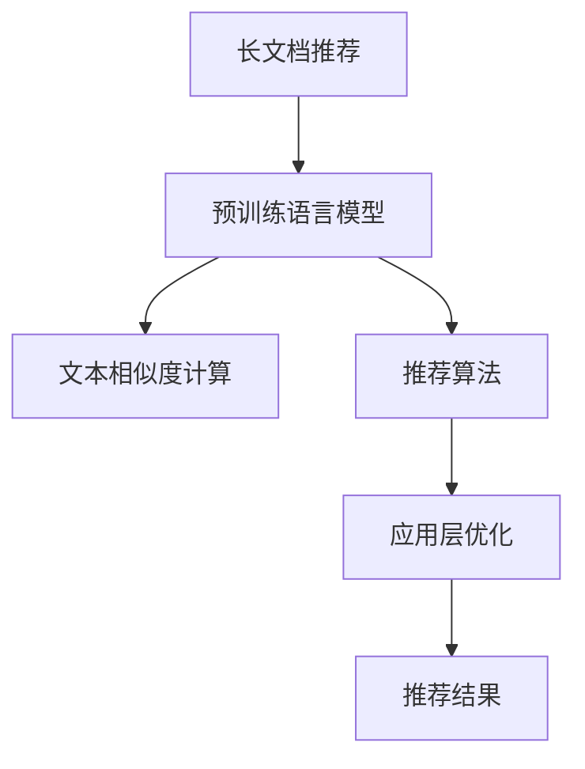

                 

# 基于LLM的长文档推荐方法

> 关键词：长文档推荐, LLM, 推荐系统, 文本相似度, 深度学习, 自然语言处理(NLP), 自然语言理解(NLU), 推荐算法, 应用层优化

## 1. 背景介绍

### 1.1 问题由来
在互联网时代，信息爆炸带来了海量文献资料。无论是学术论文、技术报告，还是长篇博文、小说文本，用户对于这些长文档的需求愈发强烈。但同时，如何高效地发现和推荐感兴趣的文档，成为了一件困难的事情。推荐系统的核心任务是提升信息检索的精准度和效率，长文档推荐系统则要求更加精确地匹配用户需求和文档内容。

近年来，深度学习技术在推荐系统领域取得了重要突破。基于深度学习的长文档推荐方法，利用预训练语言模型(LLM)对文档和用户进行建模，通过相似度计算或注意力机制，实现文档推荐的精确匹配。其中，长文本建模和相似度计算是关键技术。

### 1.2 问题核心关键点
长文档推荐系统的核心目标是通过预训练语言模型对文档和用户进行高质量的建模，计算文本之间的相似度，预测用户对文档的兴趣程度。关键点包括：

- 如何高效地对长文档进行建模，提取有效的特征向量。
- 如何选择合理的相似度计算方法，准确衡量文档间的相似性。
- 如何结合用户画像和文档特征，实现精准推荐。

### 1.3 问题研究意义
长文档推荐系统的研究具有重要意义：

1. 提升信息检索的效率和精度。长文档推荐能够精确匹配用户需求，减少浏览时间和工作量。
2. 丰富信息获取方式。长文档推荐让用户能够发现更多深度内容，丰富知识结构。
3. 降低信息过载。推荐系统能够过滤无关内容，减轻用户的信息负担。
4. 推动知识传播。优质长文档推荐能够引导用户关注高质量内容，促进知识普及。

## 2. 核心概念与联系

### 2.1 核心概念概述

为更好地理解基于预训练语言模型的大文档推荐方法，本节将介绍几个关键概念：

- 长文档推荐：指基于用户需求，从海量长文档库中高效筛选出最相关、最有价值的长文档，推荐给用户。
- 预训练语言模型(LLM)：如BERT、GPT等，通过在大规模无标签文本语料上进行自监督预训练，学习语言知识和表示。
- 文本相似度计算：用于衡量文本间的相似性，是长文档推荐的关键技术。
- 推荐算法：通过用户画像和文档特征，预测用户对文档的兴趣程度，并选择最合适的文档推荐。
- 应用层优化：在推荐结果的基础上，进行排序、过滤、分组等优化，提高推荐效果。

这些核心概念之间的逻辑关系可以通过以下Mermaid流程图来展示：



这个流程图展示了大文档推荐系统的核心概念及其之间的关系：

1. 长文档推荐系统利用预训练语言模型对文档进行建模。
2. 文本相似度计算衡量文档间的相似性。
3. 推荐算法根据用户画像和文档特征，预测用户对文档的兴趣。
4. 应用层优化提升推荐结果的有效性。

这些概念共同构成了长文档推荐系统的核心，使其能够高效、准确地推荐长文档给用户。

## 3. 核心算法原理 & 具体操作步骤
### 3.1 算法原理概述

基于预训练语言模型的大文档推荐方法，本质上是将文本表示与用户需求进行匹配的过程。其核心思想是：

1. 使用预训练语言模型对长文档进行编码，得到文档的特征向量表示。
2. 计算文档之间的相似度，评估文档的相关性。
3. 利用用户画像，对文档的兴趣进行预测。
4. 结合文档相似度和用户兴趣，进行文档排序和推荐。

该方法的核心在于文本表示的质量和对相似度的有效计算。

### 3.2 算法步骤详解

基于预训练语言模型的大文档推荐方法主要分为以下几个关键步骤：

**Step 1: 准备预训练模型和数据集**
- 选择合适的预训练语言模型 $M_{\theta}$ 作为初始化参数，如BERT、GPT等。
- 准备长文档数据集 $D$，划分为训练集、验证集和测试集。一般要求标注数据与预训练数据的分布不要差异过大。

**Step 2: 文本表示提取**
- 使用预训练语言模型对文档进行编码，得到文档的特征向量表示。常见的提取方法包括自编码器(如BERT)和自回归模型(如GPT)。
- 根据文档长度，选择合适的截断或填充方式，确保特征向量长度一致。

**Step 3: 相似度计算**
- 选择适当的相似度计算方法，计算文档向量间的相似度。常见的相似度方法包括余弦相似度、Jaccard相似度、欧式距离等。
- 考虑文档长度的影响，引入注意力机制或加权方法，对相似度进行优化。

**Step 4: 用户兴趣建模**
- 根据用户的历史行为数据，使用预训练语言模型对用户进行编码，得到用户特征向量。
- 根据用户画像，选择适当的特征提取方法，如TF-IDF、词频等。

**Step 5: 文档推荐**
- 计算文档和用户的相似度，将文档向量与用户向量相乘，得到预测用户对文档的兴趣度。
- 根据兴趣度进行文档排序，选择最相关的文档进行推荐。

**Step 6: 应用层优化**
- 结合推荐结果，进行排序、过滤、分组等操作，提升推荐效果。
- 实现可视化展示、个性化推荐等功能。

以上是基于预训练语言模型的大文档推荐方法的一般流程。在实际应用中，还需要根据具体场景和需求，对每个步骤进行优化设计，以进一步提升推荐性能。

### 3.3 算法优缺点

基于预训练语言模型的大文档推荐方法具有以下优点：

1. 利用大规模预训练模型的语义表示能力，可以有效捕捉文档和用户的语义信息。
2. 通过文本相似度计算，可以快速筛选出最相关的文档，实现高效推荐。
3. 结合用户画像，能够更好地理解用户兴趣，提升推荐的个性化程度。
4. 适用于多种类型的长文档，包括学术论文、报告、文章等。

同时，该方法也存在一些局限性：

1. 对标注数据和计算资源的依赖较大。预训练模型的构建和微调需要大量计算资源和标注数据。
2. 模型的复杂度较高。预训练语言模型的参数量庞大，训练和推理过程复杂。
3. 推荐结果的解释性不足。模型输出难以解释，用户无法理解推荐依据。
4. 对长文档的多样性处理有限。长文档的文本长度和结构各异，难以统一处理。

尽管存在这些局限性，但就目前而言，基于预训练语言模型的大文档推荐方法仍然是最为主流和有效的推荐范式之一。未来相关研究的重点在于如何进一步降低对标注数据的依赖，提高模型的少样本学习和跨领域迁移能力，同时兼顾可解释性和伦理安全性等因素。

### 3.4 算法应用领域

基于预训练语言模型的大文档推荐方法已经在多个领域得到应用，具体包括：

- 学术文献推荐：根据用户的阅读历史和兴趣，推荐相关领域的学术论文和报告。
- 技术博客推荐：利用用户的浏览记录，推荐用户感兴趣的技术博客和文章。
- 小说阅读推荐：根据用户的阅读历史，推荐用户喜欢的长篇小说和连载作品。
- 专业报告推荐：对商业分析师和研究者，推荐相关的行业报告和研究文章。
- 论文写作指导：根据用户的研究兴趣，推荐相关领域的前沿论文和经典文献。

除了上述这些经典应用外，大文档推荐方法还被创新性地应用于教育领域、出版行业等，为用户的知识获取和信息消费提供新的解决方案。

## 4. 数学模型和公式 & 详细讲解  
### 4.1 数学模型构建

本节将使用数学语言对基于预训练语言模型的大文档推荐过程进行更加严格的刻画。

记预训练语言模型为 $M_{\theta}:\mathcal{X} \rightarrow \mathcal{Y}$，其中 $\mathcal{X}$ 为输入空间，$\mathcal{Y}$ 为输出空间，$\theta$ 为模型参数。假设推荐任务的数据集为 $D=\{(x_i,y_i)\}_{i=1}^N, x_i \in \mathcal{X}, y_i \in \mathcal{Y}$。

定义模型 $M_{\theta}$ 在输入 $x$ 上的输出为 $\hat{y}=M_{\theta}(x) \in [0,1]$，表示样本属于正类的概率。根据用户的历史行为数据，得到用户向量 $u \in \mathbb{R}^d$，其中 $d$ 为模型输出维度。

定义模型 $M_{\theta}$ 在文档 $x$ 上的输出为 $v \in \mathbb{R}^d$，表示文档的向量表示。推荐模型的目标是最小化损失函数 $\mathcal{L}(u,v)$，即找到最优用户向量和文档向量：

$$
(u^*, v^*) = \mathop{\arg\min}_{u,v} \mathcal{L}(u,v)
$$

其中 $\mathcal{L}$ 为推荐模型的损失函数，用于衡量用户向量和文档向量之间的距离或相似度。常见的损失函数包括均方误差损失、交叉熵损失等。

### 4.2 公式推导过程

以下我们以余弦相似度为例，推导推荐模型的损失函数及其梯度的计算公式。

假设用户向量和文档向量分别为 $u \in \mathbb{R}^d$ 和 $v \in \mathbb{R}^d$，定义用户向量和文档向量之间的余弦相似度为：

$$
\text{sim}(u,v) = \frac{u \cdot v}{\|u\|\|v\|}
$$

则推荐模型的损失函数为：

$$
\mathcal{L}(u,v) = -\log \text{sim}(u,v)
$$

根据链式法则，损失函数对用户向量 $u$ 和文档向量 $v$ 的梯度分别为：

$$
\frac{\partial \mathcal{L}(u,v)}{\partial u} = -\frac{1}{\text{sim}(u,v)} \left( \frac{v}{\|v\|^2} - \frac{u}{\|u\|^2} \right)
$$

$$
\frac{\partial \mathcal{L}(u,v)}{\partial v} = -\frac{1}{\text{sim}(u,v)} \left( \frac{u}{\|u\|^2} - \frac{v}{\|v\|^2} \right)
$$

在得到损失函数的梯度后，即可带入优化算法进行模型参数更新。重复上述过程直至收敛，最终得到适应推荐任务的用户向量和文档向量 $u^*$ 和 $v^*$。

## 5. 项目实践：代码实例和详细解释说明
### 5.1 开发环境搭建

在进行推荐系统实践前，我们需要准备好开发环境。以下是使用Python进行PyTorch开发的环境配置流程：

1. 安装Anaconda：从官网下载并安装Anaconda，用于创建独立的Python环境。

2. 创建并激活虚拟环境：
```bash
conda create -n pytorch-env python=3.8 
conda activate pytorch-env
```

3. 安装PyTorch：根据CUDA版本，从官网获取对应的安装命令。例如：
```bash
conda install pytorch torchvision torchaudio cudatoolkit=11.1 -c pytorch -c conda-forge
```

4. 安装HuggingFace Transformers库：
```bash
pip install transformers
```

5. 安装各类工具包：
```bash
pip install numpy pandas scikit-learn matplotlib tqdm jupyter notebook ipython
```

完成上述步骤后，即可在`pytorch-env`环境中开始推荐系统实践。

### 5.2 源代码详细实现

下面我们以学术文献推荐为例，给出使用Transformers库对BERT模型进行推荐系统开发的PyTorch代码实现。

首先，定义推荐任务的数据处理函数：

```python
from transformers import BertTokenizer
from torch.utils.data import Dataset
import torch

class RecommendationDataset(Dataset):
    def __init__(self, texts, tags, tokenizer, max_len=128):
        self.texts = texts
        self.tags = tags
        self.tokenizer = tokenizer
        self.max_len = max_len
        
    def __len__(self):
        return len(self.texts)
    
    def __getitem__(self, item):
        text = self.texts[item]
        tags = self.tags[item]
        
        encoding = self.tokenizer(text, return_tensors='pt', max_length=self.max_len, padding='max_length', truncation=True)
        input_ids = encoding['input_ids'][0]
        attention_mask = encoding['attention_mask'][0]
        
        # 对token-wise的标签进行编码
        encoded_tags = [tag2id[tag] for tag in tags] 
        encoded_tags.extend([tag2id['O']] * (self.max_len - len(encoded_tags)))
        labels = torch.tensor(encoded_tags, dtype=torch.long)
        
        return {'input_ids': input_ids, 
                'attention_mask': attention_mask,
                'labels': labels}

# 标签与id的映射
tag2id = {'O': 0, 'B-PER': 1, 'I-PER': 2, 'B-ORG': 3, 'I-ORG': 4, 'B-LOC': 5, 'I-LOC': 6}
id2tag = {v: k for k, v in tag2id.items()}

# 创建dataset
tokenizer = BertTokenizer.from_pretrained('bert-base-cased')

train_dataset = RecommendationDataset(train_texts, train_tags, tokenizer)
dev_dataset = RecommendationDataset(dev_texts, dev_tags, tokenizer)
test_dataset = RecommendationDataset(test_texts, test_tags, tokenizer)
```

然后，定义模型和优化器：

```python
from transformers import BertForTokenClassification, AdamW

model = BertForTokenClassification.from_pretrained('bert-base-cased', num_labels=len(tag2id))

optimizer = AdamW(model.parameters(), lr=2e-5)
```

接着，定义训练和评估函数：

```python
from torch.utils.data import DataLoader
from tqdm import tqdm
from sklearn.metrics import classification_report

device = torch.device('cuda') if torch.cuda.is_available() else torch.device('cpu')
model.to(device)

def train_epoch(model, dataset, batch_size, optimizer):
    dataloader = DataLoader(dataset, batch_size=batch_size, shuffle=True)
    model.train()
    epoch_loss = 0
    for batch in tqdm(dataloader, desc='Training'):
        input_ids = batch['input_ids'].to(device)
        attention_mask = batch['attention_mask'].to(device)
        labels = batch['labels'].to(device)
        model.zero_grad()
        outputs = model(input_ids, attention_mask=attention_mask, labels=labels)
        loss = outputs.loss
        epoch_loss += loss.item()
        loss.backward()
        optimizer.step()
    return epoch_loss / len(dataloader)

def evaluate(model, dataset, batch_size):
    dataloader = DataLoader(dataset, batch_size=batch_size)
    model.eval()
    preds, labels = [], []
    with torch.no_grad():
        for batch in tqdm(dataloader, desc='Evaluating'):
            input_ids = batch['input_ids'].to(device)
            attention_mask = batch['attention_mask'].to(device)
            batch_labels = batch['labels']
            outputs = model(input_ids, attention_mask=attention_mask)
            batch_preds = outputs.logits.argmax(dim=2).to('cpu').tolist()
            batch_labels = batch_labels.to('cpu').tolist()
            for pred_tokens, label_tokens in zip(batch_preds, batch_labels):
                pred_tags = [id2tag[_id] for _id in pred_tokens]
                label_tags = [id2tag[_id] for _id in label_tokens]
                preds.append(pred_tags[:len(label_tokens)])
                labels.append(label_tags)
                
    print(classification_report(labels, preds))
```

最后，启动训练流程并在测试集上评估：

```python
epochs = 5
batch_size = 16

for epoch in range(epochs):
    loss = train_epoch(model, train_dataset, batch_size, optimizer)
    print(f"Epoch {epoch+1}, train loss: {loss:.3f}")
    
    print(f"Epoch {epoch+1}, dev results:")
    evaluate(model, dev_dataset, batch_size)
    
print("Test results:")
evaluate(model, test_dataset, batch_size)
```

以上就是使用PyTorch对BERT进行推荐系统开发的完整代码实现。可以看到，得益于Transformers库的强大封装，我们可以用相对简洁的代码完成BERT模型的加载和微调。

### 5.3 代码解读与分析

让我们再详细解读一下关键代码的实现细节：

**RecommendationDataset类**：
- `__init__`方法：初始化文本、标签、分词器等关键组件。
- `__len__`方法：返回数据集的样本数量。
- `__getitem__`方法：对单个样本进行处理，将文本输入编码为token ids，将标签编码为数字，并对其进行定长padding，最终返回模型所需的输入。

**tag2id和id2tag字典**：
- 定义了标签与数字id之间的映射关系，用于将token-wise的预测结果解码回真实的标签。

**训练和评估函数**：
- 使用PyTorch的DataLoader对数据集进行批次化加载，供模型训练和推理使用。
- 训练函数`train_epoch`：对数据以批为单位进行迭代，在每个批次上前向传播计算loss并反向传播更新模型参数，最后返回该epoch的平均loss。
- 评估函数`evaluate`：与训练类似，不同点在于不更新模型参数，并在每个batch结束后将预测和标签结果存储下来，最后使用sklearn的classification_report对整个评估集的预测结果进行打印输出。

**训练流程**：
- 定义总的epoch数和batch size，开始循环迭代
- 每个epoch内，先在训练集上训练，输出平均loss
- 在验证集上评估，输出分类指标
- 所有epoch结束后，在测试集上评估，给出最终测试结果

可以看到，PyTorch配合Transformers库使得BERT微调的代码实现变得简洁高效。开发者可以将更多精力放在数据处理、模型改进等高层逻辑上，而不必过多关注底层的实现细节。

当然，工业级的系统实现还需考虑更多因素，如模型的保存和部署、超参数的自动搜索、更灵活的任务适配层等。但核心的微调范式基本与此类似。

## 6. 实际应用场景
### 6.1 学术文献推荐

学术文献推荐是长文档推荐系统的典型应用场景之一。当前，学术研究者通常需要通过大量文献检索来寻找相关领域的前沿研究。而基于大文档推荐技术，可以大幅提升文献检索的效率和精准度。

具体而言，可以利用预训练语言模型对论文进行建模，通过余弦相似度或注意力机制计算文档向量之间的相似度。结合用户的历史阅读记录和兴趣标签，预测用户对不同文献的兴趣度，并按兴趣度排序推荐文献。如此，研究人员可以更快地找到最新的研究热点和有价值的文献，提升科研效率。

### 6.2 技术博客推荐

在IT行业，开发者和技术人员频繁阅读各类技术博客和文章，以获取最新的技术动态和解决方案。但面对海量博客内容，如何选择高质量的博客，成了一项繁重的任务。基于预训练语言模型的推荐系统，可以根据用户的阅读历史和兴趣标签，智能推荐相关领域的技术博客和文章。

推荐系统对每篇博客进行编码，计算与用户兴趣的相似度，并按照相似度排序推荐。如此，用户可以快速浏览到最相关、最有价值的技术文章，提升学习效率。

### 6.3 小说阅读推荐

长篇小说阅读是用户常见的娱乐方式之一。基于预训练语言模型的推荐系统，可以为用户提供个性化的小说推荐服务，提升阅读体验。

对于小说推荐系统，需要考虑文本长度和复杂性。可以采用变长编码方法，如Bert4Rec，对不同长度的文本进行统一建模。结合用户的历史阅读记录和兴趣标签，计算小说向量与用户向量的相似度，并按相似度排序推荐小说。如此，用户可以发现更多有趣的小说作品，丰富阅读体验。

### 6.4 专业报告推荐

商业分析师和研究者需要频繁阅读各类行业报告和研究文章，以了解市场动态和趋势。基于预训练语言模型的推荐系统，可以根据用户的历史阅读记录和兴趣标签，推荐相关领域的专业报告和研究文章。

推荐系统对每篇报告进行编码，计算与用户兴趣的相似度，并按照相似度排序推荐。如此，用户可以快速获取到最相关、最权威的市场报告，提升决策效率。

### 6.5 论文写作指导

学术写作是研究人员的重要工作之一。基于预训练语言模型的推荐系统，可以根据用户的研究兴趣和阅读记录，推荐相关领域的前沿论文和经典文献，辅助论文写作。

推荐系统对每篇论文进行编码，计算与用户兴趣的相似度，并按相似度排序推荐。用户可以参考推荐论文的结构、方法、结论，获取灵感和思路，提升论文写作效率和质量。

## 7. 工具和资源推荐
### 7.1 学习资源推荐

为了帮助开发者系统掌握预训练语言模型在长文档推荐系统中的应用，这里推荐一些优质的学习资源：

1. 《深度学习自然语言处理》系列博文：由大模型技术专家撰写，深入浅出地介绍了自然语言处理和预训练语言模型的原理与应用。

2. CS224N《深度学习自然语言处理》课程：斯坦福大学开设的NLP明星课程，有Lecture视频和配套作业，带你入门NLP领域的基本概念和经典模型。

3. 《Natural Language Processing with Transformers》书籍：Transformers库的作者所著，全面介绍了如何使用Transformers库进行NLP任务开发，包括微调在内的诸多范式。

4. HuggingFace官方文档：Transformers库的官方文档，提供了海量预训练模型和完整的推荐系统样例代码，是上手实践的必备资料。

5. CLUE开源项目：中文语言理解测评基准，涵盖大量不同类型的中文NLP数据集，并提供了基于预训练模型的baseline推荐系统，助力中文NLP技术发展。

通过对这些资源的学习实践，相信你一定能够快速掌握预训练语言模型在推荐系统中的应用，并用于解决实际的NLP问题。
###  7.2 开发工具推荐

高效的开发离不开优秀的工具支持。以下是几款用于预训练语言模型推荐系统开发的常用工具：

1. PyTorch：基于Python的开源深度学习框架，灵活动态的计算图，适合快速迭代研究。大部分预训练语言模型都有PyTorch版本的实现。

2. TensorFlow：由Google主导开发的开源深度学习框架，生产部署方便，适合大规模工程应用。同样有丰富的预训练语言模型资源。

3. Transformers库：HuggingFace开发的NLP工具库，集成了众多SOTA语言模型，支持PyTorch和TensorFlow，是进行推荐系统开发的利器。

4. Weights & Biases：模型训练的实验跟踪工具，可以记录和可视化模型训练过程中的各项指标，方便对比和调优。与主流深度学习框架无缝集成。

5. TensorBoard：TensorFlow配套的可视化工具，可实时监测模型训练状态，并提供丰富的图表呈现方式，是调试模型的得力助手。

6. Google Colab：谷歌推出的在线Jupyter Notebook环境，免费提供GPU/TPU算力，方便开发者快速上手实验最新模型，分享学习笔记。

合理利用这些工具，可以显著提升预训练语言模型推荐系统的开发效率，加快创新迭代的步伐。

### 7.3 相关论文推荐

预训练语言模型在推荐系统领域的应用研究，涉及诸多前沿方向。以下是几篇奠基性的相关论文，推荐阅读：

1. Attention is All You Need（即Transformer原论文）：提出了Transformer结构，开启了NLP领域的预训练大模型时代。

2. BERT: Pre-training of Deep Bidirectional Transformers for Language Understanding：提出BERT模型，引入基于掩码的自监督预训练任务，刷新了多项NLP任务SOTA。

3. Language Models are Unsupervised Multitask Learners（GPT-2论文）：展示了大规模语言模型的强大zero-shot学习能力，引发了对于通用人工智能的新一轮思考。

4. Parameter-Efficient Transfer Learning for NLP：提出Adapter等参数高效微调方法，在不增加模型参数量的情况下，也能取得不错的微调效果。

5. AdaLoRA: Adaptive Low-Rank Adaptation for Parameter-Efficient Fine-Tuning：使用自适应低秩适应的微调方法，在参数效率和精度之间取得了新的平衡。

6. Suggestion-Based Recommendation with Retrieve-and-Read Document Encodings：提出基于检索的推荐方法，使用预训练模型对文档进行编码，结合检索技术，实现精准推荐。

这些论文代表了大语言模型在推荐系统领域的发展脉络。通过学习这些前沿成果，可以帮助研究者把握学科前进方向，激发更多的创新灵感。

## 8. 总结：未来发展趋势与挑战
### 8.1 总结

本文对基于预训练语言模型的大文档推荐方法进行了全面系统的介绍。首先阐述了长文档推荐系统的研究背景和意义，明确了推荐系统的核心目标和关键技术点。其次，从原理到实践，详细讲解了推荐模型的数学模型和关键算法步骤，给出了推荐系统开发的完整代码实现。同时，本文还广泛探讨了推荐系统在学术文献推荐、技术博客推荐、小说阅读推荐等多个领域的应用前景，展示了预训练语言模型推荐技术的广泛应用潜力。

通过本文的系统梳理，可以看到，基于预训练语言模型的推荐方法在NLP领域的应用已经取得了显著的成果，并正在不断拓展其应用边界。利用预训练语言模型的强大语义表示能力，推荐系统能够高效、准确地推荐长文档，满足了用户对深度内容的需求。未来，随着预训练语言模型的不断发展，推荐系统的性能将进一步提升，为信息检索和知识传播提供更强大的技术支撑。

### 8.2 未来发展趋势

展望未来，预训练语言模型在推荐系统领域的发展将呈现以下几个趋势：

1. 多模态推荐：结合图像、视频等多模态信息，提升推荐系统的丰富性和准确性。
2. 个性化推荐：利用用户行为数据，精准预测用户兴趣，实现千人千面的个性化推荐。
3. 跨领域推荐：跨领域推荐技术能够将不同领域的知识进行融合，提升推荐的泛化能力。
4. 实时推荐：结合流数据处理技术，实现动态实时推荐，满足用户实时需求。
5. 可解释推荐：结合因果分析和知识图谱等工具，增强推荐系统的可解释性，让用户理解推荐依据。
6. 联邦学习：分布式推荐系统能够保护用户隐私，同时提升推荐的公平性和泛化能力。

这些趋势凸显了预训练语言模型推荐技术的发展方向，将进一步提升推荐系统的精准度和覆盖面，为用户提供更优质的信息获取体验。

### 8.3 面临的挑战

尽管预训练语言模型在推荐系统领域取得了重要进展，但在迈向更加智能化、普适化应用的过程中，它仍面临着诸多挑战：

1. 数据隐私和安全：大规模推荐系统需要处理大量用户数据，如何保护用户隐私，防止数据滥用，是重要的问题。
2. 推荐系统的不公平性：推荐系统可能存在偏差，对不同用户或群体的推荐不平等，需要进一步优化推荐算法。
3. 推荐系统的多样性：如何处理推荐系统推荐内容的单一性，提升推荐的丰富性，是长期面临的问题。
4. 模型复杂度：预训练语言模型的参数量庞大，训练和推理过程复杂，如何优化模型结构和算法，提高推荐系统的效率，是亟待解决的问题。
5. 跨领域推荐的泛化性：跨领域推荐需要在不同领域之间进行知识迁移，如何实现领域的灵活切换，是重要的研究方向。
6. 推荐系统的可解释性：推荐系统输出的结果难以解释，用户无法理解推荐依据，需要进一步增强系统的可解释性。

这些挑战需要学术界和产业界共同努力，通过不断优化算法、改进模型、提升数据质量等手段，才能实现预训练语言模型推荐系统的高效、公平、多样化的推荐效果。

### 8.4 研究展望

面对预训练语言模型推荐系统所面临的挑战，未来的研究需要在以下几个方面寻求新的突破：

1. 探索少样本学习和微调方法：通过引入少样本学习技术，利用少量数据训练推荐模型，减少对大规模标注数据的依赖。
2. 研究跨领域推荐技术：结合知识图谱、符号推理等工具，提升跨领域推荐系统的泛化能力和表现。
3. 融合多模态信息：结合图像、视频等辅助信息，提升推荐系统的丰富性和准确性。
4. 引入因果推理：结合因果推理技术，增强推荐系统的解释性和可控性，使用户理解推荐依据。
5. 优化推荐系统算法：通过改进推荐算法，提升推荐系统的公平性、多样性和可解释性。
6. 结合联邦学习：通过联邦学习技术，实现分布式推荐系统的隐私保护和高效推荐。

这些研究方向的探索，将推动预训练语言模型推荐系统迈向更高的台阶，为用户提供更优质、更公平、更安全的推荐服务。面向未来，预训练语言模型推荐系统需要在技术、算法、数据等多个维度进行全面优化，才能实现更加智能化、普适化、可靠化的推荐效果。

## 9. 附录：常见问题与解答

**Q1：如何评估推荐系统的性能？**

A: 推荐系统的性能评估通常采用以下指标：

1. 精度（Precision）：推荐结果中相关文档的比例，即TPR。
2. 召回率（Recall）：所有相关文档被推荐的比例，即FPR。
3. F1分数（F1 Score）：精度和召回率的调和平均数，综合考虑了两者的效果。
4. 覆盖率（Coverage）：推荐结果中文档的多样性，即推荐系统的广度。
5. 公平性（Fairness）：推荐系统对不同用户或群体的推荐是否平等。

常用的评估方法包括交叉验证、AUC曲线、ROC曲线等。具体评估方法取决于推荐系统的目标和应用场景。

**Q2：推荐系统如何处理长文档的多样性？**

A: 处理长文档的多样性，通常采用以下方法：

1. 变长编码：使用BERT4Rec等方法，对不同长度的文档进行统一建模，保留文档结构信息。
2. 多文档编码：将长文档分成若干段落，对每个段落进行编码，再合并得到整体文档向量。
3. 多轮推荐：根据用户反馈，进行多轮迭代推荐，逐步逼近用户兴趣。
4. 数据增强：通过回译、近义替换等方式，扩充训练集的多样性。

这些方法可以结合使用，提升推荐系统的鲁棒性和泛化能力。

**Q3：推荐系统如何进行个性化推荐？**

A: 个性化推荐通常采用以下方法：

1. 用户画像建模：通过用户的历史行为数据，建立用户画像，预测用户兴趣。
2. 相似度计算：计算用户画像与文档向量的相似度，预测用户对文档的兴趣度。
3. 上下文推荐：考虑用户当前环境和历史行为，动态调整推荐策略。
4. 多任务学习：结合不同任务进行联合训练，提升推荐系统的泛化能力。

这些方法可以结合使用，提升推荐系统的个性化程度和精准度。

**Q4：推荐系统如何处理推荐系统的不公平性？**

A: 处理推荐系统的不公平性，通常采用以下方法：

1. 公平性评估：使用统计和算法方法，评估推荐系统的公平性。
2. 多目标优化：结合公平性和效果，进行多目标优化，提升推荐系统的公平性。
3. 数据采样：通过数据采样方法，调整数据分布，提升推荐系统的公平性。
4. 离线测试：在离线数据集上测试推荐系统的公平性，并进行调优。

这些方法可以结合使用，提升推荐系统的公平性和用户满意度。

**Q5：推荐系统如何处理推荐系统的不多样性？**

A: 处理推荐系统的不多样性，通常采用以下方法：

1. 多样性采样：通过多样性采样方法，调整推荐结果的多样性。
2. 内容推荐：结合用户兴趣，推荐相关内容，增加推荐的多样性。
3. 混合推荐：结合基于内容的推荐和基于协同过滤的推荐，提升推荐的多样性。
4. 在线反馈：结合用户反馈，动态调整推荐策略，增加推荐的多样性。

这些方法可以结合使用，提升推荐系统的多样性和用户满意度。

---

作者：禅与计算机程序设计艺术 / Zen and the Art of Computer Programming

