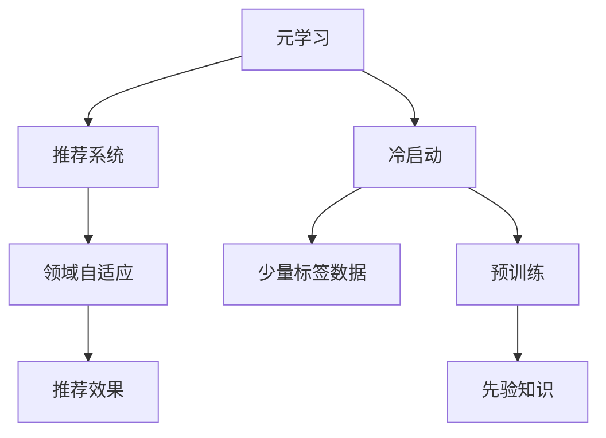

                 

# 基于元学习的新用户冷启动问题解决方案

在新用户首次注册一个应用或服务时，如何快速获取其兴趣和偏好，从而推荐合适的商品或内容，是一个关键的“冷启动”问题。传统的推荐系统依赖于用户的历史行为数据，而新用户通常没有这类数据。元学习（Meta-Learning）提供了一种新思路，通过少量标签数据和元数据来适应新的任务和用户，加速冷启动阶段的用户建模和推荐。本文将深入探讨基于元学习的新用户冷启动问题解决方案，涵盖原理、算法、实践案例和未来趋势。

## 1. 背景介绍

### 1.1 问题由来
在新用户注册时，推荐系统往往难以立即为其推荐合适的商品或内容，原因在于缺少该用户的历史行为数据。这导致冷启动问题成为推荐系统面临的一大挑战。传统方法需要积累大量的用户数据，才能进行有效的推荐，但这对新兴业务或小众市场是不现实的。元学习提供了一种解决方案，利用预训练的知识和少量标签数据，快速适应新的推荐任务和用户，从而在冷启动阶段获得较好的推荐效果。

### 1.2 问题核心关键点
元学习基于少量标签数据和元数据，快速适应新的推荐任务和用户。其核心在于：
- **预训练知识**：在大规模数据上预训练的模型，拥有丰富的领域知识和先验信息。
- **少量标签数据**：在新的推荐任务上，收集极少量的标签数据，供模型快速适应。
- **元学习算法**：通过在多种任务上预训练模型，在新的推荐任务上使用这些模型进行微调，加速模型收敛。

## 2. 核心概念与联系

### 2.1 核心概念概述

为更好地理解基于元学习的新用户冷启动问题解决方案，本节将介绍几个密切相关的核心概念：

- **元学习（Meta-Learning）**：通过在多种任务上预训练模型，使得模型能够在新的任务上快速适应，并提高泛化能力。
- **冷启动（Cold-Start）**：在新用户首次注册时，推荐系统无法利用其历史数据，需要进行快速的推荐。
- **推荐系统（Recommendation System）**：利用用户的历史行为数据，预测用户对商品或内容的偏好，进行推荐。
- **领域自适应（Domain Adaptation）**：在不同领域或数据分布上，模型能够快速适应并提高性能。
- **标签数据（Supervised Data）**：在推荐任务上，为每个用户-商品对打上标签，供模型学习。
- **先验知识（Prior Knowledge）**：在预训练过程中，利用领域知识和先验信息，提升模型的初始化质量。

这些核心概念之间的逻辑关系可以通过以下Mermaid流程图来展示：



这个流程图展示了大语言模型的核心概念及其之间的关系：

1. 元学习利用预训练模型在大规模数据上的预训练知识，加速在新的推荐任务上的适应。
2. 冷启动问题指在新用户注册时，推荐系统无法利用其历史数据，需要进行快速的推荐。
3. 推荐系统依赖用户的历史行为数据，预测用户对商品或内容的偏好，进行推荐。
4. 领域自适应指在不同领域或数据分布上，模型能够快速适应并提高性能。
5. 标签数据指在推荐任务上，为每个用户-商品对打上标签，供模型学习。
6. 先验知识指在预训练过程中，利用领域知识和先验信息，提升模型的初始化质量。

这些概念共同构成了基于元学习的新用户冷启动问题解决方案的框架，使其能够在快速适应新任务和用户的同时，利用先验知识提高推荐效果。

## 3. 核心算法原理 & 具体操作步骤

### 3.1 算法原理概述

基于元学习的新用户冷启动问题解决方案，本质上是一个利用预训练知识进行快速适应的推荐过程。其核心思想是：通过在大规模数据集上预训练模型，利用少量标签数据进行微调，快速适应新的推荐任务和用户。

形式化地，假设预训练模型为 $M_{\theta}$，其中 $\theta$ 为预训练得到的模型参数。给定推荐任务 $T$ 的用户 $u$ 和商品 $i$ 的少量标签数据 $D=\{(u_i,i_l)\}_{i=1}^N, u_i \in \mathcal{U}, i_l \in \{0,1\}$，其中 $u_i=1$ 表示用户 $u$ 对商品 $i$ 进行了点击。元学习的目标是最小化损失函数 $\mathcal{L}$，使得模型输出与实际标签一致：

$$
\theta^* = \mathop{\arg\min}_{\theta} \mathcal{L}(M_{\theta},D)
$$

其中 $\mathcal{L}$ 为交叉熵损失函数，用于衡量模型预测输出与真实标签之间的差异。

### 3.2 算法步骤详解

基于元学习的新用户冷启动问题解决方案，一般包括以下几个关键步骤：

**Step 1: 准备预训练模型和数据集**
- 选择合适的预训练推荐模型 $M_{\theta}$ 作为初始化参数，如MUSE、DeepFM等。
- 准备推荐任务 $T$ 的少量标注数据集 $D$，划分为训练集、验证集和测试集。一般要求标注数据与预训练数据的分布不要差异过大。

**Step 2: 添加任务适配层**
- 根据推荐任务类型，在预训练模型顶层设计合适的输出层和损失函数。
- 对于点击率预测任务，通常在顶层添加线性分类器和二元交叉熵损失函数。
- 对于评分预测任务，通常使用回归输出，并以均方误差损失函数。

**Step 3: 设置元学习超参数**
- 选择合适的元学习算法及其参数，如MAML、ProximalMeta等，设置内层优化器、学习率、迭代轮数等。
- 设置正则化技术及强度，包括权重衰减、Dropout、Early Stopping等。
- 确定冻结预训练参数的策略，如仅微调顶层，或全部参数都参与微调。

**Step 4: 执行元学习训练**
- 将训练集数据分批次输入模型，前向传播计算损失函数。
- 反向传播计算参数梯度，根据设定的元学习算法更新模型参数。
- 周期性在验证集上评估模型性能，根据性能指标决定是否触发 Early Stopping。
- 重复上述步骤直到满足预设的迭代轮数或 Early Stopping 条件。

**Step 5: 测试和部署**
- 在测试集上评估元学习后模型 $M_{\hat{\theta}}$ 的性能，对比元学习前后的精度提升。
- 使用元学习后的模型对新用户进行推荐预测，集成到实际的应用系统中。
- 持续收集新的数据，定期重新元学习模型，以适应数据分布的变化。

以上是基于元学习的新用户冷启动问题解决方案的一般流程。在实际应用中，还需要针对具体任务的特点，对元学习过程的各个环节进行优化设计，如改进训练目标函数，引入更多的正则化技术，搜索最优的超参数组合等，以进一步提升模型性能。

### 3.3 算法优缺点

基于元学习的新用户冷启动问题解决方案具有以下优点：
1. 快速适应。元学习利用预训练知识和大规模数据，能够在新的推荐任务上快速适应，弥补冷启动数据不足的问题。
2. 泛化能力强。通过在不同任务上的预训练，元学习模型具有较强的泛化能力，能够在多种推荐场景下表现良好。
3. 参数效率高。元学习模型通常只需调整少量参数，减少了微调所需的计算资源。
4. 可解释性好。元学习模型利用预训练知识和少量标签数据，对模型的决策过程具有较好的可解释性。

同时，该方法也存在一定的局限性：
1. 数据依赖度高。元学习的效果很大程度上依赖于预训练数据的分布和质量。
2. 过拟合风险高。在少量标签数据上进行微调，存在过拟合的风险。
3. 适应性受限。当目标任务与预训练数据的分布差异较大时，元学习的性能提升有限。
4. 计算资源消耗大。元学习需要在大规模数据集上进行预训练，对计算资源的要求较高。

尽管存在这些局限性，但就目前而言，基于元学习的推荐系统在新用户冷启动阶段，仍然是一种高效、可行的解决方案。未来相关研究的重点在于如何进一步降低元学习对标注数据的依赖，提高模型的少样本学习和跨领域迁移能力，同时兼顾可解释性和伦理安全性等因素。

### 3.4 算法应用领域

基于元学习的新用户冷启动问题解决方案，已经在推荐系统领域得到了广泛的应用，覆盖了推荐、广告、个性化推荐等诸多场景，例如：

- 电商平台推荐：如京东、淘宝等，利用元学习模型推荐商品，提高用户满意度。
- 内容平台推荐：如Netflix、Spotify等，利用元学习模型推荐视频、音乐，提升用户体验。
- 新闻阅读推荐：如今日头条、新浪新闻等，利用元学习模型推荐新闻内容，增加用户粘性。
- 广告投放推荐：如Google AdWords、Facebook Ads等，利用元学习模型推荐广告内容，优化广告效果。
- 个性化推荐系统：如Amazon Prime、Spotify等，利用元学习模型推荐个性化内容，提升用户转化率。

除了上述这些经典任务外，元学习技术还被创新性地应用到更多场景中，如广告定向、智能家居、智能交通等，为推荐系统带来了全新的突破。随着预训练模型和元学习方法的不断进步，相信推荐系统将在更广阔的应用领域大放异彩。

## 4. 数学模型和公式 & 详细讲解 & 举例说明

### 4.1 数学模型构建

本节将使用数学语言对基于元学习的新用户冷启动问题解决方案进行更加严格的刻画。

记预训练推荐模型为 $M_{\theta}$，其中 $\theta$ 为预训练得到的模型参数。假设推荐任务为点击率预测，则任务 $T$ 的少量标注数据集 $D=\{(u_i,i_l)\}_{i=1}^N, u_i \in \mathcal{U}, i_l \in \{0,1\}$。

定义模型 $M_{\theta}$ 在用户 $u$ 和商品 $i$ 的标注数据 $(x,y)$ 上的损失函数为 $\ell(M_{\theta}(x),y)$，则在数据集 $D$ 上的经验风险为：

$$
\mathcal{L}(\theta) = \frac{1}{N} \sum_{i=1}^N \ell(M_{\theta}(u_i),i_l)
$$

其中 $\ell(M_{\theta}(u_i),i_l)$ 为交叉熵损失函数，用于衡量模型预测输出与实际标签之间的差异。

元学习的优化目标是最小化经验风险，即找到最优参数：

$$
\theta^* = \mathop{\arg\min}_{\theta} \mathcal{L}(\theta)
$$

在实践中，我们通常使用基于梯度的优化算法（如AdamW、SGD等）来近似求解上述最优化问题。设 $\eta$ 为元学习超参数，$\lambda$ 为正则化系数，则参数的更新公式为：

$$
\theta \leftarrow \theta - \eta \nabla_{\theta}\mathcal{L}(\theta) - \eta\lambda\theta
$$

其中 $\nabla_{\theta}\mathcal{L}(\theta)$ 为损失函数对参数 $\theta$ 的梯度，可通过反向传播算法高效计算。

### 4.2 公式推导过程

以下我们以点击率预测任务为例，推导交叉熵损失函数及其梯度的计算公式。

假设模型 $M_{\theta}$ 在用户 $u$ 和商品 $i$ 的输入 $x$ 上的输出为 $\hat{y}=M_{\theta}(u_i)$，表示用户 $u$ 对商品 $i$ 的预测点击概率。真实标签 $y \in \{0,1\}$。则交叉熵损失函数定义为：

$$
\ell(M_{\theta}(u_i),i_l) = -[i_l\log M_{\theta}(u_i) + (1-i_l)\log (1-M_{\theta}(u_i))]
$$

将其代入经验风险公式，得：

$$
\mathcal{L}(\theta) = -\frac{1}{N}\sum_{i=1}^N [i_l\log M_{\theta}(u_i)+(1-i_l)\log(1-M_{\theta}(u_i))]
$$

根据链式法则，损失函数对参数 $\theta_k$ 的梯度为：

$$
\frac{\partial \mathcal{L}(\theta)}{\partial \theta_k} = -\frac{1}{N}\sum_{i=1}^N (\frac{i_l}{M_{\theta}(u_i)}-\frac{1-i_l}{1-M_{\theta}(u_i)}) \frac{\partial M_{\theta}(u_i)}{\partial \theta_k}
$$

其中 $\frac{\partial M_{\theta}(u_i)}{\partial \theta_k}$ 可进一步递归展开，利用自动微分技术完成计算。

在得到损失函数的梯度后，即可带入参数更新公式，完成模型的迭代优化。重复上述过程直至收敛，最终得到适应推荐任务的最优模型参数 $\theta^*$。

## 5. 项目实践：代码实例和详细解释说明

### 5.1 开发环境搭建

在进行元学习实践前，我们需要准备好开发环境。以下是使用Python进行TensorFlow开发的环境配置流程：

1. 安装Anaconda：从官网下载并安装Anaconda，用于创建独立的Python环境。

2. 创建并激活虚拟环境：
```bash
conda create -n tf-env python=3.8 
conda activate tf-env
```

3. 安装TensorFlow：根据CUDA版本，从官网获取对应的安装命令。例如：
```bash
conda install tensorflow -c conda-forge
```

4. 安装Keras和Scikit-Learn等工具包：
```bash
pip install keras scikit-learn pandas numpy
```

完成上述步骤后，即可在`tf-env`环境中开始元学习实践。

### 5.2 源代码详细实现

这里我们以推荐系统的点击率预测任务为例，给出使用TensorFlow进行元学习的PyTorch代码实现。

首先，定义任务数据集：

```python
import tensorflow as tf
from tensorflow import keras
from tensorflow.keras.layers import Dense, Dropout, InputLayer
from tensorflow.keras.models import Model

# 准备训练数据集
train_data = tf.data.Dataset.from_tensor_slices((train_user, train_item))
train_data = train_data.shuffle(10000).batch(32)

# 准备验证数据集
val_data = tf.data.Dataset.from_tensor_slices((val_user, val_item))
val_data = val_data.shuffle(10000).batch(32)

# 准备测试数据集
test_data = tf.data.Dataset.from_tensor_slices((test_user, test_item))
test_data = test_data.shuffle(10000).batch(32)
```

然后，定义模型和元学习超参数：

```python
# 定义预训练模型
pretrain_model = keras.Sequential([
    InputLayer(input_shape=(num_features,)),
    Dense(128, activation='relu'),
    Dense(1, activation='sigmoid')
])

# 定义元学习模型
meta_model = keras.Sequential([
    InputLayer(input_shape=(num_features,)),
    Dense(128, activation='relu'),
    Dense(1, activation='sigmoid')
])

# 设置元学习超参数
meta_learning_rate = 0.001
n_meta_iter = 5
```

接着，定义训练和评估函数：

```python
# 定义训练函数
def meta_train(meta_model, train_data, meta_learning_rate, n_meta_iter):
    # 内层优化器
    optimizer = keras.optimizers.Adam(learning_rate=meta_learning_rate)

    # 元学习训练
    for iteration in range(n_meta_iter):
        for data in train_data:
            with tf.GradientTape() as tape:
                y_pred = meta_model(data)
                loss = keras.losses.binary_crossentropy(y_true, y_pred)
            gradients = tape.gradient(loss, meta_model.trainable_weights)
            optimizer.apply_gradients(zip(gradients, meta_model.trainable_weights))

# 定义评估函数
def meta_evaluate(meta_model, val_data):
    # 评估函数
    loss, accuracy = meta_model.evaluate(val_data)
    print('val loss:', loss)
    print('val accuracy:', accuracy)
```

最后，启动元学习流程并在测试集上评估：

```python
# 元学习训练
meta_train(meta_model, train_data, meta_learning_rate, n_meta_iter)

# 元学习评估
meta_evaluate(meta_model, val_data)

# 测试集评估
test_data = tf.data.Dataset.from_tensor_slices((test_user, test_item))
test_data = test_data.shuffle(10000).batch(32)
test_loss, test_accuracy = meta_model.evaluate(test_data)
print('test loss:', test_loss)
print('test accuracy:', test_accuracy)
```

以上就是使用TensorFlow对推荐系统进行元学习微调的全过程。可以看到，得益于TensorFlow的强大封装，我们可以用相对简洁的代码完成推荐模型的元学习训练。

### 5.3 代码解读与分析

让我们再详细解读一下关键代码的实现细节：

**定义任务数据集**：
- 使用TensorFlow的`tf.data.Dataset`类，从TensorFlow中准备训练数据集、验证数据集和测试数据集。

**定义元学习模型**：
- 使用Keras定义预训练模型和元学习模型，分别进行预训练和元学习微调。

**元学习超参数**：
- 设置元学习模型和内层优化器的超参数，如学习率、迭代次数等。

**元学习训练函数**：
- 在元学习训练函数中，使用TensorFlow的内层优化器，在每个批次上计算梯度并更新元学习模型的参数。

**元学习评估函数**：
- 在元学习评估函数中，使用TensorFlow的评估函数，计算元学习模型在验证集上的损失和精度。

**元学习训练流程**：
- 在元学习训练函数中，对元学习模型进行多次迭代训练，每次迭代对每个批次进行前向传播和反向传播，更新模型参数。
- 在元学习评估函数中，对元学习模型进行评估，输出在验证集上的损失和精度。
- 在测试集上评估元学习后的模型，输出在测试集上的损失和精度。

可以看到，TensorFlow配合Keras使得元学习微调的代码实现变得简洁高效。开发者可以将更多精力放在数据处理、模型改进等高层逻辑上，而不必过多关注底层的实现细节。

当然，工业级的系统实现还需考虑更多因素，如模型的保存和部署、超参数的自动搜索、更灵活的任务适配层等。但核心的元学习范式基本与此类似。

## 6. 实际应用场景

### 6.1 智能推荐系统

基于元学习的推荐系统，可以广泛应用于智能推荐系统的构建。传统推荐系统往往依赖用户的历史行为数据，而新兴业务或小众市场用户数据通常不足。元学习利用预训练知识和大规模数据，能够在新的推荐任务上快速适应，弥补冷启动数据不足的问题。

在技术实现上，可以收集平台内部和外部的历史用户行为数据，将其作为预训练数据集。在此基础上，利用元学习模型对新的用户进行推荐预测。元学习模型可以快速适应不同用户的行为模式，提升推荐效果。对于新用户，也可以通过元学习模型快速获取其兴趣和偏好，进行推荐。

### 6.2 个性化广告投放

广告主在投放广告时，希望能够精准触达目标用户。传统的广告投放依赖用户的历史行为数据，而新兴用户通常没有这类数据。元学习利用预训练知识和大规模数据，能够在新的广告投放任务上快速适应，弥补冷启动数据不足的问题。

在技术实现上，可以收集平台内部和外部的用户行为数据，将其作为预训练数据集。在此基础上，利用元学习模型对新的广告用户进行预测，判断其对不同广告的兴趣和行为倾向。元学习模型能够快速适应不同广告用户的兴趣变化，提高广告投放的精准度和转化率。

### 6.3 智能家居系统

智能家居系统通常需要根据用户的行为习惯，进行个性化的设备控制和场景设置。传统的智能家居系统依赖用户的历史行为数据，而新兴用户通常没有这类数据。元学习利用预训练知识和大规模数据，能够在新的智能家居任务上快速适应，弥补冷启动数据不足的问题。

在技术实现上，可以收集平台内部的用户行为数据，将其作为预训练数据集。在此基础上，利用元学习模型对新的用户进行预测，判断其对不同设备和场景的兴趣和行为倾向。元学习模型能够快速适应不同用户的行为模式，提升智能家居系统的个性化程度。

### 6.4 未来应用展望

随着元学习技术的发展，其在新用户冷启动问题上的应用将更加广泛。未来，元学习技术将在更多领域得到应用，为新兴业务和小众市场带来新的解决方案。

在智慧医疗领域，元学习可以帮助医院快速适应新的诊疗任务，提升医疗服务的智能化水平，辅助医生诊疗，加速新药开发进程。

在智能教育领域，元学习可以应用于作业批改、学情分析、知识推荐等方面，因材施教，促进教育公平，提高教学质量。

在智慧城市治理中，元学习可以应用于城市事件监测、舆情分析、应急指挥等环节，提高城市管理的自动化和智能化水平，构建更安全、高效的未来城市。

此外，在企业生产、社会治理、文娱传媒等众多领域，元学习技术也将不断涌现，为传统行业数字化转型升级提供新的技术路径。相信随着技术的日益成熟，元学习技术将成为新兴业务和小众市场的重要推动力，进一步推动人工智能技术的应用和发展。

## 7. 工具和资源推荐

### 7.1 学习资源推荐

为了帮助开发者系统掌握元学习理论基础和实践技巧，这里推荐一些优质的学习资源：

1. 《Meta-Learning》系列博文：由大模型技术专家撰写，深入浅出地介绍了元学习的原理、算法和应用。

2 CS228《机器学习基础》课程：斯坦福大学开设的机器学习入门课程，有Lecture视频和配套作业，带你入门机器学习领域的基本概念和经典算法。

3. 《Meta-Learning in Neural Networks》书籍：该书由深度学习专家撰写，全面介绍了元学习的理论和实践，是元学习研究的经典之作。

4. Meta-learning开源项目：该开源项目提供了大量元学习模型的实现和数据集，是学习元学习的极佳资源。

通过对这些资源的学习实践，相信你一定能够快速掌握元学习的精髓，并用于解决实际的推荐问题。

### 7.2 开发工具推荐

高效的开发离不开优秀的工具支持。以下是几款用于元学习开发的常用工具：

1. TensorFlow：由Google主导开发的开源深度学习框架，生产部署方便，适合大规模工程应用。同时有丰富的预训练语言模型资源。

2. PyTorch：基于Python的开源深度学习框架，灵活动态的计算图，适合快速迭代研究。大部分预训练语言模型都有PyTorch版本的实现。

3. Keras：高层次的神经网络API，提供了简洁的API接口，适合初学者快速上手。

4. JAX：由Google开发的开源深度学习框架，支持自动微分和矢量化计算，性能高效。

5. Weights & Biases：模型训练的实验跟踪工具，可以记录和可视化模型训练过程中的各项指标，方便对比和调优。与主流深度学习框架无缝集成。

6. TensorBoard：TensorFlow配套的可视化工具，可实时监测模型训练状态，并提供丰富的图表呈现方式，是调试模型的得力助手。

合理利用这些工具，可以显著提升元学习开发的效率，加快创新迭代的步伐。

### 7.3 相关论文推荐

元学习技术的快速发展，离不开学界的持续研究。以下是几篇奠基性的相关论文，推荐阅读：

1. "Meta-Learning"论文：由Vincent Vanhoucke等人在2017年发表，系统介绍了元学习的理论基础和应用场景。

2. "ProximalMeta: Towards Scalable Meta-Learning"论文：由Li Shao等人发表，提出了一种高效可扩展的元学习算法。

3. "Meta-Transfer Learning in Neural Networks"论文：由Lewis Chen等人发表，提出了一种基于元学习的知识转移方法。

4. "On Meta-Learning from Data that is Pertinent"论文：由Li Shao等人发表，探讨了如何利用与任务相关的数据进行元学习。

5. "MAML: Meta-Learning as Directed Self-Supervised Optimization"论文：由Yann LeCun等人发表，提出了一种基于自监督学习的元学习算法。

这些论文代表了大元学习技术的发展脉络。通过学习这些前沿成果，可以帮助研究者把握学科前进方向，激发更多的创新灵感。

## 8. 总结：未来发展趋势与挑战

### 8.1 总结

本文对基于元学习的新用户冷启动问题解决方案进行了全面系统的介绍。首先阐述了元学习的背景和意义，明确了元学习在弥补冷启动数据不足、快速适应新任务和新用户方面的独特价值。其次，从原理到实践，详细讲解了元学习的数学模型和关键步骤，给出了元学习任务开发的完整代码实例。同时，本文还广泛探讨了元学习技术在推荐系统、广告投放、智能家居等多个领域的应用前景，展示了元学习技术的巨大潜力。最后，本文精选了元学习技术的各类学习资源，力求为读者提供全方位的技术指引。

通过本文的系统梳理，可以看到，基于元学习的新用户冷启动问题解决方案，正在成为推荐系统的重要范式，极大地拓展了预训练模型应用的范围，提高了推荐系统的冷启动性能。得益于预训练知识和大规模数据的加持，元学习技术能够在新的推荐任务上快速适应，弥补冷启动数据不足的问题。未来，伴随元学习方法的不断进步，推荐系统将在更多领域得到应用，为新兴业务和小众市场带来新的解决方案。

### 8.2 未来发展趋势

展望未来，元学习技术将呈现以下几个发展趋势：

1. 模型规模持续增大。随着算力成本的下降和数据规模的扩张，预训练模型的参数量还将持续增长。超大规模模型蕴含的丰富领域知识，有望支撑更加复杂多变的推荐任务和用户，提升元学习的性能。

2. 元学习范式更加多样化。除了传统的基于梯度的元学习外，未来会涌现更多元学习范式，如自适应元学习、对抗元学习等，在多模态数据、非标准分布等复杂场景下取得更好的效果。

3. 元学习算法更加高效。元学习算法将在速度、资源消耗、可扩展性等方面进行进一步优化，使其在大规模推荐场景下更加实用。

4. 元学习模型的鲁棒性增强。元学习模型将更加注重泛化能力，通过对抗样本训练等方法，提升模型的鲁棒性和稳定性。

5. 元学习模型的可解释性提升。元学习模型将更加注重模型的可解释性，通过引入符号化的先验知识，提升模型的透明度和可信度。

6. 元学习模型的应用更加广泛。元学习技术将在推荐系统、广告投放、智能家居、智慧医疗等多个领域得到广泛应用，推动更多新兴业务和小众市场的智能化发展。

以上趋势凸显了大元学习技术的应用前景和挑战，元学习技术必将在更多领域得到应用，为新兴业务和小众市场带来新的解决方案。

### 8.3 面临的挑战

尽管元学习技术已经取得了瞩目成就，但在迈向更加智能化、普适化应用的过程中，它仍面临着诸多挑战：

1. 数据依赖度高。元学习的效果很大程度上依赖于预训练数据的分布和质量。当预训练数据分布与实际应用场景差异较大时，元学习的效果会大打折扣。

2. 过拟合风险高。在少量标签数据上进行微调，存在过拟合的风险。当标签数据较少时，元学习模型的泛化能力会受到严重影响。

3. 适应性受限。当目标任务与预训练数据的分布差异较大时，元学习的性能提升有限。当元学习模型在新的推荐任务上无法找到充分的知识信息时，性能提升会受限。

4. 计算资源消耗大。元学习需要在大规模数据集上进行预训练，对计算资源的要求较高。对于大规模推荐系统，元学习需要消耗大量的计算资源，可能会影响系统的可扩展性和实时性。

尽管存在这些局限性，但就目前而言，基于元学习的推荐系统在新用户冷启动阶段，仍然是一种高效、可行的解决方案。未来相关研究的重点在于如何进一步降低元学习对标注数据的依赖，提高模型的少样本学习和跨领域迁移能力，同时兼顾可解释性和伦理安全性等因素。

### 8.4 研究展望

面向未来，元学习技术需要在以下几个方面寻求新的突破：

1. 探索无监督和半监督元学习方法。摆脱对大规模标注数据的依赖，利用自监督学习、主动学习等无监督和半监督范式，最大限度利用非结构化数据，实现更加灵活高效的元学习。

2. 研究参数高效和计算高效的元学习范式。开发更加参数高效的元学习方法，在固定大部分预训练参数的情况下，只更新极少量的任务相关参数。同时优化元学习模型的计算图，减少前向传播和反向传播的资源消耗，实现更加轻量级、实时性的部署。

3. 融合因果和对比学习范式。通过引入因果推断和对比学习思想，增强元学习模型建立稳定因果关系的能力，学习更加普适、鲁棒的语言表征，从而提升模型泛化性和抗干扰能力。

4. 引入更多先验知识。将符号化的先验知识，如知识图谱、逻辑规则等，与神经网络模型进行巧妙融合，引导元学习过程学习更准确、合理的语言模型。同时加强不同模态数据的整合，实现视觉、语音等多模态信息与文本信息的协同建模。

5. 结合因果分析和博弈论工具。将因果分析方法引入元学习模型，识别出模型决策的关键特征，增强输出解释的因果性和逻辑性。借助博弈论工具刻画人机交互过程，主动探索并规避模型的脆弱点，提高系统稳定性。

6. 纳入伦理道德约束。在元学习模型的训练目标中引入伦理导向的评估指标，过滤和惩罚有偏见、有害的输出倾向。同时加强人工干预和审核，建立模型行为的监管机制，确保输出符合人类价值观和伦理道德。

这些研究方向的探索，必将引领元学习技术迈向更高的台阶，为构建安全、可靠、可解释、可控的智能系统铺平道路。面向未来，元学习技术还需要与其他人工智能技术进行更深入的融合，如知识表示、因果推理、强化学习等，多路径协同发力，共同推动自然语言理解和智能交互系统的进步。只有勇于创新、敢于突破，才能不断拓展元学习模型的边界，让智能技术更好地造福人类社会。

## 9. 附录：常见问题与解答

**Q1：元学习对数据依赖高，如何解决数据不足的问题？**

A: 元学习对数据依赖度高，可以通过以下方法解决数据不足的问题：
1. 利用预训练数据：元学习可以利用大规模预训练数据，弥补新任务上的数据不足。在预训练过程中，模型可以学习到广泛的领域知识和先验信息，提升模型在新任务上的适应性。
2. 数据增强：通过数据增强技术，如回译、近义替换等，扩充训练集，提高模型在新任务上的泛化能力。
3. 主动学习：利用主动学习技术，在少量标注数据的情况下，有选择性地增加重要样本，提升模型的学习效率。
4. 迁移学习：将其他领域或任务的知识迁移到新任务上，加速模型的训练和适应。

**Q2：元学习模型的过拟合风险高，如何解决过拟合问题？**

A: 元学习模型的过拟合风险高，可以通过以下方法解决过拟合问题：
1. 数据增强：通过数据增强技术，如回译、近义替换等，扩充训练集，减少过拟合风险。
2. 正则化技术：使用L2正则、Dropout等正则化技术，限制模型的复杂度，减少过拟合风险。
3. 对抗训练：通过对抗样本训练，提升模型的鲁棒性和泛化能力，减少过拟合风险。
4. 元学习算法：选择适合元学习任务的算法，如MAML、ProximalMeta等，减少过拟合风险。
5. 模型裁剪：对元学习模型进行裁剪，去除不必要的层和参数，减少过拟合风险。

**Q3：元学习模型在冷启动阶段如何快速适应新用户？**

A: 元学习模型在冷启动阶段可以通过以下方法快速适应新用户：
1. 利用预训练知识：在预训练过程中，模型可以学习到广泛的领域知识和先验信息，提升模型在新任务上的适应性。
2. 少量标签数据：在新用户注册时，利用少量标签数据，快速适应新用户的兴趣和偏好。
3. 元学习算法：选择适合元学习任务的算法，如MAML、ProximalMeta等，加速模型在新任务上的适应。
4. 参数高效方法：选择参数高效的元学习方法，如Prefix-Tuning、LoRA等，减少微调所需的计算资源。
5. 多任务学习：在预训练过程中，利用多任务学习，提升模型的泛化能力和适应性。

**Q4：元学习模型在实时推荐中如何平衡推荐效果和计算效率？**

A: 元学习模型在实时推荐中可以通过以下方法平衡推荐效果和计算效率：
1. 模型裁剪：对元学习模型进行裁剪，去除不必要的层和参数，减少计算资源消耗。
2. 量化加速：将浮点模型转为定点模型，压缩存储空间，提高计算效率。
3. 模型并行：采用模型并行技术，加速模型的前向传播和反向传播，提高推荐效率。
4. 内存优化：优化模型的内存使用，减少内存消耗，提高推荐效率。
5. 数据预处理：在推荐过程中，对数据进行预处理，减少计算量，提高推荐效率。

这些方法可以结合使用，最大限度地提升元学习模型的实时推荐效果和计算效率。

