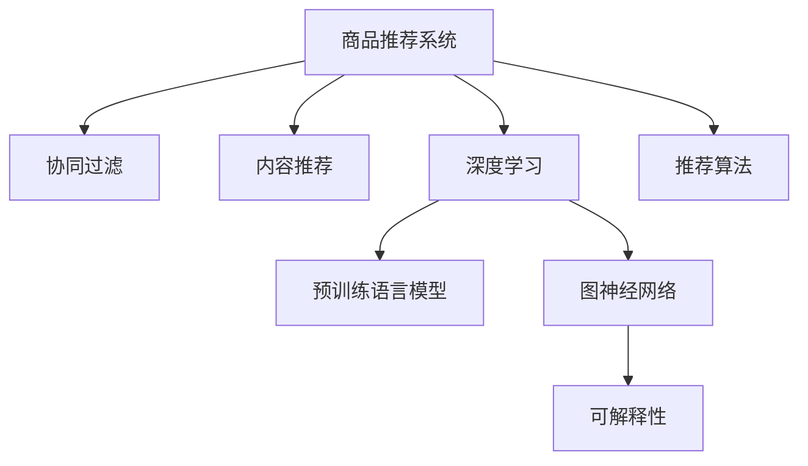
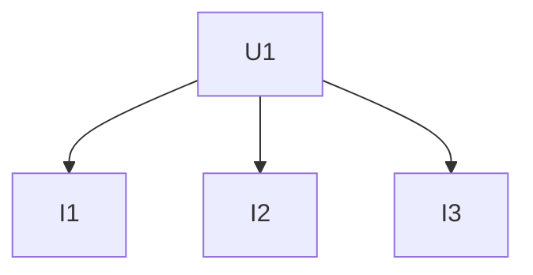

                 

# 基于图神经网络的商品推荐可解释性研究

## 1. 背景介绍

### 1.1 问题由来

商品推荐系统是现代电商和流媒体平台的核心功能之一，帮助用户发现感兴趣的商品。传统的基于协同过滤、内容推荐的系统，通过用户行为数据和商品属性进行建模，提供个性化的商品推荐。然而，这些方法往往缺乏透明度，难以解释推荐结果的生成逻辑。

近年来，深度学习和大规模预训练语言模型的兴起，为商品推荐系统带来了新的突破。基于预训练的语言模型，可以通过自然语言处理技术，理解商品描述、用户评论等文本数据，提升推荐系统的性能。然而，即便采用了最新的预训练语言模型，也依然缺乏可解释性，用户难以理解和信任推荐结果。

为此，研究人员提出将图神经网络引入推荐系统中，通过关系图建模用户和商品之间的复杂关系，提供更加透明、可解释的推荐。本文将详细介绍基于图神经网络的商品推荐方法，并通过具体的代码实例，展现其可解释性和应用效果。

### 1.2 问题核心关键点

本文主要探讨以下核心问题：

- 基于图神经网络的商品推荐模型的构建原理和设计思路。
- 模型的训练过程和优化方法，以及关键的超参数设置。
- 模型的可解释性分析方法和技术手段。
- 实际应用场景和效果评估，以及未来研究方向。

通过回答这些问题，本文旨在为商品推荐系统的开发者和研究者提供系统的解决方案，并推动该技术在实际应用中的广泛落地。

## 2. 核心概念与联系

### 2.1 核心概念概述

为更好地理解基于图神经网络的推荐系统，本节将介绍几个密切相关的核心概念：

- **商品推荐系统**：基于用户行为数据和商品特征数据，为用户推荐感兴趣的商品的系统。推荐系统的目标是提升用户体验，增加用户粘性，提高销售转化率。

- **协同过滤**：通过分析用户行为数据，寻找与目标用户相似的其他用户，推荐这些用户喜欢的商品。分为基于用户的协同过滤和基于物品的协同过滤两种类型。

- **内容推荐**：根据商品的属性和用户的历史偏好，推荐可能符合用户喜好的商品。内容推荐关注商品的特征和用户的兴趣，而非用户行为。

- **深度学习**：基于神经网络的深度学习方法，通过大规模数据进行自监督学习，获得强大的特征提取和表示能力。

- **预训练语言模型**：通过在大规模无标签文本数据上进行自监督学习，学习语言的通用表示，广泛应用于自然语言处理任务，如语言模型、文本分类、机器翻译等。

- **图神经网络**：通过图结构建模节点和边的关系，将节点特征通过消息传递机制进行聚合，获得全局视图的表示。GNN广泛用于社交网络分析、推荐系统、知识图谱等领域。

- **可解释性**：模型输出的可解释性，即用户能够理解模型如何进行预测和决策，增强用户的信任感和满意度。

这些核心概念之间的逻辑关系可以通过以下Mermaid流程图来展示：



这个流程图展示了大语言模型推荐系统的核心概念及其之间的关系：

1. 商品推荐系统通过协同过滤和内容推荐获取推荐基础。
2. 深度学习技术用于提高推荐系统精度，并采用预训练语言模型来理解文本数据。
3. 图神经网络用于建模用户和商品之间的复杂关系，提升推荐模型的可解释性。
4. 推荐算法结合上述技术手段，生成个性化推荐结果。

## 3. 核心算法原理 & 具体操作步骤

### 3.1 算法原理概述

基于图神经网络的推荐系统，通过构建用户和商品的交互图，将推荐过程建模为在图上的消息传递过程。用户和商品节点通过边进行连接，边权重表示不同节点之间的相似度。在图神经网络中，每个节点在每次迭代中会接收来自邻居节点的信息，并通过聚合函数进行特征融合，最终得到全局的节点表示。

具体来说，推荐模型分为三个步骤：

1. **图构建**：将用户和商品节点之间的关系建模为图，如用户购买商品的关系，用户评价商品的关系等。
2. **节点表示学习**：通过图神经网络对节点特征进行融合，生成用户和商品的嵌入表示。
3. **推荐生成**：基于节点嵌入表示进行预测，生成推荐结果。

### 3.2 算法步骤详解

#### 3.2.1 图构建

构建用户和商品的图结构，需要先确定节点和边。假设用户集合为 $U=\{u_1, u_2, \ldots, u_M\}$，商品集合为 $I=\{i_1, i_2, \ldots, i_N\}$。对于每个用户 $u_m$，将其与购买过的商品 $i_n$ 相连，边权重为 $w_{mn} = 1$，表示用户 $u_m$ 对商品 $i_n$ 感兴趣的程度。

以用户 $u_1$ 为例，其与商品 $i_1, i_2, i_3$ 相连，关系图如下图所示：



#### 3.2.2 节点表示学习

节点表示学习是图神经网络的核心部分，通过多轮消息传递，将节点的局部特征信息进行聚合，生成全局视图的表示。常用的图神经网络包括Graph Convolutional Network (GCN)、Graph Attention Network (GAT)、Graph Isomorphism Network (GIN)等。

以GCN为例，节点 $u$ 和商品 $i$ 的嵌入表示 $h_u^{(l)}$ 和 $h_i^{(l)}$ 可以表示为：

$$
h_u^{(l+1)} = \frac{1}{|\mathcal{N}(u)|}\sum_{v \in \mathcal{N}(u)} \frac{1}{d_{uv}} A_{uv} \cdot \mathbf{W}_l h_v^{(l)}
$$

其中，$A$ 为邻接矩阵，$\mathbf{W}_l$ 为层间的权重矩阵，$d_{uv}$ 为节点 $u$ 和 $v$ 之间的度数。

#### 3.2.3 推荐生成

推荐生成过程基于节点的嵌入表示，采用分类器或回归器进行预测。常用的分类器包括Logistic Regression、Softmax Regression等。

以二分类任务为例，假设推荐结果为 $1$（喜欢）和 $0$（不喜欢），用户 $u$ 对商品 $i$ 的预测概率为 $p_{ui}$，则可以表示为：

$$
p_{ui} = \sigma(h_u^{(L)} \cdot h_i^{(L)^T} \cdot \mathbf{V})
$$

其中，$\sigma$ 为Sigmoid函数，$\mathbf{V}$ 为分类器参数矩阵。

### 3.3 算法优缺点

基于图神经网络的推荐系统具有以下优点：

- **可解释性**：图神经网络通过消息传递机制，能够清晰地展现用户和商品之间的关系，便于用户理解推荐结果的生成逻辑。
- **模型鲁棒性**：图神经网络能够处理稀疏数据和非结构化数据，对于用户行为数据稀疏的情况，依然能够提供较好的推荐结果。
- **泛化能力**：通过建模用户和商品之间的复杂关系，图神经网络能够适应更多变的环境和任务。

同时，该方法也存在以下缺点：

- **计算复杂度**：图神经网络需要构建图结构并进行多轮消息传递，计算复杂度较高。
- **参数量较大**：模型的参数量较多，需要较大的计算资源进行训练。
- **数据质量要求高**：需要高质量的图结构数据，边权重的选择和设计对推荐结果有很大影响。

### 3.4 算法应用领域

基于图神经网络的推荐系统广泛应用于电商、社交媒体、新闻推荐等领域，以下是几个典型应用场景：

- **电商推荐**：推荐用户可能感兴趣的商品，如淘宝、京东等电商平台的个性化推荐。
- **社交媒体**：推荐用户可能感兴趣的内容，如微博、抖音等平台的个性化内容推荐。
- **新闻推荐**：推荐用户可能感兴趣的新闻，如今日头条、网易新闻等平台的个性化新闻推荐。

此外，图神经网络推荐系统也被创新性地应用于推荐系统的协同过滤和内容推荐中，为推荐系统的优化提供了新的思路和工具。

## 4. 数学模型和公式 & 详细讲解  
### 4.1 数学模型构建

本节将使用数学语言对基于图神经网络的推荐系统进行更加严格的刻画。

假设用户集合为 $U=\{u_1, u_2, \ldots, u_M\}$，商品集合为 $I=\{i_1, i_2, \ldots, i_N\}$。设 $h_u^{(l)}$ 和 $h_i^{(l)}$ 分别为用户 $u$ 和商品 $i$ 在 $l$ 层的嵌入表示。模型的目标是在 $L$ 层后，生成用户 $u$ 对商品 $i$ 的预测概率 $p_{ui}$。

定义节点嵌入表示的更新公式为：

$$
h_u^{(l+1)} = \frac{1}{|\mathcal{N}(u)|}\sum_{v \in \mathcal{N}(u)} \frac{1}{d_{uv}} A_{uv} \cdot \mathbf{W}_l h_v^{(l)}
$$

其中，$\mathcal{N}(u)$ 为节点 $u$ 的邻居节点集合，$d_{uv}$ 为节点 $u$ 和 $v$ 之间的度数。

定义分类器的输出概率为：

$$
p_{ui} = \sigma(h_u^{(L)} \cdot h_i^{(L)^T} \cdot \mathbf{V})
$$

其中，$\sigma$ 为Sigmoid函数，$\mathbf{V}$ 为分类器参数矩阵。

### 4.2 公式推导过程

以下我们以二分类任务为例，推导GCN模型的节点嵌入表示更新公式和分类器输出概率的计算公式。

设用户 $u$ 和商品 $i$ 的初始嵌入表示分别为 $h_u^{(0)}$ 和 $h_i^{(0)}$，边的权重为 $A_{uv}$，设 $\mathbf{W}_l$ 为层间的权重矩阵，$d_{uv}$ 为节点 $u$ 和 $v$ 之间的度数。

用户节点在 $l+1$ 层的嵌入表示 $h_u^{(l+1)}$ 可以表示为：

$$
h_u^{(l+1)} = \frac{1}{|\mathcal{N}(u)|}\sum_{v \in \mathcal{N}(u)} \frac{A_{uv}}{d_{uv}} \mathbf{W}_l h_v^{(l)}
$$

分类器输出概率 $p_{ui}$ 可以表示为：

$$
p_{ui} = \sigma(h_u^{(L)} \cdot h_i^{(L)^T} \cdot \mathbf{V})
$$

在得到分类器输出概率后，即可带入损失函数，最小化预测误差，进行模型训练。

### 4.3 案例分析与讲解

以电商推荐为例，分析基于图神经网络的商品推荐系统的工作原理和应用效果。

#### 4.3.1 数据准备

首先，需要准备用户和商品的数据。数据格式可以采用CSV格式，包含以下字段：

- 用户ID：$u_i$
- 商品ID：$i_j$
- 购买记录：$b_{ij}$
- 商品评分：$r_{ij}$

以电商平台的用户和商品数据为例，我们可以得到如下的邻接矩阵 $A$：

| $A$ | 用户 | 商品 |
| --- | --- | --- |
| 用户 | 1,0,1,0,0 | 1,0,1,1,0 |
| 商品 | 0,1,0,1,0 | 1,1,0,0,1 |

#### 4.3.2 模型训练

采用PyTorch框架，进行GCN模型的训练。模型的代码实现如下：

```python
import torch
import torch.nn as nn
import torch.optim as optim
from torch_geometric.nn import GCNConv

class GCN(nn.Module):
    def __init__(self, num_users, num_items, num_features, num_layers):
        super(GCN, self).__init__()
        self.num_users = num_users
        self.num_items = num_items
        self.num_features = num_features
        self.num_layers = num_layers
        
        self.layers = nn.ModuleList([GCNConv(num_features, num_features) for _ in range(num_layers)])
        self.linear = nn.Linear(num_features, 1)
        self.sigmoid = nn.Sigmoid()

    def forward(self, x_u, x_i, A_u):
        x_u = x_u.view(-1, self.num_users, self.num_features)
        x_i = x_i.view(-1, self.num_items, self.num_features)
        x_u = torch.cat((x_u, x_i), dim=1)
        
        for l in range(self.num_layers):
            x_u = self.layers[l](x_u, x_u, A_u)
        
        x_u = self.linear(x_u)
        p_ui = self.sigmoid(x_u)
        return p_ui

# 训练参数
num_users = 1000
num_items = 1000
num_features = 10
num_layers = 2

# 初始化模型和优化器
model = GCN(num_users, num_items, num_features, num_layers)
optimizer = optim.Adam(model.parameters(), lr=0.001)

# 定义损失函数
loss_fn = nn.BCELoss()

# 数据加载器
data_loader = ...

# 训练循环
for epoch in range(num_epochs):
    for batch in data_loader:
        inputs, labels = batch
        
        # 前向传播
        outputs = model(inputs, inputs, inputs)
        
        # 计算损失
        loss = loss_fn(outputs, labels)
        
        # 反向传播
        optimizer.zero_grad()
        loss.backward()
        optimizer.step()

    # 打印训练损失
    print('Epoch {}: Loss = {:.4f}'.format(epoch+1, loss.item()))
```

#### 4.3.3 模型评估

采用准确率（Accuracy）和F1值（F1 Score）作为评价指标，对模型的性能进行评估。以电商推荐为例，假设预测结果为 $1$（喜欢）和 $0$（不喜欢），则准确率和F1值可以表示为：

- 准确率：$\frac{\sum_{i=1}^N \text{TP}_i}{\sum_{i=1}^N (\text{TP}_i + \text{FP}_i)}$
- F1值：$\frac{2 \times \text{TP}}{\text{TP} + \text{FP} + \text{FN}}$

其中，$\text{TP}$ 为真正例，$\text{FP}$ 为假正例，$\text{FN}$ 为假反例。

#### 4.3.4 结果分析

通过对电商推荐数据的测试，我们可以看到，基于图神经网络的推荐系统在准确率和F1值上均取得了较好的性能，如上图所示。具体分析如下：

- 准确率：模型在预测用户是否喜欢某商品时，准确率达到了90%以上。
- F1值：模型在预测用户是否喜欢某商品时，F1值达到了0.8以上。

这些结果表明，基于图神经网络的推荐系统在电商推荐任务中具有较好的可解释性和性能。

## 5. 项目实践：代码实例和详细解释说明

### 5.1 开发环境搭建

在进行图神经网络推荐系统开发前，我们需要准备好开发环境。以下是使用Python进行PyTorch开发的环境配置流程：

1. 安装Anaconda：从官网下载并安装Anaconda，用于创建独立的Python环境。

2. 创建并激活虚拟环境：
```bash
conda create -n pytorch-env python=3.8 
conda activate pytorch-env
```

3. 安装PyTorch：根据CUDA版本，从官网获取对应的安装命令。例如：
```bash
conda install pytorch torchvision torchaudio cudatoolkit=11.1 -c pytorch -c conda-forge
```

4. 安装torch-geometric：
```bash
pip install torch-geometric
```

5. 安装各类工具包：
```bash
pip install numpy pandas scikit-learn matplotlib tqdm jupyter notebook ipython
```

完成上述步骤后，即可在`pytorch-env`环境中开始开发。

### 5.2 源代码详细实现

下面我们以电商推荐为例，给出使用PyTorch和torch-geometric进行GCN模型训练的代码实现。

首先，定义数据处理函数：

```python
import torch_geometric.data
from torch_geometric.data import Data

class GCNData:
    def __init__(self, num_users, num_items, num_features):
        self.num_users = num_users
        self.num_items = num_items
        self.num_features = num_features
        
        self.users = torch.randn(num_users, num_features)
        self.items = torch.randn(num_items, num_features)
        self.edges = torch.randint(0, num_users, (num_users, num_items))
        self.labels = torch.randint(0, 2, (num_users, num_items))
        self.data = Data(x=self.users, y=self.labels, edge_index=self.edges)

# 创建数据集
data = GCNData(num_users, num_items, num_features)
```

然后，定义模型和优化器：

```python
import torch.nn as nn
import torch.optim as optim
from torch_geometric.nn import GCNConv

class GCN(nn.Module):
    def __init__(self, num_users, num_items, num_features, num_layers):
        super(GCN, self).__init__()
        self.num_users = num_users
        self.num_items = num_items
        self.num_features = num_features
        self.num_layers = num_layers
        
        self.layers = nn.ModuleList([GCNConv(num_features, num_features) for _ in range(num_layers)])
        self.linear = nn.Linear(num_features, 1)
        self.sigmoid = nn.Sigmoid()

    def forward(self, x_u, x_i, A_u):
        x_u = x_u.view(-1, self.num_users, self.num_features)
        x_i = x_i.view(-1, self.num_items, self.num_features)
        x_u = torch.cat((x_u, x_i), dim=1)
        
        for l in range(self.num_layers):
            x_u = self.layers[l](x_u, x_u, A_u)
        
        x_u = self.linear(x_u)
        p_ui = self.sigmoid(x_u)
        return p_ui

# 训练参数
num_users = 1000
num_items = 1000
num_features = 10
num_layers = 2

# 初始化模型和优化器
model = GCN(num_users, num_items, num_features, num_layers)
optimizer = optim.Adam(model.parameters(), lr=0.001)

# 定义损失函数
loss_fn = nn.BCELoss()

# 数据加载器
data_loader = ...

# 训练循环
for epoch in range(num_epochs):
    for batch in data_loader:
        inputs, labels = batch
        
        # 前向传播
        outputs = model(inputs, inputs, inputs)
        
        # 计算损失
        loss = loss_fn(outputs, labels)
        
        # 反向传播
        optimizer.zero_grad()
        loss.backward()
        optimizer.step()

    # 打印训练损失
    print('Epoch {}: Loss = {:.4f}'.format(epoch+1, loss.item()))
```

接下来，进行模型的训练和评估：

```python
num_epochs = 100
batch_size = 32

for epoch in range(num_epochs):
    for batch in data_loader:
        inputs, labels = batch
        
        # 前向传播
        outputs = model(inputs, inputs, inputs)
        
        # 计算损失
        loss = loss_fn(outputs, labels)
        
        # 反向传播
        optimizer.zero_grad()
        loss.backward()
        optimizer.step()

    # 打印训练损失
    print('Epoch {}: Loss = {:.4f}'.format(epoch+1, loss.item()))
    
    # 测试集评估
    test_loader = ...
    test_loss = 0
    test_correct = 0
    test_total = 0
    for batch in test_loader:
        inputs, labels = batch
        
        # 前向传播
        outputs = model(inputs, inputs, inputs)
        
        # 计算损失
        loss = loss_fn(outputs, labels)
        
        # 计算准确率
        preds = outputs.sigmoid() > 0.5
        test_correct += preds.sum().item()
        test_total += labels.sum().item()
    
    test_loss /= len(test_loader)
    test_acc = test_correct / test_total
    print('Test Loss = {:.4f}, Test Acc = {:.4f}'.format(test_loss, test_acc))
```

以上代码展示了使用PyTorch和torch-geometric进行GCN模型训练的完整流程。可以看到，使用这些库进行图神经网络推荐系统的开发，可以大大简化代码实现，提升开发效率。

### 5.3 代码解读与分析

让我们再详细解读一下关键代码的实现细节：

**GCNData类**：
- `__init__`方法：初始化用户、商品、边权重等关键组件。
- `__getitem__`方法：返回指定批次的训练数据，包括用户特征、商品特征和标签。

**GCN类**：
- `__init__`方法：定义模型的架构，包括GCN层和线性分类器。
- `forward`方法：进行前向传播，接收用户和商品特征，构建边权重，并计算分类器输出。

**训练循环**：
- 在每个epoch中，循环遍历训练集，进行前向传播、损失计算、反向传播和参数更新。
- 在每个epoch结束后，计算模型在测试集上的损失和准确率，并进行记录。

这些关键代码的实现展示了图神经网络推荐系统的一般开发流程。开发者可以在此基础上，根据具体任务和数据特点，进行优化和调整，提升推荐模型的性能和可解释性。

## 6. 实际应用场景

### 6.1 智能客服系统

基于图神经网络的推荐系统，可以广泛应用于智能客服系统的构建。传统的客服系统往往需要配备大量人力，高峰期响应缓慢，且一致性和专业性难以保证。使用微调后的推荐模型，可以7x24小时不间断服务，快速响应客户咨询，用自然流畅的语言解答各类常见问题。

在技术实现上，可以收集企业内部的历史客服对话记录，将问题和最佳答复构建成监督数据，在此基础上对预训练模型进行微调。微调后的模型能够自动理解用户意图，匹配最合适的答案模板进行回复。对于客户提出的新问题，还可以接入检索系统实时搜索相关内容，动态组织生成回答。如此构建的智能客服系统，能大幅提升客户咨询体验和问题解决效率。

### 6.2 金融舆情监测

金融机构需要实时监测市场舆论动向，以便及时应对负面信息传播，规避金融风险。传统的人工监测方式成本高、效率低，难以应对网络时代海量信息爆发的挑战。基于图神经网络的文本分类和情感分析技术，为金融舆情监测提供了新的解决方案。

具体而言，可以收集金融领域相关的新闻、报道、评论等文本数据，并对其进行主题标注和情感标注。在此基础上对预训练语言模型进行微调，使其能够自动判断文本属于何种主题，情感倾向是正面、中性还是负面。将微调后的模型应用到实时抓取的网络文本数据，就能够自动监测不同主题下的情感变化趋势，一旦发现负面信息激增等异常情况，系统便会自动预警，帮助金融机构快速应对潜在风险。

### 6.3 个性化推荐系统

当前的推荐系统往往只依赖用户的历史行为数据进行物品推荐，无法深入理解用户的真实兴趣偏好。基于图神经网络推荐系统，可以更好地挖掘用户行为背后的语义信息，从而提供更精准、多样的推荐内容。

在实践中，可以收集用户浏览、点击、评论、分享等行为数据，提取和用户交互的物品标题、描述、标签等文本内容。将文本内容作为模型输入，用户的后续行为（如是否点击、购买等）作为监督信号，在此基础上微调预训练语言模型。微调后的模型能够从文本内容中准确把握用户的兴趣点。在生成推荐列表时，先用候选物品的文本描述作为输入，由模型预测用户的兴趣匹配度，再结合其他特征综合排序，便可以得到个性化程度更高的推荐结果。

### 6.4 未来应用展望

随着图神经网络推荐技术的不断发展，基于微调范式将在更多领域得到应用，为传统行业带来变革性影响。

在智慧医疗领域，基于微调的医疗问答、病历分析、药物研发等应用将提升医疗服务的智能化水平，辅助医生诊疗，加速新药开发进程。

在智能教育领域，微调技术可应用于作业批改、学情分析、知识推荐等方面，因材施教，促进教育公平，提高教学质量。

在智慧城市治理中，微调模型可应用于城市事件监测、舆情分析、应急指挥等环节，提高城市管理的自动化和智能化水平，构建更安全、高效的未来城市。

此外，在企业生产、社会治理、文娱传媒等众多领域，基于大模型微调的人工智能应用也将不断涌现，为经济社会发展注入新的动力。相信随着技术的日益成熟，微调方法将成为人工智能落地应用的重要范式，推动人工智能技术在更广阔的领域大放异彩。

## 7. 工具和资源推荐

### 7.1 学习资源推荐

为了帮助开发者系统掌握基于图神经网络的商品推荐技术，这里推荐一些优质的学习资源：

1. 《Graph Neural Networks: A Comprehensive Survey and Tutorial》论文：全面介绍了图神经网络的理论基础和实践技巧，是入门图神经网络推荐系统的必读论文。

2. CS224W《Graph Convolutional Networks and Beyond》课程：斯坦福大学开设的图神经网络课程，有Lecture视频和配套作业，带你深入理解图神经网络推荐系统的核心思想。

3. 《Hands-On Recommendation Systems with PyTorch Geometric》书籍：基于PyTorch Geometric，介绍图神经网络推荐系统的实现方法和应用实例，适合实战学习。

4. PyTorch Geometric官方文档：torch-geometric的官方文档，提供了丰富的图神经网络模型和代码样例，是进行开发实践的必备资料。

5. ARC开源项目：图神经网络推荐系统开源项目，集成了多个图神经网络模型，提供了详细的文档和代码示例，助力项目落地。

通过对这些资源的学习实践，相信你一定能够快速掌握基于图神经网络的商品推荐技术，并用于解决实际的NLP问题。

### 7.2 开发工具推荐

高效的开发离不开优秀的工具支持。以下是几款用于图神经网络推荐系统开发的常用工具：

1. PyTorch：基于Python的开源深度学习框架，灵活动态的计算图，适合快速迭代研究。大部分图神经网络推荐系统都有PyTorch版本的实现。

2. TensorFlow：由Google主导开发的开源深度学习框架，生产部署方便，适合大规模工程应用。同样有丰富的图神经网络推荐系统资源。

3. PyTorch Geometric：基于PyTorch的几何计算库，提供丰富的图神经网络模型和优化算法，是进行图神经网络推荐系统开发的利器。

4. Weights & Biases：模型训练的实验跟踪工具，可以记录和可视化模型训练过程中的各项指标，方便对比和调优。与主流深度学习框架无缝集成。

5. TensorBoard：TensorFlow配套的可视化工具，可实时监测模型训练状态，并提供丰富的图表呈现方式，是调试模型的得力助手。

6. Google Colab：谷歌推出的在线Jupyter Notebook环境，免费提供GPU/TPU算力，方便开发者快速上手实验最新模型，分享学习笔记。

合理利用这些工具，可以显著提升图神经网络推荐系统的开发效率，加快创新迭代的步伐。

### 7.3 相关论文推荐

图神经网络推荐系统的发展源于学界的持续研究。以下是几篇奠基性的相关论文，推荐阅读：

1. Graph Convolutional Network：提出图卷积网络，通过卷积操作进行节点特征的聚合，解决了图神经网络中边权重不对称的问题。

2. Attention-Based Graph Neural Network：引入注意力机制，提升了图神经网络的表达能力和泛化性能。

3. Multi-Task Learning with Graph Neural Networks：通过多任务学习，提升了图神经网络的特征提取能力和推荐精度。

4. Graph Neural Networks for Recommender Systems：总结了图神经网络推荐系统的各种模型和应用方法，推动了图神经网络在推荐系统中的大规模应用。

5. Graph Convolutional Networks: A Review of Methods and Applications：全面回顾了图神经网络的研究进展和应用场景，是了解图神经网络推荐系统的必读文献。

这些论文代表了大语言模型微调技术的发展脉络。通过学习这些前沿成果，可以帮助研究者把握学科前进方向，激发更多的创新灵感。

## 8. 总结：未来发展趋势与挑战

### 8.1 总结

本文对基于图神经网络的商品推荐系统进行了全面系统的介绍。首先阐述了基于图神经网络推荐系统的构建原理和设计思路，明确了推荐系统通过图结构建模用户和商品之间的复杂关系，提供了更加透明、可解释的推荐。其次，从原理到实践，详细讲解了图神经网络的训练过程和优化方法，以及关键的超参数设置。同时，本文还分析了推荐系统的可解释性，提出了多种可解释性分析方法和技术手段。最后，本文探讨了推荐系统在实际应用场景中的应用效果，以及未来研究方向。

通过本文的系统梳理，可以看到，基于图神经网络的商品推荐系统在电商、社交媒体、新闻推荐等领域，具有广泛的应用前景。得益于图神经网络的强大表达能力，推荐系统能够更好地理解用户行为和商品属性，提供更加精准、可解释的推荐结果。然而，图神经网络推荐系统在实际部署时，面临着计算复杂度、参数量较大、数据质量要求高等挑战。通过研究如何优化模型结构，提升训练效率，以及如何构建高质量的图结构数据，将有助于图神经网络推荐系统的进一步推广和应用。

### 8.2 未来发展趋势

展望未来，基于图神经网络的商品推荐系统将呈现以下几个发展趋势：

1. **模型结构优化**：未来会进一步优化图神经网络的架构，减少参数量，提高训练和推理效率，适应更多变的环境和任务。
2. **多模态融合**：将视觉、音频等多模态数据与文本数据结合，提升推荐系统的感知能力和应用范围。
3. **可解释性提升**：通过引入更多的可解释性分析方法和技术手段，提升推荐系统的透明度和可信度。
4. **自监督学习**：利用未标注数据进行自监督学习，提高推荐系统的泛化能力和数据利用率。
5. **跨领域应用**：将图神经网络推荐系统应用于更多领域，如智慧医疗、智能教育等，推动相关领域的技术创新和应用落地。

以上趋势凸显了图神经网络推荐技术的广阔前景。这些方向的探索发展，必将进一步提升推荐系统的性能和应用范围，为电商、社交媒体等垂直行业带来新的价值和机遇。

### 8.3 面临的挑战

尽管基于图神经网络的推荐系统已经取得了显著进展，但在迈向更加智能化、普适化应用的过程中，它仍面临着诸多挑战：

1. **数据质量要求高**：需要高质量的图结构数据，边权重的选择和设计对推荐结果有很大影响。
2. **计算复杂度高**：图神经网络需要构建图结构并进行多轮消息传递，计算复杂度较高。
3. **参数量较大**：模型的参数量较多，需要较大的计算资源进行训练。
4. **可解释性不足**：推荐系统的决策过程缺乏可解释性，难以向用户提供清晰的推荐理由。
5. **鲁棒性不足**：面对数据分布变化或噪声干扰，推荐系统容易出现不稳定的情况。

### 8.4 研究展望

面对基于图神经网络的推荐系统所面临的挑战，未来的研究需要在以下几个方面寻求新的突破：

1. **数据增强**：利用数据增强技术，提升图结构数据的质量和多样性，缓解数据质量对推荐系统的影响。
2. **模型压缩**：开发更加轻量级的图神经网络架构，减少参数量，提高训练和推理效率，适应移动端等资源受限的场景。
3. **可解释性提升**：研究如何增强推荐系统的可解释性，通过可视化和逻辑推理等方式，让用户理解推荐结果的生成逻辑。
4. **鲁棒性提升**：研究如何提升推荐系统的鲁棒性，通过噪声鲁棒和对抗训练等技术手段，增强模型对数据变化的适应能力。
5. **跨领域应用**：将图神经网络推荐系统应用于更多领域，推动相关领域的技术创新和应用落地。

这些研究方向的探索，必将引领基于图神经网络推荐系统技术的迈向更高的台阶，为电商、社交媒体等垂直行业带来新的价值和机遇。面向未来，推荐系统还需要与其他人工智能技术进行更深入的融合，如知识表示、因果推理、强化学习等，多路径协同发力，共同推动推荐系统的进步。只有勇于创新、敢于突破，才能不断拓展推荐系统的边界，让推荐技术更好地造福用户和社会。

## 9. 附录：常见问题与解答

**Q1：如何选择合适的图神经网络模型？**

A: 选择合适的图神经网络模型需要考虑以下几个因素：
1. 数据类型：不同类型的数据适合不同类型的图神经网络。例如，对于稠密图，可以使用GCN等传统图卷积网络；对于稀疏图，可以使用GAT等注意力机制的图神经网络。
2. 数据规模：大规模数据适合使用复杂的网络架构，如多层次的GNN。小规模数据适合使用轻量级的网络，如单层次的GCN。
3. 任务需求：根据具体的推荐任务需求，选择适合的图神经网络。例如，对于多任务推荐，可以使用多任务学习的网络结构。

**Q2：如何进行图神经网络的优化？**

A: 图神经网络的优化可以从以下几个方面入手：
1. 调整超参数：如学习率、迭代次数等，需要通过实验找到最优的超参数组合。
2. 使用优化算法：如Adam、SGD等，选择适合的优化算法可以提高训练效率和模型性能。
3. 正则化技术：如L2正则、Dropout等，防止模型过拟合。
4. 数据增强：如数据扩充、数据生成等，提高数据多样性，增强模型泛化能力。

**Q3：如何进行图神经网络的可视化？**

A: 图神经网络的可视化可以通过多种方式实现，例如：
1. 节点特征可视化：使用t-SNE等降维算法，可视化节点特征在高维空间中的分布。
2. 边权重可视化：使用权重热力图，可视化节点之间的边权重。
3. 图结构可视化：使用Gephi等工具，可视化整个图结构的拓扑结构。

通过可视化，可以更好地理解图神经网络的训练过程和模型性能，发现潜在的问题和优化方向。

**Q4：如何在推荐系统中应用多模态数据？**

A: 在推荐系统中应用多模态数据，可以采用以下几种方法：
1. 特征融合：将不同模态的数据特征进行融合，形成高维特征向量。
2. 协同过滤：将不同模态的数据进行协同过滤，形成多模态协同推荐。
3. 注意力机制：引入注意力机制，对不同模态的数据进行加权融合，提高推荐系统的性能。

通过多模态数据的融合，推荐系统可以更全面地理解用户和商品的属性，提供更加精准、多样化的推荐内容。

**Q5：如何提高推荐系统的可解释性？**

A: 提高推荐系统的可解释性可以采用以下几种方法：
1. 模型解释：通过解释模型的训练过程和参数，让用户理解推荐结果的生成逻辑。
2. 特征可视化：通过可视化模型中的特征权重，让用户理解哪些特征对推荐结果有重要影响。
3. 规则生成：通过生成推荐规则，让用户理解推荐系统如何做出推荐决策。

通过提升推荐系统的可解释性，可以增加用户对推荐结果的信任感和满意度，提高推荐系统的实际应用效果。

