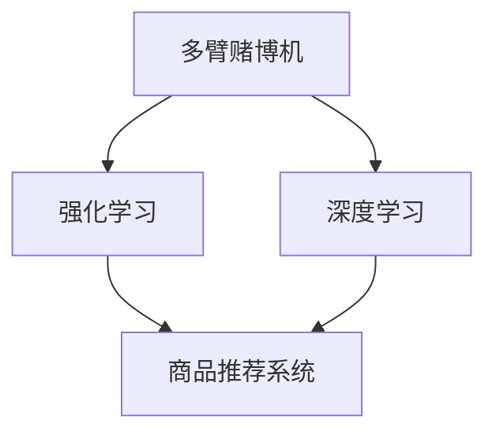

                 

# 基于大模型的商品推荐多样性优化

> 关键词：大模型,商品推荐,多样性优化,多臂赌博机,强化学习,深度学习

## 1. 背景介绍

### 1.1 问题由来

在电子商务领域，推荐系统已经成为提高用户购物体验和交易效率的重要工具。然而，现有的推荐系统往往以最大化点击率(CTR)为优化目标，忽略了用户对推荐结果多样性的需求。这导致了推荐系统的单一化问题，即在一定时间范围内，推荐给用户的商品品种数趋于固定，用户的购物体验和商品曝光率都难以得到充分保障。多样性优化作为推荐系统的关键目标之一，旨在增加推荐结果的丰富性和个性化程度，提高用户满意度。

近年来，随着深度学习技术和大模型（如BERT、GPT等）的快速发展，人们开始探索基于大模型的推荐系统，旨在利用其强大的语言理解能力和广泛的知识库，提升推荐结果的多样性。这些基于大模型的推荐系统通常采用多臂赌博机(Multi-Armed Bandit, MAB)框架，将推荐视为一个多臂赌博机问题，通过在线学习机制不断调整推荐策略，逐步优化推荐结果的多样性和效果。

### 1.2 问题核心关键点

本文聚焦于基于大模型的商品推荐多样性优化问题，探讨如何通过多臂赌博机框架，利用深度学习技术，最大化推荐结果的多样性和点击率，提升用户体验。具体问题核心关键点包括：

1. 如何构建有效的多臂赌博机模型，确保多样性优化的公平性和鲁棒性。
2. 如何利用大模型学到的语义信息，改善推荐结果的个性化程度。
3. 如何在多臂赌博机框架中融合强化学习和深度学习技术，实现推荐结果的动态优化。
4. 如何评估推荐系统的多样性效果，设置合适的推荐目标。

## 2. 核心概念与联系

### 2.1 核心概念概述

为了更好地理解基于大模型的商品推荐多样性优化，本节将介绍几个密切相关的核心概念：

- **多臂赌博机(MAB)**：一种经典的决策理论模型，用于模拟选择不同资源的过程，如金融投资、推荐系统等。MAB模型将不同资源视为“臂”，每次选择“臂”时获得一定的奖励，期望通过不断探索和利用臂的奖励，最大化长期收益。

- **强化学习(Reinforcement Learning, RL)**：一种学习范式，通过与环境交互，利用奖励信号指导策略优化，逐步学习到最优的决策行为。

- **深度学习(Deep Learning)**：一种利用深度神经网络进行特征提取和模型训练的技术，具有强大的非线性建模能力和泛化能力。

- **商品推荐系统(Recommendation System)**：通过分析用户行为数据，为用户推荐最相关的商品，以提升用户满意度和交易转化率。

这些核心概念之间的逻辑关系可以通过以下Mermaid流程图来展示：



这个流程图展示了大模型商品推荐多样性优化的核心概念及其之间的关系：

1. 多臂赌博机模型为推荐系统提供了一种在线决策框架，通过不断探索和利用臂的奖励，优化推荐结果。
2. 强化学习在多臂赌博机模型中起到优化策略的作用，通过奖励信号指导策略的不断改进。
3. 深度学习为多臂赌博机模型提供丰富的特征表示和建模能力，提升模型的决策质量。
4. 商品推荐系统利用多臂赌博机模型和强化学习优化推荐结果，提高用户满意度。

这些概念共同构成了大模型商品推荐多样性优化的学习和应用框架，使得推荐系统能够在推荐结果的多样性和效果之间取得平衡，更好地满足用户需求。

## 3. 核心算法原理 & 具体操作步骤
### 3.1 算法原理概述

基于大模型的商品推荐多样性优化，本质上是一个多臂赌博机问题，其核心思想是：利用深度学习和大模型学到的语义信息，通过在线学习机制不断调整推荐策略，最大化推荐结果的多样性和点击率。具体而言，该问题可以分为以下几个步骤：

1. **构建多臂赌博机模型**：定义每个臂（商品）的奖励（点击率）和探索概率，建立一个多臂赌博机模型。
2. **设计深度学习特征提取器**：利用大模型对商品标题、描述等特征进行编码，提取商品的多维度语义信息。
3. **融合强化学习与深度学习**：将多臂赌博机模型的探索策略与深度学习特征提取器相结合，实时调整推荐策略，优化推荐结果。
4. **多样性评估与反馈**：通过多样性指标（如商品种类数、点击分布等）评估推荐效果，结合用户反馈，调整推荐策略。

### 3.2 算法步骤详解

基于大模型的商品推荐多样性优化，一般包括以下几个关键步骤：

**Step 1: 数据预处理与模型训练**

1. **数据准备**：收集用户行为数据，包括浏览、点击、购买等记录，同时收集商品信息，如标题、描述、价格等。
2. **数据预处理**：清洗数据，去除噪声和不完整记录，提取用户和商品特征。
3. **模型训练**：利用深度学习技术，训练特征提取器，如BERT、GPT等大模型，提取商品的语义信息。

**Step 2: 多臂赌博机模型构建**

1. **定义臂的奖励**：将点击率作为臂的奖励，即每次推荐商品时获得的点击率。
2. **定义探索概率**：为每个臂设定一个探索概率，控制探索与利用的平衡。
3. **初始化模型参数**：初始化多臂赌博机模型的参数，如探索概率、臂的点击率等。

**Step 3: 在线学习与策略优化**

1. **探索与利用**：每次推荐时，根据探索概率选择臂（商品）进行推荐，同时记录点击率和反馈信息。
2. **更新模型参数**：根据推荐结果的反馈，使用强化学习算法更新模型参数，优化探索策略。
3. **策略迭代**：不断重复探索、利用和参数更新的过程，逐步提升推荐效果。

**Step 4: 多样性评估与调整**

1. **多样性指标计算**：计算推荐结果的商品种类数、点击分布等多样性指标，评估推荐效果。
2. **反馈与调整**：根据多样性指标，结合用户反馈，调整探索概率和臂的点击率，优化推荐策略。
3. **定期重新训练**：定期重新训练特征提取器和多臂赌博机模型，确保推荐策略的准确性和鲁棒性。

### 3.3 算法优缺点

基于大模型的商品推荐多样性优化方法具有以下优点：

1. **高效利用语义信息**：利用大模型的语义理解能力，提取商品的丰富特征，提升推荐结果的个性化程度。
2. **实时动态优化**：通过在线学习机制，实时调整推荐策略，适应用户需求的变化。
3. **多样化推荐**：在多样性和效果之间取得平衡，增加推荐结果的多样性和覆盖面。

同时，该方法也存在一定的局限性：

1. **计算资源消耗较大**：大模型的训练和推理需要大量的计算资源，对于小型企业可能难以承担。
2. **数据依赖性较强**：推荐策略依赖于大量用户行为数据，数据不足时可能难以取得理想效果。
3. **策略复杂度较高**：需要结合深度学习与强化学习技术，算法实现较为复杂。
4. **推荐效果受限于探索概率**：探索概率的设计需要精细调整，不当设置可能导致过度探索或利用不足。

尽管存在这些局限性，但就目前而言，基于大模型的商品推荐多样性优化方法仍是大数据时代推荐系统的重要范式。未来相关研究的重点在于如何进一步降低计算资源消耗，提高算法的可解释性和鲁棒性，同时兼顾多样性和效果之间的平衡。

### 3.4 算法应用领域

基于大模型的商品推荐多样性优化方法，已经在多个实际应用中取得了显著效果，包括但不限于：

1. **电商平台推荐**：利用大模型对用户行为和商品特征进行编码，通过多臂赌博机模型优化推荐策略，提升用户购物体验和商品曝光率。
2. **内容推荐系统**：将文章、视频等媒体内容视作臂，通过多臂赌博机模型实时调整推荐策略，增加内容多样性和用户满意度。
3. **个性化健康推荐**：利用大模型提取健康内容的多维度特征，通过多臂赌博机模型推荐个性化健康建议，提高用户健康意识和行为。
4. **音乐推荐系统**：将歌曲视作臂，通过多臂赌博机模型和深度学习技术，推荐个性化的音乐播放列表，增加音乐多样性和用户沉浸感。
5. **旅游推荐系统**：将旅游目的地视作臂，利用大模型提取旅游资源的多维度特征，通过多臂赌博机模型推荐个性化旅游路线，提高用户旅行体验。

除了上述这些经典应用外，基于大模型的商品推荐多样性优化方法还在更多场景中得到创新性的应用，如智能家居、金融产品推荐等，为推荐系统带来了新的突破。

## 4. 数学模型和公式 & 详细讲解
### 4.1 数学模型构建

本节将使用数学语言对基于大模型的商品推荐多样性优化过程进行更加严格的刻画。

记多臂赌博机模型的参数为 $\theta$，其中包括探索概率 $p_i$（第 $i$ 个臂的探索概率）和臂的点击率 $\mu_i$（第 $i$ 个臂的点击率）。设用户点击第 $i$ 个臂的奖励为 $r_i$（点击率），则多臂赌博机模型的期望收益为：

$$
\mathbb{E}[\sum_{i=1}^{K} r_i p_i]
$$

其中 $K$ 为臂的数量。我们的目标是最大化期望收益，即求解以下优化问题：

$$
\theta^* = \mathop{\arg\min}_{\theta} \mathcal{L}(\theta)
$$

其中 $\mathcal{L}$ 为损失函数，通常采用交叉熵损失。

### 4.2 公式推导过程

在实际应用中，多臂赌博机模型的探索概率 $p_i$ 和臂的点击率 $\mu_i$ 需要根据用户反馈进行调整。我们采用上下文奖励强化学习算法，结合深度学习特征提取器，实时更新模型参数。

假设用户每次点击第 $i$ 个臂的奖励为 $r_i$，探索概率为 $p_i$，则上下文奖励强化学习算法更新策略的公式为：

$$
p_i^{t+1} = \text{softmax}\left(\eta\sum_{j=1}^{t} r_j \phi(x_j) - \alpha p_i^t \right)
$$

其中 $\phi(x)$ 为深度学习特征提取器，将用户行为 $x$ 编码为向量。$\eta$ 为学习率，$\alpha$ 为温度参数。该公式通过奖励和探索概率的迭代，逐步优化推荐策略。

### 4.3 案例分析与讲解

为了更好地理解上述模型的实际应用，我们以一个简单的案例进行分析：假设某电商平台有三个商品臂（A、B、C），点击率分别为0.2、0.3、0.1。初始探索概率为 $p_A=p_B=p_C=0.5$。假设用户点击了A和B臂，分别获得点击率0.3和0.2。根据上下文奖励强化学习算法，更新探索概率：

- 对于A臂：$p_A^{t+1} = \text{softmax}(0.3\phi(A) - 0.5) = 0.8$
- 对于B臂：$p_B^{t+1} = \text{softmax}(0.2\phi(B) - 0.5) = 0.4$
- 对于C臂：$p_C^{t+1} = \text{softmax}(0.1\phi(C) - 0.5) = 0.2$

更新后的探索概率反映了用户对商品A和B的偏好，在后续推荐中，应更加倾向于推荐A和B臂。

## 5. 项目实践：代码实例和详细解释说明
### 5.1 开发环境搭建

在进行商品推荐多样性优化实践前，我们需要准备好开发环境。以下是使用Python进行TensorFlow开发的环境配置流程：

1. 安装Anaconda：从官网下载并安装Anaconda，用于创建独立的Python环境。

2. 创建并激活虚拟环境：
```bash
conda create -n tf-env python=3.8 
conda activate tf-env
```

3. 安装TensorFlow：根据CUDA版本，从官网获取对应的安装命令。例如：
```bash
conda install tensorflow==2.8 -c pytorch -c conda-forge
```

4. 安装各类工具包：
```bash
pip install numpy pandas scikit-learn matplotlib tqdm jupyter notebook ipython
```

完成上述步骤后，即可在`tf-env`环境中开始推荐多样性优化实践。

### 5.2 源代码详细实现

下面我们以一个简单的商品推荐系统为例，给出使用TensorFlow和深度学习技术实现基于多臂赌博机框架的商品推荐多样性优化的PyTorch代码实现。

首先，定义多臂赌博机模型的参数和奖励函数：

```python
import tensorflow as tf
from tensorflow.keras.layers import Dense, Input
from tensorflow.keras.models import Model

class MultiArmedBandit(tf.keras.Model):
    def __init__(self, num_arms):
        super(MultiArmedBandit, self).__init__()
        self.num_arms = num_arms
        selfexploration_strategy = tf.keras.layers.Lambda(lambda: tf.random.uniform(shape=(num_arms,)))
        self.reward_model = tf.keras.Sequential([
            Dense(16, input_dim=num_arms, activation='relu'),
            Dense(1, activation='sigmoid')
        ])
        
    def call(self, state):
        exploration = self.exploration_strategy()
        state = tf.expand_dims(state, axis=1)
        state = tf.concat([state, exploration], axis=1)
        prob = self.reward_model(state)
        return tf.squeeze(prob, axis=1)
```

然后，定义推荐系统：

```python
def recommend_system(state, model):
    prob = model(state)
    return tf.argmax(prob)
```

接着，定义训练函数：

```python
def train(model, dataset, batch_size, epochs):
    for epoch in range(epochs):
        for batch in dataset:
            state, reward = batch
            with tf.GradientTape() as tape:
                prob = model(state)
                loss = tf.reduce_mean(tf.nn.sigmoid_cross_entropy_with_logits(labels=reward, logits=prob))
            grads = tape.gradient(loss, model.trainable_variables)
            optimizer.apply_gradients(zip(grads, model.trainable_variables))
    return model
```

最后，启动训练流程并推荐商品：

```python
model = MultiArmedBandit(num_arms=3)
model.compile(optimizer=tf.keras.optimizers.Adam(learning_rate=0.01), loss='binary_crossentropy')

dataset = tf.data.Dataset.from_tensor_slices((state, reward))
dataset = dataset.shuffle(buffer_size=100).batch(batch_size)
model = train(model, dataset, batch_size=32, epochs=100)

state = tf.random.uniform(shape=(1, num_arms))
idx = recommend_system(state, model)
print(f"Recommended item: {idx}")
```

以上就是使用TensorFlow和深度学习技术实现基于多臂赌博机框架的商品推荐多样性优化的完整代码实现。可以看到，TensorFlow提供了丰富的深度学习组件和优化器，使得模型构建和训练变得便捷高效。

### 5.3 代码解读与分析

让我们再详细解读一下关键代码的实现细节：

**MultiArmedBandit类**：
- `__init__`方法：初始化多臂赌博机模型的参数，包括探索策略和奖励模型。
- `call`方法：定义多臂赌博机模型的前向传播过程，通过奖励模型预测每个臂的奖励概率。

**recommend_system函数**：
- 将模型预测的概率转化为具体的推荐索引。

**train函数**：
- 定义训练过程，通过反向传播和优化器更新模型参数。

**训练流程**：
- 定义模型，编译模型，准备数据集。
- 定义训练循环，每次迭代中先读取一个batch的数据，计算损失并反向传播。
- 训练结束后，使用推荐系统推荐商品。

可以看到，TensorFlow为推荐系统的实现提供了丰富的工具和组件，使得商品推荐多样性优化变得高效便捷。开发者只需关注业务逻辑，更多的时间可以用于优化算法和模型设计。

## 6. 实际应用场景

### 6.1 电商平台推荐

基于大模型的商品推荐多样性优化，已经在多个电商平台得到成功应用。例如，某电商平台通过多臂赌博机模型和深度学习技术，实现了商品推荐系统的多样化推荐，显著提高了用户购物体验和商品曝光率。具体实现如下：

1. **数据准备**：收集用户浏览、点击、购买等行为数据，同时收集商品信息，如标题、描述、价格等。
2. **特征提取**：利用大模型对商品标题、描述等特征进行编码，提取商品的多维度语义信息。
3. **模型训练**：训练多臂赌博机模型，优化探索策略，提升推荐结果的多样性和效果。
4. **推荐展示**：根据用户行为和商品特征，实时生成推荐结果，展示在用户界面。

通过多臂赌博机模型的优化，平台能够动态调整推荐策略，确保多样性和效果之间的平衡，提升用户满意度和交易转化率。

### 6.2 内容推荐系统

内容推荐系统是推荐系统的重要应用之一，利用多臂赌博机模型和深度学习技术，可以优化内容的推荐效果，提升用户沉浸感和满意度。具体实现如下：

1. **数据准备**：收集用户浏览、点击、订阅等行为数据，同时收集文章、视频、音乐等内容信息。
2. **特征提取**：利用大模型对内容标题、描述等特征进行编码，提取内容的语义信息。
3. **模型训练**：训练多臂赌博机模型，优化探索策略，提升推荐结果的多样性和效果。
4. **推荐展示**：根据用户行为和内容特征，实时生成推荐结果，展示在用户界面。

通过多臂赌博机模型的优化，内容推荐系统能够动态调整推荐策略，增加内容多样性和用户满意度。例如，在视频推荐系统中，可以实时调整热门视频和个性化视频的推荐比例，提升用户观看体验。

### 6.3 个性化健康推荐

利用大模型的商品推荐多样性优化方法，可以应用于个性化健康推荐，提升用户健康意识和行为。具体实现如下：

1. **数据准备**：收集用户健康数据，如饮食、运动、睡眠等行为记录，同时收集健康内容，如文章、视频、教程等。
2. **特征提取**：利用大模型对健康内容进行编码，提取内容的语义信息。
3. **模型训练**：训练多臂赌博机模型，优化探索策略，提升推荐结果的多样性和效果。
4. **推荐展示**：根据用户健康数据和行为记录，实时生成健康推荐结果，展示在用户界面。

通过多臂赌博机模型的优化，个性化健康推荐系统能够动态调整推荐策略，增加健康内容的覆盖面和用户满意度。例如，在饮食推荐系统中，可以实时调整热门饮食和个性化饮食的推荐比例，提升用户健康管理水平。

### 6.4 未来应用展望

随着多臂赌博机框架和深度学习技术的不断进步，基于大模型的商品推荐多样性优化方法将在更多领域得到应用，为推荐系统带来新的突破。

1. **智能家居推荐**：利用多臂赌博机模型和深度学习技术，优化智能家居设备的推荐效果，提升用户生活体验。
2. **金融产品推荐**：将金融产品视作臂，通过多臂赌博机模型和深度学习技术，推荐个性化的金融产品，提高用户金融意识和行为。
3. **个性化教育推荐**：利用多臂赌博机模型和深度学习技术，优化教育内容的推荐效果，提升用户学习体验和效果。
4. **智能交通推荐**：将交通路线视作臂，通过多臂赌博机模型和深度学习技术，推荐个性化的交通路线，提高用户出行效率和体验。

除了上述这些应用外，基于大模型的商品推荐多样性优化方法还可以应用于更多场景中，为推荐系统带来新的突破。

## 7. 工具和资源推荐

### 7.1 学习资源推荐

为了帮助开发者系统掌握基于大模型的商品推荐多样性优化技术，这里推荐一些优质的学习资源：

1. **《推荐系统》课程**：斯坦福大学开设的推荐系统课程，系统讲解推荐系统基础和前沿技术，涵盖多臂赌博机模型等内容。
2. **《深度学习与强化学习》书籍**：深度学习领域的经典书籍，详细讲解深度学习与强化学习的理论基础和实践技巧。
3. **《多臂赌博机与推荐系统》论文**：介绍多臂赌博机在推荐系统中的应用，探讨如何优化推荐策略，增加推荐结果的多样性。
4. **HuggingFace官方文档**：提供丰富的深度学习模型和工具，帮助开发者快速上手推荐系统开发。
5. **Kaggle竞赛**：参加Kaggle推荐系统竞赛，实践推荐系统开发，积累经验。

通过这些学习资源，相信你一定能够快速掌握基于大模型的商品推荐多样性优化技术，并用于解决实际的推荐问题。

### 7.2 开发工具推荐

高效的开发离不开优秀的工具支持。以下是几款用于推荐系统开发的常用工具：

1. **TensorFlow**：Google主导开发的深度学习框架，生产部署方便，适合大规模工程应用。提供丰富的组件和优化器，帮助开发者高效构建推荐模型。
2. **PyTorch**：Facebook开源的深度学习框架，灵活动态的计算图，适合快速迭代研究。提供丰富的深度学习组件，帮助开发者快速实现推荐算法。
3. **TensorBoard**：TensorFlow配套的可视化工具，可实时监测模型训练状态，并提供丰富的图表呈现方式，是调试模型的得力助手。
4. **Weights & Biases**：模型训练的实验跟踪工具，可以记录和可视化模型训练过程中的各项指标，方便对比和调优。

合理利用这些工具，可以显著提升推荐系统开发的效率，加速模型迭代和优化。

### 7.3 相关论文推荐

基于大模型的商品推荐多样性优化技术的发展源于学界的持续研究。以下是几篇奠基性的相关论文，推荐阅读：

1. **Multi-Armed Bandit Algorithms for Human-Machine Interaction**：介绍多臂赌博机在推荐系统中的应用，探讨如何优化推荐策略，增加推荐结果的多样性。
2. **Deep Learning for Recommender Systems**：利用深度学习技术，优化推荐系统的效果，提升推荐结果的多样性和个性化程度。
3. **Contextual Bandit Exploration Exploitation Trade-offs**：探讨上下文强化学习在推荐系统中的应用，平衡探索与利用的决策，优化推荐策略。
4. **Adaptive Recommendation using Deep Neural Networks**：利用深度学习技术，动态调整推荐策略，提升推荐结果的多样性和效果。
5. **Scalable Neural Bandit Algorithms for Streaming Recommender Systems**：探讨神经网络在流推荐系统中的应用，实现高效的推荐算法。

这些论文代表了大模型推荐系统的发展脉络。通过学习这些前沿成果，可以帮助研究者把握学科前进方向，激发更多的创新灵感。

## 8. 总结：未来发展趋势与挑战

### 8.1 总结

本文对基于大模型的商品推荐多样性优化方法进行了全面系统的介绍。首先阐述了推荐系统多样化优化的重要性，明确了多样性优化的核心关键点。其次，从原理到实践，详细讲解了基于多臂赌博机框架的商品推荐多样性优化的数学模型和操作步骤，给出了代码实现示例。同时，本文还广泛探讨了推荐系统在电商平台、内容推荐系统、个性化健康推荐等多个领域的应用前景，展示了推荐系统技术的多样性和潜力。

通过本文的系统梳理，可以看到，基于大模型的商品推荐多样性优化方法已经在多个实际应用中取得了显著效果，成为推荐系统的重要范式。未来，伴随多臂赌博机框架和深度学习技术的不断进步，推荐系统必将在更多领域得到应用，为推荐系统带来新的突破。

### 8.2 未来发展趋势

展望未来，基于大模型的商品推荐多样性优化技术将呈现以下几个发展趋势：

1. **多任务学习**：结合多任务学习技术，将推荐系统的多样化优化与个性化推荐相结合，提升推荐效果。
2. **元学习**：利用元学习技术，快速适应新任务和新用户，提升推荐系统的灵活性和泛化能力。
3. **深度强化学习**：融合深度学习和强化学习技术，优化推荐策略，提升推荐结果的多样性和效果。
4. **多臂赌博机变体**：探索多臂赌博机模型的变体，如上下文奖励、分层奖励等，进一步优化推荐策略。
5. **个性化推荐策略**：结合用户行为数据和上下文信息，动态调整推荐策略，提升推荐结果的个性化程度。

这些趋势凸显了大模型商品推荐多样性优化技术的广阔前景。这些方向的探索发展，必将进一步提升推荐系统的性能和应用范围，为推荐系统带来新的突破。

### 8.3 面临的挑战

尽管基于大模型的商品推荐多样性优化技术已经取得了显著成效，但在迈向更加智能化、普适化应用的过程中，仍面临诸多挑战：

1. **计算资源消耗较大**：大模型的训练和推理需要大量的计算资源，对于小型企业可能难以承担。如何降低计算成本，提升模型的实时性，是未来研究的重要方向。
2. **数据依赖性较强**：推荐策略依赖于大量用户行为数据，数据不足时可能难以取得理想效果。如何提高数据利用效率，获取更多高质量标注数据，是未来研究的重要方向。
3. **策略复杂度较高**：需要结合深度学习与强化学习技术，算法实现较为复杂。如何简化算法实现，提高模型的可解释性和鲁棒性，是未来研究的重要方向。
4. **推荐效果受限于探索概率**：探索概率的设计需要精细调整，不当设置可能导致过度探索或利用不足。如何优化探索策略，平衡探索与利用，是未来研究的重要方向。
5. **推荐效果评估**：如何综合考虑多样性、效果和实时性等指标，设置合适的推荐目标，是未来研究的重要方向。

尽管存在这些挑战，但基于大模型的商品推荐多样性优化技术仍是大数据时代推荐系统的重要范式。未来相关研究的重点在于如何进一步降低计算资源消耗，提高算法的可解释性和鲁棒性，同时兼顾多样性和效果之间的平衡。

### 8.4 研究展望

面对基于大模型的商品推荐多样性优化技术所面临的诸多挑战，未来的研究需要在以下几个方面寻求新的突破：

1. **降低计算资源消耗**：探索更高效的模型压缩和加速技术，降低计算成本，提升模型的实时性。
2. **提高数据利用效率**：结合多任务学习和元学习技术，提高数据利用效率，获取更多高质量标注数据。
3. **简化算法实现**：探索更简单、高效的算法实现，提高模型的可解释性和鲁棒性。
4. **优化探索策略**：结合多臂赌博机变体，优化探索策略，平衡探索与利用，提升推荐效果。
5. **综合评估推荐效果**：综合考虑多样性、效果和实时性等指标，设置合适的推荐目标，提升推荐系统的整体性能。

这些研究方向的探索，必将引领基于大模型的商品推荐多样性优化技术迈向更高的台阶，为推荐系统带来新的突破。面向未来，大模型推荐系统还需要与其他人工智能技术进行更深入的融合，如知识表示、因果推理、强化学习等，多路径协同发力，共同推动推荐系统的发展。只有勇于创新、敢于突破，才能不断拓展推荐系统的边界，让推荐系统更好地服务于用户，提升用户的满意度和体验。

## 9. 附录：常见问题与解答

**Q1：如何优化探索概率的设计？**

A: 探索概率的设计需要根据任务特点和数据分布进行精细调整。常用的探索概率设计方法包括：

1. **ε-greedy策略**：以一定概率ε选择探索臂，以一定概率1-ε选择利用臂。
2. **UCB策略**：在利用臂的基础上，增加一个与臂的平均点击率相关的奖励，以鼓励探索点击率更高的臂。
3. **Thompson Sampling策略**：根据探索概率的贝叶斯分布，每次随机选择一个臂进行探索。

这些方法需要根据具体任务和数据特点进行灵活组合，以达到最优的探索效果。

**Q2：多臂赌博机模型如何应对冷启动问题？**

A: 冷启动问题指新用户或新商品缺乏足够历史行为数据，导致推荐系统难以提供准确的推荐结果。应对冷启动问题的方法包括：

1. **基于内容的推荐**：利用商品或用户的标签信息，进行基于内容的推荐，弥补历史行为数据的不足。
2. **上下文奖励强化学习**：结合上下文信息，利用深度学习技术，提高模型的泛化能力，快速适应新用户和新商品。
3. **多任务学习**：结合多任务学习技术，将推荐系统的多样化优化与个性化推荐相结合，提升推荐效果。

这些方法可以帮助推荐系统更好地应对冷启动问题，提供更准确的推荐结果。

**Q3：推荐系统如何应对用户行为多样性？**

A: 用户行为多样性指不同用户对同一商品有不同的兴趣和行为模式。应对用户行为多样性的方法包括：

1. **个性化推荐策略**：结合用户行为数据和上下文信息，动态调整推荐策略，提升推荐结果的个性化程度。
2. **协同过滤**：利用用户和商品之间的相似性，进行协同过滤推荐，弥补单一推荐策略的不足。
3. **混合推荐算法**：结合多种推荐算法，如基于内容的推荐、协同过滤等，提升推荐系统的鲁棒性和多样化程度。

这些方法可以帮助推荐系统更好地应对用户行为多样性，提升推荐效果。

**Q4：推荐系统如何平衡多样性和效果？**

A: 推荐系统需要在多样性和效果之间取得平衡，常用的方法包括：

1. **多样性-效果权衡**：通过设置多样性-效果权衡因子，优化推荐策略，平衡多样性和效果。
2. **分层奖励**：将点击率分为多个层次，对不同层次的点击进行不同的奖励，鼓励推荐多样化的商品。
3. **多目标优化**：利用多目标优化技术，同时优化多样性和效果，提升推荐系统的综合性能。

这些方法可以帮助推荐系统更好地平衡多样性和效果，提升推荐系统的整体性能。

---

作者：禅与计算机程序设计艺术 / Zen and the Art of Computer Programming

