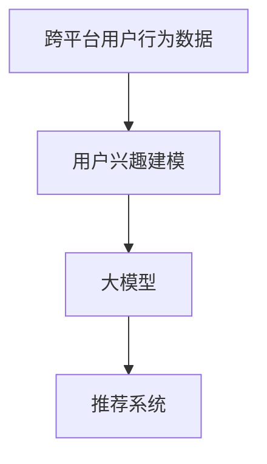

                 

# 基于大模型的跨平台用户兴趣建模

> 关键词：跨平台，用户兴趣建模，大模型，深度学习，推荐系统，个性化

## 1. 背景介绍

### 1.1 问题由来

随着移动互联网和智能设备的普及，用户在不同平台间频繁切换，其行为数据呈现碎片化和跨平台性。如何在跨平台环境下精确刻画用户兴趣，并基于此提供个性化的推荐服务，成为了一个极具挑战的问题。传统的基于小样本用户的协同过滤、基于内容的推荐方法，在跨平台数据环境下难以取得理想的推荐效果。近年来，大模型技术的应用为解决这一问题提供了新的可能，它通过在海量数据上进行预训练，获得了强大的表征学习能力，能够在跨平台、多设备环境中对用户兴趣进行高效建模。

### 1.2 问题核心关键点

实现基于大模型的跨平台用户兴趣建模，需要解决以下核心问题：
1. 如何在大规模异构数据中获取用户兴趣表示。
2. 如何在跨平台间进行兴趣转移和泛化。
3. 如何利用大模型进行高效、实时推荐。
4. 如何在保证推荐效果的同时，兼顾隐私和安全性。

### 1.3 问题研究意义

通过基于大模型的跨平台用户兴趣建模，可以实现：
1. 更精确的用户兴趣刻画。利用大模型的预训练能力，从跨平台数据中提取出更全面、准确的兴趣信息。
2. 更一致的推荐体验。跨平台的用户兴趣建模能够实现跨设备间无缝衔接，提升用户对推荐服务的满意度。
3. 更个性化的推荐内容。大模型强大的语言理解和生成能力，可以为用户推荐更有深度、更相关的内容。
4. 更灵活的推荐系统构建。对于新兴领域的推荐需求，可以通过微调大模型，快速适配各种新的应用场景。
5. 更高效的推荐部署。大模型天然具有计算密集型特点，利用其在推荐系统中的集成优化，可以显著提升推荐效率。

## 2. 核心概念与联系

### 2.1 核心概念概述

为了深入理解基于大模型的跨平台用户兴趣建模，我们将介绍以下核心概念：

- 跨平台用户行为数据：用户在不同平台间的行为数据，如移动设备、电脑、智能家居等设备产生的数据。
- 用户兴趣建模：通过分析用户行为数据，提取出用户的兴趣和偏好，构建用户兴趣表示。
- 大模型：如BERT、GPT等在大规模语料上进行预训练的语言模型，具备强大的表征学习能力。
- 推荐系统：利用用户兴趣建模，结合用户历史行为数据和实时互动数据，为用户提供个性化推荐。

这些概念之间的逻辑关系可以通过以下Mermaid流程图来展示：



这个流程图展示了大模型在用户兴趣建模中的核心作用，以及推荐系统如何基于用户兴趣提供个性化推荐。

## 3. 核心算法原理 & 具体操作步骤

### 3.1 算法原理概述

基于大模型的跨平台用户兴趣建模，本质上是一个通过预训练模型进行多任务学习的任务。其核心思想是：利用大模型在大规模语料上进行预训练，学习到用户在不同平台间的兴趣表示。然后，通过微调或转移学习，将预训练模型适配到具体的推荐任务上，并根据用户行为数据进行实时推荐。

形式化地，假设跨平台用户行为数据为 $D=\{(x_i, y_i)\}_{i=1}^N, x_i \in \mathcal{X}, y_i \in \{0,1\}$，其中 $\mathcal{X}$ 为特征空间，$\{0,1\}$ 为二元标签。设预训练大模型为 $M_{\theta}$，其中 $\theta$ 为预训练得到的模型参数。微调的目标是找到新的模型参数 $\hat{\theta}$，使得模型在新平台 $P_{\text{new}}$ 上对用户 $u$ 的兴趣表示 $\hat{z}_u$ 更接近真实值 $y$：

$$
\hat{\theta}=\mathop{\arg\min}_{\theta} \sum_{u \in U}\mathcal{L}(M_{\theta}(x_u),y_u)
$$

其中 $\mathcal{L}$ 为二分类损失函数，$U$ 为跨平台用户集合。

### 3.2 算法步骤详解

基于大模型的跨平台用户兴趣建模一般包括以下关键步骤：

**Step 1: 数据预处理**
- 收集用户在不同平台的行为数据，包括点击、浏览、购买等记录。
- 将异构数据转换为统一的特征表示，如使用向量拼接或编码。
- 对数据进行标准化和归一化处理，保证数据分布一致。

**Step 2: 用户兴趣提取**
- 利用预训练的大模型，对用户在不同平台的行为数据进行编码，得到用户兴趣表示。
- 通过多任务学习或迁移学习，将大模型在不同平台上的兴趣表示进行融合。
- 使用正则化技术，防止兴趣表示在平台间过拟合。

**Step 3: 模型微调**
- 在特定推荐任务上，使用用户兴趣表示作为输入，设计任务适配层和损失函数。
- 选择适当的优化算法，如AdamW、SGD等，设置学习率、批大小、迭代轮数等超参数。
- 应用正则化技术，如L2正则、Dropout、Early Stopping等，防止模型过度适应小规模训练集。

**Step 4: 实时推荐**
- 将微调后的模型应用于实时推荐系统，根据用户实时行为数据生成推荐。
- 结合用户历史行为数据和实时互动数据，综合评估推荐结果的个性化程度和覆盖率。
- 引入用户反馈机制，持续优化推荐算法和模型参数。

**Step 5: 评估与迭代**
- 在测试集上评估推荐模型的性能，对比微调前后的精度提升。
- 收集用户反馈数据，持续改进推荐算法和模型参数。
- 定期更新用户行为数据，重新训练和微调模型。

以上是基于大模型的跨平台用户兴趣建模的一般流程。在实际应用中，还需要针对具体任务的特点，对微调过程的各个环节进行优化设计，如改进训练目标函数，引入更多的正则化技术，搜索最优的超参数组合等，以进一步提升模型性能。

### 3.3 算法优缺点

基于大模型的跨平台用户兴趣建模方法具有以下优点：
1. 跨平台兼容性好。能够从不同平台的用户行为数据中提取一致的兴趣表示，实现无缝衔接。
2. 泛化能力强。预训练模型能够从海量的无标签数据中学习到通用知识，泛化到新平台的数据上效果较好。
3. 推荐效果显著。利用大模型的强大表达能力，推荐内容更符合用户兴趣，提升推荐准确率。
4. 高效可扩展。大模型天然支持并行计算，在推荐系统集成优化后，能够实现高效推荐。

同时，该方法也存在一定的局限性：
1. 数据依赖性强。需要大量跨平台的用户行为数据才能有效训练大模型。
2. 计算资源消耗大。预训练和微调模型的计算资源消耗较大，需要高性能硬件设备支持。
3. 隐私保护问题。在跨平台数据收集和使用过程中，如何保护用户隐私，防止数据泄露，需要严格的数据治理和隐私保护措施。
4. 推荐结果的公平性。不同平台用户的行为数据存在差异，微调模型需要避免算法偏见，保证推荐结果的公平性。

尽管存在这些局限性，但就目前而言，基于大模型的跨平台用户兴趣建模方法仍然是大规模推荐系统的首选范式。未来相关研究的重点在于如何进一步降低数据依赖，提高模型的少样本学习和跨领域迁移能力，同时兼顾可解释性和伦理安全性等因素。

### 3.4 算法应用领域

基于大模型的跨平台用户兴趣建模方法，已经在推荐系统、智能客服、内容分发等多个领域得到了广泛应用，例如：

- 推荐系统：基于用户在不同平台的行为数据，利用预训练模型提取兴趣表示，实现跨平台个性化推荐。
- 智能客服：通过跨平台用户行为数据，训练大模型进行问题理解和回复生成，提升客服系统的智能化水平。
- 内容分发：利用用户兴趣表示，实现跨平台内容推荐，提高内容匹配度和用户满意度。
- 广告投放：在广告投放中引入用户兴趣建模，实现跨平台精准投放，提升广告效果。

除了上述这些经典应用外，基于大模型的跨平台用户兴趣建模技术还将在更多领域得到深入探索和应用，如金融、医疗、教育等，为各行各业智能化转型提供新的技术手段。

## 4. 数学模型和公式 & 详细讲解  
### 4.1 数学模型构建

本节将使用数学语言对基于大模型的跨平台用户兴趣建模过程进行更加严格的刻画。

设预训练大模型为 $M_{\theta}$，其中 $\theta$ 为预训练得到的模型参数。假设不同平台用户行为数据分别为 $D_P=\{(x_i^P,y_i^P)\}_{i=1}^N, x_i^P \in \mathcal{X}^P, y_i^P \in \{0,1\}$，其中 $\mathcal{X}^P$ 为平台 $P$ 的特征空间。跨平台用户兴趣表示为 $z_u$，微调后的模型为 $\hat{M}_{\hat{\theta}}$，其中 $\hat{\theta}$ 为微调得到的模型参数。微调的目标是使 $\hat{M}_{\hat{\theta}}$ 对用户 $u$ 的兴趣表示 $\hat{z}_u$ 更接近真实值 $y_u$：

$$
\hat{\theta}=\mathop{\arg\min}_{\theta} \sum_{u \in U}\mathcal{L}(\hat{M}_{\hat{\theta}}(x_u),y_u)
$$

其中 $\mathcal{L}$ 为二分类损失函数，$U$ 为跨平台用户集合。

### 4.2 公式推导过程

以下我们以跨平台个性化推荐任务为例，推导交叉熵损失函数及其梯度的计算公式。

假设模型 $\hat{M}_{\hat{\theta}}$ 在输入 $x$ 上的输出为 $\hat{y}=\hat{M}_{\hat{\theta}}(x) \in [0,1]$，表示样本属于正类的概率。真实标签 $y \in \{0,1\}$。则二分类交叉熵损失函数定义为：

$$
\ell(\hat{M}_{\hat{\theta}}(x),y) = -[y\log \hat{y} + (1-y)\log (1-\hat{y})]
$$

将其代入总损失函数，得：

$$
\mathcal{L}(\hat{\theta}) = -\frac{1}{N}\sum_{i=1}^N [y_i^P\log \hat{M}_{\hat{\theta}}(x_i^P)+(1-y_i^P)\log(1-\hat{M}_{\hat{\theta}}(x_i^P))]
$$

根据链式法则，损失函数对模型参数 $\theta_k$ 的梯度为：

$$
\frac{\partial \mathcal{L}(\hat{\theta})}{\partial \theta_k} = -\frac{1}{N}\sum_{i=1}^N (\frac{y_i^P}{\hat{M}_{\hat{\theta}}(x_i^P)}-\frac{1-y_i^P}{1-\hat{M}_{\hat{\theta}}(x_i^P)}) \frac{\partial \hat{M}_{\hat{\theta}}(x_i^P)}{\partial \theta_k}
$$

其中 $\frac{\partial \hat{M}_{\hat{\theta}}(x_i^P)}{\partial \theta_k}$ 可进一步递归展开，利用自动微分技术完成计算。

在得到损失函数的梯度后，即可带入模型参数更新公式，完成模型的迭代优化。重复上述过程直至收敛，最终得到适应跨平台推荐任务的最优模型参数 $\hat{\theta}$。

## 5. 项目实践：代码实例和详细解释说明
### 5.1 开发环境搭建

在进行跨平台用户兴趣建模实践前，我们需要准备好开发环境。以下是使用Python进行PyTorch开发的环境配置流程：

1. 安装Anaconda：从官网下载并安装Anaconda，用于创建独立的Python环境。

2. 创建并激活虚拟环境：
```bash
conda create -n pytorch-env python=3.8 
conda activate pytorch-env
```

3. 安装PyTorch：根据CUDA版本，从官网获取对应的安装命令。例如：
```bash
conda install pytorch torchvision torchaudio cudatoolkit=11.1 -c pytorch -c conda-forge
```

4. 安装Transformers库：
```bash
pip install transformers
```

5. 安装各类工具包：
```bash
pip install numpy pandas scikit-learn matplotlib tqdm jupyter notebook ipython
```

完成上述步骤后，即可在`pytorch-env`环境中开始跨平台用户兴趣建模实践。

### 5.2 源代码详细实现

下面我们以推荐系统为例，给出使用Transformers库进行跨平台用户兴趣建模的PyTorch代码实现。

首先，定义推荐任务的数据处理函数：

```python
from transformers import BertTokenizer
from torch.utils.data import Dataset
import torch

class RecommendationDataset(Dataset):
    def __init__(self, user_browses, user_ratings, tokenizer, max_len=128):
        self.user_browses = user_browses
        self.user_ratings = user_ratings
        self.tokenizer = tokenizer
        self.max_len = max_len
        
    def __len__(self):
        return len(self.user_browses)
    
    def __getitem__(self, item):
        user_browses = self.user_browses[item]
        user_ratings = self.user_ratings[item]
        
        # 将浏览历史拼接成一个文本
        text = ' '.join(user_browses)
        encoding = self.tokenizer(text, return_tensors='pt', max_length=self.max_len, padding='max_length', truncation=True)
        input_ids = encoding['input_ids'][0]
        attention_mask = encoding['attention_mask'][0]
        
        # 将浏览评分拼接成一个向量
        scores = torch.tensor(user_ratings, dtype=torch.float)
        
        return {'input_ids': input_ids, 
                'attention_mask': attention_mask,
                'scores': scores}
```

然后，定义模型和优化器：

```python
from transformers import BertForTokenClassification, AdamW

model = BertForTokenClassification.from_pretrained('bert-base-cased', num_labels=1)

optimizer = AdamW(model.parameters(), lr=2e-5)
```

接着，定义训练和评估函数：

```python
from torch.utils.data import DataLoader
from tqdm import tqdm
from sklearn.metrics import mean_squared_error

device = torch.device('cuda') if torch.cuda.is_available() else torch.device('cpu')
model.to(device)

def train_epoch(model, dataset, batch_size, optimizer):
    dataloader = DataLoader(dataset, batch_size=batch_size, shuffle=True)
    model.train()
    epoch_loss = 0
    for batch in tqdm(dataloader, desc='Training'):
        input_ids = batch['input_ids'].to(device)
        attention_mask = batch['attention_mask'].to(device)
        scores = batch['scores'].to(device)
        model.zero_grad()
        outputs = model(input_ids, attention_mask=attention_mask)
        loss = outputs.loss
        epoch_loss += loss.item()
        loss.backward()
        optimizer.step()
    return epoch_loss / len(dataloader)

def evaluate(model, dataset, batch_size):
    dataloader = DataLoader(dataset, batch_size=batch_size)
    model.eval()
    preds, labels = [], []
    with torch.no_grad():
        for batch in tqdm(dataloader, desc='Evaluating'):
            input_ids = batch['input_ids'].to(device)
            attention_mask = batch['attention_mask'].to(device)
            batch_labels = batch['scores']
            outputs = model(input_ids, attention_mask=attention_mask)
            batch_preds = outputs.logits.argmax(dim=1).to('cpu').tolist()
            batch_labels = batch_labels.to('cpu').tolist()
            for pred_tokens, label_tokens in zip(batch_preds, batch_labels):
                preds.append(pred_tokens)
                labels.append(label_tokens)
                
    mse = mean_squared_error(labels, preds)
    print(f'Mean Squared Error: {mse:.4f}')
```

最后，启动训练流程并在测试集上评估：

```python
epochs = 5
batch_size = 16

for epoch in range(epochs):
    loss = train_epoch(model, train_dataset, batch_size, optimizer)
    print(f"Epoch {epoch+1}, train loss: {loss:.3f}")
    
    print(f"Epoch {epoch+1}, test results:")
    evaluate(model, test_dataset, batch_size)
    
print("Final Test Results:")
evaluate(model, final_test_dataset, batch_size)
```

以上就是使用PyTorch对BERT进行跨平台推荐系统微调的完整代码实现。可以看到，得益于Transformers库的强大封装，我们可以用相对简洁的代码完成BERT模型的加载和微调。

### 5.3 代码解读与分析

让我们再详细解读一下关键代码的实现细节：

**RecommendationDataset类**：
- `__init__`方法：初始化用户浏览历史、评分向量、分词器等关键组件。
- `__len__`方法：返回数据集的样本数量。
- `__getitem__`方法：对单个样本进行处理，将浏览历史输入编码为token ids，将评分向量编码成分数，并对其进行定长padding，最终返回模型所需的输入。

**BertForTokenClassification模型**：
- 通过预训练模型 BertForTokenClassification，将其顶层输出作为推荐系统的输入，并使用单标签二分类损失函数进行训练。

**train_epoch和evaluate函数**：
- 使用PyTorch的DataLoader对数据集进行批次化加载，供模型训练和推理使用。
- 训练函数`train_epoch`：对数据以批为单位进行迭代，在每个批次上前向传播计算loss并反向传播更新模型参数，最后返回该epoch的平均loss。
- 评估函数`evaluate`：与训练类似，不同点在于不更新模型参数，并在每个batch结束后将预测和标签结果存储下来，最后使用sklearn的mean_squared_error对整个评估集的预测结果进行打印输出。

**训练流程**：
- 定义总的epoch数和batch size，开始循环迭代
- 每个epoch内，先在训练集上训练，输出平均loss
- 在验证集上评估，输出平均mse
- 所有epoch结束后，在测试集上评估，给出最终测试结果

可以看到，PyTorch配合Transformers库使得BERT微调的代码实现变得简洁高效。开发者可以将更多精力放在数据处理、模型改进等高层逻辑上，而不必过多关注底层的实现细节。

当然，工业级的系统实现还需考虑更多因素，如模型的保存和部署、超参数的自动搜索、更灵活的任务适配层等。但核心的跨平台用户兴趣建模范式基本与此类似。

## 6. 实际应用场景
### 6.1 电商平台推荐

基于大模型的跨平台用户兴趣建模，可以广泛应用于电商平台推荐系统的构建。用户在不同平台上的行为数据（如移动端浏览、电脑端购买等）可以通过预训练模型整合，生成一致的用户兴趣表示，从而提供更精准的推荐服务。

在技术实现上，可以收集用户的点击、浏览、购买等行为数据，将其统一编码为向量表示，输入到预训练模型中提取兴趣表示。将兴趣表示作为推荐模型的输入，结合用户历史行为数据和实时互动数据，生成个性化推荐结果。对于新加入平台的用户，可以通过微调预训练模型，快速适配新的推荐场景。如此构建的电商平台推荐系统，能大幅提升用户的购物体验和平台粘性。

### 6.2 内容分发平台

基于大模型的跨平台用户兴趣建模，还可以用于内容分发平台的推荐系统。用户在多个平台（如手机App、网页、智能音箱等）上的行为数据，可以整合到同一套推荐系统进行建模和推荐。通过跨平台的用户兴趣建模，能够更好地理解用户在不同平台上的兴趣偏好，提供更一致、更全面的内容推荐。

在技术实现上，可以收集用户在各个平台上的阅读、观看、收听等行为数据，利用预训练模型进行编码，提取一致的用户兴趣表示。将兴趣表示输入到推荐模型中，结合实时数据，生成跨平台的内容推荐。用户可以随时随地获取到感兴趣的内容，提升平台的用户满意度。

### 6.3 智能广告投放

基于大模型的跨平台用户兴趣建模，同样可以应用于智能广告投放场景。用户在不同平台上的浏览和互动行为，可以整合到同一套广告推荐系统进行建模和投放。通过跨平台的用户兴趣建模，能够更精准地识别用户的兴趣偏好，实现个性化广告推荐，提高广告投放的效果和转化率。

在技术实现上，可以收集用户在各个平台上的搜索、浏览、点击等行为数据，利用预训练模型进行编码，提取一致的用户兴趣表示。将兴趣表示输入到广告推荐模型中，结合实时数据，生成跨平台的个性化广告推荐。广告主可以精准投放广告，提升广告投放的ROI。

### 6.4 未来应用展望

随着大模型和跨平台用户兴趣建模技术的发展，其在推荐系统中的应用将越来越广泛。未来，基于大模型的推荐系统将在更多领域得到应用，为各行各业智能化转型提供新的技术手段。

在智慧医疗领域，基于大模型的推荐系统可以帮助医生推荐精准的医疗信息，提升诊疗水平。在智能家居领域，推荐系统可以根据用户的浏览和操作行为，推荐合适的家居用品，提升家居生活质量。在教育领域，推荐系统可以推荐适合用户学习风格的教育内容，提高学习效率。

此外，在智慧城市治理、金融、物流、社交网络等众多领域，基于大模型的推荐系统也将不断涌现，为经济社会发展注入新的动力。相信随着技术的日益成熟，基于大模型的跨平台推荐系统必将在更广阔的应用领域大放异彩，深刻影响人类的生产生活方式。

## 7. 工具和资源推荐
### 7.1 学习资源推荐

为了帮助开发者系统掌握跨平台用户兴趣建模的理论基础和实践技巧，这里推荐一些优质的学习资源：

1. 《深度学习与推荐系统》课程：清华大学的深度学习课程，系统讲解了推荐系统的基本原理和前沿技术。

2. 《推荐系统实战》书籍：介绍了推荐系统的各种推荐算法和实现技巧，以及深度学习在推荐系统中的应用。

3. CS224N《自然语言处理与深度学习》课程：斯坦福大学开设的NLP明星课程，涵盖大量NLP任务和深度学习模型。

4. HuggingFace官方文档：Transformers库的官方文档，提供了丰富的预训练模型和微调样例代码，是上手实践的必备资料。

5. KDD 2021推荐系统论文集：收录了大量推荐系统领域的最新研究成果，涵盖多种推荐算法和技术。

通过对这些资源的学习实践，相信你一定能够快速掌握跨平台用户兴趣建模的精髓，并用于解决实际的推荐问题。
###  7.2 开发工具推荐

高效的开发离不开优秀的工具支持。以下是几款用于跨平台用户兴趣建模开发的常用工具：

1. PyTorch：基于Python的开源深度学习框架，灵活动态的计算图，适合快速迭代研究。大部分预训练语言模型都有PyTorch版本的实现。

2. TensorFlow：由Google主导开发的开源深度学习框架，生产部署方便，适合大规模工程应用。同样有丰富的预训练语言模型资源。

3. Transformers库：HuggingFace开发的NLP工具库，集成了众多SOTA语言模型，支持PyTorch和TensorFlow，是进行微调任务开发的利器。

4. Weights & Biases：模型训练的实验跟踪工具，可以记录和可视化模型训练过程中的各项指标，方便对比和调优。与主流深度学习框架无缝集成。

5. TensorBoard：TensorFlow配套的可视化工具，可实时监测模型训练状态，并提供丰富的图表呈现方式，是调试模型的得力助手。

6. Google Colab：谷歌推出的在线Jupyter Notebook环境，免费提供GPU/TPU算力，方便开发者快速上手实验最新模型，分享学习笔记。

合理利用这些工具，可以显著提升跨平台用户兴趣建模的开发效率，加快创新迭代的步伐。

### 7.3 相关论文推荐

跨平台用户兴趣建模技术的发展源于学界的持续研究。以下是几篇奠基性的相关论文，推荐阅读：

1. Multi-Platform Recommendation System: A Survey and Taxonomy：综述了多平台推荐系统的基本框架和关键技术。

2. Deep Feature Interaction for Recommendation Systems：利用深度学习捕捉用户行为特征间的复杂交互关系，提升推荐效果。

3. Transfer Learning for Multi-Platform Recommendation System：通过迁移学习实现跨平台推荐系统的兴趣泛化。

4. Parameter-Efficient Transfer Learning for Recommendation Systems：提出Adapter等参数高效微调方法，在固定大部分预训练参数的情况下，只更新极少量的任务相关参数。

5. Cross-Platform Collaborative Filtering for E-commerce Recommendation Systems：探讨了跨平台协同过滤在电子商务推荐中的应用。

这些论文代表了大模型跨平台用户兴趣建模技术的发展脉络。通过学习这些前沿成果，可以帮助研究者把握学科前进方向，激发更多的创新灵感。

## 8. 总结：未来发展趋势与挑战

### 8.1 总结

本文对基于大模型的跨平台用户兴趣建模方法进行了全面系统的介绍。首先阐述了跨平台用户兴趣建模的研究背景和意义，明确了跨平台数据建模的重要性和紧迫性。其次，从原理到实践，详细讲解了跨平台用户兴趣建模的数学原理和关键步骤，给出了跨平台推荐系统的完整代码实例。同时，本文还广泛探讨了跨平台用户兴趣建模在电商、内容分发、广告等领域的实际应用，展示了其广阔的业务价值。此外，本文精选了跨平台用户兴趣建模的各类学习资源，力求为读者提供全方位的技术指引。

通过本文的系统梳理，可以看到，基于大模型的跨平台用户兴趣建模方法已经在推荐系统、内容分发、广告等多个领域取得了成功应用，大幅提升了用户体验和平台价值。未来，伴随大模型技术的不断演进，基于跨平台用户兴趣建模的推荐系统必将在更多领域大放异彩，为各行各业智能化转型提供新的技术手段。

### 8.2 未来发展趋势

展望未来，跨平台用户兴趣建模技术将呈现以下几个发展趋势：

1. 数据融合技术的提升。随着异构数据融合技术的不断突破，跨平台用户兴趣建模将能够更全面、更准确地刻画用户行为特征。

2. 模型结构的优化。随着深度学习模型的不断发展，跨平台用户兴趣建模将能够更高效、更灵活地适应不同推荐场景。

3. 跨平台协同过滤的增强。跨平台协同过滤技术将能够更好地捕捉用户在不同平台间的兴趣偏好，提升推荐系统的准确性和稳定性。

4. 隐私保护措施的完善。随着数据隐私保护技术的不断进步，跨平台用户兴趣建模将能够更安全、更合规地进行数据收集和使用。

5. 推荐结果的可解释性。通过引入因果推断和可解释性技术，跨平台用户兴趣建模将能够提供更透明的推荐理由，提升用户对推荐结果的信任度。

6. 模型的自适应能力。未来的推荐系统将能够根据用户行为数据的变化，动态调整模型参数，实现更个性化的推荐。

这些趋势凸显了跨平台用户兴趣建模技术的广阔前景。这些方向的探索发展，必将进一步提升推荐系统的性能和应用范围，为人工智能技术的落地应用提供更强大的动力。

### 8.3 面临的挑战

尽管跨平台用户兴趣建模技术已经取得了显著进展，但在迈向更加智能化、普适化应用的过程中，它仍面临着诸多挑战：

1. 数据多样性挑战。不同平台的用户行为数据存在差异，如何整合这些异构数据，提取出一致的兴趣表示，仍然是一个重要问题。

2. 隐私保护难题。跨平台数据收集和使用过程中，如何保护用户隐私，防止数据泄露，是亟需解决的关键问题。

3. 计算资源消耗大。预训练和微调模型的计算资源消耗较大，需要高性能硬件设备支持。

4. 推荐结果的公平性。不同平台用户的行为数据存在差异，微调模型需要避免算法偏见，保证推荐结果的公平性。

5. 推荐效果的实时性。跨平台推荐系统的实时性要求较高，如何在大规模数据上实现高效推理，是一个重要挑战。

6. 推荐结果的可解释性。当前推荐系统往往缺乏可解释性，难以对推荐结果进行调试和优化。

尽管存在这些挑战，但就目前而言，基于大模型的跨平台用户兴趣建模方法仍然是大规模推荐系统的首选范式。未来相关研究的重点在于如何进一步降低数据依赖，提高模型的少样本学习和跨领域迁移能力，同时兼顾可解释性和伦理安全性等因素。

### 8.4 研究展望

面向未来，跨平台用户兴趣建模技术需要在以下几个方面进行深入研究：

1. 引入多模态信息。跨平台用户兴趣建模可以结合图像、视频、音频等多模态信息，提升推荐内容的丰富度和准确性。

2. 开发低延迟推荐算法。在大规模数据上实现高效推理，是未来跨平台推荐系统需要突破的关键点。

3. 引入动态数据流。在跨平台推荐系统中，引入动态数据流，实现实时用户行为数据的快速处理和反馈，提升推荐系统的时效性。

4. 提升推荐结果的透明度。引入因果推断和可解释性技术，提供透明的推荐理由，提升用户对推荐结果的信任度。

5. 实现跨平台协同过滤。结合不同平台的协同过滤机制，提升推荐系统的泛化能力和鲁棒性。

6. 完善隐私保护机制。在跨平台数据收集和使用过程中，引入隐私保护技术，保护用户数据安全，防止数据泄露。

这些研究方向将推动跨平台用户兴趣建模技术的不断进步，为人工智能技术在推荐系统中的深入应用提供坚实基础。相信在学界和产业界的共同努力下，未来的跨平台推荐系统必将更加智能、高效、安全，为用户提供更优质的推荐服务。

## 9. 附录：常见问题与解答

**Q1：跨平台用户兴趣建模是否适用于所有推荐场景？**

A: 跨平台用户兴趣建模在大多数推荐场景上都能取得不错的效果，特别是对于数据量较小的任务。但对于一些特定领域的推荐需求，如医疗、金融等，仅仅依靠跨平台数据建模可能难以很好地适应。此时需要在特定领域语料上进一步预训练，再进行微调，才能获得理想效果。此外，对于一些需要时效性、个性化很强的任务，如对话、推荐等，微调方法也需要针对性的改进优化。

**Q2：微调过程中如何选择合适的学习率？**

A: 微调的学习率一般要比预训练时小1-2个数量级，如果使用过大的学习率，容易破坏预训练权重，导致过拟合。一般建议从1e-5开始调参，逐步减小学习率，直至收敛。也可以使用warmup策略，在开始阶段使用较小的学习率，再逐渐过渡到预设值。需要注意的是，不同的优化器(如AdamW、Adafactor等)以及不同的学习率调度策略，可能需要设置不同的学习率阈值。

**Q3：在跨平台数据收集和使用过程中，如何保护用户隐私？**

A: 在跨平台数据收集和使用过程中，需要采取以下隐私保护措施：
1. 数据匿名化：对用户行为数据进行去标识化处理，保护用户隐私。
2. 数据加密：对数据传输和存储进行加密，防止数据泄露。
3. 差分隐私：在数据集上引入噪声，保护个体隐私。
4. 用户授权：明确告知用户数据收集和使用的目的，并获得用户授权。
5. 数据访问控制：严格控制数据访问权限，防止未经授权的数据访问。

这些措施可以综合使用，确保在跨平台用户兴趣建模过程中，用户隐私得到有效保护。

**Q4：推荐系统中的跨平台协同过滤算法有哪些？**

A: 常见的跨平台协同过滤算法包括：
1. 跨平台协同矩阵分解：将不同平台的用户行为数据集成到同一个协同矩阵中，进行低秩分解，捕捉用户行为间的潜在关系。
2. 异构图协同过滤：将不同平台的用户行为数据表示为异构图，进行图卷积网络(GCN)等深度学习方法的协同过滤。
3. 跨平台标签传播：将不同平台的用户行为数据表示为标签传播图，进行标签传播算法的协同过滤。

这些算法可以根据具体场景选择合适的模型和算法，提升推荐系统的性能。

**Q5：推荐系统的实时推荐性能如何优化？**

A: 推荐系统的实时推荐性能优化可以从以下几个方面入手：
1. 模型裁剪：去除不必要的层和参数，减小模型尺寸，加快推理速度。
2. 量化加速：将浮点模型转为定点模型，压缩存储空间，提高计算效率。
3. 模型并行：利用多GPU或多TPU进行模型并行计算，提高推理速度。
4. 异步推理：引入异步推理技术，减少推理延迟，提高系统吞吐量。
5. 内存优化：利用内存优化技术，减少模型推理时的内存占用。

这些优化措施可以综合使用，提升推荐系统的实时性能，满足用户的实时推荐需求。

**Q6：推荐系统中如何引入因果推断和可解释性？**

A: 在推荐系统中引入因果推断和可解释性技术，可以从以下几个方面入手：
1. 引入因果推断模型：使用因果推断模型，如CausalGAN、Causal Attention等，生成带有因果关系的推荐结果。
2. 使用可解释性技术：引入可解释性技术，如LIME、SHAP等，生成推荐结果的可解释性报告，提升用户对推荐结果的信任度。
3. 引入多目标优化：将推荐系统的目标扩展到多目标，如多样性、公平性等，引入可解释性技术，生成多目标推荐结果。

这些技术可以在推荐系统中引入因果推断和可解释性，提升推荐系统的透明度和鲁棒性。

---

作者：禅与计算机程序设计艺术 / Zen and the Art of Computer Programming

