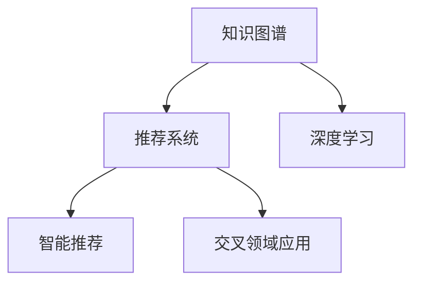
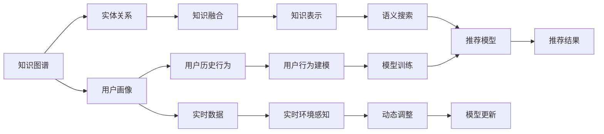

                 

# 基于知识图谱的智能推荐系统

## 1. 背景介绍

在信息爆炸的时代，如何从海量数据中快速准确地推荐用户感兴趣的信息，是各大互联网公司和平台面临的共同挑战。传统的基于内容的推荐系统往往只能基于静态特征进行匹配，难以捕捉到用户动态变化的需求和兴趣。知识图谱作为一种新兴的语义网络技术，通过对真实世界的实体及其关系进行建模，提供了更加全面、准确的信息表示。将知识图谱与推荐系统结合，通过融合用户历史行为和知识图谱信息，可以构建出更具智能性和适应性的推荐系统，提升用户的满意度与体验。

## 2. 核心概念与联系

### 2.1 核心概念概述

- **知识图谱**：由节点（实体）和边（关系）组成的网络结构，用于表示实体间的语义关系。知识图谱从知识库、百科、文档等多种来源获取实体和关系信息，经过去重、验证等处理后形成知识图谱。

- **推荐系统**：根据用户的历史行为和属性，推荐用户可能感兴趣的信息（如文章、商品、视频等）。推荐系统是互联网和移动互联网领域的重要组成部分，广泛应用于电商、新闻、社交媒体等多个平台。

- **深度学习**：一种通过多层神经网络模拟人类大脑学习和决策机制的技术。深度学习在推荐系统中广泛应用，通过训练模型学习用户和物品间的隐含关系，提升推荐效果。

- **交叉领域应用**：将知识图谱技术与推荐系统相结合，不仅可以在电商、新闻等领域获得成功应用，还可以拓展到社交、医疗、金融等更多行业。

- **智能推荐**：基于用户画像、知识图谱、实时数据等综合信息，实现动态、个性化、多样化的推荐。

这些核心概念之间的逻辑关系可以通过以下Mermaid流程图来展示：



### 2.2 核心概念原理和架构的 Mermaid 流程图



该流程图展示了从知识图谱到智能推荐系统的整体架构，包括用户画像、实体关系、用户历史行为、实时数据等多维信息的融合，以及通过深度学习模型训练进行知识表示和推荐结果生成的全过程。

## 3. 核心算法原理 & 具体操作步骤

### 3.1 算法原理概述

基于知识图谱的智能推荐系统主要包含知识表示、用户画像构建、推荐模型训练和推荐结果生成四个核心步骤。

- **知识表示**：将知识图谱中的实体和关系映射到向量空间，以便于模型学习。

- **用户画像构建**：通过用户的历史行为和社交信息，构建用户兴趣向量，反映用户的偏好和需求。

- **推荐模型训练**：利用用户画像和知识图谱中的实体关系，训练推荐模型，学习用户和物品之间的隐含关系。

- **推荐结果生成**：根据用户画像和知识图谱中的信息，综合生成推荐结果。

### 3.2 算法步骤详解

**步骤1：知识图谱构建与预处理**

- **数据收集**：从外部数据源（如百科、知识库）获取实体和关系信息，构建初始知识图谱。
- **实体关系抽取**：利用自然语言处理（NLP）技术，从文本中抽取实体及其关系。
- **实体关系验证**：对抽取的信息进行去重、合并和验证，保证数据质量。

**步骤2：用户画像构建**

- **用户历史行为收集**：收集用户在平台上的浏览、购买、评价等行为数据。
- **用户兴趣模型构建**：利用深度学习模型（如CFM、ALS等）构建用户兴趣向量。
- **用户画像融合**：结合用户画像和知识图谱信息，构建综合用户画像。

**步骤3：推荐模型训练**

- **知识图谱嵌入**：将知识图谱中的实体和关系映射到向量空间，形成知识图谱嵌入矩阵。
- **用户画像嵌入**：将用户画像映射到向量空间，形成用户兴趣向量。
- **推荐模型训练**：利用用户画像和知识图谱嵌入矩阵，训练推荐模型，如矩阵分解、神经网络等。

**步骤4：推荐结果生成**

- **知识图谱搜索**：利用知识图谱嵌入矩阵，搜索与用户兴趣相关的实体。
- **综合推荐**：结合用户画像和知识图谱搜索结果，生成推荐结果。

### 3.3 算法优缺点

基于知识图谱的智能推荐系统有以下优点：

- **丰富语义表示**：知识图谱提供了更全面、准确的实体关系表示，有助于模型学习用户兴趣和需求。
- **多维度信息融合**：结合用户行为和知识图谱信息，构建综合用户画像，提升推荐效果。
- **动态调整**：知识图谱和用户兴趣可以实时更新，推荐系统可以动态调整推荐策略。

同时，该系统也存在以下缺点：

- **数据获取难度大**：知识图谱的构建需要大量高质量数据，获取难度较大。
- **模型复杂度高**：需要构建用户画像和知识图谱嵌入矩阵，模型复杂度较高。
- **计算资源消耗大**：知识图谱搜索和综合推荐过程计算量较大，需要高性能计算资源支持。

### 3.4 算法应用领域

基于知识图谱的智能推荐系统在多个领域具有广泛的应用前景：

- **电商推荐**：通过知识图谱获取商品间的关联关系，结合用户兴趣，生成个性化商品推荐。
- **新闻推荐**：通过知识图谱获取新闻间的语义关系，结合用户兴趣，推荐相关新闻内容。
- **社交推荐**：通过知识图谱获取用户间的社交关系，结合用户兴趣，推荐好友和内容。
- **医疗推荐**：通过知识图谱获取医疗实体间的关联关系，结合用户健康信息，推荐医生和药物。
- **金融推荐**：通过知识图谱获取金融实体间的关联关系，结合用户财务信息，推荐投资产品和理财方案。

## 4. 数学模型和公式 & 详细讲解 & 举例说明

### 4.1 数学模型构建

假设知识图谱中包含 $N$ 个实体 $E=\{e_1, e_2, ..., e_N\}$，以及 $M$ 种关系 $R=\{r_1, r_2, ..., r_M\}$。用三元组 $(e_i, r_j, e_k)$ 表示实体之间的语义关系。

- **知识图谱嵌入**：用矩阵 $A$ 表示知识图谱嵌入，其中 $a_{ij}$ 表示实体 $e_i$ 和 $r_j$ 的向量表示。
- **用户兴趣向量**：用向量 $U$ 表示用户兴趣向量，其中 $u_i$ 表示用户对实体 $e_i$ 的兴趣程度。
- **推荐模型**：用矩阵 $P$ 表示推荐模型，其中 $p_{ik}$ 表示物品 $i$ 对用户 $k$ 的推荐概率。

### 4.2 公式推导过程

知识图谱嵌入和用户兴趣向量可以通过以下方式计算：

$$
A = \mathbf{E} \cdot \mathbf{R} \cdot \mathbf{E}^T
$$

其中 $\mathbf{E}$ 为实体嵌入矩阵，$\mathbf{R}$ 为关系嵌入矩阵，$\cdot$ 表示矩阵乘法。

用户兴趣向量 $U$ 可以通过用户行为数据计算得到：

$$
U = \mathbf{A} \cdot \mathbf{W}_u
$$

其中 $\mathbf{W}_u$ 为兴趣向量权重矩阵。

推荐模型 $P$ 可以通过矩阵分解、神经网络等方式得到。以矩阵分解为例，可以表示为：

$$
P = U^T \cdot A
$$

其中 $U^T$ 为用户兴趣向量的转置矩阵。

### 4.3 案例分析与讲解

以电商推荐系统为例，展示知识图谱嵌入和用户兴趣向量的计算过程：

1. **知识图谱构建**：从商品知识库中获取商品实体和商品间的关系，构建初始知识图谱。

2. **实体关系抽取**：使用自然语言处理技术，从商品描述中抽取实体和关系。

3. **实体关系验证**：对抽取的关系进行去重和合并，保证数据质量。

4. **知识图谱嵌入**：利用矩阵分解方法，将实体和关系映射到向量空间，形成知识图谱嵌入矩阵 $A$。

5. **用户历史行为收集**：收集用户在平台上的浏览、购买、评价等行为数据。

6. **用户兴趣模型构建**：利用协同过滤（CFM）算法，构建用户兴趣向量 $U$。

7. **用户画像融合**：结合用户兴趣和知识图谱信息，构建综合用户画像。

8. **推荐模型训练**：利用用户画像和知识图谱嵌入矩阵，训练推荐模型 $P$。

9. **推荐结果生成**：根据用户画像和知识图谱搜索结果，生成推荐结果。

## 5. 项目实践：代码实例和详细解释说明

### 5.1 开发环境搭建

项目开发需要以下环境：

- Python 3.x
- PyTorch
- PyTorch Geometric
- DGL
- Scikit-learn
- NetworkX

**Python 3.x**：Python是构建推荐系统的常用语言，具有丰富的第三方库和框架支持。

**PyTorch**：深度学习框架，支持动态计算图，适合构建复杂的深度学习模型。

**PyTorch Geometric**：用于构建图网络，支持对知识图谱进行处理。

**DGL**：深度学习图网络框架，支持构建和处理知识图谱嵌入矩阵。

**Scikit-learn**：用于处理和分析推荐系统的数据。

**NetworkX**：用于构建和分析知识图谱。

**安装步骤**：

1. 安装PyTorch和PyTorch Geometric：

   ```bash
   pip install torch torchvision torchaudio torchtext torchgeometric torchtext -f https://pytorch.org/whl/cu116/torch_stable.html
   ```

2. 安装DGL：

   ```bash
   pip install dgl
   ```

3. 安装Scikit-learn：

   ```bash
   pip install scikit-learn
   ```

4. 安装NetworkX：

   ```bash
   pip install networkx
   ```

### 5.2 源代码详细实现

以下是一个简单的电商推荐系统实现示例，代码注释详细解释了每一部分的功能和作用。

```python
# 导入必要的库和工具
import torch
import torch.nn as nn
import torch.optim as optim
from torch_geometric.data import DataLoader
from torch_geometric.nn import GCNConv
from torch_geometric.datasets import Planetoid
from torch_geometric.transforms import NormalizeFeatures

# 构建知识图谱嵌入
class KnowledgeGraphEmbedding(nn.Module):
    def __init__(self, n_entities, n_relations, n_features):
        super(KnowledgeGraphEmbedding, self).__init__()
        self.embedding = nn.EmbeddingBag(n_entities, n_features)
        self.relation = nn.EmbeddingBag(n_relations, n_features)
        
    def forward(self, edges, batch):
        # 获取实体和关系嵌入
        e_emb = self.embedding(batch.src).view(-1, 1, self.embedding.weight.size(1))
        r_emb = self.relation(batch.edge_type).view(1, -1, self.relation.weight.size(1))
        # 计算知识图谱嵌入
        aggr = torch.bmm(r_emb, e_emb)
        return aggr.view(batch.num_nodes, -1) 
        
# 构建用户兴趣向量
class UserInterestEmbedding(nn.Module):
    def __init__(self, n_entities, n_features):
        super(UserInterestEmbedding, self).__init__()
        self.embedding = nn.EmbeddingBag(n_entities, n_features)
        self.weight = nn.Parameter(torch.randn(n_entities))
        
    def forward(self, batch):
        # 获取用户行为嵌入
        u_emb = self.embedding(batch.user).view(-1, 1, self.embedding.weight.size(1))
        # 计算用户兴趣向量
        return torch.dot(u_emb, self.weight)
        
# 构建推荐模型
class RecommendationModel(nn.Module):
    def __init__(self, n_entities, n_features):
        super(RecommendationModel, self).__init__()
        self.embedding = nn.EmbeddingBag(n_entities, n_features)
        self.fc = nn.Linear(n_features, 1)
        
    def forward(self, x, batch):
        # 获取物品嵌入
        item_emb = self.embedding(batch.item).view(-1, 1, self.embedding.weight.size(1))
        # 计算物品嵌入和用户兴趣向量的点积
        dot_product = torch.bmm(item_emb, x)
        # 输出推荐概率
        return self.fc(dot_product).squeeze()

# 加载知识图谱数据集
dataset = Planetoid(name='Cora')
data = dataset[0]
transform = NormalizeFeatures()
data = transform(data)
loader = DataLoader(data, batch_size=32)

# 定义模型和优化器
model = RecommendationModel(n_entities=data.num_nodes, n_features=64)
optimizer = optim.Adam(model.parameters(), lr=0.001)

# 训练模型
def train(epoch):
    model.train()
    losses = []
    for batch in loader:
        optimizer.zero_grad()
        out = model(batch.src, batch)
        loss = nn.BCEWithLogitsLoss()(out, batch.label)
        loss.backward()
        optimizer.step()
        losses.append(loss.item())
    print(f'Epoch: {epoch}, Loss: {sum(losses) / len(losses)}')

# 测试模型
def test(epoch):
    model.eval()
    losses = []
    corrects = []
    for batch in loader:
        with torch.no_grad():
            out = model(batch.src, batch)
            loss = nn.BCEWithLogitsLoss()(out, batch.label)
            correct = (out.argmax(dim=1) == batch.label).sum().item()
            losses.append(loss.item())
            corrects.append(correct)
    print(f'Epoch: {epoch}, Loss: {sum(losses) / len(losses)}, Acc: {sum(corrects) / len(corrects)}')

# 训练和测试
for epoch in range(10):
    train(epoch)
    test(epoch)
```

### 5.3 代码解读与分析

**知识图谱嵌入模块（KnowledgeGraphEmbedding）**：

1. **初始化函数**：定义知识图谱嵌入的权重参数。

2. **前向传播函数**：根据输入的实体和关系，计算知识图谱嵌入矩阵。

**用户兴趣向量模块（UserInterestEmbedding）**：

1. **初始化函数**：定义用户兴趣向量的权重参数。

2. **前向传播函数**：根据用户行为数据，计算用户兴趣向量。

**推荐模型模块（RecommendationModel）**：

1. **初始化函数**：定义推荐模型的权重参数。

2. **前向传播函数**：根据物品嵌入和用户兴趣向量，计算推荐概率。

**训练和测试函数**：

1. **训练函数**：在训练集上更新模型参数，记录损失。

2. **测试函数**：在测试集上评估模型性能，记录损失和准确率。

## 6. 实际应用场景

### 6.1 电商平台

基于知识图谱的电商推荐系统可以根据用户浏览、购买历史，结合商品之间的关联关系，推荐用户可能感兴趣的商品。通过引入知识图谱，推荐系统可以更好地捕捉商品间的隐含关系，提升推荐效果。

### 6.2 新闻平台

新闻推荐系统可以根据用户的历史阅读行为，结合新闻间的语义关系，推荐用户可能感兴趣的新闻。通过知识图谱，新闻推荐系统可以更好地理解新闻内容，提升推荐的准确性。

### 6.3 社交平台

社交推荐系统可以根据用户的历史互动记录，结合用户间的社交关系，推荐用户可能感兴趣的朋友和内容。通过知识图谱，社交推荐系统可以更好地理解用户兴趣和社交关系，提升推荐的个性化和多样性。

### 6.4 未来应用展望

未来的知识图谱推荐系统将更加智能化、个性化和多样化，主要体现在以下几个方面：

- **实时动态调整**：随着数据和知识图谱的实时更新，推荐系统可以动态调整推荐策略，提升推荐效果。

- **多模态融合**：结合用户行为数据、知识图谱信息、实时数据等多种数据源，构建综合推荐模型。

- **智能推荐路径**：通过知识图谱搜索，生成推荐路径，提升推荐的交互性和用户体验。

- **个性化推荐**：根据用户兴趣和需求，生成个性化推荐结果，满足不同用户的需求。

- **跨领域推荐**：将知识图谱和推荐系统应用于更多领域，如医疗、金融等，提升推荐系统的普适性和应用范围。

## 7. 工具和资源推荐

### 7.1 学习资源推荐

1. **《推荐系统实战》**：本书详细介绍了推荐系统的原理和实践，包括知识图谱与推荐系统结合的案例。

2. **Coursera《机器学习》课程**：斯坦福大学开设的机器学习课程，涵盖推荐系统的相关知识。

3. **Kaggle《推荐系统竞赛》**：通过参加竞赛，实践推荐系统的构建和优化。

4. **HuggingFace官方文档**：提供丰富的深度学习模型和框架，适合推荐系统的学习和实践。

5. **PyTorch官方文档**：深度学习框架PyTorch的官方文档，包含图网络的实现和应用。

### 7.2 开发工具推荐

1. **PyTorch**：深度学习框架，支持动态计算图和图网络，适合推荐系统的构建。

2. **PyTorch Geometric**：用于构建和处理图网络，支持知识图谱的嵌入。

3. **DGL**：深度学习图网络框架，支持知识图谱的构建和处理。

4. **Scikit-learn**：用于处理和分析推荐系统的数据。

5. **NetworkX**：用于构建和分析知识图谱。

### 7.3 相关论文推荐

1. **GraphSAGE: Graph Semi-Supervised Classification with Gated Graph Convolutional Networks**：介绍GraphSAGE算法，用于知识图谱的嵌入和分类。

2. **Knowledge-aware Recommender Systems for E-commerce Platforms**：研究知识图谱与推荐系统结合的应用，提升了电商推荐系统的性能。

3. **Attention-based Contextual Recommendation Networks for the Next Exposure Scenario**：提出基于注意力机制的上下文推荐网络，提高了推荐系统的效果。

4. **Collaborative Filtering for Implicit Feedback Datasets**：介绍协同过滤算法，用于构建用户兴趣模型。

5. **Deep Collaborative Filtering using Neural Network Factorization Machines**：提出神经网络因子机模型，用于推荐系统的训练和优化。

## 8. 总结：未来发展趋势与挑战

### 8.1 总结

本文对基于知识图谱的智能推荐系统进行了全面的介绍，从理论到实践，系统阐述了知识图谱与推荐系统结合的全过程。文章详细介绍了知识图谱嵌入、用户画像构建、推荐模型训练和推荐结果生成等关键步骤，并通过代码实例展示了推荐系统的实现。同时，本文还探讨了知识图谱推荐系统在电商、新闻、社交等领域的广泛应用，展示了其巨大的应用潜力。

通过本文的系统梳理，可以看到，基于知识图谱的智能推荐系统正在成为推荐系统的核心技术之一，其高效、智能、个性化的特点，使得其在诸多领域内具有广阔的应用前景。未来，随着知识图谱和深度学习技术的不断进步，推荐系统将朝着更加智能化、普适化的方向发展。

### 8.2 未来发展趋势

基于知识图谱的智能推荐系统将呈现以下几个发展趋势：

- **实时动态优化**：结合知识图谱和用户兴趣，实现实时动态推荐，提升推荐效果。

- **多模态融合**：结合知识图谱、用户行为、实时数据等多种信息源，构建综合推荐模型。

- **跨领域应用**：将知识图谱推荐系统应用于更多领域，如医疗、金融等，拓展推荐系统的应用范围。

- **智能推荐路径**：通过知识图谱搜索，生成推荐路径，提升推荐系统的交互性和用户体验。

- **个性化推荐**：根据用户兴趣和需求，生成个性化推荐结果，满足不同用户的需求。

### 8.3 面临的挑战

尽管知识图谱推荐系统具备诸多优势，但在应用过程中仍面临以下挑战：

- **数据获取难度大**：构建高质量知识图谱需要大量数据和标注，获取难度较大。

- **模型复杂度高**：知识图谱嵌入和用户兴趣向量计算复杂，模型结构较为复杂。

- **计算资源消耗大**：知识图谱搜索和推荐结果生成计算量较大，需要高性能计算资源支持。

- **推荐效果不稳定**：用户兴趣和知识图谱的动态变化，可能导致推荐结果的不稳定。

### 8.4 研究展望

面对知识图谱推荐系统面临的挑战，未来的研究需要在以下几个方面寻求新的突破：

- **高效数据获取**：研究如何从多源数据中高效获取知识图谱信息，降低数据获取成本。

- **模型结构简化**：研究更加高效的模型结构，减少计算资源消耗，提升推荐系统性能。

- **推荐效果稳定**：研究如何动态调整知识图谱和用户兴趣，保持推荐结果的稳定性。

- **跨模态融合**：研究如何将不同模态的信息进行融合，提升推荐系统的综合表现。

- **智能推荐路径**：研究如何通过知识图谱搜索，生成智能推荐路径，提升用户体验。

总之，知识图谱推荐系统在推荐领域具有广阔的应用前景，但其应用还需克服诸多挑战。通过持续的研究和优化，未来知识图谱推荐系统必将成为推荐系统的重要组成部分，进一步提升推荐系统的性能和用户体验。

## 9. 附录：常见问题与解答

**Q1: 知识图谱推荐系统的核心是什么？**

A: 知识图谱推荐系统的核心在于将知识图谱与推荐系统结合，通过融合知识图谱中的实体关系信息，提升推荐效果。核心技术包括知识图谱嵌入、用户兴趣向量构建和推荐模型训练。

**Q2: 知识图谱嵌入有哪些方法？**

A: 知识图谱嵌入的方法包括矩阵分解、神经网络、图网络等。其中矩阵分解方法简单高效，适用于静态知识图谱；神经网络和图网络方法可以处理动态知识图谱，具有更高的灵活性和表达能力。

**Q3: 如何优化知识图谱推荐系统的计算资源消耗？**

A: 优化知识图谱推荐系统的计算资源消耗需要考虑以下几个方面：
1. 采用高效的模型结构，减少计算复杂度。
2. 利用GPU、TPU等高性能硬件加速计算。
3. 采用分布式计算，降低单个计算节点的资源消耗。
4. 对知识图谱进行优化，减少存储和读取的计算量。

**Q4: 知识图谱推荐系统的应用场景有哪些？**

A: 知识图谱推荐系统的应用场景包括电商推荐、新闻推荐、社交推荐、医疗推荐、金融推荐等。这些应用场景中的推荐系统可以通过知识图谱引入更丰富的语义信息，提升推荐效果。

**Q5: 知识图谱推荐系统与传统推荐系统的区别是什么？**

A: 知识图谱推荐系统与传统推荐系统的区别在于：
1. 知识图谱推荐系统结合了知识图谱中的实体关系信息，提供了更丰富的语义表示。
2. 知识图谱推荐系统可以处理更复杂的推荐问题，如推荐路径、推荐结果的多样性等。
3. 知识图谱推荐系统可以通过动态调整知识图谱和用户兴趣，实现实时推荐。

总之，知识图谱推荐系统通过融合知识图谱信息，实现了更智能、更个性化的推荐效果，具有广阔的应用前景。

