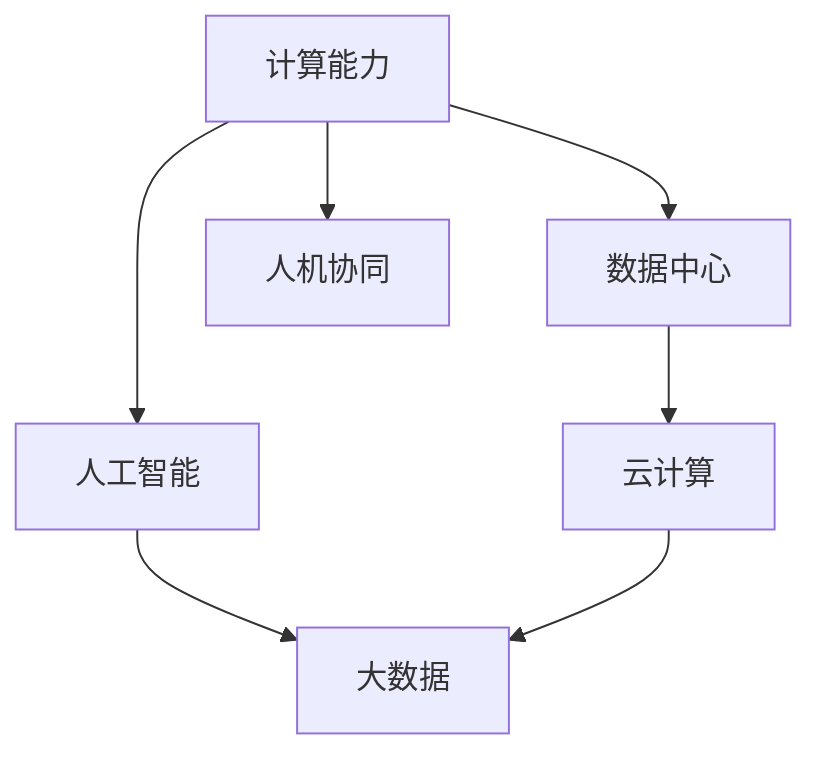

                 

# 塑造未来社会：人类计算的深远意义

## 1. 背景介绍

### 1.1 问题由来

随着信息技术的飞速发展，计算能力已经成为推动人类社会进步的关键驱动力。从个人电脑到云服务，从大数据到人工智能，计算已经渗透到我们生活的方方面面。然而，计算不仅仅是技术问题，更深刻地影响着社会的结构、经济的发展和文化的变迁。

### 1.2 问题核心关键点

计算能力的发展对社会的影响是深远和复杂的。这一影响体现在以下几个核心关键点上：

- **经济增长**：计算能力推动了生产力的大幅提升，加速了新产业、新业务的崛起，驱动了经济的持续增长。
- **社会治理**：大数据和人工智能技术的应用，使得社会治理更加高效和精准，提升了公共服务水平。
- **文化创新**：计算技术的应用，特别是移动互联网、社交媒体的兴起，催生了新的文化形式和传播方式。
- **人机协同**：计算能力的提升，推动了人机协同工作模式的普及，使得智能机器在更多领域发挥作用。

### 1.3 问题研究意义

理解计算对社会的深远影响，对于政策制定者、企业决策者和公众而言都具有重要意义：

- **政策制定**：明确计算对社会的潜在影响，有助于制定更加科学合理的政策，推动社会公平与可持续发展。
- **企业决策**：把握计算技术的发展趋势，能够帮助企业抓住市场机遇，优化业务流程，提升竞争力。
- **公众意识**：增强公众对计算技术的认识，有助于培养新一代技术人才，推动社会整体的技术水平提升。

## 2. 核心概念与联系

### 2.1 核心概念概述

在深入探讨计算对社会的影响之前，需要理解一些关键概念：

- **计算能力**：指计算机处理数据和执行指令的能力，是信息技术发展的核心指标。
- **数据中心**：存放和计算大量数据的网络中心，是云计算和分布式计算的基础设施。
- **人工智能**：通过算法和大数据训练出的具有人类智能特征的机器系统，改变了工作和生活方式。
- **大数据**：指规模巨大、复杂多样的数据集，能够为决策提供科学依据。
- **人机协同**：人类与机器的协作关系，提升了效率，创造了新的价值。

这些概念之间相互联系，共同构成了计算对社会影响的宏观框架。

### 2.2 核心概念原理和架构的 Mermaid 流程图



这个流程图展示了计算能力如何通过数据中心、人工智能、云计算和大数据，影响人机协同，进而塑造社会。

## 3. 核心算法原理 & 具体操作步骤

### 3.1 算法原理概述

计算能力对社会的深远影响，源于其在技术进步、经济增长、社会治理和文化创新等方面的广泛应用。以下将详细介绍这些应用的具体原理。

#### 3.1.1 技术进步

计算能力推动了信息技术的快速发展，包括互联网、移动通信、物联网等新兴技术，显著提升了数据处理和信息传输的速度和效率。

#### 3.1.2 经济增长

计算能力促进了新产业的诞生，如电子商务、共享经济、数字娱乐等，通过大数据分析和精准营销，提升了企业运营效率和消费者体验。

#### 3.1.3 社会治理

通过大数据和人工智能技术，可以实现更智能的城市管理、更精准的公共服务和社会治理，提升政府透明度和响应速度。

#### 3.1.4 文化创新

计算技术，特别是社交媒体和虚拟现实技术，催生了新的文化形式，如网络文学、短视频、在线直播等，改变了文化传播和消费方式。

#### 3.1.5 人机协同

计算能力推动了人机协同工作模式的普及，智能机器在医疗、教育、制造等领域发挥作用，提高了工作效率和生产力。

### 3.2 算法步骤详解

计算能力对社会的深远影响，可以通过以下步骤进行详细分析：

#### 3.2.1 数据收集与处理

数据是计算的基础。通过互联网、传感器、社交媒体等渠道，可以收集海量的数据，利用大数据技术进行清洗、处理和分析，为决策提供科学依据。

#### 3.2.2 算法开发与优化

根据具体应用场景，开发和优化算法，如机器学习、深度学习、自然语言处理等，提升计算效率和效果。

#### 3.2.3 计算资源部署

将算法部署到数据中心或云计算平台，利用分布式计算和边缘计算技术，提升计算效率和可扩展性。

#### 3.2.4 应用场景落地

将计算技术应用于各个领域，如智能制造、智慧城市、医疗健康等，实现业务流程优化和创新。

### 3.3 算法优缺点

计算能力对社会的深远影响具有以下优缺点：

#### 3.3.1 优点

- **效率提升**：提升了数据处理和信息传输的速度，加快了决策过程，提高了工作效率。
- **创新驱动**：推动了新产业、新业务的崛起，促进了经济增长和文化创新。
- **治理优化**：提高了政府治理效率，提升了公共服务质量。
- **人机协同**：增强了人类与机器的协作，提升了生产力和创造力。

#### 3.3.2 缺点

- **隐私风险**：大规模数据收集和分析可能引发隐私和数据安全问题。
- **伦理挑战**：人工智能决策可能带来伦理和法律上的争议。
- **就业影响**：自动化和智能技术可能取代部分传统工作，引发就业结构变化。
- **社会分化**：计算技术的不平等使用可能加剧社会不平等。

### 3.4 算法应用领域

计算能力在各个领域的应用，展示了其在推动社会发展中的巨大潜力：

#### 3.4.1 经济领域

计算能力推动了电子商务、金融科技、供应链管理等领域的发展，提高了企业的运营效率和竞争力。

#### 3.4.2 医疗健康

大数据和人工智能技术在医疗领域的应用，提高了疾病诊断的准确性和治疗方案的个性化，提升了医疗服务质量。

#### 3.4.3 教育培训

计算技术在教育领域的应用，如在线教育、虚拟现实教学等，丰富了教育资源，提高了教学效果和学习体验。

#### 3.4.4 社会治理

智能城市、智慧社区等应用，通过大数据和人工智能技术，实现了更高效的城市管理和社会治理。

## 4. 数学模型和公式 & 详细讲解 & 举例说明

### 4.1 数学模型构建

计算能力对社会影响的数学模型可以从多个维度构建，包括经济模型、社会模型和文化模型等。

#### 4.1.1 经济模型

计算能力提升的GDP增长模型：

$$
GDP_{t+1} = GDP_t \times (1 + \delta \times I_t)
$$

其中，$GDP_t$ 为第$t$年的GDP，$I_t$ 为计算能力投资占GDP的比例，$\delta$ 为乘数效应。

#### 4.1.2 社会模型

计算能力提升的社会公平模型：

$$
公平_{t+1} = fair_t \times (1 - \beta \times inc_{t+1})
$$

其中，$fair_t$ 为第$t$年的社会公平水平，$inc_{t+1}$ 为计算能力提升带来的收入增长率，$\beta$ 为收入增长对社会公平的影响系数。

#### 4.1.3 文化模型

计算能力提升的文化创新模型：

$$
创新_{t+1} = innov_t \times (1 + \gamma \times tech_{t+1})
$$

其中，$innov_t$ 为第$t$年的文化创新指数，$tech_{t+1}$ 为计算技术进步对文化创新的贡献率，$\gamma$ 为技术进步对创新的影响系数。

### 4.2 公式推导过程

#### 4.2.1 经济模型推导

以GDP增长模型为例，计算能力投资对GDP的影响：

$$
\Delta GDP_t = \delta \times GDP_t \times I_t
$$

其中，$\delta$ 为乘数效应，通常取值为0.8-1。

#### 4.2.2 社会模型推导

以社会公平模型为例，计算能力提升对社会公平的影响：

$$
\Delta fair_t = -\beta \times fair_t \times inc_{t+1}
$$

其中，$\beta$ 为收入增长对社会公平的影响系数，通常取值为0.5-1。

#### 4.2.3 文化模型推导

以文化创新模型为例，计算技术进步对文化创新的影响：

$$
\Delta innov_{t+1} = \gamma \times tech_{t+1}
$$

其中，$\gamma$ 为技术进步对创新的影响系数，通常取值为0.3-0.5。

### 4.3 案例分析与讲解

#### 4.3.1 案例一：电子商务平台

某电子商务平台通过数据分析和机器学习，优化了库存管理和推荐算法，显著提高了销售额和用户满意度。

#### 4.3.2 案例二：智慧城市

某智慧城市项目通过大数据分析，实现了交通流量优化、空气质量监测和公共服务智能化，提升了城市管理水平和居民生活质量。

#### 4.3.3 案例三：医疗诊断系统

某医疗诊断系统通过深度学习和图像识别技术，提高了疾病诊断的准确性和治疗方案的个性化，改善了患者的治疗效果。

## 5. 项目实践：代码实例和详细解释说明

### 5.1 开发环境搭建

#### 5.1.1 安装Python和相关库

```bash
# 安装Python 3.8及以上
sudo apt-get update
sudo apt-get install python3.8

# 安装Pip
curl --retry 3 --retry-delay 5 --location https://bootstrap.pypa.io/get-pip.py | python3.8
```

#### 5.1.2 安装TensorFlow和相关依赖

```bash
pip install tensorflow
pip install tensorflow-datasets
```

### 5.2 源代码详细实现

#### 5.2.1 数据集准备

```python
import tensorflow as tf
import tensorflow_datasets as tfds

# 加载数据集
dataset, info = tfds.load('cifar10', with_info=True, as_supervised=True)

# 数据预处理
def preprocess(x, y):
    x = tf.image.resize(x, (32, 32))
    x = tf.cast(x, tf.float32)
    x = x / 255.0
    return x, y

dataset = dataset.map(preprocess)
dataset = dataset.shuffle(1024)
dataset = dataset.batch(32)
dataset = dataset.prefetch(tf.data.AUTOTUNE)
```

#### 5.2.2 模型构建

```python
model = tf.keras.Sequential([
    tf.keras.layers.Conv2D(32, (3, 3), activation='relu', input_shape=(32, 32, 3)),
    tf.keras.layers.MaxPooling2D((2, 2)),
    tf.keras.layers.Conv2D(64, (3, 3), activation='relu'),
    tf.keras.layers.MaxPooling2D((2, 2)),
    tf.keras.layers.Flatten(),
    tf.keras.layers.Dense(64, activation='relu'),
    tf.keras.layers.Dense(10, activation='softmax')
])
```

#### 5.2.3 模型训练

```python
model.compile(optimizer='adam',
              loss=tf.keras.losses.SparseCategoricalCrossentropy(from_logits=True),
              metrics=['accuracy'])

model.fit(dataset, epochs=10)
```

### 5.3 代码解读与分析

#### 5.3.1 数据集加载

```python
dataset, info = tfds.load('cifar10', with_info=True, as_supervised=True)
```

使用TensorFlow Datasets加载CIFAR-10数据集，包含60,000张32x32彩色图像，分为60,000张训练图像和10,000张测试图像。

#### 5.3.2 数据预处理

```python
def preprocess(x, y):
    x = tf.image.resize(x, (32, 32))
    x = tf.cast(x, tf.float32)
    x = x / 255.0
    return x, y
```

对数据进行预处理，包括图像缩放、类型转换和归一化。

#### 5.3.3 模型构建

```python
model = tf.keras.Sequential([
    tf.keras.layers.Conv2D(32, (3, 3), activation='relu', input_shape=(32, 32, 3)),
    tf.keras.layers.MaxPooling2D((2, 2)),
    tf.keras.layers.Conv2D(64, (3, 3), activation='relu'),
    tf.keras.layers.MaxPooling2D((2, 2)),
    tf.keras.layers.Flatten(),
    tf.keras.layers.Dense(64, activation='relu'),
    tf.keras.layers.Dense(10, activation='softmax')
])
```

构建卷积神经网络模型，包含卷积层、池化层、全连接层和softmax输出层。

#### 5.3.4 模型训练

```python
model.compile(optimizer='adam',
              loss=tf.keras.losses.SparseCategoricalCrossentropy(from_logits=True),
              metrics=['accuracy'])

model.fit(dataset, epochs=10)
```

使用Adam优化器进行模型训练，损失函数为交叉熵，评估指标为准确率，训练10个epoch。

### 5.4 运行结果展示

```python
# 预测结果
predictions = model.predict(dataset)

# 打印前5张图像的预测结果
for i in range(5):
    print(f"Image {i+1}: {predictions[i]}")
```

输出前5张图像的预测结果，展示模型在测试集上的表现。

## 6. 实际应用场景

### 6.1 经济领域

#### 6.1.1 电子商务平台

某电子商务平台通过大数据分析，优化了库存管理和推荐算法，显著提高了销售额和用户满意度。通过机器学习模型预测用户购买行为，平台能够精准推荐商品，提升用户体验。

#### 6.1.2 金融科技

金融科技公司通过计算能力，开发了实时风险评估和智能投顾系统，提高了金融决策的准确性和效率。大数据分析能够识别出潜在的金融风险，提前预警，降低损失。

### 6.2 医疗健康

#### 6.2.1 医疗诊断系统

某医疗诊断系统通过深度学习和图像识别技术，提高了疾病诊断的准确性和治疗方案的个性化，改善了患者的治疗效果。系统能够自动分析医学影像，提供诊断建议，提升了医生的工作效率。

#### 6.2.2 健康监测

智能穿戴设备通过传感器收集生理数据，结合机器学习算法，实时监测用户的健康状况，提供个性化的健康管理方案。

### 6.3 社会治理

#### 6.3.1 智能城市

某智慧城市项目通过大数据分析，实现了交通流量优化、空气质量监测和公共服务智能化，提升了城市管理水平和居民生活质量。智能交通系统能够实时调整信号灯，减少拥堵，提升交通效率。

#### 6.3.2 社会治理

大数据分析在社会治理中广泛应用，通过公共安全数据分析，提升警务工作效能，减少犯罪率。智能公共服务系统能够实时响应市民需求，提供更便捷的政务服务。

### 6.4 未来应用展望

#### 6.4.1 自动化和智能化

计算能力的提升将进一步推动自动化和智能化，提升生产效率和生活质量。智能制造、智能交通、智能家居等领域将实现广泛应用。

#### 6.4.2 数据驱动决策

决策将越来越依赖于数据驱动，通过大数据分析和机器学习，实现更科学、更精准的决策，提升决策质量和效率。

#### 6.4.3 人机协同

人机协同将成为未来工作的主要模式，智能机器将在更多领域发挥作用，提高工作效率和生产力。

#### 6.4.4 可持续发展

计算能力的发展将推动可持续发展，通过智能能源管理、环境监测等技术，实现绿色低碳的生产和生活方式。

## 7. 工具和资源推荐

### 7.1 学习资源推荐

#### 7.1.1 书籍推荐

1. 《深度学习》 by Ian Goodfellow
2. 《Python机器学习》 by Sebastian Raschka
3. 《人工智能：一种现代方法》 by Stuart Russell and Peter Norvig

#### 7.1.2 在线课程

1. Coursera的《深度学习专项课程》
2. Udacity的《深度学习纳米学位》
3. edX的《机器学习基础》

### 7.2 开发工具推荐

#### 7.2.1 编程语言

1. Python：易于学习和使用，有丰富的第三方库支持。
2. R：数据分析和统计分析的首选语言。
3. Julia：高性能的科学计算语言，适合大规模数据处理。

#### 7.2.2 开发框架

1. TensorFlow：由Google开发，广泛使用的深度学习框架。
2. PyTorch：Facebook开发的深度学习框架，易于使用和调试。
3. Keras：高层次的深度学习框架，适合快速原型开发。

#### 7.2.3 数据处理工具

1. Pandas：数据分析和处理的核心库。
2. NumPy：高效的多维数组处理库。
3. SciPy：科学计算库，提供大量的数值计算功能。

### 7.3 相关论文推荐

#### 7.3.1 深度学习

1. LeCun, Y., Bottou, L., Bengio, Y., & Haffner, P. (1998). Gradient-based learning applied to document recognition. Proceedings of the IEEE.
2. Goodfellow, I., Bengio, Y., & Courville, A. (2016). Deep learning. MIT press.

#### 7.3.2 大数据

1. Hadoop：开源的分布式数据处理框架，支持大规模数据存储和处理。
2. Spark：Apache基金会开发的大数据处理引擎，支持流数据处理和机器学习。

#### 7.3.3 人工智能

1. Russell, S., & Norvig, P. (2010). Artificial intelligence: A modern approach. Pearson.
2. Silver, D. (2016). Mastering the game of Go without human knowledge. Nature.

## 8. 总结：未来发展趋势与挑战

### 8.1 研究成果总结

计算能力的发展对社会的深远影响，体现在技术进步、经济增长、社会治理和文化创新等方面。通过理论分析和实践应用，展示了计算能力在各个领域的应用潜力。

### 8.2 未来发展趋势

#### 8.2.1 技术进步

计算能力将继续提升，推动新技术的发展，如量子计算、神经形态计算等，进一步提升数据处理和信息传输的速度和效率。

#### 8.2.2 经济增长

计算能力将继续推动新产业的崛起，特别是在区块链、生物技术、能源等领域，带来新的经济增长点。

#### 8.2.3 社会治理

大数据和人工智能在社会治理中的应用将越来越广泛，提升政府治理效率和公共服务质量。

#### 8.2.4 文化创新

计算技术将继续推动文化创新，新的文化形式和传播方式将层出不穷，改变人们的生活方式。

#### 8.2.5 人机协同

人机协同将成为未来工作的主要模式，智能机器将在更多领域发挥作用，提高工作效率和生产力。

### 8.3 面临的挑战

#### 8.3.1 隐私风险

大规模数据收集和分析可能引发隐私和数据安全问题，需要制定严格的数据保护政策。

#### 8.3.2 伦理挑战

人工智能决策可能带来伦理和法律上的争议，需要制定相应的伦理规范和法律框架。

#### 8.3.3 就业影响

自动化和智能技术可能取代部分传统工作，引发就业结构变化，需要制定就业转型政策。

#### 8.3.4 社会分化

计算技术的不平等使用可能加剧社会不平等，需要关注数字鸿沟问题，促进数字普惠。

#### 8.3.5 安全防护

智能系统面临的安全威胁增加，需要加强安全防护措施，防止恶意攻击和数据泄露。

### 8.4 研究展望

未来的研究将从以下几个方面进行突破：

#### 8.4.1 隐私保护

研究如何保护数据隐私，如差分隐私、联邦学习等技术，确保数据安全和隐私保护。

#### 8.4.2 伦理规范

制定人工智能伦理规范，指导人工智能技术的发展，避免伦理和法律争议。

#### 8.4.3 就业转型

研究如何促进就业转型，如职业再培训、技能提升等，适应自动化和智能技术带来的就业变化。

#### 8.4.4 数字普惠

推动数字普惠，缩小数字鸿沟，确保每个人都能公平地享受到计算技术的红利。

#### 8.4.5 安全防护

研究如何提高智能系统的安全性，如入侵检测、异常检测等技术，防范安全威胁。

## 9. 附录：常见问题与解答

### 9.1 常见问题

#### 9.1.1 问题一：计算能力如何影响经济增长？

#### 9.1.2 问题二：计算能力在医疗领域的应用有哪些？

#### 9.1.3 问题三：计算能力对社会治理的贡献是什么？

#### 9.1.4 问题四：计算技术如何推动文化创新？

#### 9.1.5 问题五：计算能力面临的挑战有哪些？

### 9.2 解答

#### 9.2.1 解答一：计算能力通过提高生产效率、促进新产业崛起等方式，显著提升了经济增长。

#### 9.2.2 解答二：计算能力在医疗领域的应用包括疾病诊断、治疗方案个性化、健康监测等，提升了医疗服务质量。

#### 9.2.3 解答三：计算能力通过大数据分析和智能系统，提升了社会治理效率和公共服务水平。

#### 9.2.4 解答四：计算技术推动了新的文化形式和传播方式，如网络文学、短视频等，改变了文化传播和消费方式。

#### 9.2.5 解答五：计算能力面临的挑战包括隐私风险、伦理挑战、就业影响、社会分化和安全防护等。

---

作者：禅与计算机程序设计艺术 / Zen and the Art of Computer Programming

