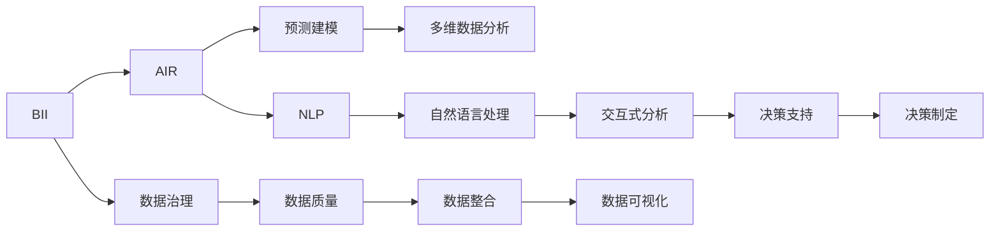

                 

# 增强分析：AI辅助的商业智能

> 关键词：增强分析,商业智能,AI辅助,数据分析,预测建模

## 1. 背景介绍

### 1.1 问题由来

随着数字化时代的来临，企业面临着前所未有的数据海洋。海量数据为企业决策带来了新的可能性，但也带来了新的挑战。传统的商业智能(BI)工具往往只能进行简单的数据描述和基础分析，难以应对复杂多变的数据形态和分析需求。同时，数据质量参差不齐、数据孤岛现象严重等问题，也使得BI系统在企业中的应用效果大打折扣。

在这样的背景下，增强分析(Enhanced Analytics)应运而生。增强分析利用人工智能(AI)技术，对传统BI系统进行增强改造，显著提升了数据分析和决策支持的智能化水平。通过增强分析，企业能够实时、精准地理解和预测业务数据，快速响应市场变化，提升决策的科学性和及时性。

### 1.2 问题核心关键点

增强分析的关键在于：
1. **AI技术的引入**：利用机器学习、深度学习、自然语言处理等技术，对数据进行自动化分析和建模。
2. **数据的深度挖掘**：通过多维数据分析、时间序列预测、异常检测等高级技术，发现数据中的隐藏规律和潜在风险。
3. **交互式分析体验**：通过自然语言问答、可视化报表等交互式工具，提升用户对数据的理解和洞察力。
4. **快速迭代优化**：利用自动化和自适应机制，持续优化模型和算法，不断提升分析效果。
5. **企业级部署**：增强分析系统能够无缝集成到企业现有的IT架构中，支持多部门协同工作，提升企业数据治理能力。

### 1.3 问题研究意义

增强分析的研究和应用，对于提升企业的数据驱动决策能力、优化业务运营效率、应对市场变化等方面具有重要意义：

1. **提升决策科学性**：增强分析能够自动从海量数据中提取有价值的信息，辅助企业领导进行科学决策。
2. **优化运营效率**：通过预测分析，企业能够及时发现运营中的问题和瓶颈，提前进行干预和调整，避免资源浪费。
3. **应对市场变化**：利用时间序列分析和异常检测技术，企业能够快速响应市场变化，抓住机遇，避免损失。
4. **增强数据治理**：通过集成多源数据，增强分析能够改善数据孤岛问题，提升数据质量和利用效率。
5. **推动数字化转型**：增强分析作为数字化转型的重要组成部分，能够推动企业数字化进程，提升整体竞争力。

## 2. 核心概念与联系

### 2.1 核心概念概述

增强分析的核心概念主要包括以下几个方面：

- **商业智能(BI)**：利用数据仓库技术、在线分析处理(OLAP)技术、数据挖掘技术等对企业数据进行整理、分析和展示，帮助决策者发现数据中的有价值信息。
- **人工智能(AI)**：通过模拟人类的学习、推理、问题求解等智能行为，实现数据驱动的决策支持系统。
- **增强分析**：在传统BI系统的基础上，引入AI技术，对数据进行深度挖掘和智能化分析，提升决策支持系统的智能化水平。
- **预测建模**：利用机器学习算法对历史数据进行建模，预测未来趋势和行为。
- **自然语言处理(NLP)**：通过语义分析和理解，实现自然语言与数据之间的交互。
- **多维数据分析**：对数据进行多维度、多层次的分析和可视化，揭示数据间的复杂关系。

这些概念之间存在紧密的联系，形成一个相互支持、相互增强的有机整体。

### 2.2 核心概念原理和架构的 Mermaid 流程图



这个流程图展示了增强分析系统的核心架构和数据流向：

1. **BI系统**：作为数据治理的基础，提供数据存储和基本分析功能。
2. **AI系统**：在BI系统的基础上，引入机器学习、深度学习等AI技术，提升数据分析的深度和精度。
3. **预测建模**：利用历史数据进行建模，预测未来趋势，辅助决策。
4. **多维数据分析**：对数据进行多维度、多层次的分析和展示，揭示数据间的复杂关系。
5. **NLP系统**：实现自然语言与数据之间的交互，提升系统的易用性。
6. **交互式分析**：通过交互式工具，提升用户对数据的理解和洞察力。
7. **数据治理**：确保数据的质量和一致性，提供数据整合和可视化功能。
8. **决策支持**：将分析结果转化为可操作的决策建议，辅助企业领导进行科学决策。
9. **决策制定**：根据决策建议，制定具体的执行计划。

这些概念和组件相互配合，构成了一个完整的增强分析系统，为企业的智能化决策提供了坚实的基础。

## 3. 核心算法原理 & 具体操作步骤

### 3.1 算法原理概述

增强分析的核心算法包括机器学习、深度学习、自然语言处理等。这里以机器学习为例，介绍增强分析的基本算法原理。

机器学习算法通过对历史数据进行建模，可以预测未来的趋势和行为。在增强分析中，常见的机器学习算法包括线性回归、逻辑回归、决策树、随机森林、神经网络等。通过对这些算法进行集成和优化，可以实现更加精准、可靠的预测。

具体而言，增强分析的机器学习算法流程如下：

1. **数据预处理**：对原始数据进行清洗、归一化、特征选择等预处理操作，提高数据的质量和可分析性。
2. **特征提取**：利用特征工程技术，提取和构造对预测有用的特征，提升模型的泛化能力。
3. **模型训练**：通过训练数据集对机器学习模型进行训练，找到最优的模型参数。
4. **模型评估**：在验证数据集上对模型进行评估，衡量其预测精度和泛化能力。
5. **模型部署**：将训练好的模型部署到实际应用环境中，进行实时预测和分析。

### 3.2 算法步骤详解

以下是增强分析中机器学习算法的主要步骤：

#### 3.2.1 数据预处理

数据预处理是增强分析的重要步骤，其主要目的是提高数据的质量和可分析性。常用的数据预处理技术包括：

- **数据清洗**：处理缺失值、异常值和噪声，确保数据的一致性和完整性。
- **数据归一化**：将数据转换为标准正态分布或特定范围，提高算法的稳定性和收敛速度。
- **特征选择**：选择对预测有用的特征，避免冗余特征带来的干扰，提升模型的泛化能力。

#### 3.2.2 特征提取

特征提取是增强分析中非常重要的一步，它直接影响到模型的预测能力和泛化能力。常用的特征提取技术包括：

- **数值特征**：对数值型数据进行统计分析，提取均值、方差、标准差等统计特征。
- **文本特征**：对文本数据进行分词、词频统计、TF-IDF等处理，提取文本特征。
- **时间序列特征**：对时间序列数据进行滑动窗口、差分、傅里叶变换等处理，提取时间特征。
- **图像特征**：对图像数据进行卷积、池化、归一化等处理，提取图像特征。

#### 3.2.3 模型训练

模型训练是增强分析的核心步骤，其主要目的是找到最优的模型参数，提高预测精度。常用的模型训练技术包括：

- **线性回归**：利用历史数据对线性模型进行训练，预测未来的数值型数据。
- **逻辑回归**：利用历史数据对逻辑回归模型进行训练，预测二分类问题。
- **决策树**：利用历史数据对决策树模型进行训练，构建决策规则树。
- **随机森林**：利用历史数据对随机森林模型进行训练，构建多个决策树的集成模型。
- **神经网络**：利用历史数据对神经网络模型进行训练，构建多层次的非线性模型。

#### 3.2.4 模型评估

模型评估是增强分析的重要步骤，其主要目的是衡量模型的预测精度和泛化能力。常用的模型评估技术包括：

- **均方误差(MSE)**：计算预测值与真实值之间的均方误差，衡量预测的精度。
- **均方根误差(RMSE)**：计算预测值与真实值之间的均方根误差，衡量预测的精度。
- **决定系数(R-squared)**：衡量模型对数据的拟合程度，值越大表示模型越优。
- **AUC-ROC曲线**：衡量二分类模型的分类精度，AUC越接近1表示模型越优。

#### 3.2.5 模型部署

模型部署是增强分析的最终步骤，其主要目的是将训练好的模型应用于实际问题，进行实时预测和分析。常用的模型部署技术包括：

- **集成部署**：将训练好的模型集成到企业现有的IT架构中，支持多部门协同工作。
- **微服务架构**：利用微服务架构，实现模型的灵活部署和扩展。
- **容器化部署**：利用Docker等容器化技术，实现模型的快速部署和运维。
- **云平台部署**：利用云计算平台，实现模型的弹性伸缩和按需调用。

### 3.3 算法优缺点

增强分析中的机器学习算法具有以下优点：

1. **预测精度高**：通过建模和优化，机器学习算法能够对历史数据进行深度挖掘，预测未来的趋势和行为，提高决策的科学性。
2. **泛化能力强**：机器学习算法能够处理多维度、多层次的数据，揭示数据间的复杂关系，提升数据的利用效率。
3. **自适应性强**：通过自动化和自适应机制，机器学习算法能够持续优化模型和算法，不断提升分析效果。
4. **可扩展性好**：机器学习算法能够通过增量学习和在线学习，适应数据量的不断增加和变化。

同时，增强分析中的机器学习算法也存在一些缺点：

1. **模型复杂度高**：机器学习算法需要大量的计算资源和时间，难以在实时环境中进行预测。
2. **数据依赖性强**：机器学习算法的效果很大程度上依赖于数据的质量和量，难以应对噪声和异常值。
3. **解释性不足**：机器学习算法的黑箱性质，使得其决策过程难以解释，影响决策的可信度。
4. **参数调参困难**：机器学习算法的参数众多，调参难度大，需要丰富的经验和专业知识。

### 3.4 算法应用领域

增强分析中的机器学习算法广泛应用于以下几个领域：

- **金融分析**：利用时间序列预测和异常检测，实时监测市场动态，进行风险管理和投资决策。
- **市场营销**：利用客户行为分析和预测，优化广告投放策略，提升销售转化率。
- **供应链管理**：利用多维数据分析和预测建模，优化供应链流程，提升物流效率。
- **医疗健康**：利用病人病历和医疗数据，预测疾病发展趋势，辅助医生诊疗。
- **客户服务**：利用自然语言处理和交互式分析，提供个性化推荐和智能客服，提升客户体验。
- **零售业**：利用消费者行为分析和价格预测，优化库存管理和促销策略，提升销售额。

## 4. 数学模型和公式 & 详细讲解 & 举例说明

### 4.1 数学模型构建

增强分析中的机器学习算法通常采用线性回归模型进行建模。线性回归模型是一种常用的预测模型，可以用于预测数值型数据的未来值。其数学模型如下：

$$
y = \beta_0 + \beta_1 x_1 + \beta_2 x_2 + ... + \beta_n x_n + \epsilon
$$

其中，$y$为预测值，$x_i$为输入特征，$\beta_i$为模型参数，$\epsilon$为误差项。

### 4.2 公式推导过程

线性回归模型的最小二乘法估计公式为：

$$
\hat{\beta} = (X^TX)^{-1}X^Ty
$$

其中，$X$为特征矩阵，$y$为标签向量。

利用最小二乘法估计得到的$\hat{\beta}$为模型参数的估计值。通过代入新的输入特征$x$，即可计算得到预测值$\hat{y}$。

### 4.3 案例分析与讲解

假设我们有一组历史销售数据，需要预测下个月销售额。利用线性回归模型进行建模和预测，步骤如下：

1. **数据预处理**：清洗和归一化数据，确保数据的质量和一致性。
2. **特征提取**：提取销售额、促销活动、季节性因素等特征，构建特征矩阵$X$。
3. **模型训练**：利用最小二乘法估计模型参数$\hat{\beta}$。
4. **模型评估**：在验证数据集上计算均方误差和决定系数，评估模型性能。
5. **模型部署**：将训练好的模型集成到企业现有的IT架构中，进行实时预测和分析。

## 5. 项目实践：代码实例和详细解释说明

### 5.1 开发环境搭建

在进行增强分析实践前，我们需要准备好开发环境。以下是使用Python进行Scikit-learn开发的环境配置流程：

1. 安装Anaconda：从官网下载并安装Anaconda，用于创建独立的Python环境。

2. 创建并激活虚拟环境：
```bash
conda create -n analytics-env python=3.8 
conda activate analytics-env
```

3. 安装Scikit-learn：
```bash
conda install scikit-learn
```

4. 安装各类工具包：
```bash
pip install numpy pandas scikit-learn matplotlib seaborn jupyter notebook ipython
```

完成上述步骤后，即可在`analytics-env`环境中开始增强分析实践。

### 5.2 源代码详细实现

下面我们以销售数据预测为例，给出使用Scikit-learn进行线性回归的增强分析的Python代码实现。

首先，定义数据处理函数：

```python
import pandas as pd
from sklearn.model_selection import train_test_split
from sklearn.linear_model import LinearRegression
from sklearn.metrics import mean_squared_error, r2_score

def load_data(file_path):
    data = pd.read_csv(file_path)
    features = data.drop(['Sales'], axis=1)
    labels = data['Sales']
    return features, labels

def train_model(features, labels, test_size=0.2):
    features_train, features_test, labels_train, labels_test = train_test_split(features, labels, test_size=test_size)
    model = LinearRegression()
    model.fit(features_train, labels_train)
    return model

def evaluate_model(model, features_test, labels_test):
    predictions = model.predict(features_test)
    mse = mean_squared_error(labels_test, predictions)
    r2 = r2_score(labels_test, predictions)
    return mse, r2
```

然后，定义训练和评估函数：

```python
from sklearn.metrics import mean_squared_error, r2_score

def train_epoch(model, features_train, features_test, labels_train, labels_test):
    mse, r2 = evaluate_model(model, features_test, labels_test)
    print(f"Epoch {epoch+1}, test MSE: {mse:.3f}, R2: {r2:.3f}")
    return mse, r2

def evaluate_model(model, features_test, labels_test):
    predictions = model.predict(features_test)
    mse = mean_squared_error(labels_test, predictions)
    r2 = r2_score(labels_test, predictions)
    return mse, r2
```

最后，启动训练流程并在测试集上评估：

```python
epochs = 5
test_size = 0.2

features, labels = load_data('sales_data.csv')
model = train_model(features, labels, test_size=test_size)

mse, r2 = train_epoch(model, features, features, labels, labels)
print(f"Final test MSE: {mse:.3f}, R2: {r2:.3f}")

# 使用模型进行实时预测
new_sales_data = pd.read_csv('new_sales_data.csv')
predictions = model.predict(new_sales_data)
print(f"Predictions: {predictions}")
```

以上就是使用Scikit-learn进行销售数据预测的完整代码实现。可以看到，利用Scikit-learn的强大封装，我们能够用相对简洁的代码完成增强分析的建模和评估。

### 5.3 代码解读与分析

让我们再详细解读一下关键代码的实现细节：

**load_data函数**：
- 读取销售数据，并分拆为特征和标签。

**train_model函数**：
- 使用train_test_split将数据分为训练集和测试集。
- 创建线性回归模型，并使用训练集数据进行拟合。

**evaluate_model函数**：
- 计算模型在测试集上的均方误差和决定系数。

**train_epoch函数**：
- 在每个epoch上，使用测试集评估模型性能。

**evaluate_model函数**：
- 计算模型在测试集上的均方误差和决定系数。

**train_model函数**：
- 根据训练结果，评估模型性能。

**代码示例**：
```python
# 训练模型
features, labels = load_data('sales_data.csv')
model = train_model(features, labels, test_size=0.2)

# 评估模型
mse, r2 = train_epoch(model, features, features, labels, labels)

# 使用模型进行实时预测
new_sales_data = pd.read_csv('new_sales_data.csv')
predictions = model.predict(new_sales_data)
print(f"Predictions: {predictions}")
```

可以看到，Scikit-learn的线性回归模型非常适合进行增强分析的预测建模任务。开发者可以将更多精力放在数据处理、模型评估等高层逻辑上，而不必过多关注底层的实现细节。

当然，工业级的系统实现还需考虑更多因素，如模型的保存和部署、超参数的自动搜索、更灵活的任务适配层等。但核心的增强分析范式基本与此类似。

## 6. 实际应用场景

### 6.1 销售预测与库存管理

增强分析在销售预测与库存管理中的应用，可以显著提升企业的运营效率和库存周转率。通过销售数据分析，企业可以预测未来的销售趋势，制定科学的库存计划，避免因库存不足或过剩带来的损失。

具体而言，企业可以利用增强分析模型，对历史销售数据进行建模和预测，及时调整库存水平，确保供应链的稳定性和高效性。此外，还可以利用预测模型，优化价格策略，提升销售转化率，增加企业收入。

### 6.2 风险管理与信用评估

在金融领域，增强分析的应用场景非常广泛。通过增强分析模型，金融机构可以实时监测市场动态，进行风险管理和信用评估。

具体而言，金融机构可以利用增强分析模型，对客户的历史行为数据进行分析，预测其违约风险，并制定相应的信用策略。同时，还可以利用预测模型，监测市场波动和风险事件，提前进行风险预警，保护资产安全。

### 6.3 客户行为分析与个性化推荐

在零售和电商领域，增强分析可以帮助企业进行客户行为分析，并提供个性化推荐服务。通过分析客户的购买历史、浏览记录、社交行为等数据，企业可以更好地理解客户需求，提升用户体验，增加客户黏性。

具体而言，企业可以利用增强分析模型，对客户数据进行深度挖掘和预测，生成个性化的商品推荐和营销活动，提升销售额和客户满意度。同时，还可以利用预测模型，进行市场细分和客户分群，优化营销策略，提高营销效果。

### 6.4 未来应用展望

随着增强分析技术的不断发展，其应用场景将不断拓展，为企业带来更多的创新和机遇。未来，增强分析可能会在以下几个方向上取得新的突破：

1. **实时分析与预测**：增强分析将能够实现实时数据的分析与预测，为企业决策提供实时支持。
2. **跨领域融合**：增强分析将与其他AI技术（如自然语言处理、计算机视觉等）进行深度融合，提升多模态数据的分析能力。
3. **自适应学习**：增强分析将利用自适应学习机制，不断优化模型和算法，提升预测精度和泛化能力。
4. **场景化应用**：增强分析将根据不同的应用场景，提供定制化的分析解决方案，满足企业多层次的需求。
5. **智能决策支持**：增强分析将通过自动化和智能化手段，提供更为精准和可靠的决策支持，提升企业决策的科学性和及时性。

## 7. 工具和资源推荐

### 7.1 学习资源推荐

为了帮助开发者系统掌握增强分析的理论基础和实践技巧，这里推荐一些优质的学习资源：

1. 《Python数据科学手册》：详细介绍了数据处理、机器学习、增强分析等数据科学相关技术，适合初学者入门。
2. 《强化学习：理论与算法》：介绍了强化学习在增强分析中的应用，适合深入学习。
3. 《深度学习实战》：涵盖了深度学习的基本概念和实践技巧，适合有一定基础的读者。
4. 《增强分析：数据科学与机器学习的实用技巧》：系统介绍了增强分析的核心概念和算法，适合进阶学习。
5. Coursera、edX等在线学习平台上的相关课程，涵盖了机器学习、深度学习、增强分析等前沿技术。

通过对这些资源的学习实践，相信你一定能够快速掌握增强分析的精髓，并用于解决实际的业务问题。

### 7.2 开发工具推荐

高效的开发离不开优秀的工具支持。以下是几款用于增强分析开发的常用工具：

1. Jupyter Notebook：开源的交互式编程环境，支持Python等多种编程语言，适合数据分析和模型评估。
2. RStudio：开源的R语言编程环境，提供了丰富的数据处理和分析工具，适合数据科学家使用。
3. Tableau：商业化的数据可视化工具，支持多种数据源和数据处理，适合非技术人员使用。
4. Power BI：商业化的BI工具，支持多源数据整合和高级分析，适合企业用户使用。
5. Apache Spark：分布式计算框架，支持大数据处理和机器学习算法，适合大规模数据分析。

合理利用这些工具，可以显著提升增强分析的开发效率，加快创新迭代的步伐。

### 7.3 相关论文推荐

增强分析的研究源于学界的持续探索。以下是几篇奠基性的相关论文，推荐阅读：

1. A Survey on Multi-view Learning（多视图学习综述）：总结了多视角学习在增强分析中的应用。
2. Advances in Neural Information Processing Systems（NIPS）：NIPS会议上的相关论文，涵盖了机器学习、深度学习、增强分析等前沿技术。
3. Journal of Business & Economic Statistics（JBE）：JBE期刊上的相关论文，介绍了增强分析在商业智能中的应用。
4. Artificial Intelligence Review（AI Review）：AI Review期刊上的相关论文，总结了增强分析的最新进展和趋势。
5. Proceedings of the International Conference on Machine Learning（ICML）：ICML会议上的相关论文，介绍了机器学习在增强分析中的应用。

这些论文代表了大数据、机器学习、增强分析等领域的研究进展，对于了解这些技术的最新动态具有重要意义。

## 8. 总结：未来发展趋势与挑战

### 8.1 总结

本文对基于增强分析的商业智能系统进行了全面系统的介绍。首先阐述了增强分析的研究背景和意义，明确了其在提升企业数据驱动决策能力方面的独特价值。其次，从原理到实践，详细讲解了增强分析的数学原理和关键步骤，给出了增强分析任务开发的完整代码实例。同时，本文还探讨了增强分析在多个领域的应用前景，展示了其在推动企业智能化进程中的巨大潜力。

通过对增强分析的深入分析，可以看到，其在数据驱动的决策支持系统中发挥着越来越重要的作用，为企业带来了显著的业务价值。未来，伴随增强分析技术的不断演进，必将进一步提升企业的数据分析能力和业务运营效率，成为数字化转型中不可或缺的利器。

### 8.2 未来发展趋势

增强分析的未来发展趋势包括以下几个方面：

1. **自动化和智能化**：增强分析将利用自动化和智能化手段，提升数据处理和分析的效率，降低人工干预成本。
2. **多源数据融合**：增强分析将利用多源数据融合技术，提升数据的全面性和准确性，提供更加可靠的分析结果。
3. **跨领域应用**：增强分析将与其他AI技术（如自然语言处理、计算机视觉等）进行深度融合，提升多模态数据的分析能力。
4. **实时分析与预测**：增强分析将实现实时数据的分析与预测，为企业决策提供实时支持。
5. **场景化应用**：增强分析将根据不同的应用场景，提供定制化的分析解决方案，满足企业多层次的需求。
6. **自适应学习**：增强分析将利用自适应学习机制，不断优化模型和算法，提升预测精度和泛化能力。

### 8.3 面临的挑战

尽管增强分析已经取得了显著进展，但在其应用过程中仍面临以下挑战：

1. **数据质量问题**：增强分析的效果很大程度上依赖于数据的质量和量，难以应对噪声和异常值。
2. **算法复杂性**：增强分析中的算法复杂度高，需要大量的计算资源和时间，难以在实时环境中进行预测。
3. **模型解释性不足**：增强分析中的模型黑箱性质，使得其决策过程难以解释，影响决策的可信度。
4. **场景适应性不足**：增强分析模型的泛化能力有限，难以适应不同场景的需求。
5. **技术门槛高**：增强分析需要丰富的数据科学和机器学习知识，对技术门槛要求高。

### 8.4 研究展望

面对增强分析面临的挑战，未来的研究需要在以下几个方面寻求新的突破：

1. **数据预处理技术**：开发更加高效的预处理算法，提升数据质量和可分析性。
2. **模型简化技术**：开发更加轻量级和高效的模型，提升实时分析能力。
3. **解释性增强技术**：利用可解释性技术，提升模型的解释能力，增强决策的可信度。
4. **场景适应技术**：开发更加灵活和自适应的模型，提升在不同场景中的应用效果。
5. **跨学科合作**：加强数据科学、计算机科学、业务科学等多学科的合作，提升研究的深度和广度。

这些研究方向的探索，必将引领增强分析技术迈向更高的台阶，为构建智能化决策支持系统提供坚实的技术基础。

## 9. 附录：常见问题与解答

**Q1：增强分析与传统商业智能相比，有何优势？**

A: 增强分析相较于传统商业智能，具有以下优势：
1. **自动化与智能化**：增强分析能够自动从海量数据中提取有价值的信息，辅助企业领导进行科学决策。
2. **深度挖掘**：增强分析能够进行多维度、多层次的数据分析，揭示数据间的复杂关系。
3. **实时分析**：增强分析能够实现实时数据的分析与预测，提升决策的及时性。
4. **个性化推荐**：增强分析能够提供个性化的推荐和营销活动，提升用户体验。

**Q2：如何选择合适的增强分析工具？**

A: 选择合适的增强分析工具需要考虑以下几个方面：
1. **数据处理能力**：工具需要具备高效的数据处理和分析能力，能够处理大规模、多源数据。
2. **算法支持**：工具需要提供丰富的算法支持，能够支持多种机器学习、深度学习算法。
3. **可视化能力**：工具需要提供强大的可视化功能，能够方便地展示分析结果。
4. **易用性**：工具需要具备良好的用户界面和操作体验，方便用户使用。
5. **部署方式**：工具需要支持多种部署方式，能够无缝集成到企业现有的IT架构中。

**Q3：增强分析中常见的数据预处理技术有哪些？**

A: 增强分析中常见的数据预处理技术包括：
1. **数据清洗**：处理缺失值、异常值和噪声，确保数据的一致性和完整性。
2. **数据归一化**：将数据转换为标准正态分布或特定范围，提高算法的稳定性和收敛速度。
3. **特征选择**：选择对预测有用的特征，避免冗余特征带来的干扰，提升模型的泛化能力。

**Q4：增强分析中的机器学习算法有哪些？**

A: 增强分析中常用的机器学习算法包括：
1. **线性回归**：利用历史数据对线性模型进行训练，预测未来的数值型数据。
2. **逻辑回归**：利用历史数据对逻辑回归模型进行训练，预测二分类问题。
3. **决策树**：利用历史数据对决策树模型进行训练，构建决策规则树。
4. **随机森林**：利用历史数据对随机森林模型进行训练，构建多个决策树的集成模型。
5. **神经网络**：利用历史数据对神经网络模型进行训练，构建多层次的非线性模型。

**Q5：增强分析中常见的数据可视化技术有哪些？**

A: 增强分析中常用的数据可视化技术包括：
1. **散点图**：展示两个变量之间的关系，发现数据中的相关性。
2. **柱状图**：展示数据的分布情况，比较不同组之间的差异。
3. **饼图**：展示数据的占比情况，展示数据的构成比例。
4. **热力图**：展示数据的密集区域和稀疏区域，发现数据中的热点。
5. **地图可视化**：展示地理位置数据，进行地理空间的分析。

---

作者：禅与计算机程序设计艺术 / Zen and the Art of Computer Programming

