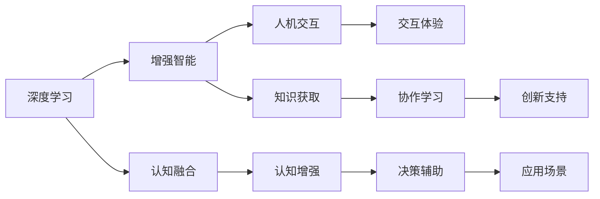

                 

# 增强智能：人机协同，拓展认知边界

> 关键词：增强智能,人机协同,认知边界,智能增强,深度学习,认知融合,人机交互

## 1. 背景介绍

### 1.1 问题由来

随着人工智能技术的迅速发展，我们正在见证一个全新的智能时代，其中以深度学习为代表的增强智能技术扮演了核心角色。从语音识别、图像识别到自然语言处理，从机器人导航到自动驾驶，人工智能已经在各个领域展现出了巨大的潜力。然而，尽管如此，人类认知系统的核心部分，即大脑的复杂性和创造力，目前仍难以被计算机完全模拟和替代。

因此，研究如何通过技术手段增强人类的认知能力，实现人机协同、拓展认知边界，成为当前人工智能研究的热点。增强智能技术即是一种致力于实现这一目标的技术，旨在通过深度学习和人工智能的协同工作，增强人类的智能和创造力。

### 1.2 问题核心关键点

增强智能技术核心在于将计算机的强大计算能力和深度学习模型的知识提取能力与人类认知系统的灵活性和创造性相结合。这一结合可以通过以下方式实现：

- 辅助决策：在复杂决策过程中，人工智能可以辅助人类提供数据分析、预测和建议，帮助人类做出更准确的判断。
- 知识增强：人工智能可以扩展人类的知识范围，通过自动学习海量数据，提供更全面、深入的洞察和知识。
- 创造支持：人工智能可以支持人类创造性思维的实现，如艺术创作、小说编写、游戏设计等，将计算机的生成能力和人类的创新能力结合起来。
- 情感融合：人工智能可以更好地理解和处理人类情感，提高人机交互的体验。
- 协作学习：人工智能可以与人进行协作学习，通过经验共享和知识互补，提升整体学习能力。

增强智能技术的关键在于如何有效地融合人类的智能与人工智能，使之相互促进，达到1+1>2的效果。本文将详细探讨这一技术原理和应用实践，并展望其未来发展趋势和面临的挑战。

### 1.3 问题研究意义

增强智能技术的研究和应用具有重要意义：

1. 提升人类智力：通过人工智能的辅助，人类可以拓展认知边界，掌握更多知识，解决更复杂的问题。
2. 提高工作效率：在决策、知识获取、创新等方面，人工智能可以大幅提升人类工作效率，减轻工作负担。
3. 促进人机交互：通过更好地理解人类情感和需求，人工智能可以提供更加自然、流畅的人机交互体验。
4. 推动社会进步：增强智能技术可以应用于医疗、教育、金融等领域，推动社会各个方面的进步和革新。
5. 激发创新灵感：人工智能可以与人类创意灵感结合，创造出更多新颖、有价值的作品和产品。

增强智能技术不仅是一个技术问题，更是一个伦理、社会问题，涉及如何平衡技术进步与人类福祉，如何确保技术的公平、透明和可控性。本文将围绕这些关键问题，展开深入讨论。

## 2. 核心概念与联系

### 2.1 核心概念概述

增强智能技术涉及多个核心概念，这些概念之间相互关联，共同构成了技术的理论基础和实践框架。以下是关键概念的概述：

- 深度学习(Deep Learning)：一种基于多层神经网络的学习方法，通过不断反向传播误差信号进行参数更新，逐步优化模型性能。
- 增强智能(Enhanced Intelligence)：通过深度学习技术增强人类智能和创造力的技术，旨在实现人机协同。
- 认知融合(Cognitive Fusion)：将人类认知系统与人工智能系统进行融合，实现知识共享、协同工作。
- 人机交互(Human-Computer Interaction, HCI)：研究人机之间的信息交流、交互行为和交互体验的技术。
- 人工智能(Artificial Intelligence, AI)：利用计算机技术和算法，模拟、延伸和扩展人类智能的技术和应用。

这些概念之间的联系可以通过以下Mermaid流程图来展示：



这个流程图展示了深度学习、增强智能、认知融合、人机交互等概念之间的相互关系和互动方式。

## 3. 核心算法原理 & 具体操作步骤

### 3.1 算法原理概述

增强智能技术的核心算法原理可以归结为以下两个步骤：

1. **知识获取和表示**：通过深度学习模型，从大量数据中自动学习抽象的知识表示。这些知识表示可以是语义、视觉、听觉等多种类型，通过神经网络的结构和参数进行编码和存储。
2. **人机协同**：将学习到的知识表示与人类认知系统相结合，通过协同工作，提升整体认知能力。

具体来说，增强智能技术主要依赖于以下几种深度学习模型：

- **卷积神经网络(Convolutional Neural Networks, CNN)**：主要用于图像和视频处理，能够提取局部特征和空间关系。
- **循环神经网络(Recurrent Neural Networks, RNN)**：适用于序列数据的处理，能够捕捉时间依赖性。
- **变分自编码器(Variational Autoencoders, VAE)**：用于学习数据的潜在表示，能够进行数据的生成和降维。
- **生成对抗网络(Generative Adversarial Networks, GAN)**：用于生成逼真的数据，能够进行图像、音频、文本等多种类型的生成。

这些模型通过深度学习算法不断优化，逐渐学习到复杂的知识表示，为增强智能提供了必要的知识基础。

### 3.2 算法步骤详解

基于增强智能技术的深度学习模型，主要经过以下步骤：

1. **数据预处理**：对原始数据进行清洗、归一化、标注等预处理，确保数据的质量和可用性。
2. **模型训练**：选择合适的深度学习模型，通过反向传播算法优化模型参数，逐步逼近目标函数。
3. **知识获取**：通过训练好的模型，自动学习数据中的抽象知识和表示，生成特征向量或潜在表示。
4. **人机协同**：将学习到的知识与人类认知系统进行结合，通过界面、交互技术实现协同工作。
5. **效果评估**：对增强智能系统的性能进行评估，包括准确率、召回率、计算速度等指标。

以图像增强智能为例，主要步骤如下：

1. **数据集准备**：收集和标注图像数据集，确保数据的多样性和代表性。
2. **模型选择**：选择适合的深度学习模型，如CNN、GAN等，用于学习图像特征。
3. **模型训练**：对模型进行训练，调整超参数，确保模型能够学习到有效的图像特征。
4. **知识提取**：通过训练好的模型，将图像特征转换为高层次的语义表示，如物体、场景、情感等。
5. **人机交互**：将学习到的知识通过界面展现给用户，如实时图像增强、虚拟现实等。
6. **效果评估**：对增强智能系统的性能进行评估，确保其能够准确地理解和增强人类认知能力。

### 3.3 算法优缺点

增强智能技术的深度学习模型具有以下优点：

- 自动学习：能够自动从数据中学习抽象知识，无需人工干预。
- 泛化能力强：通过深度学习模型，能够处理不同类型、不同规模的数据。
- 灵活性高：模型结构可调，可以应用于多种不同的增强智能任务。

同时，也存在一些缺点：

- 计算资源需求高：深度学习模型需要大量的计算资源进行训练和推理，对硬件要求较高。
- 可解释性不足：深度学习模型的决策过程较为复杂，难以进行直观解释。
- 数据依赖性强：模型的性能高度依赖于数据的质量和多样性，数据不足可能导致模型性能下降。
- 泛化性能不稳定：模型对新的数据和场景可能存在适应性问题，需要进行不断的迭代和优化。

尽管存在这些局限性，增强智能技术仍是大有潜力的前沿技术，通过不断的改进和优化，可以更好地实现人机协同，拓展认知边界。

### 3.4 算法应用领域

增强智能技术已经在多个领域得到了广泛应用，包括但不限于：

- **医疗诊断**：通过增强智能技术，提升影像诊断的准确率和效率，帮助医生做出更精确的诊断。
- **教育辅助**：提供个性化学习推荐、智能作业批改、智能考试评分等服务，提升教育质量和学习效率。
- **金融分析**：通过增强智能技术，进行数据挖掘和分析，提供金融市场预测、风险评估等服务。
- **娱乐创作**：生成逼真的艺术作品、音乐、电影等内容，支持创意创作和娱乐消费。
- **智能家居**：实现语音控制、情感识别、环境感知等功能，提升家居生活的智能化水平。
- **自动驾驶**：通过增强智能技术，实现自动驾驶车辆的安全导航和决策，提升驾驶体验和安全性。

增强智能技术在各行各业的应用，正逐步改变我们的生活和工作方式，提升效率和创造力。

## 4. 数学模型和公式 & 详细讲解

### 4.1 数学模型构建

增强智能技术涉及多个数学模型，以下是其中几个重要的模型和公式：

- **卷积神经网络(CNN)**：CNN模型主要由卷积层、池化层、全连接层组成，用于图像和视频处理。其基本公式为：
  $$
  y = \max(\text{ReLU}(\text{Conv}(x) + b_1), 0) + \text{b}_2
  $$
  其中，$x$ 为输入图像，$y$ 为输出特征图，$\text{Conv}$ 为卷积操作，$\text{ReLU}$ 为激活函数，$b_1$ 和 $b_2$ 为偏置项。

- **循环神经网络(RNN)**：RNN模型主要由循环层、全连接层组成，用于序列数据的处理。其基本公式为：
  $$
  h_t = \text{tanh}(W_hh h_{t-1} + Whx x_t + b_h) 
  $$
  其中，$h_t$ 为当前时间步的状态向量，$W_hh$ 和 $Whx$ 为权重矩阵，$x_t$ 为当前时间步的输入，$b_h$ 为偏置项。

- **变分自编码器(VAE)**：VAE模型由编码器和解码器组成，用于数据的生成和降维。其基本公式为：
  $$
  \log p(z|x) = \log N(\mu(x), \sigma^2(x))
  $$
  其中，$p(z|x)$ 为潜在变量的概率密度函数，$\mu(x)$ 和 $\sigma^2(x)$ 为变分高斯分布的均值和方差。

- **生成对抗网络(GAN)**：GAN模型由生成器和判别器组成，用于生成逼真的数据。其基本公式为：
  $$
  \min_G \max_D V(G, D) = \mathbb{E}_{x \sim p(x)} [\log D(x)] + \mathbb{E}_{z \sim p(z)} [\log(1 - D(G(z))]]
  $$
  其中，$V(G, D)$ 为生成器和判别器的对抗损失函数，$G$ 为生成器，$D$ 为判别器，$x$ 为真实数据，$z$ 为噪声向量。

这些模型通过深度学习算法不断优化，逐渐学习到复杂的知识表示，为增强智能提供了必要的知识基础。

### 4.2 公式推导过程

以下是几个重要公式的推导过程：

#### 卷积神经网络公式推导

CNN模型主要由卷积层和池化层组成。卷积层通过卷积操作提取局部特征，池化层通过降采样操作减小特征图的尺寸。其基本公式为：
$$
y_{i,j} = \sum_{k} W_{i,j,k} x_{i-k,j-k} + b_i
$$
其中，$y_{i,j}$ 为卷积后的输出特征图，$x_{i-k,j-k}$ 为输入特征图，$W_{i,j,k}$ 为卷积核权重，$b_i$ 为偏置项。

池化层通常使用最大池化操作，公式为：
$$
y_{i,j} = \max(x_{i,k}, x_{i+1,k}, x_{i-1,k}, x_{i,j-1}, x_{i,j+1})
$$
其中，$y_{i,j}$ 为池化后的输出特征图，$x_{i,j}$ 为输入特征图。

#### 循环神经网络公式推导

RNN模型通过循环层实现对序列数据的处理。循环层的状态向量 $h_t$ 可以通过前一时刻的状态 $h_{t-1}$ 和当前输入 $x_t$ 计算得到：
$$
h_t = \text{tanh}(W_hh h_{t-1} + Whx x_t + b_h)
$$
其中，$W_hh$ 和 $Whx$ 为权重矩阵，$x_t$ 为当前时间步的输入，$b_h$ 为偏置项。

#### 变分自编码器公式推导

VAE模型通过编码器将输入数据 $x$ 转换为潜在变量 $z$，通过解码器将潜在变量 $z$ 转换为输出数据 $x'$。其基本公式为：
$$
z = \mu(x) + \sigma(x) \epsilon
$$
$$
x' = W_hh z + b_h
$$
其中，$\mu(x)$ 和 $\sigma(x)$ 为编码器的输出均值和方差，$W_hh$ 和 $b_h$ 为解码器的权重和偏置项。

#### 生成对抗网络公式推导

GAN模型通过生成器和判别器进行对抗训练。生成器 $G$ 试图生成逼真的数据 $x'$，判别器 $D$ 试图区分真实数据 $x$ 和生成数据 $x'$。其基本公式为：
$$
\min_G \max_D V(G, D) = \mathbb{E}_{x \sim p(x)} [\log D(x)] + \mathbb{E}_{z \sim p(z)} [\log(1 - D(G(z))]]
$$
其中，$V(G, D)$ 为生成器和判别器的对抗损失函数，$G$ 为生成器，$D$ 为判别器，$x$ 为真实数据，$z$ 为噪声向量。

这些公式的推导展示了增强智能技术的数学模型和算法原理。通过深入理解和掌握这些公式，可以更好地设计和实现增强智能系统。

### 4.3 案例分析与讲解

以医疗影像增强智能为例，通过深度学习模型，可以从大量的医学影像中学习到病变的特征和模式。这些特征和模式可以通过CNN模型自动提取和编码，生成高层次的语义表示。通过人机交互界面，医生可以实时查看增强后的影像，提升诊断准确性和效率。

以下是一个简化的案例分析：

1. **数据准备**：收集和标注大量的医学影像数据集，确保数据的多样性和代表性。
2. **模型训练**：选择适合的CNN模型，通过反向传播算法优化模型参数，逐步逼近目标函数。
3. **知识获取**：通过训练好的CNN模型，将影像特征转换为高层次的语义表示，如肿瘤、炎症等。
4. **人机协同**：将学习到的知识通过界面展现给医生，如实时影像增强、病例分析等。
5. **效果评估**：对增强智能系统的性能进行评估，确保其能够准确地理解和增强人类认知能力。

## 5. 项目实践：代码实例和详细解释说明

### 5.1 开发环境搭建

在进行增强智能技术项目实践前，需要准备好开发环境。以下是使用Python进行TensorFlow开发的环境配置流程：

1. 安装Anaconda：从官网下载并安装Anaconda，用于创建独立的Python环境。

2. 创建并激活虚拟环境：
```bash
conda create -n tf-env python=3.8 
conda activate tf-env
```

3. 安装TensorFlow：根据CUDA版本，从官网获取对应的安装命令。例如：
```bash
conda install tensorflow tensorflow-gpu -c tf -c conda-forge
```

4. 安装各类工具包：
```bash
pip install numpy pandas scikit-learn matplotlib tqdm jupyter notebook ipython
```

完成上述步骤后，即可在`tf-env`环境中开始增强智能技术项目实践。

### 5.2 源代码详细实现

以下是一个简单的医疗影像增强智能项目的代码实现，使用TensorFlow和Keras进行深度学习模型的训练和推理。

```python
import tensorflow as tf
from tensorflow.keras import layers
from tensorflow.keras.datasets import mnist
from tensorflow.keras.utils import to_categorical

# 加载MNIST数据集
(x_train, y_train), (x_test, y_test) = mnist.load_data()

# 数据预处理
x_train = x_train / 255.0
x_test = x_test / 255.0
y_train = to_categorical(y_train)
y_test = to_categorical(y_test)

# 定义模型
model = tf.keras.Sequential([
    layers.Conv2D(32, (3, 3), activation='relu', input_shape=(28, 28, 1)),
    layers.MaxPooling2D((2, 2)),
    layers.Flatten(),
    layers.Dense(64, activation='relu'),
    layers.Dense(10, activation='softmax')
])

# 定义损失函数和优化器
loss_fn = tf.keras.losses.CategoricalCrossentropy()
optimizer = tf.keras.optimizers.Adam()

# 定义评估指标
accuracy = tf.keras.metrics.CategoricalAccuracy()

# 训练模型
model.compile(optimizer=optimizer, loss=loss_fn, metrics=[accuracy])
model.fit(x_train, y_train, epochs=5, validation_data=(x_test, y_test))

# 评估模型
test_loss, test_accuracy = model.evaluate(x_test, y_test)
print(f"Test accuracy: {test_accuracy:.2f}")
```

### 5.3 代码解读与分析

让我们再详细解读一下关键代码的实现细节：

1. **数据准备**：使用TensorFlow的`mnist.load_data()`函数加载MNIST数据集，并进行预处理，将像素值归一化到[0,1]区间，并使用`to_categorical()`函数将标签转换为独热编码。
2. **模型定义**：定义了一个简单的CNN模型，包含卷积层、池化层和全连接层，用于分类任务。
3. **损失函数和优化器**：选择交叉熵损失函数和Adam优化器，用于训练模型的参数。
4. **评估指标**：选择准确率作为评估指标，用于评估模型在测试集上的表现。
5. **模型训练**：使用`model.fit()`函数进行模型训练，设定训练轮数为5，并在测试集上进行验证。
6. **模型评估**：使用`model.evaluate()`函数评估模型在测试集上的性能，输出准确率。

通过这个简单的代码实例，可以看到TensorFlow和Keras在深度学习模型训练和推理中的强大功能。开发者可以根据具体需求，通过不断调整模型结构、超参数等，实现更复杂、高效的增强智能系统。

## 6. 实际应用场景

### 6.1 医疗影像增强

在医疗影像增强中，深度学习模型可以从大量的医学影像中学习到病变的特征和模式。这些特征和模式可以通过CNN模型自动提取和编码，生成高层次的语义表示。通过人机交互界面，医生可以实时查看增强后的影像，提升诊断准确性和效率。

### 6.2 教育辅助

在教育辅助中，深度学习模型可以提供个性化学习推荐、智能作业批改、智能考试评分等服务，提升教育质量和学习效率。通过分析学生的学习行为和成绩，模型可以生成个性化的学习计划和建议，帮助学生提高学习效果。

### 6.3 金融分析

在金融分析中，深度学习模型可以处理大量复杂的数据，提供市场预测、风险评估等服务。通过分析历史数据和市场动态，模型可以预测未来的市场趋势和风险，帮助投资者做出更明智的决策。

### 6.4 娱乐创作

在娱乐创作中，深度学习模型可以生成逼真的艺术作品、音乐、电影等内容，支持创意创作和娱乐消费。通过学习大量的艺术作品和素材，模型可以生成具有创新性和艺术性的内容，提升娱乐体验。

### 6.5 智能家居

在智能家居中，深度学习模型可以实现语音控制、情感识别、环境感知等功能，提升家居生活的智能化水平。通过分析用户的语音指令和行为数据，模型可以提供个性化的家居服务和建议。

### 6.6 自动驾驶

在自动驾驶中，深度学习模型可以实现自动驾驶车辆的安全导航和决策，提升驾驶体验和安全性。通过学习大量的驾驶数据和环境信息，模型可以做出更准确和安全的驾驶决策。

这些应用场景展示了增强智能技术的广泛应用前景，未来还将有更多的创新应用涌现，推动各行各业的智能化进程。

## 7. 工具和资源推荐

### 7.1 学习资源推荐

为了帮助开发者系统掌握增强智能技术的理论基础和实践技巧，这里推荐一些优质的学习资源：

1. 《深度学习》课程：由斯坦福大学开设的深度学习课程，涵盖深度学习的基本原理和应用，适合初学者学习。
2. 《动手学深度学习》教材：由清华大学教授编写的深度学习教材，通过动手实践，深入理解深度学习的核心内容。
3. TensorFlow官方文档：TensorFlow的官方文档，提供了丰富的模型和算法实现，适合实战练习。
4. PyTorch官方文档：PyTorch的官方文档，提供了详细的模型和算法说明，适合深入学习和实验。
5. 《Python深度学习》书籍：由Francois Chollet编写的深度学习教材，涵盖深度学习的基本概念和实践技巧，适合有一定基础的读者。

通过对这些资源的学习实践，相信你一定能够快速掌握增强智能技术的精髓，并用于解决实际的智能问题。

### 7.2 开发工具推荐

高效的开发离不开优秀的工具支持。以下是几款用于增强智能技术开发的常用工具：

1. TensorFlow：由Google主导开发的开源深度学习框架，生产部署方便，适合大规模工程应用。
2. PyTorch：由Facebook开发的开源深度学习框架，灵活易用，适合科研和实验。
3. Keras：高层次的深度学习API，易于上手，适合快速原型开发。
4. Jupyter Notebook：交互式笔记本工具，支持代码编写和运行，适合科研和实验。
5. Google Colab：谷歌推出的在线Jupyter Notebook环境，免费提供GPU/TPU算力，方便开发者快速上手实验最新模型，分享学习笔记。

合理利用这些工具，可以显著提升增强智能技术的开发效率，加快创新迭代的步伐。

### 7.3 相关论文推荐

增强智能技术的研究涉及多个前沿方向，以下是几篇奠基性的相关论文，推荐阅读：

1. AlexNet：AlexNet模型在ImageNet图像识别竞赛中取得冠军，标志着深度学习时代的到来。
2. ResNet：ResNet模型通过残差连接解决了深度网络的梯度消失问题，显著提升了深度学习的性能。
3. VGGNet：VGGNet模型通过大量卷积层的叠加，提升了图像识别的准确率，成为深度学习模型的经典。
4. RNN：RNN模型通过循环层实现了对序列数据的处理，广泛应用于自然语言处理和语音识别等领域。
5. GAN：GAN模型通过生成器和判别器的对抗训练，实现了高质量数据的生成，推动了计算机视觉和娱乐创作的发展。

这些论文代表了增强智能技术的发展脉络。通过学习这些前沿成果，可以帮助研究者把握学科前进方向，激发更多的创新灵感。

## 8. 总结：未来发展趋势与挑战

### 8.1 总结

本文对增强智能技术的核心概念、算法原理和实际应用进行了全面系统的介绍。通过详细讲解深度学习模型、增强智能范式和认知融合等关键技术，展示了增强智能技术的强大潜力和广阔应用前景。通过丰富的案例分析和代码实例，帮助开发者更好地理解和实践增强智能技术。

### 8.2 未来发展趋势

展望未来，增强智能技术将呈现以下几个发展趋势：

1. 更高效的模型：随着硬件性能的提升和算法技术的进步，深度学习模型的效率将进一步提高，能够在更短的时间内处理更复杂的数据。
2. 更广泛的适用性：增强智能技术将逐渐应用于更多领域，如金融、医疗、教育等，推动各行业的智能化进程。
3. 更深入的融合：增强智能技术与认知科学、神经科学等领域的结合将更加紧密，推动人机协同的进一步发展。
4. 更智能的交互：人机交互界面将更加自然和智能，支持更复杂的交互任务，如语音控制、情感识别等。
5. 更丰富的应用：增强智能技术将应用于更多创新应用，如自动驾驶、虚拟现实、艺术创作等，带来更多想象空间。
6. 更强的安全性：随着技术应用的深入，增强智能系统将更加注重安全性和伦理问题，确保系统的透明、公平和可控。

### 8.3 面临的挑战

尽管增强智能技术的研究和应用前景广阔，但在迈向更加智能化、普适化的过程中，仍面临诸多挑战：

1. 计算资源瓶颈：深度学习模型的计算资源需求高，需要高性能硬件的支持。
2. 数据隐私问题：增强智能技术依赖大量数据进行训练和推理，如何保护数据隐私和安全，成为重要问题。
3. 模型可解释性：深度学习模型的决策过程复杂，难以进行直观解释，需要进一步提高模型的可解释性和可理解性。
4. 公平性和偏见：增强智能系统需要避免数据和算法中的偏见，确保模型的公平性和透明性。
5. 伦理和法律问题：增强智能技术的应用涉及伦理和法律问题，需要制定相应的规范和标准。
6. 技术落地：如何将增强智能技术转化为实际应用，需要解决技术落地、工程实现等问题。

### 8.4 研究展望

未来，增强智能技术需要在以下几个方向寻求新的突破：

1. 更高效的知识表示：研究如何更好地提取和表示数据中的知识，提升模型的泛化能力和适应性。
2. 更智能的协同工作：研究如何更好地实现人机协同，提升系统的智能水平和用户体验。
3. 更强大的交互能力：研究如何提升人机交互的智能水平和自然度，支持更复杂的交互任务。
4. 更全面的安全保障：研究如何保障增强智能系统的安全性和可信性，避免数据泄露和系统滥用。
5. 更广泛的应用场景：研究如何将增强智能技术应用于更多领域，推动各行业的智能化进程。
6. 更先进的技术手段：研究如何结合最新的深度学习算法和硬件技术，提升增强智能系统的性能和效率。

增强智能技术正处于快速发展阶段，其未来发展将依赖于技术创新和跨学科合作。通过不断探索和实践，我们相信增强智能技术将实现更广泛的应用，推动社会的全面进步。

## 9. 附录：常见问题与解答

**Q1：增强智能技术是否只适用于特定领域？**

A: 增强智能技术并不仅仅适用于特定领域，它可以应用于多个领域，如医疗、教育、金融、娱乐等。通过与具体领域的知识结合，增强智能技术可以提升各领域的工作效率和智能化水平。

**Q2：增强智能技术是否需要大量数据？**

A: 增强智能技术对数据的需求较大，尤其是在模型训练阶段。通过大量的数据，深度学习模型能够学习到更丰富的知识和特征。但在实际应用中，数据需求可以通过数据增强、迁移学习等技术进行缓解。

**Q3：增强智能技术是否容易受到偏见影响？**

A: 增强智能技术确实存在偏见风险，尤其是在数据标注和模型训练过程中。为了避免偏见，需要采取多样化的数据集，引入偏见检测和纠正技术，确保系统的公平性和透明性。

**Q4：增强智能技术是否可解释性强？**

A: 增强智能技术的深度学习模型通常难以进行直观解释，需要通过可视化和模型分析等技术，提升模型的可解释性和可理解性。未来的研究将更多地关注增强智能系统的透明度和可解释性，确保系统的可信性。

**Q5：增强智能技术如何应用于多模态数据？**

A: 增强智能技术可以应用于多模态数据，如文本、图像、音频等。通过结合多种数据类型的特征表示，增强智能系统可以实现更全面、深入的知识理解和应用。

通过本文的详细介绍，相信你一定能够全面理解增强智能技术的核心概念、算法原理和实际应用，为未来的技术研究和工程实践提供有力的参考。增强智能技术正在开启一个全新的智能时代，让我们共同探索其潜力，推动人类认知能力的不断进步。

---

作者：禅与计算机程序设计艺术 / Zen and the Art of Computer Programming

