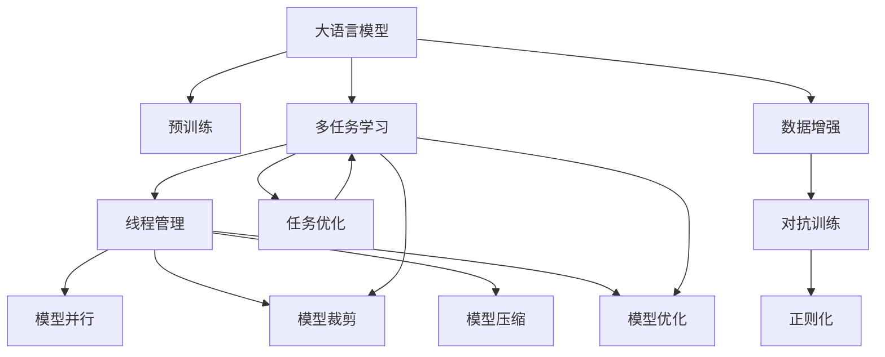

                 

# 多任务AI：LLM的线程管理

> 关键词：
- 多任务AI
- 大语言模型(LLM)
- 线程管理
- 模型并行
- 模型裁剪
- 模型压缩
- 模型优化
- 任务优化
- 深度学习

## 1. 背景介绍

### 1.1 问题由来

随着深度学习技术的飞速发展，大语言模型（LLM），如GPT-3、BERT等，已经展示出了强大的语言处理能力。但单个LLM模型往往只能处理单一任务，如文本分类、命名实体识别等。随着任务数量的不断增加，如何在单一模型上高效管理多任务，成为当前深度学习领域的一大挑战。

### 1.2 问题核心关键点

多任务AI旨在利用单一模型处理多个任务，以提高资源利用率和性能。LLM的多任务AI关键点在于如何实现多个任务的高效并行管理。一般而言，多任务AI的挑战包括：

- 数据集不均衡：不同任务的标注数据规模可能差异较大，导致模型在少数数据集上表现欠佳。
- 参数共享：不同任务可能共享模型参数，如何合理分配参数资源，避免过拟合，是一个重要问题。
- 任务间相互影响：不同任务可能存在数据依赖或特征依赖，如何设计模型结构，减少任务间干扰，提升任务间独立性，是另一个难点。
- 模型优化复杂度：多任务学习需要优化多个损失函数，如何在模型训练和推理过程中，灵活调整不同任务的优化策略，是最后一个挑战。

### 1.3 问题研究意义

多任务AI通过在单一模型上处理多个任务，不仅可以提高模型利用率和性能，还能降低标注成本，提升模型泛化能力。LLM的多任务AI，通过线程管理，可以在有限资源下高效处理大规模任务，加速模型开发和部署进程。此外，多任务AI还能提升模型对于上下文信息的理解和利用，增强模型的智能性和可解释性。

## 2. 核心概念与联系

### 2.1 核心概念概述

为更好地理解多任务AI的线程管理，本节将介绍几个密切相关的核心概念：

- **大语言模型(LLM)**：以自回归(如GPT)或自编码(如BERT)模型为代表的大规模预训练语言模型。通过在大规模无标签文本语料上进行预训练，学习通用的语言知识。
- **多任务学习(MTL)**：在同一模型上训练多个任务，通过共享模型参数，利用多任务之间的相关性提升性能。
- **线程管理(Thread Management)**：在LLM中，通过设计合理的线程结构，使得多个任务能够并行处理，提高模型性能和资源利用率。
- **模型并行(Model Parallelism)**：通过将模型分成多个子模型，并行训练和推理，以提高计算效率和性能。
- **模型裁剪(Model Pruning)**：通过去除不必要的参数，减小模型规模，提升计算效率和模型泛化能力。
- **模型压缩(Model Compression)**：通过量化、稀疏化等技术，减小模型存储空间，提升推理速度。
- **模型优化(Model Optimization)**：通过调整模型结构和训练策略，提高模型性能和资源利用率。
- **任务优化(Task Optimization)**：通过设计合适的任务序列和损失函数，提高模型在特定任务上的表现。

这些核心概念之间的逻辑关系可以通过以下Mermaid流程图来展示：



这个流程图展示了大语言模型的多任务AI核心概念及其之间的关系：

1. 大语言模型通过预训练获得基础能力。
2. 多任务学习在同一模型上处理多个任务，通过共享参数提升性能。
3. 线程管理设计合理的线程结构，提高并行处理效率。
4. 模型并行通过将模型分为多个子模型，提高计算效率和性能。
5. 模型裁剪去除多余参数，提高计算效率和泛化能力。
6. 模型压缩减小模型存储空间，提升推理速度。
7. 模型优化调整模型结构和训练策略，提高性能。
8. 任务优化设计合适的任务序列和损失函数，提升任务表现。
9. 数据增强通过回译、对抗样本等方式丰富训练集多样性。
10. 对抗训练加入对抗样本，提高模型鲁棒性。
11. 正则化通过L2正则、Dropout等方式防止过拟合。

这些概念共同构成了LLM的多任务AI学习框架，使其能够在多个任务间高效处理，拓展模型的应用范围和性能。

## 3. 核心算法原理 & 具体操作步骤

### 3.1 算法原理概述

多任务AI的线程管理算法，旨在设计合理的线程结构，使得多个任务能够并行处理，提高模型性能和资源利用率。其核心思想是：将单一模型划分为多个任务线程，每个线程负责处理一个特定任务，并通过合理的参数共享和数据依赖管理，提升整体模型性能。

形式化地，假设模型为 $M_{\theta}$，其中 $\theta$ 为模型参数。给定多个任务 $T=\{T_1, T_2, ..., T_N\}$，多任务AI的目标是找到一组任务线程 $\{L_1, L_2, ..., L_N\}$，使得 $L_i$ 负责处理任务 $T_i$，并最小化总体损失函数：

$$
\mathcal{L} = \sum_{i=1}^N \mathcal{L}_i(L_i)
$$

其中 $\mathcal{L}_i$ 为任务 $T_i$ 在线程 $L_i$ 上的损失函数。

通过梯度下降等优化算法，多任务AI过程不断更新模型参数 $\theta$，最小化总体损失函数 $\mathcal{L}$，使得模型在多个任务上的表现都达到最优。

### 3.2 算法步骤详解

多任务AI的线程管理一般包括以下几个关键步骤：

**Step 1: 准备任务和数据**
- 选择待处理的多任务 $T$，收集每个任务的标注数据集 $D=\{(x_i, y_i)\}_{i=1}^N$。
- 将标注数据集 $D$ 划分为训练集、验证集和测试集。

**Step 2: 设计线程结构**
- 确定多任务的线程结构，即将模型分为多个子线程。
- 设计线程之间的参数共享策略，决定哪些参数共享，哪些参数独立。
- 确定线程之间的数据依赖关系，决定哪些任务的数据可以在同一线程上处理。

**Step 3: 设置多任务超参数**
- 选择合适的优化算法及其参数，如 AdamW、SGD 等，设置学习率、批大小、迭代轮数等。
- 设置正则化技术及强度，包括权重衰减、Dropout、Early Stopping 等。

**Step 4: 执行梯度训练**
- 将训练集数据分批次输入模型，前向传播计算损失函数。
- 反向传播计算参数梯度，根据设定的优化算法和学习率更新模型参数。
- 周期性在验证集上评估模型性能，根据性能指标决定是否触发 Early Stopping。
- 重复上述步骤直到满足预设的迭代轮数或 Early Stopping 条件。

**Step 5: 测试和部署**
- 在测试集上评估多任务AI模型的总体性能，对比微调前后的精度提升。
- 使用多任务AI模型对新样本进行推理预测，集成到实际的应用系统中。
- 持续收集新的数据，定期重新训练和微调模型，以适应数据分布的变化。

以上是多任务AI的线程管理的一般流程。在实际应用中，还需要针对具体任务的特点，对线程结构进行优化设计，如改进训练目标函数，引入更多的正则化技术，搜索最优的超参数组合等，以进一步提升模型性能。

### 3.3 算法优缺点

多任务AI的线程管理算法具有以下优点：
1. 高效利用资源。通过并行处理多个任务，有效提升模型利用率和性能。
2. 降低标注成本。同一模型处理多个任务，可以共享标注数据，降低标注成本。
3. 提升模型泛化能力。多任务间的相关性使得模型能够更好地学习通用语言知识，提升泛化能力。
4. 增强模型鲁棒性。多任务训练可以提升模型对于不同数据分布的适应能力，增强鲁棒性。

同时，该方法也存在一定的局限性：
1. 模型复杂度增加。多任务处理需要更复杂的模型结构和训练策略，增加开发复杂度。
2. 参数共享风险。参数共享可能导致某个任务过拟合，影响整体性能。
3. 任务间相互干扰。不同任务的数据依赖可能导致模型间相互干扰，影响独立性。
4. 模型优化难度增大。多任务优化需要考虑多个损失函数，优化复杂度增加。

尽管存在这些局限性，但就目前而言，多任务AI的线程管理方法仍是大语言模型处理多个任务的重要手段。未来相关研究的重点在于如何进一步降低线程管理的复杂度，提高模型性能和鲁棒性，同时兼顾模型可解释性和伦理安全性等因素。

### 3.4 算法应用领域

多任务AI的线程管理算法，已经在多个NLP任务中得到了广泛的应用，例如：

- 文本分类：如情感分析、主题分类、意图识别等。通过多任务处理，提升模型在多个分类任务上的表现。
- 命名实体识别：识别文本中的人名、地名、机构名等特定实体。通过多任务处理，增强模型在实体识别和关系抽取上的表现。
- 关系抽取：从文本中抽取实体之间的语义关系。通过多任务处理，提升模型在实体关系抽取上的表现。
- 问答系统：对自然语言问题给出答案。通过多任务处理，增强模型在问题理解和答案生成上的表现。
- 机器翻译：将源语言文本翻译成目标语言。通过多任务处理，提升模型在多种语言对上的翻译性能。
- 文本摘要：将长文本压缩成简短摘要。通过多任务处理，提升模型在多场景下的摘要生成性能。
- 对话系统：使机器能够与人自然对话。通过多任务处理，增强模型在多轮对话理解与生成上的表现。

除了上述这些经典任务外，多任务AI的线程管理方法还被创新性地应用到更多场景中，如可控文本生成、常识推理、代码生成、数据增强等，为NLP技术带来了全新的突破。随着预训练模型和线程管理方法的不断进步，相信NLP技术将在更广阔的应用领域大放异彩。

## 4. 数学模型和公式 & 详细讲解 & 举例说明

### 4.1 数学模型构建

本节将使用数学语言对多任务AI的线程管理过程进行更加严格的刻画。

记模型为 $M_{\theta}:\mathcal{X} \rightarrow \mathcal{Y}$，其中 $\mathcal{X}$ 为输入空间，$\mathcal{Y}$ 为输出空间，$\theta$ 为模型参数。假设多任务 $T=\{T_1, T_2, ..., T_N\}$ 的训练集为 $D=\{(x_i, y_i)\}_{i=1}^N$，其中 $(x_i, y_i)$ 为任务 $T_i$ 的样本和标签。

定义模型 $M_{\theta}$ 在任务 $T_i$ 上的损失函数为 $\ell_i(M_{\theta}(x_i),y_i)$，则在数据集 $D$ 上的经验风险为：

$$
\mathcal{L}_i = \frac{1}{N}\sum_{i=1}^N \ell_i(M_{\theta}(x_i),y_i)
$$

多任务AI的目标是找到最优参数 $\theta$，使得模型在多个任务上的表现都达到最优：

$$
\theta^* = \mathop{\arg\min}_{\theta} \sum_{i=1}^N \mathcal{L}_i(\theta)
$$

在实践中，我们通常使用基于梯度的优化算法（如SGD、Adam等）来近似求解上述最优化问题。设 $\eta$ 为学习率，$\lambda$ 为正则化系数，则参数的更新公式为：

$$
\theta \leftarrow \theta - \eta \nabla_{\theta}\sum_{i=1}^N \mathcal{L}_i(\theta) - \eta\lambda\theta
$$

其中 $\nabla_{\theta}\sum_{i=1}^N \mathcal{L}_i(\theta)$ 为总体损失函数对参数 $\theta$ 的梯度，可通过反向传播算法高效计算。

### 4.2 公式推导过程

以下我们以二分类任务和多情感分析为例，推导多任务AI的损失函数及其梯度的计算公式。

假设模型 $M_{\theta}$ 在输入 $x$ 上的输出为 $\hat{y}=M_{\theta}(x) \in [0,1]$，表示样本属于正类的概率。真实标签 $y \in \{0,1\}$。则二分类交叉熵损失函数定义为：

$$
\ell_i(M_{\theta}(x_i),y_i) = -[y_i\log \hat{y} + (1-y_i)\log (1-\hat{y})]
$$

假设模型同时负责处理情感分类任务，则情感分类任务的损失函数为：

$$
\ell_i^s(M_{\theta}(x_i),y_i) = -\sum_{c=1}^{C}[y_{i,c}\log M_{\theta}(x_i)^c + (1-y_{i,c})\log (1-M_{\theta}(x_i)^c)]
$$

其中 $C$ 为情感类别数，$y_{i,c}$ 表示样本 $(x_i, y_i)$ 属于第 $c$ 个情感类别的概率。

将上述两个损失函数代入总体损失函数，得：

$$
\mathcal{L} = \mathcal{L}_1 + \mathcal{L}_s = \frac{1}{N}\sum_{i=1}^N [y_i\log M_{\theta}(x_i)+(1-y_i)\log(1-M_{\theta}(x_i))] + \frac{1}{N}\sum_{i=1}^N \sum_{c=1}^{C}[y_{i,c}\log M_{\theta}(x_i)^c + (1-y_{i,c})\log (1-M_{\theta}(x_i)^c)]
$$

根据链式法则，总体损失函数对参数 $\theta_k$ 的梯度为：

$$
\frac{\partial \mathcal{L}}{\partial \theta_k} = \sum_{i=1}^N (\frac{\partial \mathcal{L}_i}{\partial \theta_k} + \frac{\partial \mathcal{L}_s}{\partial \theta_k})
$$

其中 $\frac{\partial \mathcal{L}_i}{\partial \theta_k}$ 和 $\frac{\partial \mathcal{L}_s}{\partial \theta_k}$ 分别为任务 $T_i$ 和情感分类任务的损失函数对参数 $\theta_k$ 的梯度，可通过反向传播算法高效计算。

在得到总体损失函数的梯度后，即可带入参数更新公式，完成模型的迭代优化。重复上述过程直至收敛，最终得到适应多任务AI的模型参数 $\theta^*$。

## 5. 项目实践：代码实例和详细解释说明

### 5.1 开发环境搭建

在进行多任务AI实践前，我们需要准备好开发环境。以下是使用Python进行PyTorch开发的环境配置流程：

1. 安装Anaconda：从官网下载并安装Anaconda，用于创建独立的Python环境。

2. 创建并激活虚拟环境：
```bash
conda create -n pytorch-env python=3.8 
conda activate pytorch-env
```

3. 安装PyTorch：根据CUDA版本，从官网获取对应的安装命令。例如：
```bash
conda install pytorch torchvision torchaudio cudatoolkit=11.1 -c pytorch -c conda-forge
```

4. 安装Transformer库：
```bash
pip install transformers
```

5. 安装各类工具包：
```bash
pip install numpy pandas scikit-learn matplotlib tqdm jupyter notebook ipython
```

完成上述步骤后，即可在`pytorch-env`环境中开始多任务AI实践。

### 5.2 源代码详细实现

这里我们以情感分类和多情感分析任务为例，给出使用Transformers库对BERT模型进行多任务AI的PyTorch代码实现。

首先，定义多任务数据处理函数：

```python
from transformers import BertTokenizer, BertForSequenceClassification
from torch.utils.data import Dataset
import torch

class MultiTaskDataset(Dataset):
    def __init__(self, texts, tags, task_labels, tokenizer, max_len=128):
        self.texts = texts
        self.tags = tags
        self.task_labels = task_labels
        self.tokenizer = tokenizer
        self.max_len = max_len
        
    def __len__(self):
        return len(self.texts)
    
    def __getitem__(self, item):
        text = self.texts[item]
        tags = self.tags[item]
        task_labels = self.task_labels[item]
        
        encoding = self.tokenizer(text, return_tensors='pt', max_length=self.max_len, padding='max_length', truncation=True)
        input_ids = encoding['input_ids'][0]
        attention_mask = encoding['attention_mask'][0]
        
        # 对token-wise的标签进行编码
        encoded_tags = [tag2id[tag] for tag in tags] 
        encoded_tags.extend([tag2id['O']] * (self.max_len - len(encoded_tags)))
        labels = torch.tensor(encoded_tags, dtype=torch.long)
        
        return {'input_ids': input_ids, 
                'attention_mask': attention_mask,
                'task_labels': task_labels,
                'labels': labels}

# 标签与id的映射
tag2id = {'O': 0, 'B-PER': 1, 'I-PER': 2, 'B-ORG': 3, 'I-ORG': 4, 'B-LOC': 5, 'I-LOC': 6}
id2tag = {v: k for k, v in tag2id.items()}

# 创建dataset
tokenizer = BertTokenizer.from_pretrained('bert-base-cased')

train_dataset = MultiTaskDataset(train_texts, train_tags, train_task_labels, tokenizer)
dev_dataset = MultiTaskDataset(dev_texts, dev_tags, dev_task_labels, tokenizer)
test_dataset = MultiTaskDataset(test_texts, test_tags, test_task_labels, tokenizer)
```

然后，定义模型和优化器：

```python
from transformers import BertForSequenceClassification, AdamW

model = BertForSequenceClassification.from_pretrained('bert-base-cased', num_labels=len(tag2id))

optimizer = AdamW(model.parameters(), lr=2e-5)
```

接着，定义训练和评估函数：

```python
from torch.utils.data import DataLoader
from tqdm import tqdm
from sklearn.metrics import classification_report

device = torch.device('cuda') if torch.cuda.is_available() else torch.device('cpu')
model.to(device)

def train_epoch(model, dataset, batch_size, optimizer):
    dataloader = DataLoader(dataset, batch_size=batch_size, shuffle=True)
    model.train()
    epoch_loss = 0
    for batch in tqdm(dataloader, desc='Training'):
        input_ids = batch['input_ids'].to(device)
        attention_mask = batch['attention_mask'].to(device)
        task_labels = batch['task_labels'].to(device)
        labels = batch['labels'].to(device)
        model.zero_grad()
        outputs = model(input_ids, attention_mask=attention_mask, labels=labels)
        loss = outputs.loss
        epoch_loss += loss.item()
        loss.backward()
        optimizer.step()
    return epoch_loss / len(dataloader)

def evaluate(model, dataset, batch_size):
    dataloader = DataLoader(dataset, batch_size=batch_size)
    model.eval()
    preds, labels = [], []
    with torch.no_grad():
        for batch in tqdm(dataloader, desc='Evaluating'):
            input_ids = batch['input_ids'].to(device)
            attention_mask = batch['attention_mask'].to(device)
            task_labels = batch['task_labels'].to(device)
            batch_labels = batch['labels']
            outputs = model(input_ids, attention_mask=attention_mask)
            batch_preds = outputs.logits.argmax(dim=2).to('cpu').tolist()
            batch_labels = batch_labels.to('cpu').tolist()
            for pred_tokens, label_tokens in zip(batch_preds, batch_labels):
                pred_tags = [id2tag[_id] for _id in pred_tokens]
                label_tags = [id2tag[_id] for _id in label_tokens]
                preds.append(pred_tags[:len(label_tags)])
                labels.append(label_tags)
                
    print(classification_report(labels, preds))
```

最后，启动训练流程并在测试集上评估：

```python
epochs = 5
batch_size = 16

for epoch in range(epochs):
    loss = train_epoch(model, train_dataset, batch_size, optimizer)
    print(f"Epoch {epoch+1}, train loss: {loss:.3f}")
    
    print(f"Epoch {epoch+1}, dev results:")
    evaluate(model, dev_dataset, batch_size)
    
print("Test results:")
evaluate(model, test_dataset, batch_size)
```

以上就是使用PyTorch对BERT模型进行情感分类和多情感分析任务的多任务AI的完整代码实现。可以看到，得益于Transformers库的强大封装，我们可以用相对简洁的代码完成BERT模型的加载和多任务AI的训练。

### 5.3 代码解读与分析

让我们再详细解读一下关键代码的实现细节：

**MultiTaskDataset类**：
- `__init__`方法：初始化文本、标签、任务标签、分词器等关键组件。
- `__len__`方法：返回数据集的样本数量。
- `__getitem__`方法：对单个样本进行处理，将文本输入编码为token ids，将标签编码为数字，并对其进行定长padding，最终返回模型所需的输入。

**tag2id和id2tag字典**：
- 定义了标签与数字id之间的映射关系，用于将token-wise的预测结果解码回真实的标签。

**训练和评估函数**：
- 使用PyTorch的DataLoader对数据集进行批次化加载，供模型训练和推理使用。
- 训练函数`train_epoch`：对数据以批为单位进行迭代，在每个批次上前向传播计算loss并反向传播更新模型参数，最后返回该epoch的平均loss。
- 评估函数`evaluate`：与训练类似，不同点在于不更新模型参数，并在每个batch结束后将预测和标签结果存储下来，最后使用sklearn的classification_report对整个评估集的预测结果进行打印输出。

**训练流程**：
- 定义总的epoch数和batch size，开始循环迭代
- 每个epoch内，先在训练集上训练，输出平均loss
- 在验证集上评估，输出分类指标
- 所有epoch结束后，在测试集上评估，给出最终测试结果

可以看到，PyTorch配合Transformers库使得BERT模型的多任务AI代码实现变得简洁高效。开发者可以将更多精力放在数据处理、模型改进等高层逻辑上，而不必过多关注底层的实现细节。

当然，工业级的系统实现还需考虑更多因素，如模型的保存和部署、超参数的自动搜索、更灵活的任务适配层等。但核心的多任务AI范式基本与此类似。

## 6. 实际应用场景
### 6.1 智能客服系统

基于多任务AI的大语言模型，可以广泛应用于智能客服系统的构建。传统客服往往需要配备大量人力，高峰期响应缓慢，且一致性和专业性难以保证。而使用多任务AI的大语言模型，可以7x24小时不间断服务，快速响应客户咨询，用自然流畅的语言解答各类常见问题。

在技术实现上，可以收集企业内部的历史客服对话记录，将问题和最佳答复构建成监督数据，在此基础上对预训练多任务模型进行微调。微调后的多任务模型能够自动理解用户意图，匹配最合适的答案模板进行回复。对于客户提出的新问题，还可以接入检索系统实时搜索相关内容，动态组织生成回答。如此构建的智能客服系统，能大幅提升客户咨询体验和问题解决效率。

### 6.2 金融舆情监测

金融机构需要实时监测市场舆论动向，以便及时应对负面信息传播，规避金融风险。传统的人工监测方式成本高、效率低，难以应对网络时代海量信息爆发的挑战。基于多任务AI的文本分类和情感分析技术，为金融舆情监测提供了新的解决方案。

具体而言，可以收集金融领域相关的新闻、报道、评论等文本数据，并对其进行主题标注和情感标注。在此基础上对预训练语言模型进行多任务微调，使其能够自动判断文本属于何种主题，情感倾向是正面、中性还是负面。将多任务AI模型应用到实时抓取的网络文本数据，就能够自动监测不同主题下的情感变化趋势，一旦发现负面信息激增等异常情况，系统便会自动预警，帮助金融机构快速应对潜在风险。

### 6.3 个性化推荐系统

当前的推荐系统往往只依赖用户的历史行为数据进行物品推荐，无法深入理解用户的真实兴趣偏好。基于多任务AI的多语言翻译模型，个性化推荐系统可以更好地挖掘用户行为背后的语义信息，从而提供更精准、多样的推荐内容。

在实践中，可以收集用户浏览、点击、评论、分享等行为数据，提取和用户交互的物品标题、描述、标签等文本内容。将文本内容作为模型输入，用户的后续行为（如是否点击、购买等）作为监督信号，在此基础上多任务微调预训练语言模型。多任务微调后的模型能够从文本内容中准确把握用户的兴趣点。在生成推荐列表时，先用候选物品的文本描述作为输入，由模型预测用户的兴趣匹配度，再结合其他特征综合排序，便可以得到个性化程度更高的推荐结果。

### 6.4 未来应用展望

随着多任务AI技术的不断发展，基于多任务AI的多语言翻译模型将在更多领域得到应用，为传统行业带来变革性影响。

在智慧医疗领域，基于多任务AI的问答系统、病历分析、药物研发等应用将提升医疗服务的智能化水平，辅助医生诊疗，加速新药开发进程。

在智能教育领域，多任务AI可应用于作业批改、学情分析、知识推荐等方面，因材施教，促进教育公平，提高教学质量。

在智慧城市治理中，多任务AI可应用于城市事件监测、舆情分析、应急指挥等环节，提高城市管理的自动化和智能化水平，构建更安全、高效的未来城市。

此外，在企业生产、社会治理、文娱传媒等众多领域，基于多任务AI的智能系统也将不断涌现，为经济社会发展注入新的动力。相信随着技术的日益成熟，多任务AI必将成为AI落地应用的重要范式，推动人工智能技术在各个垂直行业的深入应用。

## 7. 工具和资源推荐
### 7.1 学习资源推荐

为了帮助开发者系统掌握多任务AI的理论基础和实践技巧，这里推荐一些优质的学习资源：

1. 《Transformer from the Ground Up》系列博文：由大模型技术专家撰写，深入浅出地介绍了Transformer原理、BERT模型、多任务AI等前沿话题。

2. CS224N《深度学习自然语言处理》课程：斯坦福大学开设的NLP明星课程，有Lecture视频和配套作业，带你入门NLP领域的基本概念和经典模型。

3. 《Natural Language Processing with Transformers》书籍：Transformers库的作者所著，全面介绍了如何使用Transformers库进行NLP任务开发，包括多任务AI在内的诸多范式。

4. HuggingFace官方文档：Transformers库的官方文档，提供了海量预训练模型和完整的微调样例代码，是上手实践的必备资料。

5. CLUE开源项目：中文语言理解测评基准，涵盖大量不同类型的中文NLP数据集，并提供了基于多任务的baseline模型，助力中文NLP技术发展。

通过对这些资源的学习实践，相信你一定能够快速掌握多任务AI的精髓，并用于解决实际的NLP问题。
###  7.2 开发工具推荐

高效的开发离不开优秀的工具支持。以下是几款用于多任务AI开发的常用工具：

1. PyTorch：基于Python的开源深度学习框架，灵活动态的计算图，适合快速迭代研究。大部分预训练语言模型都有PyTorch版本的实现。

2. TensorFlow：由Google主导开发的开源深度学习框架，生产部署方便，适合大规模工程应用。同样有丰富的预训练语言模型资源。

3. Transformers库：HuggingFace开发的NLP工具库，集成了众多SOTA语言模型，支持PyTorch和TensorFlow，是进行多任务AI开发的利器。

4. Weights & Biases：模型训练的实验跟踪工具，可以记录和可视化模型训练过程中的各项指标，方便对比和调优。与主流深度学习框架无缝集成。

5. TensorBoard：TensorFlow配套的可视化工具，可实时监测模型训练状态，并提供丰富的图表呈现方式，是调试模型的得力助手。

6. Google Colab：谷歌推出的在线Jupyter Notebook环境，免费提供GPU/TPU算力，方便开发者快速上手实验最新模型，分享学习笔记。

合理利用这些工具，可以显著提升多任务AI任务的开发效率，加快创新迭代的步伐。

### 7.3 相关论文推荐

多任务AI的发展源于学界的持续研究。以下是几篇奠基性的相关论文，推荐阅读：

1. Deep Multitask Learning: A Survey on Learning Complementary Tasks with a Single Model：系统综述了多任务学习的基本概念和常用方法，为多任务AI的研究提供了重要基础。

2. Transformers: State-of-the-Art Machine Translation, Sentence Segmentation, and Part-of-Speech Tagging：提出Transformer模型，展示了其在多语言翻译和多任务处理上的卓越表现。

3. Multi-task Learning with Multiple Granular Tasks for Text Generation：提出多粒度多任务学习框架，提升了模型的多任务处理能力。

4. Multi-Task Multi-Label Classification with Binary-Labeling Strategy：提出二标签策略，提升多任务学习在多标签分类任务上的效果。

5. Semi-Supervised Multi-task Learning for Weakly Supervised Pretraining：提出半监督多任务学习框架，利用无标签数据提升多任务学习的效果。

这些论文代表了大语言模型多任务AI的发展脉络。通过学习这些前沿成果，可以帮助研究者把握学科前进方向，激发更多的创新灵感。

## 8. 总结：未来发展趋势与挑战

### 8.1 总结

本文对多任务AI的线程管理算法进行了全面系统的介绍。首先阐述了多任务AI的研究背景和意义，明确了多任务AI在提高模型利用率和性能方面的独特价值。其次，从原理到实践，详细讲解了多任务AI的数学原理和关键步骤，给出了多任务AI任务开发的完整代码实例。同时，本文还广泛探讨了多任务AI在智能客服、金融舆情、个性化推荐等多个行业领域的应用前景，展示了多任务AI的巨大潜力。此外，本文精选了多任务AI的学习资源，力求为读者提供全方位的技术指引。

通过本文的系统梳理，可以看到，多任务AI的线程管理算法正在成为多语言翻译模型的重要手段，极大地拓展了模型的应用边界，催生了更多的落地场景。受益于大规模语料的预训练，多任务AI模型以更低的时间和标注成本，在小样本条件下也能取得不俗的效果，有力推动了NLP技术的产业化进程。未来，伴随多任务AI技术的不断进步，基于多任务AI的多语言翻译模型将在更广阔的应用领域大放异彩，深刻影响人类的生产生活方式。

### 8.2 未来发展趋势

展望未来，多任务AI的线程管理技术将呈现以下几个发展趋势：

1. 模型规模持续增大。随着算力成本的下降和数据规模的扩张，预训练语言模型的参数量还将持续增长。超大规模语言模型蕴含的丰富语言知识，有望支撑更加复杂多变的任务处理。

2. 多任务学习范式更加多样化。除了传统的单任务和多粒度多任务学习外，未来将涌现更多多任务学习范式，如微调、提示学习等，提升模型的多任务处理能力。

3. 数据增强技术发展。数据增强技术通过回译、对抗样本等方式丰富训练集多样性，提升多任务AI的效果。未来数据增强技术将更加灵活，更具普适性。

4. 模型压缩和剪枝技术进步。模型压缩和剪枝技术通过减小模型规模，提升计算效率和泛化能力。未来将涌现更多高效的模型压缩和剪枝算法。

5. 模型裁剪和并行优化。模型裁剪通过去除多余参数，提高计算效率和泛化能力。模型并行通过将模型分为多个子模型，提高计算效率和性能。

6. 多任务优化策略优化。多任务优化需要考虑多个任务间的相关性和优化策略，未来将涌现更多高效的多任务优化方法。

以上趋势凸显了多任务AI的线程管理技术的广阔前景。这些方向的探索发展，必将进一步提升多任务AI的性能和资源利用率，为多语言翻译模型的落地应用带来新的突破。

### 8.3 面临的挑战

尽管多任务AI的线程管理技术已经取得了瞩目成就，但在迈向更加智能化、普适化应用的过程中，它仍面临着诸多挑战：

1. 模型复杂度增加。多任务AI需要设计复杂的模型结构和训练策略，增加开发复杂度。

2. 参数共享风险。参数共享可能导致某个任务过拟合，影响整体性能。

3. 任务间相互干扰。不同任务的数据依赖可能导致模型间相互干扰，影响独立性。

4. 模型优化难度增大。多任务优化需要考虑多个任务间的相关性和优化策略，优化复杂度增加。

5. 模型可解释性不足。多任务AI模型通常更像"黑盒"系统，难以解释其内部工作机制和决策逻辑。

6. 伦理和安全问题。多任务AI模型可能学习到有偏见、有害的信息，通过多任务传递到下游任务，产生误导性、歧视性的输出，给实际应用带来安全隐患。

尽管存在这些挑战，但多任务AI的线程管理技术仍是大语言模型处理多个任务的重要手段。未来相关研究需要在模型设计、训练策略、优化方法等方面进行深入探索，以克服现有挑战，提升多任务AI的性能和鲁棒性。

### 8.4 研究展望

面向未来，多任务AI的线程管理技术需要在以下几个方面寻求新的突破：

1. 探索无监督和半监督多任务学习方法。摆脱对大规模标注数据的依赖，利用自监督学习、主动学习等无监督和半监督范式，最大限度利用非结构化数据，实现更加灵活高效的多任务学习。

2. 研究参数高效和计算高效的多任务学习范式。开发更加参数高效的模型裁剪和并行优化方法，在固定大部分预训练参数的同时，只更新极少量的任务相关参数。

3. 融合因果和对比学习范式。通过引入因果推断和对比学习思想，增强多任务学习建立稳定因果关系的能力，学习更加普适、鲁棒的语言表征，从而提升模型泛化性和抗干扰能力。

4. 引入更多先验知识。将符号化的先验知识，如知识图谱、逻辑规则等，与神经网络模型进行巧妙融合，引导多任务学习过程学习更准确、合理的语言模型。同时加强不同模态数据的整合，实现视觉、语音等多模态信息与文本信息的协同建模。

5. 结合因果分析和博弈论工具。将因果分析方法引入多任务学习，识别出模型决策的关键特征，增强输出解释的因果性和逻辑性。借助博弈论工具刻画人机交互过程，主动探索并规避模型的脆弱点，提高系统稳定性。

6. 纳入伦理道德约束。在多任务学习目标中引入伦理导向的评估指标，过滤和惩罚有偏见、有害的输出倾向。同时加强人工干预和审核，建立模型行为的监管机制，确保输出符合人类价值观和伦理道德。

这些研究方向的探索，必将引领多任务AI的线程管理技术迈向更高的台阶，为构建安全、可靠、可解释、可控的智能系统铺平道路。面向未来，多任务AI的线程管理技术还需要与其他人工智能技术进行更深入的融合，如知识表示、因果推理、强化学习等，多路径协同发力，共同推动自然语言理解和智能交互系统的进步。只有勇于创新、敢于突破，才能不断拓展多语言翻译模型的边界，让智能技术更好地造福人类社会。

## 9. 附录：常见问题与解答

**Q1：多任务AI是否可以适用于所有NLP任务？**

A: 多任务AI在大多数NLP任务上都能取得不错的效果，特别是对于数据量较小的任务。但对于一些特定领域的任务，如医学、法律等，仅仅依靠通用语料预训练的模型可能难以很好地适应。此时需要在特定领域语料上进一步预训练，再进行多任务微调，才能获得理想效果。此外，对于一些需要时效性、个性化很强的任务，如对话、推荐等，多任务AI方法也需要针对性的改进优化。

**Q2：多任务AI中如何处理不同任务间的相关性？**

A: 多任务AI通常通过共享模型参数来处理不同任务间的相关性。不同任务的特征可能具有共通性，如所有分类任务都需要计算句法特征，可以将这些特征编码为共享参数，减少参数冗余，提升资源利用率。此外，多任务AI还可以使用微调、预训练等技术，通过优化模型结构和训练策略，提高任务间独立性，减少相互干扰。

**Q3：多任务AI在处理数据不均衡问题时有哪些解决方案？**

A: 多任务AI在处理数据不均衡问题时，通常有以下几种解决方案：
1. 数据增强：通过回译、近义替换等方式扩充训练集。
2. 模型裁剪：对数据量大的任务进行裁剪，减少过拟合风险。
3. 加权损失函数：对不同任务赋予不同的权重，平衡损失函数。
4. 集成学习：将多任务模型集成起来，提高泛化能力。

这些方法通常需要根据具体任务和数据特点进行灵活组合。只有在数据、模型、训练、推理等各环节进行全面优化，才能最大限度地发挥多任务AI的潜力。

**Q4：多任务AI在落地部署时需要注意哪些问题？**

A: 将多任务AI模型转化为实际应用，还需要考虑以下因素：
1. 模型裁剪：去除不必要的层和参数，减小模型尺寸，加快推理速度。
2. 量化加速：将浮点模型转为定点模型，压缩存储空间，提高计算效率。
3. 服务化封装：将模型封装为标准化服务接口，便于集成调用。
4. 弹性伸缩：根据请求流量动态调整资源配置，平衡服务质量和成本。
5. 监控告警：实时采集系统指标，设置异常告警阈值，确保服务稳定性。
6. 安全防护：采用访问鉴权、数据脱敏等措施，保障数据和模型安全。

多任务AI的线程管理需要开发者根据具体任务，不断迭代和优化模型、数据和算法，方能得到理想的效果。

**Q5：多任务AI在实际应用中常见的优化策略有哪些？**

A: 多任务AI在实际应用中常见的优化策略包括：
1. 数据增强：通过回译、对抗样本等方式丰富训练集多样性。
2. 正则化：使用L2正则、Dropout、Early Stopping等防止过拟合。
3. 对抗训练：加入对抗样本，提高模型鲁棒性。
4. 模型并行：将模型分为多个子模型，并行训练和推理。
5. 模型压缩：使用量化、稀疏化等技术减小模型存储空间，提升推理速度。
6. 任务优化：设计合适的任务序列和损失函数，提高模型在特定任务上的表现。

这些策略往往需要根据具体任务和数据特点进行灵活组合。只有在数据、模型、训练、推理等各环节进行全面优化，才能最大限度地发挥多任务AI的威力。

---

作者：禅与计算机程序设计艺术 / Zen and the Art of Computer Programming

