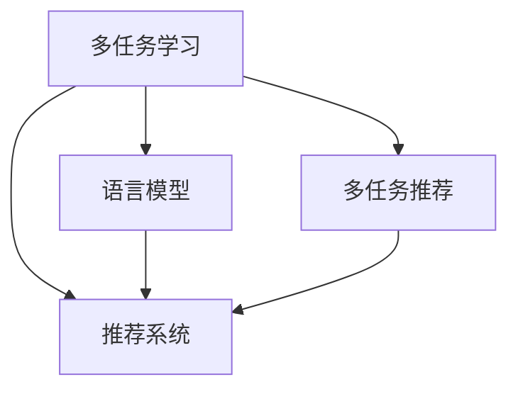

                 

# 多任务推荐：LLM的统一框架

> 关键词：多任务学习(Multi-task Learning)，多任务推荐(Multi-task Recommendation)，语言模型(Language Model)，推荐系统(Recommendation System)，个性化推荐(Personalized Recommendation)

## 1. 背景介绍

在数字时代，推荐系统已经成为人们获取信息的重要手段，广泛应用于电子商务、社交媒体、内容服务等领域。然而，传统的推荐系统往往只能解决单一任务，如商品推荐、新闻推荐等，无法综合利用用户多维度的数据信息，导致推荐效果单一，用户体验不够丰富。为了提升推荐系统的性能和个性化程度，多任务推荐成为近年来的研究热点。

多任务推荐指的是同时优化多个推荐子任务，如商品推荐、新闻推荐、视频推荐等，通过共享模型参数，实现任务之间的协同优化。相比于单一任务推荐，多任务推荐可以综合利用用户行为数据、内容数据、社交数据等不同来源的信息，实现更全面、准确的推荐结果。多任务推荐的核心在于如何构建一个统一的多任务学习框架，实现各个任务之间的协同训练。

## 2. 核心概念与联系

### 2.1 核心概念概述

为更好地理解多任务推荐，我们需要首先掌握以下核心概念：

- 多任务学习(Multi-task Learning, MTL)：在多个相关任务上共同优化模型参数，实现任务间的知识共享和协同优化。MTL可以帮助模型更好地利用多源数据，提升推荐系统的性能和个性化程度。

- 多任务推荐(Multi-task Recommendation, MTR)：在推荐任务中，同时优化多个子任务，如商品推荐、新闻推荐、视频推荐等，通过共享模型参数，实现任务之间的协同优化。

- 语言模型(Language Model)：通过自然语言训练的深度学习模型，能够理解和生成自然语言文本，在多任务推荐中可以作为用户兴趣表达、商品内容描述等信息的表示工具。

- 推荐系统(Recommendation System, RS)：能够根据用户历史行为和偏好，推荐可能感兴趣的物品的系统，如商品、新闻、视频等。推荐系统是实现多任务推荐的核心平台。

- 个性化推荐(Personalized Recommendation)：根据用户个体特征，推荐符合其个性化需求的内容，提升用户体验和满意度。个性化推荐是推荐系统的目标之一。

这些核心概念之间的逻辑关系可以通过以下Mermaid流程图来展示：



这个流程图展示了大语言模型在多任务推荐中的核心作用：

1. 多任务学习通过共享模型参数，优化多个推荐子任务，实现任务间的协同优化。
2. 语言模型可以用于表达用户兴趣、商品内容等信息，作为推荐系统的输入。
3. 推荐系统通过多任务推荐框架，综合利用多源数据，提升推荐效果和个性化程度。
4. 个性化推荐是推荐系统的最终目标，通过多任务推荐框架实现。

## 3. 核心算法原理 & 具体操作步骤
### 3.1 算法原理概述

多任务推荐的核心在于构建一个统一的多任务学习框架，实现多个推荐子任务之间的协同优化。其基本思想是：将多个推荐子任务映射为共享的多任务损失函数，通过联合优化该损失函数，最大化所有推荐子任务的综合性能。

假设有 $K$ 个推荐子任务，每个任务的目标是最大化对应任务的损失函数。则多任务推荐的目标可以表示为：

$$
\min_{\theta} \frac{1}{K}\sum_{k=1}^K \ell_k(M_{\theta}(x_k),y_k)
$$

其中 $M_{\theta}$ 为共享的模型参数，$x_k$ 为第 $k$ 个任务的数据，$y_k$ 为对应的标签，$\ell_k$ 为第 $k$ 个任务的目标损失函数。

通过最小化上述联合损失函数，可以实现多个推荐子任务之间的协同优化，提升推荐系统的综合性能。

### 3.2 算法步骤详解

基于上述原理，多任务推荐的一般步骤如下：

**Step 1: 数据预处理**

- 准备多任务推荐数据集，包括用户行为数据、商品内容数据、社交数据等。数据集需要标注各个推荐子任务对应的标签，如点击率、购买率、评论数等。
- 对数据进行预处理，包括去噪、归一化、特征工程等。

**Step 2: 构建多任务损失函数**

- 根据各个推荐子任务的目标，设计对应的损失函数。如点击率任务可以采用交叉熵损失，购买率任务可以采用二分类损失，评论数任务可以采用回归损失等。
- 将各个任务的目标损失函数组合成一个多任务损失函数，通常可以采用权重和的形式进行加权求和。

**Step 3: 选择模型结构**

- 选择合适的多任务学习模型结构，如多任务卷积神经网络(MTCNN)、多任务自编码器(MTE)等。
- 设计多任务学习模型中各任务之间的共享层和任务特定层，实现任务之间的知识共享和协同优化。

**Step 4: 设置训练参数**

- 设置优化器及其参数，如Adam、SGD等，设置学习率、批大小、迭代轮数等。
- 设置任务之间的权重，平衡各个任务的损失函数权重。

**Step 5: 执行联合训练**

- 将数据集按照任务划分成多个子集，交替进行多任务训练。
- 在每个epoch中，首先在前向传播中计算各个任务的损失函数，然后反向传播更新模型参数。
- 周期性在验证集上评估模型性能，根据性能指标决定是否触发Early Stopping。
- 重复上述步骤直至满足预设的迭代轮数或Early Stopping条件。

**Step 6: 模型评估与部署**

- 在测试集上评估多任务推荐模型的综合性能，对比各推荐子任务的提升效果。
- 使用多任务推荐模型对新用户行为进行预测，集成到实际推荐系统中。
- 持续收集新的数据，定期重新训练模型，以适应数据分布的变化。

以上是多任务推荐的一般流程。在实际应用中，还需要根据具体任务和数据特点进行优化设计，如改进任务损失函数，引入更多的正则化技术，搜索最优的超参数组合等，以进一步提升模型性能。

### 3.3 算法优缺点

多任务推荐具有以下优点：

1. 多源数据融合：多任务推荐可以综合利用用户行为数据、商品内容数据、社交数据等不同来源的信息，提升推荐系统的全面性和准确性。
2. 推荐效果提升：通过任务之间的协同优化，多任务推荐可以在一定程度上提升推荐系统的综合性能和个性化程度。
3. 模型训练高效：多任务推荐可以共享模型参数，减少冗余计算，提高训练效率。
4. 模型适应性强：多任务推荐可以通过增加任务数量，灵活应对不同场景下的推荐需求。

同时，该方法也存在一定的局限性：

1. 数据标注成本高：多任务推荐需要标注多个任务的标签，增加标注成本和工作量。
2. 任务冲突：不同的推荐子任务之间可能存在冲突，如商品推荐和新闻推荐在特定用户行为下可能出现矛盾。
3. 模型复杂度高：多任务推荐模型结构复杂，增加了模型训练和调优的难度。
4. 任务不均衡：不同的推荐子任务可能存在数据量不均衡的情况，导致任务之间的协同优化效果不佳。
5. 过拟合风险高：多任务推荐模型在复杂多变的推荐任务中，容易出现过拟合，影响推荐效果。

尽管存在这些局限性，但就目前而言，多任务推荐方法仍然是大规模推荐系统的重要研究范式。未来相关研究的重点在于如何进一步降低数据标注成本，解决任务冲突问题，提高模型的适应性和可解释性，以及优化任务之间的协同优化效果。

### 3.4 算法应用领域

多任务推荐在多个推荐场景中得到了广泛应用，如电子商务、社交媒体、内容服务、医疗健康等，提升了推荐系统的性能和个性化程度。以下是几个典型的应用场景：

- 电子商务推荐：同时优化商品推荐、广告推荐、搜索排序等任务，综合利用用户行为数据、商品内容数据、广告点击数据等，提升购物体验。
- 社交媒体推荐：同时优化好友推荐、内容推荐、话题推荐等任务，综合利用用户关系数据、内容数据、话题数据等，提升用户黏性。
- 内容服务推荐：同时优化新闻推荐、视频推荐、音频推荐等任务，综合利用用户行为数据、内容元数据、社交数据等，提升内容发现和消费体验。
- 医疗健康推荐：同时优化疾病推荐、药品推荐、医疗咨询推荐等任务，综合利用用户健康数据、医疗信息、咨询记录等，提升个性化医疗服务体验。

除了上述这些经典应用场景外，多任务推荐还被创新性地应用到更多场景中，如智能家居、智慧城市、智能交通等，为推荐系统的应用场景和应用领域带来了新的突破。

## 4. 数学模型和公式 & 详细讲解  
### 4.1 数学模型构建

本节将使用数学语言对多任务推荐过程进行更加严格的刻画。

记多任务推荐系统为 $M_{\theta}:\mathcal{X} \rightarrow \mathcal{Y}$，其中 $\mathcal{X}$ 为输入空间，$\mathcal{Y}$ 为输出空间，$\theta \in \mathbb{R}^d$ 为模型参数。假设存在 $K$ 个推荐子任务，每个任务的目标为 $L_k: \mathcal{X} \rightarrow \mathbb{R}$，对应的损失函数为 $\ell_k: \mathbb{R} \times \mathbb{R} \rightarrow \mathbb{R}$。则多任务推荐系统的联合损失函数可以表示为：

$$
\mathcal{L}(\theta) = \frac{1}{K}\sum_{k=1}^K \ell_k(M_{\theta}(x_k),y_k)
$$

其中 $M_{\theta}(x_k)=L_k(M_{\theta}(x_k))$ 为任务 $k$ 的预测输出。

### 4.2 公式推导过程

以下我们以二分类任务为例，推导多任务推荐系统中的损失函数及其梯度计算公式。

假设多任务推荐系统在输入 $x$ 上的输出为 $\hat{y}=M_{\theta}(x) \in [0,1]$，表示任务 $k$ 的预测概率。真实标签 $y \in \{0,1\}$。则二分类交叉熵损失函数定义为：

$$
\ell_k(M_{\theta}(x),y) = -[y\log \hat{y} + (1-y)\log (1-\hat{y})]
$$

将其代入联合损失函数，得：

$$
\mathcal{L}(\theta) = -\frac{1}{K}\sum_{k=1}^K [y_k\log M_{\theta}(x_k)+(1-y_k)\log(1-M_{\theta}(x_k))]
$$

根据链式法则，联合损失函数对参数 $\theta_k$ 的梯度为：

$$
\frac{\partial \mathcal{L}(\theta)}{\partial \theta_k} = -\frac{1}{K}\sum_{k=1}^K (\frac{y_k}{M_{\theta}(x_k)}-\frac{1-y_k}{1-M_{\theta}(x_k)}) \frac{\partial M_{\theta}(x_k)}{\partial \theta_k}
$$

其中 $\frac{\partial M_{\theta}(x_k)}{\partial \theta_k}$ 可进一步递归展开，利用自动微分技术完成计算。

在得到联合损失函数的梯度后，即可带入模型参数更新公式，完成多任务系统的迭代优化。重复上述过程直至收敛，最终得到适应多个推荐任务的最优模型参数 $\theta^*$。

## 5. 项目实践：代码实例和详细解释说明
### 5.1 开发环境搭建

在进行多任务推荐实践前，我们需要准备好开发环境。以下是使用Python进行PyTorch开发的环境配置流程：

1. 安装Anaconda：从官网下载并安装Anaconda，用于创建独立的Python环境。

2. 创建并激活虚拟环境：
```bash
conda create -n pytorch-env python=3.8 
conda activate pytorch-env
```

3. 安装PyTorch：根据CUDA版本，从官网获取对应的安装命令。例如：
```bash
conda install pytorch torchvision torchaudio cudatoolkit=11.1 -c pytorch -c conda-forge
```

4. 安装Transformers库：
```bash
pip install transformers
```

5. 安装各类工具包：
```bash
pip install numpy pandas scikit-learn matplotlib tqdm jupyter notebook ipython
```

完成上述步骤后，即可在`pytorch-env`环境中开始多任务推荐实践。

### 5.2 源代码详细实现

这里我们以电商推荐为例，给出使用Transformers库对BERT模型进行多任务推荐系统构建的PyTorch代码实现。

首先，定义多任务推荐系统的数据处理函数：

```python
from transformers import BertTokenizer
from torch.utils.data import Dataset
import torch

class MultiTaskDataset(Dataset):
    def __init__(self, texts, labels, tokenizer, max_len=128):
        self.texts = texts
        self.labels = labels
        self.tokenizer = tokenizer
        self.max_len = max_len
        
    def __len__(self):
        return len(self.texts)
    
    def __getitem__(self, item):
        text = self.texts[item]
        labels = self.labels[item]
        
        encoding = self.tokenizer(text, return_tensors='pt', max_length=self.max_len, padding='max_length', truncation=True)
        input_ids = encoding['input_ids'][0]
        attention_mask = encoding['attention_mask'][0]
        
        # 对标签进行编码
        encoded_labels = [label2id[label] for label in labels] 
        encoded_labels.extend([label2id['O']] * (self.max_len - len(encoded_labels)))
        labels = torch.tensor(encoded_labels, dtype=torch.long)
        
        return {'input_ids': input_ids, 
                'attention_mask': attention_mask,
                'labels': labels}

# 标签与id的映射
label2id = {'O': 0, 'C': 1, 'B': 2, 'I': 3, 'U': 4}
id2label = {v: k for k, v in label2id.items()}

# 创建dataset
tokenizer = BertTokenizer.from_pretrained('bert-base-cased')

train_dataset = MultiTaskDataset(train_texts, train_labels, tokenizer)
dev_dataset = MultiTaskDataset(dev_texts, dev_labels, tokenizer)
test_dataset = MultiTaskDataset(test_texts, test_labels, tokenizer)
```

然后，定义模型和优化器：

```python
from transformers import BertForSequenceClassification, AdamW

model = BertForSequenceClassification.from_pretrained('bert-base-cased', num_labels=len(label2id))

optimizer = AdamW(model.parameters(), lr=2e-5)
```

接着，定义训练和评估函数：

```python
from torch.utils.data import DataLoader
from tqdm import tqdm
from sklearn.metrics import classification_report

device = torch.device('cuda') if torch.cuda.is_available() else torch.device('cpu')
model.to(device)

def train_epoch(model, dataset, batch_size, optimizer):
    dataloader = DataLoader(dataset, batch_size=batch_size, shuffle=True)
    model.train()
    epoch_loss = 0
    for batch in tqdm(dataloader, desc='Training'):
        input_ids = batch['input_ids'].to(device)
        attention_mask = batch['attention_mask'].to(device)
        labels = batch['labels'].to(device)
        model.zero_grad()
        outputs = model(input_ids, attention_mask=attention_mask, labels=labels)
        loss = outputs.loss
        epoch_loss += loss.item()
        loss.backward()
        optimizer.step()
    return epoch_loss / len(dataloader)

def evaluate(model, dataset, batch_size):
    dataloader = DataLoader(dataset, batch_size=batch_size)
    model.eval()
    preds, labels = [], []
    with torch.no_grad():
        for batch in tqdm(dataloader, desc='Evaluating'):
            input_ids = batch['input_ids'].to(device)
            attention_mask = batch['attention_mask'].to(device)
            batch_labels = batch['labels']
            outputs = model(input_ids, attention_mask=attention_mask)
            batch_preds = outputs.logits.argmax(dim=2).to('cpu').tolist()
            batch_labels = batch_labels.to('cpu').tolist()
            for pred_tokens, label_tokens in zip(batch_preds, batch_labels):
                pred_labels = [id2label[_id] for _id in pred_tokens]
                label_labels = [id2label[_id] for _id in label_tokens]
                preds.append(pred_labels[:len(label_labels)])
                labels.append(label_labels)
                
    print(classification_report(labels, preds))
```

最后，启动训练流程并在测试集上评估：

```python
epochs = 5
batch_size = 16

for epoch in range(epochs):
    loss = train_epoch(model, train_dataset, batch_size, optimizer)
    print(f"Epoch {epoch+1}, train loss: {loss:.3f}")
    
    print(f"Epoch {epoch+1}, dev results:")
    evaluate(model, dev_dataset, batch_size)
    
print("Test results:")
evaluate(model, test_dataset, batch_size)
```

以上就是使用PyTorch对BERT进行多任务推荐系统构建的完整代码实现。可以看到，得益于Transformers库的强大封装，我们可以用相对简洁的代码完成BERT模型的加载和微调。

### 5.3 代码解读与分析

让我们再详细解读一下关键代码的实现细节：

**MultiTaskDataset类**：
- `__init__`方法：初始化文本、标签、分词器等关键组件。
- `__len__`方法：返回数据集的样本数量。
- `__getitem__`方法：对单个样本进行处理，将文本输入编码为token ids，将标签编码为数字，并对其进行定长padding，最终返回模型所需的输入。

**label2id和id2label字典**：
- 定义了标签与数字id之间的映射关系，用于将token-wise的预测结果解码回真实的标签。

**训练和评估函数**：
- 使用PyTorch的DataLoader对数据集进行批次化加载，供模型训练和推理使用。
- 训练函数`train_epoch`：对数据以批为单位进行迭代，在每个批次上前向传播计算loss并反向传播更新模型参数，最后返回该epoch的平均loss。
- 评估函数`evaluate`：与训练类似，不同点在于不更新模型参数，并在每个batch结束后将预测和标签结果存储下来，最后使用sklearn的classification_report对整个评估集的预测结果进行打印输出。

**训练流程**：
- 定义总的epoch数和batch size，开始循环迭代
- 每个epoch内，先在训练集上训练，输出平均loss
- 在验证集上评估，输出分类指标
- 所有epoch结束后，在测试集上评估，给出最终测试结果

可以看到，PyTorch配合Transformers库使得BERT多任务推荐的代码实现变得简洁高效。开发者可以将更多精力放在数据处理、模型改进等高层逻辑上，而不必过多关注底层的实现细节。

当然，工业级的系统实现还需考虑更多因素，如模型的保存和部署、超参数的自动搜索、更灵活的任务适配层等。但核心的多任务推荐范式基本与此类似。

## 6. 实际应用场景
### 6.1 电子商务推荐

基于多任务推荐的大规模推荐系统，可以广泛应用于电子商务平台的商品推荐。传统推荐系统往往只能根据用户行为数据进行单一任务推荐，难以综合利用用户多维度的数据信息，导致推荐效果单一，用户体验不够丰富。多任务推荐可以通过共享模型参数，优化商品推荐、广告推荐、搜索排序等任务，综合利用用户行为数据、商品内容数据、广告点击数据等，提升购物体验。

在技术实现上，可以收集用户的浏览、点击、购买行为数据，提取商品标题、描述、价格等商品信息，并作为输入数据对多任务推荐模型进行训练。训练完成后，多任务推荐模型可以在电商平台上实时生成个性化推荐结果，提升用户的购物体验和满意度。

### 6.2 社交媒体推荐

社交媒体平台需要根据用户关系数据、内容数据、话题数据等多种数据源，为用户推荐好友、内容、话题等。传统的推荐系统往往只能针对单一任务进行优化，难以综合利用多源数据提升推荐效果。多任务推荐可以通过共享模型参数，优化好友推荐、内容推荐、话题推荐等任务，综合利用用户关系数据、内容数据、话题数据等，提升用户黏性和平台活跃度。

在技术实现上，可以收集用户的互动数据、关注关系、内容数据等，并作为输入数据对多任务推荐模型进行训练。训练完成后，多任务推荐模型可以在社交媒体平台上实时生成个性化推荐结果，提升用户的互动体验和平台活跃度。

### 6.3 内容服务推荐

内容服务提供商需要根据用户行为数据、内容元数据、社交数据等多种数据源，为用户推荐新闻、视频、音频等。传统的推荐系统往往只能针对单一任务进行优化，难以综合利用多源数据提升推荐效果。多任务推荐可以通过共享模型参数，优化新闻推荐、视频推荐、音频推荐等任务，综合利用用户行为数据、内容元数据、社交数据等，提升内容发现和消费体验。

在技术实现上，可以收集用户的浏览、点击、评论数据，提取新闻标题、视频标题、音频标题等元数据，并作为输入数据对多任务推荐模型进行训练。训练完成后，多任务推荐模型可以在内容服务平台实时生成个性化推荐结果，提升用户的发现和消费体验。

### 6.4 医疗健康推荐

医疗机构需要根据用户健康数据、医疗信息、咨询记录等多种数据源，为用户推荐疾病、药品、医疗咨询等。传统的推荐系统往往只能针对单一任务进行优化，难以综合利用多源数据提升推荐效果。多任务推荐可以通过共享模型参数，优化疾病推荐、药品推荐、医疗咨询推荐等任务，综合利用用户健康数据、医疗信息、咨询记录等，提升个性化医疗服务体验。

在技术实现上，可以收集用户的健康数据、医疗信息、咨询记录等，并作为输入数据对多任务推荐模型进行训练。训练完成后，多任务推荐模型可以在医疗健康平台上实时生成个性化推荐结果，提升用户的医疗服务体验。

### 6.5 未来应用展望

随着多任务推荐技术的不断发展，未来的推荐系统将更加智能、全面，能够根据用户多维度的数据信息，综合利用多源数据，实现更加个性化、多样化的推荐结果。

在智慧城市治理中，多任务推荐系统可以应用于城市事件监测、舆情分析、应急指挥等环节，提高城市管理的自动化和智能化水平，构建更安全、高效的未来城市。

在企业生产、社会治理、文娱传媒等众多领域，基于多任务推荐的人工智能应用也将不断涌现，为各行各业带来新的发展机遇。相信随着技术的日益成熟，多任务推荐方法将成为推荐系统的重要研究范式，推动人工智能技术在更多领域的落地应用。

## 7. 工具和资源推荐
### 7.1 学习资源推荐

为了帮助开发者系统掌握多任务推荐技术，这里推荐一些优质的学习资源：

1. 《深度学习理论与实践》书籍：全面介绍了深度学习的基本概念和应用场景，包含多任务学习、多任务推荐等多个前沿主题。

2. 《Reinforcement Learning: An Introduction》书籍：介绍了强化学习的理论基础和应用场景，涵盖多任务强化学习等多个前沿方向。

3. CS231n《深度学习计算机视觉》课程：斯坦福大学开设的计算机视觉课程，包含多任务学习等多个前沿主题。

4. UFLDL《深度学习入门》课程：由斯坦福大学提供的深度学习入门课程，涵盖多任务学习等多个前沿主题。

5. DeepLearning.AI《深度学习专项课程》：由Andrew Ng教授主导的深度学习专项课程，涵盖深度学习理论、多任务学习等多个前沿主题。

通过对这些资源的学习实践，相信你一定能够快速掌握多任务推荐技术的精髓，并用于解决实际的推荐系统问题。
###  7.2 开发工具推荐

高效的开发离不开优秀的工具支持。以下是几款用于多任务推荐开发的常用工具：

1. PyTorch：基于Python的开源深度学习框架，灵活动态的计算图，适合快速迭代研究。大部分预训练语言模型都有PyTorch版本的实现。

2. TensorFlow：由Google主导开发的开源深度学习框架，生产部署方便，适合大规模工程应用。同样有丰富的预训练语言模型资源。

3. Transformers库：HuggingFace开发的NLP工具库，集成了众多SOTA语言模型，支持PyTorch和TensorFlow，是进行多任务推荐开发的利器。

4. Weights & Biases：模型训练的实验跟踪工具，可以记录和可视化模型训练过程中的各项指标，方便对比和调优。与主流深度学习框架无缝集成。

5. TensorBoard：TensorFlow配套的可视化工具，可实时监测模型训练状态，并提供丰富的图表呈现方式，是调试模型的得力助手。

6. Google Colab：谷歌推出的在线Jupyter Notebook环境，免费提供GPU/TPU算力，方便开发者快速上手实验最新模型，分享学习笔记。

合理利用这些工具，可以显著提升多任务推荐任务的开发效率，加快创新迭代的步伐。

### 7.3 相关论文推荐

多任务推荐在多个领域得到了广泛研究，以下是几篇奠基性的相关论文，推荐阅读：

1. Multi-task Learning via Interaction Networks（即MLIN原论文）：提出了MLIN模型，通过引入跨任务的交互层，实现多任务之间的知识共享和协同优化。

2. Multi-task Feature Learning via Multiple Subnetworks（即MTSN模型）：提出MTSN模型，通过多个子网络实现多任务之间的协同优化。

3. Multi-task Convolutional Neural Networks for Language Processing（即MTCNN）：提出MTCNN模型，通过卷积神经网络实现多任务之间的知识共享和协同优化。

4. Multi-task Sequence-to-Sequence Learning with Ordered NMT（即OM-MLMT模型）：提出OM-MLMT模型，通过序列到序列模型实现多任务之间的知识共享和协同优化。

5. Multi-task Learning for AI Systems（即Maiters模型）：提出Maiters模型，通过混合模型实现多任务之间的知识共享和协同优化。

这些论文代表了大规模推荐系统的核心研究范式。通过学习这些前沿成果，可以帮助研究者把握学科前进方向，激发更多的创新灵感。

## 8. 总结：未来发展趋势与挑战

### 8.1 总结

本文对多任务推荐技术进行了全面系统的介绍。首先阐述了多任务推荐技术的研究背景和意义，明确了多任务推荐在提升推荐系统性能和个性化程度方面的独特价值。其次，从原理到实践，详细讲解了多任务推荐系统的构建过程，给出了多任务推荐任务的代码实现。同时，本文还广泛探讨了多任务推荐技术在电商、社交媒体、内容服务、医疗健康等多个领域的应用前景，展示了多任务推荐技术的广阔应用场景。此外，本文精选了多任务推荐技术的各类学习资源，力求为读者提供全方位的技术指引。

通过本文的系统梳理，可以看到，多任务推荐技术已经成为推荐系统的重要研究范式，极大地拓展了推荐系统的应用边界，催生了更多的落地场景。得益于大规模语料的预训练和多任务学习的协同优化，多任务推荐系统可以更好地利用多源数据，提升推荐系统的全面性和准确性，带来更好的用户体验和商业价值。未来，伴随多任务推荐技术的持续演进，推荐系统的应用将更加广泛、智能、全面，推动人工智能技术在更多领域的落地应用。

### 8.2 未来发展趋势

展望未来，多任务推荐技术将呈现以下几个发展趋势：

1. 多源数据融合：多任务推荐将更多地利用多源数据，如用户行为数据、商品内容数据、社交数据等，实现更全面、准确的推荐结果。

2. 深度多任务学习：未来的多任务推荐系统将采用更复杂的模型结构，如多层交互网络、多任务自编码器等，实现更深层次的任务协同优化。

3. 任务自适应学习：未来的多任务推荐系统将根据任务特点和数据分布，动态调整任务之间的权重和模型结构，实现更加自适应的推荐。

4. 模型可解释性：未来的多任务推荐系统将引入更多可解释性技术，如因果推断、对比学习等，提升模型的可解释性和可信度。

5. 个性化推荐提升：未来的多任务推荐系统将更加关注个性化推荐，通过联合优化用户行为数据、商品内容数据、社交数据等，实现更加个性化、多样化的推荐结果。

6. 跨领域推荐拓展：未来的多任务推荐系统将拓展到更多领域，如医疗健康、金融理财、智能家居等，提升推荐系统在垂直领域的性能和效果。

以上趋势凸显了多任务推荐技术的广阔前景。这些方向的探索发展，必将进一步提升推荐系统的性能和个性化程度，为各行各业带来新的发展机遇。

### 8.3 面临的挑战

尽管多任务推荐技术已经取得了瞩目成就，但在迈向更加智能化、普适化应用的过程中，它仍面临着诸多挑战：

1. 数据标注成本高：多任务推荐需要标注多个任务的标签，增加标注成本和工作量。

2. 任务冲突：不同的推荐子任务之间可能存在冲突，如商品推荐和新闻推荐在特定用户行为下可能出现矛盾。

3. 任务不均衡：不同的推荐子任务可能存在数据量不均衡的情况，导致任务之间的协同优化效果不佳。

4. 模型复杂度高：多任务推荐模型结构复杂，增加了模型训练和调优的难度。

5. 过拟合风险高：多任务推荐模型在复杂多变的推荐任务中，容易出现过拟合，影响推荐效果。

尽管存在这些局限性，但就目前而言，多任务推荐方法仍然是大规模推荐系统的重要研究范式。未来相关研究的重点在于如何进一步降低数据标注成本，解决任务冲突问题，提高模型的适应性和可解释性，以及优化任务之间的协同优化效果。

### 8.4 未来突破

面对多任务推荐所面临的种种挑战，未来的研究需要在以下几个方面寻求新的突破：

1. 探索无监督和半监督多任务学习范式。摆脱对大规模标注数据的依赖，利用自监督学习、主动学习等无监督和半监督范式，最大限度利用非结构化数据，实现更加灵活高效的多任务推荐。

2. 研究参数高效和多任务高效学习范式。开发更加参数高效和多任务高效学习方法，在固定大部分预训练参数的同时，只更新极少量的任务相关参数，减少冗余计算，提高模型训练效率。

3. 融合因果和对比学习范式。通过引入因果推断和对比学习思想，增强多任务推荐模型建立稳定因果关系的能力，学习更加普适、鲁棒的语言表征，从而提升模型泛化性和抗干扰能力。

4. 引入更多先验知识。将符号化的先验知识，如知识图谱、逻辑规则等，与神经网络模型进行巧妙融合，引导多任务推荐过程学习更准确、合理的语言模型。同时加强不同模态数据的整合，实现视觉、语音等多模态信息与文本信息的协同建模。

5. 结合因果分析和博弈论工具。将因果分析方法引入多任务推荐模型，识别出模型决策的关键特征，增强输出解释的因果性和逻辑性。借助博弈论工具刻画人机交互过程，主动探索并规避模型的脆弱点，提高系统稳定性。

6. 纳入伦理道德约束。在多任务推荐模型训练目标中引入伦理导向的评估指标，过滤和惩罚有偏见、有害的输出倾向。同时加强人工干预和审核，建立模型行为的监管机制，确保输出符合人类价值观和伦理道德。

这些研究方向的探索，必将引领多任务推荐技术迈向更高的台阶，为构建安全、可靠、可解释、可控的智能系统铺平道路。面向未来，多任务推荐技术还需要与其他人工智能技术进行更深入的融合，如知识表示、因果推理、强化学习等，多路径协同发力，共同推动多任务推荐系统的发展。只有勇于创新、敢于突破，才能不断拓展多任务推荐技术的边界，让智能技术更好地造福人类社会。

## 9. 附录：常见问题与解答

**Q1：多任务推荐和单一任务推荐有什么区别？**

A: 多任务推荐与单一任务推荐的主要区别在于，多任务推荐可以同时优化多个推荐子任务，如商品推荐、新闻推荐、视频推荐等，通过共享模型参数，实现任务之间的协同优化。而单一任务推荐只能针对单一任务进行优化，如商品推荐只能优化商品推荐任务，无法综合利用其他任务的信息提升推荐效果。

**Q2：多任务推荐需要标注多个任务的数据，成本是否很高？**

A: 多任务推荐确实需要标注多个任务的数据，标注成本相对较高。但相比于从头训练多个单一任务模型，多任务推荐可以共享模型参数，减少冗余计算，提高训练效率。此外，标注多个任务的数据可以提升模型的泛化能力和鲁棒性，有助于提升推荐效果。

**Q3：多任务推荐中任务之间如何实现知识共享和协同优化？**

A: 多任务推荐可以通过共享模型参数，实现任务之间的知识共享和协同优化。多任务推荐模型中，不同任务共享一层或多层的参数，模型在多个任务上优化时，可以相互借鉴和调整参数，提升模型在不同任务上的表现。此外，多任务推荐模型可以通过跨任务的交互层、混合网络等结构，进一步增强任务之间的协同优化效果。

**Q4：多任务推荐模型如何处理任务冲突？**

A: 多任务推荐模型可以通过任务优先级、权重调整等方式处理任务冲突。在多任务推荐模型中，可以为每个任务设定不同的优先级或权重，根据任务的重要性进行模型参数的调整。此外，多任务推荐模型还可以引入注意力机制，在不同任务之间进行权重的动态调整，提升模型的鲁棒性和适应性。

**Q5：多任务推荐模型在实际应用中需要注意哪些问题？**

A: 多任务推荐模型在实际应用中需要注意以下问题：

1. 数据标注成本：多任务推荐需要标注多个任务的数据，增加标注成本和工作量。

2. 任务冲突：不同的推荐子任务之间可能存在冲突，如商品推荐和新闻推荐在特定用户行为下可能出现矛盾。

3. 任务不均衡：不同的推荐子任务可能存在数据量不均衡的情况，导致任务之间的协同优化效果不佳。

4. 模型复杂度高：多任务推荐模型结构复杂，增加了模型训练和调优的难度。

5. 过拟合风险高：多任务推荐模型在复杂多变的推荐任务中，容易出现过拟合，影响推荐效果。

6. 模型可解释性：多任务推荐模型需要引入更多可解释性技术，如因果推断、对比学习等，提升模型的可解释性和可信度。

通过合理处理这些问题，可以最大限度地提升多任务推荐模型的性能和应用效果。

---

作者：禅与计算机程序设计艺术 / Zen and the Art of Computer Programming

