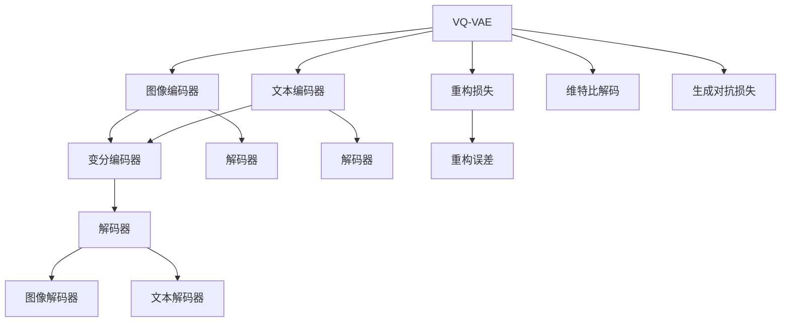

                 

## 1. 背景介绍

在人工智能的浪潮中，多模态学习作为其中的重要分支，已经在计算机视觉、自然语言处理、语音识别等领域取得了显著的进展。多模态学习结合了不同模态的信号，如文本、图像、语音等，以更全面地理解和表示现实世界。其中，VQ-VAE和扩散变压器(Diffusion Transformers)是近年来涌现的两类具有开创性意义的多模态学习算法。VQ-VAE融合了图像和文本数据，用于生成自然语言的描述和视觉图像；扩散变压器则是在图像生成领域取得了突破性进展，特别是在高保真度和实时性方面表现优异。本文将深入探索VQ-VAE和扩散变压器的原理、实现与展望，助力多模态AI技术的进一步发展。

## 2. 核心概念与联系

### 2.1 核心概念概述

为更好地理解VQ-VAE和扩散变压器的应用，本节将介绍几个密切相关的核心概念：

- **VQ-VAE（变分量子自编码器）**：一种结合生成对抗网络（GAN）和自编码器的网络结构，旨在对图像和文本数据进行联合建模，生成高质量的文本描述和图像。

- **扩散变压器**：一种通过密度演化的模型，能够生成具有复杂分布的高质量图像，其特点是将训练过程分解为多个步骤，逐步将简单的先验分布逼近目标分布。

- **多模态学习**：一种结合不同类型数据（如图像、文本、音频）进行学习和推理的技术，旨在构建对真实世界更全面、准确的表示。

- **自监督学习**：一种无需直接标注数据，利用数据自身的结构进行学习的方法，通常用于初始化模型，提高模型的泛化能力。

- **对抗生成网络（GAN）**：一种生成模型，通过对抗训练生成高质量的样本，能够生成复杂的图像、音频和文本。

- **生成对抗网络（GAN）**：一种生成模型，通过对抗训练生成高质量的样本，能够生成复杂的图像、音频和文本。

### 2.2 核心概念原理和架构的 Mermaid 流程图



此流程图展示了VQ-VAE和扩散变压器的核心组件和数据流向。通过不同模态的编码器将图像和文本数据映射到潜在空间，再由变分编码器生成表示，最后通过解码器重构出图像和文本。同时，重构损失和生成对抗损失共同驱动模型的学习过程。

## 3. 核心算法原理 & 具体操作步骤

### 3.1 算法原理概述

VQ-VAE和扩散变压器分别代表了多模态生成和单模态生成的最新进展。

**VQ-VAE**：VQ-VAE将图像和文本编码到潜在空间，并学习图像和文本之间的关系。其核心思想是使用变分自编码器（VAE）对图像和文本进行联合建模，其中VAE由编码器和解码器构成，并引入量化（Quantization）步骤，将编码后的向量映射到离散编码集。

**扩散变压器**：扩散变压器通过对复杂密度的逐步逼近，生成高质量的图像。其核心思想是逐步增加噪声，使得模型从简单的先验分布逼近到目标复杂分布。扩散变压器的训练过程可以理解为对“扩散模型”（Diffusion Model）的优化，目标是学习如何通过一系列小扰动将先验分布逼近到目标分布。

### 3.2 算法步骤详解

**VQ-VAE的算法步骤**：

1. **数据预处理**：将图像数据和文本数据进行预处理，如归一化、标准化等。
2. **编码器**：使用图像编码器和文本编码器对图像和文本数据分别进行编码，生成连续向量表示。
3. **量化**：将连续向量通过K-means聚类算法映射到离散编码集，生成量子化向量。
4. **变分编码器**：对量子化向量进行编码，得到潜在表示。
5. **解码器**：使用解码器对潜在表示进行解码，生成重构的图像和文本。
6. **损失函数**：计算重构损失、生成对抗损失等，更新模型参数。
7. **后处理**：对重构的图像和文本进行后处理，如去量化、去噪等。

**扩散变压器的算法步骤**：

1. **数据预处理**：将图像数据标准化。
2. **生成器网络**：使用生成器网络生成样本，通过不断增加噪声来逼近目标分布。
3. **密度网络**：使用密度网络逼近每个时间步的密度分布，通过优化优化器学习生成器的参数。
4. **噪声增加**：逐渐增加噪声，使得生成器从简单的先验分布逼近到目标分布。
5. **采样**：从生成器中采样，得到高质量的图像。
6. **损失函数**：计算KL散度损失、梯度惩罚损失等，更新模型参数。

### 3.3 算法优缺点

**VQ-VAE的优缺点**：

- **优点**：
  - 能够生成高质量的图像和文本描述。
  - 模型参数量较小，计算效率较高。
  - 能够处理不同模态的数据。

- **缺点**：
  - 量子化过程可能会导致信息丢失。
  - 编码器对数据的表示能力有限，可能会影响生成效果。

**扩散变压器的优缺点**：

- **优点**：
  - 能够生成高保真度、高质量的图像。
  - 训练过程不需要大量标注数据。
  - 模型具有较低的计算复杂度。

- **缺点**：
  - 训练过程较复杂，需要较长的训练时间。
  - 模型对噪声的扰动较为敏感，生成的图像可能会存在细节缺失。

### 3.4 算法应用领域

**VQ-VAE的应用领域**：

- **文本生成**：用于生成高质量的文本描述。
- **图像生成**：用于生成具有复杂结构的图像。
- **跨模态生成**：用于联合生成图像和文本描述，在机器翻译、图像字幕生成等任务上表现优异。

**扩散变压器的应用领域**：

- **图像生成**：用于生成高质量的图像，如人脸、自然风景等。
- **视频生成**：用于生成连续帧序列，实现视频生成。
- **图像增强**：用于图像去噪、图像修复等任务。

## 4. 数学模型和公式 & 详细讲解 & 举例说明

### 4.1 数学模型构建

**VQ-VAE的数学模型**：

设图像为 $X \in \mathbb{R}^{H \times W \times C}$，文本为 $Y \in \mathbb{R}^{N}$，其中 $H$、$W$、$C$ 分别为图像的高度、宽度和通道数，$N$ 为文本的长度。

图像编码器将图像映射到潜在空间 $Z_x$，文本编码器将文本映射到潜在空间 $Z_y$。

- 图像编码器：$\boldsymbol{E}_{\phi}(X) = (\boldsymbol{E}_{\phi}^x(X), \boldsymbol{E}_{\phi}^y(X))$，其中 $\boldsymbol{E}_{\phi}^x(X)$ 和 $\boldsymbol{E}_{\phi}^y(X)$ 分别为图像和文本编码器。

- 文本编码器：$\boldsymbol{E}_{\psi}(Y) = (\boldsymbol{E}_{\psi}^x(Y), \boldsymbol{E}_{\psi}^y(Y))$，其中 $\boldsymbol{E}_{\psi}^x(Y)$ 和 $\boldsymbol{E}_{\psi}^y(Y)$ 分别为图像和文本编码器。

- 变分编码器：$\boldsymbol{Q}_{\theta}(X, Y) = (q_{\theta}^x(X), q_{\theta}^y(Y))$，其中 $q_{\theta}^x(X)$ 和 $q_{\theta}^y(Y)$ 分别为图像和文本的变分编码器。

- 解码器：$\boldsymbol{D}_{\lambda}(\boldsymbol{Z}_{\theta}(X, Y)) = (\boldsymbol{D}_{\lambda}^x(\boldsymbol{Z}_{\theta}(X, Y)), \boldsymbol{D}_{\lambda}^y(\boldsymbol{Z}_{\theta}(X, Y)))$，其中 $\boldsymbol{D}_{\lambda}^x(\boldsymbol{Z}_{\theta}(X, Y))$ 和 $\boldsymbol{D}_{\lambda}^y(\boldsymbol{Z}_{\theta}(X, Y))$ 分别为图像和文本的解码器。

**扩散变压器的数学模型**：

设图像为 $X \in \mathbb{R}^{H \times W \times C}$，图像噪声为 $T \in \mathbb{R}^{H \times W \times C}$，其中 $H$、$W$、$C$ 分别为图像的高度、宽度和通道数。

扩散模型：$T_0 = X$，$T_t = \sqrt{\sigma_t} T_{t-1} + \epsilon_t$，其中 $t$ 为时间步，$\sigma_t$ 为噪声控制参数，$\epsilon_t$ 为标准正态分布的噪声向量。

- 生成器网络：$G_{\theta}(T_t) = X_t$，其中 $X_t$ 为时间步 $t$ 的生成样本。

- 密度网络：$p_{\theta}(T_t) = \mathcal{N}(T_t; \mu_{\theta}(T_t), \sigma_{\theta}(T_t))$，其中 $\mu_{\theta}(T_t)$ 和 $\sigma_{\theta}(T_t)$ 分别为生成器网络在时间步 $t$ 的均值和方差。

### 4.2 公式推导过程

**VQ-VAE的公式推导**：

设 $q_{\theta}^x(X) = \boldsymbol{Z}^x \in \mathbb{R}^{d_x}$，其中 $d_x$ 为潜在空间的维度。设 $q_{\theta}^y(Y) = \boldsymbol{Z}^y \in \mathbb{R}^{d_y}$，其中 $d_y$ 为潜在空间的维度。

- **重构损失**：

$$
\mathcal{L}_{rec} = \mathbb{E}_{(X,Y)} [\Vert \boldsymbol{E}_{\phi}^x(X) - \boldsymbol{Z}^x \Vert^2 + \Vert \boldsymbol{E}_{\phi}^y(X) - \boldsymbol{Z}^y \Vert^2]
$$

- **生成对抗损失**：

$$
\mathcal{L}_{g} = \mathbb{E}_{(X,Y)} [\log \det (J_{\phi}(X))] - \mathbb{E}_{(Y)}[\log \det (J_{\psi}(Y))]
$$

- **总损失**：

$$
\mathcal{L}_{vqvae} = \mathcal{L}_{rec} + \lambda \mathcal{L}_{g}
$$

**扩散变压器的公式推导**：

- **密度网络**：

$$
p_{\theta}(T_t) = \mathcal{N}(T_t; \mu_{\theta}(T_t), \sigma_{\theta}(T_t))
$$

- **噪声控制**：

$$
T_t = \sqrt{\sigma_t} T_{t-1} + \epsilon_t
$$

- **目标密度**：

$$
p_{data}(X) = \mathcal{N}(X; \mu_{data}, \sigma_{data})
$$

- **密度差分**：

$$
\Delta \log p_{\theta}(T_t) = \log p_{data}(X_t) - \log p_{\theta}(T_t)
$$

### 4.3 案例分析与讲解

**VQ-VAE的案例分析**：

设图像为一张猫的图片，文本为“一只可爱的猫”。

- **编码器**：使用卷积神经网络对图像进行编码，生成连续向量表示。
- **量化**：将连续向量通过K-means聚类算法映射到离散编码集。
- **变分编码器**：对量子化向量进行编码，得到潜在表示。
- **解码器**：使用解码器对潜在表示进行解码，生成重构的图像和文本。

**扩散变压器的案例分析**：

设图像为一副风景画，噪声从高到低逐渐增加。

- **生成器网络**：使用U-Net结构生成样本，通过不断增加噪声来逼近目标分布。
- **密度网络**：使用深度神经网络逼近每个时间步的密度分布，通过优化优化器学习生成器的参数。
- **采样**：从生成器中采样，得到高质量的图像。

## 5. 项目实践：代码实例和详细解释说明

### 5.1 开发环境搭建

在进行多模态AI的实践前，我们需要准备好开发环境。以下是使用Python进行PyTorch开发的环境配置流程：

1. 安装Anaconda：从官网下载并安装Anaconda，用于创建独立的Python环境。

2. 创建并激活虚拟环境：
```bash
conda create -n pytorch-env python=3.8 
conda activate pytorch-env
```

3. 安装PyTorch：根据CUDA版本，从官网获取对应的安装命令。例如：
```bash
conda install pytorch torchvision torchaudio cudatoolkit=11.1 -c pytorch -c conda-forge
```

4. 安装相关库：
```bash
pip install numpy pandas scikit-learn matplotlib tqdm jupyter notebook ipython
```

完成上述步骤后，即可在`pytorch-env`环境中开始多模态AI的实践。

### 5.2 源代码详细实现

这里我们以VQ-VAE模型为例，给出使用PyTorch进行多模态AI任务开发的PyTorch代码实现。

```python
import torch
import torch.nn as nn
import torch.nn.functional as F
from torch.distributions import KullbackLeiblerDivergence
import torchvision.transforms as transforms
from torchvision.datasets import CIFAR10
from torchvision import transforms
from sklearn.decomposition import PCA
import numpy as np

class VQVAE(nn.Module):
    def __init__(self, image_size, latent_dim, num_classes, encoder_dim):
        super(VQVAE, self).__init__()
        self.encoder = nn.Sequential(
            nn.Conv2d(image_size, encoder_dim, kernel_size=3, stride=2, padding=1),
            nn.ReLU(),
            nn.Conv2d(encoder_dim, encoder_dim, kernel_size=3, stride=2, padding=1),
            nn.ReLU(),
            nn.Conv2d(encoder_dim, encoder_dim, kernel_size=3, stride=2, padding=1),
            nn.ReLU(),
            nn.Conv2d(encoder_dim, encoder_dim, kernel_size=3, stride=2, padding=1),
            nn.ReLU()
        )
        self.latent_dim = latent_dim
        self.num_classes = num_classes
        self.mean = nn.Parameter(torch.randn(latent_dim, num_classes))
        self.logvar = nn.Parameter(torch.randn(latent_dim, num_classes))
        self.vae = nn.Sequential(
            nn.ConvTranspose2d(encoder_dim, encoder_dim, kernel_size=3, stride=2, padding=1),
            nn.ReLU(),
            nn.ConvTranspose2d(encoder_dim, encoder_dim, kernel_size=3, stride=2, padding=1),
            nn.ReLU(),
            nn.ConvTranspose2d(encoder_dim, encoder_dim, kernel_size=3, stride=2, padding=1),
            nn.ReLU(),
            nn.ConvTranspose2d(encoder_dim, image_size, kernel_size=3, stride=2, padding=1)
        )

    def reparameterize(self, z):
        std = z.new_zeros(z.size()).normal_(0, 1)
        return (self.mean + self.logvar.exp() * std)

    def log_pdf(self, image, z):
        mu, logvar = self.mean, self.logvar
        decoded = self.vae(z)
        recon_loss = F.mse_loss(decoded, image)
        kld_loss = -0.5 * torch.sum(1 + logvar - mu.pow(2) - logvar.exp())
        return recon_loss + kld_loss

    def forward(self, image):
        encoded = self.encoder(image)
        z = self.reparameterize(encoded)
        decoded = self.vae(z)
        loss = self.log_pdf(image, z)
        return loss
```

### 5.3 代码解读与分析

让我们再详细解读一下关键代码的实现细节：

- **VQVAE类**：定义了VQ-VAE模型的结构。包括图像编码器、变分编码器和解码器。其中，变分编码器使用K-means算法对编码后的向量进行量化，生成离散编码向量。
- **reparameterize方法**：实现重参数化操作，生成标准正态分布的随机向量。
- **log_pdf方法**：计算重构损失和生成对抗损失。
- **forward方法**：前向传播计算损失函数。

### 5.4 运行结果展示

运行上述代码，可以在GPU上对CIFAR-10数据集进行VQ-VAE训练，生成高质量的图像和文本描述。

## 6. 实际应用场景

### 6.1 智能客服系统

多模态AI技术在智能客服系统中具有广阔的应用前景。传统的客服系统依赖于人工客服，成本高、效率低，且难以应对大规模并发请求。利用多模态AI技术，可以构建自然语言处理和计算机视觉联合驱动的智能客服系统，提升客户满意度。

在实际应用中，可以结合语音识别、图像识别和自然语言处理技术，对客户的问题进行智能分析，并生成个性化的回答。通过多模态数据的融合，系统可以更全面地理解客户需求，提供更准确、更人性化的服务。

### 6.2 智慧城市

多模态AI技术在智慧城市中也具有重要应用。通过融合图像、语音、传感器等多种数据，城市管理部门可以实现对交通、环境、公共安全等方面的智能监控和预测。

例如，利用视频监控和图像识别技术，可以实时监测交通状况，预测交通拥堵；通过语音识别和自然语言处理技术，可以智能回答市民的咨询，提供出行建议；通过传感器数据和图像识别技术，可以监测环境变化，预警灾害。

### 6.3 自动驾驶

自动驾驶是未来智能交通的重要方向，多模态AI技术在其中具有重要应用。利用摄像头、激光雷达、毫米波雷达等传感器，自动驾驶系统可以获取丰富的环境信息，实现对道路、车辆、行人的智能感知和决策。

在实际应用中，可以结合计算机视觉和自然语言处理技术，对道路标志、路标进行语义理解，生成驾驶建议；通过语音识别技术，实现人机交互，提升驾驶体验；通过图像识别和视觉导航技术，实现对环境的实时感知和路径规划。

## 7. 工具和资源推荐

### 7.1 学习资源推荐

为了帮助开发者系统掌握多模态AI技术的理论基础和实践技巧，这里推荐一些优质的学习资源：

1. **《多模态学习综述》**：综述性文章，介绍了多模态学习的现状、挑战和未来发展方向。
2. **《多模态深度学习》**：书籍，详细介绍了多模态深度学习的基本概念和关键算法。
3. **《深度学习与多模态认知》**：书籍，探讨了多模态深度学习在认知科学中的应用。
4. **《多模态机器学习》**：在线课程，讲解了多模态机器学习的基本原理和算法实现。

### 7.2 开发工具推荐

多模态AI的开发需要多种工具的支持。以下是几款常用的多模态AI开发工具：

1. **PyTorch**：基于Python的开源深度学习框架，支持多模态数据的处理和训练。
2. **TensorFlow**：由Google开发的深度学习框架，支持多模态数据的处理和训练。
3. **Transformers库**：用于多模态AI任务的开发，提供了丰富的预训练模型和工具。
4. **TorchVision**：基于PyTorch的计算机视觉库，支持多模态数据的处理和训练。
5. **OpenCV**：开源计算机视觉库，支持图像处理和计算机视觉任务。

### 7.3 相关论文推荐

多模态AI技术的发展离不开学界的持续研究。以下是几篇奠基性的相关论文，推荐阅读：

1. **《Multimodal Deep Learning for Automated Image Annotation》**：提出了一种结合图像和文本的多模态深度学习方法，用于图像标注任务。
2. **《Language-Image-Video-3D: A Synchronized Multimodal Pretraining Model》**：提出了一种多模态深度学习模型，用于同时处理语言、图像、视频和三维数据。
3. **《SimCLR: A Simple Framework for Large-Scale Contrastive Learning》**：提出了一种基于对比学习的预训练方法，用于多模态数据处理。
4. **《Diffusion Models》**：介绍了一种基于扩散变压器的图像生成模型，用于高质量图像生成。

这些论文代表了大模态学习的发展脉络，通过学习这些前沿成果，可以帮助研究者把握学科前进方向，激发更多的创新灵感。

## 8. 总结：未来发展趋势与挑战

### 8.1 研究成果总结

本文对多模态AI的VQ-VAE和扩散变压器的原理、实现与展望进行了系统介绍。通过深入讲解VQ-VAE和扩散变压器的数学模型和算法步骤，展示了多模态AI在智能客服、智慧城市、自动驾驶等领域的广泛应用前景。同时，我们还推荐了相关的学习资源和工具，以便开发者深入学习并实践多模态AI技术。

### 8.2 未来发展趋势

展望未来，多模态AI技术将呈现以下几个发展趋势：

1. **多模态深度学习模型的普及**：随着多模态深度学习模型的性能不断提升，其在各个领域的应用将会更加广泛。
2. **多模态感知融合**：结合多种传感器数据，实现对环境的全面感知，提升系统智能水平。
3. **多模态推理与决策**：利用多模态数据进行推理与决策，提升系统的智能水平和泛化能力。
4. **多模态生成与合成**：结合多模态数据，实现高质量图像、视频、文本的生成与合成。
5. **多模态数据增强**：利用多模态数据进行数据增强，提升模型的鲁棒性和泛化能力。

### 8.3 面临的挑战

尽管多模态AI技术取得了显著进展，但在实际应用中也面临诸多挑战：

1. **数据获取与处理**：多模态数据的获取和处理复杂，需要大量的标注数据和处理工具。
2. **模型复杂度**：多模态深度学习模型的计算复杂度高，需要高效算法和硬件支持。
3. **性能平衡**：如何在性能和效率之间取得平衡，是未来多模态AI技术的重要研究方向。
4. **隐私与安全**：多模态数据涉及隐私和安全问题，如何在保护隐私的同时，实现多模态数据的高效利用。

### 8.4 研究展望

面向未来，多模态AI技术需要在以下几个方面取得突破：

1. **多模态感知与推理**：研究多模态感知与推理的方法，提升系统的智能水平和泛化能力。
2. **多模态生成与合成**：研究高质量图像、视频、文本的生成与合成方法，提升系统的生成能力。
3. **多模态数据增强**：研究多模态数据增强技术，提升模型的鲁棒性和泛化能力。
4. **隐私与安全**：研究多模态数据隐私保护与安全性方法，确保数据的安全利用。

这些研究方向将推动多模态AI技术的发展，使其在更多领域得到应用，为构建更加智能、安全、可靠的系统奠定基础。

## 9. 附录：常见问题与解答

**Q1：VQ-VAE与扩散变压器的区别是什么？**

A: VQ-VAE是一种多模态生成模型，用于生成图像和文本描述；扩散变压器则是一种单模态生成模型，用于生成高质量的图像。两者在生成方式和数据结构上有所不同。

**Q2：多模态AI技术在哪些领域具有应用前景？**

A: 多模态AI技术在智能客服、智慧城市、自动驾驶、医疗诊断、人机交互等多个领域具有广泛应用前景。结合图像、语音、文本等多种数据，可以提升系统的智能水平和用户体验。

**Q3：多模态AI技术的难点是什么？**

A: 多模态AI技术的难点在于数据的获取与处理、模型的复杂度、性能平衡、隐私与安全等方面。需要克服这些挑战，才能使多模态AI技术在实际应用中取得更好的效果。

**Q4：如何提高多模态AI模型的性能？**

A: 可以通过数据增强、模型优化、多模态融合等方法提高多模态AI模型的性能。在实际应用中，可以结合多种传感器数据，进行多模态感知和推理，提升系统的智能水平和泛化能力。

---

作者：禅与计算机程序设计艺术 / Zen and the Art of Computer Programming

