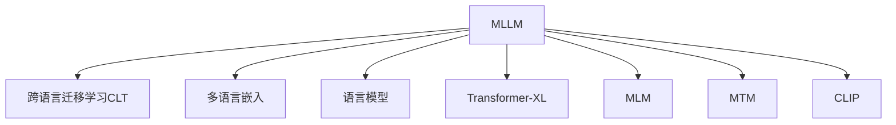

                 

# 多语言LLM：跨语言理解与生成

> 关键词：多语言大模型,跨语言理解,语言生成,多语言迁移学习,语言模型,Transformer,Transformer-XL,MLM,MTM,CLIP

## 1. 背景介绍

### 1.1 问题由来
近年来，随着深度学习技术的快速发展，多语言大语言模型(Multi-Language Large Language Models, MLLMs)在自然语言处理(NLP)领域取得了显著进展。这些模型能够理解和生成多种语言，极大地拓展了NLP应用的范围和深度，尤其是在跨语言任务上表现出色。

多语言大语言模型不仅具备通用的语言表示能力，还能够处理多种语言的文本数据，实现多语言的自然语言理解与生成。这些模型在翻译、跨语言信息检索、机器翻译等任务上展示了强大的应用潜力。

然而，构建跨语言的NLP模型也面临一些挑战，如数据资源获取难度较大、多语言模型的规模和训练复杂度较高、跨语言迁移学习能力有限等。本文将详细介绍多语言大语言模型的核心概念、关键技术和实际应用场景，为多语言NLP技术的深入研究与实践提供参考。

### 1.2 问题核心关键点
多语言大语言模型的核心挑战包括：

- 数据收集与预处理：需要收集和预处理多种语言的文本数据，且不同语言的文本质量与标注质量可能差异较大。
- 模型结构设计：需要设计跨语言的模型结构，使得模型能够灵活适应不同语言的语法和语义特点。
- 迁移学习能力：需要在多语言环境下有效迁移知识，提高模型的泛化能力，解决特定语言的标签数据稀缺问题。
- 多语言嵌入与对齐：需要将多语言嵌入对齐，使得不同语言之间的语义表示具有可比性。
- 模型训练与优化：需要在训练过程中平衡多语言数据的需求，避免过拟合和数据不均衡问题。

本文将重点探讨如何通过多语言迁移学习和跨语言嵌入等技术，构建高效的多语言大语言模型，从而提升跨语言NLP任务的效果。

## 2. 核心概念与联系

### 2.1 核心概念概述

为了更好地理解多语言大语言模型的构建和应用，本节将介绍几个密切相关的核心概念：

- **多语言大语言模型(MLLM)**：能够处理多种语言的深度学习模型。常见的模型包括BERT、GPT等，通过在大规模无标签多语言数据上进行预训练，学习通用的语言表示。

- **跨语言迁移学习(Cross-lingual Transfer Learning, CLT)**：指在大规模预训练模型基础上，通过在特定语言的任务上微调，使得模型能够迁移到其他语言上，提升跨语言的泛化能力。

- **多语言嵌入(Multilingual Embeddings)**：指将多种语言的文本表示映射到共同的向量空间中，使得不同语言的语义可以相互比较和理解。

- **语言模型(Language Model)**：用于捕捉语言特征的概率模型。常见的有n-gram模型、Transformer等，能够生成自然语言文本。

- **Transformer-XL**：一种特殊的Transformer架构，能够处理长序列输入，适用于长文本处理任务。

- **MLM**：Masked Language Modeling（掩码语言模型），一种自监督预训练任务，用于学习语言上下文。

- **MTM**：Mixed-Training Multiple Languages（多语言混合训练），一种多语言迁移学习的方法，能够在多种语言间共享知识。

- **CLIP**：Contrastive Language-Image Pre-training（对比语言图像预训练），一种跨语言多模态学习框架，能够学习图像与文本之间的语义对齐。

这些核心概念之间的逻辑关系可以通过以下Mermaid流程图来展示：



这个流程图展示了大语言模型的核心概念及其之间的关系：

1. 多语言大语言模型通过预训练获得基础能力。
2. 跨语言迁移学习方法，使得模型能够适应多种语言的任务。
3. 多语言嵌入，实现不同语言之间的语义对齐。
4. 语言模型，用于自然语言文本的生成与理解。
5. Transformer-XL，用于处理长序列输入。
6. MLM，用于学习语言上下文。
7. MTM，用于多语言间的知识共享。
8. CLIP，用于跨语言多模态学习。

这些概念共同构成了多语言大语言模型的学习和应用框架，使其能够跨语言理解和生成文本。

## 3. 核心算法原理 & 具体操作步骤
### 3.1 算法原理概述

多语言大语言模型的构建和训练通常基于大规模的预训练和微调技术。其核心思想是：将多语言预训练模型作为初始化参数，通过在特定语言的任务上微调，优化模型在该语言上的性能，从而实现跨语言的理解和生成。

假设多语言预训练模型为 $M_{\theta}$，其中 $\theta$ 为预训练得到的模型参数。给定多语言任务 $T$ 的标注数据集 $D=\{(x_i, y_i)\}_{i=1}^N$，微调的目标是找到新的模型参数 $\hat{\theta}$，使得：

$$
\hat{\theta}=\mathop{\arg\min}_{\theta} \mathcal{L}(M_{\theta},D)
$$

其中 $\mathcal{L}$ 为针对任务 $T$ 设计的损失函数，用于衡量模型预测输出与真实标签之间的差异。常见的损失函数包括交叉熵损失、均方误差损失等。

通过梯度下降等优化算法，微调过程不断更新模型参数 $\theta$，最小化损失函数 $\mathcal{L}$，使得模型输出逼近真实标签。由于 $\theta$ 已经通过多语言预训练获得了较好的初始化，因此即便在少量标注数据上微调，也能较快收敛到理想的模型参数 $\hat{\theta}$。

### 3.2 算法步骤详解

多语言大语言模型的构建和微调通常包括以下几个关键步骤：

**Step 1: 准备预训练模型和数据集**
- 选择合适的多语言预训练模型 $M_{\theta}$ 作为初始化参数，如BERT、GPT等。
- 准备多语言任务 $T$ 的标注数据集 $D$，划分为训练集、验证集和测试集。一般要求标注数据与预训练数据的分布不要差异过大。

**Step 2: 添加任务适配层**
- 根据任务类型，在预训练模型顶层设计合适的输出层和损失函数。
- 对于分类任务，通常在顶层添加线性分类器和交叉熵损失函数。
- 对于生成任务，通常使用语言模型的解码器输出概率分布，并以负对数似然为损失函数。

**Step 3: 设置微调超参数**
- 选择合适的优化算法及其参数，如 AdamW、SGD 等，设置学习率、批大小、迭代轮数等。
- 设置正则化技术及强度，包括权重衰减、Dropout、Early Stopping等。
- 确定冻结预训练参数的策略，如仅微调顶层，或全部参数都参与微调。

**Step 4: 执行梯度训练**
- 将训练集数据分批次输入模型，前向传播计算损失函数。
- 反向传播计算参数梯度，根据设定的优化算法和学习率更新模型参数。
- 周期性在验证集上评估模型性能，根据性能指标决定是否触发 Early Stopping。
- 重复上述步骤直到满足预设的迭代轮数或 Early Stopping 条件。

**Step 5: 测试和部署**
- 在测试集上评估微调后模型 $M_{\hat{\theta}}$ 的性能，对比微调前后的精度提升。
- 使用微调后的模型对新样本进行推理预测，集成到实际的应用系统中。
- 持续收集新的数据，定期重新微调模型，以适应数据分布的变化。

以上是多语言大语言模型微调的一般流程。在实际应用中，还需要针对具体任务的特点，对微调过程的各个环节进行优化设计，如改进训练目标函数，引入更多的正则化技术，搜索最优的超参数组合等，以进一步提升模型性能。

### 3.3 算法优缺点

多语言大语言模型的微调方法具有以下优点：

- 简单高效。只需准备少量标注数据，即可对预训练模型进行快速适配，获得较大的性能提升。
- 通用适用。适用于各种NLP下游任务，包括分类、匹配、生成等，设计简单的任务适配层即可实现微调。
- 参数高效。利用参数高效微调技术，在固定大部分预训练权重不变的情况下，仍可取得不错的提升。
- 效果显著。在学术界和工业界的诸多任务上，基于微调的方法已经刷新了最先进的性能指标。

同时，该方法也存在一定的局限性：

- 依赖标注数据。微调的效果很大程度上取决于标注数据的质量和数量，获取高质量标注数据的成本较高。
- 迁移能力有限。当目标任务与预训练数据的分布差异较大时，微调的性能提升有限。
- 负面效果传递。预训练模型的固有偏见、有害信息等，可能通过微调传递到下游任务，造成负面影响。
- 可解释性不足。微调模型的决策过程通常缺乏可解释性，难以对其推理逻辑进行分析和调试。

尽管存在这些局限性，但就目前而言，基于监督学习的微调方法仍是多语言NLP应用的主流范式。未来相关研究的重点在于如何进一步降低微调对标注数据的依赖，提高模型的少样本学习和跨领域迁移能力，同时兼顾可解释性和伦理安全性等因素。

### 3.4 算法应用领域

多语言大语言模型的微调方法在多语言NLP领域已经得到了广泛的应用，覆盖了几乎所有常见任务，例如：

- 文本分类：如情感分析、主题分类、意图识别等。通过微调使模型学习文本-标签映射。
- 命名实体识别：识别文本中的人名、地名、机构名等特定实体。通过微调使模型掌握实体边界和类型。
- 关系抽取：从文本中抽取实体之间的语义关系。通过微调使模型学习实体-关系三元组。
- 问答系统：对自然语言问题给出答案。将问题-答案对作为微调数据，训练模型学习匹配答案。
- 机器翻译：将源语言文本翻译成目标语言。通过微调使模型学习语言-语言映射。
- 文本摘要：将长文本压缩成简短摘要。将文章-摘要对作为微调数据，使模型学习抓取要点。
- 对话系统：使机器能够与人自然对话。将多轮对话历史作为上下文，微调模型进行回复生成。

除了上述这些经典任务外，多语言大语言模型微调也被创新性地应用到更多场景中，如可控文本生成、常识推理、代码生成、数据增强等，为NLP技术带来了全新的突破。随着预训练模型和微调方法的不断进步，相信多语言NLP技术将在更广阔的应用领域大放异彩。

## 4. 数学模型和公式 & 详细讲解  
### 4.1 数学模型构建

本节将使用数学语言对多语言大语言模型微调过程进行更加严格的刻画。

记多语言预训练模型为 $M_{\theta}$，其中 $\theta$ 为多语言预训练得到的模型参数。假设微调任务为 $T$，标注数据集为 $D=\{(x_i,y_i)\}_{i=1}^N, x_i \in \mathcal{X}, y_i \in \mathcal{Y}$。

定义模型 $M_{\theta}$ 在输入 $x$ 上的输出为 $\hat{y}=M_{\theta}(x)$，表示样本属于类别 $y$ 的概率。训练集 $D$ 上的经验风险为：

$$
\mathcal{L}(\theta) = \frac{1}{N} \sum_{i=1}^N \ell(M_{\theta}(x_i),y_i)
$$

其中 $\ell$ 为损失函数，用于衡量模型预测输出与真实标签之间的差异。常见的损失函数包括交叉熵损失、均方误差损失等。

### 4.2 公式推导过程

以下我们以二分类任务为例，推导交叉熵损失函数及其梯度的计算公式。

假设模型 $M_{\theta}$ 在输入 $x$ 上的输出为 $\hat{y}=M_{\theta}(x) \in [0,1]$，表示样本属于正类的概率。真实标签 $y \in \{0,1\}$。则二分类交叉熵损失函数定义为：

$$
\ell(M_{\theta}(x),y) = -[y\log \hat{y} + (1-y)\log (1-\hat{y})]
$$

将其代入经验风险公式，得：

$$
\mathcal{L}(\theta) = -\frac{1}{N}\sum_{i=1}^N [y_i\log M_{\theta}(x_i)+(1-y_i)\log(1-M_{\theta}(x_i))]
$$

根据链式法则，损失函数对参数 $\theta_k$ 的梯度为：

$$
\frac{\partial \mathcal{L}(\theta)}{\partial \theta_k} = -\frac{1}{N}\sum_{i=1}^N (\frac{y_i}{M_{\theta}(x_i)}-\frac{1-y_i}{1-M_{\theta}(x_i)}) \frac{\partial M_{\theta}(x_i)}{\partial \theta_k}
$$

其中 $\frac{\partial M_{\theta}(x_i)}{\partial \theta_k}$ 可进一步递归展开，利用自动微分技术完成计算。

在得到损失函数的梯度后，即可带入参数更新公式，完成模型的迭代优化。重复上述过程直至收敛，最终得到适应下游任务的最优模型参数 $\theta^*$。

## 5. 项目实践：代码实例和详细解释说明
### 5.1 开发环境搭建

在进行多语言大语言模型微调实践前，我们需要准备好开发环境。以下是使用Python进行PyTorch开发的环境配置流程：

1. 安装Anaconda：从官网下载并安装Anaconda，用于创建独立的Python环境。

2. 创建并激活虚拟环境：
```bash
conda create -n pytorch-env python=3.8 
conda activate pytorch-env
```

3. 安装PyTorch：根据CUDA版本，从官网获取对应的安装命令。例如：
```bash
conda install pytorch torchvision torchaudio cudatoolkit=11.1 -c pytorch -c conda-forge
```

4. 安装Transformers库：
```bash
pip install transformers
```

5. 安装各类工具包：
```bash
pip install numpy pandas scikit-learn matplotlib tqdm jupyter notebook ipython
```

完成上述步骤后，即可在`pytorch-env`环境中开始多语言大语言模型微调的实践。

### 5.2 源代码详细实现

下面我以多语言文本分类任务为例，给出使用Transformers库对BERT模型进行多语言文本分类微调的PyTorch代码实现。

首先，定义多语言文本分类任务的数据处理函数：

```python
from transformers import BertTokenizer
from torch.utils.data import Dataset
import torch

class MultilingualTextDataset(Dataset):
    def __init__(self, texts, labels, tokenizer, max_len=128):
        self.texts = texts
        self.labels = labels
        self.tokenizer = tokenizer
        self.max_len = max_len
        
    def __len__(self):
        return len(self.texts)
    
    def __getitem__(self, item):
        text = self.texts[item]
        label = self.labels[item]
        
        encoding = self.tokenizer(text, return_tensors='pt', max_length=self.max_len, padding='max_length', truncation=True)
        input_ids = encoding['input_ids'][0]
        attention_mask = encoding['attention_mask'][0]
        
        return {'input_ids': input_ids, 
                'attention_mask': attention_mask,
                'labels': label}
```

然后，定义模型和优化器：

```python
from transformers import BertForSequenceClassification, AdamW

model = BertForSequenceClassification.from_pretrained('bert-base-multilingual-cased', num_labels=2)

optimizer = AdamW(model.parameters(), lr=2e-5)
```

接着，定义训练和评估函数：

```python
from torch.utils.data import DataLoader
from tqdm import tqdm
from sklearn.metrics import classification_report

device = torch.device('cuda') if torch.cuda.is_available() else torch.device('cpu')
model.to(device)

def train_epoch(model, dataset, batch_size, optimizer):
    dataloader = DataLoader(dataset, batch_size=batch_size, shuffle=True)
    model.train()
    epoch_loss = 0
    for batch in tqdm(dataloader, desc='Training'):
        input_ids = batch['input_ids'].to(device)
        attention_mask = batch['attention_mask'].to(device)
        labels = batch['labels'].to(device)
        model.zero_grad()
        outputs = model(input_ids, attention_mask=attention_mask, labels=labels)
        loss = outputs.loss
        epoch_loss += loss.item()
        loss.backward()
        optimizer.step()
    return epoch_loss / len(dataloader)

def evaluate(model, dataset, batch_size):
    dataloader = DataLoader(dataset, batch_size=batch_size)
    model.eval()
    preds, labels = [], []
    with torch.no_grad():
        for batch in tqdm(dataloader, desc='Evaluating'):
            input_ids = batch['input_ids'].to(device)
            attention_mask = batch['attention_mask'].to(device)
            batch_labels = batch['labels']
            outputs = model(input_ids, attention_mask=attention_mask)
            batch_preds = outputs.logits.argmax(dim=2).to('cpu').tolist()
            batch_labels = batch_labels.to('cpu').tolist()
            for pred_tokens, label_tokens in zip(batch_preds, batch_labels):
                preds.append(pred_tokens[:len(label_tokens)])
                labels.append(label_tokens)
                
    print(classification_report(labels, preds))
```

最后，启动训练流程并在测试集上评估：

```python
epochs = 5
batch_size = 16

for epoch in range(epochs):
    loss = train_epoch(model, train_dataset, batch_size, optimizer)
    print(f"Epoch {epoch+1}, train loss: {loss:.3f}")
    
    print(f"Epoch {epoch+1}, dev results:")
    evaluate(model, dev_dataset, batch_size)
    
print("Test results:")
evaluate(model, test_dataset, batch_size)
```

以上就是使用PyTorch对BERT进行多语言文本分类任务微调的完整代码实现。可以看到，得益于Transformers库的强大封装，我们可以用相对简洁的代码完成BERT模型的加载和微调。

### 5.3 代码解读与分析

让我们再详细解读一下关键代码的实现细节：

**MultilingualTextDataset类**：
- `__init__`方法：初始化文本、标签、分词器等关键组件。
- `__len__`方法：返回数据集的样本数量。
- `__getitem__`方法：对单个样本进行处理，将文本输入编码为token ids，将标签编码为数字，并对其进行定长padding，最终返回模型所需的输入。

**模型和优化器**：
- 选择多语言预训练模型BERT，通过`from_pretrained`方法加载模型和分词器。
- 使用AdamW优化器，设置较小的学习率。

**训练和评估函数**：
- 使用PyTorch的DataLoader对数据集进行批次化加载，供模型训练和推理使用。
- 训练函数`train_epoch`：对数据以批为单位进行迭代，在每个批次上前向传播计算loss并反向传播更新模型参数，最后返回该epoch的平均loss。
- 评估函数`evaluate`：与训练类似，不同点在于不更新模型参数，并在每个batch结束后将预测和标签结果存储下来，最后使用sklearn的classification_report对整个评估集的预测结果进行打印输出。

**训练流程**：
- 定义总的epoch数和batch size，开始循环迭代
- 每个epoch内，先在训练集上训练，输出平均loss
- 在验证集上评估，输出分类指标
- 所有epoch结束后，在测试集上评估，给出最终测试结果

可以看到，PyTorch配合Transformers库使得BERT微调的代码实现变得简洁高效。开发者可以将更多精力放在数据处理、模型改进等高层逻辑上，而不必过多关注底层的实现细节。

当然，工业级的系统实现还需考虑更多因素，如模型的保存和部署、超参数的自动搜索、更灵活的任务适配层等。但核心的微调范式基本与此类似。

## 6. 实际应用场景
### 6.1 多语言问答系统

基于多语言大语言模型微调的对话技术，可以广泛应用于多语言问答系统的构建。传统问答系统往往需要配备多种语言的客服人员，人力成本高且难以保证回答的一致性和专业性。而使用微调后的问答模型，可以支持多种语言的自然语言处理，快速响应不同语言的用户咨询，提供标准化的多语言服务。

在技术实现上，可以收集企业内部的多语言客服对话记录，将问题和最佳答复构建成监督数据，在此基础上对预训练对话模型进行微调。微调后的对话模型能够自动理解用户意图，匹配最合适的答案模板进行回复。对于用户提出的新问题，还可以接入检索系统实时搜索相关内容，动态组织生成回答。如此构建的多语言问答系统，能大幅提升用户咨询体验和问题解决效率。

### 6.2 多语言翻译系统

多语言大语言模型在机器翻译任务上也有广泛应用。传统的机器翻译系统依赖大量的双语对照语料，而多语言大语言模型可以通过预训练获得通用的语言表示，在少量双语数据上进行微调，即可实现高效的跨语言翻译。

例如，可以使用多语言大语言模型BERT对英文和中文进行双向预训练，然后在特定任务的监督数据上进行微调，如对新闻报道的翻译。微调后的模型能够自动理解源语言和目标语言的语义，并生成高质量的翻译文本。通过多语言大语言模型，可以实现一站式多语言翻译，解决不同语言用户之间的语言障碍。

### 6.3 多语言情感分析

情感分析是多语言文本分类任务的一个重要应用。通过多语言大语言模型微调，能够对多种语言的文本进行情感分类，分析用户对商品、服务的满意度等。例如，可以收集用户在不同语言社交媒体上的评论，使用多语言大语言模型进行情感分类，从而获得不同语言的情感趋势分析结果。

在实现上，可以使用多语言大语言模型BERT对不同语言的社交媒体评论进行微调，输出情感分类结果。多语言情感分析能够帮助企业及时了解不同语言市场用户对产品、服务的反馈，进行针对性的优化和改进。

### 6.4 未来应用展望

随着多语言大语言模型和微调方法的不断发展，其在多语言NLP任务上的应用前景广阔。未来，多语言大语言模型将能够在更多领域发挥重要作用，推动NLP技术的产业化进程。

在智慧医疗领域，基于多语言大语言模型的医疗问答、病历分析、药物研发等应用将提升医疗服务的智能化水平，辅助医生诊疗，加速新药开发进程。

在智能教育领域，多语言大语言模型可应用于作业批改、学情分析、知识推荐等方面，因材施教，促进教育公平，提高教学质量。

在智慧城市治理中，多语言大语言模型可用于城市事件监测、舆情分析、应急指挥等环节，提高城市管理的自动化和智能化水平，构建更安全、高效的未来城市。

此外，在企业生产、社会治理、文娱传媒等众多领域，基于多语言大语言模型的人工智能应用也将不断涌现，为经济社会发展注入新的动力。相信随着技术的日益成熟，多语言大语言模型微调范式将成为人工智能技术落地应用的重要手段，推动NLP技术在更广阔的应用领域大放异彩。

## 7. 工具和资源推荐
### 7.1 学习资源推荐

为了帮助开发者系统掌握多语言大语言模型微调的理论基础和实践技巧，这里推荐一些优质的学习资源：

1. 《Transformer from Speech to Text》系列博文：由大模型技术专家撰写，深入浅出地介绍了Transformer原理、多语言大模型、微调技术等前沿话题。

2. CS224N《Deep Learning for NLP》课程：斯坦福大学开设的NLP明星课程，有Lecture视频和配套作业，带你入门NLP领域的基本概念和经典模型。

3. 《Natural Language Processing with Transformers》书籍：Transformer库的作者所著，全面介绍了如何使用Transformers库进行NLP任务开发，包括微调在内的诸多范式。

4. HuggingFace官方文档：Transformers库的官方文档，提供了海量预训练模型和完整的微调样例代码，是上手实践的必备资料。

5. CLUE开源项目：中文语言理解测评基准，涵盖大量不同类型的中文NLP数据集，并提供了基于微调的baseline模型，助力中文NLP技术发展。

通过对这些资源的学习实践，相信你一定能够快速掌握多语言大语言模型微调的精髓，并用于解决实际的NLP问题。
###  7.2 开发工具推荐

高效的开发离不开优秀的工具支持。以下是几款用于多语言大语言模型微调开发的常用工具：

1. PyTorch：基于Python的开源深度学习框架，灵活动态的计算图，适合快速迭代研究。大部分预训练语言模型都有PyTorch版本的实现。

2. TensorFlow：由Google主导开发的开源深度学习框架，生产部署方便，适合大规模工程应用。同样有丰富的预训练语言模型资源。

3. Transformers库：HuggingFace开发的NLP工具库，集成了众多SOTA语言模型，支持PyTorch和TensorFlow，是进行多语言微调任务开发的利器。

4. Weights & Biases：模型训练的实验跟踪工具，可以记录和可视化模型训练过程中的各项指标，方便对比和调优。与主流深度学习框架无缝集成。

5. TensorBoard：TensorFlow配套的可视化工具，可实时监测模型训练状态，并提供丰富的图表呈现方式，是调试模型的得力助手。

6. Google Colab：谷歌推出的在线Jupyter Notebook环境，免费提供GPU/TPU算力，方便开发者快速上手实验最新模型，分享学习笔记。

合理利用这些工具，可以显著提升多语言大语言模型微调任务的开发效率，加快创新迭代的步伐。

### 7.3 相关论文推荐

多语言大语言模型和微调技术的发展源于学界的持续研究。以下是几篇奠基性的相关论文，推荐阅读：

1. Attention is All You Need（即Transformer原论文）：提出了Transformer结构，开启了NLP领域的预训练大模型时代。

2. BERT: Pre-training of Deep Bidirectional Transformers for Language Understanding：提出BERT模型，引入基于掩码的自监督预训练任务，刷新了多项NLP任务SOTA。

3. Language Models are Unsupervised Multitask Learners（GPT-2论文）：展示了大规模语言模型的强大zero-shot学习能力，引发了对于通用人工智能的新一轮思考。

4. Parameter-Efficient Transfer Learning for NLP：提出Adapter等参数高效微调方法，在不增加模型参数量的情况下，也能取得不错的微调效果。

5. Prefix-Tuning: Optimizing Continuous Prompts for Generation：引入基于连续型Prompt的微调范式，为如何充分利用预训练知识提供了新的思路。

6. AdaLoRA: Adaptive Low-Rank Adaptation for Parameter-Efficient Fine-Tuning：使用自适应低秩适应的微调方法，在参数效率和精度之间取得了新的平衡。

这些论文代表了大语言模型微调技术的发展脉络。通过学习这些前沿成果，可以帮助研究者把握学科前进方向，激发更多的创新灵感。

## 8. 总结：未来发展趋势与挑战
### 8.1 总结

本文对多语言大语言模型的微调方法进行了全面系统的介绍。首先阐述了多语言大语言模型的构建和应用背景，明确了微调在拓展预训练模型应用、提升跨语言任务性能方面的独特价值。其次，从原理到实践，详细讲解了多语言大语言模型的数学原理和关键步骤，给出了多语言大语言模型微调的完整代码实例。同时，本文还广泛探讨了多语言大语言模型在智能客服、翻译、情感分析等领域的实际应用场景，展示了多语言大语言模型微调技术的广泛应用前景。此外，本文精选了多语言大语言模型微调的学习资源，力求为读者提供全方位的技术指引。

通过本文的系统梳理，可以看到，多语言大语言模型微调方法正在成为多语言NLP领域的重要范式，极大地拓展了预训练语言模型的应用边界，催生了更多的落地场景。得益于大规模语料的预训练，多语言大语言模型微调在大规模多语言数据上获得了较好的效果，且跨语言迁移学习能力得到显著提升。未来，伴随预训练语言模型和微调方法的持续演进，相信多语言NLP技术将在更广阔的应用领域大放异彩，深刻影响人类的生产生活方式。

### 8.2 未来发展趋势

展望未来，多语言大语言模型微调技术将呈现以下几个发展趋势：

1. 模型规模持续增大。随着算力成本的下降和数据规模的扩张，预训练语言模型的参数量还将持续增长。超大规模语言模型蕴含的丰富语言知识，有望支撑更加复杂多变的跨语言任务微调。

2. 微调方法日趋多样。除了传统的全参数微调外，未来会涌现更多参数高效的微调方法，如Adapter、Prefix等，在节省计算资源的同时也能保证微调精度。

3. 持续学习成为常态。随着数据分布的不断变化，微调模型也需要持续学习新知识以保持性能。如何在不遗忘原有知识的同时，高效吸收新样本信息，将成为重要的研究课题。

4. 标注样本需求降低。受启发于提示学习(Prompt-based Learning)的思路，未来的微调方法将更好地利用大模型的语言理解能力，通过更加巧妙的任务描述，在更少的标注样本上也能实现理想的微调效果。

5. 多语言嵌入与对齐增强。通过更好的多语言嵌入对齐技术，使得不同语言之间的语义表示更加可比，增强跨语言任务的泛化能力。

6. 多模态微调崛起。未来的多语言大语言模型将融合更多模态数据，如图像、视频、语音等，实现视觉、听觉、文本等信息的协同建模，拓展语言模型在多模态领域的适用性。

以上趋势凸显了多语言大语言模型微调技术的广阔前景。这些方向的探索发展，必将进一步提升多语言NLP系统的性能和应用范围，为人类认知智能的进化带来深远影响。

### 8.3 面临的挑战

尽管多语言大语言模型微调技术已经取得了瞩目成就，但在迈向更加智能化、普适化应用的过程中，它仍面临着诸多挑战：

1. 标注成本瓶颈。虽然多语言大语言模型在一定程度上降低了标注数据的需求，但对于长尾应用场景，难以获得充足的高质量标注数据，成为制约微调性能的瓶颈。如何进一步降低微调对标注样本的依赖，将是一大难题。

2. 模型鲁棒性不足。当前多语言大语言模型面对域外数据时，泛化性能往往大打折扣。对于测试样本的微小扰动，模型预测也容易发生波动。如何提高模型的鲁棒性，避免灾难性遗忘，还需要更多理论和实践的积累。

3. 推理效率有待提高。多语言大语言模型虽然精度高，但在实际部署时往往面临推理速度慢、内存占用大等效率问题。如何在保证性能的同时，简化模型结构，提升推理速度，优化资源占用，将是重要的优化方向。

4. 可解释性亟需加强。当前多语言大语言模型通常缺乏可解释性，难以解释其内部工作机制和决策逻辑。对于医疗、金融等高风险应用，算法的可解释性和可审计性尤为重要。如何赋予模型更强的可解释性，将是亟待攻克的难题。

5. 安全性有待保障。预训练语言模型难免会学习到有偏见、有害的信息，通过微调传递到下游任务，产生误导性、歧视性的输出，给实际应用带来安全隐患。如何从数据和算法层面消除模型偏见，避免恶意用途，确保输出的安全性，也将是重要的研究课题。

6. 知识整合能力不足。现有的多语言大语言模型往往局限于任务内数据，难以灵活吸收和运用更广泛的先验知识。如何让多语言大语言模型更好地与外部知识库、规则库等专家知识结合，形成更加全面、准确的信息整合能力，还有很大的想象空间。

正视多语言大语言模型微调面临的这些挑战，积极应对并寻求突破，将是大语言模型微调走向成熟的必由之路。相信随着学界和产业界的共同努力，这些挑战终将一一被克服，多语言大语言模型微调必将在构建人机协同的智能时代中扮演越来越重要的角色。

### 8.4 研究展望

面对多语言大语言模型微调所面临的种种挑战，未来的研究需要在以下几个方面寻求新的突破：

1. 探索无监督和半监督微调方法。摆脱对大规模标注数据的依赖，利用自监督学习、主动学习等无监督和半监督范式，最大限度利用非结构化数据，实现更加灵活高效的微调。

2. 研究参数高效和计算高效的微调范式。开发更加参数高效的微调方法，在固定大部分预训练参数的同时，只更新极少量的任务相关参数。同时优化微调模型的计算图，减少前向传播和反向传播的资源消耗，实现更加轻量级、实时性的部署。

3. 融合因果和对比学习范式。通过引入因果推断和对比学习思想，增强多语言大语言模型建立稳定因果关系的能力，学习更加普适、鲁棒的语言表征，从而提升模型泛化性和抗干扰能力。

4. 引入更多先验知识。将符号化的先验知识，如知识图谱、逻辑规则等，与神经网络模型进行巧妙融合，引导多语言大语言模型学习更准确、合理的语言模型。同时加强不同模态数据的整合，实现视觉、语音等多模态信息与文本信息的协同建模。

5. 结合因果分析和博弈论工具。将因果分析方法引入多语言大语言模型，识别出模型决策的关键特征，增强输出解释的因果性和逻辑性。借助博弈论工具刻画人机交互过程，主动探索并规避模型的脆弱点，提高系统稳定性。

6. 纳入伦理道德约束。在模型训练目标中引入伦理导向的评估指标，过滤和惩罚有偏见、有害的输出倾向。同时加强人工干预和审核，建立模型行为的监管机制，确保输出符合人类价值观和伦理道德。

这些研究方向的探索，必将引领多语言大语言模型微调技术迈向更高的台阶，为构建安全、可靠、可解释、可控的智能系统铺平道路。面向未来，多语言大语言模型微调技术还需要与其他人工智能技术进行更深入的融合，如知识表示、因果推理、强化学习等，多路径协同发力，共同推动自然语言理解和智能交互系统的进步。只有勇于创新、敢于突破，才能不断拓展语言模型的边界，让智能技术更好地造福人类社会。

## 9. 附录：常见问题与解答
**Q1：多语言大语言模型微调是否适用于所有NLP任务？**

A: 多语言大语言模型微调在大多数NLP任务上都能取得不错的效果，特别是对于数据量较小的任务。但对于一些特定领域的任务，如医学、法律等，仅仅依靠通用语料预训练的模型可能难以很好地适应。此时需要在特定领域语料上进一步预训练，再进行微调，才能获得理想效果。此外，对于一些需要时效性、个性化很强的任务，如对话、推荐等，微调方法也需要针对性的改进优化。

**Q2：多语言大语言模型微调过程中的过拟合问题如何解决？**

A: 过拟合是微调面临的主要挑战，尤其是在标注数据不足的情况下。常见的缓解策略包括：
1. 数据增强：通过回译、近义替换等方式扩充训练集
2. 正则化：使用L2正则、Dropout、Early Stopping等避免过拟合
3. 对抗训练：引入对抗样本，提高模型鲁棒性
4. 参数高效微调：只调整少量参数(如Adapter、Prefix等)，减小过拟合风险
5. 多模型集成：训练多个微调模型，取平均输出，抑制过拟合

这些策略往往需要根据具体任务和数据特点进行灵活组合。只有在数据、模型、训练、推理等各环节进行全面优化，才能最大限度地发挥多语言大语言模型微调的威力。

**Q3：多语言大语言模型微调过程中如何选择超参数？**

A: 超参数的选择是模型微调过程中不可或缺的一环，但通常需要经过多次试验才能找到最优值。一般建议从默认值开始，逐步调整超参数，观察模型的表现，直至找到最优组合。常见的超参数包括学习率、批大小、迭代轮数等，调整范围可以从默认值到原有值的数倍。此外，还可以使用网格搜索或随机搜索等自动化调参方法，加速超参数的优化过程。

**Q4：多语言大语言模型微调过程中如何进行迁移学习？**

A: 迁移学习是多语言大语言模型微调的核心方法之一。常用的迁移学习方法包括：
1. 多语言预训练：在多种语言的语料上预训练大语言模型，获得通用的语言表示。
2. 多语言微调：在特定语言的监督数据上进行微调，使得模型能够迁移到其他语言上。
3. 多语言混合训练(MTM)：在不同语言的数据上进行交替训练，逐步提高多语言迁移能力。
4. 无监督多语言学习：在无监督的多语言语料上进行预训练，提高模型的泛化能力。

迁移学习能够充分利用多语言数据的多样性和丰富性，提升模型的跨语言迁移能力。未来研究将继续探索更高效、更普适的迁移学习方法。

**Q5：多语言大语言模型微调过程中如何处理数据不均衡问题？**

A: 数据不均衡是多语言大语言模型微调过程中常见的问题。数据不均衡可能导致模型对数量较少的类别预测效果较差。常见的处理方式包括：
1. 数据增强：对数量较少的类别进行数据增强，如回译、同义词替换等，增加样本数量。
2. 类别加权：在损失函数中加入类别权重，对数量较少的类别给予更多的关注。
3. 欠采样和过采样：对数量较多的类别进行欠采样，对数量较少的类别进行过采样，调整类别分布。
4. 集成学习：使用多个微调模型，通过投票或加权平均的方式集成预测结果，提高泛化能力。

合理处理数据不均衡问题，能够显著提升多语言大语言模型微调的性能。未来研究将继续探索更高效的数据处理方式。

---

作者：禅与计算机程序设计艺术 / Zen and the Art of Computer Programming

