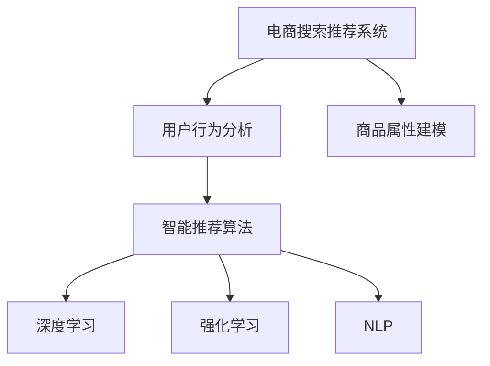

                 

# 大数据与AI 驱动的电商搜索推荐：以用户体验为中心的算法优化

> 关键词：电商搜索推荐, 大数据, AI驱动, 用户体验优化, 算法优化, 深度学习, 强化学习, 用户行为分析, 自然语言处理

## 1. 背景介绍

### 1.1 问题由来

在电商行业，用户搜索与推荐系统是提升用户体验、增加用户留存和销售额的关键环节。传统的搜索推荐系统多基于简单的关键词匹配算法，用户输入搜索词后，系统返回搜索结果列表。这种方式虽然简洁快速，但在用户需求多样化和个性化需求不断提升的背景下，显得粗糙和单一，难以满足用户对商品丰富度、个性化推荐的需求。

近年来，随着人工智能和大数据技术的飞速发展，电商搜索推荐系统逐渐引入AI和数据驱动的推荐算法，用户输入搜索词后，系统不仅能返回搜索结果列表，还能基于用户历史行为、偏好、环境等因素进行个性化推荐，使用户获得更为精准、多样化的购物体验。

### 1.2 问题核心关键点

实现电商搜索推荐的核心在于如何高效地整合海量数据，并结合用户行为特征、商品属性特征等，进行智能推荐。具体而言，包括以下几个关键点：

- **用户行为分析**：通过分析用户在电商平台的搜索、浏览、购买等行为，挖掘用户的兴趣和偏好，是进行个性化推荐的基础。
- **商品属性建模**：对商品属性进行精细化建模，如颜色、尺码、价格、品牌等，以便在推荐时进行更精准的匹配。
- **数据高效处理**：处理和存储海量用户行为和商品属性数据，是电商搜索推荐系统高效运行的前提。
- **智能推荐算法**：基于机器学习和深度学习技术，实现智能推荐模型的训练和优化，是电商搜索推荐系统的核心技术。

### 1.3 问题研究意义

电商搜索推荐系统的优劣直接影响到用户的购物体验和平台的销售额。一个优秀的推荐系统不仅能提升用户满意度，还能有效提高平台的转化率和用户留存率，实现商业价值的最大化。

因此，研究如何在大数据和AI技术的支持下，对电商搜索推荐系统进行优化，以提升用户体验为中心，成为电商行业的一个重要课题。

## 2. 核心概念与联系

### 2.1 核心概念概述

为更好地理解电商搜索推荐系统的优化方法，本节将介绍几个密切相关的核心概念：

- **电商搜索推荐系统**：指电商平台上基于用户搜索词和行为特征，为用户推荐相关商品的系统。目标是提升用户体验，增加用户留存和销售额。

- **用户行为分析**：通过分析用户在电商平台的搜索、浏览、购买等行为，挖掘用户的兴趣和偏好，进行个性化推荐。

- **商品属性建模**：对商品属性进行精细化建模，如颜色、尺码、价格、品牌等，以便在推荐时进行更精准的匹配。

- **数据高效处理**：处理和存储海量用户行为和商品属性数据，是电商搜索推荐系统高效运行的前提。

- **智能推荐算法**：基于机器学习和深度学习技术，实现智能推荐模型的训练和优化，是电商搜索推荐系统的核心技术。

- **深度学习**：一种基于多层神经网络的机器学习算法，通过多层次的特征提取和表示学习，实现复杂的模式识别和预测。

- **强化学习**：一种基于奖励信号优化的机器学习算法，通过不断试错，使智能体在特定环境中做出最优决策。

- **自然语言处理(NLP)**：通过计算机程序理解和生成自然语言的技术，常用于搜索词分析和用户反馈处理。

这些核心概念之间的逻辑关系可以通过以下Mermaid流程图来展示：



这个流程图展示了大数据和AI驱动的电商搜索推荐系统的核心概念及其之间的关系：

1. 电商搜索推荐系统以用户行为分析为基础，了解用户需求。
2. 商品属性建模对商品进行精细化描述，以便推荐时更精准匹配。
3. 智能推荐算法通过机器学习和深度学习技术，优化推荐模型。
4. 深度学习用于构建复杂的特征提取网络。
5. 强化学习用于优化推荐策略，提升用户体验。
6. NLP用于处理搜索词和用户反馈，提升推荐准确性。

这些概念共同构成了电商搜索推荐系统的核心技术和方法，是实现个性化推荐、提升用户体验的关键。

## 3. 核心算法原理 & 具体操作步骤
### 3.1 算法原理概述

电商搜索推荐系统的优化，本质上是一个基于大数据和AI技术的机器学习过程。其核心思想是：通过分析用户行为数据和商品属性数据，构建用户-商品关联矩阵，利用深度学习或强化学习等算法，优化推荐模型，实现个性化的商品推荐。

形式化地，假设用户-商品关联矩阵为 $A \in \mathbb{R}^{M \times N}$，其中 $M$ 为用户数，$N$ 为商品数。记用户的兴趣向量为 $u \in \mathbb{R}^M$，商品的属性向量为 $i \in \mathbb{R}^N$，则推荐模型可以表示为：

$$
\hat{v} = f(u, i)
$$

其中 $f$ 为推荐函数，可根据具体任务和算法进行选择。最终，根据 $u$ 和 $\hat{v}$ 的相似度进行推荐，即：

$$
\text{Recommend}(u) = \text{argmax}_{i \in \mathbb{R}^N} \langle u, \hat{v} \rangle
$$

### 3.2 算法步骤详解

基于大数据和AI技术的电商搜索推荐系统一般包括以下几个关键步骤：

**Step 1: 数据采集与预处理**

- **用户行为数据采集**：从电商平台的日志中提取用户的搜索、浏览、购买等行为数据，构成用户行为矩阵 $B \in \mathbb{R}^{M \times D}$，其中 $D$ 为用户行为维度。
- **商品属性数据采集**：从商品详情页中提取商品的各类属性数据，构成商品属性矩阵 $C \in \mathbb{R}^{N \times L}$，其中 $L$ 为商品属性维度。
- **数据清洗与归一化**：去除噪声数据和缺失值，对数据进行归一化和标准化处理，以提高模型训练的稳定性和效果。

**Step 2: 构建用户-商品关联矩阵**

- **特征编码**：使用向量编码技术将用户行为数据和商品属性数据进行编码，得到用户特征向量 $u \in \mathbb{R}^D$ 和商品特征向量 $i \in \mathbb{R}^L$。
- **构建关联矩阵**：根据用户-商品互动行为，构建用户-商品关联矩阵 $A \in \mathbb{R}^{M \times N}$，其中 $A_{mi} = 1$ 表示用户 $m$ 对商品 $i$ 进行了互动行为，$A_{mi} = 0$ 表示用户 $m$ 未对商品 $i$ 进行互动行为。

**Step 3: 模型训练与优化**

- **选择模型**：根据推荐任务的需求，选择合适的推荐模型，如基于协同过滤的矩阵分解模型、基于深度学习的推荐网络模型等。
- **训练模型**：使用优化算法（如随机梯度下降、Adam等）对模型进行训练，最小化损失函数。
- **模型优化**：通过超参数调优、模型融合等方法，提升推荐模型的效果。

**Step 4: 推荐实现**

- **推荐计算**：根据用户的当前行为和历史行为，计算推荐商品列表。
- **结果排序**：根据推荐模型的预测值，对推荐商品列表进行排序，推荐高相关性商品。

**Step 5: 结果展示与反馈**

- **结果展示**：将推荐商品列表展示给用户，供用户选择。
- **用户反馈**：收集用户对推荐结果的反馈数据，用于后续模型优化。

以上是电商搜索推荐系统的一般流程。在实际应用中，还需要针对具体任务的特点，对数据采集、特征编码、模型训练等环节进行优化设计，以进一步提升推荐模型的效果。

### 3.3 算法优缺点

基于大数据和AI技术的电商搜索推荐系统具有以下优点：

- **个性化推荐**：通过分析用户行为和商品属性，进行个性化推荐，提升用户体验。
- **高效性**：利用深度学习和强化学习技术，提高推荐模型的效率，实现实时推荐。
- **多模态融合**：结合用户行为数据、商品属性数据和外部知识（如知识图谱），提升推荐模型的效果。
- **用户行为预测**：通过用户行为数据和模型预测，可以进行用户兴趣预测，提前推荐商品。

但同时，该方法也存在一定的局限性：

- **数据依赖性强**：推荐模型的性能依赖于用户行为数据和商品属性数据的完整性和质量。
- **模型复杂度高**：深度学习和强化学习模型的复杂度高，需要大量的计算资源和时间。
- **用户隐私保护**：在数据采集和处理过程中，需要考虑用户隐私保护问题，防止数据泄露。
- **算法透明性差**：深度学习和强化学习模型通常是黑盒模型，难以解释其内部决策逻辑。

尽管存在这些局限性，但就目前而言，基于大数据和AI技术的推荐系统仍是电商搜索推荐的主要技术范式。未来相关研究的重点在于如何进一步降低数据需求，提高推荐效率，兼顾隐私保护和算法透明性，以实现更优的推荐效果。

### 3.4 算法应用领域

基于大数据和AI技术的电商搜索推荐系统，已经在众多领域得到了广泛的应用，包括：

- **个性化推荐**：针对不同用户提供个性化商品推荐，提升用户体验和满意度。
- **搜索优化**：通过分析用户搜索行为，优化搜索结果排序，提升用户搜索体验。
- **广告投放**：根据用户行为和商品属性，推荐广告位，提升广告投放效果。
- **库存管理**：分析用户购买行为，预测商品销售趋势，辅助库存管理。
- **市场分析**：通过分析用户行为和商品销售数据，进行市场趋势分析，指导营销策略。

除了上述这些经典应用外，电商搜索推荐系统还被创新性地应用于商品评论分析、用户行为预测、多模态推荐等，为电商平台带来了新的增长点。

## 4. 数学模型和公式 & 详细讲解  
### 4.1 数学模型构建

本节将使用数学语言对电商搜索推荐系统的优化过程进行更加严格的刻画。

记用户-商品关联矩阵为 $A \in \mathbb{R}^{M \times N}$，用户行为矩阵为 $B \in \mathbb{R}^{M \times D}$，商品属性矩阵为 $C \in \mathbb{R}^{N \times L}$。设用户特征向量为 $u \in \mathbb{R}^D$，商品特征向量为 $i \in \mathbb{R}^L$，推荐模型为 $f(u, i)$。

定义推荐模型的损失函数为：

$$
\mathcal{L} = \frac{1}{2M} \sum_{m=1}^M \sum_{n=1}^N (A_{mn} - \langle u, f(u, i) \rangle)^2
$$

其中 $A_{mn} = 1$ 表示用户 $m$ 对商品 $n$ 进行了互动行为，$A_{mn} = 0$ 表示用户 $m$ 未对商品 $n$ 进行互动行为。目标是优化推荐模型 $f(u, i)$，使其最大化上述损失函数的值。

### 4.2 公式推导过程

以下我们以协同过滤算法为例，推导推荐模型的损失函数及其梯度计算公式。

假设推荐模型为基于矩阵分解的模型，形式为：

$$
\hat{v} = u^T V i
$$

其中 $V \in \mathbb{R}^{D \times L}$ 为因子矩阵。则推荐损失函数可以表示为：

$$
\mathcal{L} = \frac{1}{2M} \sum_{m=1}^M \sum_{n=1}^N (A_{mn} - u^T V_{mn} i)^2
$$

其中 $V_{mn}$ 为 $V$ 矩阵中的第 $m$ 行第 $n$ 列元素。

对 $u$ 和 $i$ 求偏导，得：

$$
\frac{\partial \mathcal{L}}{\partial u} = - \frac{1}{M} \sum_{m=1}^M \sum_{n=1}^N 2 (A_{mn} - u^T V_{mn} i) V_{mn} i
$$

$$
\frac{\partial \mathcal{L}}{\partial i} = - \frac{1}{M} \sum_{m=1}^M \sum_{n=1}^N 2 (A_{mn} - u^T V_{mn} i) u^T V_{mn}
$$

对 $V$ 求偏导，得：

$$
\frac{\partial \mathcal{L}}{\partial V} = - \frac{2}{M} \sum_{m=1}^M \sum_{n=1}^N (A_{mn} - u^T V_{mn} i) i^T V_{mn} u
$$

在得到损失函数的梯度后，即可带入优化算法（如随机梯度下降、Adam等）进行模型训练，优化推荐模型。

## 5. 项目实践：代码实例和详细解释说明
### 5.1 开发环境搭建

在进行电商搜索推荐系统开发前，我们需要准备好开发环境。以下是使用Python进行TensorFlow开发的环境配置流程：

1. 安装Anaconda：从官网下载并安装Anaconda，用于创建独立的Python环境。

2. 创建并激活虚拟环境：
```bash
conda create -n tensorflow-env python=3.8 
conda activate tensorflow-env
```

3. 安装TensorFlow：根据CUDA版本，从官网获取对应的安装命令。例如：
```bash
conda install tensorflow -c tensorflow -c conda-forge
```

4. 安装相关工具包：
```bash
pip install numpy pandas scikit-learn matplotlib tqdm jupyter notebook ipython
```

完成上述步骤后，即可在`tensorflow-env`环境中开始开发实践。

### 5.2 源代码详细实现

下面我们以基于协同过滤的电商搜索推荐系统为例，给出使用TensorFlow进行模型开发的PyTorch代码实现。

首先，定义协同过滤模型的超参数：

```python
import tensorflow as tf

M = 1000  # 用户数
N = 1000  # 商品数
D = 10    # 用户行为维度
L = 10    # 商品属性维度
K = 5     # 因子矩阵维度

learning_rate = 0.01
batch_size = 256
epochs = 100

```

然后，定义协同过滤模型的结构：

```python
def collaborative_filtering_model(D, L, K):
    # 定义用户行为矩阵
    user_behavior = tf.Variable(tf.random.normal(shape=(M, D), stddev=0.1))
    
    # 定义商品属性矩阵
    product_attributes = tf.Variable(tf.random.normal(shape=(N, L), stddev=0.1))
    
    # 定义因子矩阵
    factors = tf.Variable(tf.random.normal(shape=(K, L), stddev=0.1))
    
    # 定义推荐函数
    def recommendation_function(u, i):
        u = tf.tanh(u)
        i = tf.tanh(i)
        return tf.reduce_sum(tf.matmul(u, factors) * tf.matmul(i, tf.transpose(factors)))
    
    return recommendation_function

# 创建推荐函数
recommendation_function = collaborative_filtering_model(D, L, K)
```

接着，定义损失函数和优化器：

```python
def calculate_loss(A, u, i):
    # 计算推荐结果
    predicted_ratings = recommendation_function(u, i)
    
    # 计算损失
    loss = tf.reduce_mean(tf.square(A - predicted_ratings))
    
    return loss

# 定义优化器
optimizer = tf.keras.optimizers.Adam(learning_rate=learning_rate)
```

最后，定义训练和评估函数：

```python
def train_epoch(model, data, batch_size):
    with tf.GradientTape() as tape:
        # 前向传播
        predictions = model(u, i)
        
        # 计算损失
        loss = calculate_loss(A, u, i)
    
    # 反向传播
    gradients = tape.gradient(loss, model.trainable_variables)
    
    # 更新模型参数
    optimizer.apply_gradients(zip(gradients, model.trainable_variables))

def evaluate(model, data):
    # 计算预测结果
    predicted_ratings = model(u, i)
    
    # 计算损失
    loss = calculate_loss(A, u, i)
    
    return loss.numpy()

# 训练函数
def train(epochs, batch_size, optimizer, data):
    for epoch in range(epochs):
        for batch in data:
            train_epoch(model, batch, batch_size)
        
        # 评估模型
        loss = evaluate(model, data)
        print(f"Epoch {epoch+1}, loss: {loss:.3f}")
```

在准备好数据后，启动训练流程并在测试集上评估：

```python
# 加载数据
user_behavior_data = ...
product_attributes_data = ...
A = ...

# 创建模型
model = collaborative_filtering_model(D, L, K)

# 训练模型
train(epochs, batch_size, optimizer, (user_behavior_data, product_attributes_data, A))

# 评估模型
test_loss = evaluate(model, (test_user_behavior_data, test_product_attributes_data, test_A))
print(f"Test loss: {test_loss:.3f}")
```

以上就是使用TensorFlow对协同过滤模型进行电商搜索推荐系统开发的完整代码实现。可以看到，通过TensorFlow的封装，协同过滤模型的训练和评估变得简洁高效。

### 5.3 代码解读与分析

让我们再详细解读一下关键代码的实现细节：

**协同过滤模型结构**：
- `user_behavior` 和 `product_attributes` 表示用户行为矩阵和商品属性矩阵，通过随机初始化生成。
- `factors` 表示因子矩阵，通过随机初始化生成。
- `recommendation_function` 定义了协同过滤的推荐函数，其中 `u` 和 `i` 分别表示用户特征和商品特征向量。

**损失函数**：
- `calculate_loss` 函数计算推荐模型的损失，即真实评分和预测评分之间的差异。

**优化器**：
- `optimizer` 使用Adam优化器，学习率为0.01。

**训练和评估函数**：
- `train_epoch` 函数定义了模型的前向传播、损失计算、反向传播和参数更新。
- `evaluate` 函数计算模型在测试集上的损失。
- `train` 函数定义了训练流程，循环训练模型并计算测试集上的损失。

可以看到，TensorFlow的封装使得协同过滤模型的代码实现变得简洁高效。开发者可以将更多精力放在数据处理、模型改进等高层逻辑上，而不必过多关注底层的实现细节。

当然，工业级的系统实现还需考虑更多因素，如模型的保存和部署、超参数的自动搜索、更灵活的任务适配层等。但核心的协同过滤范式基本与此类似。

## 6. 实际应用场景
### 6.1 智能客服系统

基于深度学习和强化学习的电商搜索推荐系统，可以广泛应用于智能客服系统的构建。传统客服往往需要配备大量人力，高峰期响应缓慢，且一致性和专业性难以保证。而使用基于深度学习和强化学习的推荐模型，可以7x24小时不间断服务，快速响应客户咨询，用自然流畅的语言解答各类常见问题。

在技术实现上，可以收集企业内部的历史客服对话记录，将问题和最佳答复构建成监督数据，在此基础上对深度学习模型进行训练。训练后的推荐模型能够自动理解用户意图，匹配最合适的答复模板进行回复。对于客户提出的新问题，还可以接入检索系统实时搜索相关内容，动态组织生成回答。如此构建的智能客服系统，能大幅提升客户咨询体验和问题解决效率。

### 6.2 金融舆情监测

金融机构需要实时监测市场舆论动向，以便及时应对负面信息传播，规避金融风险。传统的人工监测方式成本高、效率低，难以应对网络时代海量信息爆发的挑战。基于深度学习和强化学习的文本分类和情感分析技术，为金融舆情监测提供了新的解决方案。

具体而言，可以收集金融领域相关的新闻、报道、评论等文本数据，并对其进行主题标注和情感标注。在此基础上对深度学习模型进行训练，使其能够自动判断文本属于何种主题，情感倾向是正面、中性还是负面。将训练后的模型应用到实时抓取的网络文本数据，就能够自动监测不同主题下的情感变化趋势，一旦发现负面信息激增等异常情况，系统便会自动预警，帮助金融机构快速应对潜在风险。

### 6.3 个性化推荐系统

当前的推荐系统往往只依赖用户的历史行为数据进行物品推荐，无法深入理解用户的真实兴趣偏好。基于深度学习和强化学习的推荐系统可以更好地挖掘用户行为背后的语义信息，从而提供更精准、多样的推荐内容。

在实践中，可以收集用户浏览、点击、评论、分享等行为数据，提取和用户交互的物品标题、描述、标签等文本内容。将文本内容作为模型输入，用户的后续行为（如是否点击、购买等）作为监督信号，在此基础上训练推荐模型。训练后的推荐模型能够从文本内容中准确把握用户的兴趣点。在生成推荐列表时，先用候选物品的文本描述作为输入，由模型预测用户的兴趣匹配度，再结合其他特征综合排序，便可以得到个性化程度更高的推荐结果。

### 6.4 未来应用展望

随着深度学习和强化学习技术的不断发展，基于电商搜索推荐系统的推荐算法将在更多领域得到应用，为电商行业带来变革性影响。

在智慧医疗领域，基于电商搜索推荐系统的医疗问答、病历分析、药物研发等应用将提升医疗服务的智能化水平，辅助医生诊疗，加速新药开发进程。

在智能教育领域，基于电商搜索推荐系统的作业批改、学情分析、知识推荐等功能，将因材施教，促进教育公平，提高教学质量。

在智慧城市治理中，基于电商搜索推荐系统的城市事件监测、舆情分析、应急指挥等功能，将提高城市管理的自动化和智能化水平，构建更安全、高效的未来城市。

此外，在企业生产、社会治理、文娱传媒等众多领域，基于电商搜索推荐系统的推荐算法也将不断涌现，为经济社会发展注入新的动力。相信随着技术的日益成熟，电商搜索推荐系统的推荐算法必将在构建人机协同的智能时代中扮演越来越重要的角色。

## 7. 工具和资源推荐
### 7.1 学习资源推荐

为了帮助开发者系统掌握电商搜索推荐系统的理论基础和实践技巧，这里推荐一些优质的学习资源：

1. 《深度学习》系列博文：由大模型技术专家撰写，深入浅出地介绍了深度学习的基本概念和前沿话题，涵盖神经网络、卷积网络、循环网络等。

2. 《自然语言处理综述》系列书籍：由NLP领域的专家编写，系统介绍了NLP的基本概念和技术，包括语义分析、情感分析、机器翻译等。

3. 《强化学习基础》系列课程：由斯坦福大学开设的强化学习课程，详细讲解了强化学习的基本概念和经典算法。

4. 《TensorFlow实战》书籍：TensorFlow的官方书籍，详细介绍了TensorFlow的安装、使用和优化技巧，是TensorFlow开发的必备资料。

5. Kaggle：提供各种机器学习竞赛和数据集，是学习机器学习和深度学习的好平台。

通过对这些资源的学习实践，相信你一定能够快速掌握电商搜索推荐系统的精髓，并用于解决实际的NLP问题。
###  7.2 开发工具推荐

高效的开发离不开优秀的工具支持。以下是几款用于电商搜索推荐系统开发的常用工具：

1. TensorFlow：基于Python的开源深度学习框架，支持动态计算图，适合快速迭代研究。

2. PyTorch：基于Python的开源深度学习框架，灵活动态的计算图，适合快速迭代研究。

3. Keras：高层次的深度学习API，可用于快速搭建和训练模型。

4. Jupyter Notebook：支持编写、运行和共享Python代码的环境，方便协同开发和代码共享。

5. Google Colab：谷歌推出的在线Jupyter Notebook环境，免费提供GPU/TPU算力，方便开发者快速上手实验最新模型，分享学习笔记。

合理利用这些工具，可以显著提升电商搜索推荐系统的开发效率，加快创新迭代的步伐。

### 7.3 相关论文推荐

电商搜索推荐系统的优化源于学界的持续研究。以下是几篇奠基性的相关论文，推荐阅读：

1. Factorization Machines for Recommender Systems：提出了基于矩阵分解的推荐算法，成为电商推荐系统的主流方法。

2. Collaborative Filtering for Implicit Feedback Datasets：提出基于协同过滤的推荐算法，在隐式反馈数据上取得了不错的效果。

3. Deep Matrix Factorization for Recommender Systems：提出深度矩阵分解算法，通过多层神经网络进行特征提取，提升了推荐模型的精度。

4. Contextual Bandits with Linear Contexts for Recommendation：提出基于上下文的多臂 bandit算法，优化推荐策略。

5. Click-Through-Rate Prediction and Recommendation：提出基于点击率预测的推荐算法，优化推荐模型的效果。

这些论文代表了大数据和AI驱动的电商搜索推荐系统的发展脉络。通过学习这些前沿成果，可以帮助研究者把握学科前进方向，激发更多的创新灵感。

## 8. 总结：未来发展趋势与挑战

### 8.1 总结

本文对基于大数据和AI技术的电商搜索推荐系统的优化方法进行了全面系统的介绍。首先阐述了电商搜索推荐系统的背景和意义，明确了推荐系统的目标和核心技术。其次，从原理到实践，详细讲解了电商搜索推荐系统的优化过程，包括数据采集、预处理、模型训练等关键步骤，给出了完整的代码实现。同时，本文还广泛探讨了电商搜索推荐系统在多个行业领域的应用前景，展示了推荐系统技术的广阔应用空间。此外，本文精选了推荐系统的各类学习资源，力求为读者提供全方位的技术指引。

通过本文的系统梳理，可以看到，基于大数据和AI技术的电商搜索推荐系统在提升用户体验、增加用户留存和销售额方面具有重要价值。未来，伴随技术的不断发展，推荐系统必将在更多领域得到应用，为传统行业带来变革性影响。

### 8.2 未来发展趋势

展望未来，电商搜索推荐系统的优化技术将呈现以下几个发展趋势：

1. **数据融合与特征工程**：随着数据量的不断增长，推荐系统将越来越多地融合用户行为数据、商品属性数据、外部知识等，进行全面的特征工程，提升推荐模型的效果。

2. **模型复杂度提升**：随着深度学习技术的进步，推荐模型的复杂度将不断提升，模型性能将更加精准。

3. **个性化推荐算法优化**：个性化推荐算法将不断优化，结合用户兴趣预测、用户行为预测等技术，实现更加精准、多样化的推荐。

4. **实时推荐与推荐动态更新**：推荐系统将实现实时推荐和动态更新，及时响应用户需求变化，提升用户满意度。

5. **推荐系统的公平性**：随着用户数据隐私保护意识的增强，推荐系统将更多地考虑公平性问题，如性别、年龄等敏感特征，防止歧视。

6. **跨模态推荐**：结合用户行为数据、商品属性数据、图像数据等多模态信息，提升推荐模型的效果。

以上趋势凸显了大数据和AI驱动的电商搜索推荐系统的广阔前景。这些方向的探索发展，必将进一步提升推荐系统的性能和应用范围，为电商行业带来更多的增长点。

### 8.3 面临的挑战

尽管电商搜索推荐系统已经取得了一定的进展，但在迈向更加智能化、普适化应用的过程中，它仍面临着诸多挑战：

1. **数据隐私保护**：在数据采集和处理过程中，需要考虑用户隐私保护问题，防止数据泄露。

2. **计算资源需求**：推荐系统通常需要大量的计算资源和时间，如何在资源受限的情况下实现高效的模型训练和推理，还需要更多研究和优化。

3. **模型复杂性**：随着模型复杂度的提升，模型的解释性和可维护性也变得更加困难，如何设计简洁高效的模型架构，是未来的一个重要课题。

4. **推荐效果公平性**：推荐系统需要考虑不同用户群体的公平性问题，防止歧视和偏见。

5. **实时性和性能**：推荐系统需要在满足实时性的前提下，优化性能，提升用户体验。

6. **跨领域通用性**：推荐系统需要在不同领域和应用场景中具有良好的通用性，避免过度拟合。

这些挑战凸显了电商搜索推荐系统在实际应用中的复杂性和多样性。需要结合具体应用场景，不断进行技术优化和创新，才能更好地满足用户需求。

### 8.4 研究展望

面对电商搜索推荐系统所面临的种种挑战，未来的研究需要在以下几个方面寻求新的突破：

1. **跨领域知识融合**：结合不同领域知识，如知识图谱、逻辑规则等，提升推荐模型的通用性和鲁棒性。

2. **多模态数据融合**：结合用户行为数据、商品属性数据、图像数据等多模态信息，提升推荐模型的效果。

3. **用户行为预测**：通过用户行为数据和模型预测，进行用户兴趣预测，提前推荐商品，提升用户体验。

4. **实时推荐与推荐动态更新**：实现实时推荐和动态更新，及时响应用户需求变化，提升用户满意度。

5. **推荐系统的公平性**：考虑不同用户群体的公平性问题，防止歧视和偏见。

6. **推荐系统的可解释性**：提升推荐系统的可解释性，帮助用户理解推荐模型的决策过程，增强信任度。

这些研究方向的探索，必将引领电商搜索推荐系统的进一步发展，为构建人机协同的智能时代提供新的动力。未来，随着技术的不断进步和创新，相信电商搜索推荐系统将在更多领域得到应用，为电商行业带来更多的增长点。

## 9. 附录：常见问题与解答

**Q1：电商搜索推荐系统如何进行数据采集和预处理？**

A: 电商搜索推荐系统需要进行大规模的数据采集和预处理。具体步骤如下：

1. 数据采集：从电商平台的用户行为日志和商品信息中提取数据，得到用户行为矩阵和商品属性矩阵。

2. 数据清洗：去除噪声数据和缺失值，对数据进行归一化和标准化处理，以提高模型训练的稳定性和效果。

3. 数据特征工程：对用户行为和商品属性进行特征编码，得到用户特征向量 $u$ 和商品特征向量 $i$。

4. 数据划分：将数据划分为训练集、验证集和测试集，用于模型训练、调参和评估。

**Q2：电商搜索推荐系统如何选择合适的推荐算法？**

A: 电商搜索推荐系统需要根据具体任务和数据特点，选择合适的推荐算法。常见的推荐算法包括：

1. 基于协同过滤的推荐算法：如矩阵分解、奇异值分解等。适用于数据量较大、用户行为较为稀疏的任务。

2. 基于深度学习的推荐算法：如神经网络、深度学习模型等。适用于数据量较大、特征维度较高的任务。

3. 基于强化学习的推荐算法：如多臂 bandit算法、上下文推荐算法等。适用于需要实时推荐和动态更新的任务。

4. 基于混合推荐算法的推荐系统：结合多种推荐算法，提升推荐效果。

需要根据具体任务和数据特点进行选择和优化，以达到最佳推荐效果。

**Q3：电商搜索推荐系统如何优化模型参数？**

A: 电商搜索推荐系统的模型参数优化是一个重要的环节，可以通过以下方法进行优化：

1. 超参数调优：通过网格搜索、随机搜索等方法，调整模型超参数，如学习率、批大小等，找到最优参数组合。

2. 模型融合：通过集成多个模型，提升推荐效果，如bagging、boosting等。

3. 正则化：通过L2正则、Dropout等方法，防止模型过拟合。

4. 数据增强：通过回译、近义替换等方式扩充训练集，提升模型泛化能力。

5. 在线学习：通过实时更新模型参数，提升推荐系统的实时性和动态更新能力。

6. 模型压缩：通过剪枝、量化等方法，减小模型尺寸，提升推理速度。

合理选择和优化模型参数，可以显著提升推荐模型的效果。

**Q4：电商搜索推荐系统如何评估模型效果？**

A: 电商搜索推荐系统的模型效果评估可以从多个角度进行：

1. 离线评估：在测试集上评估模型的预测准确率和推荐效果，常用的指标包括平均绝对误差、均方误差、精准率、召回率、F1值等。

2. 在线评估：在真实环境中评估模型的实际效果，可以通过A/B测试等方式进行评估。

3. 用户满意度评估：通过用户反馈、点击率等指标，评估用户对推荐结果的满意度。

4. 推荐覆盖率评估：通过推荐列表中的商品数量和用户兴趣覆盖率，评估推荐系统的覆盖能力。

5. 点击率-转化率评估：通过点击率-转化率曲线，评估推荐系统的效果。

选择合适的评估指标，可以全面评估推荐模型的效果，指导模型优化和改进。

**Q5：电商搜索推荐系统如何结合用户行为进行推荐？**

A: 电商搜索推荐系统可以结合用户行为进行推荐，具体步骤如下：

1. 数据采集：从电商平台的用户行为日志中提取数据，得到用户行为矩阵 $B$。

2. 用户行为特征提取：对用户行为进行特征编码，得到用户特征向量 $u$。

3. 商品属性提取：从商品详情页中提取商品的各类属性数据，得到商品属性矩阵 $C$。

4. 商品特征提取：对商品属性进行特征编码，得到商品特征向量 $i$。

5. 模型训练：使用优化算法对模型进行训练，最小化损失函数。

6. 推荐计算：根据用户当前行为和历史行为，计算推荐商品列表。

7. 结果排序：根据推荐模型的预测值，对推荐商品列表进行排序，推荐高相关性商品。

通过结合用户行为，可以提升推荐系统的个性化和精准度，提升用户体验。

---

作者：禅与计算机程序设计艺术 / Zen and the Art of Computer Programming

