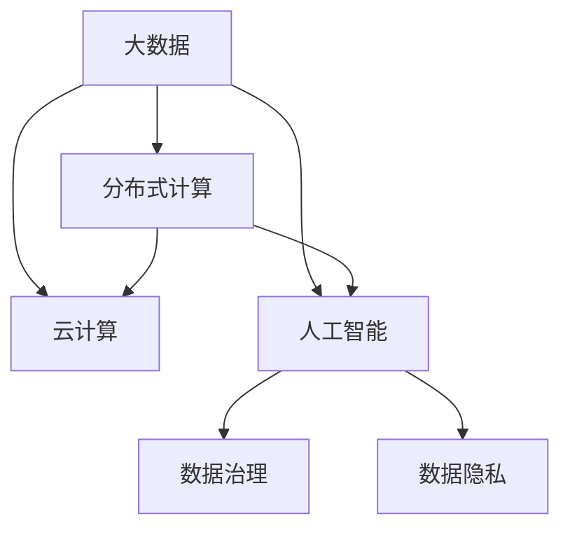

                 

## 1. 背景介绍

### 1.1 问题由来

大数据时代的到来，标志着人类计算能力的一次飞跃。在过去几十年里，海量数据的生成和处理能力已经大大超过了计算机的存储和处理能力。这不仅带来了前所未有的机会，也带来了巨大的挑战。数据驱动的决策、精准的预测分析、个性化推荐、智能搜索等应用在商业、科研、政府等领域得到了广泛应用。然而，数据的隐私保护、数据质量控制、数据传输与存储、数据计算效率、算力成本等挑战也随之而来。

### 1.2 问题核心关键点

当前，大数据时代下人类计算所面临的机遇与挑战并存。机遇方面，大数据提供了更丰富的数据资源和更高效的处理工具，能够帮助我们挖掘数据背后的价值，提高决策的准确性，推动科技进步和社会进步。挑战方面，数据量庞大、种类繁多、分布广泛等特性使得大数据的处理和应用变得异常复杂，需要不断提升计算能力、优化数据处理技术、确保数据隐私和安全性。

## 2. 核心概念与联系

### 2.1 核心概念概述

为更好地理解大数据时代人类计算的机遇与挑战，本节将介绍几个密切相关的核心概念：

- 大数据(Big Data)：指数据量超出了传统数据库处理能力范围的数据集合，其特征为“4V”特性：Volume、Velocity、Variety、Veracity。大数据不仅包含海量的数据，还具有高速度、多样性、真实性等特点。
- 分布式计算(Distributed Computing)：指将大规模计算任务分解成若干子任务，分布在多台计算机上并行执行的计算模式。大数据的分布式计算通常采用Hadoop、Spark等开源框架。
- 云计算(Cloud Computing)：指通过网络提供计算资源和服务的计算模式，旨在高效利用计算资源，降低计算成本。云服务提供商如Amazon AWS、Google Cloud、Microsoft Azure等，提供了丰富的计算资源和大数据处理服务。
- 人工智能(Artificial Intelligence, AI)：指通过算法和计算实现智能化的技术，能够从大量数据中学习模式和规律，从而进行预测和决策。大数据提供了丰富的训练数据，是人工智能的重要基础。
- 数据治理(Data Governance)：指通过制定和执行数据标准和流程，确保数据的质量、安全性和可用性，从而提升数据驱动决策的效果。
- 数据隐私(Data Privacy)：指保护个人或组织数据不被非法获取、使用或泄露的技术手段。随着大数据应用的普及，数据隐私问题日益突出，需要引入相关法规和标准。

这些核心概念之间的逻辑关系可以通过以下Mermaid流程图来展示：



这个流程图展示了大数据时代人类计算的核心概念及其之间的关系：

1. 大数据作为计算的基础，通过分布式计算和云计算进行高效处理。
2. 人工智能在大数据基础上训练模型，进行智能分析和预测。
3. 数据治理和数据隐私保护是大数据应用的重要保障。

这些概念共同构成了大数据时代人类计算的基础架构，帮助我们在数据驱动的决策和智能化应用中取得更好的效果。

## 3. 核心算法原理 & 具体操作步骤
### 3.1 算法原理概述

大数据时代人类计算的核心算法是分布式计算和人工智能。其中，分布式计算负责高效地处理海量数据，而人工智能则通过对数据的深度学习、模式识别、预测分析等技术，挖掘数据背后的价值。

分布式计算的核心思想是将大规模计算任务分解成若干子任务，并在多台计算机上并行执行。其关键步骤如下：

1. 任务划分：将一个大规模任务分解成若干子任务，每个子任务在本地处理后进行汇总。
2. 数据分片：将大数据分片并分布在多台计算机上，确保数据分布均衡，防止计算瓶颈。
3. 并行执行：多个节点同时执行各自的子任务，减少总体的计算时间。
4. 结果合并：汇总各节点的计算结果，形成最终的计算结果。

人工智能在大数据时代的应用主要基于机器学习和深度学习算法。其核心思想是通过大量数据训练模型，让机器能够从数据中学习到规律和模式，进行预测、分类、聚类、回归等任务。具体步骤包括：

1. 数据收集：从多个数据源收集数据，确保数据的多样性和完备性。
2. 数据预处理：清洗、转换和规整数据，确保数据的质量和一致性。
3. 特征工程：选择和构造特征，提取数据中的关键信息。
4. 模型训练：选择合适模型进行训练，调整模型参数，提高模型性能。
5. 模型评估：使用验证集或测试集对模型进行评估，选择最优模型。
6. 模型应用：将训练好的模型应用于实际问题，进行预测和决策。

### 3.2 算法步骤详解

#### 分布式计算的具体步骤

1. 任务划分：
   - 将一个大规模任务分解成若干子任务，例如 MapReduce 模型中的 Map 和 Reduce 操作。
   - 每个子任务在本地处理后生成中间结果。
   - 将中间结果通过网络传输到主节点进行合并。

2. 数据分片：
   - 将大数据分片并分布在多台计算机上，例如 Hadoop 框架中的数据分片技术。
   - 确保数据分布均衡，防止某些节点数据过多导致计算瓶颈。

3. 并行执行：
   - 多个节点同时执行各自的子任务，例如 Spark 框架中的任务调度。
   - 采用并行执行，可以减少总体计算时间。

4. 结果合并：
   - 汇总各节点的计算结果，例如 MapReduce 模型中的 Reduce 操作。
   - 生成最终的计算结果，例如 Hadoop 框架中的数据合并操作。

#### 人工智能的具体步骤

1. 数据收集：
   - 从多个数据源收集数据，例如传感器、数据库、文件等。
   - 使用分布式数据存储技术，如 HDFS、Ceph 等，保证数据的可扩展性和可靠性。

2. 数据预处理：
   - 清洗数据，去除噪声和缺失值。
   - 数据转换和规整，例如标准化、归一化、特征提取等。
   - 使用分布式计算框架，如 Hadoop、Spark 等，进行并行数据预处理。

3. 特征工程：
   - 选择和构造特征，例如提取文本特征、图像特征、时间序列特征等。
   - 使用特征选择和降维技术，如 PCA、LDA 等，提高特征质量。
   - 采用分布式特征工程工具，如 Dask、MLlib 等，进行高效的特征处理。

4. 模型训练：
   - 选择合适模型，例如线性回归、逻辑回归、决策树、随机森林、神经网络等。
   - 调整模型参数，例如学习率、正则化系数、迭代次数等。
   - 使用分布式训练框架，如 TensorFlow、PyTorch 等，进行并行模型训练。

5. 模型评估：
   - 使用验证集或测试集对模型进行评估，例如交叉验证、留一法等。
   - 计算模型性能指标，例如准确率、召回率、F1 值等。
   - 选择最优模型，例如使用交叉验证结果进行模型选择。

6. 模型应用：
   - 将训练好的模型应用于实际问题，例如推荐系统、图像识别、自然语言处理等。
   - 使用分布式计算框架，进行高效的模型应用和预测。

### 3.3 算法优缺点

分布式计算的优点包括：
- 可扩展性：通过并行处理，能够处理大规模数据集。
- 高性能：通过分布式计算，能够显著提高计算速度。
- 可靠性：通过数据分片和冗余存储，能够提高系统的可靠性和容错性。

分布式计算的缺点包括：
- 数据传输开销：数据在不同节点之间传输，增加了网络开销。
- 系统复杂性：分布式系统的设计和管理比较复杂，需要一定的专业知识。

人工智能的优点包括：
- 高准确性：通过大量数据训练，能够提高预测和决策的准确性。
- 自适应性：通过深度学习算法，能够从数据中学习规律和模式，适应不同的任务。
- 广泛应用：人工智能在众多领域都有应用，如医疗、金融、交通、制造等。

人工智能的缺点包括：
- 计算资源需求高：需要大量的计算资源和存储空间。
- 模型复杂性：深度学习模型的复杂性较高，难以解释和调试。
- 数据隐私问题：需要处理大量的敏感数据，涉及数据隐私和安全问题。

### 3.4 算法应用领域

大数据时代人类计算的应用领域非常广泛，涵盖以下几个方面：

1. 商业分析：利用大数据和人工智能技术，进行市场分析、客户行为分析、广告投放优化等。
2. 医疗健康：利用大数据和人工智能技术，进行疾病预测、基因分析、医疗影像识别等。
3. 金融服务：利用大数据和人工智能技术，进行信用评估、风险控制、投资预测等。
4. 智慧城市：利用大数据和人工智能技术，进行交通管理、环境监测、公共安全等。
5. 工业制造：利用大数据和人工智能技术，进行设备监控、生产调度、质量控制等。
6. 农业农村：利用大数据和人工智能技术，进行农产品质量检测、气象预测、农机自动化等。
7. 社会治理：利用大数据和人工智能技术，进行舆情分析、公共安全、城市管理等。

以上领域覆盖了大数据时代人类计算的主要应用场景，展示了其在不同领域带来的广泛影响。

## 4. 数学模型和公式 & 详细讲解 & 举例说明

### 4.1 数学模型构建

在大数据时代，常用的数学模型包括线性回归、逻辑回归、决策树、随机森林、神经网络等。这里以线性回归模型为例，展示其数学模型构建过程。

假设有一组训练数据集 $(x_i, y_i)$，其中 $x_i$ 为特征向量，$y_i$ 为标签值。线性回归模型的目标是通过训练数据集，学习到特征与标签之间的线性关系，即 $y_i = w^T x_i + b$，其中 $w$ 为权重向量，$b$ 为偏置项。

使用梯度下降算法进行模型训练，目标是最小化损失函数 $J(w)$，其中损失函数通常选择均方误差（MSE）：

$$
J(w) = \frac{1}{2m} \sum_{i=1}^m (y_i - w^T x_i - b)^2
$$

模型训练的优化目标是最小化损失函数 $J(w)$，即：

$$
\hat{w}, \hat{b} = \mathop{\arg\min}_{w, b} J(w)
$$

其中 $\hat{w}, \hat{b}$ 为最优的权重向量和偏置项。

### 4.2 公式推导过程

线性回归模型的公式推导过程如下：

1. 均方误差（MSE）：
   - $J(w) = \frac{1}{2m} \sum_{i=1}^m (y_i - w^T x_i - b)^2$
   
2. 偏导数计算：
   - $\frac{\partial J(w)}{\partial w} = \frac{1}{m} \sum_{i=1}^m (y_i - w^T x_i - b)x_i$
   - $\frac{\partial J(w)}{\partial b} = \frac{1}{m} \sum_{i=1}^m (y_i - w^T x_i - b)$
   
3. 梯度下降：
   - $w \leftarrow w - \eta \frac{\partial J(w)}{\partial w}$
   - $b \leftarrow b - \eta \frac{\partial J(w)}{\partial b}$
   - $\eta$ 为学习率，控制每次迭代步长。

4. 模型预测：
   - $\hat{y} = w^T x + b$
   - 将训练好的模型应用于新数据集，进行预测。

### 4.3 案例分析与讲解

以图像分类为例，展示如何使用深度学习模型进行图像分类任务。假设有一组图像数据集，每个图像都有像素值 $x$，每个像素值是一个标量。通过卷积神经网络（CNN）模型，将像素值 $x$ 映射到标签值 $y$。

假设卷积神经网络模型由多个卷积层、池化层和全连接层组成。模型的输出为 $y = w^T h + b$，其中 $h$ 为中间层的特征向量，$w$ 为权重向量，$b$ 为偏置项。

训练时，使用交叉熵损失函数（Cross-Entropy Loss），目标是最小化损失函数 $J(w)$：

$$
J(w) = -\frac{1}{m} \sum_{i=1}^m y_i \log \hat{y}_i
$$

模型训练的优化目标是最小化损失函数 $J(w)$，即：

$$
\hat{w}, \hat{b} = \mathop{\arg\min}_{w, b} J(w)
$$

其中 $\hat{w}, \hat{b}$ 为最优的权重向量和偏置项。

使用梯度下降算法进行模型训练，目标是最小化损失函数 $J(w)$，即：

$$
\frac{\partial J(w)}{\partial w} = -\frac{1}{m} \sum_{i=1}^m (y_i - \hat{y}_i) \frac{\partial \hat{y}_i}{\partial w}
$$

模型训练的优化目标是最小化损失函数 $J(w)$，即：

$$
\hat{w}, \hat{b} = \mathop{\arg\min}_{w, b} J(w)
$$

其中 $\hat{w}, \hat{b}$ 为最优的权重向量和偏置项。

模型训练完成后，使用测试集对模型进行评估，计算准确率、召回率、F1 值等指标，选择最优模型进行预测。

## 5. 项目实践：代码实例和详细解释说明

### 5.1 开发环境搭建

在进行大数据计算和人工智能项目实践前，我们需要准备好开发环境。以下是使用Python进行PyTorch开发的环境配置流程：

1. 安装Anaconda：从官网下载并安装Anaconda，用于创建独立的Python环境。

2. 创建并激活虚拟环境：
```bash
conda create -n pytorch-env python=3.8 
conda activate pytorch-env
```

3. 安装PyTorch：根据CUDA版本，从官网获取对应的安装命令。例如：
```bash
conda install pytorch torchvision torchaudio cudatoolkit=11.1 -c pytorch -c conda-forge
```

4. 安装TensorFlow：使用pip安装TensorFlow，如：
```bash
pip install tensorflow
```

5. 安装各类工具包：
```bash
pip install numpy pandas scikit-learn matplotlib tqdm jupyter notebook ipython
```

完成上述步骤后，即可在`pytorch-env`环境中开始实践。

### 5.2 源代码详细实现

下面是使用PyTorch和TensorFlow进行分布式计算和人工智能项目开发的代码实现。

#### 分布式计算：MapReduce示例

```python
import multiprocessing

def map_fn(key, value):
    # 将值转化为关键值
    return key

def reduce_fn(accumulator, key, value):
    # 将值累加到关键值
    accumulator[key] += value
    return accumulator

def map_reduce(data):
    # 将数据按照key-value分割
    input = {}
    for k, v in data.items():
        if map_fn(k, v) not in input:
            input[map_fn(k, v)] = []
        input[map_fn(k, v)].append(v)
    
    # 并行计算
    pool = multiprocessing.Pool()
    map_output = pool.map(map_fn, data.keys())
    
    # 并行归并
    reduce_output = {}
    for key in map_output:
        reduce_output[key] = reduce_fn({}, key, map_output[key])
    
    return reduce_output

if __name__ == '__main__':
    # 模拟数据集
    data = {1: 'A', 2: 'B', 3: 'C', 4: 'D', 5: 'E'}
    
    # 进行MapReduce计算
    output = map_reduce(data)
    print(output)
```

#### 人工智能：线性回归示例

```python
import torch
import torch.nn as nn
import torch.optim as optim

class LinearRegression(nn.Module):
    def __init__(self, input_size, output_size):
        super(LinearRegression, self).__init__()
        self.linear = nn.Linear(input_size, output_size)
    
    def forward(self, x):
        out = self.linear(x)
        return out
    
    def train(self, X_train, y_train, X_test, y_test, learning_rate, num_epochs):
        criterion = nn.MSELoss()
        optimizer = optim.SGD(self.parameters(), lr=learning_rate)
        
        for epoch in range(num_epochs):
            optimizer.zero_grad()
            outputs = self(X_train)
            loss = criterion(outputs, y_train)
            loss.backward()
            optimizer.step()
            
            if epoch % 10 == 0:
                test_outputs = self(X_test)
                test_loss = criterion(test_outputs, y_test)
                print('Epoch [{}/{}], Loss: {:.4f}, Test Loss: {:.4f}'.format(epoch+1, num_epochs, loss.item(), test_loss.item()))

model = LinearRegression(input_size=1, output_size=1)
X_train = torch.tensor([[1.0], [2.0], [3.0], [4.0], [5.0]])
y_train = torch.tensor([[2.0], [4.0], [6.0], [8.0], [10.0]])
X_test = torch.tensor([[6.0]])
y_test = torch.tensor([[12.0]])

model.train(X_train, y_train, X_test, y_test, learning_rate=0.01, num_epochs=1000)
```

### 5.3 代码解读与分析

#### 分布式计算代码解读

```python
import multiprocessing

def map_fn(key, value):
    # 将值转化为关键值
    return key

def reduce_fn(accumulator, key, value):
    # 将值累加到关键值
    accumulator[key] += value
    return accumulator

def map_reduce(data):
    # 将数据按照key-value分割
    input = {}
    for k, v in data.items():
        if map_fn(k, v) not in input:
            input[map_fn(k, v)] = []
        input[map_fn(k, v)].append(v)
    
    # 并行计算
    pool = multiprocessing.Pool()
    map_output = pool.map(map_fn, data.keys())
    
    # 并行归并
    reduce_output = {}
    for key in map_output:
        reduce_output[key] = reduce_fn({}, key, map_output[key])
    
    return reduce_output

if __name__ == '__main__':
    # 模拟数据集
    data = {1: 'A', 2: 'B', 3: 'C', 4: 'D', 5: 'E'}
    
    # 进行MapReduce计算
    output = map_reduce(data)
    print(output)
```

上述代码实现了MapReduce计算，将数据按照key-value分割，并行计算和归并。其中，`map_fn`函数将值转化为关键值，`reduce_fn`函数将值累加到关键值，`map_reduce`函数实现了MapReduce的具体计算过程。

#### 人工智能代码解读

```python
import torch
import torch.nn as nn
import torch.optim as optim

class LinearRegression(nn.Module):
    def __init__(self, input_size, output_size):
        super(LinearRegression, self).__init__()
        self.linear = nn.Linear(input_size, output_size)
    
    def forward(self, x):
        out = self.linear(x)
        return out
    
    def train(self, X_train, y_train, X_test, y_test, learning_rate, num_epochs):
        criterion = nn.MSELoss()
        optimizer = optim.SGD(self.parameters(), lr=learning_rate)
        
        for epoch in range(num_epochs):
            optimizer.zero_grad()
            outputs = self(X_train)
            loss = criterion(outputs, y_train)
            loss.backward()
            optimizer.step()
            
            if epoch % 10 == 0:
                test_outputs = self(X_test)
                test_loss = criterion(test_outputs, y_test)
                print('Epoch [{}/{}], Loss: {:.4f}, Test Loss: {:.4f}'.format(epoch+1, num_epochs, loss.item(), test_loss.item()))

model = LinearRegression(input_size=1, output_size=1)
X_train = torch.tensor([[1.0], [2.0], [3.0], [4.0], [5.0]])
y_train = torch.tensor([[2.0], [4.0], [6.0], [8.0], [10.0]])
X_test = torch.tensor([[6.0]])
y_test = torch.tensor([[12.0]])

model.train(X_train, y_train, X_test, y_test, learning_rate=0.01, num_epochs=1000)
```

上述代码实现了线性回归模型的训练过程。首先定义了`LinearRegression`模型类，使用PyTorch的`nn`模块和`optim`模块实现线性回归模型的训练。训练过程中，使用均方误差损失函数和随机梯度下降算法进行模型训练。

## 6. 实际应用场景

### 6.1 智能推荐系统

智能推荐系统是大数据时代人类计算的重要应用之一。利用分布式计算和大数据技术，推荐系统能够从用户行为数据中学习用户的兴趣和偏好，实时生成个性化推荐内容，提高用户的满意度。

推荐系统的实现过程如下：

1. 数据收集：收集用户的历史行为数据，例如浏览、购买、点击等行为。
2. 数据预处理：清洗、转换和规整数据，例如去重、标准化、归一化等。
3. 特征工程：选择和构造特征，例如用户ID、商品ID、行为时间、行为次数等。
4. 模型训练：选择合适模型进行训练，例如协同过滤、基于内容的推荐、混合推荐等。
5. 模型评估：使用验证集或测试集对模型进行评估，例如准确率、召回率、F1 值等。
6. 模型应用：将训练好的模型应用于新用户，生成个性化推荐内容。

### 6.2 智慧城市管理

智慧城市管理是大数据时代人类计算的另一个重要应用。利用大数据和人工智能技术，智慧城市能够对城市运行状态进行实时监测和分析，提升城市管理的智能化水平，提高公共服务效率。

智慧城市管理的实现过程如下：

1. 数据收集：收集城市运行数据，例如交通流量、空气质量、公共设施使用情况等。
2. 数据预处理：清洗、转换和规整数据，例如去重、标准化、归一化等。
3. 特征工程：选择和构造特征，例如时间、位置、设备状态、使用频率等。
4. 模型训练：选择合适模型进行训练，例如时间序列预测、异常检测、聚类等。
5. 模型评估：使用验证集或测试集对模型进行评估，例如均方误差、准确率、召回率等。
6. 模型应用：将训练好的模型应用于城市运行，进行实时监测和分析，优化城市管理。

### 6.3 工业制造控制

工业制造控制是大数据时代人类计算的另一个重要应用。利用大数据和人工智能技术，工业制造能够对生产设备进行实时监测和预测，优化生产流程，提高生产效率。

工业制造控制的实现过程如下：

1. 数据收集：收集生产设备运行数据，例如温度、压力、振动、电流等。
2. 数据预处理：清洗、转换和规整数据，例如去重、标准化、归一化等。
3. 特征工程：选择和构造特征，例如设备状态、运行时间、生产任务等。
4. 模型训练：选择合适模型进行训练，例如时间序列预测、异常检测、聚类等。
5. 模型评估：使用验证集或测试集对模型进行评估，例如均方误差、准确率、召回率等。
6. 模型应用：将训练好的模型应用于生产设备，进行实时监测和预测，优化生产流程。

## 7. 工具和资源推荐

### 7.1 学习资源推荐

为了帮助开发者系统掌握大数据时代人类计算的理论基础和实践技巧，这里推荐一些优质的学习资源：

1. 《大数据时代：数据驱动与智能分析》：详细介绍了大数据时代的技术背景、数据分析方法、智能算法等。
2. 《分布式计算基础》：讲解了分布式计算的基本概念、技术架构、实际应用等。
3. 《人工智能基础》：介绍了人工智能的基本概念、算法、应用等。
4. 《机器学习实战》：提供了丰富的机器学习应用案例和代码实现。
5. 《深度学习入门》：介绍了深度学习的基本概念、算法、应用等。
6. 《大数据处理框架》：讲解了Hadoop、Spark等大数据处理框架的使用方法和最佳实践。

通过学习这些资源，相信你一定能够系统掌握大数据时代人类计算的精髓，并用于解决实际的计算问题。

### 7.2 开发工具推荐

高效的开发离不开优秀的工具支持。以下是几款用于大数据计算和人工智能项目开发的常用工具：

1. Hadoop：开源的分布式计算框架，用于大规模数据的存储和计算。
2. Spark：基于内存计算的分布式计算框架，提供了多种API和算法库，支持大规模数据处理和机器学习。
3. TensorFlow：开源的深度学习框架，支持分布式训练和模型应用。
4. PyTorch：开源的深度学习框架，提供了灵活的模型定义和高效计算能力。
5. Scikit-learn：开源的机器学习库，提供了多种算法和工具，支持数据预处理和模型评估。
6. Jupyter Notebook：开源的交互式计算环境，支持Python代码的在线编写和执行。
7. GitHub：开源代码托管平台，支持版本控制和协作开发。

合理利用这些工具，可以显著提升大数据计算和人工智能项目的开发效率，加快创新迭代的步伐。

### 7.3 相关论文推荐

大数据时代人类计算的发展源于学界的持续研究。以下是几篇奠基性的相关论文，推荐阅读：

1. Google BigQuery：由Google推出的云上数据仓库，支持大规模数据处理和分析。
2. Hadoop MapReduce：Google开源的分布式计算框架，支持大规模数据的存储和计算。
3. TensorFlow分布式训练：Google开源的深度学习框架，支持分布式训练和模型应用。
4. PyTorch分布式计算：Facebook开源的深度学习框架，支持分布式训练和模型应用。
5. Spark MLlib：Apache开源的机器学习库，支持大规模数据处理和机器学习。
6. Scikit-learn多任务学习：由Scikit-learn开源的机器学习库，支持多任务学习和数据预处理。

这些论文代表了大数据时代人类计算的发展脉络。通过学习这些前沿成果，可以帮助研究者把握学科前进方向，激发更多的创新灵感。

## 8. 总结：未来发展趋势与挑战

### 8.1 总结

本文对大数据时代人类计算的机遇与挑战进行了全面系统的介绍。首先阐述了大数据时代的技术背景和应用前景，明确了人类计算在商业、科研、政府等领域的广阔应用。其次，从原理到实践，详细讲解了分布式计算和人工智能算法的数学模型和实现方法，给出了大数据计算和人工智能项目开发的完整代码实例。同时，本文还广泛探讨了大数据时代人类计算的实际应用场景，展示了其在商业、智慧城市、工业制造等领域的广泛应用。最后，本文精选了大数据时代人类计算的学习资源、开发工具和相关论文，力求为读者提供全方位的技术指引。

通过本文的系统梳理，可以看到，大数据时代人类计算提供了前所未有的计算能力和数据资源，帮助我们在商业决策、智慧城市管理、工业制造控制等方面取得显著进展。但与此同时，数据隐私、计算资源、模型复杂性等挑战也伴随着计算能力的提升，需要我们不断提升技术水平，优化系统设计，以应对这些挑战。

### 8.2 未来发展趋势

展望未来，大数据时代人类计算将呈现以下几个发展趋势：

1. 大数据计算：随着数据量的不断增长，大数据计算的需求将更加迫切。云计算、分布式计算、边缘计算等技术将进一步发展，提供更加高效、可靠的大数据计算能力。
2. 人工智能发展：人工智能技术将在多个领域得到广泛应用，推动各行各业的智能化进程。深度学习、自然语言处理、计算机视觉等技术将不断突破，提升模型的性能和应用效果。
3. 跨领域融合：大数据时代人类计算将与其他领域技术进行更深入的融合，如物联网、区块链、区块链、5G等技术，形成更加全面、高效的计算体系。
4. 数据治理加强：数据治理技术将不断提升，确保数据的质量、安全性和可用性，促进数据驱动决策的有效性。
5. 隐私保护优化：数据隐私保护技术将不断优化，确保数据的安全性和合法性，满足用户对数据隐私的需求。

以上趋势凸显了大数据时代人类计算的广阔前景。这些方向的探索发展，必将进一步提升计算能力和数据处理能力，推动计算技术的不断进步。

### 8.3 面临的挑战

尽管大数据时代人类计算已经取得了显著进展，但在迈向更加智能化、普适化应用的过程中，它仍面临诸多挑战：

1. 数据量过大：随着数据量的不断增长，数据的存储和处理需求也将不断增加。如何高效存储和处理大规模数据，是未来计算发展的关键挑战。
2. 数据质量参差不齐：不同来源的数据质量参差不齐，如何清洗、转换和规整数据，是数据处理的难点。
3. 计算资源成本高：大规模计算任务需要大量的计算资源，如何降低计算成本，是未来计算发展的关键难题。
4. 计算模型复杂：深度学习模型和分布式计算模型复杂度较高，如何简化模型设计，提高计算效率，是未来计算发展的关键方向。
5. 数据隐私问题：大规模数据处理涉及用户隐私和数据安全问题，如何保护用户隐私，是未来计算发展的关键问题。

### 8.4 研究展望

面对大数据时代人类计算所面临的挑战，未来的研究需要在以下几个方面寻求新的突破：

1. 数据存储优化：开发更高效的数据存储技术，如分布式存储、块存储、云存储等，提升数据存储和处理的效率。
2. 数据预处理优化：开发更高效的数据预处理技术，如数据清洗、数据转换、数据规整等，提高数据质量和可用性。
3. 计算资源优化：开发更高效的计算资源调度技术，如任务调度、资源分配、容错机制等，降低计算成本。
4. 模型简化优化：开发更简单的计算模型，如基于混合精度的计算模型、基于稀疏化的计算模型等，提升计算效率。
5. 隐私保护优化：开发更强的隐私保护技术，如数据脱敏、差分隐私、联邦学习等，保护用户隐私。

这些研究方向的探索，必将引领大数据时代人类计算技术的不断进步，推动计算技术的广泛应用和普及。总之，大数据时代人类计算技术需要在计算能力、数据处理、模型设计、隐私保护等方面进行持续优化，才能满足未来计算发展的需求。

## 9. 附录：常见问题与解答

**Q1：什么是分布式计算？**

A: 分布式计算是将大规模计算任务分解成若干子任务，并在多台计算机上并行执行的计算模式。其核心思想是并行处理，通过分布式计算框架实现数据的分布式存储和处理。

**Q2：什么是人工智能？**

A: 人工智能是指通过算法和计算实现智能化的技术，能够从大量数据中学习模式和规律，从而进行预测和决策。深度学习、自然语言处理、计算机视觉等技术是人工智能的重要分支。

**Q3：什么是数据治理？**

A: 数据治理是指通过制定和执行数据标准和流程，确保数据的质量、安全性和可用性，从而提升数据驱动决策的效果。数据治理包括数据采集、数据存储、数据处理、数据共享等多个环节。

**Q4：什么是数据隐私？**

A: 数据隐私是指保护个人或组织数据不被非法获取、使用或泄露的技术手段。数据隐私问题在大数据时代尤为突出，需要引入相关法规和标准，保护用户数据安全。

**Q5：大数据时代人类计算面临哪些挑战？**

A: 大数据时代人类计算面临诸多挑战，主要包括：数据量过大、数据质量参差不齐、计算资源成本高、计算模型复杂、数据隐私问题等。这些挑战需要通过优化数据存储、预处理、资源调度、模型设计、隐私保护等技术手段进行应对。

**Q6：未来大数据时代人类计算的发展趋势是什么？**

A: 未来大数据时代人类计算的发展趋势包括：大数据计算、人工智能发展、跨领域融合、数据治理加强、隐私保护优化等。这些趋势将推动计算技术的不断进步，带来更多创新应用。

**Q7：如何提高大数据时代人类计算的效率？**

A: 提高大数据时代人类计算的效率需要优化数据存储、预处理、资源调度、模型设计、隐私保护等多个方面。例如，使用分布式存储技术提高数据存储效率，使用混合精度计算和稀疏化计算模型提高计算效率，使用联邦学习和差分隐私保护技术保护用户隐私。

**Q8：未来大数据时代人类计算的应用场景有哪些？**

A: 未来大数据时代人类计算的应用场景非常广泛，包括商业分析、智慧城市管理、工业制造控制、医疗健康、金融服务、农业农村、社会治理等多个领域。这些应用场景将进一步推动计算技术的广泛应用。

作者：禅与计算机程序设计艺术 / Zen and the Art of Computer Programming

