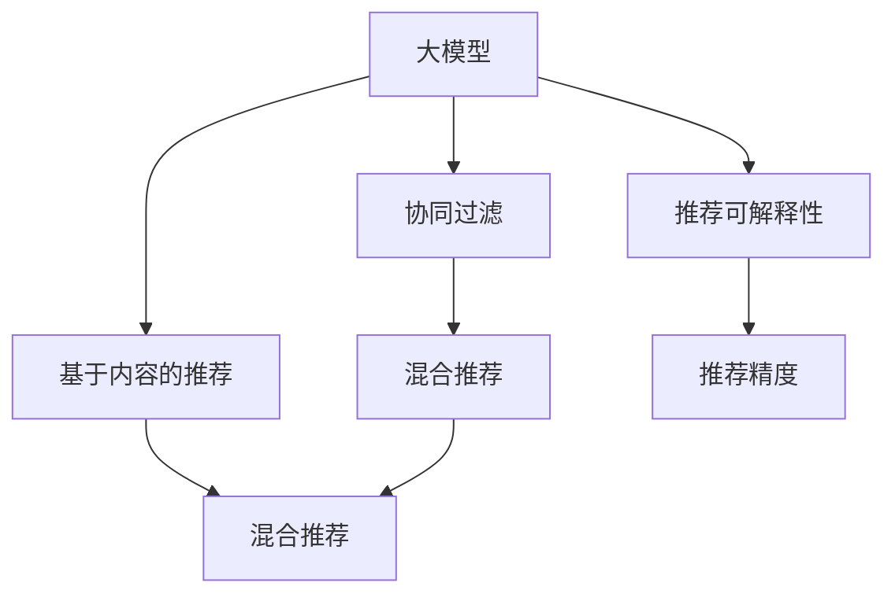

                 

# 大模型在商业中的应用：推荐系统的潜力

> 关键词：大模型,推荐系统,协同过滤,深度学习,强化学习,可解释性,推荐精度

## 1. 背景介绍

### 1.1 问题由来
随着互联网的迅猛发展和数字经济的崛起，推荐系统已成为了电子商务、媒体内容、社交网络等领域的核心技术，它们能够根据用户的历史行为和偏好，智能推荐个性化产品和服务。传统的推荐算法如协同过滤、基于内容的推荐在规模化应用中已经逐渐显示出其局限性。

近年来，基于大模型的推荐系统应运而生，借助深度学习、强化学习等先进算法，大模型在推荐精度和泛化能力上取得了显著提升，被广泛运用于电商、视频、音乐等多个场景，提升了用户体验，同时带来了巨大的商业价值。

### 1.2 问题核心关键点
本节介绍大模型在推荐系统中的核心问题，主要包括以下几点：

- **大模型推荐：** 利用大规模深度学习模型，从用户行为和商品特征中提取高层次的表征，进行推荐决策。
- **协同过滤：** 通过分析用户间的相似性，推荐与用户兴趣相近的商品。
- **基于内容的推荐：** 通过分析商品的属性和描述，推荐与用户过去喜欢的商品相似的商品。
- **推荐算法融合：** 多种算法融合，取长补短，提升推荐效果。
- **可解释性：** 大模型推荐的黑箱问题，如何通过后处理手段增强推荐系统的可解释性。
- **推荐精度：** 如何通过优化算法和模型结构，提升推荐系统的准确性和个性化程度。

## 2. 核心概念与联系

### 2.1 核心概念概述

为更好地理解大模型在推荐系统中的应用，本节将介绍几个关键概念：

- **大模型（Large Models）：** 指大规模的深度学习模型，如BERT、GPT等，在推荐系统中应用广泛。
- **协同过滤（Collaborative Filtering, CF）：** 利用用户间的相似性，推荐与用户兴趣相似的商品。
- **基于内容的推荐（Content-based Recommendation）：** 通过分析商品属性，推荐与用户兴趣相关的商品。
- **混合推荐（Hybrid Recommendation）：** 融合多种推荐算法，提升推荐效果。
- **推荐可解释性（Explainability）：** 解释推荐结果的依据，提升用户信任度。
- **推荐精度（Recommendation Precision）：** 衡量推荐结果的准确性。

这些概念之间的逻辑关系可以通过以下Mermaid流程图来展示：



该流程图展示了推荐系统中几个核心概念及其之间的关系：

1. 大模型作为基础推荐引擎，提供了高层次的表征学习能力。
2. 协同过滤和基于内容的推荐是两种主要的推荐策略，融合可进一步提升推荐效果。
3. 推荐可解释性通过后处理手段增强，提高用户信任度。
4. 推荐精度是衡量推荐系统效果的最重要指标。

## 3. 核心算法原理 & 具体操作步骤
### 3.1 算法原理概述

大模型在推荐系统中的主要应用是通过深度学习模型，提取用户和商品的隐式特征，构建用户-商品间的交互模型，并在此基础上进行推荐决策。

假设推荐系统的输入是用户 $u$ 和商品 $i$ 的特征表示 $\mathbf{u},\mathbf{i}$，以及用户 $u$ 对商品 $i$ 的评分 $y_{ui}$。深度学习模型可以通过多层次的特征抽取和映射，学习用户和商品之间的复杂关联，并预测评分。

常用的深度学习模型包括：

- **自编码器（Autoencoder）：** 通过用户-商品对的数据，训练一个编码器和一个解码器，学习用户和商品的隐式特征表示。
- **卷积神经网络（CNN）：** 通过商品的属性数据，提取商品的视觉特征。
- **循环神经网络（RNN）：** 通过用户的历史行为序列，学习用户的行为模式。
- **变分自编码器（VAE）：** 通过用户和商品的数据，学习低维隐空间表示。

### 3.2 算法步骤详解

基于大模型的推荐系统的一般步骤如下：

**Step 1: 数据准备**
- 收集用户行为数据，如浏览、点击、购买记录。
- 提取商品属性和描述，构建商品向量。
- 清洗数据，处理缺失值、异常值等。

**Step 2: 特征表示**
- 使用深度学习模型对用户行为数据和商品数据进行特征表示。
- 对用户特征 $\mathbf{u}$ 和商品特征 $\mathbf{i}$ 进行编码，得到隐式表示 $\mathbf{u'},\mathbf{i'}$。
- 融合用户-商品对数据，得到融合特征 $\mathbf{v}$。

**Step 3: 用户商品关联**
- 利用编码后的用户和商品特征，通过点积、相似度等方法，计算用户和商品间的关联强度。
- 将关联强度作为推荐分数，用于推荐排序。

**Step 4: 推荐排序**
- 将推荐分数进行排序，得到推荐的商品列表。
- 根据用户行为数据和推荐分数，综合考虑推荐结果的个性化程度。

**Step 5: 后处理与优化**
- 对推荐结果进行后处理，增强可解释性和用户体验。
- 定期对模型进行优化，提升推荐精度和效果。

### 3.3 算法优缺点

基于大模型的推荐系统具有以下优点：

1. **高维表征学习：** 通过深度学习模型，可以学习用户和商品的高维特征表示，提升推荐的精度和泛化能力。
2. **跨领域适应：** 大模型具有较好的跨领域适应能力，能够从多源数据中学习到更全面的特征。
3. **模型复杂度低：** 通过大模型，可以用较少的参数构建复杂的推荐系统，提升计算效率。
4. **自动化程度高：** 自动化的模型训练和优化，可以大大减轻人工干预的工作量。

但同时，该方法也存在以下缺点：

1. **高计算成本：** 大模型的训练和推理需要大量的计算资源，成本较高。
2. **黑箱问题：** 深度学习模型通常是黑盒的，难以解释其内部决策过程，不利于用户体验。
3. **数据隐私问题：** 用户数据和商品数据的隐私问题需要重视，处理不当可能导致数据泄露。
4. **模型退化问题：** 大模型容易出现过拟合或欠拟合的问题，需要定期优化和更新。

### 3.4 算法应用领域

基于大模型的推荐系统已经在多个领域得到应用，以下是几个典型的应用场景：

1. **电子商务：** 根据用户浏览和购买行为，推荐商品，提升转化率和销售额。
2. **视频平台：** 根据用户观看记录和评分，推荐视频内容，提升用户观看时长和满意度。
3. **音乐平台：** 根据用户听歌记录和评分，推荐音乐和歌单，提升用户粘性和音乐发现率。
4. **社交网络：** 根据用户交互行为，推荐好友和内容，提升用户活跃度和社交体验。
5. **移动应用：** 根据用户使用行为，推荐个性化内容和功能，提升应用留存率和用户粘性。

这些应用场景展示了基于大模型的推荐系统在实际商业中的广泛应用，为各行各业带来了显著的商业价值。

## 4. 数学模型和公式 & 详细讲解  
### 4.1 数学模型构建

本节将使用数学语言对基于大模型的推荐系统进行严格的数学描述。

假设推荐系统的输入是用户 $u$ 和商品 $i$ 的特征表示 $\mathbf{u},\mathbf{i}$，以及用户 $u$ 对商品 $i$ 的评分 $y_{ui}$。定义用户 $u$ 对商品 $i$ 的评分函数为 $f_{ui}$，假设其服从正态分布 $N(0,1)$，则推荐系统的损失函数为：

$$
\mathcal{L} = -\frac{1}{N}\sum_{ui}\log f_{ui} + \frac{\lambda}{2}\|\theta\|^2
$$

其中 $\theta$ 为模型参数，$N$ 为训练样本数，$\lambda$ 为正则化系数。

### 4.2 公式推导过程

以深度学习模型的点积形式为例，进行公式推导。假设用户和商品的隐式表示为 $\mathbf{u'},\mathbf{i'}$，则用户 $u$ 对商品 $i$ 的评分函数为：

$$
f_{ui} = \mathbf{u'} \cdot \mathbf{i'}
$$

根据上述损失函数，通过梯度下降算法，更新模型参数 $\theta$，可以得到：

$$
\theta \leftarrow \theta - \eta\nabla_{\theta}\mathcal{L}
$$

其中 $\eta$ 为学习率，$\nabla_{\theta}\mathcal{L}$ 为损失函数对模型参数的梯度。

通过上述推导，可以发现基于大模型的推荐系统在数学上是可解释的，其优化目标和优化过程清晰明了。

### 4.3 案例分析与讲解

以下是一个基于大模型的推荐系统的案例分析：

假设某电商平台有 $M$ 个商品，$N$ 个用户，收集到了用户对商品的评分数据。利用深度学习模型，对用户行为和商品属性进行特征表示，得到隐式表示 $\mathbf{u'},\mathbf{i'}$。

通过点积形式的评分函数，计算用户 $u$ 对商品 $i$ 的评分 $f_{ui}$。将评分数据和隐式表示输入到神经网络中，通过反向传播更新模型参数 $\theta$，最小化损失函数 $\mathcal{L}$。

最后，将模型预测的推荐分数进行排序，得到推荐列表。通过后处理手段，增强推荐结果的可解释性，如引入相关性反馈机制，解释推荐依据等。

## 5. 项目实践：代码实例和详细解释说明
### 5.1 开发环境搭建

在进行推荐系统开发前，我们需要准备好开发环境。以下是使用Python进行TensorFlow开发的环境配置流程：

1. 安装Anaconda：从官网下载并安装Anaconda，用于创建独立的Python环境。

2. 创建并激活虚拟环境：
```bash
conda create -n tf-env python=3.8 
conda activate tf-env
```

3. 安装TensorFlow：根据CUDA版本，从官网获取对应的安装命令。例如：
```bash
conda install tensorflow-gpu=2.6 -c tf -c conda-forge
```

4. 安装各类工具包：
```bash
pip install numpy pandas scikit-learn matplotlib tqdm jupyter notebook ipython
```

完成上述步骤后，即可在`tf-env`环境中开始推荐系统开发。

### 5.2 源代码详细实现

下面我们以电商推荐系统为例，给出使用TensorFlow进行深度学习模型微调的PyTorch代码实现。

首先，定义数据处理函数：

```python
import tensorflow as tf
from tensorflow.keras import layers, models
import numpy as np

def load_data():
    # 读取数据集，并进行处理
    # 假设数据集中包含用户ID、商品ID、评分等字段
    # 对数据集进行特征编码、归一化、划分等处理
    # 返回处理后的训练集和验证集数据
    pass

def preprocess_data(X_train, X_valid, y_train, y_valid):
    # 数据预处理，包括特征编码、归一化、划分等操作
    # 返回预处理后的训练集和验证集数据
    pass
```

然后，定义模型结构：

```python
def build_model(input_dim, output_dim):
    model = models.Sequential([
        layers.Dense(128, activation='relu', input_shape=(input_dim,)),
        layers.Dense(64, activation='relu'),
        layers.Dense(output_dim, activation='sigmoid')
    ])
    model.compile(optimizer='adam', loss='binary_crossentropy', metrics=['accuracy'])
    return model
```

接着，定义训练和评估函数：

```python
def train_model(model, X_train, X_valid, y_train, y_valid, epochs=10, batch_size=64):
    model.fit(X_train, y_train, epochs=epochs, batch_size=batch_size, validation_data=(X_valid, y_valid))
    return model

def evaluate_model(model, X_valid, y_valid):
    loss, accuracy = model.evaluate(X_valid, y_valid)
    print(f'Validation Loss: {loss:.4f}')
    print(f'Validation Accuracy: {accuracy:.4f}')
```

最后，启动训练流程并在验证集上评估：

```python
X_train, X_valid, y_train, y_valid = load_data()
X_train, X_valid, y_train, y_valid = preprocess_data(X_train, X_valid, y_train, y_valid)

model = build_model(input_dim, output_dim)
model = train_model(model, X_train, X_valid, y_train, y_valid)
evaluate_model(model, X_valid, y_valid)
```

以上就是使用TensorFlow对电商推荐系统进行深度学习模型微调的完整代码实现。可以看到，借助TensorFlow的强大工具，我们能够快速构建和训练推荐模型。

### 5.3 代码解读与分析

让我们再详细解读一下关键代码的实现细节：

**load_data函数：**
- 读取数据集，并进行数据预处理，包括特征编码、归一化、划分等操作。
- 返回处理后的训练集和验证集数据。

**preprocess_data函数：**
- 对输入数据进行进一步处理，包括数据增强、数据平衡、异常值处理等。
- 返回预处理后的训练集和验证集数据。

**build_model函数：**
- 定义深度学习模型的结构，包括输入层、隐藏层和输出层。
- 使用TensorFlow的Sequential模型，构建神经网络。
- 通过compile方法，设置优化器、损失函数和评估指标。

**train_model函数：**
- 使用训练数据集和验证数据集训练模型。
- 设置训练轮数和批大小，通过fit方法训练模型。
- 返回训练后的模型。

**evaluate_model函数：**
- 使用验证数据集评估模型的性能。
- 计算损失和准确率，打印输出评估结果。

**训练流程：**
- 读取数据集，并进行预处理。
- 定义模型结构，编译模型。
- 使用训练数据集训练模型，并使用验证数据集评估模型性能。
- 返回训练后的模型，并进行进一步评估。

通过以上代码，我们展示了基于深度学习模型进行推荐系统开发的基本流程。实际应用中，还需要对模型结构、优化器、损失函数等进行优化和调整，以达到更好的推荐效果。

## 6. 实际应用场景
### 6.1 智能推荐引擎

智能推荐引擎是推荐系统的主要应用场景之一。通过基于大模型的推荐系统，可以自动化地为用户推荐个性化商品，提升用户体验和转化率。

在技术实现上，可以收集用户的浏览、点击、购买等行为数据，并结合商品的属性和描述，构建用户和商品的隐式特征表示。通过深度学习模型，学习用户和商品间的关联，并在此基础上进行推荐排序。同时，可以引入协同过滤、基于内容的推荐等策略，提升推荐效果。

### 6.2 个性化广告

个性化广告是推荐系统的另一大应用场景。广告主可以根据用户的兴趣和行为，智能投放个性化广告，提高广告投放效果和转化率。

基于大模型的推荐系统，可以分析用户的搜索和点击记录，学习用户的兴趣和行为模式。根据用户特征，预测其对不同广告的兴趣程度，并按兴趣程度进行广告排序和推荐。通过实时广告投放，提升广告的点击率和转化率。

### 6.3 内容推荐

内容推荐是推荐系统的重要应用领域，主要应用于视频、音乐、新闻等媒体平台。通过基于大模型的推荐系统，可以为用户推荐个性化的内容，提高用户粘性和满意度。

在技术实现上，可以收集用户的历史行为数据，如观看记录、评分记录等，结合商品的属性和描述，构建用户和商品的隐式特征表示。通过深度学习模型，学习用户和商品间的关联，并在此基础上进行内容推荐。同时，可以引入协同过滤、基于内容的推荐等策略，提升推荐效果。

### 6.4 未来应用展望

随着大模型和深度学习技术的不断发展，基于大模型的推荐系统将有更广泛的应用前景。以下是几个未来应用方向：

1. **跨领域推荐：** 通过多模态学习，融合图像、音频、视频等多种模态数据，提升推荐系统的跨领域适应能力。
2. **实时推荐：** 通过在线学习，实时更新用户特征和商品特征，提升推荐系统的实时性。
3. **多目标推荐：** 通过引入多目标优化，同时优化多个指标，提升推荐系统的全面性。
4. **可解释推荐：** 通过后处理手段，增强推荐系统的可解释性，提升用户信任度。
5. **个性化推荐：** 通过多任务学习，同时优化多个推荐任务，提升推荐系统的个性化程度。

这些应用方向将进一步拓展推荐系统在商业和生活中的应用场景，为各行各业带来更大的商业价值。

## 7. 工具和资源推荐
### 7.1 学习资源推荐

为了帮助开发者系统掌握推荐系统的理论基础和实践技巧，这里推荐一些优质的学习资源：

1. 《深度学习推荐系统：原理与实践》系列博文：由深度学习领域专家撰写，深入浅出地介绍了推荐系统的原理和实践方法。
2. Coursera《深度学习与推荐系统》课程：斯坦福大学开设的推荐系统课程，涵盖了推荐系统的基本概念和算法。
3. 《推荐系统实践》书籍：亚马逊推荐系统架构师撰写的书籍，详细介绍了推荐系统的构建和优化。
4. 《推荐系统》书籍：张智勇等人所著，系统介绍了推荐系统的经典算法和最新进展。
5. Kaggle推荐系统竞赛：通过参加推荐系统竞赛，积累实战经验，提升推荐系统的构建和优化能力。

通过对这些资源的学习实践，相信你一定能够快速掌握推荐系统的精髓，并用于解决实际的推荐问题。
###  7.2 开发工具推荐

高效的开发离不开优秀的工具支持。以下是几款用于推荐系统开发的常用工具：

1. TensorFlow：由Google主导开发的开源深度学习框架，生产部署方便，适合大规模工程应用。支持推荐系统的多任务学习和在线学习。
2. PyTorch：基于Python的开源深度学习框架，灵活动态的计算图，适合快速迭代研究。支持推荐系统的深度学习模型构建和优化。
3. scikit-learn：Python的机器学习库，支持推荐系统的协同过滤和基于内容的推荐。
4. Weights & Biases：模型训练的实验跟踪工具，可以记录和可视化模型训练过程中的各项指标，方便对比和调优。与主流深度学习框架无缝集成。
5. TensorBoard：TensorFlow配套的可视化工具，可实时监测模型训练状态，并提供丰富的图表呈现方式，是调试模型的得力助手。

合理利用这些工具，可以显著提升推荐系统的开发效率，加快创新迭代的步伐。

### 7.3 相关论文推荐

推荐系统的发展源于学界的持续研究。以下是几篇奠基性的相关论文，推荐阅读：

1. Collaborative Filtering for Implicit Feedback Datasets（隐式反馈数据集上的协同过滤）：提出基于协同过滤的推荐系统，解决隐式反馈数据处理问题。
2. Matrix Factorization Techniques for Recommender Systems（推荐系统中的矩阵分解技术）：介绍矩阵分解技术，用于推荐系统中的特征表示。
3. Deep Collaborative Filtering for Recommender Systems（深度学习在推荐系统中的应用）：提出基于深度学习的推荐系统，提升推荐精度和泛化能力。
4. Nearest Neighbor Collaborative Filtering（近邻协同过滤）：介绍近邻协同过滤算法，用于推荐系统中的用户相似度计算。
5. Factorization Machines for Recommender Systems（推荐系统中的因子分解机）：提出因子分解机算法，用于推荐系统中的用户商品关联建模。

这些论文代表了大模型在推荐系统中的发展脉络。通过学习这些前沿成果，可以帮助研究者把握学科前进方向，激发更多的创新灵感。

## 8. 总结：未来发展趋势与挑战
### 8.1 总结

本文对基于大模型的推荐系统进行了全面系统的介绍。首先阐述了推荐系统在大规模电商、视频、音乐等领域的广泛应用，明确了大模型推荐系统的核心问题，包括协同过滤、基于内容的推荐、混合推荐、可解释性、推荐精度等。接着从原理到实践，详细讲解了深度学习模型在推荐系统中的核心算法步骤，给出了推荐系统开发的完整代码实例。最后，本文还探讨了大模型推荐系统的实际应用场景和未来发展趋势，列举了推荐系统开发中需要关注的工具和资源。

通过本文的系统梳理，可以看到，基于大模型的推荐系统在电商、视频、音乐等多个领域都取得了显著的成果，提升了用户体验和商业价值。未来，随着深度学习技术和大模型的不断发展，推荐系统将有更广泛的应用前景。

### 8.2 未来发展趋势

展望未来，推荐系统的技术发展将呈现以下几个趋势：

1. **高维表征学习：** 通过深度学习模型，可以学习用户和商品的高维特征表示，提升推荐的精度和泛化能力。
2. **跨领域适应：** 大模型具有较好的跨领域适应能力，能够从多源数据中学习到更全面的特征。
3. **模型复杂度低：** 通过大模型，可以用较少的参数构建复杂的推荐系统，提升计算效率。
4. **自动化程度高：** 自动化的模型训练和优化，可以大大减轻人工干预的工作量。

### 8.3 面临的挑战

尽管大模型在推荐系统中取得了显著效果，但在实际应用中仍面临一些挑战：

1. **计算成本高：** 大模型的训练和推理需要大量的计算资源，成本较高。
2. **黑箱问题：** 深度学习模型通常是黑盒的，难以解释其内部决策过程，不利于用户体验。
3. **数据隐私问题：** 用户数据和商品数据的隐私问题需要重视，处理不当可能导致数据泄露。
4. **模型退化问题：** 大模型容易出现过拟合或欠拟合的问题，需要定期优化和更新。

### 8.4 研究展望

面对推荐系统面临的这些挑战，未来的研究需要在以下几个方面寻求新的突破：

1. **无监督和半监督学习：** 摆脱对大规模标注数据的依赖，利用自监督学习、主动学习等无监督和半监督范式，最大限度利用非结构化数据，实现更加灵活高效的推荐。
2. **参数高效微调：** 开发更加参数高效的推荐方法，在固定大部分预训练参数的同时，只更新极少量的任务相关参数。
3. **可解释性增强：** 引入后处理手段，增强推荐系统的可解释性，提升用户信任度。
4. **多任务学习：** 通过多任务学习，同时优化多个推荐任务，提升推荐系统的全面性和个性化程度。
5. **实时推荐：** 通过在线学习，实时更新用户特征和商品特征，提升推荐系统的实时性。
6. **多目标优化：** 引入多目标优化，同时优化多个指标，提升推荐系统的全面性。

这些研究方向的探索，必将引领推荐系统技术迈向更高的台阶，为构建智能、高效、可解释的推荐系统铺平道路。

## 9. 附录：常见问题与解答

**Q1：大模型推荐是否适用于所有推荐场景？**

A: 大模型推荐适用于大部分推荐场景，特别是对于数据量较大的场景。但对于一些特定领域，如医学、法律等，仅仅依靠通用语料预训练的模型可能难以很好地适应。此时需要在特定领域语料上进一步预训练，再进行微调，才能获得理想效果。

**Q2：如何选择深度学习模型？**

A: 选择深度学习模型需要考虑多个因素，包括数据量、数据分布、模型复杂度、计算资源等。一般来说，数据量较大、数据分布均匀的情况下，可以使用神经网络模型。对于数据量较小、数据分布不均的情况，可以使用简单的线性模型或决策树等。

**Q3：如何优化推荐系统？**

A: 推荐系统的优化可以从多个方面入手，包括模型优化、特征优化、算法优化等。常见的优化方法包括：
1. 模型优化：选择合适的模型结构，使用正则化、dropout等技术避免过拟合。
2. 特征优化：对特征进行编码、归一化、降噪等处理，提升特征质量。
3. 算法优化：引入协同过滤、基于内容的推荐等算法，提升推荐效果。

**Q4：推荐系统在实际部署时需要注意哪些问题？**

A: 将推荐系统转化为实际应用，还需要考虑以下因素：
1. 模型裁剪：去除不必要的层和参数，减小模型尺寸，加快推理速度。
2. 量化加速：将浮点模型转为定点模型，压缩存储空间，提高计算效率。
3. 服务化封装：将模型封装为标准化服务接口，便于集成调用。
4. 弹性伸缩：根据请求流量动态调整资源配置，平衡服务质量和成本。
5. 监控告警：实时采集系统指标，设置异常告警阈值，确保服务稳定性。
6. 安全防护：采用访问鉴权、数据脱敏等措施，保障数据和模型安全。

大模型推荐为推荐系统带来了新的突破，但如何将强大的性能转化为稳定、高效、安全的业务价值，还需要工程实践的不断打磨。

总之，推荐系统需要开发者根据具体任务，不断迭代和优化模型、数据和算法，方能得到理想的效果。

