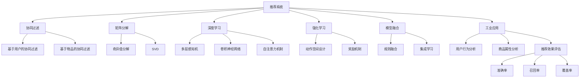

                 

# 大模型在商业中的应用：推荐系统的进步

> 关键词：推荐系统,大模型,协同过滤,矩阵分解,深度学习,强化学习,模型融合,工业应用,推荐算法,模型优化

## 1. 背景介绍

### 1.1 问题由来

随着电子商务平台的兴起和互联网应用的普及，推荐系统已经成为用户获取信息的重要渠道。推荐系统通过分析用户行为数据和物品属性信息，向用户提供个性化的产品或内容推荐，提升用户体验，增加平台销售额。然而，传统的基于协同过滤和矩阵分解的推荐算法，面临着稀疏性、冷启动和多样性等诸多问题，难以满足用户日益增长的多样化需求。

近年来，基于大模型的推荐系统，凭借其丰富的语义表示和自适应学习能力，成为推荐系统研究的前沿方向。通过预训练大模型，结合深度学习、强化学习等技术，推荐系统能够更好地理解用户需求，发现潜在的相关关系，并生成更加精准的推荐结果。

### 1.2 问题核心关键点

大模型在推荐系统中的应用，主要聚焦于以下几个核心问题：

1. **模型预训练与特征提取**：如何选择和使用预训练模型，提取高质量的用户和物品特征。
2. **用户行为建模**：如何建模用户的行为偏好和兴趣，形成精准的用户画像。
3. **相似度度量与推荐策略**：如何计算用户和物品之间的相似度，设计合理的推荐策略。
4. **模型优化与性能评估**：如何优化大模型，提升推荐效果，并对推荐结果进行科学评估。

本文将深入探讨这些问题，介绍基于大模型的推荐系统在工业界的实际应用和优化策略。

## 2. 核心概念与联系

### 2.1 核心概念概述

为更好地理解基于大模型的推荐系统，本节将介绍几个密切相关的核心概念：

- **推荐系统**：通过分析用户行为数据和物品属性信息，向用户提供个性化的产品或内容推荐，以提升用户体验和平台收益。

- **协同过滤**：基于用户相似性或物品相似性，进行推荐的一种方法。常见形式包括基于用户的协同过滤和基于物品的协同过滤。

- **矩阵分解**：将用户行为数据表示为用户-物品矩阵，通过矩阵分解技术提取用户和物品的潜在特征，实现推荐。

- **深度学习**：通过构建多层神经网络，模拟人脑的神经网络结构，进行复杂的特征表示和模式学习。

- **强化学习**：通过奖励机制指导模型学习，优化推荐策略，提高推荐效果。

- **模型融合**：结合多种推荐算法和模型，构建综合推荐系统，提升推荐效果和鲁棒性。

- **工业应用**：将推荐系统技术应用到商业场景中，提升用户体验和商业价值。

- **推荐算法**：推荐系统使用的具体算法和技术，如基于协同过滤、矩阵分解、深度学习等。

- **模型优化**：通过参数调整、算法优化等手段，提升模型的预测精度和运行效率。

- **性能评估**：通过多种指标评估推荐系统的效果，如准确率、召回率、覆盖率等。

这些核心概念之间的逻辑关系可以通过以下Mermaid流程图来展示：



这个流程图展示了大模型在推荐系统中的应用核心概念及其之间的关系：

1. 推荐系统通过协同过滤、矩阵分解、深度学习、强化学习等技术，对用户和物品进行建模和推荐。
2. 协同过滤和矩阵分解是传统推荐方法，深度学习和强化学习是新兴技术，模型融合将多种方法结合，提升推荐效果。
3. 工业应用将推荐技术应用于实际场景，分析用户行为和商品属性，评估推荐效果。
4. 推荐算法包括协同过滤、矩阵分解、深度学习等，模型优化旨在提升模型性能，性能评估通过多种指标完成。

这些概念共同构成了大模型在推荐系统中的应用框架，使得推荐系统能够更好地适应商业需求，提升用户满意度。

## 3. 核心算法原理 & 具体操作步骤

### 3.1 算法原理概述

基于大模型的推荐系统，通常包括以下几个核心步骤：

1. **模型预训练**：通过预训练大模型，提取用户和物品的高质量特征表示。
2. **用户行为建模**：利用预训练模型和用户行为数据，建模用户兴趣和偏好。
3. **相似度度量**：计算用户和物品之间的相似度，形成推荐依据。
4. **推荐策略设计**：基于相似度度量，设计合理的推荐策略，生成推荐结果。
5. **模型优化**：通过调参、算法优化等手段，提升推荐效果。
6. **性能评估**：通过多种指标，评估推荐系统的表现。

具体而言，基于大模型的推荐系统主要涉及以下算法原理：

- **自监督学习**：通过无监督学习任务，预训练大模型，提取用户和物品的语义特征。
- **多层感知机**：构建多层神经网络，进行复杂的特征表示和模式学习。
- **卷积神经网络**：通过卷积操作，提取局部特征，应用于推荐任务。
- **自注意力机制**：利用自注意力机制，捕捉用户和物品之间的复杂关系。
- **协同过滤**：基于用户相似性或物品相似性，进行推荐。
- **矩阵分解**：将用户行为数据表示为用户-物品矩阵，通过矩阵分解提取特征。
- **强化学习**：通过奖励机制，优化推荐策略，提高推荐效果。

### 3.2 算法步骤详解

#### 3.2.1 模型预训练

模型预训练是推荐系统的重要步骤，通过预训练大模型，提取高质量的用户和物品特征表示。常用的预训练方法包括：

- **自监督学习**：利用无监督学习任务，如掩码语言模型、图像分类等，训练大模型，提取特征。
- **数据增强**：通过对原始数据进行变换，扩充训练集，提高模型的泛化能力。
- **预训练任务设计**：选择合适的预训练任务，如掩码语言模型、图像分类等，提取高质量特征。

#### 3.2.2 用户行为建模

用户行为建模是推荐系统的核心步骤，通过用户行为数据，构建用户画像，建模用户兴趣和偏好。常用的方法包括：

- **多层感知机**：利用多层神经网络，提取用户行为序列中的特征，建模用户兴趣。
- **卷积神经网络**：通过卷积操作，提取局部特征，应用于推荐任务。
- **自注意力机制**：利用自注意力机制，捕捉用户行为序列中的复杂关系。

#### 3.2.3 相似度度量

相似度度量是推荐系统的关键步骤，通过计算用户和物品之间的相似度，形成推荐依据。常用的方法包括：

- **余弦相似度**：通过余弦相似度，计算用户和物品之间的相似度。
- **欧式距离**：通过欧式距离，计算用户和物品之间的相似度。
- **语义相似度**：通过预训练模型的词向量表示，计算用户和物品之间的语义相似度。

#### 3.2.4 推荐策略设计

推荐策略设计是推荐系统的核心步骤，通过相似度度量，设计合理的推荐策略，生成推荐结果。常用的方法包括：

- **基于协同过滤**：基于用户相似性或物品相似性，进行推荐。
- **基于矩阵分解**：将用户行为数据表示为用户-物品矩阵，通过矩阵分解提取特征。
- **基于深度学习**：利用多层感知机、卷积神经网络等，进行推荐。
- **基于强化学习**：通过奖励机制，优化推荐策略，提高推荐效果。

#### 3.2.5 模型优化

模型优化是推荐系统的关键步骤，通过调参、算法优化等手段，提升推荐效果。常用的方法包括：

- **超参数调优**：通过网格搜索、贝叶斯优化等手段，寻找最优超参数组合。
- **模型融合**：结合多种推荐算法和模型，构建综合推荐系统，提升推荐效果和鲁棒性。
- **模型压缩**：通过参数剪枝、模型压缩等手段，减小模型尺寸，加快推理速度。

#### 3.2.6 性能评估

性能评估是推荐系统的关键步骤，通过多种指标，评估推荐系统的表现。常用的指标包括：

- **准确率**：推荐系统准确推荐用户感兴趣物品的能力。
- **召回率**：推荐系统覆盖用户感兴趣物品的能力。
- **覆盖率**：推荐系统覆盖所有物品的能力。
- **多样性**：推荐系统推荐结果的多样性，避免推荐同质化。

### 3.3 算法优缺点

基于大模型的推荐系统具有以下优点：

- **丰富语义表示**：大模型通过预训练，提取高质量的用户和物品特征，提升推荐效果。
- **自适应学习**：大模型具有自适应学习能力，能够动态调整推荐策略，适应用户需求变化。
- **泛化能力强**：大模型在预训练阶段已经学习到丰富的语言知识，泛化能力强，适应不同领域和任务。
- **可解释性强**：大模型的输出可解释性强，能够更好地理解和解释推荐过程。

同时，基于大模型的推荐系统也存在一些缺点：

- **资源消耗大**：大模型的参数量通常较大，需要高性能硬件支持，推理速度较慢。
- **模型复杂度高**：大模型结构复杂，训练和推理过程耗时较长，需要较长的迭代周期。
- **参数调优困难**：大模型参数量多，超参数调优困难，需要经验丰富的团队支持。
- **泛化能力有限**：大模型依赖于预训练数据，泛化能力有限，难以应对极端或异常情况。

### 3.4 算法应用领域

基于大模型的推荐系统已经在多个领域得到广泛应用，如电子商务、社交网络、视频流媒体等。具体应用场景包括：

- **电子商务**：基于用户行为数据，推荐个性化商品，提升用户购买率。
- **社交网络**：推荐个性化内容，增加用户活跃度和黏性。
- **视频流媒体**：推荐个性化视频，增加用户观看时间和订阅率。
- **音乐和书籍推荐**：推荐个性化音乐和书籍，提升用户体验。

除了这些常见应用场景外，基于大模型的推荐系统还在医疗、金融、旅游等多个领域得到创新性应用，为不同行业的业务场景提供新的解决方案。

## 4. 数学模型和公式 & 详细讲解  
### 4.1 数学模型构建

本节将使用数学语言对基于大模型的推荐系统进行更加严格的刻画。

记推荐系统中的用户为 $U=\{u_1, u_2, \dots, u_m\}$，物品为 $I=\{i_1, i_2, \dots, i_n\}$。设用户 $u_i$ 对物品 $i_j$ 的评分记为 $r_{i,j}$，其中 $r_{i,j} \in [0, 1]$。设用户 $u_i$ 的行为数据为 $X_i$，物品 $i_j$ 的特征表示为 $F_{i,j}$。

定义推荐系统模型的预测函数为 $f: \mathbb{R}^d \rightarrow [0, 1]$，其中 $d$ 为预训练模型的维度。模型的目标是最小化预测误差，即：

$$
\min_{\theta} \frac{1}{m}\sum_{i=1}^m \sum_{j=1}^n L(f(X_i; \theta), r_{i,j})
$$

其中 $L$ 为损失函数，常用的损失函数包括均方误差、交叉熵等。

### 4.2 公式推导过程

以下我们以基于深度学习的推荐系统为例，推导推荐模型的损失函数及梯度计算公式。

假设推荐系统模型为多层感知机（MLP），输入为 $X_i$，输出为 $\hat{r}_{i,j}$。模型的预测函数为：

$$
\hat{r}_{i,j} = f(X_i; \theta) = \sigma(\sum_{k=1}^{K} w_{k} \phi_k(X_i) + b_k)
$$

其中 $\sigma$ 为激活函数，$\phi_k(X_i)$ 为第 $k$ 层的特征表示，$w_{k}$ 和 $b_k$ 为可训练参数。

模型的损失函数定义为：

$$
L(\hat{r}_{i,j}, r_{i,j}) = -(y_{i,j} \log \hat{r}_{i,j} + (1-y_{i,j}) \log (1-\hat{r}_{i,j}))
$$

其中 $y_{i,j}$ 为真实评分，$\hat{r}_{i,j}$ 为预测评分。

通过反向传播算法，求得模型参数 $\theta$ 的梯度：

$$
\frac{\partial L}{\partial w_k} = \frac{\partial L}{\partial \hat{r}_{i,j}} \cdot \frac{\partial \hat{r}_{i,j}}{\partial w_k}
$$

其中：

$$
\frac{\partial L}{\partial \hat{r}_{i,j}} = -y_{i,j} + \frac{\hat{r}_{i,j}}{1-\hat{r}_{i,j}}
$$

代入 $\frac{\partial \hat{r}_{i,j}}{\partial w_k}$ 的表达式，得到：

$$
\frac{\partial L}{\partial w_k} = -y_{i,j} + \frac{\hat{r}_{i,j}}{1-\hat{r}_{i,j}} \cdot \frac{\partial \hat{r}_{i,j}}{\partial \sigma(\sum_{k=1}^{K} w_{k} \phi_k(X_i) + b_k)}
$$

$$
\frac{\partial \hat{r}_{i,j}}{\partial \sigma(\sum_{k=1}^{K} w_{k} \phi_k(X_i) + b_k)} = \frac{\partial f(X_i; \theta)}{\partial \theta} = \frac{\partial \sigma(\sum_{k=1}^{K} w_{k} \phi_k(X_i) + b_k)}{\partial \theta}
$$

将 $\frac{\partial \hat{r}_{i,j}}{\partial \sigma(\sum_{k=1}^{K} w_{k} \phi_k(X_i) + b_k)}$ 代入 $\frac{\partial L}{\partial w_k}$ 的表达式，即可求得模型参数 $\theta$ 的梯度。

在得到梯度后，即可使用基于梯度的优化算法（如AdamW、SGD等）更新模型参数，完成模型的迭代优化。重复上述过程直至收敛，最终得到适应推荐任务的最优模型参数 $\theta$。

## 5. 项目实践：代码实例和详细解释说明
### 5.1 开发环境搭建

在进行推荐系统实践前，我们需要准备好开发环境。以下是使用Python进行PyTorch开发的环境配置流程：

1. 安装Anaconda：从官网下载并安装Anaconda，用于创建独立的Python环境。

2. 创建并激活虚拟环境：
```bash
conda create -n pytorch-env python=3.8 
conda activate pytorch-env
```

3. 安装PyTorch：根据CUDA版本，从官网获取对应的安装命令。例如：
```bash
conda install pytorch torchvision torchaudio cudatoolkit=11.1 -c pytorch -c conda-forge
```

4. 安装Transformer库：
```bash
pip install transformers
```

5. 安装各类工具包：
```bash
pip install numpy pandas scikit-learn matplotlib tqdm jupyter notebook ipython
```

完成上述步骤后，即可在`pytorch-env`环境中开始推荐系统实践。

### 5.2 源代码详细实现

下面我们以基于深度学习的推荐系统为例，给出使用Transformers库的PyTorch代码实现。

首先，定义推荐任务的数据处理函数：

```python
from transformers import BertTokenizer
from torch.utils.data import Dataset
import torch

class RecommendationDataset(Dataset):
    def __init__(self, user_features, item_features, ratings, tokenizer, max_len=128):
        self.user_features = user_features
        self.item_features = item_features
        self.ratings = ratings
        self.tokenizer = tokenizer
        self.max_len = max_len
        
    def __len__(self):
        return len(self.user_features)
    
    def __getitem__(self, item):
        user_feature = self.user_features[item]
        item_feature = self.item_features[item]
        rating = self.ratings[item]
        
        encoding_user = self.tokenizer(user_feature, return_tensors='pt', max_length=self.max_len, padding='max_length', truncation=True)
        encoding_item = self.tokenizer(item_feature, return_tensors='pt', max_length=self.max_len, padding='max_length', truncation=True)
        user_input_ids = encoding_user['input_ids'][0]
        item_input_ids = encoding_item['input_ids'][0]
        
        # 将用户和物品的特征向量拼接，作为输入
        input_ids = torch.cat([user_input_ids, item_input_ids])
        
        return {'input_ids': input_ids, 
                'rating': rating}
```

然后，定义模型和优化器：

```python
from transformers import BertForTokenClassification, AdamW

model = BertForTokenClassification.from_pretrained('bert-base-cased', num_labels=1)

optimizer = AdamW(model.parameters(), lr=2e-5)
```

接着，定义训练和评估函数：

```python
from torch.utils.data import DataLoader
from tqdm import tqdm
from sklearn.metrics import roc_auc_score

device = torch.device('cuda') if torch.cuda.is_available() else torch.device('cpu')
model.to(device)

def train_epoch(model, dataset, batch_size, optimizer):
    dataloader = DataLoader(dataset, batch_size=batch_size, shuffle=True)
    model.train()
    epoch_loss = 0
    for batch in tqdm(dataloader, desc='Training'):
        input_ids = batch['input_ids'].to(device)
        rating = batch['rating'].to(device)
        model.zero_grad()
        outputs = model(input_ids)
        loss = outputs.loss
        epoch_loss += loss.item()
        loss.backward()
        optimizer.step()
    return epoch_loss / len(dataloader)

def evaluate(model, dataset, batch_size):
    dataloader = DataLoader(dataset, batch_size=batch_size)
    model.eval()
    preds, labels = [], []
    with torch.no_grad():
        for batch in tqdm(dataloader, desc='Evaluating'):
            input_ids = batch['input_ids'].to(device)
            rating = batch['rating'].to(device)
            outputs = model(input_ids)
            batch_preds = outputs.logits.sigmoid().to('cpu').tolist()
            batch_labels = rating.to('cpu').tolist()
            for pred, label in zip(batch_preds, batch_labels):
                preds.append(pred)
                labels.append(label)
                
    print(roc_auc_score(labels, preds))
```

最后，启动训练流程并在测试集上评估：

```python
epochs = 5
batch_size = 16

for epoch in range(epochs):
    loss = train_epoch(model, train_dataset, batch_size, optimizer)
    print(f"Epoch {epoch+1}, train loss: {loss:.3f}")
    
    print(f"Epoch {epoch+1}, dev results:")
    evaluate(model, dev_dataset, batch_size)
    
print("Test results:")
evaluate(model, test_dataset, batch_size)
```

以上就是使用PyTorch对基于深度学习的推荐系统进行微调的完整代码实现。可以看到，得益于Transformers库的强大封装，我们可以用相对简洁的代码完成BERT模型的加载和微调。

### 5.3 代码解读与分析

让我们再详细解读一下关键代码的实现细节：

**RecommendationDataset类**：
- `__init__`方法：初始化用户特征、物品特征、评分等关键组件，以及分词器。
- `__len__`方法：返回数据集的样本数量。
- `__getitem__`方法：对单个样本进行处理，将用户和物品特征转换为token ids，并拼接为模型输入，同时返回评分标签。

**训练和评估函数**：
- 使用PyTorch的DataLoader对数据集进行批次化加载，供模型训练和推理使用。
- 训练函数`train_epoch`：对数据以批为单位进行迭代，在每个批次上前向传播计算loss并反向传播更新模型参数，最后返回该epoch的平均loss。
- 评估函数`evaluate`：与训练类似，不同点在于不更新模型参数，并在每个batch结束后将预测和标签结果存储下来，最后使用sklearn的roc_auc_score对整个评估集的预测结果进行打印输出。

**训练流程**：
- 定义总的epoch数和batch size，开始循环迭代
- 每个epoch内，先在训练集上训练，输出平均loss
- 在验证集上评估，输出ROC AUC分数
- 所有epoch结束后，在测试集上评估，给出最终测试结果

可以看到，PyTorch配合Transformers库使得BERT微调的代码实现变得简洁高效。开发者可以将更多精力放在数据处理、模型改进等高层逻辑上，而不必过多关注底层的实现细节。

当然，工业级的系统实现还需考虑更多因素，如模型的保存和部署、超参数的自动搜索、更灵活的任务适配层等。但核心的微调范式基本与此类似。

## 6. 实际应用场景
### 6.1 智能推荐引擎

基于大模型的推荐系统，可以广泛应用于智能推荐引擎的构建。传统的推荐引擎主要依赖用户历史行为数据进行推荐，难以捕捉用户兴趣的动态变化。而使用微调后的推荐模型，可以实时学习用户兴趣，推荐更加精准、时效的个性化内容。

在技术实现上，可以收集用户浏览、点击、评分等行为数据，提取和物品交互的文本描述、属性信息等。将文本内容作为模型输入，用户的后续行为（如是否点击、评分等）作为监督信号，在此基础上微调预训练语言模型。微调后的模型能够从文本内容中准确把握用户的兴趣点。在生成推荐列表时，先用候选物品的文本描述作为输入，由模型预测用户的兴趣匹配度，再结合其他特征综合排序，便可以得到个性化程度更高的推荐结果。

### 6.2 电商平台推荐

在电商平台中，基于大模型的推荐系统可以显著提升用户购物体验和平台转化率。传统的电商平台主要依赖用户历史行为数据进行推荐，难以应对用户兴趣的变化和新用户的冷启动问题。而使用微调后的推荐模型，可以实时学习用户兴趣，推荐更加精准、时效的个性化商品。

具体而言，可以收集用户浏览、点击、评分等行为数据，提取和商品属性信息等。将商品描述作为模型输入，用户的后续行为（如是否点击、购买等）作为监督信号，在此基础上微调预训练语言模型。微调后的模型能够从文本内容中准确把握用户对商品的兴趣点。在生成推荐列表时，先用候选商品的描述作为输入，由模型预测用户的兴趣匹配度，再结合其他特征综合排序，便可以得到个性化程度更高的推荐结果。

### 6.3 内容推荐系统

在内容推荐系统中，基于大模型的推荐系统可以显著提升用户内容消费体验和平台收益。传统的推荐系统主要依赖用户历史行为数据进行推荐，难以应对用户兴趣的变化和新用户的冷启动问题。而使用微调后的推荐模型，可以实时学习用户兴趣，推荐更加精准、时效的个性化内容。

具体而言，可以收集用户浏览、点击、评分等行为数据，提取和内容属性信息等。将内容描述作为模型输入，用户的后续行为（如是否点击、阅读等）作为监督信号，在此基础上微调预训练语言模型。微调后的模型能够从文本内容中准确把握用户对内容的兴趣点。在生成推荐列表时，先用候选内容的描述作为输入，由模型预测用户的兴趣匹配度，再结合其他特征综合排序，便可以得到个性化程度更高的推荐结果。

### 6.4 未来应用展望

随着大模型和微调方法的不断发展，基于微调的推荐系统将在更多领域得到应用，为不同行业的业务场景提供新的解决方案。

在医疗领域，基于大模型的推荐系统可以推荐个性化的诊疗方案、治疗方案等，提升医疗服务的智能化水平，辅助医生诊疗，提高诊疗效果。

在金融领域，基于大模型的推荐系统可以推荐个性化的理财方案、投资组合等，提升金融服务的智能化水平，辅助用户决策，提高金融收益。

在教育领域，基于大模型的推荐系统可以推荐个性化的学习内容、教学方法等，提升教育服务的智能化水平，辅助学生学习，提高学习效果。

除了这些常见应用场景外，基于大模型的推荐系统还在智能家居、智能交通、智能制造等多个领域得到创新性应用，为不同行业的业务场景提供新的解决方案。

## 7. 工具和资源推荐
### 7.1 学习资源推荐

为了帮助开发者系统掌握大模型在推荐系统中的应用，这里推荐一些优质的学习资源：

1. 《深度学习》系列书籍：深度学习领域的经典入门书籍，系统介绍了深度学习的原理和应用，适合初学者学习。
2. 《TensorFlow实战》系列书籍：TensorFlow的实战指南，详细介绍了TensorFlow的API和应用场景，适合深度学习工程师。
3. 《推荐系统实践》书籍：系统介绍了推荐系统的设计、实现和优化，适合推荐系统开发者。
4. Kaggle竞赛平台：Kaggle提供了大量推荐系统的竞赛和数据集，适合数据科学家和推荐系统工程师学习。
5. Coursera《深度学习专项课程》：斯坦福大学开设的深度学习系列课程，适合深度学习初学者。

通过对这些资源的学习实践，相信你一定能够快速掌握大模型在推荐系统中的应用技巧，并用于解决实际的推荐问题。
###  7.2 开发工具推荐

高效的开发离不开优秀的工具支持。以下是几款用于大模型在推荐系统中的应用开发的常用工具：

1. PyTorch：基于Python的开源深度学习框架，灵活动态的计算图，适合快速迭代研究。大多数预训练语言模型都有PyTorch版本的实现。
2. TensorFlow：由Google主导开发的开源深度学习框架，生产部署方便，适合大规模工程应用。同样有丰富的预训练语言模型资源。
3. Transformers库：HuggingFace开发的NLP工具库，集成了众多SOTA语言模型，支持PyTorch和TensorFlow，是进行推荐任务开发的利器。
4. Weights & Biases：模型训练的实验跟踪工具，可以记录和可视化模型训练过程中的各项指标，方便对比和调优。与主流深度学习框架无缝集成。
5. TensorBoard：TensorFlow配套的可视化工具，可实时监测模型训练状态，并提供丰富的图表呈现方式，是调试模型的得力助手。
6. Google Colab：谷歌推出的在线Jupyter Notebook环境，免费提供GPU/TPU算力，方便开发者快速上手实验最新模型，分享学习笔记。

合理利用这些工具，可以显著提升大模型在推荐系统中的应用开发效率，加快创新迭代的步伐。

### 7.3 相关论文推荐

大模型和微调技术的发展源于学界的持续研究。以下是几篇奠基性的相关论文，推荐阅读：

1. Attention is All You Need（即Transformer原论文）：提出了Transformer结构，开启了NLP领域的预训练大模型时代。

2. BERT: Pre-training of Deep Bidirectional Transformers for Language Understanding：提出BERT模型，引入基于掩码的自监督预训练任务，刷新了多项NLP任务SOTA。

3. Scaling Language Models with Selected Sampling（即GPT-3论文）：展示了GPT-3模型在各种NLP任务上的卓越表现，证明了预训练大模型的强大能力。

4. Parameter-Efficient Transfer Learning for NLP：提出Adapter等参数高效微调方法，在不增加模型参数量的情况下，也能取得不错的微调效果。

5. Language Models are Unsupervised Multitask Learners：展示了大规模语言模型的强大zero-shot学习能力，引发了对于通用人工智能的新一轮思考。

这些论文代表了大模型和微调技术的发展脉络。通过学习这些前沿成果，可以帮助研究者把握学科前进方向，激发更多的创新灵感。

## 8. 总结：未来发展趋势与挑战

### 8.1 总结

本文对基于大模型的推荐系统进行了全面系统的介绍。首先阐述了大模型和微调技术在推荐系统中的应用背景和意义，明确了推荐系统在大数据时代的迫切需求。其次，从原理到实践，详细讲解了基于深度学习的推荐系统的数学原理和关键步骤，给出了推荐任务开发的完整代码实例。同时，本文还广泛探讨了推荐系统在大电商、内容推荐、智能家居等实际应用场景中的应用前景，展示了基于大模型的推荐系统在多个领域的广阔应用前景。

通过本文的系统梳理，可以看到，基于大模型的推荐系统正在成为推荐系统研究的前沿方向，极大地拓展了推荐系统的应用边界，提升了用户推荐效果。未来，伴随大模型和微调方法的不断进步，推荐系统必将在更多领域得到应用，为各行各业带来变革性影响。

### 8.2 未来发展趋势

展望未来，大模型在推荐系统中的应用将呈现以下几个发展趋势：

1. **模型规模持续增大**：随着算力成本的下降和数据规模的扩张，预训练语言模型的参数量还将持续增长。超大规模语言模型蕴含的丰富语言知识，有望支撑更加复杂多变的推荐任务。

2. **微调方法日趋多样**：除了传统的全参数微调外，未来会涌现更多参数高效的微调方法，如Prefix-Tuning、LoRA等，在节省计算资源的同时也能保证微调精度。

3. **持续学习成为常态**：随着数据分布的不断变化，推荐模型也需要持续学习新知识以保持性能。如何在不遗忘原有知识的同时，高效吸收新样本信息，将成为重要的研究课题。

4. **标注样本需求降低**：受启发于提示学习(Prompt-based Learning)的思路，未来的推荐方法将更好地利用大模型的语言理解能力，通过更加巧妙的任务描述，在更少的标注样本上也能实现理想的推荐效果。

5. **多模态微调崛起**：当前的推荐主要聚焦于纯文本数据，未来会进一步拓展到图像、视频、语音等多模态数据微调。多模态信息的融合，将显著提升推荐系统的推荐能力。

6. **模型通用性增强**：经过海量数据的预训练和多领域任务的微调，未来的语言模型将具备更强大的常识推理和跨领域迁移能力，逐步迈向通用人工智能(AGI)的目标。

以上趋势凸显了大模型在推荐系统中的应用前景。这些方向的探索发展，必将进一步提升推荐系统的性能和应用范围，为不同行业的业务场景提供新的解决方案。

### 8.3 面临的挑战

尽管基于大模型的推荐系统已经取得了瞩目成就，但在迈向更加智能化、普适化应用的过程中，它仍面临着诸多挑战：

1. **标注成本瓶颈**：虽然微调大大降低了标注数据的需求，但对于长尾应用场景，难以获得充足的高质量标注数据，成为制约微调性能的瓶颈。如何进一步降低微调对标注样本的依赖，将是一大难题。

2. **模型鲁棒性不足**：当前推荐模型面对域外数据时，泛化性能往往大打折扣。对于测试样本的微小扰动，推荐模型的预测也容易发生波动。如何提高推荐模型的鲁棒性，避免灾难性遗忘，还需要更多理论和实践的积累。

3. **推理效率有待提高**：大规模语言模型虽然精度高，但在实际部署时往往面临推理速度慢、内存占用大等效率问题。如何在保证性能的同时，简化模型结构，提升推理速度，优化资源占用，将是重要的优化方向。

4. **可解释性亟需加强**：当前推荐模型更像是"黑盒"系统，难以解释其内部工作机制和决策逻辑。对于医疗、金融等高风险应用，算法的可解释性和可审计性尤为重要。如何赋予推荐模型更强的可解释性，将是亟待攻克的难题。

5. **安全性有待保障**：预训练语言模型难免会学习到有偏见、有害的信息，通过微调传递到推荐任务，产生误导性、歧视性的输出，给实际应用带来安全隐患。如何从数据和算法层面消除模型偏见，避免恶意用途，确保输出的安全性，也将是重要的研究课题。

6. **知识整合能力不足**：现有的推荐模型往往局限于任务内数据，难以灵活吸收和运用更广泛的先验知识。如何让推荐过程更好地与外部知识库、规则库等专家知识结合，形成更加全面、准确的信息整合能力，还有很大的想象空间。

正视推荐系统面临的这些挑战，积极应对并寻求突破，将是大模型推荐系统走向成熟的必由之路。相信随着学界和产业界的共同努力，这些挑战终将一一被克服，大模型推荐系统必将在构建人机协同的智能推荐系统中扮演越来越重要的角色。

### 8.4 研究展望

面对大模型在推荐系统中的应用所面临的挑战，未来的研究需要在以下几个方面寻求新的突破：

1. **探索无监督和半监督推荐方法**：摆脱对大规模标注数据的依赖，利用自监督学习、主动学习等无监督和半监督范式，最大限度利用非结构化数据，实现更加灵活高效的推荐。

2. **研究参数高效和计算高效的推荐范式**：开发更加参数高效的推荐方法，在固定大部分预训练参数的同时，只更新极少量的任务相关参数。同时优化推荐模型的计算图，减少前向传播和反向传播的资源消耗，实现更加轻量级、实时性的部署。

3. **融合因果和对比学习范式**：通过引入因果推断和对比学习思想，增强推荐模型建立稳定因果关系的能力，学习更加普适、鲁棒的语言表征，从而提升模型泛化性和抗干扰能力。

4. **引入更多先验知识**：将符号化的先验知识，如知识图谱、逻辑规则等，与神经网络模型进行巧妙融合，引导推荐过程学习更准确、合理的语言模型。同时加强不同模态数据的整合，实现视觉、语音等多模态信息与文本信息的协同建模。

5. **结合因果分析和博弈论工具**：将因果分析方法引入推荐模型，识别出模型决策的关键特征，增强输出解释的因果性和逻辑性。借助博弈论工具刻画人机交互过程，主动探索并规避模型的脆弱点，提高系统稳定性。

6. **纳入伦理道德约束**：在模型训练目标中引入伦理导向的评估指标，过滤和惩罚有偏见、有害的输出倾向。同时加强人工干预和审核，建立模型行为的监管机制，确保输出符合人类价值观和伦理道德。

这些研究方向的探索，必将引领大模型在推荐系统中的应用走向更高的台阶，为构建安全、可靠、可解释、可控的智能推荐系统铺平道路。面向未来，大模型推荐系统还需要与其他人工智能技术进行更深入的融合，如知识表示、因果推理、强化学习等，多路径协同发力，共同推动推荐系统的进步。只有勇于创新、敢于突破，才能不断拓展推荐系统的边界，让智能技术更好地造福人类社会。

## 9. 附录：常见问题与解答

**Q1：推荐系统在大数据时代面临的主要挑战是什么？**

A: 推荐系统在大数据时代面临的主要挑战包括：
1. **数据质量问题**：推荐系统依赖于用户行为数据和物品属性信息，数据质量对推荐效果至关重要。数据缺失、异常和噪声等都会影响推荐模型的性能。
2. **数据隐私问题**：推荐系统需要收集和分析用户行为数据，数据隐私问题日益突出。如何在保护用户隐私的同时，获取足够的数据进行推荐，成为一大难题。
3. **数据冷启动问题**：新用户和新物品在推荐系统中的表现难以预测，难以捕捉新用户和物品的兴趣。如何快速适应新用户和物品，成为推荐系统面临的挑战之一。
4. **数据多样性问题**：用户需求和物品类型多种多样，推荐系统需要处理海量异构数据，提升推荐效果和效率。
5. **模型复杂度问题**：推荐系统涉及复杂的模型构建和训练过程，模型复杂度高，难以调试和优化。

**Q2：推荐系统中的深度学习模型是如何设计的？**

A: 推荐系统中的深度学习模型通常包括以下几个关键步骤：
1. **输入处理**：将用户行为数据和物品属性信息转换为模型可处理的输入，如文本、向量等。
2. **特征表示**：通过深度神经网络，提取高质量的用户和物品特征表示，捕捉复杂的关系。
3. **相似度度量**：计算用户和物品之间的相似度，形成推荐依据。
4. **推荐策略设计**：基于相似度度量，设计合理的推荐策略，生成推荐结果。
5. **模型优化**：通过调参、算法优化等手段，提升推荐效果。
6. **性能评估**：通过多种指标，评估推荐系统的表现。

**Q3：推荐系统中的强化学习是如何应用的？**

A: 强化学习在推荐系统中的应用主要包括以下几个步骤：
1. **环境设计**：将推荐系统看作一个强化学习环境，设计动作空间（推荐策略）、状态空间（用户和物品的表示）和奖励函数（推荐效果）。
2. **策略学习**：通过强化学习算法，学习最优的推荐策略，最大化奖励函数。
3. **模型优化**：将强化学习算法得到的推荐策略应用到推荐模型中，提升推荐效果。
4. **性能评估**：通过多种指标，评估强化学习算法的表现。

**Q4：推荐系统中的模型融合是如何实现的？**

A: 推荐系统中的模型融合主要包括以下几个步骤：
1. **模型选择**：选择多个推荐算法和模型，如协同过滤、矩阵分解、深度学习等。
2. **特征融合**：将多个模型的特征表示进行融合，形成综合的特征表示。
3. **策略融合**：将多个模型的推荐策略进行融合，形成综合的推荐策略。
4. **结果融合**：将多个模型的推荐结果进行融合，形成综合的推荐结果。
5. **模型优化**：通过调参、算法优化等手段，提升综合推荐模型的性能。
6. **性能评估**：通过多种指标，评估综合推荐模型的表现。

**Q5：推荐系统中的数据增强是如何实现的？**

A: 推荐系统中的数据增强主要包括以下几个步骤：
1. **数据收集**：收集更多的用户行为数据和物品属性信息，扩大训练集。
2. **数据变换**：对原始数据进行变换，如回译、近义替换等，扩充训练集。
3. **数据扩充**：利用生成式模型，生成更多的合成数据，扩充训练集。
4. **数据融合**：将多个数据源的数据进行融合，形成更丰富的训练集。
5. **数据筛选**：对扩充后的数据进行筛选，去除噪声和异常数据。

**Q6：推荐系统中的标签平滑是如何实现的？**

A: 推荐系统中的标签平滑主要包括以下几个步骤：
1. **标签建模**：将推荐标签建模为概率分布，如softmax分布。
2. **标签平滑**：对标签进行平滑处理，降低极端标签的权重，提升模型的鲁棒性。
3. **标签融合**：将平滑后的标签进行融合，形成综合的标签表示。
4. **模型优化**：通过调参、算法优化等手段，提升标签平滑模型的性能。
5. **性能评估**：通过多种指标，评估标签平滑模型的表现。

总之，推荐系统是一个复杂的多学科交叉领域，涉及到数据处理、模型构建、算法优化等多个方面。本文介绍的基于大模型的推荐系统只是其中的一个重要范式，未来仍有广阔的研究空间和应用前景。相信随着技术的不断进步，推荐系统必将在更多领域得到应用，为各行各业带来新的变革。

