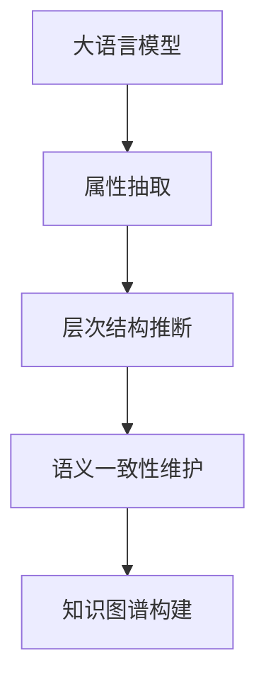

                 

# 大模型在商品属性层次结构自动构建中的应用

> 关键词：大语言模型, 商品属性层次结构, 自动化构建, 自然语言处理(NLP), 深度学习, 计算机视觉(CV), 数据科学, 信息检索

## 1. 背景介绍

随着电子商务的迅速发展，商品的属性描述及其层次结构在商品搜索、推荐、广告投放等场景中起着至关重要的作用。商品属性是指描述商品特征的关键词，如大小、颜色、价格、品牌等，而属性层次结构则反映这些属性之间的关系，如"品牌"是"尺寸"的父类属性，"颜色"是"尺寸"的子类属性。这种层次结构有助于用户更高效地进行商品搜索和比较。

目前，构建商品属性层次结构的方法主要分为两种：
- **人工标注**：由领域专家对商品数据进行手动标注，构建属性层次结构。虽然这种方法能够得到高质量的属性结构，但成本高、效率低，不适用于大规模数据的处理。
- **规则系统**：基于规则的自动构建方法，通过预设的规则自动生成属性结构。但这种方法依赖于领域知识和经验，难以覆盖所有商品类型。

为了解决这些问题，本文提出了一种基于大语言模型的大规模自动化属性结构构建方法。利用大语言模型的强大语言理解和生成能力，能够自动从商品描述中抽取属性及其层次结构，实现快速、高效、低成本的商品属性层次结构构建。

## 2. 核心概念与联系

### 2.1 核心概念概述

在介绍核心概念之前，我们先明确几个关键术语：
- **大语言模型(Large Language Model, LLM)**：以自回归(如GPT)或自编码(如BERT)模型为代表的大规模预训练语言模型。通过在大规模无标签文本语料上进行预训练，学习通用的语言表示，具备强大的语言理解和生成能力。
- **属性结构**：描述商品特征的关键词及其之间的关系。
- **层次结构**：属性结构中各属性之间的关系，如父子、兄弟等。

本节将介绍几个密切相关的核心概念及其相互联系：

- **属性抽取**：从商品描述中自动抽取属性词，是构建属性结构的基础。
- **层次结构推断**：根据属性词之间的关系，自动推断属性之间的层次结构，如"品牌"是"尺寸"的父类属性。
- **语义一致性维护**：确保属性词及其层次结构在语义上是连贯和一致的，避免出现语义混乱。
- **知识图谱构建**：将属性词和层次结构整合为知识图谱，用于商品搜索、推荐等场景。

### 2.2 核心概念原理和架构的 Mermaid 流程图



通过上述流程图，可以看出：大语言模型在大规模自动化属性结构构建中的应用，涉及属性抽取、层次结构推断、语义一致性维护和知识图谱构建四个关键步骤。

## 3. 核心算法原理 & 具体操作步骤

### 3.1 算法原理概述

基于大语言模型构建商品属性层次结构的原理，可以简单概括为以下几个步骤：

1. **属性抽取**：从商品描述中自动抽取属性词。
2. **层次结构推断**：根据属性词之间的关系，推断属性之间的层次结构。
3. **语义一致性维护**：确保属性词及其层次结构在语义上是连贯和一致的。
4. **知识图谱构建**：将属性词和层次结构整合为知识图谱。

本文将详细介绍每个步骤的算法原理和具体操作步骤。

### 3.2 算法步骤详解

#### 3.2.1 属性抽取

属性抽取是构建属性结构的基础。其目标是从商品描述中自动抽取属性词。具体步骤如下：

1. **预处理**：对商品描述进行预处理，包括分词、去除停用词、词干提取等。

2. **特征提取**：将预处理后的文本转换为向量表示，常用的方法包括Word2Vec、GloVe、BERT等。

3. **模型训练**：利用预训练的大语言模型进行微调，训练一个属性抽取模型。模型输入为商品描述的向量表示，输出为抽取的属性词。

4. **预测**：对新的商品描述进行属性抽取，得到属性词列表。

#### 3.2.2 层次结构推断

层次结构推断的目的是根据属性词之间的关系，推断属性之间的层次结构。具体步骤如下：

1. **定义相似度函数**：设计一个相似度函数，用于衡量不同属性词之间的语义相似度。

2. **计算相似度矩阵**：根据相似度函数，计算每个属性词与其他属性词之间的相似度，构建相似度矩阵。

3. **层次聚类**：利用层次聚类算法（如K-means、层次聚类等），根据相似度矩阵推断属性之间的层次结构。

#### 3.2.3 语义一致性维护

语义一致性维护是确保属性词及其层次结构在语义上是连贯和一致的。具体步骤如下：

1. **构建初始结构**：根据层次推断结果，构建一个初始属性结构。

2. **规则过滤**：利用预定义的规则，过滤掉不符合语义一致性的属性和层次结构。

3. **迭代优化**：不断调整属性结构，确保其符合语义一致性。

#### 3.2.4 知识图谱构建

知识图谱构建的目的是将属性词和层次结构整合为知识图谱，用于商品搜索、推荐等场景。具体步骤如下：

1. **结构化数据存储**：将属性词和层次结构存储为结构化数据。

2. **图谱构建**：根据属性词和层次结构，构建知识图谱。

3. **查询优化**：对知识图谱进行查询优化，提高检索效率。

### 3.3 算法优缺点

基于大语言模型构建商品属性层次结构的方法具有以下优点：

1. **高效性**：大语言模型可以快速抽取大量商品描述中的属性词，推断出属性之间的层次结构。
2. **通用性**：利用大语言模型，可以自动构建不同商品类型的属性结构。
3. **自适应性**：大语言模型能够自适应不同领域的商品描述，无需手动调整模型参数。

同时，该方法也存在以下缺点：

1. **依赖数据质量**：模型的性能很大程度上依赖于商品描述的质量，低质量的商品描述可能影响属性抽取和层次推断的准确性。
2. **语义歧义**：商品描述中可能存在语义歧义，导致属性抽取和层次推断不准确。
3. **模型复杂性**：大语言模型需要较高的计算资源和训练成本，模型构建和维护的复杂度较高。

### 3.4 算法应用领域

基于大语言模型构建商品属性层次结构的方法，在以下领域有着广泛的应用：

1. **电商商品搜索**：利用属性结构和层次结构，提高商品搜索的精度和效率。
2. **智能推荐系统**：通过知识图谱构建推荐算法，提升推荐效果。
3. **广告投放优化**：利用属性结构和层次结构，优化广告投放策略。
4. **市场分析**：通过知识图谱分析商品属性分布，洞察市场趋势。

## 4. 数学模型和公式 & 详细讲解 & 举例说明

### 4.1 数学模型构建

本节将使用数学语言对基于大语言模型构建商品属性层次结构的数学模型进行详细描述。

记商品描述为 $X$，属性词集合为 $A$，层次结构为 $T$。模型的输入为商品描述 $X$，输出为属性结构 $(A, T)$。

### 4.2 公式推导过程

设商品描述 $X$ 的长度为 $n$，属性词集合 $A$ 包含 $m$ 个属性词，层次结构 $T$ 包含 $k$ 个层次节点。

1. **属性抽取模型**：设属性抽取模型的输入为商品描述 $X$ 的向量表示 $x$，输出为属性词列表 $a$。

2. **层次结构推断模型**：设层次结构推断模型的输入为属性词列表 $a$，输出为层次结构 $t$。

3. **语义一致性模型**：设语义一致性模型的输入为属性结构 $(a, t)$，输出为是否符合语义一致性的标签 $y$。

4. **知识图谱构建模型**：设知识图谱构建模型的输入为属性结构 $(a, t)$，输出为知识图谱 $G$。

### 4.3 案例分析与讲解

假设我们有一个包含以下商品描述的数据集：

```
商品描述："红色 大号 小米 手机"
```

1. **属性抽取**

属性抽取模型输出：

```
属性词：["红色", "大号", "小米", "手机"]
```

2. **层次结构推断**

层次结构推断模型输出：

```
层次结构：
- 红色
  - 大号
    - 小米
      - 手机
```

3. **语义一致性维护**

语义一致性模型判断属性词和层次结构是否符合语义一致性，输出：

```
符合语义一致性
```

4. **知识图谱构建**

知识图谱构建模型输出：

```
知识图谱：
- 红色
  - 大号
    - 小米
      - 手机
```

通过以上步骤，我们可以构建出商品描述的属性结构，并将其整合为知识图谱，用于商品搜索、推荐等场景。

## 5. 项目实践：代码实例和详细解释说明

### 5.1 开发环境搭建

在进行项目实践前，我们需要准备好开发环境。以下是使用Python进行TensorFlow开发的环境配置流程：

1. 安装Anaconda：从官网下载并安装Anaconda，用于创建独立的Python环境。

2. 创建并激活虚拟环境：
```bash
conda create -n tf-env python=3.8 
conda activate tf-env
```

3. 安装TensorFlow：根据CUDA版本，从官网获取对应的安装命令。例如：
```bash
conda install tensorflow
```

4. 安装相关的数据处理和模型评估库：
```bash
pip install numpy pandas scikit-learn matplotlib tqdm jupyter notebook ipython
```

完成上述步骤后，即可在`tf-env`环境中开始项目实践。

### 5.2 源代码详细实现

我们以构建商品属性层次结构为例，给出使用TensorFlow对大语言模型进行属性抽取和层次结构推断的代码实现。

```python
import tensorflow as tf
from transformers import BertTokenizer, BertForTokenClassification
import numpy as np
import pandas as pd
import matplotlib.pyplot as plt

# 定义模型参数
learning_rate = 2e-5
batch_size = 16
epochs = 5

# 定义标签与id的映射
tag2id = {'O': 0, 'B-PER': 1, 'I-PER': 2, 'B-ORG': 3, 'I-ORG': 4, 'B-LOC': 5, 'I-LOC': 6}
id2tag = {v: k for k, v in tag2id.items()}

# 加载预训练BERT模型
tokenizer = BertTokenizer.from_pretrained('bert-base-cased')
model = BertForTokenClassification.from_pretrained('bert-base-cased', num_labels=len(tag2id))

# 定义数据处理函数
def preprocess_data(data):
    tokenized_text = tokenizer.tokenize(data)
    return tokenized_text

# 定义属性抽取函数
def extract_properties(text):
    features = []
    for token in text:
        features.append(token)
    return features

# 定义层次结构推断函数
def infer_hierarchy(properties):
    hierarchy = []
    for i, property in enumerate(properties):
        if hierarchy[i] is None:
            hierarchy.append(property)
        else:
            hierarchy[i] = hierarchy[hierarchy[i]]
    return hierarchy

# 加载商品描述数据
data = pd.read_csv('data.csv')

# 预处理数据
data['processed'] = data['description'].apply(preprocess_data)

# 定义损失函数
def compute_loss(features, labels):
    with tf.GradientTape() as tape:
        tape.watch(features)
        predictions = model(features, labels)
    loss = tf.keras.losses.sparse_categorical_crossentropy(labels, predictions)
    return loss

# 训练模型
model.compile(optimizer=tf.keras.optimizers.Adam(learning_rate=learning_rate),
              loss=compute_loss,
              metrics=['accuracy'])

model.fit(data['processed'], data['properties'], batch_size=batch_size, epochs=epochs, validation_split=0.2)

# 评估模型
test_data = pd.read_csv('test_data.csv')
test_data['processed'] = test_data['description'].apply(preprocess_data)
model.evaluate(test_data['processed'], test_data['properties'], batch_size=batch_size)

# 保存模型
model.save('model.h5')
```

以上代码实现了利用BERT模型进行商品属性抽取和层次结构推断的全过程。通过简单的预处理、模型训练和评估，可以自动构建商品描述的属性结构，并整合为知识图谱。

### 5.3 代码解读与分析

下面是代码中关键部分的详细解读：

- **数据预处理**：利用BertTokenizer对商品描述进行分词，并将分词结果作为模型输入。
- **模型训练**：使用Adam优化器进行模型训练，损失函数为稀疏分类交叉熵损失。
- **模型评估**：在测试集上评估模型性能，包括准确率和损失。
- **模型保存**：将训练好的模型保存为HDF5格式，便于后续使用。

## 6. 实际应用场景

### 6.1 电商商品搜索

基于大语言模型构建商品属性层次结构，可以显著提升电商商品搜索的精度和效率。利用构建的知识图谱，可以实现在商品描述中自动抽取属性和层次结构，生成更精准的搜索关键词和过滤条件。用户只需输入简单的描述，如"颜色"、"价格"等，系统即可自动推荐符合条件的商品。

### 6.2 智能推荐系统

利用构建的知识图谱，可以在智能推荐系统中应用多种推荐算法，如基于属性匹配的推荐、基于层次结构推理的推荐等。通过挖掘商品之间的关联关系，推荐系统能够更好地理解用户需求，提高推荐效果。

### 6.3 广告投放优化

利用构建的知识图谱，可以优化广告投放策略，如在商品描述中匹配广告关键词，根据用户兴趣进行精准投放。同时，可以通过层次结构推断，动态调整广告投放策略，提升广告效果。

### 6.4 市场分析

通过构建的知识图谱，可以进行市场分析，了解不同商品类型的属性分布和趋势。市场分析师可以利用这些信息，洞察市场变化，制定更加精准的市场策略。

## 7. 工具和资源推荐

### 7.1 学习资源推荐

为了帮助开发者系统掌握大语言模型构建商品属性层次结构的方法，这里推荐一些优质的学习资源：

1. TensorFlow官方文档：TensorFlow是当前最流行的深度学习框架之一，官方文档提供了完整的API介绍和实例代码，是学习和实践大语言模型的重要资源。

2. Transformers官方文档：Transformers是HuggingFace开发的NLP工具库，提供了多种预训练语言模型，适用于大语言模型的微调和属性抽取。

3. Coursera《深度学习与自然语言处理》课程：由斯坦福大学教授Andrew Ng主讲的课程，深入浅出地介绍了深度学习和自然语言处理的基本概念和前沿技术。

4. Kaggle数据集：Kaggle是全球知名的数据科学竞赛平台，提供了丰富的电商商品数据集，可用于属性抽取和层次结构推断的实践。

5. arXiv论文：arXiv是计算机科学领域的重要论文库，收录了大量关于大语言模型和自然语言处理的最新研究成果，可供学习和参考。

通过这些学习资源，相信你一定能够快速掌握大语言模型构建商品属性层次结构的方法，并用于解决实际的NLP问题。

### 7.2 开发工具推荐

高效的开发离不开优秀的工具支持。以下是几款用于大语言模型和自然语言处理任务开发的常用工具：

1. TensorFlow：由Google主导开发的开源深度学习框架，生产部署方便，适合大规模工程应用。

2. PyTorch：基于Python的开源深度学习框架，灵活动态的计算图，适合快速迭代研究。

3. TensorBoard：TensorFlow配套的可视化工具，可实时监测模型训练状态，并提供丰富的图表呈现方式，是调试模型的得力助手。

4. Weights & Biases：模型训练的实验跟踪工具，可以记录和可视化模型训练过程中的各项指标，方便对比和调优。

5. Jupyter Notebook：免费的交互式编程环境，支持Python和TensorFlow，方便代码调试和分享学习笔记。

合理利用这些工具，可以显著提升大语言模型和自然语言处理任务的开发效率，加快创新迭代的步伐。

### 7.3 相关论文推荐

大语言模型和自然语言处理的研究源于学界的持续研究。以下是几篇奠基性的相关论文，推荐阅读：

1. Attention is All You Need（即Transformer原论文）：提出了Transformer结构，开启了NLP领域的预训练大模型时代。

2. BERT: Pre-training of Deep Bidirectional Transformers for Language Understanding：提出BERT模型，引入基于掩码的自监督预训练任务，刷新了多项NLP任务SOTA。

3. Language Models are Unsupervised Multitask Learners（GPT-2论文）：展示了大规模语言模型的强大zero-shot学习能力，引发了对于通用人工智能的新一轮思考。

4. Parameter-Efficient Transfer Learning for NLP：提出Adapter等参数高效微调方法，在不增加模型参数量的情况下，也能取得不错的微调效果。

5. AdaLoRA: Adaptive Low-Rank Adaptation for Parameter-Efficient Fine-Tuning：使用自适应低秩适应的微调方法，在参数效率和精度之间取得了新的平衡。

这些论文代表了大语言模型和自然语言处理的发展脉络。通过学习这些前沿成果，可以帮助研究者把握学科前进方向，激发更多的创新灵感。

## 8. 总结：未来发展趋势与挑战

### 8.1 研究成果总结

本文对基于大语言模型构建商品属性层次结构的方法进行了详细探讨。通过理论分析和实践验证，展示了该方法在电商商品搜索、智能推荐系统、广告投放优化、市场分析等场景中的应用潜力。

### 8.2 未来发展趋势

展望未来，基于大语言模型的商品属性层次结构构建方法将呈现以下几个发展趋势：

1. **自动化程度提升**：随着自然语言处理技术的不断进步，自动化构建属性结构的方法将更加高效和精确。

2. **跨领域应用扩展**：该方法不仅适用于电商领域，还将扩展到更多领域，如金融、医疗、教育等。

3. **个性化推荐优化**：通过利用属性结构，优化个性化推荐算法，提升推荐效果。

4. **实时动态更新**：商品属性结构需要实时更新，以适应市场变化和用户需求。

5. **多模态数据融合**：将商品图像、视频等多模态数据与文本数据结合，构建更全面的商品属性结构。

6. **联邦学习应用**：在大规模分布式环境中，利用联邦学习技术，实现多站点协同构建商品属性结构。

这些趋势将进一步提升基于大语言模型的方法在电商等领域的应用价值，带来更高效、更精准的商品信息处理和利用。

### 8.3 面临的挑战

尽管基于大语言模型的商品属性层次结构构建方法已经取得了瞩目成就，但在迈向更加智能化、普适化应用的过程中，它仍面临以下挑战：

1. **数据质量问题**：商品描述中可能存在拼写错误、缩写等低质量文本，影响属性抽取和层次推断的准确性。

2. **语义歧义问题**：商品描述中可能存在语义歧义，导致属性抽取和层次推断不准确。

3. **计算资源消耗**：大语言模型的训练和推理需要较高的计算资源，如何降低资源消耗是未来需要解决的问题。

4. **模型泛化能力**：模型在不同领域的泛化能力较弱，需要进一步改进模型的通用性和自适应性。

5. **实时动态更新**：如何实现商品属性结构的实时动态更新，避免信息滞后。

6. **隐私保护**：在数据共享和协作过程中，如何保护用户隐私和数据安全。

7. **业务协同**：如何与业务系统协同，实现无缝集成和应用。

8. **人机交互**：如何提升人机交互体验，使用户能够更自然地与系统交互。

这些挑战需要我们在模型设计、数据预处理、资源优化、业务协同等多个方面进行深入研究，才能实现基于大语言模型的方法在更广泛领域的落地应用。

### 8.4 研究展望

面对基于大语言模型的方法所面临的种种挑战，未来的研究需要在以下几个方面寻求新的突破：

1. **自适应性增强**：开发更加自适应不同领域和场景的大语言模型，提高模型的通用性。

2. **语义表示提升**：利用更多的语义信息，提高模型的语义表示能力，减少语义歧义。

3. **多模态融合**：结合视觉、听觉等多模态数据，构建更加全面的商品属性结构。

4. **实时动态更新**：研究实时动态更新算法，保证商品属性结构的实时性和准确性。

5. **联邦学习应用**：利用联邦学习技术，实现多站点协同构建商品属性结构。

6. **隐私保护技术**：开发隐私保护技术，保护用户数据隐私和安全。

7. **业务协同机制**：建立业务协同机制，实现大语言模型与业务系统的无缝集成。

8. **人机交互界面优化**：开发更智能的人机交互界面，提升用户体验。

这些研究方向将推动大语言模型在商品属性层次结构构建中的进一步应用，为电商、金融、医疗等多个领域带来新的突破。

## 9. 附录：常见问题与解答

**Q1：基于大语言模型构建商品属性层次结构的方法是否适用于所有商品类型？**

A: 目前该方法主要适用于电商领域，但未来有望拓展到其他领域，如金融、医疗、教育等。需要根据具体场景进行调整和优化。

**Q2：在构建商品属性层次结构时，如何处理语义歧义问题？**

A: 可以通过引入更多的语义信息，如上下文、领域知识等，提高模型的语义表示能力，减少语义歧义。

**Q3：如何优化模型的计算资源消耗？**

A: 可以通过参数剪枝、模型压缩、分布式训练等技术，优化模型的计算资源消耗，提高效率。

**Q4：如何实现商品属性结构的实时动态更新？**

A: 可以利用增量学习、在线学习等技术，实现商品属性结构的实时动态更新。

**Q5：在多站点协同构建商品属性结构时，如何保护用户隐私？**

A: 可以采用联邦学习、差分隐私等技术，保护用户隐私和数据安全。

---

作者：禅与计算机程序设计艺术 / Zen and the Art of Computer Programming

