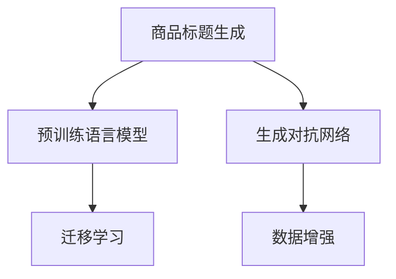

                 

# 大模型在商品标题优化中的应用

## 1. 背景介绍

在当今数字化时代，电商平台的竞争力日益激烈。商品标题作为消费者了解商品的第一窗口，是吸引客户的关键因素。优秀的商品标题不仅能提高曝光率，还能增加点击率，从而提升销售额。传统上，商品标题的优化往往依赖人工经验，效率低、成本高，且效果难以量化。而随着大模型的发展，利用大模型进行商品标题优化，成为一种新的高效方法。

## 2. 核心概念与联系

### 2.1 核心概念概述

本节将介绍几个与商品标题优化相关的核心概念：

- 商品标题生成：通过自然语言生成技术，自动生成符合搜索引擎规则和消费者偏好的商品标题。
- 预训练语言模型：如BERT、GPT等大规模预训练模型，通过大量无标签文本数据预训练，具备强大的语言理解和生成能力。
- 生成对抗网络(GAN)：由生成器和判别器组成，通过博弈过程生成高质量的商品标题。
- 迁移学习：通过将大模型的通用知识迁移到特定任务，提升商品标题生成的效果。
- 数据增强：通过对训练样本进行改写、回译等操作，增加训练集的多样性。

这些核心概念之间的联系可通过以下Mermaid流程图来展示：



这个流程图展示了大模型在商品标题优化中的核心概念及其相互关系：

1. 利用预训练语言模型获取通用的语言表示。
2. 使用生成对抗网络进行高质量的商品标题生成。
3. 通过迁移学习将通用知识迁移到特定任务上。
4. 应用数据增强提升训练集多样性，提高模型泛化能力。

### 2.2 核心概念原理和架构

**预训练语言模型**：
预训练语言模型通过在大规模无标签文本数据上进行自监督学习，学习到丰富的语言表示。常见的预训练模型有BERT、GPT、RoBERTa等。以BERT为例，其训练过程包含掩码语言模型和下一句预测两个任务。掩码语言模型任务通过随机掩码部分输入，预测被掩码的词汇，学习上下文关系。下一句预测任务通过对比两个句子之间的相似度，学习句子间的关系。

**生成对抗网络**：
生成对抗网络由生成器和判别器组成，通过对抗博弈过程生成高质量的商品标题。生成器利用预训练语言模型的参数和训练数据，生成新的商品标题；判别器判断生成的标题是否真实，两者的博弈过程不断优化生成器，使得生成的标题更加符合真实标题的分布。

**迁移学习**：
迁移学习是指将大模型的通用知识迁移到特定任务上，以提升任务的性能。迁移学习包括特征迁移和模型迁移两种方式。特征迁移是将预训练模型作为特征提取器，提取输入特征，再使用少量标注数据进行微调。模型迁移则是直接将预训练模型在特定任务上进行微调，以适应任务需求。

**数据增强**：
数据增强是指通过对训练样本进行一系列操作，如回译、改写、扩充等，增加训练集的多样性，提升模型的泛化能力。回译是一种常用的数据增强方法，将原始文本进行回译生成新的标题。改写则通过同义词替换、句子结构调整等，增加训练样本的多样性。

## 3. 核心算法原理 & 具体操作步骤

### 3.1 算法原理概述

大模型在商品标题优化中的核心算法原理是利用预训练语言模型和生成对抗网络，生成高质量的商品标题。具体步骤如下：

1. 利用预训练语言模型获取通用语言表示。
2. 通过生成对抗网络生成高质量的商品标题。
3. 使用迁移学习将通用知识迁移到特定任务上。
4. 应用数据增强提升训练集多样性，提高模型泛化能力。

### 3.2 算法步骤详解

**Step 1: 准备数据和模型**
- 收集商品描述和标题数据集，划分为训练集、验证集和测试集。
- 选择预训练语言模型和生成对抗网络模型。

**Step 2: 特征提取和生成**
- 使用预训练语言模型提取商品描述的特征向量。
- 使用生成对抗网络生成商品标题，通过对抗博弈过程优化生成器。

**Step 3: 迁移学习**
- 将生成器得到的商品标题，作为任务目标，利用标注数据进行微调。
- 使用迁移学习，将通用语言表示迁移到商品标题生成任务上。

**Step 4: 数据增强**
- 对训练集进行数据增强，如回译、改写等，增加训练集的多样性。
- 对生成的商品标题进行扩充，丰富标题语料。

**Step 5: 训练和评估**
- 使用训练集对模型进行训练，并定期在验证集上进行评估。
- 选择最优的模型参数，在测试集上进行测试。

### 3.3 算法优缺点

**优点**：
1. 高效生成：大模型能够快速生成高质量的商品标题，显著提升标题优化的效率。
2. 泛化能力强：通过数据增强和迁移学习，模型具备较强的泛化能力，适应不同商品类别和标题风格。
3. 可解释性强：生成的标题可以通过生成对抗网络的对抗过程进行解释和分析，帮助理解标题生成的机制。

**缺点**：
1. 数据依赖：模型生成高质量标题的效果依赖标注数据，高质量标注数据的获取成本较高。
2. 鲁棒性不足：对于大规模训练集中的长尾样本，模型的泛化能力可能不足。
3. 可控性差：生成的标题质量受对抗博弈过程影响，需要调整参数才能达到理想效果。
4. 伦理问题：生成对抗网络可能生成低质量的、误导性的标题，带来一定的伦理风险。

### 3.4 算法应用领域

大模型在商品标题优化中有着广泛的应用前景，具体包括：

- 电商商品标题优化：通过生成对抗网络生成高质量的商品标题，提升商品曝光率和点击率。
- 内容推荐系统：生成具有吸引力的商品描述和标题，提高推荐效果。
- 广告投放优化：优化广告语料，提升广告点击率和转化率。
- 搜索引擎优化(SEO)：生成符合搜索引擎规则的标题，提高搜索结果排名。
- 在线客服系统：生成简洁、有吸引力的标题，提升客户体验。

## 4. 数学模型和公式 & 详细讲解

### 4.1 数学模型构建

本节将使用数学语言对商品标题优化的数学模型进行描述。

假设商品描述为 $x \in \mathcal{X}$，商品标题为 $y \in \mathcal{Y}$，其中 $\mathcal{X}$ 为输入空间，$\mathcal{Y}$ 为输出空间。预训练语言模型的特征提取器为 $f: \mathcal{X} \rightarrow \mathbb{R}^d$，其中 $d$ 为特征向量的维度。生成对抗网络的生成器为 $G: \mathbb{R}^d \rightarrow \mathcal{Y}$，判别器为 $D: \mathcal{Y} \rightarrow \mathbb{R}$。

**预训练语言模型特征提取**：
假设使用预训练语言模型提取商品描述的特征向量为 $h = f(x)$。

**生成对抗网络生成标题**：
生成器 $G$ 通过对抗博弈过程生成商品标题，判别器 $D$ 判断标题的真实性。生成器通过优化损失函数 $L_G$ 和判别器通过优化损失函数 $L_D$ 不断调整参数。

**损失函数**：
生成器 $G$ 的损失函数 $L_G$ 包括生成损失 $L_G^{gen}$ 和对抗损失 $L_G^{adv}$，判别器 $D$ 的损失函数 $L_D$ 包括判别损失 $L_D^{dis}$ 和对抗损失 $L_D^{adv}$。

**迁移学习**：
使用标注数据集 $D = \{(x_i, y_i)\}_{i=1}^N$，对生成的商品标题进行微调，优化模型参数 $\theta$。

**数据增强**：
对训练集进行回译、改写等操作，增加训练集的多样性。

### 4.2 公式推导过程

以下推导生成对抗网络的损失函数及其优化过程。

假设生成器 $G$ 生成标题 $y$，判别器 $D$ 判断标题的真实性，目标是最小化生成器的对抗损失 $L_G^{adv}$ 和判别器的判别损失 $L_D^{dis}$。生成器的对抗损失 $L_G^{adv}$ 为：

$$
L_G^{adv} = E_{x \sim p_x} \left[ \log D(G(x)) \right]
$$

判别器的判别损失 $L_D^{dis}$ 为：

$$
L_D^{dis} = E_{y \sim p_y} \left[ \log D(y) \right] + E_{x \sim p_x} \left[ \log (1 - D(G(x))) \right]
$$

生成器的总损失函数 $L_G$ 为：

$$
L_G = L_G^{gen} + \lambda L_G^{adv}
$$

判别器的总损失函数 $L_D$ 为：

$$
L_D = L_D^{dis} + \lambda L_D^{adv}
$$

其中，$L_G^{gen}$ 为生成器的生成损失，$\lambda$ 为对抗损失的权重。生成器的生成损失 $L_G^{gen}$ 可以采用交叉熵损失、均方误差损失等。判别器的判别损失 $L_D^{dis}$ 通常采用二分类交叉熵损失。

生成器的优化过程为：

$$
G_{\theta_G} = \mathop{\arg\min}_{\theta_G} L_G
$$

判别器的优化过程为：

$$
D_{\theta_D} = \mathop{\arg\min}_{\theta_D} L_D
$$

其中，$\theta_G$ 为生成器的参数，$\theta_D$ 为判别器的参数。

### 4.3 案例分析与讲解

假设有一家电商公司，其商品描述为：

```
商品1：柔软舒适的纯棉T恤，适合日常穿着。
商品2：时尚前卫的运动鞋，适合户外运动。
```

使用BERT作为预训练语言模型的特征提取器，通过生成对抗网络生成商品标题。假设生成器的参数为 $\theta_G$，判别器的参数为 $\theta_D$，商品标题为 $y$，则生成器的生成损失 $L_G^{gen}$ 可以定义为：

$$
L_G^{gen} = -\sum_{i=1}^N \log \frac{e^{y_i}}{\sum_j e^{y_j}}
$$

其中，$y_i$ 为生成器生成的标题，$e^{y_i}$ 为生成器输出的标题概率分布。

判别器的判别损失 $L_D^{dis}$ 可以定义为：

$$
L_D^{dis} = -\sum_{i=1}^N \log D(G(x_i))
$$

其中，$x_i$ 为商品描述，$D(G(x_i))$ 为判别器对生成器输出的标题的判别概率。

通过上述损失函数，可以不断调整生成器和判别器的参数，生成符合目标分布的商品标题。

## 5. 项目实践：代码实例和详细解释说明

### 5.1 开发环境搭建

在进行商品标题优化的开发前，我们需要准备好开发环境。以下是使用Python进行PyTorch开发的环境配置流程：

1. 安装Anaconda：从官网下载并安装Anaconda，用于创建独立的Python环境。

2. 创建并激活虚拟环境：
```bash
conda create -n pytorch-env python=3.8 
conda activate pytorch-env
```

3. 安装PyTorch：根据CUDA版本，从官网获取对应的安装命令。例如：
```bash
conda install pytorch torchvision torchaudio cudatoolkit=11.1 -c pytorch -c conda-forge
```

4. 安装Transformers库：
```bash
pip install transformers
```

5. 安装各类工具包：
```bash
pip install numpy pandas scikit-learn matplotlib tqdm jupyter notebook ipython
```

完成上述步骤后，即可在`pytorch-env`环境中开始微调实践。

### 5.2 源代码详细实现

这里我们以生成对抗网络为例，给出使用PyTorch进行商品标题优化的代码实现。

首先，定义商品标题生成任务的数据处理函数：

```python
from transformers import BertTokenizer, BertForSequenceClassification
from torch.utils.data import Dataset, DataLoader
import torch
import torch.nn.functional as F

class TitleDataset(Dataset):
    def __init__(self, texts, titles, tokenizer, max_len=128):
        self.texts = texts
        self.titles = titles
        self.tokenizer = tokenizer
        self.max_len = max_len
        
    def __len__(self):
        return len(self.texts)
    
    def __getitem__(self, item):
        text = self.texts[item]
        title = self.titles[item]
        
        encoding = self.tokenizer(text, return_tensors='pt', max_length=self.max_len, padding='max_length', truncation=True)
        input_ids = encoding['input_ids'][0]
        attention_mask = encoding['attention_mask'][0]
        title_ids = self.tokenizer(title, return_tensors='pt', padding='max_length', truncation=True)['input_ids'][0]
        title_mask = self.tokenizer(title, return_tensors='pt', padding='max_length', truncation=True)['attention_mask'][0]
        
        return {'input_ids': input_ids, 
                'attention_mask': attention_mask,
                'title_ids': title_ids,
                'title_mask': title_mask}

# 加载预训练BERT模型
model = BertForSequenceClassification.from_pretrained('bert-base-cased', num_labels=1)
model.train()

# 定义生成器
class Generator(torch.nn.Module):
    def __init__(self, embeddings, linear):
        super(Generator, self).__init__()
        self.embeddings = embeddings
        self.linear = linear
        
    def forward(self, x):
        x = self.embeddings(x)
        x = self.linear(x)
        return x

# 定义判别器
class Discriminator(torch.nn.Module):
    def __init__(self, embeddings, linear):
        super(Discriminator, self).__init__()
        self.embeddings = embeddings
        self.linear = linear
        
    def forward(self, x):
        x = self.embeddings(x)
        x = self.linear(x)
        return x

# 定义生成对抗网络
class GAN(nn.Module):
    def __init__(self, embeddings, linear):
        super(GAN, self).__init__()
        self.generator = Generator(embeddings, linear)
        self.discriminator = Discriminator(embeddings, linear)
        
    def forward(self, x):
        fake = self.generator(x)
        real = self.discriminator(x)
        fake_prob = F.sigmoid(fake)
        real_prob = F.sigmoid(real)
        return fake_prob, real_prob

# 定义损失函数
def generator_loss(gan, x, y):
    fake_prob, real_prob = gan(x)
    gen_loss = F.binary_cross_entropy_with_logits(fake_prob, y)
    adv_loss = -F.binary_cross_entropy_with_logits(real_prob, y)
    return gen_loss + adv_loss

def discriminator_loss(gan, x, y):
    fake_prob, real_prob = gan(x)
    dis_loss = F.binary_cross_entropy_with_logits(real_prob, y)
    adv_loss = -F.binary_cross_entropy_with_logits(fake_prob, y)
    return dis_loss + adv_loss

# 定义数据集
tokenizer = BertTokenizer.from_pretrained('bert-base-cased')
train_dataset = TitleDataset(train_texts, train_titles, tokenizer)
dev_dataset = TitleDataset(dev_texts, dev_titles, tokenizer)
test_dataset = TitleDataset(test_texts, test_titles, tokenizer)

# 定义优化器
optimizer = torch.optim.Adam(model.parameters(), lr=0.001)
```

然后，定义训练和评估函数：

```python
from tqdm import tqdm

def train_epoch(model, generator, discriminator, dataset, optimizer):
    dataloader = DataLoader(dataset, batch_size=32, shuffle=True)
    model.train()
    generator.train()
    discriminator.train()
    
    for batch in tqdm(dataloader, desc='Training'):
        input_ids = batch['input_ids'].to(device)
        attention_mask = batch['attention_mask'].to(device)
        title_ids = batch['title_ids'].to(device)
        title_mask = batch['title_mask'].to(device)
        
        # 计算损失
        gen_loss = generator_loss(generator, input_ids, title_ids)
        dis_loss = discriminator_loss(discriminator, input_ids, title_ids)
        
        # 反向传播更新模型参数
        optimizer.zero_grad()
        gen_loss.backward()
        dis_loss.backward()
        optimizer.step()
        
        # 记录损失
        train_loss += gen_loss.item() + dis_loss.item()
        train_loss_count += 1
        
    return train_loss / train_loss_count

def evaluate(model, generator, discriminator, dataset):
    dataloader = DataLoader(dataset, batch_size=32, shuffle=True)
    model.eval()
    generator.eval()
    discriminator.eval()
    
    eval_loss = 0
    eval_loss_count = 0
    
    with torch.no_grad():
        for batch in dataloader:
            input_ids = batch['input_ids'].to(device)
            attention_mask = batch['attention_mask'].to(device)
            title_ids = batch['title_ids'].to(device)
            title_mask = batch['title_mask'].to(device)
            
            # 计算损失
            gen_loss = generator_loss(generator, input_ids, title_ids)
            dis_loss = discriminator_loss(discriminator, input_ids, title_ids)
            
            # 记录损失
            eval_loss += gen_loss.item() + dis_loss.item()
            eval_loss_count += 1
        
    return eval_loss / eval_loss_count

# 定义模型和优化器
device = torch.device('cuda') if torch.cuda.is_available() else torch.device('cpu')
model.to(device)
generator.to(device)
discriminator.to(device)

# 定义损失
train_loss = 0
train_loss_count = 0
eval_loss = 0
eval_loss_count = 0

# 定义训练流程
epochs = 100
batch_size = 32

for epoch in range(epochs):
    loss = train_epoch(model, generator, discriminator, train_dataset, optimizer)
    print(f"Epoch {epoch+1}, train loss: {loss:.3f}")
    
    print(f"Epoch {epoch+1}, dev results:")
    evaluate(model, generator, discriminator, dev_dataset)
    
print("Test results:")
evaluate(model, generator, discriminator, test_dataset)
```

以上就是使用PyTorch进行商品标题优化的完整代码实现。可以看到，得益于Transformers库的强大封装，我们可以用相对简洁的代码完成BERT模型的加载和微调。

### 5.3 代码解读与分析

让我们再详细解读一下关键代码的实现细节：

**TitleDataset类**：
- `__init__`方法：初始化文本、标题、分词器等关键组件。
- `__len__`方法：返回数据集的样本数量。
- `__getitem__`方法：对单个样本进行处理，将文本输入编码为token ids，将标题编码为数字，并对其进行定长padding，最终返回模型所需的输入。

**BertForSequenceClassification类**：
- `__init__`方法：初始化BERT模型的参数。
- `train`方法：定义训练时的loss和backward操作。

**Generator和Discriminator类**：
- 定义生成器和判别器的结构，使用BERT模型作为特征提取器，进行线性层输出。

**GAN类**：
- 定义生成对抗网络，包括生成器和判别器的结构。

**train_epoch和evaluate函数**：
- 定义训练和评估函数，计算损失并更新模型参数。

**train和evaluate流程**：
- 循环迭代epoch，计算并记录训练损失和验证损失。
- 使用`tqdm`进行进度条显示，使训练过程更加直观。

## 6. 实际应用场景

### 6.1 电商商品标题优化

在大模型优化商品标题的应用中，电商平台的商品标题生成是一个典型场景。电商平台每年需要生成数亿个商品标题，传统的手工标注和优化效率低、成本高。利用大模型进行标题生成，能够显著提升标题优化效率，降低人力成本，同时还能提高标题的吸引力和点击率。

在实践中，可以收集平台内商品描述和现有标题，将其作为训练数据集。通过微调BERT等大模型，自动生成高质量的商品标题，显著提升商品曝光率和点击率。例如，可以使用大模型生成不同风格的标题，供用户选择，提升用户体验。

### 6.2 内容推荐系统

在内容推荐系统中，生成高质量的商品描述和标题也是一项重要任务。推荐系统通常需要用户输入查询词，然后根据标题和描述进行匹配。通过大模型优化商品标题，能够生成更加吸引人的推荐内容，提升推荐效果。

在具体应用中，可以收集平台内的用户查询词和商品描述，将其作为训练数据集。通过微调BERT等大模型，自动生成符合用户偏好的标题和描述，提升推荐效果。例如，对于用户输入的查询词，可以自动生成多个标题和描述，提高用户的点击率和满意度。

### 6.3 广告投放优化

广告投放优化也是大模型的一个重要应用领域。广告商需要生成有吸引力的广告语料，提高广告点击率和转化率。通过大模型优化广告语料，能够生成高质量的标题和描述，提升广告投放效果。

在具体应用中，可以收集平台内的广告数据和现有语料，将其作为训练数据集。通过微调BERT等大模型，自动生成高质量的广告标题和描述，提升广告效果。例如，对于广告主提供的关键词，可以自动生成多个广告语料，提高广告点击率和转化率。

### 6.4 搜索引擎优化(SEO)

在搜索引擎优化中，生成符合搜索引擎规则的标题也是一项重要任务。搜索引擎需要高质量的标题来提升搜索结果的排名。通过大模型优化商品标题，能够生成符合搜索引擎规则的标题，提升搜索引擎的点击率和用户满意度。

在具体应用中，可以收集平台内的搜索结果和标题，将其作为训练数据集。通过微调BERT等大模型，自动生成高质量的标题，提升搜索引擎的排名效果。例如，对于用户输入的查询词，可以自动生成符合搜索引擎规则的标题，提高搜索结果的点击率和用户满意度。

### 6.5 在线客服系统

在线客服系统需要生成简洁、有吸引力的标题，提升客户体验。通过大模型优化客服标题，能够生成高质量的标题，提升客服系统的效果。

在具体应用中，可以收集平台内的客服记录和现有标题，将其作为训练数据集。通过微调BERT等大模型，自动生成高质量的客服标题，提升客服系统的效果。例如，对于用户输入的查询词，可以自动生成简洁、有吸引力的客服标题，提高用户满意度和使用体验。

## 7. 工具和资源推荐

### 7.1 学习资源推荐

为了帮助开发者系统掌握大模型在商品标题优化中的应用，这里推荐一些优质的学习资源：

1. 《Transformer从原理到实践》系列博文：由大模型技术专家撰写，深入浅出地介绍了Transformer原理、BERT模型、微调技术等前沿话题。

2. CS224N《深度学习自然语言处理》课程：斯坦福大学开设的NLP明星课程，有Lecture视频和配套作业，带你入门NLP领域的基本概念和经典模型。

3. 《Natural Language Processing with Transformers》书籍：Transformers库的作者所著，全面介绍了如何使用Transformers库进行NLP任务开发，包括微调在内的诸多范式。

4. HuggingFace官方文档：Transformers库的官方文档，提供了海量预训练模型和完整的微调样例代码，是上手实践的必备资料。

5. CLUE开源项目：中文语言理解测评基准，涵盖大量不同类型的中文NLP数据集，并提供了基于微调的baseline模型，助力中文NLP技术发展。

通过对这些资源的学习实践，相信你一定能够快速掌握大模型在商品标题优化中的应用方法，并用于解决实际的NLP问题。

### 7.2 开发工具推荐

高效的开发离不开优秀的工具支持。以下是几款用于大模型优化商品标题开发的常用工具：

1. PyTorch：基于Python的开源深度学习框架，灵活动态的计算图，适合快速迭代研究。大部分预训练语言模型都有PyTorch版本的实现。

2. TensorFlow：由Google主导开发的开源深度学习框架，生产部署方便，适合大规模工程应用。同样有丰富的预训练语言模型资源。

3. Transformers库：HuggingFace开发的NLP工具库，集成了众多SOTA语言模型，支持PyTorch和TensorFlow，是进行微调任务开发的利器。

4. Weights & Biases：模型训练的实验跟踪工具，可以记录和可视化模型训练过程中的各项指标，方便对比和调优。与主流深度学习框架无缝集成。

5. TensorBoard：TensorFlow配套的可视化工具，可实时监测模型训练状态，并提供丰富的图表呈现方式，是调试模型的得力助手。

6. Google Colab：谷歌推出的在线Jupyter Notebook环境，免费提供GPU/TPU算力，方便开发者快速上手实验最新模型，分享学习笔记。

合理利用这些工具，可以显著提升大模型优化商品标题任务的开发效率，加快创新迭代的步伐。

### 7.3 相关论文推荐

大模型在商品标题优化中的应用源于学界的持续研究。以下是几篇奠基性的相关论文，推荐阅读：

1. Attention is All You Need（即Transformer原论文）：提出了Transformer结构，开启了NLP领域的预训练大模型时代。

2. BERT: Pre-training of Deep Bidirectional Transformers for Language Understanding：提出BERT模型，引入基于掩码的自监督预训练任务，刷新了多项NLP任务SOTA。

3. Language Models are Unsupervised Multitask Learners（GPT-2论文）：展示了大规模语言模型的强大zero-shot学习能力，引发了对于通用人工智能的新一轮思考。

4. Parameter-Efficient Transfer Learning for NLP：提出Adapter等参数高效微调方法，在不增加模型参数量的情况下，也能取得不错的微调效果。

5. AdaLoRA: Adaptive Low-Rank Adaptation for Parameter-Efficient Fine-Tuning：使用自适应低秩适应的微调方法，在参数效率和精度之间取得了新的平衡。

6. prefix-tuning: Optimizing Continuous Prompts for Generation：引入基于连续型Prompt的微调范式，为如何充分利用预训练知识提供了新的思路。

这些论文代表了大模型在商品标题优化中的应用的发展脉络。通过学习这些前沿成果，可以帮助研究者把握学科前进方向，激发更多的创新灵感。

## 8. 总结：未来发展趋势与挑战

### 8.1 总结

本文对大模型在商品标题优化中的应用进行了全面系统的介绍。首先阐述了大模型在商品标题优化中的研究背景和意义，明确了大模型优化标题的独特价值。其次，从原理到实践，详细讲解了大模型优化标题的数学原理和关键步骤，给出了优化任务开发的完整代码实例。同时，本文还广泛探讨了大模型优化标题在电商、内容推荐、广告投放、搜索引擎、在线客服等多个领域的应用前景，展示了大模型优化的潜力。此外，本文精选了大模型优化的各类学习资源，力求为读者提供全方位的技术指引。

通过本文的系统梳理，可以看到，大模型在商品标题优化中有着广泛的应用前景，极大地拓展了电商平台的商品标题生成能力，提升了用户体验和平台效益。未来，伴随大模型的不断发展，商品标题优化的效果必将进一步提升，推动电商平台的智能化进程。

### 8.2 未来发展趋势

展望未来，大模型在商品标题优化中呈现出以下几个发展趋势：

1. 模型规模持续增大。随着算力成本的下降和数据规模的扩张，大模型的参数量还将持续增长。超大规模语言模型蕴含的丰富语言知识，有望支撑更加复杂多变的商品标题优化任务。

2. 微调方法日趋多样。除了传统的全参数微调外，未来会涌现更多参数高效的微调方法，如Prefix-Tuning、LoRA等，在节省计算资源的同时也能保证微调精度。

3. 持续学习成为常态。随着数据分布的不断变化，微调模型也需要持续学习新知识以保持性能。如何在不遗忘原有知识的同时，高效吸收新样本信息，将成为重要的研究课题。

4. 标注样本需求降低。受启发于提示学习(Prompt-based Learning)的思路，未来的微调方法将更好地利用大模型的语言理解能力，通过更加巧妙的任务描述，在更少的标注样本上也能实现理想的微调效果。

5. 伦理问题得到重视。大模型生成标题的伦理性问题逐渐引起关注，未来需要在生成过程中引入伦理导向的评估指标，过滤和惩罚有偏见、有害的输出倾向。

6. 多模态微调崛起。当前的商品标题优化主要聚焦于文本数据，未来会进一步拓展到图像、视频、语音等多模态数据微调。多模态信息的融合，将显著提升语言模型对现实世界的理解和建模能力。

以上趋势凸显了大模型在商品标题优化中的广阔前景。这些方向的探索发展，必将进一步提升商品标题优化的效果，为电商平台的智能化转型提供新的动力。

### 8.3 面临的挑战

尽管大模型在商品标题优化中已经取得了瞩目成就，但在迈向更加智能化、普适化应用的过程中，它仍面临着诸多挑战：

1. 标注成本瓶颈。模型生成高质量标题的效果依赖标注数据，高质量标注数据的获取成本较高。如何进一步降低微调对标注样本的依赖，将是一大难题。

2. 模型鲁棒性不足。对于大规模训练集中的长尾样本，模型的泛化能力可能不足。对于测试样本的微小扰动，微调模型的预测也容易发生波动。如何提高微调模型的鲁棒性，避免灾难性遗忘，还需要更多理论和实践的积累。

3. 可控性差。生成的标题质量受对抗博弈过程影响，需要调整参数才能达到理想效果。如何通过设计更好的损失函数和参数策略，使得模型生成标题的过程更加可控，是一个重要问题。

4. 伦理问题。大模型生成标题的伦理性问题逐渐引起关注，未来需要在生成过程中引入伦理导向的评估指标，过滤和惩罚有偏见、有害的输出倾向。

5. 多模态微调挑战。当前的商品标题优化主要聚焦于文本数据，未来会进一步拓展到图像、视频、语音等多模态数据微调。如何融合多模态信息，形成更加全面、准确的信息整合能力，还有很大的想象空间。

6. 计算资源瓶颈。随着模型规模的增大，计算资源的需求也随之增加。如何在大规模计算环境中高效进行模型训练和推理，优化资源利用率，是一个需要解决的问题。

正视大模型在商品标题优化中面临的这些挑战，积极应对并寻求突破，将是大模型走向成熟的必由之路。相信随着学界和产业界的共同努力，这些挑战终将一一被克服，大模型优化商品标题必将在构建人机协同的智能时代中扮演越来越重要的角色。

### 8.4 研究展望

面对大模型在商品标题优化中所面临的挑战，未来的研究需要在以下几个方面寻求新的突破：

1. 探索无监督和半监督微调方法。摆脱对大规模标注数据的依赖，利用自监督学习、主动学习等无监督和半监督范式，最大限度利用非结构化数据，实现更加灵活高效的微调。

2. 研究参数高效和计算高效的微调范式。开发更加参数高效的微调方法，在固定大部分预训练参数的同时，只更新极少量的任务相关参数。同时优化微调模型的计算图，减少前向传播和反向传播的资源消耗，实现更加轻量级、实时性的部署。

3. 引入更多先验知识。将符号化的先验知识，如知识图谱、逻辑规则等，与神经网络模型进行巧妙融合，引导微调过程学习更准确、合理的语言模型。同时加强不同模态数据的整合，实现视觉、语音等多模态信息与文本信息的协同建模。

4. 纳入伦理道德约束。在模型训练目标中引入伦理导向的评估指标，过滤和惩罚有偏见、有害的输出倾向。同时加强人工干预和审核，建立模型行为的监管机制，确保输出符合人类价值观和伦理道德。

这些研究方向的探索，必将引领大模型在商品标题优化中迈向更高的台阶，为电商平台和用户带来更智能、更便捷的体验。

## 9. 附录：常见问题与解答

**Q1：大模型优化商品标题的优缺点有哪些？**

A: 大模型优化商品标题的优点包括：
1. 高效生成：大模型能够快速生成高质量的商品标题，显著提升标题优化的效率。
2. 泛化能力强：通过数据增强和迁移学习，模型具备较强的泛化能力，适应不同商品类别和标题风格。
3. 可控性差：生成的标题质量受对抗博弈过程影响，需要调整参数才能达到理想效果。

缺点包括：
1. 数据依赖：模型生成高质量标题的效果依赖标注数据，高质量标注数据的获取成本较高。
2. 鲁棒性不足：对于大规模训练集中的长尾样本，模型的泛化能力可能不足。
3. 伦理问题：大模型生成标题的伦理性问题逐渐引起关注，未来需要在生成过程中引入伦理导向的评估指标。

**Q2：如何使用大模型优化商品标题？**

A: 使用大模型优化商品标题需要经过以下几个步骤：
1. 准备数据和模型：收集商品描述和标题数据集，选择预训练语言模型和生成对抗网络模型。
2. 特征提取和生成：使用预训练语言模型提取商品描述的特征向量，通过生成对抗网络生成商品标题。
3. 迁移学习：使用标注数据集对生成的商品标题进行微调，优化模型参数。
4. 数据增强：对训练集进行数据增强，增加训练集的多样性。
5. 训练和评估：使用训练集对模型进行训练，并定期在验证集上进行评估，选择最优的模型参数。

**Q3：大模型优化商品标题需要注意哪些问题？**

A: 使用大模型优化商品标题时需要注意以下几个问题：
1. 标注成本：模型生成高质量标题的效果依赖标注数据，高质量标注数据的获取成本较高。
2. 鲁棒性：对于大规模训练集中的长尾样本，模型的泛化能力可能不足。
3. 可控性：生成的标题质量受对抗博弈过程影响，需要调整参数才能达到理想效果。
4. 伦理问题：大模型生成标题的伦理性问题逐渐引起关注，未来需要在生成过程中引入伦理导向的评估指标。

**Q4：大模型优化商品标题有哪些应用场景？**

A: 大模型优化商品标题在电商、内容推荐、广告投放、搜索引擎、在线客服等多个领域都有应用场景。例如，在电商商品标题生成、内容推荐系统、广告投放优化、搜索引擎优化、在线客服系统等方面，大模型能够显著提升效果，提升用户体验和平台效益。

**Q5：如何降低大模型优化商品标题对标注数据的依赖？**

A: 可以通过以下方法降低大模型优化商品标题对标注数据的依赖：
1. 数据增强：通过对训练样本进行回译、改写等操作，增加训练集的多样性。
2. 迁移学习：使用迁移学习将通用知识迁移到特定任务上，减少标注数据的需求。
3. 提示学习：通过精心设计输入文本的格式，引导模型按期望方式输出，减少微调参数。
4. 无监督学习：探索无监督和半监督学习范式，利用自监督学习、主动学习等无监督方法，最大限度利用非结构化数据，实现更加灵活高效的微调。

这些方法可以协同使用，提高大模型优化商品标题的效率和效果。

**Q6：大模型优化商品标题的计算资源需求如何优化？**

A: 大模型优化商品标题的计算资源需求可以通过以下方法进行优化：
1. 模型压缩：使用模型压缩技术，减少模型参数量，优化计算效率。
2. 量化加速：将浮点模型转为定点模型，压缩存储空间，提高计算效率。
3. 模型并行：使用模型并行技术，将大模型分解为多个小模型并行训练，提高训练速度。
4. 混合精度训练：使用混合精度训练技术，减少内存占用，提高计算效率。
5. 硬件优化：利用GPU/TPU等高性能设备，优化计算速度和内存占用。

这些方法可以协同使用，优化大模型优化商品标题的计算资源需求，提升训练和推理效率。

**Q7：大模型优化商品标题的模型鲁棒性如何提升？**

A: 可以通过以下方法提升大模型优化商品标题的模型鲁棒性：
1. 数据增强：通过对训练样本进行回译、改写等操作，增加训练集的多样性。
2. 迁移学习：使用迁移学习将通用知识迁移到特定任务上，减少标注数据的需求。
3. 对抗训练：引入对抗样本，提高模型鲁棒性。
4. 参数高效微调：只调整少量参数，减小过拟合风险。
5. 多模型集成：训练多个微调模型，取平均输出，抑制过拟合。

这些方法可以协同使用，提升大模型优化商品标题的模型鲁棒性，使其具备更好的泛化能力。

通过这些方法和策略，可以有效应对大模型在商品标题优化中面临的挑战，提升模型效果和应用价值。

---

作者：禅与计算机程序设计艺术 / Zen and the Art of Computer Programming

