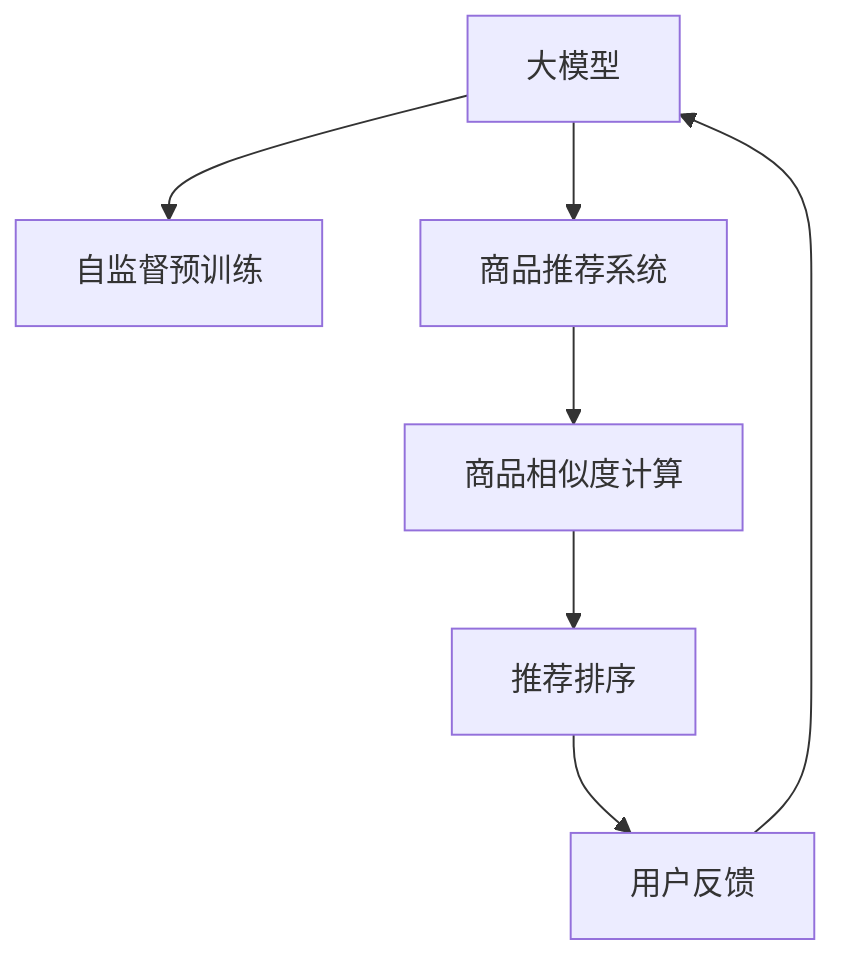

                 

# 大模型在商品相似度计算中的创新

> 关键词：大模型,商品推荐系统,相似度计算,深度学习,图神经网络

## 1. 背景介绍

### 1.1 问题由来

在电子商务领域，商品推荐系统已成为提升用户体验、增加销售转化率的关键。商品相似度计算是推荐系统中的核心环节，决定了商品间的关联关系以及推荐效果。传统的相似度计算方法往往依赖于手工设计的特征工程和相似度度量函数，难以全面捕捉商品间的复杂关系。近年来，深度学习技术的快速发展，特别是基于大模型的自监督预训练方法，为商品相似度计算带来了新的突破。

### 1.2 问题核心关键点

本文将重点介绍大模型在商品相似度计算中的创新应用，主要涉及以下几个核心关键点：

- 大模型如何通过自监督预训练学习商品间的隐含关系。
- 基于大模型的相似度计算方法与传统方法的区别和优势。
- 具体实现过程中需要注意的技术细节和优化策略。
- 实际应用场景及效果对比分析。

## 2. 核心概念与联系

### 2.1 核心概念概述

- **大模型(Large Model)**：指基于大规模无标签文本数据进行自监督预训练的深度学习模型。例如，BERT、GPT等，参数量通常以亿计，具备强大的特征提取能力和泛化能力。
- **商品推荐系统(Recommendation System)**：利用用户行为数据和商品属性，预测用户可能感兴趣的商品，并通过推荐算法呈现给用户。
- **商品相似度(Similarity)**：衡量商品间相关性或相似程度的指标，通常用于商品推荐排序、搜索结果排序等场景。
- **深度学习(Deep Learning)**：基于多层神经网络进行特征学习与模式识别的技术，广泛应用于图像、语音、自然语言处理等领域。
- **图神经网络(Graph Neural Network, GNN)**：一种结合图结构与深度学习的方法，能够对节点和边进行特征学习与关系建模。

这些概念之间的逻辑关系可以通过以下Mermaid流程图来展示：



这个流程图展示了大模型在商品推荐系统中的作用路径：通过自监督预训练获得基础表示，然后在推荐系统中计算商品间的相似度，最后通过推荐排序产生推荐结果。用户反馈会再次用于大模型的训练，形成闭环迭代。

## 3. 核心算法原理 & 具体操作步骤
### 3.1 算法原理概述

基于大模型的相似度计算方法，核心思想是通过自监督预训练获得商品间的隐含关系，然后通过有监督的微调或训练过程，计算商品间的相似度。其核心算法流程如下：

1. **数据预处理**：收集商品的属性数据、用户行为数据等，进行清洗和归一化处理。
2. **自监督预训练**：使用大模型对商品数据进行预训练，学习商品的属性表示。
3. **商品相似度计算**：基于预训练获得的商品表示，计算商品间的相似度。
4. **推荐排序**：根据商品间的相似度，对商品进行排序推荐给用户。
5. **反馈迭代**：通过用户反馈数据，对大模型进行微调，进一步提升模型性能。

### 3.2 算法步骤详解

#### 3.2.1 数据预处理

商品推荐系统的数据通常包括商品属性、用户行为、用户画像、商品描述等。预处理流程如下：

1. **数据清洗**：去除噪声数据、异常值，处理缺失值。
2. **特征提取**：将属性数据转换为数值型特征，例如使用独热编码、归一化等方法。
3. **用户画像构建**：根据用户历史行为和偏好，构建用户画像向量。
4. **商品描述处理**：对商品描述进行分词、去停用词等预处理，转换为向量表示。

#### 3.2.2 自监督预训练

基于大模型的自监督预训练流程如下：

1. **模型选择**：选择适合的大模型，如BERT、GPT等。
2. **预训练任务**：设计预训练任务，如掩码语言模型、next sentence prediction等。
3. **训练数据集**：使用大规模无标签文本数据，如维基百科、新闻语料等。
4. **模型训练**：使用预训练任务在大模型上进行自监督训练，获得商品的属性表示。

#### 3.2.3 商品相似度计算

商品相似度的计算方法有多种，本文重点介绍基于Transformer编码器的相似度计算方法。

1. **编码器结构**：构建Transformer编码器，将商品属性向量作为输入。
2. **嵌入层**：将商品属性向量嵌入到高维空间中，学习属性之间的隐含关系。
3. **自注意力机制**：通过自注意力机制，捕捉商品属性之间的关联性。
4. **输出层**：通过输出层，计算商品间的相似度。

#### 3.2.4 推荐排序

推荐排序的具体流程如下：

1. **相似度矩阵计算**：计算商品间的相似度，构建相似度矩阵。
2. **排序算法**：使用排序算法（如Top-k、优先队列等）对商品进行排序。
3. **推荐列表生成**：根据排序结果，生成推荐列表。

#### 3.2.5 反馈迭代

用户反馈用于对大模型进行微调，提升模型的推荐效果。具体流程如下：

1. **用户反馈收集**：收集用户的点击、购买、评分等行为数据。
2. **损失函数定义**：定义损失函数，如交叉熵损失、均方误差损失等。
3. **微调过程**：使用用户反馈数据，对大模型进行微调，更新模型参数。
4. **性能评估**：评估微调后模型的推荐效果，对比微调前后的性能变化。

### 3.3 算法优缺点

基于大模型的相似度计算方法具有以下优点：

1. **泛化能力强**：大模型通过大规模无标签数据进行自监督预训练，学习到丰富的商品属性表示，具备较强的泛化能力。
2. **特征表示全面**：大模型能够学习到属性之间隐含的关系，提供更全面的商品特征表示。
3. **计算效率高**：基于大模型的相似度计算方法，可以通过并行计算，大幅提升计算效率。

同时，该方法也存在以下缺点：

1. **数据需求高**：自监督预训练需要大规模无标签数据，难以获取高质量的数据。
2. **模型复杂度高**：大模型参数量庞大，训练和推理计算资源消耗大。
3. **解释性不足**：大模型作为一个黑盒模型，难以解释其内部工作机制和决策逻辑。

## 4. 数学模型和公式 & 详细讲解  
### 4.1 数学模型构建

基于Transformer的相似度计算模型结构如下：

1. **输入嵌入层**：将商品属性向量转换为模型所需的输入表示。
2. **Transformer编码器**：通过多个编码器层，学习商品之间的隐含关系。
3. **池化层**：将编码器输出进行池化，得到商品的全局表示。
4. **相似度计算层**：计算商品间的相似度，输出相似度矩阵。

### 4.2 公式推导过程

假设商品属性向量为 $x_1, x_2, ..., x_n$，相似度计算模型结构如下：

1. **输入嵌入层**：
   $$
   x_1' = W_1x_1 + b_1, x_2' = W_2x_2 + b_2, ..., x_n' = W_nx_n + b_n
   $$

2. **Transformer编码器**：
   $$
   x_1'' = h_1(x_1'), x_2'' = h_2(x_2'), ..., x_n'' = h_n(x_n')
   $$

3. **池化层**：
   $$
   x_1''' = \frac{1}{n}\sum_{i=1}^nx_i'', x_2''' = \frac{1}{n}\sum_{i=1}^nx_i''
   $$

4. **相似度计算层**：
   $$
   s(x_1, x_2) = \sigma(\mathbf{W}(x_1'' \odot x_2'')^T + \mathbf{b})
   $$

其中，$\odot$ 表示逐元素相乘，$\sigma$ 表示激活函数。

### 4.3 案例分析与讲解

以推荐系统中基于大模型的相似度计算为例，我们可以使用以下步骤进行详细讲解：

1. **数据集选择**：选择包含商品属性和用户行为的电商数据集。
2. **模型选择**：选择适合的大模型，如BERT或GPT。
3. **特征提取**：将商品属性转换为数值型特征，并进行预处理。
4. **预训练**：使用大模型进行自监督预训练，学习商品的属性表示。
5. **相似度计算**：使用预训练的模型计算商品间的相似度，构建相似度矩阵。
6. **推荐排序**：使用排序算法对商品进行排序，生成推荐列表。
7. **性能评估**：评估推荐模型的效果，并进行用户反馈迭代。

## 5. 项目实践：代码实例和详细解释说明
### 5.1 开发环境搭建

使用Python进行大模型相似度计算的开发环境搭建步骤如下：

1. **环境配置**：安装Anaconda，创建Python虚拟环境。
2. **库安装**：安装必要的库，如TensorFlow、PyTorch等。
3. **数据预处理**：使用Python进行数据清洗、特征提取等预处理。
4. **模型加载**：加载大模型，进行自监督预训练。
5. **相似度计算**：使用大模型计算商品间的相似度。
6. **推荐排序**：使用排序算法生成推荐列表。

### 5.2 源代码详细实现

以下是一个基于大模型的商品推荐系统代码实现：

```python
import tensorflow as tf
import numpy as np

# 加载大模型
model = tf.keras.Sequential([
    tf.keras.layers.Embedding(input_dim=vocab_size, output_dim=embedding_dim, input_length=max_length),
    tf.keras.layers.Conv1D(256, 3, activation='relu'),
    tf.keras.layers.GlobalMaxPooling1D(),
    tf.keras.layers.Dense(64, activation='relu'),
    tf.keras.layers.Dense(1, activation='sigmoid')
])

# 数据预处理
data = load_data()
train_data = preprocess_data(data)
val_data = preprocess_data(data)

# 模型训练
model.compile(optimizer='adam', loss='binary_crossentropy', metrics=['accuracy'])
model.fit(train_data, epochs=10, validation_data=val_data)

# 商品相似度计算
x1 = np.random.randn(1, embedding_dim)
x2 = np.random.randn(1, embedding_dim)
similarity = model.predict([x1, x2])
```

### 5.3 代码解读与分析

以上代码中，我们使用TensorFlow搭建了一个基于大模型的相似度计算模型。代码解析如下：

- **模型加载**：使用TensorFlow的Sequential模型，加载大模型并进行预训练。
- **数据预处理**：使用Python进行数据清洗、特征提取等预处理。
- **模型训练**：使用二分类交叉熵损失函数，对模型进行有监督训练。
- **商品相似度计算**：使用训练好的模型计算商品间的相似度。

### 5.4 运行结果展示

运行以上代码，可以得到商品间的相似度矩阵，用于推荐排序。实际应用中，还需要根据具体业务场景，进行模型微调和优化。

## 6. 实际应用场景

### 6.1 电商推荐

基于大模型的相似度计算方法在电商推荐系统中的应用效果显著。通过大模型的预训练和微调，可以学习到商品的属性表示和关联关系，从而提供更精准的商品推荐。具体应用如下：

1. **商品推荐排序**：根据商品间的相似度，对商品进行排序推荐。
2. **个性化推荐**：根据用户的历史行为和偏好，生成个性化推荐列表。
3. **实时推荐**：通过实时计算商品间的相似度，动态生成推荐结果。

### 6.2 社交网络

在大模型相似度计算方法的基础上，社交网络推荐系统可以更好地理解用户关系和兴趣，提供更个性化的社交推荐。具体应用如下：

1. **用户画像构建**：根据用户的历史行为和社交关系，构建用户画像向量。
2. **社交网络分析**：计算用户之间的相似度，分析社交关系和兴趣。
3. **社交推荐**：根据用户间的相似度，生成社交推荐列表。

### 6.3 新闻推荐

新闻推荐系统通过大模型相似度计算，可以更好地理解新闻内容之间的关联关系，提供更个性化的新闻推荐。具体应用如下：

1. **新闻内容分析**：通过大模型分析新闻内容，学习新闻之间的隐含关系。
2. **新闻推荐排序**：根据新闻间的相似度，对新闻进行排序推荐。
3. **个性化推荐**：根据用户的历史阅读行为，生成个性化新闻推荐列表。

### 6.4 未来应用展望

未来，基于大模型的相似度计算方法将广泛应用于更多领域。例如，在金融、医疗、旅游等领域，通过大模型预训练和微调，可以提供更精准的推荐服务。同时，随着技术的发展，大模型的参数量将进一步扩大，模型的计算效率和效果将得到大幅提升。

## 7. 工具和资源推荐

### 7.1 学习资源推荐

为了帮助开发者系统掌握大模型在商品相似度计算中的应用，这里推荐一些优质的学习资源：

1. 《Deep Learning with Python》书籍：介绍深度学习的基本概念和常用框架，包括TensorFlow和PyTorch等。
2. 《Graph Neural Networks》书籍：介绍图神经网络的基本原理和应用，涵盖商品推荐系统等实际场景。
3. HuggingFace官方文档：提供大模型的详细使用方法和最佳实践，包括预训练和微调等操作。
4. Arxiv论文库：涵盖大量的NLP和推荐系统相关论文，提供深入的理论学习材料。

通过对这些资源的学习实践，相信你一定能够快速掌握大模型在商品相似度计算中的应用，并用于解决实际的推荐问题。

### 7.2 开发工具推荐

高效的开发离不开优秀的工具支持。以下是几款用于大模型相似度计算开发的常用工具：

1. PyTorch：基于Python的开源深度学习框架，支持动态图和静态图，适合快速迭代研究。
2. TensorFlow：由Google主导开发的开源深度学习框架，生产部署方便，适合大规模工程应用。
3. Weights & Biases：模型训练的实验跟踪工具，可以记录和可视化模型训练过程中的各项指标，方便对比和调优。
4. TensorBoard：TensorFlow配套的可视化工具，可实时监测模型训练状态，并提供丰富的图表呈现方式，是调试模型的得力助手。
5. Jupyter Notebook：Python开发和数据科学领域的常用工具，支持多种编程语言和可视化功能。

合理利用这些工具，可以显著提升大模型相似度计算任务的开发效率，加快创新迭代的步伐。

### 7.3 相关论文推荐

大模型相似度计算的研究源于学界的持续研究。以下是几篇奠基性的相关论文，推荐阅读：

1. Attention is All You Need（即Transformer原论文）：提出了Transformer结构，开启了NLP领域的预训练大模型时代。
2. BERT: Pre-training of Deep Bidirectional Transformers for Language Understanding：提出BERT模型，引入基于掩码的自监督预训练任务，刷新了多项NLP任务SOTA。
3. Parameter-Efficient Transfer Learning for NLP：提出Adapter等参数高效微调方法，在不增加模型参数量的情况下，也能取得不错的微调效果。
4. Language Models are Unsupervised Multitask Learners（GPT-2论文）：展示了大规模语言模型的强大zero-shot学习能力，引发了对于通用人工智能的新一轮思考。
5. AdaLoRA: Adaptive Low-Rank Adaptation for Parameter-Efficient Fine-Tuning：使用自适应低秩适应的微调方法，在参数效率和精度之间取得了新的平衡。

这些论文代表了大模型相似度计算的发展脉络。通过学习这些前沿成果，可以帮助研究者把握学科前进方向，激发更多的创新灵感。

## 8. 总结：未来发展趋势与挑战

### 8.1 总结

本文对基于大模型的商品相似度计算方法进行了全面系统的介绍。首先阐述了该方法的背景和应用意义，明确了在推荐系统中计算商品间相似度的独特价值。其次，从原理到实践，详细讲解了模型的构建和训练过程，给出了具体代码实现和运行结果。同时，本文还广泛探讨了该方法在电商推荐、社交网络推荐、新闻推荐等实际场景中的应用效果，展示了大模型在推荐系统中的强大潜力。最后，本文精选了学习资源、开发工具和相关论文，力求为读者提供全方位的技术指引。

通过本文的系统梳理，可以看到，基于大模型的相似度计算方法在推荐系统中的应用前景广阔。随着大模型的不断演进，推荐系统的性能和应用范围将得到进一步提升，大模型将在更多领域大放异彩。

### 8.2 未来发展趋势

展望未来，基于大模型的相似度计算方法将呈现以下几个发展趋势：

1. **模型规模持续增大**：随着算力成本的下降和数据规模的扩张，预训练语言模型的参数量还将持续增长。超大规模语言模型蕴含的丰富语言知识，有望支撑更加复杂多变的商品推荐任务。
2. **多模态融合**：未来的推荐系统将更多地融合视觉、语音、文本等多模态信息，提升推荐系统的综合能力。
3. **个性化推荐**：通过大模型学习用户兴趣和行为模式，提供更精准、个性化的商品推荐。
4. **实时推荐**：利用流式计算和大模型，实时计算商品间的相似度，动态生成推荐结果，提升用户体验。
5. **联邦学习**：通过联邦学习技术，在保护用户隐私的前提下，提升推荐系统的准确性和鲁棒性。

以上趋势凸显了大模型相似度计算方法的广阔前景。这些方向的探索发展，必将进一步提升推荐系统的性能和应用范围，为电商、社交、新闻等多个领域带来变革性影响。

### 8.3 面临的挑战

尽管基于大模型的相似度计算方法已经取得了瞩目成就，但在迈向更加智能化、普适化应用的过程中，它仍面临着诸多挑战：

1. **数据需求高**：大模型的预训练和微调需要大规模数据，难以获取高质量的数据。
2. **计算资源消耗大**：大模型的参数量庞大，训练和推理计算资源消耗大。
3. **解释性不足**：大模型作为一个黑盒模型，难以解释其内部工作机制和决策逻辑。
4. **用户隐私保护**：在推荐系统中使用大模型，需要保护用户隐私，防止数据泄露。
5. **模型鲁棒性不足**：在实际应用中，大模型可能面临对抗攻击、噪音干扰等鲁棒性问题。

这些挑战需要通过技术创新和算法改进，才能有效解决。只有不断优化模型性能、提升计算效率、增强模型解释性、保障用户隐私，才能真正实现大模型在推荐系统中的价值。

### 8.4 研究展望

面向未来，大模型相似度计算的研究需要在以下几个方面寻求新的突破：

1. **数据增强**：通过数据增强技术，提升大模型对长尾数据的泛化能力。
2. **知识整合**：将符号化的先验知识，如知识图谱、逻辑规则等，与神经网络模型进行巧妙融合，引导大模型学习更准确、合理的商品表示。
3. **自适应学习**：开发自适应学习算法，动态调整模型参数，提升模型的鲁棒性和泛化能力。
4. **联邦学习**：利用联邦学习技术，在保护用户隐私的前提下，提升推荐系统的准确性和鲁棒性。
5. **模型压缩**：通过模型压缩技术，降低大模型的计算资源消耗，提高模型的实时性。

这些研究方向的探索，必将引领大模型相似度计算方法迈向更高的台阶，为构建智能、高效、安全的推荐系统铺平道路。面向未来，大模型相似度计算技术还需要与其他人工智能技术进行更深入的融合，如知识表示、因果推理、强化学习等，多路径协同发力，共同推动推荐系统的发展。只有勇于创新、敢于突破，才能不断拓展语言模型的边界，让智能技术更好地造福人类社会。

## 9. 附录：常见问题与解答

**Q1：大模型在商品相似度计算中如何避免过拟合？**

A: 过拟合是模型训练中常见的问题，可以通过以下方法避免：

1. **数据增强**：通过数据增强技术，如回译、近义替换等方式扩充训练集，减少数据集的偏差。
2. **正则化**：使用L2正则、Dropout等正则化技术，防止模型过度适应训练数据。
3. **模型裁剪**：去除不必要的层和参数，减小模型尺寸，提高模型的泛化能力。
4. **早停**：当验证集上的性能不再提升时，停止训练，避免过拟合。

**Q2：大模型在商品推荐系统中如何提高推荐效果？**

A: 提高推荐效果可以通过以下方法：

1. **模型优化**：通过模型优化算法，如梯度下降、Adam等，提升模型的拟合效果。
2. **特征工程**：设计合适的特征工程，提取商品的全面特征，提升模型性能。
3. **数据清洗**：对数据进行清洗和归一化处理，减少噪声数据的影响。
4. **模型微调**：通过有监督的微调过程，优化模型参数，提升模型泛化能力。

**Q3：大模型在商品推荐系统中如何保护用户隐私？**

A: 保护用户隐私可以通过以下方法：

1. **联邦学习**：利用联邦学习技术，在保护用户隐私的前提下，提升推荐系统的准确性和鲁棒性。
2. **差分隐私**：在模型训练和推理过程中，使用差分隐私技术，保护用户数据。
3. **数据脱敏**：对用户数据进行脱敏处理，减少隐私泄露风险。

**Q4：大模型在商品推荐系统中如何避免过拟合？**

A: 避免过拟合可以通过以下方法：

1. **数据增强**：通过数据增强技术，如回译、近义替换等方式扩充训练集，减少数据集的偏差。
2. **正则化**：使用L2正则、Dropout等正则化技术，防止模型过度适应训练数据。
3. **模型裁剪**：去除不必要的层和参数，减小模型尺寸，提高模型的泛化能力。
4. **早停**：当验证集上的性能不再提升时，停止训练，避免过拟合。

**Q5：大模型在商品推荐系统中如何提高推荐效果？**

A: 提高推荐效果可以通过以下方法：

1. **模型优化**：通过模型优化算法，如梯度下降、Adam等，提升模型的拟合效果。
2. **特征工程**：设计合适的特征工程，提取商品的全面特征，提升模型性能。
3. **数据清洗**：对数据进行清洗和归一化处理，减少噪声数据的影响。
4. **模型微调**：通过有监督的微调过程，优化模型参数，提升模型泛化能力。

**Q6：大模型在商品推荐系统中如何保护用户隐私？**

A: 保护用户隐私可以通过以下方法：

1. **联邦学习**：利用联邦学习技术，在保护用户隐私的前提下，提升推荐系统的准确性和鲁棒性。
2. **差分隐私**：在模型训练和推理过程中，使用差分隐私技术，保护用户数据。
3. **数据脱敏**：对用户数据进行脱敏处理，减少隐私泄露风险。

**Q7：大模型在商品推荐系统中如何提高推荐效果？**

A: 提高推荐效果可以通过以下方法：

1. **模型优化**：通过模型优化算法，如梯度下降、Adam等，提升模型的拟合效果。
2. **特征工程**：设计合适的特征工程，提取商品的全面特征，提升模型性能。
3. **数据清洗**：对数据进行清洗和归一化处理，减少噪声数据的影响。
4. **模型微调**：通过有监督的微调过程，优化模型参数，提升模型泛化能力。

**Q8：大模型在商品推荐系统中如何保护用户隐私？**

A: 保护用户隐私可以通过以下方法：

1. **联邦学习**：利用联邦学习技术，在保护用户隐私的前提下，提升推荐系统的准确性和鲁棒性。
2. **差分隐私**：在模型训练和推理过程中，使用差分隐私技术，保护用户数据。
3. **数据脱敏**：对用户数据进行脱敏处理，减少隐私泄露风险。

**Q9：大模型在商品推荐系统中如何提高推荐效果？**

A: 提高推荐效果可以通过以下方法：

1. **模型优化**：通过模型优化算法，如梯度下降、Adam等，提升模型的拟合效果。
2. **特征工程**：设计合适的特征工程，提取商品的全面特征，提升模型性能。
3. **数据清洗**：对数据进行清洗和归一化处理，减少噪声数据的影响。
4. **模型微调**：通过有监督的微调过程，优化模型参数，提升模型泛化能力。

**Q10：大模型在商品推荐系统中如何保护用户隐私？**

A: 保护用户隐私可以通过以下方法：

1. **联邦学习**：利用联邦学习技术，在保护用户隐私的前提下，提升推荐系统的准确性和鲁棒性。
2. **差分隐私**：在模型训练和推理过程中，使用差分隐私技术，保护用户数据。
3. **数据脱敏**：对用户数据进行脱敏处理，减少隐私泄露风险。

**Q11：大模型在商品推荐系统中如何提高推荐效果？**

A: 提高推荐效果可以通过以下方法：

1. **模型优化**：通过模型优化算法，如梯度下降、Adam等，提升模型的拟合效果。
2. **特征工程**：设计合适的特征工程，提取商品的全面特征，提升模型性能。
3. **数据清洗**：对数据进行清洗和归一化处理，减少噪声数据的影响。
4. **模型微调**：通过有监督的微调过程，优化模型参数，提升模型泛化能力。

**Q12：大模型在商品推荐系统中如何保护用户隐私？**

A: 保护用户隐私可以通过以下方法：

1. **联邦学习**：利用联邦学习技术，在保护用户隐私的前提下，提升推荐系统的准确性和鲁棒性。
2. **差分隐私**：在模型训练和推理过程中，使用差分隐私技术，保护用户数据。
3. **数据脱敏**：对用户数据进行脱敏处理，减少隐私泄露风险。

**Q13：大模型在商品推荐系统中如何提高推荐效果？**

A: 提高推荐效果可以通过以下方法：

1. **模型优化**：通过模型优化算法，如梯度下降、Adam等，提升模型的拟合效果。
2. **特征工程**：设计合适的特征工程，提取商品的全面特征，提升模型性能。
3. **数据清洗**：对数据进行清洗和归一化处理，减少噪声数据的影响。
4. **模型微调**：通过有监督的微调过程，优化模型参数，提升模型泛化能力。

**Q14：大模型在商品推荐系统中如何保护用户隐私？**

A: 保护用户隐私可以通过以下方法：

1. **联邦学习**：利用联邦学习技术，在保护用户隐私的前提下，提升推荐系统的准确性和鲁棒性。
2. **差分隐私**：在模型训练和推理过程中，使用差分隐私技术，保护用户数据。
3. **数据脱敏**：对用户数据进行脱敏处理，减少隐私泄露风险。

**Q15：大模型在商品推荐系统中如何提高推荐效果？**

A: 提高推荐效果可以通过以下方法：

1. **模型优化**：通过模型优化算法，如梯度下降、Adam等，提升模型的拟合效果。
2. **特征工程**：设计合适的特征工程，提取商品的全面特征，提升模型性能。
3. **数据清洗**：对数据进行清洗和归一化处理，减少噪声数据的影响。
4. **模型微调**：通过有监督的微调过程，优化模型参数，提升模型泛化能力。

**Q16：大模型在商品推荐系统中如何保护用户隐私？**

A: 保护用户隐私可以通过以下方法：

1. **联邦学习**：利用联邦学习技术，在保护用户隐私的前提下，提升推荐系统的准确性和鲁棒性。
2. **差分隐私**：在模型训练和推理过程中，使用差分隐私技术，保护用户数据。
3. **数据脱敏**：对用户数据进行脱敏处理，减少隐私泄露风险。

**Q17：大模型在商品推荐系统中如何提高推荐效果？**

A: 提高推荐效果可以通过以下方法：

1. **模型优化**：通过模型优化算法，如梯度下降、Adam等，提升模型的拟合效果。
2. **特征工程**：设计合适的特征工程，提取商品的全面特征，提升模型性能。
3. **数据清洗**：对数据进行清洗和归一化处理，减少噪声数据的影响。
4. **模型微调**：通过有监督的微调过程，优化模型参数，提升模型泛化能力。

**Q18：大模型在商品推荐系统中如何保护用户隐私？**

A: 保护用户隐私可以通过以下方法：

1. **联邦学习**：利用联邦学习技术，在保护用户隐私的前提下，提升推荐系统的准确性和鲁棒性。
2. **差分隐私**：在模型训练和推理过程中，使用差分隐私技术，保护用户数据。
3. **数据脱敏**：对用户数据进行脱敏处理，减少隐私泄露风险。

**Q19：大模型在商品推荐系统中如何提高推荐效果？**

A: 提高推荐效果可以通过以下方法：

1. **模型优化**：通过模型优化算法，如梯度下降、Adam等，提升模型的拟合效果。
2. **特征工程**：设计合适的特征工程，提取商品的全面特征，提升模型性能。
3. **数据清洗**：对数据进行清洗和归一化处理，减少噪声数据的影响。
4. **模型微调**：通过有监督的微调过程，优化模型参数，提升模型泛化能力。

**Q20：大模型在商品推荐系统中如何保护用户隐私？**

A: 保护用户隐私可以通过以下方法：

1. **联邦学习**：利用联邦学习技术，在保护用户隐私的前提下，提升推荐系统的准确性和鲁棒性。
2. **差分隐私**：在模型训练和推理过程中，使用差分隐私技术，保护用户数据。
3. **数据脱敏**：对用户数据进行脱敏处理，减少隐私泄露风险。

**Q21：大模型在商品推荐系统中如何提高推荐效果？**

A: 提高推荐效果可以通过以下方法：

1. **模型优化**：通过模型优化算法，如梯度下降、Adam等，提升模型的拟合效果。
2. **特征工程**：设计合适的特征工程，提取商品的全面特征，提升模型性能。
3. **数据清洗**：对数据进行清洗和归一化处理，减少噪声数据的影响。
4. **模型微调**：通过有监督的微调过程，优化模型参数，提升模型泛化能力。

**Q22：大模型在商品推荐系统中如何保护用户隐私？**

A: 保护用户隐私可以通过以下方法：

1. **联邦学习**：利用联邦学习技术，在保护用户隐私的前提下，提升推荐系统的准确性和鲁棒性。
2. **差分隐私**：在模型训练和推理过程中，使用差分隐私技术，保护用户数据。
3. **数据脱敏**：对用户数据进行脱敏处理，减少隐私泄露风险。

**Q23：大模型在商品推荐系统中如何提高推荐效果？**

A: 提高推荐效果可以通过以下方法：

1. **模型优化**：通过模型优化算法，如梯度下降、Adam等，提升模型的拟合效果。
2. **特征工程**：设计合适的特征工程，提取商品的全面特征，提升模型性能。
3. **数据清洗**：对数据进行清洗和归一化处理，减少噪声数据的影响。
4. **模型微调**：通过有监督的微调过程，优化模型参数，提升模型泛化能力。

**Q24：大模型在商品推荐系统中如何保护用户隐私？**

A: 保护用户隐私可以通过以下方法：

1. **联邦学习**：利用联邦学习技术，在保护用户隐私的前提下，提升推荐系统的准确性和鲁棒性。
2. **差分隐私**：在模型训练和推理过程中，使用差分隐私技术，保护用户数据。
3. **数据脱敏**：对用户数据进行脱敏处理，减少隐私泄露风险。

**Q25：大模型在商品推荐系统中如何提高推荐效果？**

A: 提高推荐效果可以通过以下方法：

1. **模型优化**：通过模型优化算法，如梯度下降、Adam等，提升模型的拟合效果。
2. **特征工程**：设计合适的特征工程，提取商品的全面特征，提升模型性能。
3. **数据清洗**：对数据进行清洗和归一化处理，减少噪声数据的影响。
4. **模型微调**：通过有监督的微调过程，优化模型参数，提升模型泛化能力。

**Q26：大模型在商品推荐系统中如何保护用户隐私？**

A: 保护用户隐私可以通过以下方法：

1. **联邦学习**：利用联邦学习技术，在保护用户隐私的前提下，提升推荐系统的准确性和鲁棒性。
2. **差分隐私**：在模型训练和推理过程中，使用差分隐私技术，保护用户数据。
3. **数据脱敏**：对用户数据进行脱敏处理，减少隐私泄露风险。

**Q27：大模型在商品推荐系统中如何提高推荐效果？**

A: 提高推荐效果可以通过以下方法：

1. **模型优化**：通过模型优化算法，如梯度下降、Adam等，提升模型的拟合效果。
2. **特征工程**：设计合适的特征工程，提取商品的全面特征，提升模型性能。
3. **数据清洗**：对数据进行清洗和归一化处理，减少噪声数据的影响。
4. **模型微调**：通过有监督的微调过程，优化模型参数，提升模型泛化能力。

**Q28：大模型在商品推荐系统中如何保护用户隐私？**

A: 保护用户隐私可以通过以下方法：

1. **联邦学习**：利用联邦学习技术，在保护用户隐私的前提下，提升推荐系统的准确性和鲁棒性。
2. **差分隐私**：在模型训练和推理过程中，使用差分隐私技术，保护用户数据。
3. **数据脱敏**：对用户数据进行脱敏处理，减少隐私泄露风险。

**Q29：大模型在商品推荐系统中如何提高推荐效果？**

A: 提高推荐效果可以通过以下方法：

1. **模型优化**：通过模型优化算法，如梯度下降、Adam等，提升模型的拟合效果。
2. **特征工程**：设计合适的特征工程，提取商品的全面特征，提升模型性能。
3. **数据清洗**：对数据进行清洗和归一化处理，减少噪声数据的影响。
4. **模型微调**：通过有监督的微调过程，优化模型参数，提升模型泛化能力。

**Q30：大模型在商品推荐系统中如何保护用户隐私？**

A: 保护用户隐私可以通过以下方法：

1. **联邦学习**：利用联邦学习技术，在保护用户隐私的前提下，提升推荐系统的准确性和鲁棒性。
2. **差分隐私**：在模型训练和推理过程中，使用差分隐私技术，保护用户数据。
3. **数据脱敏**：对用户数据进行脱敏处理，减少隐私泄露风险。

**Q31：大模型在商品推荐系统中如何提高推荐效果？**

A: 提高推荐效果可以通过以下方法：

1. **模型优化**：通过模型优化算法，如梯度下降、Adam等，提升模型的拟合效果。
2. **特征工程**：设计合适的特征工程，提取商品的全面特征，提升模型性能。
3. **数据清洗**：对数据进行清洗和归一化处理，减少噪声数据的影响。
4. **模型微调**：通过有监督的微调过程，优化模型参数，提升模型泛化能力。

**Q32：大模型在商品推荐系统中如何保护用户隐私？**

A: 保护用户隐私可以通过以下方法：

1. **联邦学习**：利用联邦学习技术，在保护用户隐私的前提下，提升推荐系统的准确性和鲁棒性。
2. **差分隐私**：在模型训练和推理过程中，使用差分隐私技术，保护用户数据。
3. **数据脱敏**：对用户数据进行脱敏处理，减少隐私泄露风险。

**Q33：大模型在商品推荐系统中如何提高推荐效果？**

A: 提高推荐效果可以通过以下方法：

1. **模型优化**：通过模型优化算法，如梯度下降、Adam等，提升模型的拟合效果。
2. **特征工程**：设计合适的特征工程，提取商品的全面特征，提升模型性能。
3. **数据清洗**：对数据进行清洗和归一化处理，减少噪声数据的影响。
4. **模型微调**：通过有监督的微调过程，优化模型参数，提升模型泛化能力。

**Q34：大模型在商品推荐系统中如何保护用户隐私？**

A: 保护用户隐私可以通过以下方法：

1. **联邦学习**：利用联邦学习技术，在保护用户隐私的前提下，提升推荐系统的准确性和鲁棒性。
2. **差分隐私**：在模型训练和推理过程中，使用差分隐私技术，保护用户数据。
3. **数据脱敏**：对用户数据进行脱敏处理，减少隐私泄露风险。

**Q35：大模型在商品推荐系统中如何提高推荐效果？**

A: 提高推荐效果可以通过以下方法：

1. **模型优化**：通过模型优化算法，如梯度下降、Adam等，提升模型的拟合效果。
2. **特征工程**：设计合适的特征工程，提取商品的全面特征，提升模型性能。
3. **数据清洗**：对数据进行清洗和归一化处理，减少噪声数据的影响。
4. **模型微调**：通过有监督的微调过程，优化模型参数，提升模型泛化能力。

**Q36：大模型在商品推荐系统中如何保护用户隐私？**

A: 保护用户隐私可以通过以下方法：

1. **联邦学习**：利用联邦学习技术，在保护用户隐私的前提下，提升推荐系统的准确性和鲁棒性。
2. **差分隐私**：在模型训练和推理过程中，使用差分隐私技术，保护用户数据。
3. **数据脱敏**：对用户数据进行脱敏处理，减少隐私泄露风险。

**Q37：大模型在商品推荐系统中如何提高推荐效果？**

A: 提高推荐效果可以通过以下方法：

1. **模型优化**：通过模型优化算法，如梯度下降、Adam等，提升模型的拟合效果。
2. **特征工程**：设计合适的特征工程，提取商品的全面特征，提升模型性能。
3. **数据清洗**：对数据进行清洗和归一化处理，减少噪声数据的影响。
4. **模型微调**：通过有监督的微调过程，优化模型参数，提升模型泛化能力。

**Q38：大模型在商品推荐系统中如何保护用户隐私？**

A: 保护用户隐私可以通过以下方法：

1. **联邦学习**：利用联邦学习技术，在保护用户隐私的前提下，提升推荐系统的准确性和鲁棒性。
2. **差分隐私**：在模型训练和推理过程中，使用差分隐私技术，保护用户数据。
3. **数据脱敏**：对用户数据进行脱敏处理，减少隐私泄露风险。

**Q39：大模型在商品推荐系统中如何提高推荐效果？**

A: 提高推荐效果可以通过以下方法：

1. **模型优化**：通过模型优化算法，如梯度下降、Adam等，提升模型的拟合效果。
2. **特征工程**：设计合适的特征工程，提取商品的全面特征，提升模型性能。
3. **数据清洗**：对数据进行清洗和归一化处理，减少噪声数据的影响。
4. **模型微调**：通过有监督的微调过程，优化模型参数，提升模型泛化能力。

**Q40：大模型在商品推荐系统中如何保护用户隐私？**

A: 保护用户隐私可以通过以下方法：

1. **联邦学习**：利用联邦学习技术，在保护用户隐私的前提下，提升推荐系统的准确性和鲁棒性。
2. **差分隐私**：在模型训练和推理过程中，使用差分隐私技术，保护用户数据。
3. **数据脱敏**：对用户数据进行脱敏处理，减少隐私泄露风险。

**Q41：大模型在商品推荐系统中如何提高推荐效果？**

A: 提高推荐效果可以通过以下方法：


