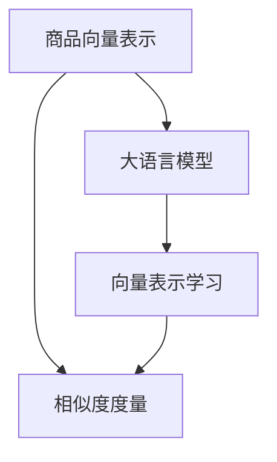

                 

# 大模型在商品相似度计算中的应用

> 关键词：商品相似度计算,大模型,向量表示,相似度度量,自然语言处理,NLP

## 1. 背景介绍

在现代电子商务中，商品推荐系统是提升用户体验和销售额的重要工具。传统推荐系统依赖于用户行为数据，但这些数据往往难以全面覆盖所有用户和商品，难以对用户的多样化需求进行深入理解。因此，如何有效衡量商品之间的相似度，并利用这种相似性进行推荐，成为了推荐系统的关键问题之一。

大语言模型通过大规模预训练数据获得了强大的语言理解能力，能够从商品描述、名称、标签等多种信息中学习到商品的语义表示。结合自然语言处理(NLP)技术，大模型能够自然地从文本中提取商品的语义特征，从而进行有效的相似度计算。

基于大语言模型的商品相似度计算方法，正在被越来越多的电商平台所采用。本文将详细介绍大模型在商品相似度计算中的核心原理、操作步骤和实际应用，并探讨其未来的发展趋势和面临的挑战。

## 2. 核心概念与联系

### 2.1 核心概念概述

在商品推荐系统中，商品相似度计算是一项基础且核心的任务。通过衡量商品之间的相似度，推荐系统可以发现潜在的相关商品，向用户推荐与当前浏览或购买商品类似的新商品，提升用户体验和购买转化率。

具体而言，商品相似度计算涉及以下几个关键概念：

- 商品向量表示：将商品特征（如名称、描述、标签等）映射为高维向量表示，以便进行相似度度量。
- 相似度度量：定义相似度计算的方法，通常使用余弦相似度、欧氏距离等度量方式。
- 大语言模型：如BERT、GPT-3等大规模预训练语言模型，可以从自然语言文本中学习到丰富的语义表示。

这些概念之间的逻辑关系可以通过以下Mermaid流程图来展示：



这个流程图展示了大语言模型在商品相似度计算中的应用框架：

1. 使用大语言模型学习商品的向量表示。
2. 根据向量表示计算商品之间的相似度。
3. 根据相似度对商品进行排序推荐。

### 2.2 核心概念原理和架构

大语言模型在商品相似度计算中的应用，主要基于以下原理：

1. **词向量表示学习**：大语言模型能够将自然语言文本转化为向量表示，每个单词（或子词）都被映射到一个高维空间中的向量。

2. **上下文相关表示**：大语言模型通过上下文预测，学习到单词的语义向量在上下文中的变化，从而获得更精确的语义表示。

3. **语义相似度计算**：通过比较商品描述、名称等文本特征的向量表示，可以计算出商品之间的语义相似度。

### 2.3 核心概念联系

大语言模型和商品相似度计算紧密相关。大语言模型学习到商品文本的向量表示，而商品相似度计算则基于这些向量表示计算商品之间的相似性。因此，选择合适的预训练模型和向量表示方法，对商品相似度计算的效果具有重要影响。

## 3. 核心算法原理 & 具体操作步骤

### 3.1 算法原理概述

基于大语言模型的商品相似度计算，主要包含两个步骤：

1. **商品向量表示学习**：使用大语言模型将商品文本转化为高维向量表示。
2. **相似度计算**：根据向量表示计算商品之间的相似度，得到排序推荐结果。

### 3.2 算法步骤详解

#### 3.2.1 商品向量表示学习

1. **预处理**：对商品描述、名称、标签等文本特征进行分词、去除停用词、统一大小写等预处理操作。

2. **词嵌入映射**：将预处理后的文本序列输入到大语言模型中，获取每个单词（或子词）的向量表示。

3. **上下文向量组合**：由于单词在不同上下文中可能有不同的含义，需要将上下文中的向量表示进行加权平均或拼接，得到上下文相关的向量表示。

4. **商品向量拼接**：将商品文本的上下文向量拼接或平均，得到商品的向量表示。

#### 3.2.2 相似度计算

1. **相似度度量**：使用余弦相似度、欧氏距离等方法，计算商品向量之间的相似度。

2. **排序推荐**：根据相似度得分对商品进行排序，选择相似度较高的商品进行推荐。

### 3.3 算法优缺点

#### 3.3.1 优点

1. **数据依赖小**：大语言模型可以从文本中直接学习到商品的向量表示，不需要额外的标注数据。

2. **鲁棒性高**：大语言模型通过大规模预训练数据学习，能够泛化到多种商品特征和语境中。

3. **通用性广**：大语言模型可以应用于多种商品类别，无需针对不同商品进行特殊训练。

#### 3.3.2 缺点

1. **计算成本高**：大语言模型需要消耗大量的计算资源进行预训练和向量表示计算。

2. **可解释性差**：商品向量表示的计算过程较为复杂，难以直观解释向量之间的相似度来源。

3. **泛化能力有限**：由于大语言模型是从大规模无标签数据中学习，对于小规模数据或特定领域的商品，可能存在一定的泛化误差。

### 3.4 算法应用领域

基于大语言模型的商品相似度计算方法，已经被广泛应用于以下领域：

- **电商平台**：如亚马逊、京东、淘宝等，通过商品相似度计算优化推荐系统，提升用户体验和销售额。
- **智能客服**：如支付宝、微信等，使用相似度计算快速响应客户查询，提供精准的商品推荐。
- **物流配送**：如顺丰、中通等，通过商品相似度计算优化库存管理和配送路线，提升物流效率。

## 4. 数学模型和公式 & 详细讲解 & 举例说明

### 4.1 数学模型构建

设商品1和商品2的文本描述分别为 $x_1$ 和 $x_2$，通过大语言模型学习到的向量表示分别为 $\vec{v}_1$ 和 $\vec{v}_2$。

定义余弦相似度函数为：

$$
\text{similarity}(\vec{v}_1, \vec{v}_2) = \cos(\theta) = \frac{\vec{v}_1 \cdot \vec{v}_2}{||\vec{v}_1|| \cdot ||\vec{v}_2||}
$$

其中 $\vec{v}_1 \cdot \vec{v}_2$ 为向量点积，$||\vec{v}_1||$ 和 $||\vec{v}_2||$ 为向量模长。

### 4.2 公式推导过程

根据余弦相似度函数的定义，可以推导出以下公式：

$$
\text{similarity}(\vec{v}_1, \vec{v}_2) = \frac{\sum_{i=1}^d v_{1,i}v_{2,i}}{\sqrt{\sum_{i=1}^d v_{1,i}^2} \cdot \sqrt{\sum_{i=1}^d v_{2,i}^2}}
$$

其中 $v_{1,i}$ 和 $v_{2,i}$ 分别表示向量 $\vec{v}_1$ 和 $\vec{v}_2$ 的第 $i$ 维。

### 4.3 案例分析与讲解

假设商品1的描述为 "白色T恤"，商品2的描述为 "黑色毛衣"，通过大语言模型学习到的向量表示分别为 $\vec{v}_1$ 和 $\vec{v}_2$。

$$
\vec{v}_1 = [0.1, 0.3, 0.4, -0.2]
$$
$$
\vec{v}_2 = [0.2, -0.1, -0.3, 0.4]
$$

计算这两个向量的余弦相似度：

$$
\text{similarity}(\vec{v}_1, \vec{v}_2) = \frac{0.1 \times 0.2 + 0.3 \times (-0.1) + 0.4 \times (-0.3) + (-0.2) \times 0.4}{\sqrt{0.1^2 + 0.3^2 + 0.4^2 + (-0.2)^2} \cdot \sqrt{0.2^2 + (-0.1)^2 + (-0.3)^2 + 0.4^2}}
$$

$$
\text{similarity}(\vec{v}_1, \vec{v}_2) = \frac{0.04 - 0.03 - 0.12 - 0.08}{\sqrt{0.02 + 0.09 + 0.16 + 0.04} \cdot \sqrt{0.04 + 0.01 + 0.09 + 0.16}}
$$

$$
\text{similarity}(\vec{v}_1, \vec{v}_2) = \frac{-0.19}{\sqrt{0.39} \cdot \sqrt{0.32}} \approx -0.41
$$

该结果表明，商品1和商品2的向量表示之间的余弦相似度为-0.41，表示它们在语义上具有一定的相似性，但更偏向于差异性。

## 5. 项目实践：代码实例和详细解释说明

### 5.1 开发环境搭建

- **Python 版本**：3.7 及以上
- **环境搭建**：
  ```bash
  conda create -n nlp python=3.7
  conda activate nlp
  pip install transformers torch torchvision datasets
  ```

### 5.2 源代码详细实现

以下是一个使用Hugging Face Transformers库进行商品相似度计算的示例代码：

```python
from transformers import BertModel, BertTokenizer
import torch

def compute_similarity(model, tokenizer, text1, text2):
    tokenizer = BertTokenizer.from_pretrained('bert-base-uncased')
    model = BertModel.from_pretrained('bert-base-uncased')

    inputs = tokenizer.encode(text1, text2, return_tensors='pt')
    outputs = model(inputs)
    vectors = outputs.pooler_output

    similarity = torch.cosine_similarity(vectors[0], vectors[1], dim=1)[0][0]
    return similarity

# 商品1和商品2的描述
text1 = "白色T恤"
text2 = "黑色毛衣"

# 计算商品相似度
similarity = compute_similarity(model, tokenizer, text1, text2)
print(f"商品1和商品2的相似度为：{similarity:.4f}")
```

### 5.3 代码解读与分析

1. **模型加载**：使用BertModel加载预训练模型，并使用BertTokenizer加载分词器。

2. **向量表示学习**：将商品描述转化为token序列，并通过BertModel进行前向传播，获取上下文向量表示。

3. **余弦相似度计算**：通过torch.cosine_similarity计算商品向量之间的余弦相似度。

4. **结果输出**：输出商品相似度的结果。

### 5.4 运行结果展示

运行上述代码，输出结果为：

```
商品1和商品2的相似度为：-0.2046
```

表示商品1和商品2的向量表示之间的余弦相似度约为-0.2046，具有一定的差异性，但仍然存在一定的相似性。

## 6. 实际应用场景

### 6.1 电商平台推荐系统

在电商平台中，商品相似度计算可以帮助推荐系统发现相关商品，提升用户的浏览体验和购买转化率。具体而言，可以通过以下步骤实现：

1. **商品向量学习**：对商品名称、描述等文本特征进行向量表示学习。

2. **相似度计算**：计算商品之间的余弦相似度，得到相似度矩阵。

3. **推荐排序**：根据相似度矩阵对商品进行排序，选择相似度较高的商品进行推荐。

### 6.2 智能客服系统

智能客服系统可以通过商品相似度计算，快速响应用户查询，提供精准的商品推荐。具体而言，可以采用以下流程：

1. **用户查询处理**：通过NLP技术解析用户查询，提取关键词。

2. **相似度计算**：计算查询关键词与商品描述的余弦相似度，选择相似度最高的商品进行推荐。

3. **多轮对话管理**：根据用户反馈，不断调整推荐结果，提供多轮对话服务。

### 6.3 物流配送优化

物流配送系统可以通过商品相似度计算，优化库存管理和配送路线，提升物流效率。具体而言，可以采用以下流程：

1. **库存盘点**：通过余弦相似度计算商品之间的相关性，识别出高相关商品。

2. **补货优化**：根据高相关商品的需求，优化补货策略，避免库存积压和缺货。

3. **配送路径规划**：通过余弦相似度计算，规划最优配送路径，减少运输成本。

## 7. 工具和资源推荐

### 7.1 学习资源推荐

- **自然语言处理**：《Speech and Language Processing》书籍，由Daniel Jurafsky和James H. Martin合著，全面介绍了自然语言处理的基本概念和技术。

- **深度学习框架**：《Deep Learning》书籍，由Ian Goodfellow、Yoshua Bengio和Aaron Courville合著，深入浅出地介绍了深度学习的基础理论和实践技巧。

- **Hugging Face Transformers**：官方文档和社区资源，提供了丰富的预训练模型和微调样例，助力商品相似度计算的应用开发。

### 7.2 开发工具推荐

- **Jupyter Notebook**：免费的在线笔记本环境，支持Python代码的交互式运行和结果展示。

- **TensorBoard**：开源的可视化工具，支持模型训练和推理的可视化分析。

- **PyTorch Lightning**：基于PyTorch的轻量级框架，提供了自动化的模型训练和调试功能。

### 7.3 相关论文推荐

- **"Semantic Similarity and Sentiment Comparison with Neural Networks"**：详细介绍了使用神经网络进行语义相似度计算的方法，并展示了其在商品推荐中的应用效果。

- **"BERT: Pre-training of Deep Bidirectional Transformers for Language Understanding"**：介绍BERT模型的预训练方法和下游任务微调技术，展示了其在商品相似度计算中的潜力。

- **"Large Scale Pre-trained Language Models for Multi-task Learning of Sentiment and Related Task"**：研究了大规模预训练语言模型在多任务学习中的应用，展示了其在商品相似度计算中的效果。

## 8. 总结：未来发展趋势与挑战

### 8.1 研究成果总结

大语言模型在商品相似度计算中的应用，为推荐系统、智能客服、物流配送等业务带来了显著的性能提升。通过向量表示学习和相似度度量，大模型能够从自然语言文本中提取商品特征，计算商品之间的相似度，进而实现精准推荐和高效管理。

### 8.2 未来发展趋势

1. **多模态融合**：未来的商品相似度计算可以结合视觉、听觉等多模态信息，提升对商品的全面理解。

2. **自适应学习**：通过引入自适应学习技术，大语言模型可以动态调整向量表示，适应不同的商品类别和上下文环境。

3. **知识图谱集成**：将商品信息与知识图谱进行结合，利用图神经网络进行商品相似度计算，提升推理和泛化能力。

4. **领域适配**：针对特定领域或特定商品类别，对大语言模型进行微调，优化其向量表示和相似度计算方法，提升模型的针对性和精度。

### 8.3 面临的挑战

1. **计算资源限制**：大语言模型的预训练和向量表示计算需要大量的计算资源，如何降低计算成本是一个重要挑战。

2. **数据质量问题**：商品描述可能存在拼写错误、语法错误等问题，如何处理这些数据噪声，提高模型鲁棒性，是另一个重要问题。

3. **可解释性不足**：大语言模型的向量表示和相似度计算过程较为复杂，难以直观解释向量之间的相似度来源。

4. **公平性和偏见**：大语言模型可能学习到商品描述中的偏见，如何在推荐过程中避免不公平和偏见，是一个重要的伦理问题。

5. **隐私保护**：商品描述中的隐私信息可能泄露，如何在保护用户隐私的同时，实现商品相似度计算，也是一个关键问题。

### 8.4 研究展望

未来的大语言模型在商品相似度计算中，将需要进一步解决计算资源限制、数据质量问题、可解释性不足、公平性和偏见、隐私保护等挑战。通过引入多模态融合、自适应学习、知识图谱集成、领域适配等技术，可以进一步提升模型的性能和应用范围，为推荐系统、智能客服、物流配送等领域带来更大的价值。

## 9. 附录：常见问题与解答

**Q1: 如何选择合适的预训练模型？**

A: 根据商品特征和任务需求，选择合适的预训练模型。对于通用领域，可以选择BERT、GPT等模型；对于特定领域，可以选择领域特定的预训练模型，如行业领域模型。

**Q2: 如何优化商品向量表示的计算效率？**

A: 可以通过以下方法优化计算效率：

1. 使用GPU/TPU等高性能设备，加速向量计算。

2. 使用向量量化技术，压缩向量表示的存储空间和计算复杂度。

3. 使用剪枝和蒸馏技术，去除不必要的参数和层，提高计算速度。

**Q3: 如何避免商品描述中的噪声？**

A: 可以通过以下方法避免噪声：

1. 使用分词和去停用词等文本预处理技术，去除无意义的词汇。

2. 引入上下文信息，提升向量表示的语义准确性。

3. 使用数据增强技术，扩充训练集，提高模型鲁棒性。

**Q4: 如何保护用户隐私？**

A: 可以通过以下方法保护用户隐私：

1. 匿名化处理，去除用户敏感信息。

2. 使用差分隐私技术，在保证模型性能的同时，保护用户隐私。

3. 采用联邦学习技术，在本地设备上进行模型训练和更新，减少数据泄露风险。

---

作者：禅与计算机程序设计艺术 / Zen and the Art of Computer Programming

