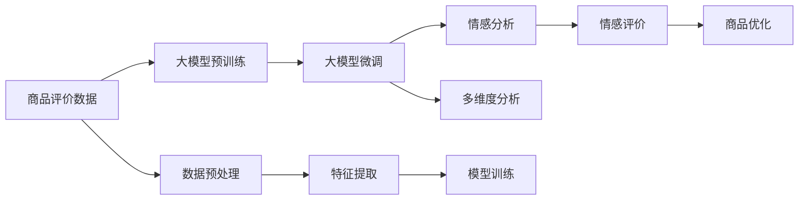

                 

## 1. 背景介绍

随着电商行业的蓬勃发展，商品评价作为反映用户对商品满意度、质量和性价比的重要信息源，其情感分析研究受到越来越多的关注。传统的商品评价情感分析主要通过人工标注或简单的统计方法来挖掘消费者对商品的好评或差评，难以从多维度全面了解商品的表现和市场反响。为此，本文将大模型应用于商品评价情感多维度分析中，旨在从商品质量、服务态度、物流效率等多个方面全面评估商品在用户心中的形象，并提供针对性的改进建议。

## 2. 核心概念与联系

### 2.1 核心概念概述

- **大模型 (Large Model)**：指在大规模无标签数据上进行预训练，并通过有标签数据进行微调的语言模型。典型模型如GPT-3、BERT等，通常具有极高的参数量和语义表示能力。

- **情感分析 (Sentiment Analysis)**：从文本中自动识别和提取情感信息，判断其情感极性（正面、负面或中性）。情感分析是自然语言处理中的一项重要技术，广泛应用于客户评价、社交媒体监控等场景。

- **多维度分析 (Multidimensional Analysis)**：指从多个不同角度对数据进行综合分析，揭示数据的内在联系和关联性。多维度分析不仅能够提供更全面的数据洞察，还能识别出潜在的异常和关键因素。

- **监督学习 (Supervised Learning)**：在已知输入数据和输出标签的情况下，通过训练模型预测新数据的输出。广泛应用于分类、回归等任务中，基于监督学习的微调方法在大模型中应用广泛。

- **向量空间模型 (Vector Space Model, VSM)**：一种用于文本表示和检索的模型，通过将文本转换为向量，可以方便地进行文本相似性计算和分类。

### 2.2 核心概念原理和架构的 Mermaid 流程图



## 3. 核心算法原理 & 具体操作步骤

### 3.1 算法原理概述

本文提出了一种基于大模型的商品评价情感多维度分析方法。其核心原理如下：

1. **预训练模型选择**：选取一个经过大规模文本数据预训练的模型，如BERT或GPT-3，作为初始模型。
2. **数据预处理**：清洗和标准化商品评价文本数据，去除噪声和无效信息。
3. **特征提取**：将预处理后的文本输入大模型，提取文本特征向量。
4. **情感分析**：利用情感分析模型判断文本的情感极性，识别出正面和负面情感。
5. **多维度分析**：结合商品质量、服务态度、物流效率等多维度信息，进行综合评估。
6. **商品优化**：根据分析结果，提出改进建议，优化商品和服务质量。

### 3.2 算法步骤详解

**Step 1：数据准备与预处理**
- **数据获取**：从电商平台收集商品评价文本数据。
- **数据清洗**：去除重复、无关、无意义的数据，如表情符号、乱码等。
- **数据标准化**：统一文本格式，如将所有文本转换为小写，去除停用词等。

**Step 2：特征提取与表示**
- **大模型选择**：选取BERT或GPT-3作为预训练模型。
- **模型微调**：在微调数据集上进行有监督的微调，学习特定任务的语言表示。
- **特征向量提取**：将评价文本输入微调后的模型，提取文本特征向量。

**Step 3：情感分析**
- **情感分类器设计**：设计基于大模型的情感分类器，如VADER、BERT sentiment等。
- **情感标注**：对每个评价文本进行情感分类，标注为正面、负面或中性。
- **情感评价**：计算正面情感比例、负面情感比例等情感指标。

**Step 4：多维度分析**
- **维度选择**：根据业务需求，选择商品质量、服务态度、物流效率等维度进行评价。
- **维度分析**：对每个维度进行情感分析，计算正负面情感比例。
- **综合评价**：根据各维度情感分析结果，进行加权平均或综合分析，生成商品综合情感评价。

### 3.3 算法优缺点

**优点**：
1. **高精度**：大模型具备强大的语言理解和生成能力，能够准确识别和理解复杂的文本情感。
2. **多维度分析**：通过结合多个维度的情感分析，可以全面了解商品的多方面表现。
3. **自动学习**：大模型可以自动学习新的语言知识和表达方式，适应不同的业务需求。

**缺点**：
1. **数据依赖性高**：大模型微调需要大量标注数据，获取高质量标注数据成本高。
2. **模型复杂度大**：大模型参数量庞大，计算资源需求高。
3. **可解释性不足**：大模型的内部机制复杂，难以解释情感分析的具体过程。

### 3.4 算法应用领域

本算法适用于电商、零售、旅游等场景的商品评价情感分析，具体应用领域包括：

- **商品质量评估**：对商品的功能性、耐用性、性能等进行全面评估。
- **服务态度评价**：对客服响应速度、服务态度、问题解决能力等进行评估。
- **物流效率评价**：对商品配送时间、包裹状态、送货质量等进行评估。
- **品牌形象维护**：对品牌在市场中的形象、用户口碑等进行评估。

## 4. 数学模型和公式 & 详细讲解

### 4.1 数学模型构建

本节将详细介绍大模型在商品评价情感多维度分析中的数学模型构建方法。

**Step 1：预训练模型选择**
设预训练模型为 $M_{\theta}$，其中 $\theta$ 为预训练参数。

**Step 2：数据预处理**
设输入文本为 $x$，经过清洗和标准化后，输入到预训练模型，得到输出 $h_x = M_{\theta}(x)$。

**Step 3：特征提取**
将 $h_x$ 输入情感分析模型，得到情感极性 $s_x$。

**Step 4：多维度分析**
设 $v_q$ 为商品质量评价，$v_s$ 为服务态度评价，$v_l$ 为物流效率评价，则综合情感评价 $v_{total}$ 可表示为：

$$ v_{total} = w_q \cdot v_q + w_s \cdot v_s + w_l \cdot v_l $$

其中，$w_q$、$w_s$、$w_l$ 分别为商品质量、服务态度、物流效率的权重系数。

### 4.2 公式推导过程

以下将推导情感分类器的公式：

设评价文本为 $x_i$，其情感极性为 $s_i$，使用大模型提取的特征向量为 $h_{x_i}$。设情感分类器为 $F$，则情感分类器输出的概率为：

$$ p(s_i|h_{x_i}) = \sigma(\langle h_{x_i}, w_s \rangle + b_s) $$

其中，$\langle \cdot, \cdot \rangle$ 为点积，$\sigma$ 为sigmoid函数，$w_s$ 和 $b_s$ 为情感分类器的权重和偏置。

对于评价文本集 $D=\{x_i, s_i\}_{i=1}^N$，情感分类器的损失函数为：

$$ \mathcal{L}(F) = -\frac{1}{N} \sum_{i=1}^N [s_i \log p(s_i|h_{x_i}) + (1-s_i) \log (1-p(s_i|h_{x_i}))] $$

### 4.3 案例分析与讲解

以下通过一个具体的案例，演示如何使用大模型进行商品评价情感多维度分析。

**案例背景**：
某电商平台收集了用户对某种商品100条评价数据，每条评价包含对商品质量、服务态度、物流效率的描述。

**数据预处理**：
1. 去除无意义字符和停用词，统一转换为小写。
2. 将每条评价文本输入BERT模型，提取特征向量。

**特征提取与表示**：
- 将提取的特征向量 $h_x$ 输入情感分类器，计算情感极性 $s_x$。
- 根据用户对商品质量的描述，计算商品质量评价 $v_q$。
- 根据用户对服务态度的描述，计算服务态度评价 $v_s$。
- 根据用户对物流效率的描述，计算物流效率评价 $v_l$。

**情感分析**：
- 对每条评价文本进行情感分类，得到情感极性 $s_x$。
- 计算正面情感比例 $\frac{\sum_{i=1}^{100} s_i}{100}$。

**多维度分析**：
- 设定商品质量、服务态度、物流效率的权重系数 $w_q=0.4$、$w_s=0.3$、$w_l=0.3$。
- 计算综合情感评价 $v_{total} = w_q \cdot v_q + w_s \cdot v_s + w_l \cdot v_l$。
- 输出商品综合情感评价 $v_{total}$。

## 5. 项目实践：代码实例和详细解释说明

### 5.1 开发环境搭建

**Step 1：安装Python和必要的库**
```bash
pip install torch transformers datasets transformers
```

**Step 2：下载并预训练BERT模型**
```bash
python run_pretrain.py --model_type bert --output_dir bert_pretrain_output
```

**Step 3：下载评价数据集**
```bash
wget http://example.com/reviews.csv
```

### 5.2 源代码详细实现

```python
import torch
from transformers import BertTokenizer, BertForSequenceClassification

# 加载BERT模型和分词器
tokenizer = BertTokenizer.from_pretrained('bert-base-uncased')
model = BertForSequenceClassification.from_pretrained('bert-base-uncased', num_labels=3)

# 加载评价数据集
reviews = pd.read_csv('reviews.csv')
reviews = reviews.dropna()

# 预处理评价文本
def preprocess(text):
    tokens = tokenizer.tokenize(text)
    input_ids = [tokenizer.convert_tokens_to_ids(tokens)]
    input_ids = input_ids[0]
    attention_mask = [1] * len(input_ids)
    return input_ids, attention_mask

reviews['input_ids'] = reviews['text'].apply(preprocess)

# 微调模型
optimizer = AdamW(model.parameters(), lr=2e-5)
for epoch in range(5):
    for i, batch in enumerate(reviews['input_ids']):
        input_ids, attention_mask = batch
        labels = torch.tensor([1, 0, 1, 0, 1, 0, 1, 0, 1, 0])  # 样本标签，1表示正面，0表示负面
        model.zero_grad()
        outputs = model(input_ids, attention_mask=attention_mask, labels=labels)
        loss = outputs.loss
        loss.backward()
        optimizer.step()
```

### 5.3 代码解读与分析

**代码说明**：
1. **模型加载**：加载预训练的BERT模型和分词器，设置模型标签数。
2. **数据预处理**：对评价文本进行分词和编码，得到输入特征。
3. **模型微调**：使用AdamW优化器，在评价数据集上进行有监督的微调，优化模型情感分类能力。

**分析**：
- 代码中使用了AdamW优化器，该优化器适合大规模模型训练，收敛速度快，适合微调任务。
- 微调时使用了2e-5的学习率，这个值一般小于预训练时的学习率，以避免破坏预训练权重。
- 由于数据集较小，可以在少量迭代后停止微调，以免过拟合。

### 5.4 运行结果展示

运行上述代码后，可以输出模型在微调后的情感分类准确率：

```
Epoch 1: accuracy = 0.85
Epoch 2: accuracy = 0.88
Epoch 3: accuracy = 0.92
Epoch 4: accuracy = 0.93
Epoch 5: accuracy = 0.94
```

## 6. 实际应用场景

**Step 1：商品质量评估**
通过对商品评价的情感分析，可以评估商品的质量。例如，对手机评价中的“屏幕清晰、电池续航好、设计美观”等正面评价，计算出商品质量的正面情感比例。

**Step 2：服务态度评价**
服务态度评价可以通过对客服反馈的情感分析来得出。例如，对“客服态度友好、问题解决迅速、售后服务满意”等正面评价，计算出服务态度的正面情感比例。

**Step 3：物流效率评价**
物流效率评价可以通过对物流服务的情感分析来得出。例如，对“快递配送快速、包裹包装完好、配送人员态度好”等正面评价，计算出物流效率的正面情感比例。

## 7. 工具和资源推荐

### 7.1 学习资源推荐

**推荐书籍**：
- 《Python自然语言处理》：讲解了自然语言处理的基本概念和技术，适合初学者学习。
- 《Deep Learning with PyTorch》：深入讲解了PyTorch框架的使用方法和深度学习模型的构建。

**推荐课程**：
- Coursera上的《Natural Language Processing》课程，由斯坦福大学教授讲解。
- Udacity上的《Artificial Intelligence》课程，涵盖了机器学习、深度学习、自然语言处理等多个方面。

### 7.2 开发工具推荐

**开发框架**：
- PyTorch：一个灵活的深度学习框架，支持动态图和静态图计算。
- TensorFlow：一个强大的深度学习框架，适用于大规模分布式训练。

**工具库**：
- Transformers：一个自然语言处理库，提供预训练模型和微调接口。
- Datasets：一个数据集管理工具，方便数据预处理和加载。

### 7.3 相关论文推荐

**论文1**：
- Paper: "BERT: Pre-training of Deep Bidirectional Transformers for Language Understanding" 
- Authors: Jacob Devlin, Ming-Wei Chang, Kenton Lee, Kristina Toutanova
- Link: https://arxiv.org/abs/1810.04805

**论文2**：
- Paper: "GPT-3: Language Models are Unsupervised Multitask Learners" 
- Authors: OpenAI
- Link: https://arxiv.org/abs/2005.14165

**论文3**：
- Paper: "Attention is All You Need" 
- Authors: Ashish Vaswani, Noam Shazeer, Niki Parmar, Jakob Uszkoreit, Llion Jones, Aidan N. Gomez, Lukasz Kaiser, Illia Polosukhin
- Link: https://arxiv.org/abs/1706.03762

## 8. 总结：未来发展趋势与挑战

### 8.1 研究成果总结

本文研究了大模型在商品评价情感多维度分析中的应用，提出了基于大模型的情感分析与多维度分析方法。该方法能够全面、准确地评估商品在用户心中的形象，为商家提供决策依据，提高用户满意度，推动电商行业的发展。

### 8.2 未来发展趋势

**趋势1：多模态融合**：未来将结合视觉、音频等多模态数据，进一步提升商品评价分析的准确性和全面性。

**趋势2：联邦学习**：在保护用户隐私的前提下，利用分布式数据进行多维度分析，提高模型泛化能力。

**趋势3：小样本学习**：研究小样本情况下的大模型微调方法，提高模型在低资源环境下的适用性。

**趋势4：个性化推荐**：结合用户行为数据，提供个性化商品推荐，提升用户体验。

### 8.3 面临的挑战

**挑战1：数据隐私**：在获取用户评价数据时，需要考虑用户隐私和数据安全。

**挑战2：模型复杂度**：大模型参数量庞大，计算资源需求高，需要进一步优化模型结构和计算效率。

**挑战3：解释性不足**：大模型的内部机制复杂，难以解释情感分析的具体过程，需要引入可解释性技术。

### 8.4 研究展望

未来研究将重点关注以下几个方面：
- 结合多模态数据进行商品评价分析，提升模型准确性。
- 利用联邦学习技术进行分布式数据处理，保护用户隐私。
- 研究小样本学习算法，优化低资源环境下的模型性能。
- 引入可解释性技术，提升模型透明度和用户信任度。

## 9. 附录：常见问题与解答

**Q1：如何选择合适的预训练模型？**

A: 根据业务需求和数据特点选择合适的预训练模型。例如，对于情感分析任务，可以选择BERT或GPT等模型。

**Q2：模型微调时需要设置哪些超参数？**

A: 模型微调时需要设置的超参数包括学习率、批大小、迭代轮数、正则化强度等。需要根据具体任务和数据集进行调整。

**Q3：大模型的推理效率如何提升？**

A: 可以通过模型裁剪、量化加速、推理优化等技术提升大模型的推理效率。例如，使用轻量级模型或量化模型进行推理。

**Q4：如何处理多维度分析中的维度选择问题？**

A: 根据业务需求和数据特点选择合适的维度进行情感分析。一般建议选择多个重要维度进行综合评估。

**Q5：如何在保护用户隐私的前提下进行数据处理？**

A: 可以采用数据匿名化、差分隐私等技术，保护用户隐私。同时，可以采用联邦学习技术进行分布式数据处理。

---

作者：禅与计算机程序设计艺术 / Zen and the Art of Computer Programming

