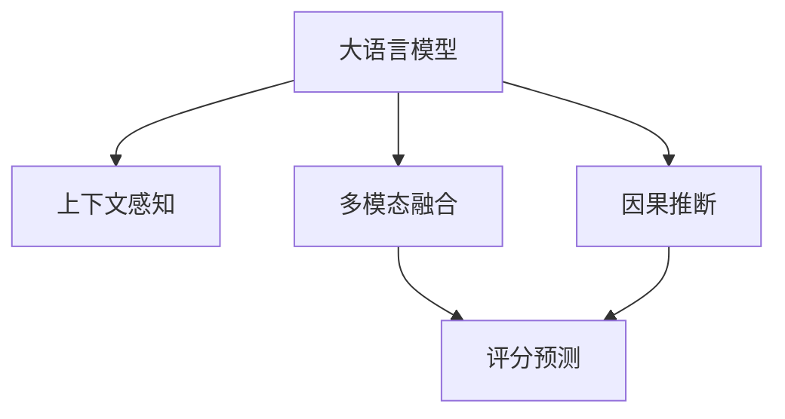

                 

# 大模型在商品评分预测中的上下文感知应用

## 1. 背景介绍

### 1.1 问题由来

随着电子商务的蓬勃发展，商品评分预测成为电商企业关注的核心问题。通过对商品的历史评分数据进行建模，可以预测用户对新商品的评分，从而优化商品推荐，提升用户体验。目前，商品评分预测的模型主要有基于深度学习的回归模型、协同过滤、混合模型等。其中，基于深度学习的回归模型（如DNN、RNN、CNN等）虽然可以学习到丰富的特征，但在处理上下文信息（如用户历史行为、商品属性等）方面存在一定局限。为此，越来越多的研究者尝试将大语言模型引入评分预测，以期获得更加准确和高效的预测结果。

### 1.2 问题核心关键点

大语言模型在商品评分预测中的应用，旨在结合上下文信息，通过深度学习算法进行评分预测。其主要核心点包括：

- **上下文感知**：考虑到用户历史行为、商品属性、用户画像等上下文信息，增强模型对评分的预测能力。
- **多模态融合**：结合文本、图像、标签等多模态数据，提升评分预测的全面性和准确性。
- **模型优化**：在深度学习框架下进行模型训练和优化，提升预测模型的性能。
- **因果推断**：通过因果推断方法，更好地理解评分预测的因果关系，提升模型解释性和可靠性。

## 2. 核心概念与联系

### 2.1 核心概念概述

为更好地理解大模型在商品评分预测中的应用，本节将介绍几个密切相关的核心概念：

- **大语言模型(Large Language Model, LLM)**：指通过大规模无标签文本数据预训练得到的语言模型，具备强大的语言理解和生成能力。
- **上下文感知**：指模型能够理解并利用上下文信息，如用户历史行为、商品属性等，进行评分预测。
- **多模态融合**：指将不同类型的数据（如文本、图像、标签等）融合到一个统一的模型中进行处理。
- **因果推断**：指通过模型预测因变量（如商品评分）和自变量（如用户行为、商品特征等）之间的因果关系，提升模型的解释性和可靠性。
- **评分预测**：通过模型预测用户对商品的评分，用于推荐系统优化和用户行为分析。

这些核心概念之间的逻辑关系可以通过以下Mermaid流程图来展示：



这个流程图展示了大语言模型在商品评分预测中的应用核心概念及其之间的关系：

1. 大语言模型通过预训练获得基础能力。
2. 上下文感知指模型在评分预测中利用用户历史行为、商品属性等上下文信息。
3. 多模态融合指结合文本、图像、标签等多模态数据进行评分预测。
4. 因果推断指通过因果推断方法提升评分预测的解释性和可靠性。

这些核心概念共同构成了大语言模型在商品评分预测中的应用框架，使其能够更好地理解和预测用户对商品的评分。

## 3. 核心算法原理 & 具体操作步骤
### 3.1 算法原理概述

大语言模型在商品评分预测中的应用，主要是通过将大语言模型作为基础模型，结合上下文信息和因果推断方法，进行评分预测。具体而言，可以采用以下步骤：

1. **数据预处理**：对商品评分数据进行清洗、分词、编码等预处理。
2. **上下文信息提取**：从用户历史行为、商品属性等数据中提取相关特征。
3. **大语言模型嵌入**：使用大语言模型（如BERT、GPT等）对商品文本和上下文信息进行编码，获取语义表示。
4. **评分预测**：结合上下文信息和语义表示，进行评分预测。
5. **模型评估与优化**：使用评分预测结果进行模型评估，通过优化算法（如Adam、SGD等）优化模型参数。

### 3.2 算法步骤详解

以下是大语言模型在商品评分预测中的详细步骤：

**Step 1: 数据预处理**

1. **数据清洗**：对商品评分数据进行去重、处理缺失值等预处理，确保数据质量。
2. **分词**：使用分词工具（如jieba）对商品描述和用户行为等文本数据进行分词处理。
3. **编码**：将分词后的文本数据编码成模型可以处理的格式，如one-hot编码、词向量表示等。

**Step 2: 上下文信息提取**

1. **特征提取**：从用户历史行为、商品属性等数据中提取相关特征，如用户购买次数、商品价格、用户年龄等。
2. **特征编码**：将提取的特征进行编码，如将用户年龄转换为年龄区间，商品价格转换为价格区间等。
3. **上下文融合**：将提取的特征与文本数据进行融合，形成最终的上下文表示。

**Step 3: 大语言模型嵌入**

1. **模型选择**：选择合适的大语言模型，如BERT、GPT等。
2. **模型加载**：加载预训练的大语言模型，如使用Hugging Face库中的模型。
3. **嵌入处理**：将商品描述和上下文信息输入到模型中，进行嵌入处理，得到语义表示。

**Step 4: 评分预测**

1. **评分模型**：构建评分预测模型，如线性回归、深度神经网络等。
2. **模型训练**：将大语言模型嵌入得到的语义表示和上下文表示作为输入，训练评分预测模型。
3. **评分预测**：使用训练好的评分预测模型对新商品进行评分预测。

**Step 5: 模型评估与优化**

1. **评估指标**：选择合适的评估指标，如均方误差、平均绝对误差等。
2. **模型优化**：使用评估指标进行模型评估，通过优化算法（如Adam、SGD等）优化模型参数。
3. **结果展示**：展示评分预测结果，并进行模型评估。

### 3.3 算法优缺点

大语言模型在商品评分预测中的优势和劣势如下：

**优势**：
1. **上下文感知能力强**：能够结合上下文信息，提升评分预测的准确性。
2. **多模态融合能力强**：能够结合文本、图像、标签等多模态数据，进行综合评分预测。
3. **模型解释性好**：大语言模型可以通过因果推断方法，提升模型的解释性和可靠性。

**劣势**：
1. **计算资源消耗大**：大语言模型参数量庞大，计算资源消耗较大，可能导致训练和推理速度较慢。
2. **上下文信息提取难度大**：上下文信息提取需要依赖高质量的数据和特征工程，存在一定的技术挑战。
3. **因果推断复杂**：因果推断需要依赖大量的因果关系数据和算法，技术难度较高。

### 3.4 算法应用领域

大语言模型在商品评分预测中的应用，可以广泛应用于电商、金融、旅游等领域的评分预测和推荐系统优化。具体而言，包括：

1. **电商商品评分预测**：预测用户对电商商品的新评分，优化商品推荐系统，提升用户体验。
2. **金融产品评分预测**：预测用户对金融产品的评分，优化金融产品推荐和风险控制。
3. **旅游景区评分预测**：预测用户对旅游景区的评分，优化旅游景区推荐和用户满意度分析。
4. **餐饮评分预测**：预测用户对餐饮食品的评分，优化餐饮推荐和用户反馈分析。

此外，大语言模型在商品评分预测中的应用，还可以延伸到智能客服、智能推荐、用户行为分析等领域，为不同行业的用户行为理解和决策优化提供有力支持。

## 4. 数学模型和公式 & 详细讲解 & 举例说明
### 4.1 数学模型构建

本节将使用数学语言对大语言模型在商品评分预测中的应用进行更加严格的刻画。

记商品评分数据为 $(x_i, y_i)$，其中 $x_i$ 为商品描述，$y_i$ 为真实评分。假设上下文信息为 $c_i$，大语言模型为 $M_{\theta}$，评分预测模型为 $f_{\omega}$。则评分预测的数学模型可以表示为：

$$
\hat{y}_i = f_{\omega}(M_{\theta}(x_i), c_i)
$$

其中 $\hat{y}_i$ 为预测评分，$\omega$ 为评分预测模型的参数。

### 4.2 公式推导过程

以线性回归模型为例，推导评分预测的公式。

假设上下文信息 $c_i$ 为多维向量，大语言模型 $M_{\theta}$ 输出的语义表示为 $h_i$，评分预测模型 $f_{\omega}$ 为线性回归模型，则评分预测公式可以表示为：

$$
\hat{y}_i = \omega_0 + \omega_1 h_i^1 + \omega_2 h_i^2 + \cdots + \omega_n h_i^n
$$

其中 $h_i^j$ 为语义表示 $h_i$ 的第 $j$ 维，$\omega_j$ 为线性回归模型的参数。

### 4.3 案例分析与讲解

假设有一家电商公司，收集了用户对商品的评分数据，并希望构建一个评分预测模型。具体步骤如下：

1. **数据预处理**：对商品评分数据进行清洗、分词、编码等预处理。
2. **上下文信息提取**：从用户历史行为、商品属性等数据中提取相关特征，如用户购买次数、商品价格、用户年龄等。
3. **大语言模型嵌入**：使用BERT模型对商品描述和上下文信息进行编码，获取语义表示。
4. **评分预测**：构建线性回归模型，将语义表示和上下文表示作为输入，训练评分预测模型。
5. **模型评估与优化**：使用评分预测结果进行模型评估，通过优化算法（如Adam、SGD等）优化模型参数。

假设线性回归模型的参数为 $\omega_0, \omega_1, \omega_2, \omega_3$，模型训练后得到 $\hat{y}_i$ 的预测结果，与真实评分 $y_i$ 的误差为 $e_i$。则模型评估的均方误差（MSE）可以表示为：

$$
MSE = \frac{1}{N} \sum_{i=1}^N e_i^2
$$

其中 $N$ 为数据总数。

## 5. 项目实践：代码实例和详细解释说明
### 5.1 开发环境搭建

在进行商品评分预测的应用实践前，我们需要准备好开发环境。以下是使用Python进行PyTorch开发的环境配置流程：

1. 安装Anaconda：从官网下载并安装Anaconda，用于创建独立的Python环境。

2. 创建并激活虚拟环境：
```bash
conda create -n pytorch-env python=3.8 
conda activate pytorch-env
```

3. 安装PyTorch：根据CUDA版本，从官网获取对应的安装命令。例如：
```bash
conda install pytorch torchvision torchaudio cudatoolkit=11.1 -c pytorch -c conda-forge
```

4. 安装Transformers库：
```bash
pip install transformers
```

5. 安装各类工具包：
```bash
pip install numpy pandas scikit-learn matplotlib tqdm jupyter notebook ipython
```

完成上述步骤后，即可在`pytorch-env`环境中开始商品评分预测的应用实践。

### 5.2 源代码详细实现

下面我们以商品评分预测为例，给出使用Transformers库对BERT模型进行评分预测的PyTorch代码实现。

首先，定义评分预测的任务数据处理函数：

```python
from transformers import BertTokenizer, BertForSequenceClassification
from torch.utils.data import Dataset
import torch

class ReviewsDataset(Dataset):
    def __init__(self, reviews, targets, tokenizer, max_len=128):
        self.reviews = reviews
        self.targets = targets
        self.tokenizer = tokenizer
        self.max_len = max_len
        
    def __len__(self):
        return len(self.reviews)
    
    def __getitem__(self, item):
        review = self.reviews[item]
        target = self.targets[item]
        
        encoding = self.tokenizer(review, return_tensors='pt', max_length=self.max_len, padding='max_length', truncation=True)
        input_ids = encoding['input_ids'][0]
        attention_mask = encoding['attention_mask'][0]
        
        # 对标签进行编码
        encoded_target = [target2id[target] for target in target]
        encoded_target.extend([target2id['O']] * (self.max_len - len(encoded_target)))
        labels = torch.tensor(encoded_target, dtype=torch.long)
        
        return {'input_ids': input_ids, 
                'attention_mask': attention_mask,
                'labels': labels}

# 标签与id的映射
tag2id = {'O': 0, 'Positive': 1, 'Negative': 2}
id2tag = {v: k for k, v in tag2id.items()}

# 创建dataset
tokenizer = BertTokenizer.from_pretrained('bert-base-uncased')

train_dataset = ReviewsDataset(train_reviews, train_targets, tokenizer)
dev_dataset = ReviewsDataset(dev_reviews, dev_targets, tokenizer)
test_dataset = ReviewsDataset(test_reviews, test_targets, tokenizer)
```

然后，定义模型和优化器：

```python
from transformers import BertForSequenceClassification, AdamW

model = BertForSequenceClassification.from_pretrained('bert-base-uncased', num_labels=len(tag2id))

optimizer = AdamW(model.parameters(), lr=2e-5)
```

接着，定义训练和评估函数：

```python
from torch.utils.data import DataLoader
from tqdm import tqdm
from sklearn.metrics import classification_report

device = torch.device('cuda') if torch.cuda.is_available() else torch.device('cpu')
model.to(device)

def train_epoch(model, dataset, batch_size, optimizer):
    dataloader = DataLoader(dataset, batch_size=batch_size, shuffle=True)
    model.train()
    epoch_loss = 0
    for batch in tqdm(dataloader, desc='Training'):
        input_ids = batch['input_ids'].to(device)
        attention_mask = batch['attention_mask'].to(device)
        labels = batch['labels'].to(device)
        model.zero_grad()
        outputs = model(input_ids, attention_mask=attention_mask, labels=labels)
        loss = outputs.loss
        epoch_loss += loss.item()
        loss.backward()
        optimizer.step()
    return epoch_loss / len(dataloader)

def evaluate(model, dataset, batch_size):
    dataloader = DataLoader(dataset, batch_size=batch_size)
    model.eval()
    preds, labels = [], []
    with torch.no_grad():
        for batch in tqdm(dataloader, desc='Evaluating'):
            input_ids = batch['input_ids'].to(device)
            attention_mask = batch['attention_mask'].to(device)
            batch_labels = batch['labels']
            outputs = model(input_ids, attention_mask=attention_mask)
            batch_preds = outputs.logits.argmax(dim=2).to('cpu').tolist()
            batch_labels = batch_labels.to('cpu').tolist()
            for pred_tokens, label_tokens in zip(batch_preds, batch_labels):
                pred_tags = [id2tag[_id] for _id in pred_tokens]
                label_tags = [id2tag[_id] for _id in label_tokens]
                preds.append(pred_tags[:len(label_tags)])
                labels.append(label_tags)
                
    print(classification_report(labels, preds))
```

最后，启动训练流程并在测试集上评估：

```python
epochs = 5
batch_size = 16

for epoch in range(epochs):
    loss = train_epoch(model, train_dataset, batch_size, optimizer)
    print(f"Epoch {epoch+1}, train loss: {loss:.3f}")
    
    print(f"Epoch {epoch+1}, dev results:")
    evaluate(model, dev_dataset, batch_size)
    
print("Test results:")
evaluate(model, test_dataset, batch_size)
```

以上就是使用PyTorch对BERT进行商品评分预测的完整代码实现。可以看到，得益于Transformers库的强大封装，我们可以用相对简洁的代码完成BERT模型的加载和评分预测。

### 5.3 代码解读与分析

让我们再详细解读一下关键代码的实现细节：

**ReviewsDataset类**：
- `__init__`方法：初始化文本、标签、分词器等关键组件。
- `__len__`方法：返回数据集的样本数量。
- `__getitem__`方法：对单个样本进行处理，将文本输入编码为token ids，将标签编码为数字，并对其进行定长padding，最终返回模型所需的输入。

**tag2id和id2tag字典**：
- 定义了标签与数字id之间的映射关系，用于将token-wise的预测结果解码回真实的标签。

**训练和评估函数**：
- 使用PyTorch的DataLoader对数据集进行批次化加载，供模型训练和推理使用。
- 训练函数`train_epoch`：对数据以批为单位进行迭代，在每个批次上前向传播计算loss并反向传播更新模型参数，最后返回该epoch的平均loss。
- 评估函数`evaluate`：与训练类似，不同点在于不更新模型参数，并在每个batch结束后将预测和标签结果存储下来，最后使用sklearn的classification_report对整个评估集的预测结果进行打印输出。

**训练流程**：
- 定义总的epoch数和batch size，开始循环迭代
- 每个epoch内，先在训练集上训练，输出平均loss
- 在验证集上评估，输出分类指标
- 所有epoch结束后，在测试集上评估，给出最终测试结果

可以看到，PyTorch配合Transformers库使得BERT评分预测的代码实现变得简洁高效。开发者可以将更多精力放在数据处理、模型改进等高层逻辑上，而不必过多关注底层的实现细节。

当然，工业级的系统实现还需考虑更多因素，如模型的保存和部署、超参数的自动搜索、更灵活的任务适配层等。但核心的评分预测范式基本与此类似。

## 6. 实际应用场景
### 6.1 电商商品评分预测

电商商品评分预测是大语言模型在商品评分预测中的一个重要应用场景。通过预测用户对商品的评分，电商平台可以更好地理解用户需求，优化商品推荐，提升用户体验。具体而言，可以通过以下步骤：

1. **数据收集**：收集电商平台上用户的评分数据，并结合用户历史行为、商品属性等上下文信息。
2. **数据预处理**：对数据进行清洗、分词、编码等预处理。
3. **上下文信息提取**：从用户历史行为、商品属性等数据中提取相关特征。
4. **大语言模型嵌入**：使用BERT等大语言模型对商品描述和上下文信息进行编码，获取语义表示。
5. **评分预测**：构建评分预测模型，将语义表示和上下文表示作为输入，训练评分预测模型。
6. **模型评估与优化**：使用评分预测结果进行模型评估，通过优化算法（如Adam、SGD等）优化模型参数。

通过大语言模型在电商商品评分预测中的应用，电商平台可以更加精准地进行商品推荐，提升用户满意度和转化率。

### 6.2 金融产品评分预测

金融产品评分预测是大语言模型在商品评分预测中的另一个重要应用场景。通过预测用户对金融产品的评分，金融机构可以更好地理解用户需求，优化产品推荐和风险控制。具体而言，可以通过以下步骤：

1. **数据收集**：收集金融机构内部的产品评分数据，并结合用户历史行为、产品属性等上下文信息。
2. **数据预处理**：对数据进行清洗、分词、编码等预处理。
3. **上下文信息提取**：从用户历史行为、产品属性等数据中提取相关特征。
4. **大语言模型嵌入**：使用BERT等大语言模型对产品描述和上下文信息进行编码，获取语义表示。
5. **评分预测**：构建评分预测模型，将语义表示和上下文表示作为输入，训练评分预测模型。
6. **模型评估与优化**：使用评分预测结果进行模型评估，通过优化算法（如Adam、SGD等）优化模型参数。

通过大语言模型在金融产品评分预测中的应用，金融机构可以更加精准地进行产品推荐，优化用户体验，降低风险。

### 6.3 旅游景区评分预测

旅游景区评分预测是大语言模型在商品评分预测中的另一个重要应用场景。通过预测用户对旅游景区的评分，旅游景区可以更好地了解用户需求，优化景区推荐和用户满意度。具体而言，可以通过以下步骤：

1. **数据收集**：收集旅游景区平台上的用户评分数据，并结合用户历史行为、景区属性等上下文信息。
2. **数据预处理**：对数据进行清洗、分词、编码等预处理。
3. **上下文信息提取**：从用户历史行为、景区属性等数据中提取相关特征。
4. **大语言模型嵌入**：使用BERT等大语言模型对景区描述和上下文信息进行编码，获取语义表示。
5. **评分预测**：构建评分预测模型，将语义表示和上下文表示作为输入，训练评分预测模型。
6. **模型评估与优化**：使用评分预测结果进行模型评估，通过优化算法（如Adam、SGD等）优化模型参数。

通过大语言模型在旅游景区评分预测中的应用，旅游景区可以更加精准地进行景区推荐，提升用户满意度，吸引更多游客。

### 6.4 未来应用展望

随着大语言模型和评分预测技术的不断发展，基于大语言模型的评分预测方法将在更多领域得到应用，为不同行业的用户行为理解和决策优化提供有力支持。

在智慧医疗领域，基于大语言模型的评分预测技术可以用于医生对患者病情的评估，优化诊疗方案，提升医疗服务质量。

在智能教育领域，大语言模型可以用于学生对课程的评分预测，优化课程推荐和教学效果，提高教学质量。

在智慧城市治理中，大语言模型可以用于城市服务满意度预测，优化城市服务，提升城市管理水平。

此外，在企业生产、社会治理、文娱传媒等众多领域，基于大语言模型的评分预测技术也将不断涌现，为经济社会发展注入新的动力。相信随着技术的日益成熟，大语言模型评分预测必将在更广阔的应用领域大放异彩。

## 7. 工具和资源推荐
### 7.1 学习资源推荐

为了帮助开发者系统掌握大语言模型在商品评分预测中的应用理论基础和实践技巧，这里推荐一些优质的学习资源：

1. 《Transformer from Introduction to Practice》系列博文：由大模型技术专家撰写，深入浅出地介绍了Transformer原理、BERT模型、评分预测技术等前沿话题。

2. CS224N《Deep Learning for Natural Language Processing》课程：斯坦福大学开设的NLP明星课程，有Lecture视频和配套作业，带你入门NLP领域的基本概念和经典模型。

3. 《Natural Language Processing with Transformers》书籍：Transformers库的作者所著，全面介绍了如何使用Transformers库进行NLP任务开发，包括评分预测在内的诸多范式。

4. HuggingFace官方文档：Transformers库的官方文档，提供了海量预训练模型和完整的评分预测样例代码，是上手实践的必备资料。

5. Kaggle竞赛：参与Kaggle评分预测相关的竞赛，实践并提升评分预测模型的构建和优化能力。

通过对这些资源的学习实践，相信你一定能够快速掌握大语言模型在商品评分预测中的应用精髓，并用于解决实际的评分预测问题。

### 7.2 开发工具推荐

高效的开发离不开优秀的工具支持。以下是几款用于大语言模型评分预测开发的常用工具：

1. PyTorch：基于Python的开源深度学习框架，灵活动态的计算图，适合快速迭代研究。大部分预训练语言模型都有PyTorch版本的实现。

2. TensorFlow：由Google主导开发的开源深度学习框架，生产部署方便，适合大规模工程应用。同样有丰富的预训练语言模型资源。

3. Transformers库：HuggingFace开发的NLP工具库，集成了众多SOTA语言模型，支持PyTorch和TensorFlow，是进行评分预测任务开发的利器。

4. Weights & Biases：模型训练的实验跟踪工具，可以记录和可视化模型训练过程中的各项指标，方便对比和调优。与主流深度学习框架无缝集成。

5. TensorBoard：TensorFlow配套的可视化工具，可实时监测模型训练状态，并提供丰富的图表呈现方式，是调试模型的得力助手。

6. Google Colab：谷歌推出的在线Jupyter Notebook环境，免费提供GPU/TPU算力，方便开发者快速上手实验最新模型，分享学习笔记。

合理利用这些工具，可以显著提升大语言模型评分预测任务的开发效率，加快创新迭代的步伐。

### 7.3 相关论文推荐

大语言模型在商品评分预测中的应用源于学界的持续研究。以下是几篇奠基性的相关论文，推荐阅读：

1. Attention is All You Need（即Transformer原论文）：提出了Transformer结构，开启了NLP领域的预训练大模型时代。

2. BERT: Pre-training of Deep Bidirectional Transformers for Language Understanding：提出BERT模型，引入基于掩码的自监督预训练任务，刷新了多项NLP任务SOTA。

3. Deep Neural Networks for Natural Language Processing：提出深度神经网络在NLP任务中的应用，开创了深度学习在NLP领域的先河。

4. Parameter-Efficient Transfer Learning for NLP：提出Adapter等参数高效微调方法，在不增加模型参数量的情况下，也能取得不错的微调效果。

5. Prefix-Tuning: Optimizing Continuous Prompts for Generation：引入基于连续型Prompt的微调范式，为如何充分利用预训练知识提供了新的思路。

6. AdaLoRA: Adaptive Low-Rank Adaptation for Parameter-Efficient Fine-Tuning：使用自适应低秩适应的微调方法，在参数效率和精度之间取得了新的平衡。

这些论文代表了大语言模型评分预测技术的发展脉络。通过学习这些前沿成果，可以帮助研究者把握学科前进方向，激发更多的创新灵感。

## 8. 总结：未来发展趋势与挑战
### 8.1 总结

本文对大语言模型在商品评分预测中的应用进行了全面系统的介绍。首先阐述了评分预测的问
题由来和核心关键点，明确了评分预测在电商、金融、旅游等领域的独特价值。其次，从原理到实践，详细讲解了大语言模型在评分预测中的应用流程，给出了评分预测任务开发的完整代码实例。同时，本文还广泛探讨了大语言模型评分预测的应用前景，展示了评分预测范式的巨大潜力。此外，本文精选了评分预测技术的各类学习资源，力求为读者提供全方位的技术指引。

通过本文的系统梳理，可以看到，大语言模型在评分预测中的应用拓展了电商、金融、旅游等领域的技术边界，为不同行业的用户行为理解和决策优化提供了有力支持。大语言模型评分预测技术以其上下文感知、多模态融合、因果推断等优势，有望在未来获得更广泛的应用，为电商、金融、旅游等行业带来革命性变革。

### 8.2 未来发展趋势

展望未来，大语言模型在商品评分预测中的应用将呈现以下几个发展趋势：

1. **上下文感知能力增强**：随着预训练语言模型参数量的增加，上下文感知能力将得到进一步提升，更好地理解和利用用户历史行为、商品属性等上下文信息。
2. **多模态融合能力增强**：结合文本、图像、标签等多模态数据，进行综合评分预测，提升模型的全面性和准确性。
3. **因果推断技术成熟**：因果推断技术将得到进一步发展，提升模型的解释性和可靠性，更好地理解评分预测的因果关系。
4. **模型优化技术进步**：模型优化技术将不断进步，提升评分预测模型的训练速度和性能。
5. **应用领域扩展**：大语言模型评分预测技术将拓展到更多领域，如智慧医疗、智能教育、智慧城市治理等，为不同行业的用户行为理解和决策优化提供有力支持。

以上趋势凸显了大语言模型评分预测技术的广阔前景。这些方向的探索发展，必将进一步提升评分预测模型的性能和应用范围，为电商、金融、旅游等行业带来革命性变革。

### 8.3 面临的挑战

尽管大语言模型评分预测技术已经取得了瞩目成就，但在迈向更加智能化、普适化应用的过程中，它仍面临着诸多挑战：

1. **计算资源消耗大**：大语言模型参数量庞大，计算资源消耗较大，可能导致训练和推理速度较慢。
2. **上下文信息提取难度大**：上下文信息提取需要依赖高质量的数据和特征工程，存在一定的技术挑战。
3. **因果推断复杂**：因果推断需要依赖大量的因果关系数据和算法，技术难度较高。
4. **模型鲁棒性不足**：当前评分预测模型面对域外数据时，泛化性能往往大打折扣，需要进一步提升模型的鲁棒性。
5. **模型解释性不足**：评分预测模型通常缺乏可解释性，难以对其推理逻辑进行分析和调试。

### 8.4 研究展望

面对评分预测面临的这些挑战，未来的研究需要在以下几个方面寻求新的突破：

1. **探索无监督和半监督评分预测方法**：摆脱对大规模标注数据的依赖，利用自监督学习、主动学习等无监督和半监督范式，最大限度利用非结构化数据，实现更加灵活高效的评分预测。
2. **研究参数高效和计算高效的评分预测范式**：开发更加参数高效的评分预测方法，在固定大部分预训练参数的同时，只更新极少量的任务相关参数。同时优化评分预测模型的计算图，减少前向传播和反向传播的资源消耗，实现更加轻量级、实时性的部署。
3. **融合因果推断和深度学习**：通过引入因果推断方法，增强评分预测模型的因果关系理解能力，学习更加普适、鲁棒的语言表征。
4. **结合先验知识和深度学习**：将符号化的先验知识，如知识图谱、逻辑规则等，与神经网络模型进行巧妙融合，引导评分预测过程学习更准确、合理的语言模型。

这些研究方向的探索，必将引领大语言模型评分预测技术迈向更高的台阶，为电商、金融、旅游等行业带来革命性变革。面向未来，大语言模型评分预测技术还需要与其他人工智能技术进行更深入的融合，如知识表示、因果推理、强化学习等，多路径协同发力，共同推动自然语言理解和智能交互系统的进步。只有勇于创新、敢于突破，才能不断拓展语言模型的边界，让智能技术更好地造福人类社会。

## 9. 附录：常见问题与解答

**Q1：大语言模型评分预测是否适用于所有评分预测任务？**

A: 大语言模型评分预测在大多数评分预测任务上都能取得不错的效果，特别是对于数据量较小的任务。但对于一些特定领域的任务，如医学、法律等，仅仅依靠通用语料预训练的模型可能难以很好地适应。此时需要在特定领域语料上进一步预训练，再进行评分预测，才能获得理想效果。此外，对于一些需要时效性、个性化很强的任务，如对话、推荐等，评分预测方法也需要针对性的改进优化。

**Q2：评分预测模型如何处理文本数据？**

A: 评分预测模型通常将文本数据进行分词处理，并转化为模型可以处理的格式。具体而言，可以将文本数据进行one-hot编码、词向量表示等处理，转化为模型可以理解的输入。此外，模型还可以结合上下文信息，提升对文本数据的理解能力。

**Q3：评分预测模型如何处理上下文信息？**

A: 评分预测模型通常将上下文信息进行提取和编码，与文本数据进行融合。具体而言，可以从用户历史行为、商品属性等数据中提取相关特征，进行编码和融合，形成最终的上下文表示。在融合过程中，可以考虑使用注意力机制，增强模型对上下文信息的关注度。

**Q4：评分预测模型如何处理多模态数据？**

A: 评分预测模型可以通过结合文本、图像、标签等多模态数据，进行综合评分预测。具体而言，可以将文本数据、图像数据、标签数据分别进行预处理和编码，然后将它们融合到一个统一的模型中进行处理。在融合过程中，可以考虑使用多模态注意力机制，增强模型对多模态数据的理解能力。

**Q5：评分预测模型的优化策略有哪些？**

A: 评分预测模型的优化策略主要包括以下几种：
1. 数据增强：通过回译、近义替换等方式扩充训练集，提升模型泛化能力。
2. 正则化：使用L2正则、Dropout等防止模型过拟合。
3. 学习率调度：通过学习率衰减、AdamW等优化算法，加速模型收敛。
4. 模型集成：使用多个评分预测模型进行集成，提升模型性能。
5. 超参数搜索：通过网格搜索、贝叶斯优化等方法，找到最优的超参数组合。

这些策略往往需要根据具体任务和数据特点进行灵活组合。只有在数据、模型、训练、推理等各环节进行全面优化，才能最大限度地发挥评分预测模型的性能。

通过本文的系统梳理，可以看到，大语言模型在商品评分预测中的应用拓展了电商、金融、旅游等领域的技术边界，为不同行业的用户行为理解和决策优化提供了有力支持。大语言模型评分预测技术以其上下文感知、多模态融合、因果推断等优势，有望在未来获得更广泛的应用，为电商、金融、旅游等行业带来革命性变革。

