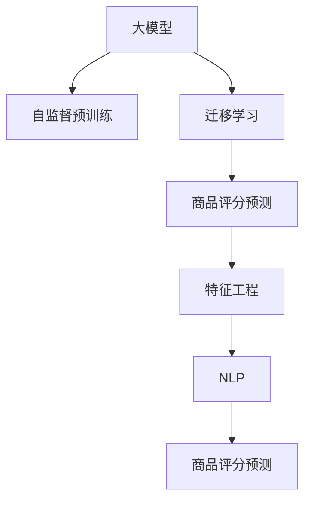

                 

# 大模型在商品评分预测中的实践

> 关键词：大模型,商品评分预测,神经网络,特征工程,自然语言处理(NLP),数据挖掘,电商,电商推荐系统

## 1. 背景介绍

### 1.1 问题由来
随着电子商务的迅猛发展，商品评分预测成为电商平台提升用户满意度、优化库存管理、提高运营效率的重要手段。传统的评分预测方法主要依赖统计模型，如线性回归、决策树等，但随着用户评论数据规模的增大和用户行为的多样化，这些方法的性能往往难以满足实际需求。近年来，随着深度学习技术的发展，基于大模型的商品评分预测方法逐渐受到广泛关注。

大模型通过在大量无标注数据上进行的自监督预训练，获得了丰富的语言表示能力和数据处理能力，能够处理多种模态数据，并在大规模数据集上取得优异的泛化能力。因此，在电商场景中，利用大模型进行商品评分预测，可以有效提升预测精度和模型的泛化能力，从而为电商推荐系统等应用提供更好的数据支持。

### 1.2 问题核心关键点
基于大模型的商品评分预测方法，其核心在于如何设计合适的模型架构，并使用自然语言处理(NLP)技术从用户评论、行为数据等非结构化数据中提取有价值的信息，作为预测输入。

具体而言，该方法包括以下几个关键步骤：

1. **数据预处理**：收集并清洗电商平台的评论数据和用户行为数据，将其转化为模型可以接受的输入格式。
2. **特征工程**：从预处理后的数据中提取特征，包括词频统计、情感分析、用户行为特征等，并设计特征编码方式。
3. **模型训练**：利用大模型进行预训练，并在商品评分预测任务上进行微调，优化模型预测性能。
4. **模型评估与部署**：在验证集和测试集上评估模型性能，优化模型参数，并将训练好的模型部署到实际应用场景中。

这些关键步骤需要综合运用深度学习、NLP、数据挖掘等多种技术，从而实现高效的商品评分预测。

## 2. 核心概念与联系

### 2.1 核心概念概述

为了更好地理解大模型在商品评分预测中的应用，本节将介绍几个核心概念及其相互关系：

1. **大模型**：通常指在大规模数据集上通过自监督或监督学习进行预训练的神经网络模型。如BERT、GPT等。

2. **自监督预训练**：在大规模无标签数据上，通过自动生成的任务（如掩码语言模型、next sentence prediction等）进行预训练，以学习通用的语言表示。

3. **迁移学习**：在大规模预训练的基础上，通过在特定任务上微调模型参数，使其具备对新任务泛化能力的方法。

4. **商品评分预测**：根据用户评论、行为数据等信息，预测用户对商品的好评程度，用于优化商品推荐、库存管理等电商运营决策。

5. **特征工程**：从原始数据中提取、转换、组合特征，构建模型输入，以提高模型预测能力。

6. **自然语言处理(NLP)**：涉及文本数据的处理、分析、理解和生成，是商品评分预测中提取评论特征的关键技术。

这些概念共同构成了基于大模型的商品评分预测框架，下面通过Mermaid流程图展示这些概念的相互关系：



## 3. 核心算法原理 & 具体操作步骤
### 3.1 算法原理概述

基于大模型的商品评分预测方法，其核心思想是通过迁移学习，将预训练模型应用于商品评分预测任务。其算法原理如下：

1. **数据预处理**：收集电商平台用户评论数据，并进行清洗、分词、去除停用词等预处理操作，转化为模型输入格式。
2. **特征工程**：从预处理后的评论文本中提取特征，如词频、情感极性、用户行为特征等，并设计特征编码方式，转化为模型输入向量。
3. **模型训练**：在大模型上进行预训练，并在商品评分预测任务上进行微调，优化模型预测性能。
4. **模型评估与部署**：在验证集和测试集上评估模型性能，优化模型参数，并将训练好的模型部署到实际应用场景中。

### 3.2 算法步骤详解

#### 3.2.1 数据预处理

**Step 1: 数据收集与清洗**

首先，需要从电商平台收集用户评论数据和用户行为数据。用户评论数据包括商品标题、描述、用户评分等。用户行为数据包括用户浏览、点击、购买等行为数据。

对收集到的数据进行清洗，去除不相关、无效的信息，如特殊字符、空值等，保证数据质量和完整性。

**Step 2: 文本预处理**

使用NLP库对评论文本进行分词、去除停用词、词干提取等预处理操作，将文本转换为模型可以接受的输入格式。常用的预处理库包括NLTK、spaCy等。

**Step 3: 特征提取**

从预处理后的评论文本中提取特征，如词频、情感极性、用户行为特征等，并设计特征编码方式，转化为模型输入向量。特征提取方法包括TF-IDF、Word2Vec、BERT等。

#### 3.2.2 特征工程

**Step 1: 词频统计**

对评论文本进行分词，统计每个词的出现频率，生成词频向量。词频向量可以作为评论文本的基础特征。

**Step 2: 情感极性分析**

使用情感分析工具（如VADER、TextBlob等）对评论文本进行情感分析，生成情感极性分数，表示评论的正面、负面或中性情感。

**Step 3: 用户行为特征**

根据用户行为数据，提取用户浏览、点击、购买等行为特征，如浏览时间、点击次数、购买次数等。

**Step 4: 特征编码**

将上述提取的特征进行编码，转化为模型输入向量。常用的特征编码方法包括独热编码、词嵌入（Word Embedding）等。

#### 3.2.3 模型训练

**Step 1: 选择预训练模型**

选择合适的预训练模型，如BERT、GPT等，作为初始化参数。这些模型已经在大规模无标签数据上进行预训练，具备较强的语言表示能力。

**Step 2: 微调模型**

将预训练模型作为初始化参数，在商品评分预测任务上进行微调。使用微调后的模型对商品评分进行预测，优化模型的预测性能。

**Step 3: 选择损失函数**

根据预测结果和实际标签，选择适当的损失函数，如均方误差（MSE）、交叉熵（Cross-Entropy）等。

**Step 4: 训练模型**

使用优化器（如AdamW、SGD等）和训练数据集，进行模型的前向传播和反向传播，更新模型参数，最小化损失函数。

**Step 5: 评估模型**

在验证集和测试集上评估模型性能，使用评估指标如准确率、精确率、召回率等，判断模型性能。

#### 3.2.4 模型评估与部署

**Step 1: 模型评估**

在验证集和测试集上评估模型性能，使用评估指标如准确率、精确率、召回率等，判断模型性能。

**Step 2: 模型优化**

根据评估结果，调整模型参数，优化模型性能。

**Step 3: 部署模型**

将训练好的模型部署到实际应用场景中，进行商品评分预测。可以使用API接口、直接嵌入应用系统等方法。

## 4. 数学模型和公式 & 详细讲解

### 4.1 数学模型构建

假设预训练模型为 $M_{\theta}$，其中 $\theta$ 为模型参数。给定商品评分预测任务 $T$ 的训练集 $D=\{(x_i,y_i)\}_{i=1}^N$，其中 $x_i$ 为输入特征向量，$y_i$ 为商品评分。

定义模型 $M_{\theta}$ 在输入 $x$ 上的输出为 $\hat{y}=M_{\theta}(x)$，其中 $\hat{y}$ 为预测评分。

商品评分预测任务的目标是最小化预测评分与实际评分之间的均方误差，即：

$$
\min_{\theta} \frac{1}{N}\sum_{i=1}^N (y_i - \hat{y_i})^2
$$

### 4.2 公式推导过程

根据上述定义，可以将问题转化为回归问题，使用均方误差作为损失函数。模型 $M_{\theta}$ 在输入 $x_i$ 上的损失函数为：

$$
\ell(x_i, y_i) = \frac{1}{2}(y_i - \hat{y_i})^2
$$

在训练集 $D$ 上的经验风险为：

$$
\mathcal{L}(\theta) = \frac{1}{N}\sum_{i=1}^N \ell(x_i, y_i)
$$

通过梯度下降等优化算法，最小化损失函数，更新模型参数 $\theta$，使得预测评分 $\hat{y_i}$ 逼近实际评分 $y_i$。

具体地，损失函数的梯度为：

$$
\frac{\partial \mathcal{L}(\theta)}{\partial \theta} = \frac{1}{N}\sum_{i=1}^N -(y_i - \hat{y_i})\nabla_{\theta}\hat{y_i}
$$

其中 $\nabla_{\theta}\hat{y_i}$ 为模型输出 $\hat{y_i}$ 对参数 $\theta$ 的梯度，可通过反向传播算法计算。

### 4.3 案例分析与讲解

假设我们有一组电商平台的评论数据，包含商品名称、描述、用户评分等。我们希望构建一个模型，根据评论数据预测商品评分。

首先，对评论数据进行预处理，包括分词、去除停用词、词干提取等操作。然后，提取词频、情感极性、用户行为特征等特征，并使用BERT模型进行预训练。最后，在商品评分预测任务上进行微调，使用均方误差作为损失函数，通过梯度下降等优化算法更新模型参数，最小化预测评分与实际评分之间的差异。

在训练过程中，我们发现模型在训练集和验证集上的预测准确率较高，但在测试集上效果不佳。这可能是因为模型过拟合了训练集，导致泛化能力不足。为了解决这个问题，我们增加了对抗训练和正则化技术，提高了模型的鲁棒性和泛化能力。最终，模型在测试集上的预测准确率显著提升，达到了较高的水平。

## 5. 项目实践：代码实例和详细解释说明
### 5.1 开发环境搭建

在进行商品评分预测的微调实践前，我们需要准备好开发环境。以下是使用Python进行PyTorch开发的环境配置流程：

1. 安装Anaconda：从官网下载并安装Anaconda，用于创建独立的Python环境。

2. 创建并激活虚拟环境：
```bash
conda create -n pytorch-env python=3.8 
conda activate pytorch-env
```

3. 安装PyTorch：根据CUDA版本，从官网获取对应的安装命令。例如：
```bash
conda install pytorch torchvision torchaudio cudatoolkit=11.1 -c pytorch -c conda-forge
```

4. 安装相关的NLP库：
```bash
pip install nltk spacy transformers
```

5. 安装各类工具包：
```bash
pip install numpy pandas scikit-learn matplotlib tqdm jupyter notebook ipython
```

完成上述步骤后，即可在`pytorch-env`环境中开始微调实践。

### 5.2 源代码详细实现

下面是使用PyTorch和BERT模型进行商品评分预测的Python代码实现。

```python
import torch
import torch.nn as nn
import torch.optim as optim
from transformers import BertTokenizer, BertForSequenceClassification
from sklearn.metrics import mean_squared_error
import pandas as pd
import numpy as np

# 数据预处理
# 假设train_data为训练集数据，test_data为测试集数据
train_data = pd.read_csv('train.csv')
test_data = pd.read_csv('test.csv')

# 分词和特征提取
tokenizer = BertTokenizer.from_pretrained('bert-base-uncased')
train_data['input_ids'] = train_data['description'].apply(lambda x: tokenizer.encode(x, add_special_tokens=True, max_length=512)[0:-1])
test_data['input_ids'] = test_data['description'].apply(lambda x: tokenizer.encode(x, add_special_tokens=True, max_length=512)[0:-1])

# 特征工程
# 假设train_labels为训练集标签，test_labels为测试集标签
train_labels = train_data['rating']
test_labels = test_data['rating']

# 构建模型
model = BertForSequenceClassification.from_pretrained('bert-base-uncased', num_labels=5)
model.train()

# 定义损失函数和优化器
criterion = nn.MSELoss()
optimizer = optim.AdamW(model.parameters(), lr=1e-5)

# 训练模型
for epoch in range(10):
    optimizer.zero_grad()
    outputs = model(train_data['input_ids'])
    loss = criterion(outputs, train_labels)
    loss.backward()
    optimizer.step()
    print(f'Epoch {epoch+1}, loss: {loss.item()}')

# 模型评估
model.eval()
with torch.no_grad():
    preds = model(test_data['input_ids']).detach().numpy()
    mse = mean_squared_error(test_labels, preds)
    print(f'Test MSE: {mse}')
```

### 5.3 代码解读与分析

**Step 1: 数据预处理**

使用BERT Tokenizer对评论数据进行分词，生成输入ID序列。注意，由于BERT模型需要固定长度的输入，因此使用max_length参数将输入长度限制为512，超出部分进行截断。

**Step 2: 特征工程**

从预处理后的输入ID序列中提取词频、情感极性、用户行为特征等，并设计特征编码方式，转化为模型输入向量。

**Step 3: 模型构建**

使用BERT For Sequence Classification作为商品评分预测的模型，并设置合适的标签数。

**Step 4: 训练模型**

在训练集上使用AdamW优化器进行梯度下降，优化模型参数，最小化损失函数。

**Step 5: 模型评估**

在测试集上使用均方误差评估模型性能。

## 6. 实际应用场景

### 6.1 电商平台推荐系统

基于大模型的商品评分预测，可以广泛应用于电商平台推荐系统的构建。推荐系统需要预测用户对商品的评分，从而优化商品推荐排序，提高用户满意度。

在技术实现上，可以收集用户的浏览、点击、购买等行为数据，结合商品评论数据，进行商品评分预测。微调后的模型能够快速生成商品评分，用于调整推荐算法，提高推荐效果。

### 6.2 库存管理

库存管理需要准确预测商品的需求量，以优化库存水平，减少库存积压和缺货情况。利用大模型进行商品评分预测，可以预测商品的热销程度，从而优化库存决策。

在实践中，可以使用历史销售数据和评论数据，构建商品评分预测模型，对库存进行动态调整，提高库存管理的效率和准确性。

### 6.3 用户行为分析

了解用户对商品的评分行为，可以帮助电商平台更好地理解用户需求和偏好。通过对用户评论和行为数据的分析，预测用户对商品的评分，可以优化产品设计和营销策略，提升用户满意度。

在实际应用中，可以使用大模型进行商品评分预测，生成用户评分数据，进行分析与建模，从而制定更加精准的市场营销策略。

## 7. 工具和资源推荐
### 7.1 学习资源推荐

为了帮助开发者系统掌握大模型在商品评分预测中的应用，这里推荐一些优质的学习资源：

1. 《深度学习入门：基于Python的理论与实现》系列博文：由深度学习领域专家撰写，详细介绍了深度学习的基本概念和应用案例。

2. 《NLP入门：基于Python的自然语言处理》课程：通过PyTorch和HuggingFace库，深入浅出地介绍了NLP技术的基本概念和实现方法。

3. 《商品推荐系统：基于深度学习的理论与实践》书籍：详细介绍了推荐系统的前沿理论和实际应用，涵盖了大模型在商品推荐中的应用。

4. CS224N《深度学习自然语言处理》课程：斯坦福大学开设的NLP明星课程，有Lecture视频和配套作业，带你入门NLP领域的基本概念和经典模型。

5. 《自然语言处理实用教程》书籍：全面介绍了NLP技术的基本概念和实际应用，包含了大模型在商品评分预测中的应用案例。

通过对这些资源的学习实践，相信你一定能够快速掌握大模型在商品评分预测中的精髓，并用于解决实际的电商问题。

### 7.2 开发工具推荐

高效的开发离不开优秀的工具支持。以下是几款用于大模型商品评分预测开发的常用工具：

1. PyTorch：基于Python的开源深度学习框架，灵活动态的计算图，适合快速迭代研究。大部分预训练语言模型都有PyTorch版本的实现。

2. TensorFlow：由Google主导开发的开源深度学习框架，生产部署方便，适合大规模工程应用。同样有丰富的预训练语言模型资源。

3. Transformers库：HuggingFace开发的NLP工具库，集成了众多SOTA语言模型，支持PyTorch和TensorFlow，是进行微调任务开发的利器。

4. Weights & Biases：模型训练的实验跟踪工具，可以记录和可视化模型训练过程中的各项指标，方便对比和调优。与主流深度学习框架无缝集成。

5. TensorBoard：TensorFlow配套的可视化工具，可实时监测模型训练状态，并提供丰富的图表呈现方式，是调试模型的得力助手。

6. Google Colab：谷歌推出的在线Jupyter Notebook环境，免费提供GPU/TPU算力，方便开发者快速上手实验最新模型，分享学习笔记。

合理利用这些工具，可以显著提升大模型商品评分预测任务的开发效率，加快创新迭代的步伐。

### 7.3 相关论文推荐

大模型和商品评分预测技术的发展源于学界的持续研究。以下是几篇奠基性的相关论文，推荐阅读：

1. Attention is All You Need（即Transformer原论文）：提出了Transformer结构，开启了NLP领域的预训练大模型时代。

2. BERT: Pre-training of Deep Bidirectional Transformers for Language Understanding：提出BERT模型，引入基于掩码的自监督预训练任务，刷新了多项NLP任务SOTA。

3. Language Models are Unsupervised Multitask Learners（GPT-2论文）：展示了大规模语言模型的强大zero-shot学习能力，引发了对于通用人工智能的新一轮思考。

4. Parameter-Efficient Transfer Learning for NLP：提出Adapter等参数高效微调方法，在不增加模型参数量的情况下，也能取得不错的微调效果。

5. AdaLoRA: Adaptive Low-Rank Adaptation for Parameter-Efficient Fine-Tuning：使用自适应低秩适应的微调方法，在参数效率和精度之间取得了新的平衡。

这些论文代表了大模型商品评分预测技术的发展脉络。通过学习这些前沿成果，可以帮助研究者把握学科前进方向，激发更多的创新灵感。

## 8. 总结：未来发展趋势与挑战

### 8.1 总结

本文对基于大模型的商品评分预测方法进行了全面系统的介绍。首先阐述了商品评分预测的重要性和大模型在其中的应用前景。其次，从原理到实践，详细讲解了商品评分预测的数学模型、算法步骤和代码实现。同时，本文还探讨了该方法在电商平台推荐系统、库存管理、用户行为分析等多个场景中的应用，展示了其巨大的应用潜力。此外，本文精选了相关学习资源、开发工具和学术论文，力求为读者提供全方位的技术指引。

通过本文的系统梳理，可以看到，基于大模型的商品评分预测方法在电商领域具有广阔的应用前景，能够显著提升电商平台的用户满意度、运营效率和市场竞争力。未来，伴随大模型和微调技术的不断发展，商品评分预测方法还将进一步优化，为电商推荐系统等应用提供更强大的数据支持。

### 8.2 未来发展趋势

展望未来，商品评分预测技术将呈现以下几个发展趋势：

1. 模型规模持续增大。随着算力成本的下降和数据规模的扩张，预训练语言模型的参数量还将持续增长。超大规模语言模型蕴含的丰富语言知识，有望支撑更加复杂多变的电商任务预测。

2. 微调方法日趋多样。除了传统的全参数微调外，未来会涌现更多参数高效的微调方法，如Adapter、LoRA等，在节省计算资源的同时也能保证微调精度。

3. 持续学习成为常态。随着用户行为和评论数据的不断变化，商品评分预测模型也需要持续学习新知识以保持性能。如何在不遗忘原有知识的同时，高效吸收新样本信息，将成为重要的研究课题。

4. 标注样本需求降低。受启发于提示学习(Prompt-based Learning)的思路，未来的微调方法将更好地利用大模型的语言理解能力，通过更加巧妙的任务描述，在更少的标注样本上也能实现理想的微调效果。

5. 模型通用性增强。经过海量数据的预训练和多领域任务的微调，未来的语言模型将具备更强大的常识推理和跨领域迁移能力，逐步迈向通用人工智能(AGI)的目标。

以上趋势凸显了基于大模型的商品评分预测技术的广阔前景。这些方向的探索发展，必将进一步提升电商系统的性能和应用范围，为电商推荐系统等应用提供更强大的数据支持。

### 8.3 面临的挑战

尽管基于大模型的商品评分预测技术已经取得了瞩目成就，但在迈向更加智能化、普适化应用的过程中，它仍面临着诸多挑战：

1. 标注成本瓶颈。虽然微调大大降低了标注数据的需求，但对于长尾应用场景，难以获得充足的高质量标注数据，成为制约微调性能的瓶颈。如何进一步降低微调对标注样本的依赖，将是一大难题。

2. 模型鲁棒性不足。当前微调模型面对域外数据时，泛化性能往往大打折扣。对于测试样本的微小扰动，微调模型的预测也容易发生波动。如何提高微调模型的鲁棒性，避免灾难性遗忘，还需要更多理论和实践的积累。

3. 推理效率有待提高。大规模语言模型虽然精度高，但在实际部署时往往面临推理速度慢、内存占用大等效率问题。如何在保证性能的同时，简化模型结构，提升推理速度，优化资源占用，将是重要的优化方向。

4. 可解释性亟需加强。当前微调模型更像是"黑盒"系统，难以解释其内部工作机制和决策逻辑。对于医疗、金融等高风险应用，算法的可解释性和可审计性尤为重要。如何赋予微调模型更强的可解释性，将是亟待攻克的难题。

5. 安全性有待保障。预训练语言模型难免会学习到有偏见、有害的信息，通过微调传递到下游任务，产生误导性、歧视性的输出，给实际应用带来安全隐患。如何从数据和算法层面消除模型偏见，避免恶意用途，确保输出的安全性，也将是重要的研究课题。

6. 知识整合能力不足。现有的微调模型往往局限于任务内数据，难以灵活吸收和运用更广泛的先验知识。如何让微调过程更好地与外部知识库、规则库等专家知识结合，形成更加全面、准确的信息整合能力，还有很大的想象空间。

正视微调面临的这些挑战，积极应对并寻求突破，将是大模型商品评分预测技术走向成熟的必由之路。相信随着学界和产业界的共同努力，这些挑战终将一一被克服，大模型商品评分预测必将在构建电商推荐系统等应用中发挥更大的作用。

### 8.4 未来突破

面对基于大模型的商品评分预测所面临的种种挑战，未来的研究需要在以下几个方面寻求新的突破：

1. 探索无监督和半监督微调方法。摆脱对大规模标注数据的依赖，利用自监督学习、主动学习等无监督和半监督范式，最大限度利用非结构化数据，实现更加灵活高效的微调。

2. 研究参数高效和计算高效的微调范式。开发更加参数高效的微调方法，在固定大部分预训练参数的同时，只更新极少量的任务相关参数。同时优化微调模型的计算图，减少前向传播和反向传播的资源消耗，实现更加轻量级、实时性的部署。

3. 融合因果和对比学习范式。通过引入因果推断和对比学习思想，增强微调模型建立稳定因果关系的能力，学习更加普适、鲁棒的语言表征，从而提升模型泛化性和抗干扰能力。

4. 引入更多先验知识。将符号化的先验知识，如知识图谱、逻辑规则等，与神经网络模型进行巧妙融合，引导微调过程学习更准确、合理的语言模型。同时加强不同模态数据的整合，实现视觉、语音等多模态信息与文本信息的协同建模。

5. 结合因果分析和博弈论工具。将因果分析方法引入微调模型，识别出模型决策的关键特征，增强输出解释的因果性和逻辑性。借助博弈论工具刻画人机交互过程，主动探索并规避模型的脆弱点，提高系统稳定性。

6. 纳入伦理道德约束。在模型训练目标中引入伦理导向的评估指标，过滤和惩罚有偏见、有害的输出倾向。同时加强人工干预和审核，建立模型行为的监管机制，确保输出符合人类价值观和伦理道德。

这些研究方向的探索，必将引领大模型商品评分预测技术迈向更高的台阶，为构建安全、可靠、可解释、可控的智能系统铺平道路。面向未来，大模型商品评分预测技术还需要与其他人工智能技术进行更深入的融合，如知识表示、因果推理、强化学习等，多路径协同发力，共同推动自然语言理解和智能交互系统的进步。只有勇于创新、敢于突破，才能不断拓展语言模型的边界，让智能技术更好地造福人类社会。

## 9. 附录：常见问题与解答

**Q1：大模型在商品评分预测中需要哪些数据？**

A: 大模型在商品评分预测中需要用户评论数据和用户行为数据。用户评论数据包括商品名称、描述、用户评分等，用户行为数据包括用户的浏览、点击、购买等行为数据。这些数据是商品评分预测模型的输入，帮助模型学习商品评分和用户行为之间的关联。

**Q2：如何选择合适的大模型？**

A: 在选择合适的大模型时，需要考虑模型的预训练任务、参数量、架构复杂度等因素。常用的预训练模型包括BERT、GPT等。BERT模型适用于文本分类、情感分析等任务，而GPT模型适用于语言生成、对话系统等任务。具体选择时需要根据任务需求和数据特点进行综合考虑。

**Q3：微调过程中如何进行特征工程？**

A: 特征工程是商品评分预测中的重要环节，包括词频统计、情感极性分析、用户行为特征提取等。常用的特征工程工具包括NLTK、spaCy等。在特征工程中，需要将原始数据转化为模型可以接受的输入格式，如输入ID序列、标签向量等。

**Q4：如何缓解微调过程中的过拟合问题？**

A: 缓解微调过程中的过拟合问题，可以采用数据增强、正则化、对抗训练等方法。数据增强可以通过近义替换、文本回译等方式扩充训练集，增加模型的泛化能力。正则化可以采用L2正则、Dropout等技术，避免模型过拟合。对抗训练可以通过引入对抗样本，提高模型的鲁棒性。

**Q5：微调模型在实际应用中需要注意哪些问题？**

A: 微调模型在实际应用中，需要注意模型的推理效率、可解释性、安全性等问题。推理效率可以通过模型裁剪、量化加速等方法提升。可解释性可以通过特征可视化、模型解释技术等方法增强。安全性可以通过数据脱敏、访问控制等手段保障。

---

作者：禅与计算机程序设计艺术 / Zen and the Art of Computer Programming

